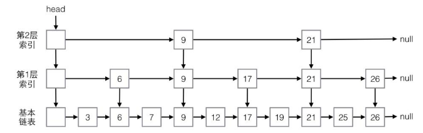

数据结构是为算法服务的。最近对这句话有了更深的理解，特别是在研究跳表、图和树的存储与遍历时，这种理解更加深刻。以下内容将围绕跳表的设计与实现、图与树的存储及遍历展开，探讨数据结构如何服务于算法。

---

## 目录

1. [跳表：快速查找、插入与删除](#跳表快速查找插入与删除)
   - 跳表的基本概念
   - 跳表的数据结构设计
   - 跳表的优势与应用场景
2. [图的存储与遍历 VS 树的存储与遍历](#图的存储与遍历-vs-树的存储与遍历)
   - 图的存储方式
   - 树的存储方式
   - 遍历算法的异同
3. [总结](#总结)

---

## 跳表：快速查找、插入与删除

### 跳表的基本概念

跳表（Skip List）是一种基于链表的数据结构，支持快速的插入、删除和查找操作，其平均时间复杂度为 \(O(\log n)\)，最差情况下也保持 \(O(\log n)\) 的性能（退化为普通链表时）。跳表通过多层链表结构实现高效的搜索路径优化，类似于二分查找的思想。



### 跳表的数据结构设计

跳表本质上是一个链表，但每个节点除了存储数据外，还包含多个指针（黑色小圆点），用于指向不同层级的下一个节点。以下是跳表节点的基本数据结构：

```js
class Node {
    constructor() {
        this.data = -1; // 数据
        this.forwards = new Array(this.MAX_LEVEL); // 黑色小圆点（指针数组）
        this.maxLevel = 0; // 当前节点的最大层级
    }
}
```

在实现插入和删除操作时，需要一个辅助数据结构——`update` 数组，用于存储搜索路径。`update` 数组的长度等于跳表的层级大小，其作用是记录当前搜索位置以及每层的下一个节点指针，从而便于调整指针关系。

> **关键点**：  
> - `forwards` 数组的设计是为了实现多层级的指针跳跃。  
> - `update` 数组的设计是为了保存搜索路径，确保插入和删除操作的正确性。

### 跳表的优势与应用场景

相比红黑树和哈希表，跳表有以下优势：
- **有序性**：跳表能保证节点的有序性，因此在范围查找场景中表现更优。
- **实现简单**：相比红黑树，跳表的实现逻辑更为直观。
- **高效性**：跳表的时间复杂度与红黑树相当，但在某些场景下性能更稳定。

跳表的应用场景包括：
- 数据库索引（如 Redis 的 ZSet 实现）。
- 替代邻接表中的链表，提升图的查询效率。

---

## 图的存储与遍历 VS 树的存储与遍历

### 图的存储方式

图的存储通常有两种方式：邻接表和邻接矩阵。

#### 邻接表（数组 + 链表）

邻接表使用数组存储每个顶点，每个顶点对应一个链表，链表中存储与该顶点相邻的顶点信息。

```js
class Graph {
    constructor(v) {
        this.v = v; // 顶点数
        this.adj = new Array(v); // 邻接表（数组）
        for (let i = 0; i < v; ++i) {
            this.adj[i] = new LinkedList(); // 链表或跳表
        }
    }
}
```

#### 邻接矩阵（二维数组）

邻接矩阵使用二维数组存储顶点之间的连接关系，适合稠密图。

```js
class Graph {
    constructor(v) {
        this.v = v; // 顶点数
        this.adj = new Array(v); // 邻接矩阵（二维数组）
        for (let i = 0; i < v; ++i) {
            this.adj[i] = [];
        }
    }
}
```

### 树的存储方式

树的存储相对简单，可以通过变量存储左右子节点指针，或者用数组存储子节点信息。

```js
class TreeNode {
    constructor(value) {
        this.value = value;
        this.left = null; // 左子节点
        this.right = null; // 右子节点
    }
}
```

### 遍历算法的异同

#### 树的遍历

树的遍历分为广度优先遍历（BFS）和深度优先遍历（DFS）：
- **广度优先遍历（BFS）**：按层遍历，类似逐层查看房间。实现时需要借助队列作为辅助数据结构。
- **深度优先遍历（DFS）**：一条路走到黑，走完后回溯再走另一条路。树的前序、中序、后序遍历都属于深度优先遍历。

#### 图的遍历

图的遍历同样可以采用 BFS 和 DFS，但由于图可能存在环，因此需要借助 `visited` 数组来标记已访问的节点，避免重复访问。

- **广度优先遍历（BFS）**：与树类似，需要借助队列存储每层的节点。
- **深度优先遍历（DFS）**：与树类似，但需要额外处理环的情况。

#### 辅助数据结构的作用

- **队列**：用于 BFS，保持遍历顺序并存储每层节点。
- **`visited` 数组**：用于图的遍历，标记已访问节点，避免环导致死循环。
- **`prev` 数组**（可选）：用于保存访问路径，方便后续分析。

---

## 总结

数据结构与算法的关系密不可分，数据结构是为算法服务的。通过研究跳表、图和树的存储与遍历，我们可以得出以下结论：
1. **数据结构的设计服务于算法需求**：例如跳表中的 `forwards` 和 `update` 数组，分别满足了多层级指针跳跃和搜索路径保存的需求。
2. **简单的数据结构可以实现复杂的算法**：例如邻接表和队列的结合，能够轻松实现图的 BFS 和 DFS。
3. **深入理解数据结构和算法**：只有对数据结构和算法都有深刻的理解，才能写出高效、优雅的代码。