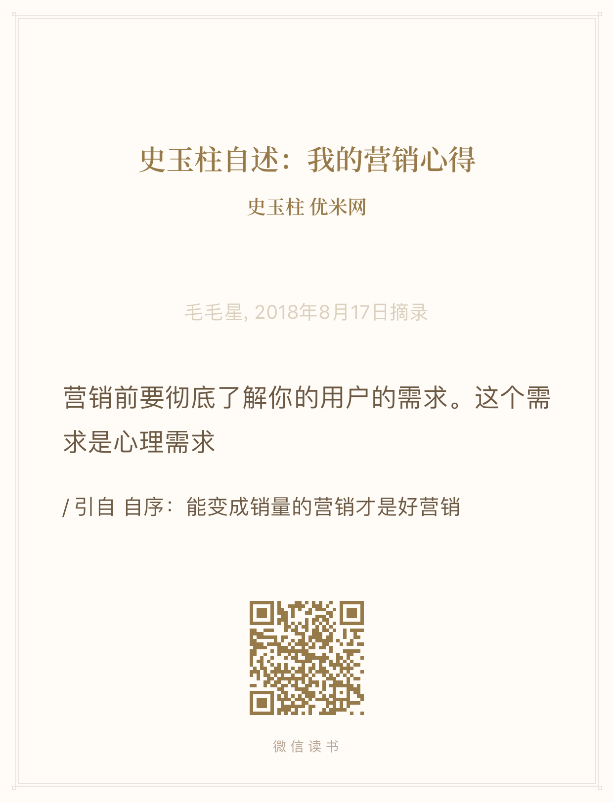

> 一个新的产品没有获得一个自然的增长曲线，我们就不应该去推广它

> 产品立足点, 不要空谈生态把战略放嘴边。生态不是一家公司做很多业务，不是产业链通吃，而是大家一起在里面能茁壮成长 有花有草 - 周鸿祎

> 在马云最初构建中国黄页的时候，他深知自己正在创造一些与众不同的东西。这种信念和远见不仅推动了他的成功，也为今天的我们提供了宝贵的启发。

> 你在豪赌，但赌注在你自己身上 - 风骚律师

> Basecamp: 我们一直致力于让 Basecamp 成为一家平静的公司。我们不提出不可能的承诺，不追求高额的营业额，不设置最后期限，不人为制造繁忙的工作和系统性的焦虑。有些项目似乎永远不会结束，我们觉得也 OK

---

## **前瞻性思考：预见未来，解决问题**

> 过度追求如何**最好地解决一个问题**，而忽略了更重要的一点——**解决更多的问题**。

- **核心观点**  
  - 要有前瞻性思考，提前预见问题并做好准备。  
  > "有些问题在发展中就被解决了。"  
  - 很多问题并非需要立即解决，而是在发展的过程中自然迎刃而解。  

- **关键点**  
  - 前瞻性思考是一种能力，能够帮助你在复杂的环境中抓住机会、规避风险。  
  - 学会从长远的角度看待问题，避免被眼前的困难束缚。

---

## 销售 **最初一批用户的获取：从小猿搜题开始**

### 人性

- **利用人性总是能赚到钱**  
  - 人性中对某些概念的渴望和追求，常常被用来引导消费或行为。  
  - **案例：学英语**  
    - 社会灌输了"学英语是成功的关键"这一概念，导致人们对英语学习趋之若鹜。  
  - **案例：学区房**  
    - 教育的概念被强化后，人们对学区房的需求变得狂热。  

- **如何认识人性？**  
  - 观察人们的行为模式，分析背后的驱动力。  
  - 思考：为什么某些概念会被广泛接受？这些概念是如何影响大众行为的？

### 1.1 广告投放的起点

- **小猿搜题的广告策略**：最初的一批用户是通过在小猿搜题上投放广告获取的。这种精准的广告投放帮助产品快速触达目标用户群体。
- **效果显著**：这种方式不仅成本较低，还能够迅速积累种子用户，为后续发展奠定了基础。

### 1.2 用户增长的转折点

- **被“玩坏”的过程**：随着用户数量的增长，部分用户行为逐渐偏离了产品的初衷，导致用户体验和品牌形象受到一定影响。
- **反思与调整**：这一阶段暴露了产品在用户管理和运营上的不足，促使团队重新审视用户需求，并优化产品功能和规则。

## 2. **抖音的崛起：第一批网红的诞生**

### 2.1 自己运营的必要性

- **初期冷启动难题**：在抖音发展的早期，平台上几乎没有活跃用户，更别提所谓的“网红”了。
- **主动出击**：为了打破僵局，抖音团队选择自己运营第一批网红，通过内部员工或合作对象制作内容，带动平台氛围。

### 2.2 “没人玩就自己玩”的精神

- **以身作则**：抖音团队亲自参与内容创作，用实际行动证明平台的价值和潜力。
- **示范效应**：这些由官方扶持的内容创作者成为了其他用户的榜样，激发了更多人加入创作行列。

读史玉柱自传总结：

## 1. 营销：自己琢磨，找到独特路径

- **自主探索**：营销没有固定的公式，必须根据自身产品、市场环境和目标用户的特点，自己琢磨出适合的策略。
- **创新思维**：避免盲目模仿他人，找到差异化的营销方式，才能在竞争中脱颖而出。
- **数据驱动**：通过数据分析不断优化营销策略，确保每一步都基于实际效果而非主观猜测。

## 2. 创业：专注一个方向，坚定执行

### 2.1 主攻一个方向

- **聚焦核心业务**：创业资源有限，必须集中精力主攻一个方向，避免分散注意力。
- **明确目标**：清晰定义企业的使命和愿景，确保所有努力都围绕这一目标展开。

### 2.2 决策民主，执行坚定

- **民主决策**：在制定战略时，充分听取团队的意见，确保决策科学合理。
- **坚定执行**：一旦决策确定，就要全力以赴地推进，不轻易动摇或改变方向。
- **快速迭代**：在执行过程中，保持灵活性，及时调整细节，但始终坚守核心目标。

## 3. 团队建设：选人要"又红又专"

### 3.1 "红"：价值观契合

- **文化认同**：选择认同企业文化和价值观的人才，确保团队凝聚力。
- **责任心强**：优先考虑有强烈责任感和使命感的候选人，他们更愿意为共同目标奋斗。

### 3.2 "专"：专业能力过硬

- **技能匹配**：确保团队成员具备完成岗位任务所需的专业技能。
- **持续学习**：鼓励团队成员不断提升自己，适应快速变化的市场环境。

作为一名电话推销员，成功的关键不仅在于产品本身，还在于你传递信息的方式和态度。以下是一些关于如何通过声音和心态赢得客户的建议。

## 1. 心态调整：自信与从容

### 1.1 账单已付清的心态

- **心理暗示**：在拨打电话之前，告诉自己“账单已付清”，无论这通电话的结果如何，你的生活都不会受到影响。
- **真正的呼吸感**：用一种轻松、自然的语气说话，仿佛这笔交易对你来说无关紧要。例如：
  - “我其实不需要这笔钱。”
  - 这种态度会让客户感受到你的自信，而不是压力。

### 1.2 对未来充满希望

- **积极情绪**：让客户感受到你对未来的乐观和期待。例如：
  - “这通电话结束以后，我随时准备跳进自己的法拉利跑车。”
  - 即使你没有法拉利，这种积极的态度会感染客户，让他们觉得与你交谈是一种愉悦的体验。

## 2. 声音的魅力：成为别人希望拥有的声音

### 2.1 自信而温暖的声音

- **语调控制**：保持语速适中，声音清晰且富有节奏感。避免过于急促或单调的语气。
- **微笑的力量**：即使客户看不到你的表情，微笑会让你的声音听起来更温暖、更有亲和力。

### 2.2 成为榜样般的声音

- **目标**：让你的声音成为客户希望自己拥有的声音。例如：
  - 坚定但不咄咄逼人。
  - 温暖但不失专业。
- **练习方法**：录音并回听自己的声音，找出需要改进的地方。

## 3. 实践技巧：如何在电话中表现得游刃有余

### 3.1 开场白设计

- **示例**：
  - “您好，我是[你的名字]，今天打电话是想和您分享一个可能对您非常有价值的机会。”
  - 注意语气轻松，不要让客户感到被强迫。

### 3.2 应对拒绝

- **从容应对**：如果客户表示拒绝，用平和的语气回应：
  - “完全理解，如果您有任何需求，随时可以联系我。”
  - 不要表现出失望或沮丧，而是保持专业和礼貌。

### 3.3 强化信任感

- **语言技巧**：使用积极的语言和具体的例子来增强说服力。例如：
- “我们的许多客户都反馈说，这个方案帮助他们节省了大量时间和成本。”

> 产品的文案：要具有传播性或者话题性
> 让其他人讨论：比如东半球最好用的手机 非常重要

> 企业家一定要小心。特别是在媒体面前。
> 差异化的东西，才能形成竞争力。

---

## 设计

在产品设计、广告宣传以及用户沟通中，"**Less is More**" 是一条黄金法则。以下内容从简洁性、用户视角和实用性出发，帮助你更好地理解和应用这一理念。

## 1. **Less is More：越简单越好**

### 1.1 简洁的力量

- **减少认知负担**：用户的时间和注意力有限，过于复杂的设计或信息会让人感到疲惫甚至放弃使用。
- **聚焦核心价值**：去掉冗余元素，突出最重要的功能或信息，让用户快速理解并采取行动。
- **视觉与内容的平衡**：无论是界面设计还是文案撰写，都要追求清晰、直观和高效。

### 1.2 实践建议

- **精简文案**：用最少的文字表达最明确的意思。例如，将“点击这里以获取更多信息”简化为“了解更多”。
- **优化流程**：减少用户的操作步骤，确保每个环节都直接服务于目标。
- **避免过度设计**：不要为了美观而牺牲功能性，保持界面干净整洁。

## 2. **把用户想象成非常小气、智商很低、脾气很差的人**

### 2.1 用户的心理模型

- **小气**：用户不愿意浪费时间、金钱或精力。你的产品必须提供明确的价值，才能让他们愿意投入。
- **智商低**：假设用户对你的产品一无所知，避免使用专业术语或复杂的逻辑。
- **脾气差**：用户没有耐心去研究你的产品。如果他们感到困惑或受挫，可能会立刻离开。

### 2.2 应对策略

- **降低门槛**：让产品易于理解和使用，即使是“零基础”的用户也能快速上手。
- **即时反馈**：在用户操作时提供明确的反馈，避免让他们感到迷茫或不确定。
- **情绪管理**：通过友好的语气、贴心的设计和高效的解决方案，缓解用户的负面情绪。

## 3. **有用 + 广告：价值驱动的传播**

### 3.1 提供真正的价值

- **解决痛点**：广告的核心是告诉用户你的产品能解决什么问题，而不是单纯地推销。
- **实际收益**：强调产品的具体好处，例如节省时间、降低成本或提升效率。
- **案例证明**：通过真实的用户故事或数据来增强说服力。

### 3.2 广告的简洁性

- **一句话讲清楚**：广告文案要直击要害，例如“每天5分钟，轻松学会一门新技能”。
- **视觉冲击力**：用简单的图形或颜色吸引注意力，但不要喧宾夺主。
- **行动号召**：明确告诉用户下一步该做什么，例如“立即注册”或“免费试用”。

---

## 作品

- **核心观点**  
  > “你可以砸钱砸资源砸渠道，但传播的底子永远都是策略和创意，这个解决不好，钱多也没有用。”  

- **关键点**  
  - 资源和渠道固然重要，但没有好的策略和创意，再多的投入也难以奏效。  
  - 创意是沟通的基础，是品牌与消费者建立联系的桥梁。

## **2. 作品的意义：与世界沟通的方式**

- **作品的本质**  
  - 作品不仅是产品本身，更是创作者与世界沟通的方式。  
  - 它是一种态度、一种表达，是对世界的独特诠释。  

- **手艺人精神**  
  - 手艺人意味着缓慢、少量、劳作，背后是对专注、技艺和完美的追求。  
  - **核心理念**：专注做点东西，才对得起时光岁月。

## **3. 消费者洞察：构建场景与心理素描**

### **3.1 构建消费者与商品关联的场景**

- **为什么重要？**  
  - 消费者的购买行为往往发生在特定的场景中。  
  - 广告的核心任务是挖掘这些场景，并让消费者产生共鸣。  

- **如何构建场景？**  
  - 分析消费者的生活状态：乘什么车、住什么房、吃什么？  
  - 探索他们的心理特征：在意什么？在什么情况下会与商品发生关联？  

### **3.2 消费者的社会属性与心理洞察**

- **素描消费者**  
  - 不仅关注人口统计学特征（年龄、性别、收入等），更要深入理解其社会属性和心理需求。  
  - **关键点**：当你能清晰地“画出”消费者的形象时，文案自然就会浮现出来。

## **4. 功能性文案与营销幻象**

### **4.1 功能性文案（Y型文案）**

- **特点**  
  - 像侦探一样事无巨细，找出产品的独特卖点（USP）。  
  - 在此基础上整合出一个强有力的购买动机，并呈现给消费者。  

- **方法论**  
  - 分析事实，提炼卖点，设计说服逻辑。  

### **4.2 营销幻象：情感与情绪的控制**

- **核心观点**  
  > “怎样在这个事实根本不重要的世界里使用说服力。”  
  - 人类很多时候只是“自以为理性”，而营销的本质是情感、情绪和精神的控制。  
  - **比喻**：营销人是制作幻象的催眠师，通过创造情感连接来影响消费者的行为。

## **5. 创意生成：集体脑暴的局限性**

- **集体脑暴的误区**  
  - 很多团队喜欢用集体脑暴来激发创意，但实际上这种方式往往效率低下。  
  - **观察**：集体脑暴通常只在领需求、看 brief 时有用，其他时候可能只是浪费时间和精力。  

- **更好的方式**  
  - 鼓励个体独立思考，深度挖掘消费者洞察。  
  - 在明确方向后，再进行小范围的讨论和优化。

---

## 新东方案例：**1. 创业的投入与专注**

- **全身心投入**  
  > “你要做一个上市公司，总共一两亿美元可能都不够，他说我全部投入了一定有人跟我一起做。”  
  - 创业需要全力以赴，尤其是在资源有限的情况下，创始人的决心和投入至关重要。  

- **专注未来趋势**  
  - **特点**：凡是我不懂，但又认为跟未来发展有巨大关联的事情，就会一头扎进去进行研究。  
  - **案例**：人工智能  
    - 尽管新东方看似与人工智能无直接关联，但俞敏洪深入研究了相关领域，认为科技是实现教育目标的手段，而非目标本身。  
    - **核心观点**：人工智能在教育中的作用是提高学生的学习兴趣和效率，而不是取代教育的本质。

## **2. 创业的核心：行业认知与产品打磨**

### **2.1 深入了解行业**

- **创业的前提**  
  - 创业一定要懂这个行业，只有深入了解行业规律，才能找到突破口。  

- **案例：新东方与人工智能**  
  - 新东方利用人工智能技术优化教育体验，帮助学生更高效地学习。  
  - **关键点**：科技是工具，目标是服务用户需求。

### **2.2 打磨高质量内容**

- **产品公司的成功之道**  
  - 如果是产品公司，意味着要把产品做到极致，做到极其符合人性的程度，才能吸引用户重复购买。  
  - **高质量内容的重要性**  
    - 高质量内容的打磨需要时间和耐心。  
    - **案例：凯叔讲故事**  
      - 凯叔对产品的精雕细刻令人敬佩：4小时录音只为剪辑出20分钟的内容。  
      - 这种对细节的执着让“凯叔讲故事”吸引了超过两千万儿童用户。  

- **投资偏好**  
  - **经验总结**：最好不要投几个人合伙的项目，一个创始人的项目反而更容易成功。  
  - **原因**：单一创始人更容易保持决策的一致性和执行力。

## **3. 应对挑战与危机**

### **3.1 浑水公司的攻击**

- **事件背景**  
  - 2012年，新东方受到美国浑水公司的攻击，后者通过数据分析发布揭露性报告，质疑新东方的财务状况。  

- **应对措施**  
  - 聘请世界上最著名的律师事务所和审计事务所，证明新东方的清白。  
  - 最终重新取得美国证监委的信任。  

- **启示**  
  - **核心观点**：面对危机时，透明和专业的应对是关键。

## **4. 成长与改变**

### **4.1 胸怀与个性的扩展**

- **成长的必要性**  
  - 看你是否愿意不断变化。胸怀可以不断扩展，个性也是可以改变的。  
  - **难点**：胸怀的扩展和个性的改变并非易事，但这是持续成长的关键。  

- **反思成功与失败**  
  > “任何过去让你成功的特质都可能变成让你失败的原因。”  
  - 成功的经验可能会成为未来的束缚，创业者需要时刻警惕并调整自己的思维模式。

---

商业策略的两个阶段

## **第一阶段：转化**

- **核心目标**  
  - 确定哪些权益可以打包给用户，提升用户转化率。  
  - **关键点**：  
    - 分析用户需求，选择高价值、高吸引力的权益。  
    - 设计权益组合，最大化用户感知价值。  

## **第二阶段：规模化**

- **核心策略**  
  - 先收取30%的渠道费，相比0分成模式，利润率更高。  
  - **优势**：  
    - 提前锁定收益，降低风险。  
    - 在规模化扩张中保持健康的财务模型。  

---

## **1. 行业选择的重要性**

- **核心观点**：
  - **行业决定成败**：无论你多么优秀，如果所在的行业不好，你的成功概率都会受到限制。
  - **好行业 vs 差行业**：
    - 在一个好行业中，即使做到第一百名、第十名甚至第二十名，都比在一个差行业中做到第一名更有价值。
    - 行业的差异对个人和团队的发展影响巨大。

- **案例**：
  - 2008 年最挣钱的行业是 SP（服务提供商），因此选择正确的行业至关重要。
  - 牢记：**行业基础决定了成功的概率**。

## **2. 短线思维 vs 长线思维**

- **短线思维**：
  - 大公司高管往往倾向于"短线考虑"，即通过从公司获取资源、向领导汇报 PPT 来解决问题。
  - 这种方法注重短期利益，忽视长期发展。

- **长线思维**：
  - 长线方法的核心是解决产品本身的问题，关注产品的长期价值和用户体验。
  - 案例：
    - 当年我对团队说："穷人孩子早当家，给你们十万块钱去拼。"  
      - 十万块钱虽然不多，但能激发团队的创造力，找到真正的产品突破点。
    - 雷军在创立小米时对林斌说："我们做营销没有预算。"  
      - 这体现了他们对产品本身的专注，而非依赖外部资源。

## **3. 产品开发中的常见问题**

- **经验主义的陷阱**：
  - 每个团队和个人都有自己的经历和经验，这些经验可能导致固执己见。
  - 举例：
    - 在配色、布局、排版等细节上反复纠结，浪费时间和精力。
    - 如果讨论没有效果，一定要反思：**讨论的基本规律和依据是否存在问题**。

- **如何避免陷入误区**：
  - 找到真正的规律：如果找到了产品发展的规律，你会发现产品会呈现"指数级"增长。
  - 关键在于跳出固有思维，避免陷入无意义的争论。

## **4. 用户需求与产品规律**

- **用户需求的本质**：
  - 我们常常认为自己了解用户，但实际上，真正理解用户是最难的事情。
  - 案例：
    - 曾经问过一位店员："为什么你觉得这个杀毒软件好？"  
      - 店员回答："这个软件扫完后再扫一下，又发现有新病毒，这就是好杀毒软件。"
    - 用户的理解往往非常单纯，他们的需求可能比我们想象得更简单。

- **掌握规律的方法**：
  - 花时间与用户面对面沟通，深入了解他们的需求。
  - 只有真正理解用户，才能掌握产品发展的规律。

---

## 商业概念
平台价值： 
cpc/cpm(每次展示的成本）/品均消耗
PVR，**是一个比率，表示的是流量的利用率**

商家价值： 
RPM,  广告每千次展示收入

渠道类型：
PPC， 是**企业付费于购买搜索引擎特定版位的关键字行销方式**，PPC计费方式采点击付费制(Pay Per Click)，

## 交付
交付流程： 技术 - 产品 - 业务

站点维度
功能配置（家庭版/专业版）：配置由技术控制， 后续拆分哪些是技术 哪些是产品/业务控

## 流量分层
社交流量（流量变现依托于活跃度也就是高频）
信息流量（独占性）
场景流量（容易被取代）

业务方向负责人（和用户打交道的）