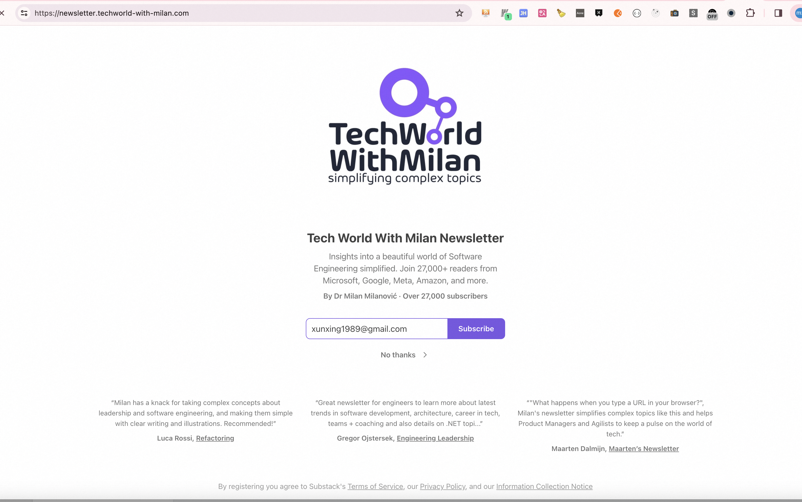

## **1. 预售与产品化**

- **预售**：提前支持，获取用户信任。
- **博客教程**：
  - 添加代码演示工具，提升教程的实用性。
  - 创建一个 MVP（最小可行产品）博客教程，基于 React 构建。
- **技术栈**：
  - 使用 Node.js + TypeScript（Next.js）进行开发。
  - 提供录播课程 + 直播答疑服务。

---

## **2. 个人站点规划**

### **功能与内容**

1. **低版本教程**：适合初学者的基础内容。
2. **高级收费课程**：提供深度学习资源，增加收入来源。
3. **广告变现**：接入 Google 广告，增加被动收入。

### **优化建议**

1. **内容精炼**：
   - 增加更多初级教程，专注于国际化内容（利于 SEO）。
2. **用户体验**：
   - 增加 Contact 页面，方便用户联系。
   - 在博客中展示阅读量，增强互动性。
3. **绘图与社区**：
   - 添加绘图内容，提升用户粘性。
   - 引入 Reddit 文章或类似资源，践行 "Learn in Public" 理念。

---

## **3. 博客与内容创作**

### **核心策略**

- **专注领域**：专注于前端领域，参考付费 CSDN 模式。  
  - 示例：[CSDN 前端教程](https://blog.csdn.net/qq449245884/category_12153673.html)
- **付费验证**：通过付费内容测试知识的价值。

### **内容形式**

- **视频与脚本**：
  - 每次录制视频前先写博客或脚本。
  - 插入 YouTube 视频，提升多媒体体验。
- **数字产品**：
  - 在博客中插入课程或数字产品售卖链接。
- **每日分享**：
  - 每天记录学到的内容，并通过视频分享给他人。

---

## **4. AI 工具与创新**

- **AI Agent**：
  - 示例：[aiagent.me](http://aiagent.me)、[askme.com](http://askme.com)  
    - 内嵌到公众号的小部件，借助 AI 大模型能力，为用户提供个性化问答服务。
    - 是否可以通过创业大佬的思路，设计一个 AI Agent，用于过滤想法以及任务拆解？通过 AI 提升创业效率和创新能力。
- **AI Music 助理**：
  - 训练 AI 推荐符合个人喜好的音乐。
- **AI Book Reader**：
  - 总结 PDF 文件内容，生成短视频摘要。
  - 借助 PC 桌面客户端的免费额度。

---

## **5. 学习与认知方法**

### **费曼学习法**

- **核心思想**：学会自己和自己对话，把不懂的东西搞懂。
- **实践方式**：通过讲解让别人理解，检验自己的掌握程度。

### **ABCDE 认知法**

- **A（事件）**：发生了什么？
- **B（看法）**：你如何看待这件事？
- **C（感觉）**：这件事让你产生了什么情绪？
- **D（自我辩论）**：
  - 这件事对我的帮助是什么？
  - 每次沟通的好处是什么？
  - 每次改变是否有利于事情向好的方向发展？
- **E（结果）**：重新思考他人的压力及沟通心态，建立良好的情感账户。

---

## **6. 积极主动**

1. **承担责任**：
   - 主动为自己负责，不将问题归咎于环境或他人。
2. **选择能力**：
   - 相信自己始终有选择如何回应的能力。

---

## **7. 创业灵感与执行**

### **灵感来源**

- 从论坛、YouTube、Twitter 等平台寻找灵感。
- 结合个人特质（如前端工程师的技术能力、资源、信息差）创建产品和服务。

### **近期想法**

1. **ChatGPT 辅助创作**：
   - 使用 ChatGPT 收集资料并生成摘要简报，决定当天的视频主题或写作内容。
2. **亚马逊电子书市场**：
   - 创建绘本故事并发布到亚马逊电子图书市场。
3. **国际化能力**：
   - 包括博客、视频博客（如 YouTube、B站、抖音）的国际化布局。

---

## **8. 其他资源与订阅**

- **订阅模式**：
  - 免费 + 收费订阅结合，参考：[TechWorld Newsletter](https://newsletter.techworld-with-milan.com/p/what-is-the-difference-between-mvc)
- **社群运营**：
  - 在博客或知识星球中添加 Telegram 社群号，方便用户交流。
- **技术壁垒**：
  - 打造高技术含量的产品，形成竞争壁垒。

---

