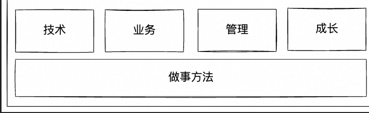

##  大图

##  技术 

| 复杂度| 核心要求                                                           | 详解                                                                                                         | 技术分层 |
| --------- | ------------------------------------------------------------------ | ------------------------------------------------------------------------------------------------------------ | ---- |
| 规模复杂度 | 熟练掌握团队技术，是技术专家；端到端（评审、设计、编码、原理）能力 | 包括已经使用的和可能用到的技术                                                                               |   前：  服务架构（serveless, faas)；框架（b/c端，ssr）+ 工程设计（脚手架）; 安全生产（卡点）；研发流程设计（文档/产品化）；    中：    物料标准; 埋点 ； sketch产品设计 ； 测试用例 ； lowcode/procode研发工具   后：  流程化/产品化防腐；监控；SQL/BI分析；日志/性能分析 |
| 时间复杂度 | 6～12月的技术规划                                                  | 技术规划： 融合对业务、业界技术的发展趋势的理解，做出合理的判断和选择。 OKR                                       |      |
| 环境复杂度 | 对业界/公司技术有一定理解                                          | 必须有研究。包括公司/业界框架、中间件、工具；                                                                  |      |
| 创新复杂度 | 新方法、新技术引入                                                 | 新方法和新技术必须关注给业务、团队带来的价值：新技术可能带来的新的复杂度、场景限制和成本；代码重构、自动化； |      |

## 业务

| 复杂度 | 核心要求 | 详解 | 方法 |
| --- | --- | --- | --- |
| 规模复杂度 | 业务系统级别整体的理解，事前、事中、事后。  判断一个人是否靠谱的判断依据 |  | 5W1H8C1D |
| 时间复杂度 | 预测业务6～12月的发展方向 | 理解背后的逻辑，能提供想法和建议；具备可扩展性 | OKR |
| 环境复杂度 | 熟悉竞品的整体情况 | 产品差异、市场地位、竞品的规划和策略 |  |
| 创新复杂度 | 能提出一些新需求 | 提出一些业务需求和想法，为产品设计、产品功能出谋划策 |  |

## 管理

| 复杂度 | 核心要求 | 详解 | 方法 |
| --- | --- | --- | --- |
| 规模复杂度 | 单个团队的管理；人力评估；时间评估；问题跟进；风险预判 | 3-5人的项目团队/虚拟小组 | PDCA理论；WBS; buffer(1.2~1.6倍) |
| 时间复杂度 | 制定项目计划或者团队规划 |  |  |
| 环境复杂度 | 熟悉上下游的团队 | 熟悉上下游的团队，和上下游团队的Team Leader搞好关系 |  |
| 创新复杂度 | 团队级别的优化 | 引入一些新的管理方法/流程或者措施来提升团队效率和能力 |  |

## 成长

| 维度 | 核心要求 | 详解 | 方法 |
| --- | --- | --- | --- |
| 输入 | 学习的能力 |  |  学习的基本过程： 1 选方向 2 获取资料 3 筛选资料 <mark style="background: #FFB86CA6;">4 认知获取</mark> -> 消化 -> 固化模式  5 解决问题  三步式快速学习法：1 建立整体认知：速读/目录 -> 绘制思维导图 -> 默写 2 解决问题，构建网络 3 补充知识，刻意练习 |
| 输出 | 解决问题能力；4D总结法 | 从技术、业务、管理维度阶段性总结4D总结法。  | 
  |

## 做事方法

![[Drawing 2022-10-23 17.37.57.excalidraw]]

 前期
	+ 做正确的事情

+ 中期
	+ 3C方案设计
		+ 宽度理解技术
	+ PDCA执行
		+ 确定具体任务、阶段目标、时间节点、责任人
	+ 5S
		+ 问题处理（明确/定位问题5W，量化数据，拆解问题，解决问题3C，执行事情PDCA）
	+ 5W
		+ 业务问题分析
		+ 深度理解技术
		+ 管理改进
+  后期
	+  4D: 4个维度（结果、数据、技术、成长）
	+ 金字塔汇报：
		+ 总体结论（ 总/分/论据）
		+ 具体分析（提供具体的数据和证据）
		+ 关键事项
		+ 后续改进措施
	

