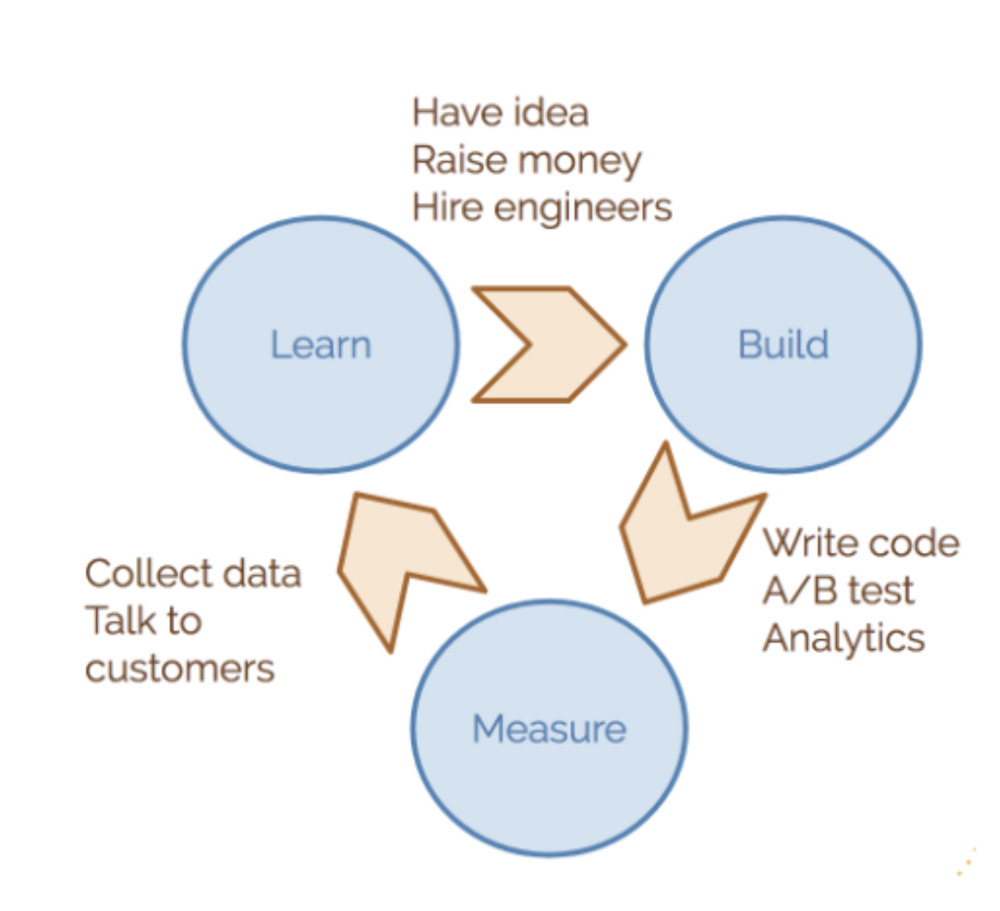
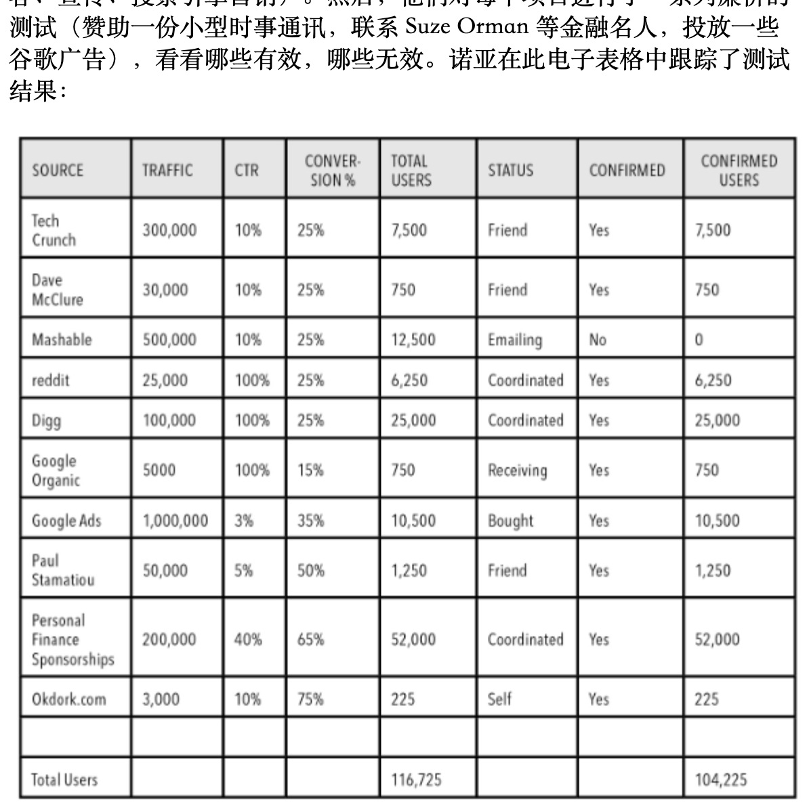
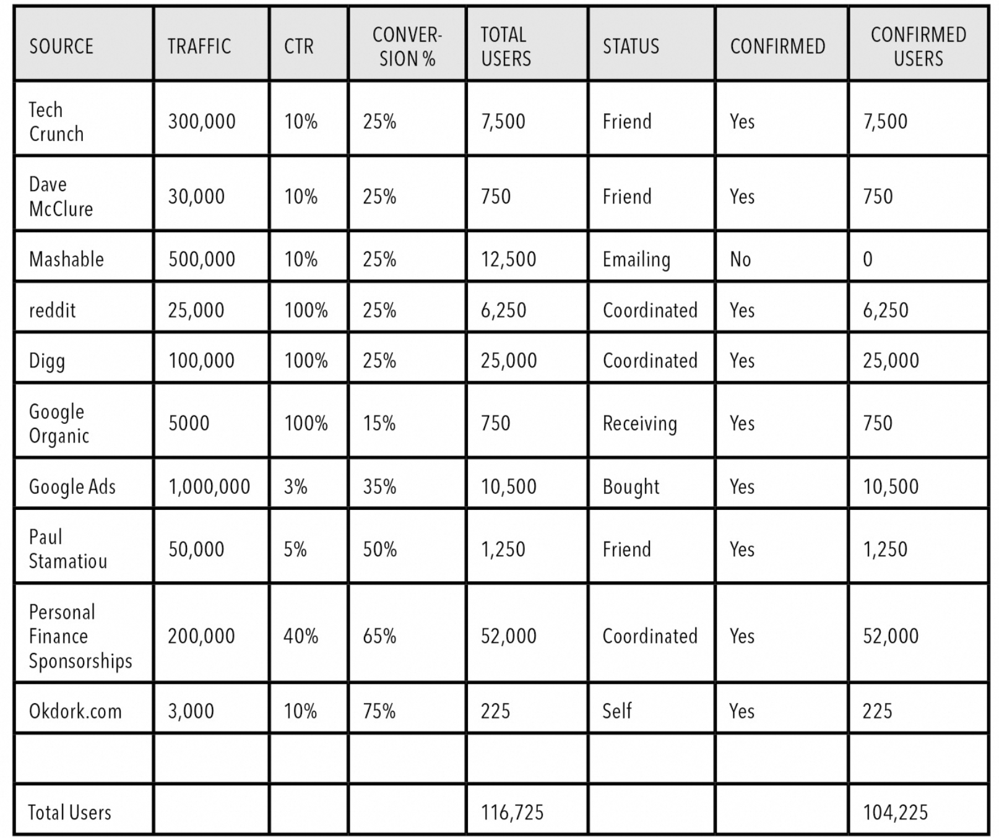

## 发布
最小MVP必须有用，而不是放一个电子邮箱注册框。做完功能后自己多次检查， 并且让更多人一起检查。

当要别人订阅的时候，要告诉他们你提供了什么？应该提供有用的东西，而不是频繁通知。 比如web通知，在你的站点增加这个能力。

分析： Amplitude、HotJar 大多数情况下是免费的

---

1千个客户，每个人83美元/月，可以成立一家百万美金的公司
试图找到阻力最低的路径，然后慢慢扩展。

我们只是想解决一件小事。好吧，我们修复它。好。下一步是什么？我们接下来要做什么。他们确实有可能是一个长期的愿景，但每一步都专注于小事，因为这就是你通过专注于小步骤来做大的方式。如果你连小步骤都做不好，你怎么能做到大部分呢？

你不知道你最终会得到什么。这是另一点。您需要从市场上的用户那里获得不断的反馈，以了解人们想要什么，人们使用什么等等。

----

Trello 
 
第一个基本想法列表对想法的怪异或疯狂程度没有限制。这是故意的。不应该对你的第一个基本创意前提进行任何评判。它可以在以后演变成更实用的东西

避免group think， 通过和客户沟通来发展

你不能问“这个想法行得通吗”。你需要通过建造它来询问市场！在你推出之前没有人知道！

 即便有人跟你一样做了，you're not a snowflake. 最终的执行结果才是关键，想法不值钱（因为想法一样 ，执行不一样，执行是从客户发展而来的）
 
Derek Sivers in his famous essay "Ideas are just a multiplier of execu-
tion" (2005)

pdfcoffee.com

---

案例： 
如何获得牵引力

技术： 
some Facebook ads, a little local PR, and maybe a smattering of
blog posts

---

https://mtlynch.io/notes/designing-the-ideal-bootstrapped-business/

在开始筹款、聘请联合创始人、招聘和构建应用程序之前，您获得的验证越多，您的影响力和确定性就越大。这意味着您将能够更长时间地持有更多股权，并且如果您决定最终需要资金来使您的软件初创公司取得成功，您将获得更好的条款。

## 筹款

从简单的开始：你的朋友、家人和附近的天使投资者。然后，当你产生一些兴趣时，请这些人进行介绍，并努力进入个人财富管理公司、更大的天使集团和种子阶段风险投资公司。

  
软件初创公司的第一轮融资通常为 500,000 - 3,000,000 美元，大多数风险投资家 (VC) 直到 A 轮融资（通常为 1,000,000 - 10,000,000 美元）才会参与其中。

滚动基金、众筹活动和首次代币发行 (ICO) 都受到重视。

## 企业结构
我倾向于看到大多数受资助的初创公司使用 C 型企业，而大多数自力更生或自筹资金的初创公司使用 LLC 或 S 型企业。

提议的融资模式和股权分割决定哪种结构有意义后，请前往 ZenBusiness 进行设置。过去，当律师为您完成这项任务时，您需要花费几千美元，而现在只需点击几下鼠标，在 ZenBusiness 上只需花费数百美元。

## 员工

他们有几个副业项目或者曾经运营过一个联属网站？也许他们在大学里经营过一个俱乐部？也许他们花了一年时间写一本书

  
寻找可能被大公司忽视但可以独立工作并涵盖广泛技能的人。例如，我在初创公司看到过客户服务+营销、工程+支持、销售+客户管理等交叉角色。在每项工作成为全职职位之前，您需要能够灵活适应多个职位的人。

  
杰夫·海曼建议在他的《招募摇滚明星》一书中创建一个标题。

## 营销
你只需要一个优质频道，当这个渠道无效时再进入第二个渠道

draft.dev 我使用推荐和我的个人社交媒体来建立我们的客户列表

冷电子邮件或 LinkedIn（适用于 B2B）进行直接外展、内容营销、付费广告、社交媒体营销、产品主导型增长、推荐或联属合作伙伴关系，

Sean Ellis 的《Hacking Growth》
虽然营销策略往往很快就会过时，但具体的策略可能有助于激励你尝试新事物。

## 产品开发
  
初创公司需要快速行动并花尽可能少的钱，但许多首次创始人不知道开发软件的真正成本，花太多时间担心他们的产品，而很少花时间弄清楚如何他们的产品为顾客创造的价值。

先开发产品，无法留住客户： 要么放弃更多股权来继续开发，要么关闭整个产品。

聘请软件工程师来帮助您配置、设置和学习这些工具。推出您的第一个应用程序。

## 市场契合度
。也许您需要改变您的消息传递以吸引更有利可图的买家，也许您需要几个关键功能才能与现有竞争对手保持同等水平，或者您可能需要调整定价以吸引不那么节俭的用户

《初创公司用户手册》。 Steve Blank 和 Bob Dorf 将引导您逐步了解客户发现和验证方法，该方法几乎消除了此过程中的所有猜测。

契合度高表现： 
+ Inbound organic interest
+ 源源不断的客户主动推荐
+  付费用户流失率低
+  价格不敏感（即当你提高价格时，没有人抱怨）

当契合度高时，像企业家一样思考

将自己从编写代码、创建营销文案、进行销售电话以及处理不满的客户中抽离出来。当然，这些职能都很重要，但作为创始人，你的时间最好不要花在可以轻松分配给员工的任务上

+ 无法放弃控制权 
+ 担心员工永远无法“正确行事”
+ 糟糕的招聘实践
+ 员工使用流程不一致 
+ 招聘资金不足（这意味着您需要筹集更多资金或寻找更多利润）

《The E-Myth Revisited》。在其中，迈克尔·格伯 (Michael Gerber) 谈到了如何离开“技术员”的舒适位置为您的企业构建“特许经营原型

  
第一个转变可能是招聘。每当需要完成某件事时，您都会开始编写工作描述，而不是立即跳到自己做项目。

A digital marketing niche is **a specialized area within the field of digital marketing that focuses on a specific target market or type of marketing activity**.25 Jan 2023  
数字营销利基是数字营销领域内的一个专门领域，专注于特定目标市场或营销活动类型。2023 年 1 月 25 日

A specialization in the realm of digital marketing known as a "niche" focuses on a particular target market or kind of marketing activity. **Social media marketing, email marketing, digital marketing, search engine optimization (SEO), and pay-per-click (PPC) advertising** are a few examples of digital marketing niches.21 Mar 2023  
数字营销领域的专业化称为“利基”，专注于特定的目标市场或营销活动。社交媒体营销、电子邮件营销、数字营销、搜索引擎优化 (SEO) 和按点击付费 (PPC) 广告是数字营销利基市场的一些示例。2023 年 3 月 21 日

由于利基产品满足特定的专业需求.

许多消费品市场都出现了小众品牌的崛起，这些品牌能够吸引大型跨国公司未能充分覆盖的部分市场，这是一个积极的发展。在互联网的帮助下，规模较小的私营企业能够满足特定的需求。

《每周工作 4 小时》蒂姆·费里斯 (Tim Ferriss)
大部分时间都在旅行和写小说

以价值为导向的使命和由你自己的生活经历驱动的真正目标是非常美丽的。这就是成为一名极简主义企业家的意义所在：在谋生的同时创造改变

这种创业公司将盈利能力置于增长之上，

像加法导致乘法导致代数导致微积分一样

他们通过向客户销售产品而不是向广告商销售用户来做到这一点。

他们不会问“我能帮忙吗？”而是善于观察并培养真实的关系。他们花费时间和精力来学习和建立信任，专注于“产品与市场契合度”（风险投资家 Marc 创造的术语）的市场部分

当他们真正建造时，极简主义企业家只建造他们需要的东西，其余的则自动化或外包。同样，极简主义企业只做一件事，并且做得很好。他们与客户并肩工作，迭代解决方案，并确保其值得付费，然后再将其提供给社区之外的客户。

**销售不是一开业就卖给陌生人，而是通过讨论产品，我正在做的帮助解决他们的问题，这是一个长期的
创业者分享自己的故事，通过strugle到成功，你是谁，你的产品是什么，人们喜欢关心人，喜欢教育别人，喜欢激励别人、取悦你如果他们可以。 这样没有成为头条新闻，而是成为粉丝**

**做视频是为了吸引同类，而不是为了赚钱。**

不花没有的钱，不为了规模牺牲盈利。他们从不失败。

输出你的价值观，同类人会找到你，并且和你合作。关于如何工作、何时工作以及在哪里工作的传统观念正在迅速变化

向客户学习，不要放弃

你从哪里开始？认真审视你关心的人、地方和社区。痛点在哪里？什么不起作用，但稍微费点力气就可以？这些都是通过极简主义创业让事情变得更好的机会

企业对消费者或企业对企业的企业，这些企业具有快速的客户反馈循环和充足的迭代机会，例如软件即服务（SaaS）、数字和物理产品和服务，或者将人们联系起来以获取信息。费用

缩小理想客户的范围。缩小直到你，不能再缩小了。
准确定义您要为他们解决的痛点，以及他们会付多少钱给你来解决这个问题。
设定一个严格的截止日期并完全专注于构建解决方案，然后收费。
重复此过程，直到找到有效的产品，  然后围绕它扩展业务。

利用业余时间建立了 Gumroad，以帮助我销售我在 Photoshop 中设计的图标。

当我找到一个有效的解决方案时，我将其出售给其他创作者，他们将他们的产品出售给自己的创作者社区

记下他在蒂姆·费里斯 (Tim Ferriss) 的《4 小时健身》等书中学到的知识，并在 **Reddit 健身版块**上为社区其他成员发布摘要

我已经在哪里、和谁一起度过了线上和线下的时间？在什么情况下我才是最真实的自己？

我和谁一起出去玩，虽然我不太喜欢他们，但这是值得的  
因为我们有一些更重要的共同点？

**那么您将始终有定期内容为社区做出贡献。随着时间的推移，这可以成为一个很好的飞轮，因为教学常常成为。  
激发自己的好奇心和灵感，让自己了解更多知识的最佳方式。当你公开学习时，你的学生会提出问题，迫使你学习更多的东西来教他们。**

https://www.kalzumeus.com/2012/01/23/salary-negotiation/

个人品牌的两个话题：继续为软件工程师和软件企业家撰写文章并提供有关如何创办和扩展业务的建议，并以创作者和企业主的真实经验为基础

这些人可以把注意力花在无数的事情上，而他们选择了你。

选择一个规模适中的群体，他们愿意花钱解决问题，并且服务不足（可能是因为它太小，无法让更大的竞争对手追赶

既可以解决又可以赚钱的问题

如何定义问题： 
左侧写下您想要帮助的人/社区。在中间，写下他们如何度过时间（买洋葱、在周五晚上制作铅笔图标、绘画）。在右侧写下每项活动的问题。它可能看起来像第 46 页上的图

一些《经济学 101》可能会有所帮助。效用只有四种：地点效用、形式效用、时间效用和占有效用。你能让什么更容易理解、更快获得、更便宜或更容易被其他人使用？

  
地方效用：让某些东西变得难以接近 形式效用：通过重新安排现有部分，使某些东西变得更有价值 时间效用：让某些东西变得缓慢 拥有效用：消除中间人

构建解决方案： 
我会喜欢它吗？建立企业是困难且耗时的。这需要数年时间。而且越成功，你花的时间就越长。因此，为你想为之工作的人找到你想做的事情很重要。要打造成功的企业，您需要打造人们喜爱的东西。为了坚持下去，你需要建立一些你喜欢做的事情。

它本质上是可货币化的吗？应该有一条明确的途径，以一种让人感觉显而易见的方式向人们收取有价值的东西的费用。如果有道理的话

它有内在的成长机制吗？
我是否拥有建立这项业务所需的适当的天赋技能？例如，如果企业需要大量的业务开发或销售电话才能起步，而您非常害怕与任何人交谈，那么它可能不适合您。有很多企业等待建立 - 选择适合您的企业。

没有一本书包含您开展任何业务所需了解的所有内容。重要的是你自己解决问题的思维过程。您需要正确的心态并知道要问自己什么问题。它的开始和结束都是将您的业务视为解决客户问题的工具。不是像彩票一样。

凯文·凯利 (Kevin Kelly) 的博客文章“1,000 个铁杆粉丝”
Casper ter Kuile 和 Angie Thurston 撰写的《我们如何聚集》报告。在盖伊·拉兹 (Guy Raz) 的《我是如何构建这个》播客中收听 Calendly 的 Tope Awotona。在 Twitter 上关注 Anne-Laure Le Cunff (@anthilemoon)。

市场风险（您可以以可持续的方式接触客户）和产品风险（客户想要您正在构建的产品）。

## **牵引力胜过一切。**

牵引目标： 多长时间获取多少客户

太多垃圾邮件（所有这些网站除了广告什么都没有）和没有足够的即时答案（我一直浏览维基百科和 IMDb）

大约十几个副项目

发布到： 将其发布到一个名为 Hacker News 的利基技术网站上
。“你觉得我的新搜索引擎怎么样？”

牵引力： 牵引力是某物正在发挥作用的标志。如果您对产品收费，则意味着客户正在购买。如果你的产品是免费的，那么它的用户群就会不断增长。**牵引力胜过一切。**

上一家初创公司是通过两个牵引渠道发展起来的：第一，搜索引擎优化
第二，病毒式营销

在博客和新闻媒体中撰写有关您的故事是一种常见的 SEO 链接策略。然而，我很快就达到了该渠道策略的饱和度，但它并没有让我达到顶峰。需要更有创意的东西。
我构建了一个小部件，它会显示您的社交媒体个人资料的链接以及您在每项服务上拥有的关注者数量。人们会将其嵌入到他们的网站上，底部会有一个返回 DuckDuckGo 的链接，上面写着“新搜索引擎“。它没有足够的吸引力来有意义。它没有移动针。

转向：内容营销、社交和展示广告、宣传以及最近的业务开发

，如果您从事企业软件行业，[最初的吸引力]可能是两三个支付一点费用的早期客户；如果您从事消费类软件，则门槛可能高达数十万用户

将这些客户获取渠道称为牵引渠道。这些是营销和分销渠道，您的初创公司可以通过这些渠道获得吸引力：真正的客户增长

媒体策略师、畅销书《相信我，我在说谎》的作者 Ryan Holiday

请花时间构建产品或服务并并行测试牵引渠道。

牵引力和产品开发同等重要，应该各占一半左右的注意力。这就是我们所说的 50% 规则：将 50% 的时间花在产品上，50% 的时间花在吸引力上。从一开始就专注于牵引力

dropbox他们以 230 美元的价格赢得了客户，而他们的产品售价仅为 99 美元。就在那时，他们专注于病毒式营销牵引渠道，并在他们的产品中建立了推荐计划

我们讨论了我们想要解决的问题。 。 。 。我们没有对产品进行 Beta 测试，而是**对一个想法进行了 Beta 测试**，并在产品开发过程的早期整合了从读者那里收到的反馈。

第一阶段——制造人们想要的东西 第二阶段——营销人们想要的东西 第三阶段——扩展你的业务

第一阶段是您的桶（产品）泄漏最多的时候。它确实不能容纳水。现在没有理由加大力度，但通过水桶注入少量水仍然很重要，这样您就可以看到漏洞所在并堵住它们。

第二阶段现在是时候加大牵引力度了：您的铲斗不再漏水。您现在正在微调您的定位和营销信息。

第三阶段，您的重点是增加收入、扩大营销渠道以及创建真正可持续的业务

第一阶段非常注重产品，涉及追求初始吸引力，同时构建初始产品。这通常意味着以无法扩展的方式获得吸引力——发表演讲、撰写客座文章、向与您有关系的人发送电子邮件、参加会议以及尽一切努力在客户面前展示。

保罗·格雷厄姆（Paul Graham）在他的文章“做无法扩展的事情”
创始人一开始要做的就是手动招募用户。几乎所有初创公司都必须这样做。您迫不及待地等待用户来找您。你必须出去拿它们。

初创公司的成长是井喷式的。最初，生长通常很缓慢。然后，随着有用的牵引渠道策略的解锁，它会飙升。最终，随着该策略饱和并变得不那么有效，它会再次趋于平缓。然后你解锁另一个策略，你就会得到另一个峰值。

随着公司的发展，较小的牵引策略会停止前进。如果每天有一万名访问者访问您的网站，那么您将很难欣赏一条推文或博客文章为您带来二十名访问者。

请始终考虑您的牵引努力是否有助于实现您的牵引目标。

转向前考虑： 

你可能会放弃得太早。您应该检查这些亮点，看看如何扩展它们。为什么这些客户如此喜欢您的产品？有什么线索将他们联系在一起吗？他们是巨大市场中的早期采用者还是局外人？这些问题的答案可能会揭示一些在您的核心指标中并未立即显现出来的承诺。

总结： 
将一半的精力投入到获得牵引力上。并行追求牵引力和产品开发，并在两者上花费相同的时间。将您的产品视为一个漏水的桶。你早期的牵引力努力将你引向值得堵塞的漏洞。

设定你的成长目标。专注于能够为您的公司带来推动的战略和策略。获取一些硬数字。

了解潜在投资者所尊重的增长数字。投资者需要多少吸引力是一个不断变化的目标，但可持续的客户增长率是投资者难以忽视的。了解您业务的潜在投资者可能会欣赏您的吸引力，从而更早进行投资。牵引力胜过一切。

找到你的亮点。如果你没有看到你想要的吸引力，请在你的客户群中寻找亮点，寻找真正与你的产品互动的客户群。看看你是否能弄清楚为什么它对他们有效，以及你是否可以在此基础上进行扩展。如果没有亮点，那么现在可能是转型的好时机。

## 靶心

外环有哪些渠道；
内环渠道测试： 多轮快速并行测试
1、通过这个渠道获客成本是多少？

2. 该渠道有多少客户？

3. 您通过此渠道获得的客户是您现在想要的客户吗？

靶心： 核心渠道，当渠道停止（没有带来增长）后，重复这个过程，找到新的核心渠道

结论：

通过靶心工作。最大限度地提高获得吸引力的机会：集思广益、确定优先顺序、测试，然后集中精力。不要忽视未充分利用的渠道。事实上，这些渠道更有可能是效果最好的渠道。

与比你先几步的创始人交谈。研究您的空间和邻近空间中过去和现在的公司如何成功或失败地获得关注。最简单的方法就是去和那些之前在你想做的事情上失败的初创公司创始人交谈。坚持您的其他渠道想法。在电子表格中编制针对每个牵引渠道的头脑风暴想法，并提供可通过测试确认的有根据的猜测。即使在选择了核心频道之后，您也应该保留这些想法，以便将来运行 Bullseye。

---

精益产品开发

渠道测试；

一系列可以调整的内容。采用AB测试：例如，对于定位博客，您可以调整要定位的博客、要推送的内容类型以及此内容中的号召性用语。对于搜索引擎营销，您可以调整关键字、广告文案、人口统计数据和登陆页面。
工具： Optimizely、Visual Website Optimizer 和 Unbounce

Clicky、Mixpanel 或 Chartbeat

---

## 序言
如何开始获得客户，售卖你的产品或者服务

## 核心观点

创业核心要解决的是
- 产品风险：人们想要你的东西（精益）
- 市场风险：可以持续接触客户（牵引）

牵引目标：
- 达到多少客户可以盈利或者筹集资金？需要多少客户？增长率是多少？牵引策略始终要围绕牵引目标，是否目标在被逐步达成？

事业之所以成功是因为创始人让他们成功， 创始人最终会成为某个渠道专家

比如我运营公号和知识星球，缺乏牵引目标，导致知识星球的粉丝数不多并且停滞不前。 我大概需要1千个付费粉丝（10000个免费体验客户， 100个每日新免费客户，不要市场占有率）。服务好这1千人，多长时间获得这些粉丝？ 向下拆解子目标是： 比如今年1季度达到多少新免费客户。 
博客怎么评估每篇文章的阅读量。

产品目标：
1、更具吸引力的内容：财务自由手册，算法修炼手册 是否当前阶段能很好地激励他们购买会员
2、更好的内容组织 
3、更快的网站，Good URL占比 

比如什么时候达到盈亏平衡点。比如通过邀请朋友体验星球，可以让你免费享受3个月免费星球时间或者博客的电子书籍等等。

 
## 牵引思维
- 牵引的三个核心步骤
	- 制造人们想要的东西（推出前先给一个落地页，看有多少客户想要用。水桶还是漏的，需要将水桶做好，是否目标在不断地被靠近。 注意这里要用无法扩展的方式，尽己所能和客户展示，主动出击，不会因为你做了好东西就能起飞 Do things that dont scale）.
		- 发表演讲
		- 写客户博客介绍你的产品、写你的故事
		- 给客户写邮件
		- 参加会议
	- 营销人们想要的东西（水桶已经很完善了，微调定位和营销信息）
	- 扩展业务（增加收入、扩展营销渠道、成为可持续的业务）
- 牵引渠道一个阶段可能有效，但是慢慢的可能就会失去效果(人们习以为常了导致点击率低， 而且可能竞争者多价格昂贵，需要某种程度的策略创新），当失去效果时重新走一遍牵引框架（靶心）
	- 走期发送20个人邮件有效果，后期你的目标变大了这个方式就不起效果了。需要病毒式营销或者社区建设，触发更多的人群。
- 50%法则，牵引和产品一样重要。通过冷客户才能知道你做的产品是否满足市场需要。
	- 如果没有接受你的产品，缺失的部分是什么？功能还是体验不行？冷客户可以避免一开始你的产品就投入过多的金钱
	- 可以收集市场的信息： 哪类客户更容易获得？哪些信息容易让客户产生共鸣？可能遇到的分销障碍是什么？这些都应该让你帮助改进你的第一版本的产品
	- 同行是如何牵引客户的
- 什么时候开始转向放弃你的产品：要有耐心，duckduckgo做了7年才有起色
	- 考虑部分忠实客户为什么还在用你的产品， 是什么吸引了他们
	- 是否在市场早期阶段，没有类似产品？ 还需要时间慢慢起飞

## 靶心

- 牵引框架： 认真思考什么是当前阶段最好的牵引渠道
	- 外环：行业中有效的营销方案有哪些，哪些是无效的，尽量避开常用的渠道，不常用的渠道反而有奇效；深入思考脑爆怎么推广的想法 - 不要浪费营销资金尤为重要
	- 中环： 低成本/工作量小（最多一个月/1千美元，一般会更少）的并行测试几个渠道，这一步主要是获得速度数据并验证你的假设，是否能快速移动指针靠近牵引目标
		- 案例
			
		- 费用多少
		- 这个渠道有多少客户
		- 客户是我们需要的吗
	-  内环： 确认核心渠道后一次只专注一个渠道
		- 不断实验，找出如何优化增长发现有效的策略（战略和战术），并尽可能地扩展。（成本过高、或者渠道饱和了则终止）必须科学测试提高有效性（比如AB测试）
			- targeting blogs : you can tweak which blogs to
				target, what type of content to push, and what the call to action is in this
				content. 
			- search engine marketing:  you can tweak keywords, ad copy,
				demographics, and landing pages.

		- 一定要专注你的渠道
			- 搜索引擎营销要好得多，所以你应该把所有的精力都花在这个核心渠道上，因为在其中发现额外的战略和战术将比使用这些次要渠道产生更大的效果。它们会分散注意力(可以辅助其他渠道)
			- 关注你的宣传信息是否很好地被传递
			- 多次尝试。如果仍然没有获得好的反馈，那么可能需要调整产品（水桶还是漏水= 不够好）
## 牵引力测试
测试是牵引力的核心

必须有跟踪系统： 比如表格或者其他分析工具
工具： Clicky, Mixpanel, or Chartbeat
回答这三个问题：
有多少潜在客户登陆了我的网站？我最好和最差的客户的人口统计数据是什么？与我的支持团队互动的客户是否更有可能停留更长时间？
表格统计： 
客户数、转化率、获取客户的成本、生命周期价值

如果当前预算内，无法达成牵引目标（比如无法带来真正的粉丝数量的增加）则不值得深入。如果渠道带来了客户，这些客户是有价值的吗？

## 关键路径

达到目标的关键路径是什么？

拒绝牵引渠道偏见：
1. 眼不见心不烦。初创公司通常不会考虑演讲活动之类的事情，因为它们通常超出了他们的视野。
2. 一些创始人拒绝认真考虑他们认为负面的渠道，例如销售或联盟营销。仅仅因为你讨厌打电话并不意味着你的客户会这样做。
3. 对 schlep 的偏见——看起来很烦人且耗时的事情。业务发展和贸易展览等渠道通常属于这一类。

## 牵引渠道
- 病毒式营销
	- 可以获得免费客户
	- MailChimp、Weebly、UserVoice 和 Desk.com为免费用户添加品牌标识，可以通过付费去除
	- 产品中增加推荐功能，推荐会解锁功能或者Airbnb, Uber, PayPal, and Gilt通过推荐获得积分
	- reddit 和 YouTube 这样的公司通过使用嵌入式按钮和小部件而迅速发展。
	- 病毒周期时间越短越好
	- 病毒系数越大越好（比如1邀请3 2个人转换） 关注转化过程的阻塞点（去掉不必要的页面和表单字段，增加可以邀请的区域或者机制） 数周时间集中关注注册转化率 + 大量A/B测试
	- 真正有效的是客户真正喜欢并且反复使用你的产品，比如约会app通过客户行为发送电子邮件邀请或者站内通知
	- 通过链接触达客户（为什么点击： 好奇心、义务？ UserTesting.com 直接询人们），并且转化页面需要和触达信息一致效果更好； 在不需要注册时就可以试用产品，提高病毒系数
		- 提高转换的手段： 首先关注核心能提高5-10倍提高转化的流程比如全新的自动邮件回复序列、新的网站设计、新的加入流程
			- 按钮与文本链接
			- 行动呼吁的位置
				- 操作按钮的大小、颜色和对比度
				- 页面速度
				- 添加图片
				- 标题
				- 网站文案
				- 客户评价
				- 社会证明标志（如满意客户的照片、案例研究、新闻报道和产品使用统计数据使用情况的统计数据）。
				- 表单字段数量
				- 允许用户在注册前测试产品
				- 注册的便捷性（Facebook 连接、Twitter 登录等）
				- 注册过程的长度（注册过程越短，转化率就越高。
	- 播种： 搜索引擎优化、在线广告
	- 不同客户子集（来自特定国家/地区，年龄组/其他特征的客户）的病毒系数来计算是否有病毒口袋
	- 病毒营销的错误之处
		- 本质上不是病毒式传播的产品试图添加一堆病毒式功能 
		- 没有增加价值的不良产品试图传播病毒式传播 
		- 没有做足够的 A/B 测试来真正找到改进（假设每十个中就有一个到三个会产生积极的结果） 
		- 不了解用户目前如何沟通/分享，并坚持“最佳实践”策略（只需添加 Facebook“喜欢”按钮！
		- 没有从已经做过的人那里得到指导/指导 
		- 将病毒式传播视为一种策略，而不是产品战略的深层部分。比如skype需要客户才能创造产品价值
- 搜索引擎
	- seo优化先行
	- 宣传
	- SEM作为一种以相当可控、可预测的方式获取早期客户数据的方式是多么引人注目。因此，即使您不希望盈利，您也可以决定在广告活动上花费 5,000 美元（或 1,000 美元，或 500 美元），并获得早期的客户和用户群。它告知了一大堆在基本[指标]方面非常重要的事情：目标网页的转化率，电子邮件捕获的效果如何。如果您要销售产品，每个客户的平均成本是多少，他们的生命周期价值可能是多少。拥有这些基线指标对于为您的战略提供信息并确定您需要做什么至关重要。
		- 团队在投入大量资金构建产品之前，使用 AdWords 为着陆页带来流量。每个登录页面都是为了测试对特定产品方法的兴趣而编写的（测试消息传递）。
		- 想以尽可能少的成本尽可能多地学习。因此，我们会测试不同的关键字细分，我们会测试不同的概念
		- SEM 流程是找到高潜力关键字，将它们分组到广告组中，然后测试每个广告组中的不同广告文案和着陆页。随着数据的流入，您可以移除效果不佳的广告和着陆页，并对效果更好的广告和着陆页进行调整，以不断改善结果。
		- KeywordSpy、SEMrush 和 SpyFu 等其他工具对于发现竞争对手用来吸引客户的关键字很有价值。
		- 请记住，对于更具竞争力的关键字，SEM 更昂贵。因此，您将希望将自己限制在具有有利可图的转化率的关键字上
		- 不太可能立即盈利。除非活动立即让你盈利
		- 确定要定位的广告组和关键字后，创建第一个广告。标题要吸引人并且和关键词相关，然后内容区至少一次关键词，最后以号召性的词结尾。
		- Google Analytics（分析）网址生成器工具创建指向着陆页的唯一网址（网址）。通过这些网址，您可以跟踪哪些广告正在转化，而不仅仅是获得最多点击的广告
		- 使用 Google Analytics（分析）网址生成器工具创建指向着陆页的唯一网址（网址）。通过这些网址，您可以跟踪哪些广告正在转化，而不仅仅是获得最多点击的广告。
		- 只开始测试四个广告。四个广告将为您提供 SEM 整体性能的良好基准，Optimizely 或 Visual Website Optimizer 做AB测试
		- AdWords 广告系列的平均点击率约为 2%，而 Google 为点击率低于 1.5% 的广告分配了低质量分数。如果您的任何关键字的点击率如此之低，请重写这些广告，在不同的受众群体中测试它们，或者完全放弃它们。
		- 对于初学者和刚刚测试这个牵引渠道的人来说，内容网络可能很难导航。然而，一旦你建立了有利可图的广告系列，你就应该考虑将它们扩展到内容网络，其中包括数百万个提供谷歌广告的非谷歌网站。
		- AdRoll 或 Perfect Audience：通过重定向，访问您网站的用户将在互联网上的其他地方看到您的广告。这些广告的转化率通常更高，因为它们针对的是已经至少访问过您网站一次的潜在客户。
		- Google 的 Conversion Optimizer。它会分析您的转化跟踪数据，并自动调整您的广告以使其效果更好
		- 否定关键字来阻止您的广告针对特定关键字进行展示
		- 使用编程脚本来自动管理您的广告。您可以使用脚本为某些关键字设置新广告或更改现有广告。如果您要管理大量广告或关键字，脚本尤其有用。
		- 我们建议每个人都进行一些 SEM 测试，因为它们简单明了，成本低廉，并且可以让您快速了解您的业务。
- SEO：可以在任何阶段很好地扩展，而且通常成本很低 Moz Beginner’s Guide to SEO。搜索引擎优化是入站营销（无成本，成交率高）的基石之一
	- fat head or long tail: 胖头还是长尾
	- Open Site Explorer,
	- 让其他网站链接到你的网站；“小型企业会计软件”是您的主要术语，请在您的页面标题和主页中包含该短语。
	- 对于早期创业公司来说，一个流行的SEO策略是专注于长尾（Google Keyword Planner工具、Google Analytics or Clicky，关键点是你能够产生大量的优质内容）
	- Alexa工具
	- 帕特里克向我们讲述了他的东亚猫头鹰宾果卡。他使用了一个专门讨论东亚猫头鹰的登录页面，并专门针对这个长尾主题定制了宾果卡模板。该页面在三年内带来了价值约 60 美元的业务。内容创作成本为 3.50 美元，这是一项值得的投资。它之所以有效，是因为互联网上很少有其他网站专门为搜索“东亚宾果游戏的猫头鹰”的人提供页面。在帕特里克的案例中，数百种 3.50 美元的投资，回报率为 60 到 100 美元，加起来可以带来巨额利润。（Owls of East Asia bingo cards）
	- oDesk 或 Elance 寻找自由职业者写样板文章
	- 收集或者生成对别人有用的数据自动生成落地页被google收录。您可能需要更有创意地以有用的方式聚合数据，基于地理位置创建登录页面可能会效果很好
	- 获得链接的方式： 图表、幻灯片或者图像、原创来驱动链接，这些别人更愿意分享。本质上博客就是社交影响者
		- 宣传（记者会放链接到他们网站）
		- 产品。 比如linkedin资料页
		- 内容营销： 创建大家想要读和分享的内容（对胖头策略效果佳）
		- 小组件： 为网站提供能力指向自己的网站
		
- 博客：
	- 先讨论你要解决什么问题，你准备怎么解决。对想法进行beta测试。 在产品早期开发阶段从读者那收集反馈
	- 对最好的帖子进行facebook等社交广告放大、到其他博客发表文章引流到你的定位博客
	- 链接最好是有来源测试，看下效果
	- 联系其他覆盖不同人群的博主写关乎定位博客的文章
	- 白名单用户给朋友推荐可以获得优先产品权限，并且提供徽章组件嵌入到社区或者其他博客中，通过这个注册可以让博主获得优先产品权限。同时这种方式也提高了SEO。
	- 赞助博客，让他们嵌入链接。这样知道最感兴趣的客户群是哪些人
		- 他只是给他们发了一条信息，主题是“我可以给你寄500美元吗？”，并告诉他们一些关于产品的信息，以及Mint试图做什么。大多数人都乐于与观众分享有用的产品，并在此过程中赚到一些钱。
	- 和其他站点合作： 给他们免费提供内容或者免费产品
		- 为博客或者会议提供折扣价软件包（当然包含了一些免费功能 部分高级收费功能），赞助博客分发软件包赠品
	- Vimeo 和 Dailymotion
	- Followerwonk 和 Klout 发现顶级twitter账号
- 病毒式营销
	- 电子邮件/facebook
- 广告
	- adwords
- 宣传
	- 好的新闻角度会让人产生情感反应。如果没有有趣，不能引起人们的情感共鸣，那么你的故事就不值得推介。此外，您的故事最好能激起读者的某种特定情感让他们愿意与他人分享这个故事。正如瑞安所说“满意是一种非传播性的情感"--您希望读者在阅读完您的文章后做一些事情，而不仅仅是感到满意。
		- 例如，Ryan 曾与一位客户合作，他写了一本关于华尔街如何运作的书。
			华尔街是如何运作的。书中包含了关于高
			高频率股票交易及其对经济的影响的技术细节。然而，当
			然而，当他们提出这个故事时，他们把重点放在了书中的暗示上，即股票市场基本上是被操纵的
			市场本质上是被操纵的
	- twitter上联系记者，评论or提供素材
	- 关注小型网站
- 非常规公关
	- 制造一些噱头
	- 客户维护
- 社交广告
	- 展示广告还可以引起直接响应，例如注册电子邮件通讯或购买产品。
	- BuySellAds
	- 邮件联系小型网站主 大概几百美元。MixRank and Adbeat / Alexa 和 Quantcast
	- Adaptly
	- 通过社交广告建立受众而不是直接售卖
	- 只有当你明白你的信息周围正在起火，并且你想在上面涂上更多的油时，你才应该使用社交广告费
		- 创业公司总是在做相反的事情，他们浪费数万美元试图推动一个没人关心的信息。
		- 在一个案例中，在Twitter广告上只花了15美元后，他们就收到了数百次自然转发，数十个Facebook点赞，以及两次向reddit和Hacker News提交的内容
		- 他们会通过邮件向您发送眼镜，让您试戴并寄回，所有这些都是免费的。当您收到眼镜时，他们会鼓励您将自己的照片发布到社交网站，以获得他人的反馈。
	- Outbrain 和 Sharethrough 等内容分发网络。这些广告网络中的每一个都在福布斯、Thought Catalog、Vice、Gothamist 等热门合作伙伴网站上推广您的内容。这些原生广告平台使您的内容看起来像目标网站上的任何其他（原生）内容。
- 线下广告：平面广告（直邮、报纸、杂志）、广播电视、户外广告（GRP 分数（Gross Ratings Points）
	- 报纸：只需 300 美元，您就可以目标市场投放广播广告，看看效果如何。广告牌也是一样：你可以花每月几百美元买一个广告牌。
	- 畅销书《4小时身体》和《每周工作4小时》的作者蒂姆·费里斯（Tim Ferriss）
	- 关注剩余广告（当前未使用的广告空间） - 最好对接剩余广告结构，能提供非常高的折扣。
	- 如果您对地点或时间不敏感，您可以通过承诺购买剩余库存来获得大幅折扣。如果您拥有大众市场产品，这可能是一种廉价而有效的策略，可以吸引数百万人
	- 广告跟踪： 通过唯一的url访问链接。 当注册时询问时从哪里得知。免费书籍的订阅量。
	- 报纸一般是30岁以上人群
	- 广告牌：只有当有新的广告时才会替换
	- 电视广告一般是是品牌推广。关注本地电视广告，降低成本（购买不够透明）。信息广告基本上是电视广告，信息广告一般是健身器材、护肤品或者清洁用品家用品。动画制作替代模特降低成本。2分钟的短片。
 
- 内容营销：不是一次性的，而且可以无限驱动客户。长期坚持写。
	- 在推出产品前，博客访问量就很高，写产品的相关文章并且在twiter上分享
	- Moz、Unbounce 或 OkCupid
	- 通过社交媒体吸引读者访问他们的博客，@有些小影响力的人给反馈 。 或者在Quora回答有用的内容与客户互动。赠送免费的信息图表或者电子书籍来扩展邮件列表。在其他热门博客发布文章。个人分享帖子。撰写最近的新闻事件。制作在其他地方找不到的深度帖子（写出你的客户面临的问题）或者有些不可思议的结论。
	- 故意写有争议的帖子：你的种族如何影响你得到的信息
		- 写下目标客户面临的问题（你最挣扎的问题是什么），你知道的更多能提供更多见解或者方案
	- 在线图表的分享频率比普通文章高20%： Noob Guide to Online Marketing
	- 会被人分享的秘诀是：展示一个他们不知道的问题或者他们不能完全理解或者表达，提供解决方案很好，但是最好的告诉他们的在某些方面一直都是错误的
	- 跟踪你的文章哪些被很好的接受。 哪些没有反应。需要有跟踪工具
	- 可以很好地奠定你的领导地位让人们记住你（行业分享 新闻的更多机会，意味着内容被分享的次数会变多）
	- 早期合作伙伴关系无效因为没有建立自己的用户群
	- 并且对其他八个牵引渠道产生积极影响。推动seo,口碑，博客是漏斗的顶端。
- 电子邮件
	- 可以非常个性化的。比如根据客户采取的行动发送邮件。
	- 熟悉潜在客户、获取客户、留住已有客户
	- 比如只有输入邮箱，才能获得优质内容。比如视频、免费电子书
	- 创建免费课程：通过免费课程向你的客户介绍问题和你的产品。在视频的最后要求购买你的产品、免费试用或者分享一些东西。
	- 客户激活后才能让他们支付，通过电子邮件慢慢激活用户了解你的产品核心功能。用户注册后不要立即发邮件，而是等一段时间发一个激活邮件（比如dropbox让你上传一个文件）
	- Vero and Customer.io
	- 可以通过初始电子邮件来建立和客户的联系，获得反馈
	- Planscope
	- 每两周发一封邮件激活或者提供有效信息（或者你上次互动的信息）
	- 电子邮件订阅者购买课程的可能性是其他渠道的70倍
	- 通过邮件提供免费mini课程服务，最后提出让客户注册某某高级服务（转化率更高比直接让到落地页注册）
	- 通过邮件的推荐计划可以获得额外功能
	- 邮件送达率：MailChimp或Constant Contact。 有助于确保交付性
	- Copy Hackers
- 工程即营销：具有持续回报的营销资产（博客文章、应用程序、视频）
	- Marketing Grader 一开始就只有三个人 先发布上线手机邮件 然后不断迭代它
		- 将潜在客户吸引到销售漏斗的低摩擦方式
	- Followerwonk 允许人们分析他们的 Twitter 关注者并获得增加受众的技巧。Open Site Explorer（网站分析）允许人们查看网站从哪里获得链接，这对于任何SEO活动来说都是有价值的竞争情报。
		- 一旦有人使用这些工具，公司就可以开始通过销售和电子邮件营销等其他牵引渠道吸引这些潜在客户。
		- 入站营销（站内营销）制作内容的成本是相对固定的，但是边际成本很低（如果客户足够）；站外营销当你停止付款时，流量即会停止（但是站内营销不一样，它可以持续吸引客户）
	- Codecademy Code Year：通过注册邮箱每周发送编程的免费课程 来解决学习编程
	- Bingo Card Creator 的 Patrick McKenzie 为万圣节、圣诞节和其他节日制作了以节日为主题的微型网站。由于它们与假期有关，Bingo Card Creator 可以年复一年地使用它们。duckduckgo建立了一个微型网站 DontTrack.us（相对博客文章的一种新形式），它展示了谷歌如何跟踪你的搜索，以及为什么这会伤害你。更充分地解决人们的担忧，并且将产品更广泛地暴露给客户
	- 微型网站的好处是： 1 seo（通过一个人们经常搜索的关键字） 2 更容易分享
	- Delicious and Half.com 前业务发展主管 Chris Fralic 告诉我们，创建 Delicious 书签小部件使其社交书签产品的采用率增加了两倍多。
	- 它拥有并为 cohortanalysis.com 和 querymongo.com 等域创建内容，其中包含潜在 RJMetrics 客户会搜索的关键字。它还为 RJMetrics 带来了潜在客户，因为任何进行数据分析的人都是其主要产品的潜在客户。Querymongo 是 RJ 流量最高的微型网站，每月带来数百个潜在客户。
		- 工程时间上获得高投资回报率：如果几天的工程时间可以带来数百个潜在客户，那么他们就尽可能地进行投资。
		- 免费提供真正有价值的东西，没有任何附加条件。
		- 使该产品与您的核心业务高度相关。
		- 尽快展示这一价值
- 业务发展（BD）： 和销售的区别是通过合作伙伴关系交换价值，业务发展原则不要偏离牵引目标
	- 合作方式
		- 标准合作伙伴关系： 
		- 合资企业
		- 许可
		- 分销交易
		- 供应合作伙伴关系
	- 相对大公司的优势： 你比他们更专注。你有一个想法，你正在解决一个问题。你已经开发了内容或技术，并且你有重点。
	- 找到核心负责人： 最重要的是找出谁负责你所针对的指标。介绍提案概述，方便转达，然后尽快设定下时间表
	- 一页纸的合作协议
	- 建立交易是如何完成的备忘录
	- 低接触BD: 通过API、信息流Feed、爬虫技术、嵌入代码（一般是通过传统BD方式先证明价值,有更多需求时再进入下一步）
		- Delicious提供API：  现在可以与数千个有兴趣利用其产品的网站集成。
		- SlideShare 使所有幻灯片都可嵌入，Disqus 可以轻松安装评论系统，SoundCloud 可以免费访问其音乐库。
	- Kayak是通过BD合作获得第一批用户
- 销售
	- 一般是在企业或者昂贵的产品用的多
	- 消费品一般是通过SEO、SEM或者定位博客来牵引
	- 一杯咖啡或者午餐邀请出来聊一聊。一般在某个领域具备专业知识的人都是OK的
		-   我们去找了我们的潜在客户，保险公司，并提议做一个简短的免费咨询研究，为他们的运营提供[评估]。我们会花大约七到十个工日的时间来了解他们的运营情况，最后我们会给他们一个高层次的演示，将他们与同行进行比较。作为回报，我们要求反馈如何才能成为满足他们需求的最佳系统。最后，我们以这种方式与四十多家保险公司合作。我们始终诚实地对待我们的动机，并确保提供高质量的输出。
	- Neil Rackham 在他的 SPIN Selling
	- 因为销售人员问的情况问题越多，他或她完成销售的可能性就越小。核心要问题四类问题：
		- Situation Quesiton： 你有多少员工 组织结构如何
		- Problem Question: 痛点是什么？你对当前的解决方案满意吗？你面临什么问题？
		- Implication Question: 问题带来的影响，比如影响工作效率、影响多少人、以什么方式影响或者员工、客户流失（比如难以使用的内部软件：员工加班，无法有效完成任务、降低工作质量和员工流失）
		- Need-payoff Question: 需求回报问题。集中在你提供的解决方案上，让买家思考解决问题的好处。你觉得这个对你的帮助是什么？如果未来几个月实施，对你的影响和改善是什么？怎么做到的？
	- 建立每日/周目标，推动自己克服。有一个具体的目标努力
	 - 低层次的员工更难销售因为没有决策权和行业知识较少、第一次互动应该与有一定权力但地位不够高的（小公司可以直接找CEO）
	- 陷阱： 
		- 识别出客户是否真的想要买或者只是想要了解这个行业
		- 没有落地的能力：比如从来没有给公司带来实际的变化

	- 首先通过某种营销渠道获得牵引力，然后使用销售作为转换工具，将[这些潜在客户]转化为业务。使用冷门电话非常非常昂贵，与使用营销来获得某种合格的潜在客户然后使用销售来关闭该潜在客户相比，确实没有那么有效。
	- HubSpot 每年销售 5,000 多美元的营销自动化软件，它使用这些信息来确定应该在潜在客户身上投入多少时间。如果它从在 Etsy 或 eBay 上经营小型企业的人那里获得线索，HubSpot 可能会选择在该潜在客户上投入更少的时间，因为经营小型企业的人可能不适合其产品。
	- Mark Suster：将潜在客户分为三类：A、B和C
		- 我们将在两周内为您建立一个试点系统。两周后，如果您喜欢我们构建的系统并且它满足您的需求，您将向我们购买。是还是不是？
	- 从客户角度设计销售周期，而不是外部的角度
		- 一旦你知道买家的问题是什么，你就要设计你的流程，以有效地解决他们的所有问题，并认识到需要处理什么样的事情。理想情况下，您可以在网站上处理尽可能多的此类问题越好。一旦你收到他们的电子邮件，你的工作就是回答他们所有的购买问题，然后创造一个触发器，给他们一个强有力的购买理由。
	- 降低销售漏斗复杂度
		- 利用 SaaS（软件即服务），不再需要安装 IT 系统服务）
		- 免费试用（包括通过开源软件）
		- 渠道合作伙伴（产品经销商）
		- 演示视频
		- 常见问题
		- 参考客户（如推荐或案例研究）
		- 电子邮件营销活动（长期教育潜在客户在一段时间内）
		- 网络研讨会或个人演示
		- 安装简单，易于使用
		- 入门价格低（中小型企业每月低于 250 美元，大型企业每月低于 10,000 美元）、企业为 10,000 美元）
		- 无需委员会决策
	- jboss案例： 该公司利用免费工具，通过向客户提供他们想要的文档以换取联系信息，以低成本产生潜在客户
		- 营销自动化软件 Eloqua 在访问文档之前确定潜在客户参与的页面和链接
		- 在支持页面上花费大量时间的潜在客户是 JBoss 支持服务的良好候选者，该产品为公司创造了收入。
		- 营销团队会称这些有前途的潜在客户为进一步确定他们的资格。这些电话中的每一个都专门用于确定潜在客户是否希望完成交易。如果是这样，合格的潜在客户将传递给销售人员。
		- 标准销售流程的用武之地：电话、演示、白皮书等。
		- 尚未准备好销售的不合格潜在客户被投入到潜在客户培育活动中。这些潜在客户收到了 JBoss 时事通讯以及网络研讨会的邀请，并被鼓励订阅 JBoss 博客。
		- 与培育活动达到一定互动水平的客户（例如，点击电子邮件中的某些链接或参加网络研讨会的客户）将被放回销售渠道，并由销售人员联系。
- 联盟计划：通过让人/公司（这些就是联盟）做某些动作比如销售/推广获得提成.
	- 对于没有很多钱的初创公司来说，你不能只开设一个 PPC [按点击付费] 帐户并开始投掷飞镖，联盟营销在我看来是一个合乎逻辑的起点。
	- 真的不能保证如果你在 Google AdWords 上花费 10,000 美元，你会赚得更多。如果您要比较联盟营销和 PPC，广告商将承担 PPC 的风险。如果您在 AdWords 上设置了写得不好、考虑不周的广告系列，那么无论您的广告是否糟糕，或者转化率是否良好，您都必须为点击付费。
	
	- 零售/电子商务、信息产品、会员计划的核心牵引渠道
		-   信息产品包括电子书、软件、音乐和（越来越多的）教育等数字产品。数字副本成本很低。（ClickBank）
		-   联盟计划在金融服务和保险公司中很受欢迎，因为每个客户的价值都非常高。
			- 保险公司是 Google AdWords 支出最高的人，通常只需点击一下就要支付 50 到 100 美元！这些公司通常会创建自己的联盟计划或通过流行的潜在客户网络，如 Affiliate.com、Clickbooth、Neverblue 和 Adknowledge。
	- Pepperjam 联盟网络
	- 联盟的类别： 
		- 优惠券/交易网站：通过这个优惠券购买获得分成
		- 忠诚度计划： 
			- 像 Upromise 和 Ebates 这样的公司都有奖励计划，为通过其合作伙伴网络进行的购买提供现金返还。他们根据会员通过零售联盟计划花费的金额赚钱。例如，如果一千名会员购买了 Olive Garden 的礼券，Upromise 将获得每花费一美元的一定百分比。然后，他们将部分收入返还给会员。
		- 聚合器：
			- Nextag 和 PriceGrabber 等网站汇总了来自零售商的产品。他们通常会在产品列表中添加信息，例如额外的评级或价格比较。
		- 邮件列表：
		- 垂直站点：
	- 建议您通过现有的联盟网络，例如 Commission Junction（成本超2000美元）、Pepperjam、ShareASale 或针对您的产品类型的更具体的网络。使用网络可以更轻松地招募会员（联盟），因为很多人已经在这些网站上注册了
	- 另一种选择是建立自己的联盟计划，比如产品推荐计划，通过产品功能支付
	- 会员招募的第一个地方是自己的客户，比如博主、出版商、社交营销者、电子邮
		- Maneesh成为很多产品的联盟会员，比如RescueTime，
		- 和客户建立联系，比如帮助客户撰写guest posts 或者 免费授权
	- 初创公司： 可以为转化付一定的钱；如果您推动更多交易，您的费率就会上升，您赚的钱也会更多。
	- 主要联盟网络
		- clickbank: 50
		- Pepperjam: 1000
		- ShareASale:50
		- Adknowledge
		- MobAff
		- Neverblue
		- Clickbooth
- 现有平台
	- 包括 Apple 和 Android 应用商店、Mozilla 和 Chrome 浏览器扩展、Facebook、Twitter 和 Pinterest 等社交平台，以及快速增长的新平台（Tumblr、Snapchat 等）。
	- app store: 免费应用程序的下载速度远高于付费应用程序，因此应用程序开发人员通常会发布免费版本，并通过应用内购买或付费升级从这些免费用户中获利。
		- 一个受欢迎的意大利博客的编辑几乎立即写了一篇关于它的热情洋溢的文章。这促使该应用程序成为意大利排名第一的免费应用程序
	- 应用推广如何运作
		1. 广告让 [app] 进入排行榜。
		2. 现在它进入了排行榜，就会有更多人看到它。
		3. 因此会获得更多有机下载。
		4. 4. 从而使其在排行榜中的排名更高一些。
		5. 现在，更多的人看到了它，它获得了更多的有机
		下载量。
		6. 人们喜欢它，并开始告诉他们的朋友也来买。
		7. 它在排行榜上的排名就会上升。
		8. 重复第 5 步。
	- 从 AdMob 等网站购买广告，从 Tapjoy 等公司购买安装量，交叉推广他们的应用（通过交叉推广网络或他们拥有的其他应用），甚至通过 FreeAppADay 等服务购买排行榜榜首。
	- 通过其他渠道：宣传或者定位博客
	- 评分的重要性
		- 当你给予一些能力的时候要求给评价可能获得好的评价
	- 浏览器插件
		- 最受欢迎的浏览器扩展程序是 Adblock Plus，它可以拦截主要网站上的广告。其他流行的扩展程序可帮助您下载 YouTube 视频、跨计算机保存书签以及管理密码。
		- 浏览器插件允许人们从您的产品中获得价值，而无需持续返回您的网站。
	- 社交网络
		- Snapchat 和 Vine 等较新的社交平台
		- YouTube 通过填补 Myspace 平台的空白而获得了最初的吸引力。在 2000 年代中期，Myspace 是世界上访问量最大的社交网站。网络上的视频共享还不是用户友好的——很难上传视频并将它们放在其他网站上。
		- 您可以在几分钟内上传视频并将其嵌入Myspace中。对YouTube来说更好的是，Myspace用户在点击嵌入的视频时会被引导回YouTube
		- Bitly 满足了在 Twitter 上分享缩短链接的需求，并看到大部分采用都来自这种使用。Imgur 为 reddit 用户构建了其图像托管解决方案，并因此看到了使用量的爆炸式增长
		- 一开始，PayPal本身从eBay购买商品，并要求卖家通过PayPal接受付款。这非常有效，以至于PayPal被证明比eBay本身试图实现的支付系统更受欢迎！
	- 最成功的创业公司通过押注尚未饱和且发现障碍较低的新兴平台而发展壮大。押注新平台意味着如果平台失败，您可能会失败，但它也大大降低了上述分销风险。
- 贸易展览：业内人士独有，促进供应商和潜在客户的互动
	- 困难的部分是决定参加哪些展会。决定是否参加活动的最佳方式是作为客人参观并在前一年进行演练
	- 召开会议。是的，会议！贸易展是一个难得的的机会：
		- 在线和离线杂志的编辑。经常被忽视的是
		- 编辑是你获得真正新闻的关键。我曾在我在所有主要的编程杂志上都发表过文章；几乎所有这些都可以直接归功于在展会上与编辑的交流！它有效。
		- 你喜欢的博主，尤其是当你希望他们写关于你的文章时
		- 你的博客。
		- 现有客户。
		- 正在试用您产品的潜在客户。
		- 你的供应商。
		- 你的竞争对手。
		- 潜在合作伙伴。
	- 主动安排会议。给你能找到的每个人打电话/发邮件。很容易使用明显不是垃圾邮件的电子邮件标题如 "在 [贸易展 X]： 我们能聊 5 分钟吗？I我尽量每天至少安排五次会面。展会后组织晚餐和/或酒会也不错。
	-   真正的禅宗大师精心策划的另一个秘密会议技巧是安排晚餐并邀请其他人。这是亲密了解人们的好方法。
	- 另一个类似的策略是与客户。如果你邀请三到四个客户和三到四个潜在客户与两到三名员工和其他一些有趣的客人共进晚餐，你会做得很好。潜在客户总是更喜欢与现有的参考客户交谈，而不仅仅是与您的销售代表交谈。
	- 真正的禅宗大师精心策划的另一个秘密会议技巧是安排晚餐并邀请其他人。这是亲密了解人们的好方法。首先预订一些有趣的容易来的朋友。只需要一个，有一定知名度的人来。然后，您的其余邀请可以在客人列表中提及此人的名字（也说出其他人的名字......显然），您将能够吸引其他一些您想见的人。
	- 为什么不和另外两家公司一起吃饭呢？这样一来，你们就可以扩展网络并分摊成本
	- 为了吸引人们到他的创业公司的展位，Smart Bear Software的创始人杰森·科恩（Jason Cohen）会在实际会议之前向所有与会者发送其软件的折扣卡。收件人必须到他的摊位兑换折扣。
	- 赠品是在贸易展上获得一些嗡嗡声和入站流量的重要方式
	- 特定的号召性用语 （CTA）。例如，如果有人在您的展位上拿起了一张名片，它应该有一个诱人的报价（例如，下载免费的行业指南），以及指向该下载的唯一链接
- 线下活动：
	- Twilio 是一款可以轻松向应用程序添加电话和短信的工具，它通过赞助大大小小的黑客马拉松、会议和聚会来吸引客户。像甲骨文和Box这样的大公司会举办大型活动，以保持其作为市场领导者的地位。Salesforce 的 Dreamforce 会议有超过 100,000 名与会者！在第一阶段，线下活动让您有机会直接与潜在客户就他们的问题进行互动。当您的目标客户对在线广告反应不佳并且没有自然的在线聚集场所时，此类事件尤为重要
	- 第一阶段，一小群人可以移动针头，参加聚会。参加聚会和活动是实现这一目标的主要方式。处于第二阶段的科技初创公司可以利用 TechCrunch Disrupt、Launch Conference 和 SXSW 等大型技术会议来增强其现有的吸引力。
	- 小型聚会小组比您想象的更有效，尤其是在早期阶段。塞思·戈丁（Seth Godin）在发布他的书《Linchpin》时使用了聚会。他通过自己的博客在全国各城市组织了林奇平聚会
	- 可以开始自己的聚会，加入现有的聚会，甚至赞助潜在客户参加的活动。Meetup.com 是最受欢迎的网站。
	- 关于举办精彩活动的关键点。保持与会者尽可能高的质量至关重要，这样参加会议的人才能从演讲者和其他观众那里学到很多东西。Rob 发现最好的方法是让票价相对较高，这样拥有成功企业的个人比刚起步的人更有可能参加。
	- 线下活动之所以有效，原因之一是很少有初创公司在做这些活动。
	- 人们需要考虑做一些无法扩展的事情。在早期，当你试图获得前一千个客户时，你必须做一些无法扩展的事情。你必须承担更多的风险
- 演讲
	- 首先在联合办公空间、非营利组织和小型会议或活动中免费发言。使用这些较小规模的露面来完善您的演讲并建立您的演讲声誉。
	- 要成为演讲者，您必须发言一次。如果你说话并且你很好，听众中的人会要求你在其他活动中发言。事情就是这样发生的。
	- 为什么你足够重要，可以成为演讲的人？你能提供什么价值？
	- 一旦你抓住了观众的注意力，就用一个扣人心弦的故事来保持它。所有成功的演讲都讲述了一个故事。你的故事是关于你的创业公司在做什么，你为什么要这样做，特别是你是如何走到今天或事情发展到哪里的。重复利用你的ppy或者分享。
	- 利用社交媒体接触会议以外的人也是一种类似的策略。Moz 的 Rand Fishkin 在每次发布之前都会发布他的幻灯片
	- 如果您可以录制有史以来最好的演讲，那么您可以发布剪辑，从而将您的故事展示给成千上万的人，否则他们永远不会看到它。
	- 每张幻灯片基本上都是一个七分钟的故事，有开头、中间和结尾。一旦你掌握了这一点，并且你有了这些罐头幻灯片，你可以把一个六十分钟的演讲变成一个二十分钟的演讲，只需把幻灯片拿出来
	- 要求听众发推文和发短信外，Dan 还在演讲结束时向观众发出行动号召。
- 社区建设
	- reddit、Wikipedia、Stack Exchange、Startup Digest 和 Quibb 的创始人，告诉我们他们如何创建、发展和培育他们的社区。
	- 社区布道者——热情的客户，他们告诉别人产品有多棒。
	- Joel 是 Fog Creek Software 的创始人，Jeff 是 codinghorror.com 的作家
	- 人们希望感觉自己是比自己更大的事物的一部分
	- 你会想与你的布道者建立联系，让他们知道你重视他们
	- 任何写过reddit的人都会收到联合创始人亚历克西斯·奥哈尼安（Alexis Ohanian）的电子邮件，感谢他们
	- 发送电子邮件和礼物很棒，但没有什么比个人互动更好的了。当你分享笑声、吃饭或喝酒时，与某人建立持久的关系会更容易。通过这种方式，社区建设可以与其他渠道（如线下活动和演讲活动）很好地配合。这些场合为客户提供了与您以及彼此联系的绝佳机会。
	- 用户经常自己对网站进行监管——甚至比 Jeff 本人更积极。
	- Startup Digest 专注于每个城市的社区成员选择的内容
	- Quibb 使用仅限邀请的模式来招募他们认为对社区有积极贡献的人
	- Stack Overflow 一样，reddit 开发了一个基于投票的业力系统，该系统决定了突出显示哪些链接和评论。
	-  Yelp 和 Codecademy 等其他初创公司已经建立了核心客户群，codecademy 的许多编程课程也是用户生成的
	- 像构建资产一样，您的客户也可以帮助您开发实际产品
	- 
## 附录工具

- AB: Optimizely, Visual Website Optimizer, and Unbounce
- 视频演示：http://vimeo.com/13487300

---

## 想法
个人倾向于低估他们经历不良事件的可能性

付费/使用它的用户是验证

分享你的想法的目的不是让人们喜欢它或讨厌它。关键是你让你的大脑在舒适区之外工作（自言自语），你会发展你的想法。你会想出对你的想法的改编，或者通过谈论它来提出全新的想法

不要回避禁忌和边缘想法，那只是意味着你走在了曲线的前面，它们可能会成为下一件大事。避免群体思维和戏剧性：独自工作，尤其是在早期

## 构建
极简主义。用户最终接受了最少的界面和最少的功能，只要一个应用程序能做到它所说的。现在有单一用途的应用程序，它们只做一件小事就很好。他们中的许多人都非常成功。

用户并不关心您的代码外观。

完美主义在你的服务或创业公司的小细节中是必要的，但不是在整个事情中，因为那样它只会让你因无所作为而瘫痪，并担心你所做的事情并不完美。一开始没有什么是完美的。通过漫长的迭代，事情变得完美！最小值必须是最小好的东西。

你只需要做出比其他人更好的东西，它就会得到回报。由于我能把所有事情都做得足够好

现在我有了财务独立，是几年的辛勤工作换来的，我的投资者也很高兴！你保持对股权的完全所有权，这样当你以后出售它时，你会得到很多钱

大多数开发人员的价格为 50 到 250 美元/小时。

一个想法没有执行的市场价值是 0 美元。所以要么你得到真正的技能。用未来的股权支付是荒谬的，就像用一张 5 美元的彩票支付一样。

你必须明白，作为一名开发人员，你现在可以在旧金山赚取 150,000 美元/年的起薪。你真的认为有人在乎你这样一个随机的人的创业想法吗？除非你有东西可以拿到桌面上，比如金钱或技能。除非你有东西可以拿到桌面上，比如金钱或技能。有些人曾经将连接添加到该列表中，但我真的不相信网络在这个时代不再重要。重要的是产品，要制造它，你需要金钱或技能。

编码： 你可以骑它，但你不是在参加世界锦标赛。你面临的大多数问题，别人可能在你之前就遇到过。编码的核心： 自己弄清楚。这是最大的技能

尝试用 HTML 和 CSS 以及一些 JavaScript 来构建你的想法，看看你能走多远。只需谷歌你不知道的一切。从“如何制作 HTML 页面”开始。然后“如何制作以 HTML 着色的文本”。然后是“如何在 HTML 中制作按钮”。等等，继续寻找。你会惊讶于你走了多远。 ( 可以写一系列简单教程： Stupid Course，帮助入门的同学，学习基本的东西，google seo是不是很容易检索到我的内容)

当你没有能力的时候，你就没有对话的资格。

不要去学习PHP。但是使用你已经知道的东西，看看你能走多远。

SQLite特别棒，因为它不需要你安装很多东西，当你制作一个数据库时，它只是一个文件。在许多情况下，SQLite现在比文件系统（！）本身更快。
这些人中没有一个人完成过他们想做的东西。所有这些东西都只是偏离了你的目标，开发产品并将其出售给用户并从中获得收入。这里有点商业头脑是有帮助的，因为商务人士总是最关心收入。

你可以复制他们的工具，但你永远无法复制他们的“为什么”（这就是人们和他们的产品的伟大之处）。

您将更多地使用工具，而不是完成您的产品。同时构建 Web 应用程序和原始应用程序是一项了不起的（且备受追捧的）技能

很多人都看的是他们目前位置的消极因素，但实际上，这些中的大多数都可以被认为是积极的优势。您对产品及其路线图（您想去哪里）保持完全所有权。你保持对股权的完全所有权。

这意味着你可以表现得像一个失败者。你会比大多数人更独立，你猜怎么着，人们喜欢支持独立的失败者。你正在与大公司作斗争，人们希望看到你获胜，
人们在成功后所拥有的“人脉”也把他们放进去单一文化的泡沫，你还没有进入。你更自由地思考，这对创造力更好

当你验证了你的非代码 MVP 后，你也可以开始添加你自己的编码部件，以增加产品的复杂性。您可以将“现成的”Web 应用程序替换为您自己的编码脚本

API 是计算机和服务器以计算机可读格式共享数据的方式

由于 API 已经解除了沉重的负载，因此您几乎只是将它们连接在一起以形成新功能。可以是你的产品

不要在MVP上建立太久，一个好的经验法则是最多花一个月的时间在上面，然后发布。

