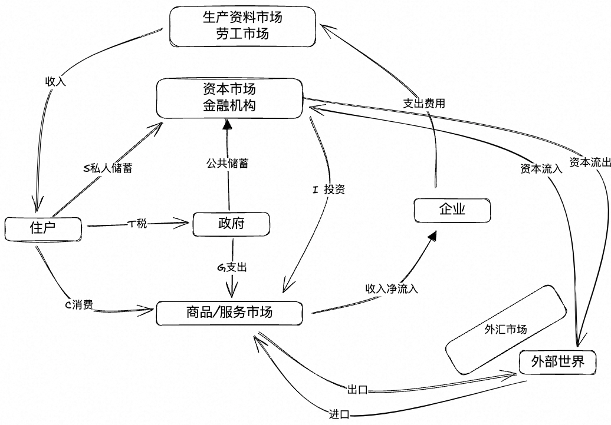

## **1. 什么是宏观经济**

宏观经济模型描述了住房、政府、企业、金融市场、商品服务市场、劳工市场、外汇市场以及其他世界之间的货币流通关系。

- **储蓄与投资**：
  - 储蓄是理财，投资是将钱用出去。
  - 投资的分类：
    1. **PPE（固定资产）**：如工厂设备。
    2. **存货**：在 GDP 中占比过高说明效益不高（三去政策中的"去存货"）。
    3. **自建房**：个人或企业建造房屋。

- **服务**：
  - 如医疗、教育等服务行业。

---

## **2. 怎么计算 GDP**

### **2.1 支出法**

GDP = C（居民消费） + I（金融和资本市场投资） + G（政府支出） + 出口 - 进口

### **2.2 收入法**

GDP = 劳工收入 + 资本收入

### **2.3 储蓄与投资的关系**

S = I（企业到国内金融和资本市场的投资） + 国内资本流出 - 国际资本流入  
即：S = I + NCO（Net Capital Outflow）

#### **2.3.1 金融市场的作用**

- 金融市场决定利率（回报率）。
- **S 和 r 的关系**：实际利率越高，储蓄越多，消费减少（正相关）。
- **I 和 r 的关系**：利率越高，企业越不愿意投资（负相关）。
- **NCO 和 r 的关系**：
  - 国内回报率越高，NCO 和 r 是负相关。
  - 外国回报率越高，NCO 和 r 是正相关。

#### **2.3.2 NX 与汇率的关系**

NX = NCO  
汇率提高，净出口减少。

---

## **3. 可贷资金市场与外汇市场**

### **3.1 可贷资金市场**

- 利率与 S 正相关，与 I + NCO 负相关。
- 交叉点决定了储蓄和投资的平衡，并确定利率 r。

### **3.2 外汇市场**

- NX 与汇率 E 负相关。
- 对冲基金进攻泰铢的案例：
  - 借泰铢并抛售，导致资本外逃，汇率下跌。

---

## **4. 国际收支平衡**

### **4.1 净出口与资本净流出**

- NX（净出口） = 出口 - 进口  
- NCO（资本净流出） = 资本流出 - 资本流入  
- NX = NCO

---

## **5. 外汇储备为什么越来越多**

NX = NCO = 出口 - 进口 = 中国居民 + 企业 + 央行（Δ外汇储备） - 进口  

央行（Δ外汇储备） = NX + 进口 - （中国居民 + 企业）  

- NX 和进口不断增加，出口投资受到金融管制。

---

## **6. 什么是汇率**

e = $/¥  
1 块人民币能换多少美元，即外币/本币。

---

## **7. 什么是购买力平价**

### **7.1 购买力平价公式**

两篮子消费品的成本：

- 中国的生产成本 P中（以人民币定价）
- 美国的生产成本 P美（以美元定价）

如果 100/P中 > 100e/P美，则从中国购买商品并在美国销售。  
最终套利空间消失，汇率调整最快，价格也可能变化。

e = P美 / P中  
即购买力平价。

---

## **8. 什么是金融套利**

### **8.1 息差套利**

假设 r中（中国利率） > r美（美国利率），则借美元在中国投资。  
当期汇率 e0，下一期汇率 e1。  
投资收益公式：

- 中国投资收益：e1 × (100/e0 × (1 + r中))
- 美国投资收益：100 × (1 + r美)

如果 e1 × (100/e0 × (1 + r中)) - 100 × (1 + r美) > 0，则套利成功。

---

## **9. 什么是实际利率**

实际利率 = 名义利率 - 通胀预期  

E = e × CPI本 / CPI外  
e = （外币 1/6.5）/（本币 1）  

- 名义汇率反映当前购买力，但需考虑 CPI（消费者物价指数）。

---

## **10. 为什么出口型企业不出去投资？**

- 营收（美元） - 成本（人民币）  
- 实际汇率 E = e × CPI本 / CPI外  
  - e 上涨（对外升值），CPI本上涨（对内贬值），实际汇率上升。
  - 美元定价不变，营收减少，成本上升，毛利率降低。

---

## **11. 复利的威力**

- 每年 10% 的增长率，7 年翻一番。
- 每年 7% 的增长率，10 年翻一番。

---

## **12. 什么是金融抑制**

- 没有什么东西可以抵御通胀。

---

## **13. 汇率和利率的关系**

利率可视为投资某国的回报率。  
美联储加息时，r美 > r中，资金流向美国，美元升值。

---

## **14. 什么是实物套利**

假设某商品在中国的价格为 P中，在美国的价格为 P美。  
100 元人民币：

- 在中国可买到 100/P中
- 在美国可买到 100e/P美  

如果 100/P中 > 100e/P美，则从中国购买商品卖到美国赚取差价。

---

## **15. 什么是弗里德曼理论**

合理分配收入：年轻时提前消费中年的金钱，退休后消费中年的金钱。

---

## **16. 银行为什么那么赚钱**

- 银行通过净息差（约 2.5%）赚取利润。
- 影子银行（如微众）放贷无需准备金，企业通过影子银行贷款投资。
- 银行中介推荐理财产品，赚取利差，用户赚取理财收益。

---

## **17. 什么是 M2**

M2：货币供应量  

Δm = ΔMB × MM  

- Δm：总货币增量  
- ΔMB：央行发行的货币  
- MM：货币乘数  

---

## **18. 发行货币的作用**

- 避免货币通缩，发钱。
- 央行回笼资金减少通胀的措施：
  1. 借债（如发行国债）。
  2. 提高准备金率。

---

## **19. 什么是顺差和逆差**

- **顺差**：出口 > 进口。
- **逆差**：进口 > 出口。
