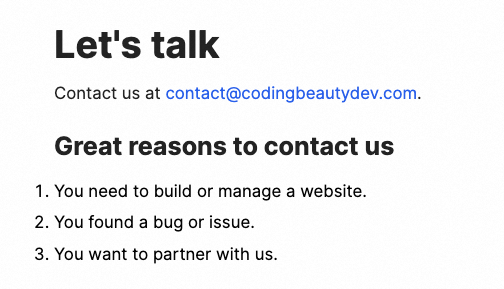
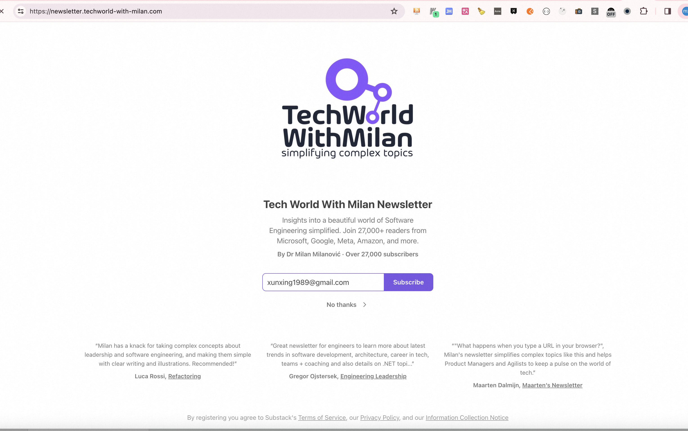

预售是提前支持
博客中写教程：添加代码演示工具

自己做的产品化的东西（搞一个MVP 博客的教程 builder on react

node + ts(next.js) node’s 录播+直播答疑

个人站点里做：（加一些绘图，用户非常具有粘性，learn in public 加一些reddit的文章）
1、 低版本教程
2、高级收费课程
3、接google广告

1、把博客的内容做精（增加更多初级别的教程）。 要有国际化（利于SEO）。
2、增加一个Contact方便其他人联系你

---

blog: 把阅读量展示出来

专注前端领域： 像这种付费csdn 可能就非常好
https://blog.csdn.net/qq449245884/category_12153673.html

付费才能看出自己的知识是否有价值

创业来自非共识｜ 认知

录视频尽量用中文

- 在博客当中插入youtube视频，每次录一个视频都先写博客或者脚本。
- 在博客当中插入课程或者数字产品售卖

每天写一下你学到的内容，并且通过视频分享给其他人

aiagent.me
askme.com 通过一个小部件 内嵌到公众号。可以让任何人向其他人咨询任何事情。
借助ai大模型的能力。每个人都可以有自己的agent，回答任何人的任意问题。解决知识储备的问题。

---

学会自己和自己对话。把不懂的东西搞懂。

费曼学习法。 。学习维度的认知

---

- 可能发生的事情终将会发生。高标准要求自己

---

积极主动：
1、主动为自己负责任，不把问题归咎于环境和他人
2、相信自己一直都有选择如何回应的能力

ABCDE认知法：ABC(事件、看法、感觉)
D(自我辩论）：这件事对我的帮助是什么？每次沟通的好处是什么？每次改变是否有利事情向好的地方发展？最后取得的结果是否有进步？
E(结果)： 重新思考他人的压力以及自己和他人沟通心态，定立合理的沟通阶段，建立良好的情感账户

---

- 通过在行，去兜售你的知识服务

ai music 助理。 通过ai训练我的喜好， 然后推荐给我。

在博客/知识星球里面加一个telegram社群号，方便大家沟通。

---

订阅可以免费+收费
https://newsletter.techworld-with-milan.com/p/what-is-the-difference-between-mvc

而且文章里还有广告

---

技术的壁垒打造牛逼的技术产品

---
**AI book reader 总结抽象 + 结合短视频** 

pdf文件抽象 

借助于pc桌面客户端的免费额度

---

从论坛、youtube、twitter找灵感，然后通过个人特质（比如前端工程师的技术能力、资源、信息差）去创建产品和服务

## 近期的想法

chatgpt 作为资料收集，写摘要简报给我，然后我根据这些内容来决定今天做什么视频，写什么稿子

1、创建绘本故事发布到亚马逊电子图书市场 
2、国际化是一个重要能力： 包括博客、视频博客（比如youtube\B站\抖音)
