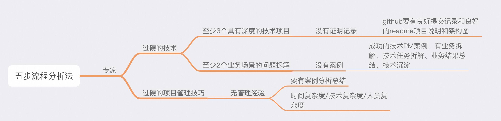

真正的爱不是感觉，是责任和付出

陪孩子度过小学6年

时间效率的最大化，要从整体来看。 
你今天有没有高效率的提高你的时间效率，快速成长，从而和其他人拉开数量级的区别。
- From 黄仁勋 & 吴军 启发

思考未来的方式是从基本原理出发，未来软件的编写方式和使用方式都依赖机器学习。 以前的软件是手工的。
最好的导师是AI，要善于用 推理链 去做事情。 AI软件工程师、AI设计师、AI验证工程师。 
先想清楚要解决什么问题，然后用AI帮助我们思考，然后找到方式自动化和扩大规模。这需要创造力、决心以及知识，知道如何分解问题。
- From 黄仁勋

6顶思维帽去辩证看问题

王慧文清华产品课

是否可以通过创业大佬的思路 做一个agent 过滤想法以及做任务拆解 

综合： 
+ 能干和会说是两个尺度：会说是重量 能干是长度。我们做自己也是让更多人做自己
+ 受众是阅读型还是听众型。首次要多沟通。1%，50%， 99%汇报。
+ 也许很多人只是不知道如何表达而已。发声，重塑别人或者消磨别人，要会说。
+ 给自己定一个目标。无中生有。让听见炮火的人呼叫炮火（目标从下而上）。 因为目标才确定了你的工作。
+ 哪怕你只为一个用户解决了问题，那对这个用户也是有价值的。
+ 魔鬼都在细节里，当掉在细节里的时候，你就会直面魔鬼

---

-- 如何思考
出发点： 场景出发、价值出发。。
价值衡量
你的判断是什么？
路径实现

--如何做事
为什么做
怎么做

mindnode 思维导图工具

不看没有做成功过的人的方法论

每个字都懂 就是看不懂（说明原理不懂）

