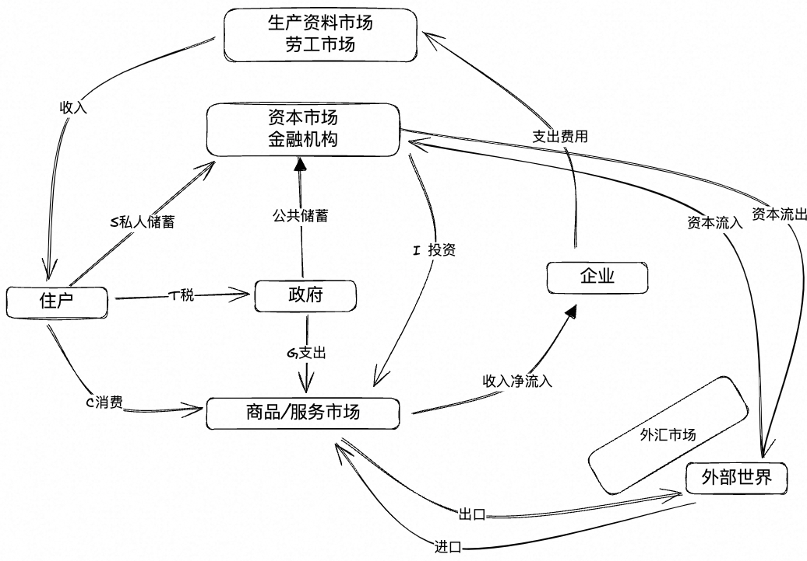

## 什么是宏观经济
宏观经济的模型： 就是住房、政府、企业、金融市场、商品服务市场、劳工市场、外汇市场、其他世界之间的货币流通关系

储蓄是理财，投资是钱用出去
投资： 
1） PPE固定资产
2）存货（在GDP占比太高，说明效益不高，三去 去存货）
3）自建房

服务： 比如医疗

## 怎么计算GDP

从宏观经济模型中归纳出来：
支出法： GDP = C（居民消费） + I（金融和资本市场投资） + G（政府支出） + 出口 - 进口
收入法： GDP = 劳工收入 + 资本收入

S = I（企业到国内金融和资本市场投资）+ 国内资本流出 - 国际资本流入 = I + NCO 

说明：金融市场是定利率，也就是供需关系
1、S和r的关系，也就是实际利率（回报率）的关系：回报率越高，储蓄的钱越多，而不是消费。所以是正相关
2、I和r的关系： 利率越高，企业越不会投资，所以是负相关
3、NCO和r的关系： 国内的回报率越高，则R中和NCO是负相关；外国的回报率越高，r外和NCO是正相关。

从数字变成函数，就是行为假设。

NX = NCO

说明： 
NX和汇率的关系：汇率提高，净出口减少

可贷资金市场（万亿级）： 利率和S正相关，和I+NCO是负相关， 交叉点就是储蓄和投资，将r价格定下来；NCO(千亿级别）和r是负相关；
外汇市场： NX是E的关系，负相关。

对冲基金进攻泰铢，借泰铢把泰铢卖掉。资本外逃，汇率下跌。

## 国际收支平衡
NX（净出口） = 出口 - 进口 
NCO资本净流出 =  资本流出 - 资本流入

NX = NCO

NCO: Net Capital Cutflow

## 外汇储备为什么越来越多
NX = NCO = 出口 - 进口 = 中国居民 + 企业 + 央行（Δ外汇储备）- 进口

央行（Δ外汇储备） = NX + 进口 - （中国居民 + 企业）

NX和进口不断增加，出口投资被金融管制。

## 什么是汇率

e = $/¥  1块人民币能换多少美元 也就是外币/本币

## 什么是购买力平价
Purchasing power parity

两篮子消费品，中国的生产成本P中（以人民币定价），美国的生产成本P美（以美元定价）。100/P中  > 100e/P美 中国买，美国卖。如果赚钱，扩大生产。汇率可能变（调节的最快），价格可能变，最终中间的利润空间就没有了。这个就是实物逃离。

e = P美/P中，就是购买力平价。按照这个定价，也就是定汇率是1/5（人民币有升值空间）。定价机制就是套利，通过市场定价，套利的空间就没有了（所以就是有高频的交易，波动大）。

## 什么是金融套利%%%%
看息差。
比如r中 是中国利率， r美是美国利率。 假设r中大于r美，则借美元。
当期中国汇率是：e0 下一期汇率是e1   这里的汇率就是1人民币兑换多少美元
我100美元（有会计上就是借）。在中国投资，买100/e0国债，下一期后总的钱（有会计上就是贷）是： 100/e0 x (1+r中)   换成美元后是： e1 x (100/e0 x (1+r中))。 100块钱在美国投资。 100 x (1 + r美)。

如果 e1 x (100/e0 x (1+r中)) - 100 x (1 + r美)  > 0 ，也就是贷大于借，就是赚钱了。 那么我可以不断地从美国借钱，换成人民币，然后回到美国，我就赚钱了，空手套白狼。因为中国回报率高， 则在中国投资，钱流回美国。如果中国利率不变，e1/e0 = 1，稳赚不赔。

## 什么是实际利率
实际利率=名义利率-通胀预期
E = e x CPI本/CPI外  
e = （外币1/6.5）/（本币1）  

说明： 名义汇率也就是今天1块钱能买的，明天不一定能买，需要乘以CPI

说明一个问题： 为什么出口型企业不出去投资，出口压力。？
营收（营收是美元） - 成本（是人民币）

E = e x CPI本/CPI外  根据这个公式： e上涨（对外汇率升值），CPI本上涨（物价不断上涨，对内人民币贬值），实际汇率在涨，也就是人民币升值。而美元定价不变（不能涨价），营收在变少，成本在不断上升。毛利率很低的话，是致命的。

E = e x CPI本/CPI外  推导出（两边取对数，变成加减法，对数随着时间的变化就是指数增长率）：

Δ%E（实际升值的百分率） 约等于  Δ%e（名义升值百分率） - 国内通胀（也就是国内CPI上涨的百分率） - 国外通胀（国外上涨的百分率）
5% = 2% + 5% - 2%

## 复利的威力
每年10%的增长率，7年翻一番。
每年7%的增长率，10年翻一番。

## 什么是金融抑制
没什么东西可以买来抵御通胀。

## 汇率和利率的关系
利率可以认为是投资这个国家的回报率。比如美联储加息，根据上面的金融套利公式， r美增加>r中。则借100人民币，到美国投资（买美国国债）。 美元当期汇率是e0（1美元换成多少人民币）, 下一期是e1。 换成美元，美国投资： e1 x  100/e0 x (1+r美)  - 100 x (1 + r中) 。 因为r美提高，所以美元的回报率就会增加，市场永远减少套利空间，也就是e0必须增加，也就是美元就有升值的压力。

## 什么是实物套利
假设某个商品在中国的价格是P中，在美国的价格是P美。那么我有100块人民币。 
在中国可以买到100/P中，在美国可以买到100e/P美。如果100/P中大于100e/P美，那么我就可以从中国买东西卖到美国去，赚取差价

## 什么是弗里德曼理论
合理分配收入： 就是年轻时提前消费中年积攒的金钱，退休后消费中年的金钱。

## 银行为什么那么赚钱

利润公司50%利润被银行弄去，为什么？银行的利率（净息差）大概2.5%乘以货币总量大概188万亿，这个利润是惊人的，因为正常的毛利都是销售毛利，不会是货币总量的。2.5%的利率怎么来的？主要是影子银行（比如微众）放贷，放贷是是在表外，不需要准备金。然后企业去影子银行贷款投资。对个人来说，银行中介推荐你去买理财产品，银行赚取利差，你赚取理财收益：理财收益=实体投资收益-金融中介成本。

## 什么是M2
M2：是货币供应量。 

Δm ：总货币增量
ΔMB：央行发行的货币
MM： 货币乘数

Δm = ΔMB x MM

## 发行货币的作用
为了避免货币通缩，发钱；
央行为了回笼资金，减少通胀有两种措施：
1、借债。 比如发国债
2、提高准备金率

## 什么是顺差和逆差

