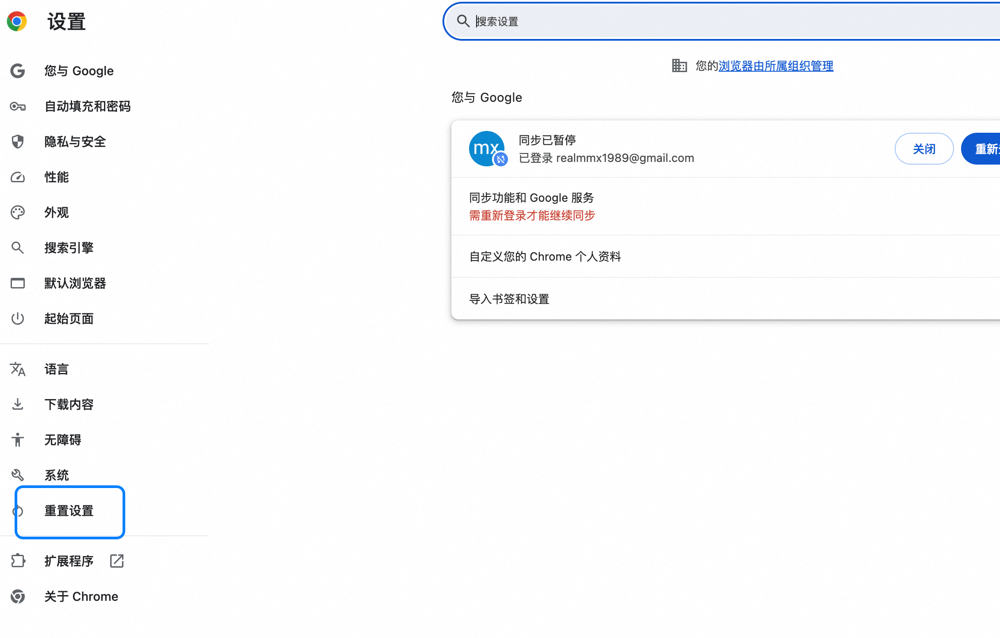

## **1. 问题描述**

在使用 Cloudflare CAPTCHA 时，可能会遇到以下提示：

```
Can't verify the user is human. Please try again.
```

该问题可能导致用户无法正常通过验证。

---

## **2. 解决办法**

### **2.1 重置浏览器设置**

- 尝试重置浏览器的设置，以解决可能由浏览器配置或缓存引起的问题。
- 具体操作步骤因浏览器而异，通常可以在浏览器的设置菜单中找到“恢复默认设置”或“清除缓存和 Cookie”的选项。

### **2.2 示例图片**

以下是重置浏览器设置的参考图片：


---

## **3. 注意事项**

1. **清除缓存和 Cookie**：
   - 在重置浏览器设置之前，建议先清除浏览器的缓存和 Cookie，这可能会解决部分问题。

2. **尝试其他浏览器**：
   - 如果问题仍然存在，可以尝试使用其他浏览器访问，排除特定浏览器兼容性问题。

3. **检查网络环境**：
   - 确保网络环境稳定，避免因网络波动导致验证失败。

---

## **4. 总结**

通过重置浏览器设置或清除缓存，通常可以解决 Cloudflare CAPTCHA 提示“无法验证用户为人类”的问题。如果问题仍未解决，建议检查网络环境或联系相关技术支持。

---
