### Array & hash
 [Top K Frequent Elements](https://leetcode.com/problems/top-k-frequent-elements/)

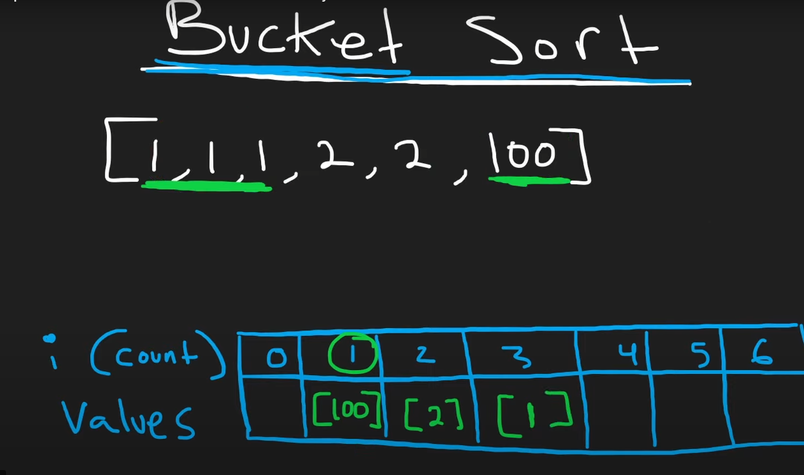

``` python
class Solution:  
    def topKFrequent(self, nums: List[int], k: int) -> List[int]:  
        dict = {}  
        for num in nums:  
            if num not in dict:  
                dict[num] = 1  
            dict[num] = dict[num] + 1  
        sorted_items = sorted(dict.items(), key=lambda item: item[1], reverse=True)  
        #keys = [item[0] for item in sorted_items[:k]]  
        return sorted_items
```

[Product of Array Except Self](https://leetcode.com/problems/product-of-array-except-self/)

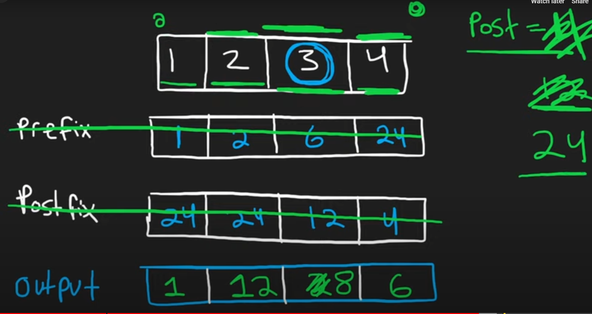

```python
from typing import List  
  
class Solution:  
    def productExceptSelf(self, nums: List[int]) -> List[int]:  
        n = len(nums)  
        prefix_prduct = 1  
        postfix_product = 1  
        result = [0] * n  
        for i in range(n):  
            result[i] = prefix_prduct  
            prefix_prduct *= nums[i]  
  
        for i in range(n-1, -1, -1):  
            result[i] *= postfix_product  
            postfix_product *= nums[i]  
  
  
        return result  
  
print(Solution().productExceptSelf([1,2,3,4]))  # 输出: [24, 12, 8, 6]
```

我们以输入列表 [1,2,3,4] 为例，来详细解释第三步的过程。  
  
在第二步结束后，result 和 postfix_product 的值如下：  
  
- result = [1, 1, 2, 6]（存储了每个元素左边所有元素的乘积）  
- postfix_product = 1  
  
然后，我们从后向前遍历输入列表 nums：  
  
1. 当 i = 3（对应元素 4）时，我们将 postfix_product 的值（此时为 1）乘到 result[3] 上，得到 result = [1, 1, 2, 6]。然后，我们将 nums[3]（即 4）乘到 postfix_product 上，得到 postfix_product = 4。  
  
2. 当 i = 2（对应元素 3）时，我们将 postfix_product 的值（此时为 4）乘到 result[2] 上，得到 result = [1, 1, 8, 6]。然后，我们将 nums[2]（即 3）乘到 postfix_product 上，得到 postfix_product = 12。  
  
3. 当 i = 1（对应元素 2）时，我们将 postfix_product 的值（此时为 12）乘到 result[1] 上，得到 result = [1, 12, 8, 6]。然后，我们将 nums[1]（即 2）乘到 postfix_product 上，得到 postfix_product = 24。  
  
4. 当 i = 0（对应元素 1）时，我们将 postfix_product 的值（此时为 24）乘到 result[0] 上，得到 result = [24, 12, 8, 6]。  
  
所以，最后返回的结果列表 result 是 [24, 12, 8, 6]，其中每个元素都是原始列表中除了自己以外所有元素的乘积。

 [Valid Sudoku](https://leetcode.com/problems/valid-sudoku/)

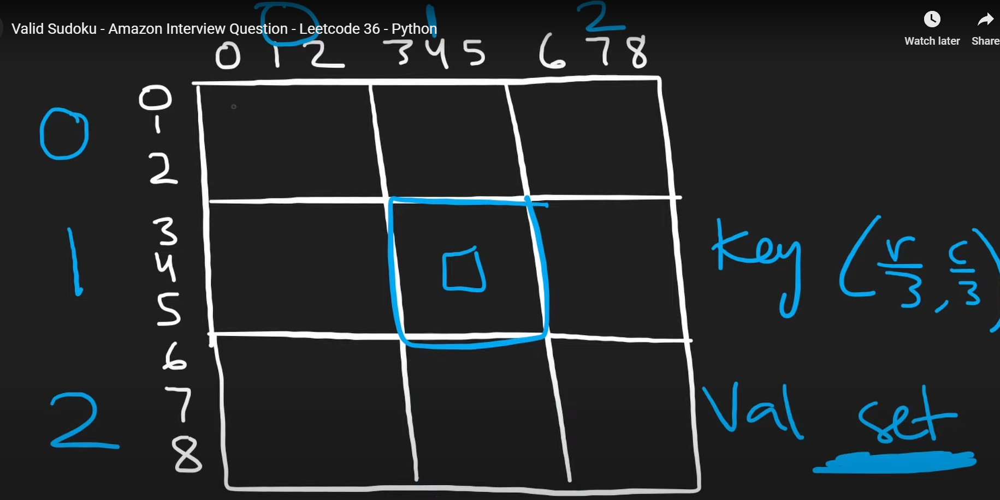

``` python
class Solution:  
    def isValidSudoku(self, board: List[List[str]]) -> bool:  
        rows = [{} for _ in range(9)]  
        columns = [{} for _ in range(9)]  
        boxes = [{} for _ in range(9)]  
  
        for i in range(9):  
            for j in range(9):  
                num = board[i][j]  
                if num != '.':  
                    num = int(num) 
                    box_index = (i // 3 ) * 3 + j // 3  
                    rows[i][num] = rows[i].get(num, 0) + 1  
                    columns[j][num] = columns[j].get(num, 0) + 1  
                    boxes[box_index][num] = boxes[box_index].get(num, 0) + 1  
  
                    if rows[i][num] > 1 or columns[j][num] > 1 or boxes[box_index][num] > 1:  
                        return False       
        return True

```

```js
//模版1: 3*3方格
//notInBox(row - (row % 3), col - (col % 3), board)
function notInBox(startRow, startCol, board) {
  let st = new Set();
  for (let i = 0; i < 3; i++) {
    for (let j = 0; j < 3; j++) {
      let cur = board[startRow + i][startCol + j];

      if (st.has(cur)) {
        return false;
      }
      if (cur !== ".") {
        st.add(cur);
      }
    }
  }
  return true;
}
```

通过行、列、盒子来判断是否存在重复的值。rows是定义成数组，每个数组是一个hash，`row[0][5]=0` 这种方式计算当前行的5的数量。特别要注意的是盒子的索引：``
`(i // 3) * 3 + j // 3` 对于任意一个元素，其行索引为i，列索引为j，那么它所在的3x3子数独的索引就可以通过(i // 3 ) * 3 + j // 3计算得到。例如，如果一个元素的行索引为4，列索引为7，那么它所在的3x3子数独的索引就是(4 // 3) * 3 + 7 // 3 = 1 * 3 + 2 = 5，即它在上图中的第5个子数独中。

[Longest Consecutive Sequence](https://leetcode.com/problems/longest-consecutive-sequence/)

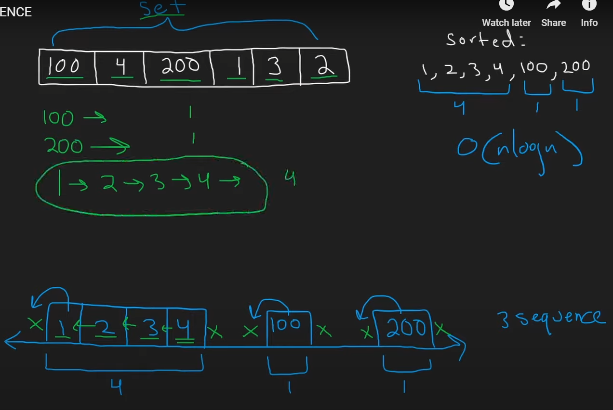

``` python
class Solution:  
    def longestConsecutive(self, nums: List[int]) -> int:  
        nums_set = set(nums)  
        longest = 1  
        for i in nums_set:  
            if i - 1 not in nums_set:  
                current_len = 1  
                current_num = i + 1  
                while current_num in nums_set:  
                    current_num += 1  
                    current_len = current_len + 1  
                longest = max(longest, current_len)  
        return longest  
  
Solution().longestConsecutive([100, 100,4,200,1,3,2])

```

[3Sum](https://leetcode.com/problems/3sum/)

``` python
class Solution:  
    def threeSum(self, nums: List[int]) -> List[List[int]]:  
        res = set()  
        n, p, z = [], [], []  
        for i in nums:  
             if i > 0:  
                 p.append(i)  
             elif i < 0:  
                 n.append(i)  
             else:  
                 z.append(i)  
        N, P = set(n), set(p)  
        if z:  
            for i in P:  
                if -1*i in N:  
                    res.add((-1*i, 0, i))  
  
        if len(z) >= 3:  
            res.add((0,0,0))  
  
        for i in range(len(n)):  
            for j in range(i+1, len(n)):  
                target = -1*(n[i]+n[j])  
                if target in P:  
                    res.add(tuple(sorted([n[i], n[j], target])))  
  
        for i in range(len(p)):  
            for j in range(i+1, len(p)):  
                target = -1*(p[i]+p[j])  
                if target in N:  
                    res.add(tuple(sorted([p[i],p[j], target])))  
  
        return res

```
### Two Pointer

[Valid Palindrome](https://leetcode.com/problems/valid-palindrome/)
![[Pasted image 20240225105519.png]]
``` python
class Solution:  
    def isPalindrome(self, s: str) -> bool:  
        start = 0  
        end = len(s) - 1  
        while start < end:  
            if not s[start].isalnum():  
                start += 1  
                continue  
            if not s[end].isalnum():  
                end -= 1  
                continue  
            if s[start].lower() != s[end].lower():  
                return False  
            start += 1  
            end -= 1  
        return True
```

[Two Sum II Input Array Is Sorted  ](https://leetcode.com/problems/two-sum-ii-input-array-is-sorted/)

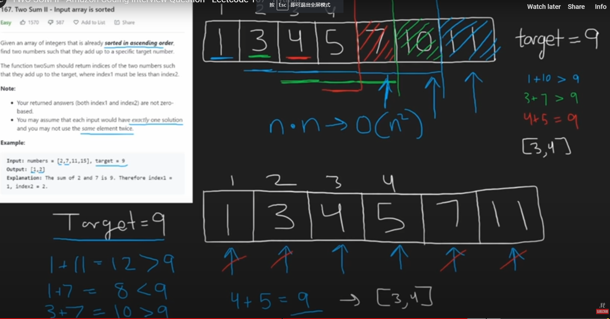

``` python
class Solution:  
    def twoSum(self, numbers: List[int], target: int) -> List[int]:  
        start = 0  
        end = len(numbers) - 1  
        while start < end:  
            sum = numbers[start] + numbers[end]  
            if sum == target:  
                return [start, end]  
            elif sum < target:  
                start += 1  
            else:  
                end -= 1  
        return []
```
[Container With Most Water](https://leetcode.com/problems/container-with-most-water/) (Hard）

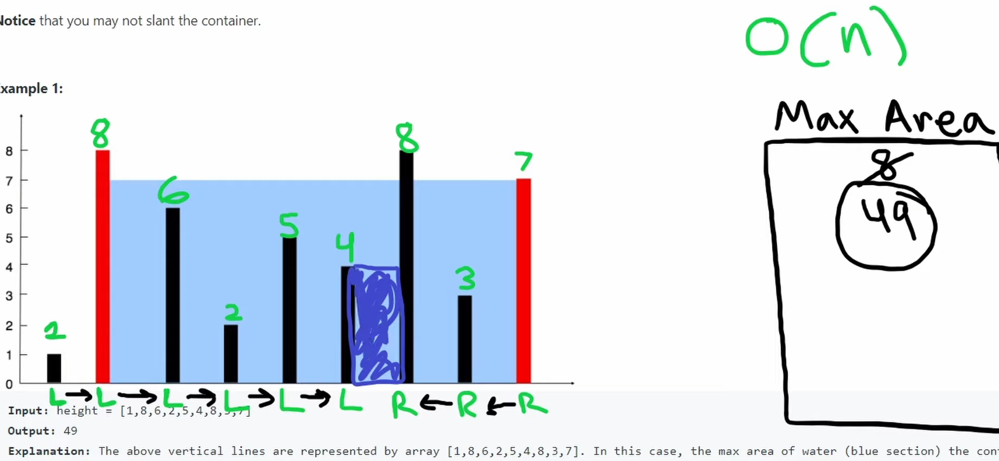

``` python
# min(LMin, RMax) - h(i) 
class Solution:  
    def maxArea(self, height: List[int]) -> int:  
        n = len(height)  
        l, r = 0, n - 1  
        ans = 0  
        while l <= r:  
            ans = max(ans, (r-l)*min(height[l], height[r]))  
            if height[l] < height[r]: l += 1  
            else:  r -= 1  
        return ans
```

[Trapping Rain Water](https://leetcode.com/problems/trapping-rain-water/)

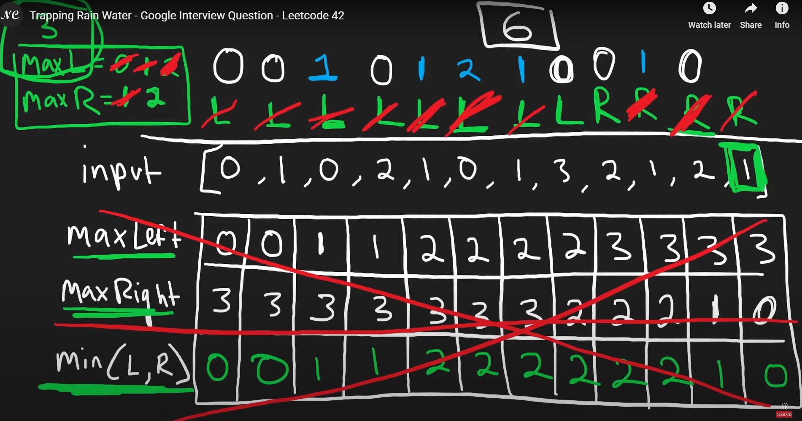

``` python
# min(LMin, RMax) - h(i) 
class Solution:  
    def maxArea(self, height: List[int]) -> int:  
        if not height:  
            return 0  
        l, r = 0, len(height) - 1  
        lMax, rMax = height[0], height[-1]  
        res = 0  
  
        while l < r:  
            if lMax < rMax:  
                l += 1  
                lMax = max(lMax, height[l])  
                res += lMax - height[l]  
            else:  
                r -= 1  
                rMax = max(rMax, height[r])  
                res += rMax - height[r]  
  
        return res

```

### Stack

[Valid Parentheses  有效括号](https://leetcode.com/problems/valid-parentheses/)

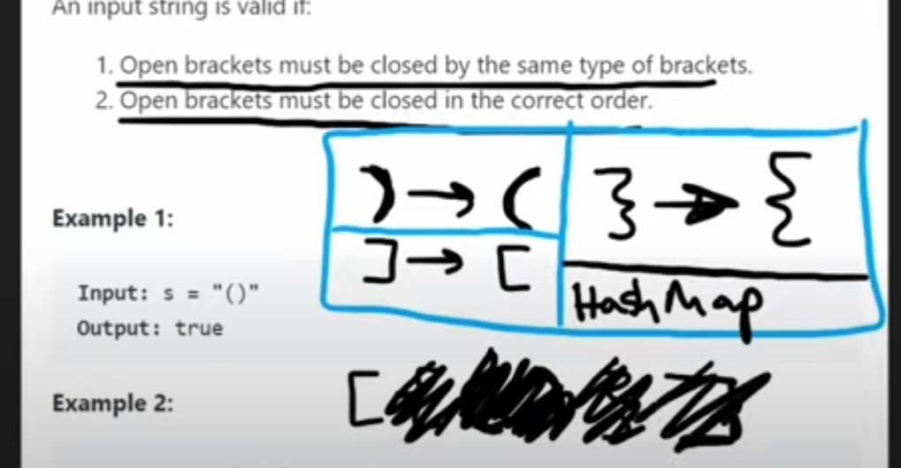

```python
class Solution:  
    def isValid(self, s: str) -> bool:  
        stack = list()  
        dict = { "(": ")", "{": "}", "[": "]" }  
        for char in s:  
            if len(stack) > 0 and stack[-1] not in dict:  
                return False  
            if len(stack) == 0 or dict[stack[-1]] != char:  
                stack.append(char)  
                continue  
            stack.pop()  
        return len(stack) == 0

```

[Min Stack  最小堆栈](https://leetcode.com/problems/min-stack/)


``` python
class MinStack:  
    def __init__(self):  
        self.list = []  
        self.min = []  
    def push(self, val: int) -> None:  
        self.list.append(val)  
        self.min.append(val if not self.min else min(val, self.min[-1]))  
    def pop(self) -> None:  
        self.list.pop()  
        self.min.pop()  
    def top(self) -> int:  
        return self.list[-1]  
    def getMin(self) -> int:  
        return self.min[-1]

```

[Evaluate Reverse Polish Notation](https://leetcode.com/problems/evaluate-reverse-polish-notation/)
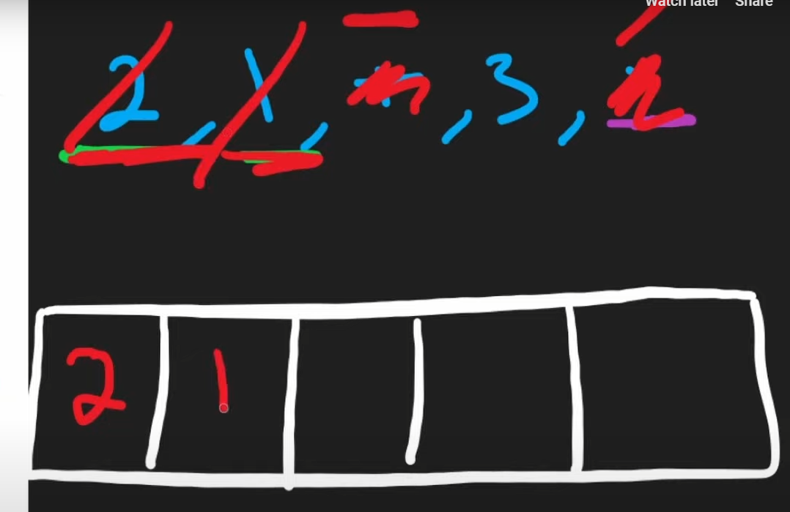


``` python
class Solution:  
    def evalRPN(self, tokens: List[str]) -> int:  
        stack = []  
        ops = ['+', '-', '*', '/']  
        for token in tokens:  
            if token in ops:  
                a = stack.pop()  
                b = stack.pop()  
                if token == '+':  
                    result = int(b) + int(a)  
                elif token == '*':  
                    result = int(b) * int(a)  
                elif token == '/':  
                    result = int(b) / int(a)  
                else:  
                    result = int(b) - int(a)  
                stack.append(int(result))  
                continue  
            stack.append(int(token))  
        return stack[-1]
```

[Generate Parentheses   生成括号](https://leetcode.com/problems/generate-parentheses/)
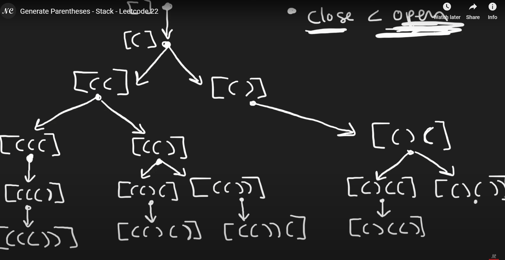


``` python
# openN < 3, closeN < 3
# openN > closeN can add ')'
# openN == closeN == 3, exit
class Solution:  
    def generateParenthesis(self, n: int) -> List[str]:  
        stack = []  
        res = []  
        def backtrack(openN, closeN):  # 回溯
            if openN == closeN == n:  
                res.append("".join(stack))  
                return  
            if openN < n:  
                stack.append('(')  
                backtrack(openN+1, closeN)  
                stack.pop()  
            if openN > closeN:  
                stack.append(')')  
                backtrack(openN, closeN+1)  
                stack.pop()  
  
        backtrack(0, 0)  
        return res

```
[Daily Temperatures   每日气温](https://leetcode.com/problems/daily-temperatures/)

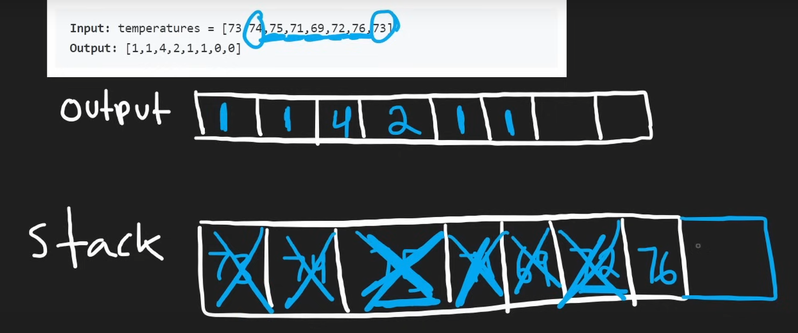

``` python
# 单调递减堆栈存储信息
class Solution:  
    def dailyTemperatures(self, temperatures: List[int]) -> List[int]:  
        stack = [] # pair: temp, index  
        res = [0] * len(temperatures)  
        for i, v in enumerate(temperatures):  
            while stack and v > stack[-1][0]:  
                stackT, stackIndex = stack.pop()  
                res[stackIndex] = (i - stackIndex)  
            stack.append([v, i])  
        return res

```

### Binary Search

[Binary Search  二分查找](https://leetcode.com/problems/binary-search/)


```python
class Solution:  
    def search(self, nums: List[int], target: int) -> int:  
        def bs(low, high):  
            if low > high:  
                return -1  
            mid = low + (high - low) // 2  
            if nums[mid] < target:  
                return bs(mid + 1, high)  
            elif nums[mid] > target:  
                return bs(low, mid - 1)  
            else:  
                return mid  
        return bs(0, len(nums) - 1)
```

[Search a 2D Matrix  搜索二维矩阵](https://leetcode.com/problems/search-a-2d-matrix/)
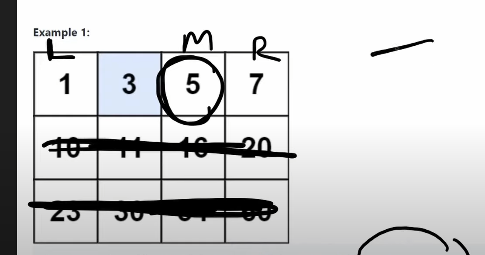


```python
# 通过指针直接操作，不需要额外的数组存储
class Solution:  
    def searchMatrix(self, matrix: List[List[int]], target: int) -> bool:  
        rows, cols = len(matrix), len(matrix[0])  
        top, bot = 0, rows - 1  
        while top <= bot:  # = 表示获取最后一个值
            mid = bot + (top - bot) // 2  
            if target > matrix[mid][-1]:  
                top = mid + 1  
            elif target < matrix[mid][0]:  
                bot = mid - 1  
            else:  
                break  # 找到当前行  
  
        if not (top <= bot):  # 没找到  
            return False  
  
        row = bot + (top - bot) // 2  # 当前行  
  
        l, r = 0, cols - 1  
        while l <= r:  
            m = l + (r - l) // 2  
            if target > matrix[row][m]:  
                l = m + 1  
            elif target < matrix[row][m]:  
                r = m - 1  
            else:  
                return True
```
[Koko Eating Bananas   科科吃香蕉](https://leetcode.com/problems/koko-eating-bananas/)


```python
class Solution:  
    def minEatingSpeed(self, piles: List[int], h: int) -> int:  
        l, r = 1, max(piles)  
        res = r  
        while l <= r:  
            k = l + (r - l) // 2  
            hours = 0  
            for p in piles:  
                hours += math.ceil(p / k)  
            if hours <= h:      
res = min(res, k)  
                r = k - 1  
            else:  
                l = k + 1  
        return res
```

[Find Minimum In Rotated Sorted Array  
查找旋转排序数组中的最小值](https://leetcode.com/problems/find-minimum-in-rotated-sorted-array/)


```python
class Solution:  
    def findMin(self, nums: List[int]) -> int:  
        res = nums[0]  
        l, r = 0, len(nums) - 1  
  
        while l <= r:  
            if nums[l] < nums[r]:  
                res = min(res, nums[l])  
                break  
  
            m = l + (r - l) // 2  
            res = min(res, nums[m])  
            if nums[m] >= nums[l]:  
                l = m + 1  
            else:  
                r = m - 1  
  
        return res
```

[Search In Rotated Sorted Array  在旋转排序数组中搜索](https://leetcode.com/problems/search-in-rotated-sorted-array/)

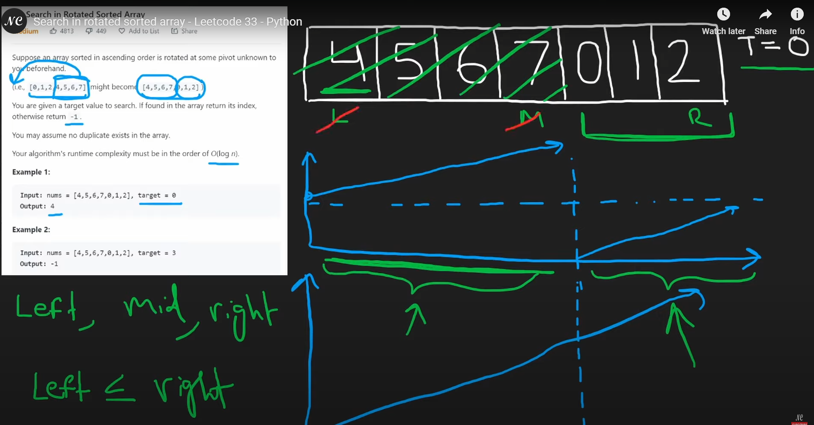

```python
# 2 3 4 0 1 left sorted
# 3 4 0 1 2 right sorted
class Solution:  
    def search(self, nums: List[int], target: int) -> int:  
        l, r = 0, len(nums) - 1  
  
        while l <= r:  
            mid = l + (r - l) // 2  
            if nums[mid] == target:  
                return mid  
  
            # left sorted portion  
            if nums[l] <= nums[mid]:  
                if target > nums[mid] or target < nums[l]:  
                    l = mid + 1  
                else:  
                    r = mid - 1  
            # right sorted portion  
            else:  
                if target < nums[mid] or target > nums[r]:  
                    r = mid - 1  
                else:  
                    l = mid + 1  
        return -1

```

[Time Based Key Value Store  基于时间的键值存储](https://leetcode.com/problems/time-based-key-value-store/)


```python
class TimeMap:  
    def __init__(self):  
        self.dict = {} # key: list of [value, timestamp]  
    def set(self, key: str, value: str, timestamp: int) -> None:  
        # already sorted  
        if key not in self.dict:  
            self.dict[key] = []  
        self.dict[key].append([value, timestamp])  
    def get(self, key: str, timestamp: int) -> str:  
        values = self.dict.get(key, [])  
        # find in binary search  
        l, r = 0, len(values) - 1  
        while l <= r: # equal to get last value  
            mid = l + (r - l) // 2  
            if values[mid][1] <= timestamp:  
                # 查找最后一个小于等于给定值的元素  
                if (mid == len(values) - 1) or values[mid + 1][1] > timestamp:  
                    return values[mid][0]  
                else:  
                    l = mid + 1  
            else:  
                r = mid - 1  
        return ''
```

### Sliding Window

[Best Time to Buy And Sell Stock  买卖股票的最佳时机](https://leetcode.com/problems/best-time-to-buy-and-sell-stock/)

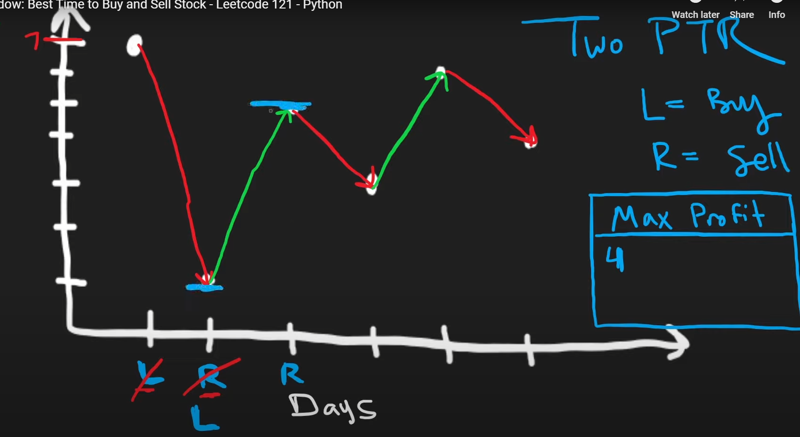

```python
class Solution:  
    def maxProfit(self, prices: List[int]) -> int:  
        l, r = 0, 1  
        maxP = 0  
        while r < len(prices):  
            if prices[l] < prices[r]:  
                profit = prices[r] - prices[l]  
                maxP = max(maxP, profit)  
            else:  
                l = r  
            r += 1  
        return maxP
```


```python
class Solution:  
    def lengthOfLongestSubstring(self, s: str) -> int:  
        charSet = set()  
        l = 0  
        res = 0  
        for r in range(len(s)):  
            while s[r] in charSet:  
                charSet.remove(s[l])  
                l += 1  
            charSet.add(s[r])  
            res = max(res, r - l + 1)  
        return res
```

[Longest Repeating Character Replacement  最长重复字符替换](https://leetcode.com/problems/longest-repeating-character-replacement/)


```python
class Solution:  
    def characterReplacement(self, s: str, k: int) -> int:  
        count = {}  
        res = 0  
        l = 0  
        for r in range(len(s)):  
            # add count of right char  
            count[s[r]] = 1 + count.get(s[r], 0)  
            # not effective window  
            while (r - l + 1) - max(count.values()) > k:  
                count[s[l]] -= 1 # add count of left char  
                l += 1 # move the left cursor  
            # effective window            res = max(res, r - l + 1)  
        return res
```
[Permutation In String   字符串中的排列](https://leetcode.com/problems/permutation-in-string/)

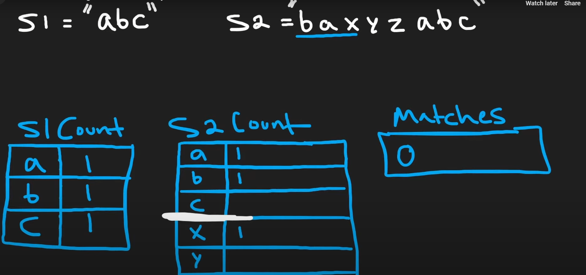

```python
# 寻找字符游戏，不关心顺序。
# 最简单：遍历两个数组，逐个对比，复杂度是n*m
# 优化：因为字符只有26个，可以建立一个hashmap，滑动窗口移动时，判断是否hashmap中存在，然后和数组a比较是否相等。复杂度是n
class Solution:  
    def checkInclusion(self, s1: str, s2: str) -> bool:  
        if len(s1) > len(s2): return False  
        # 初始化hashmap  
        s1Count, s2Count = [0] * 26, [0]*26  
        # 统计初始的出现次数  
        for i in range(len(s1)):  
            s1Count[ord(s1[i]) - ord('a')] += 1 # 统计出现次数  
            s2Count[ord(s2[i]) - ord('a')] += 1  
  
        # 如果找到匹配的应该是26，因为初始化其他的都是0  
  
        # 统计初始的匹配次数  
        matches = 0  
        for i in range(26):  
            matches += (1 if s1Count[i] == s2Count[i] else 0)  
  
        # 滑动窗口往右移动1位  
        l = 0  
        for r in range(len(s1), len(s2)): # 参数2是结束索引  
            if matches == 26: return True # 找到匹配字符  
  
            # 增加右邊字符判斷匹配情況  
            index = ord(s2[r]) - ord('a')  
            s2Count[index] += 1 # 匹配次數加1  
            if s1Count[index] == s2Count[index]:  
                matches += 1  
            elif s1Count[index] + 1 == s2Count[index]: # 因爲s2Count加了1，所以s1Count要+1進行比較  
                matches -= 1  
  
            # 移除左邊字符，計算匹配情況  
            index = ord(s2[l]) - ord('a')  
            s2Count[index] -= 1 # 匹配次數減1  
            if s1Count[index] == s2Count[index]:  
                matches += 1  
            elif s1Count[index] - 1 == s2Count[index]: # 應爲s2Count減了1，所以s1也要減1后比較  
                matches -= 1  
            l += 1 # 左邊指針移動  
        return matches == 26

```

简易版本
```python
# 滑动窗口指针只有i,
# The only thing we care about any particular substring in `s2` is having the same number of characters as in the `s1`. So we create a hashmap with the count of every character in the string `s1`. Then we slide a window over the string `s2` and decrease the counter for characters that occurred in the window. As soon as all counters in the hashmap get to zero that means we encountered the permutation.
class Solution:  
    def checkInclusion(self, s1: str, s2: str) -> bool:  
        def checkInclusion(self, s1: str, s2: str) -> bool:  
			# 初始不匹配都为1
            cntr, w = Counter(s1), len(s1)  
  
            for i in range(len(s2)):  
	            # 1 表示不匹配 0 表示匹配
                if s2[i] in cntr:  # 右边指针找到匹配 减1
                    cntr[s2[i]] -= 1  
                if i >= w and s2[i - w] in cntr: # 左边指针移出滑动窗口，不匹配加1
                    cntr[s2[i - w]] += 1  
				# 最后都为0说明找到匹配
                if all([cntr[i] == 0 for i in cntr]):
                    return True  
  
            return False
```

### LinkedList
[Reverse Linked List  反向链表](https://leetcode.com/problems/reverse-linked-list/)


```python
# Definition for singly-linked list.  
# class ListNode:  
#     def __init__(self, val=0, next=None):  
#         self.val = val  
#         self.next = next  
# Definition for singly-linked list.  
# class ListNode:  
#     def __init__(self, val=0, next=None):  
#         self.val = val  
#         self.next = next
# 双指针法
class Solution:  
    def reverseList(self, head: Optional[ListNode]) -> Optional[ListNode]:  
        prev, curr = None, head  
        while curr:  
            next = curr.next  # 保存之前的指针，避免指针断开
            # 修改指针
            curr.next = prev  
            # 指针往前移动
            prev = curr  
            curr = next  
        return prev
```
 [Merge Two Sorted Lists  合并两个排序列表](https://leetcode.com/problems/merge-two-sorted-lists/)

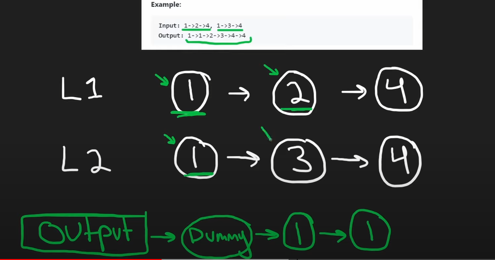

```python
# Definition for singly-linked list.  
# class ListNode:  
#     def __init__(self, val=0, next=None):  
#         self.val = val  
#         self.next = next  
class Solution:  
    def mergeTwoLists(self, list1: Optional[ListNode], list2: Optional[ListNode]) -> Optional[ListNode]:  
        dummy = ListNode()  
        tail = dummy  
        while list1 and list2:  
            if list1.val < list2.val:  
                tail.next = list1  
                list1 = list1.next  
            else:  
                tail.next = list2  
                list2 = list2.next  
            tail = tail.next  
        if list1:  
            tail.next = list1  
        else:  
            tail.next = list2  
        return dummy.next
```
[Reorder List  重新排序列表](https://leetcode.com/problems/reorder-list/)
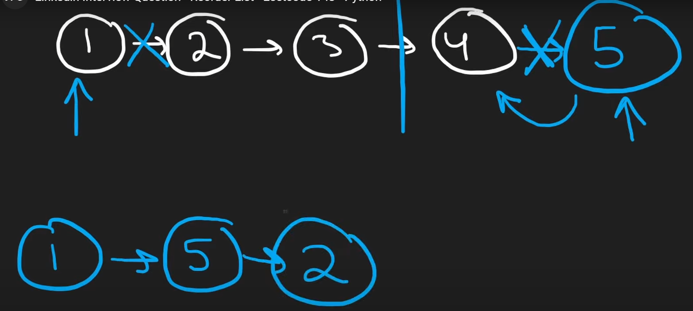

```python
# slow, fast pointer and dummy node
class Solution:  
    def reorderList(self, head: Optional[ListNode]) -> None:  
        class Solution:  
            def reorderList(self, head: Optional[ListNode]) -> None:  
                # find middle  
                slow, fast = head, head.next  
                while fast and fast.next:  
                    slow = slow.next  
                    fast = fast.next.next  
  
                # reverse second half  
                second = slow.next  
                prev = slow.next = None  
                while second:  
                    tmp = second.next  
                    second.next = prev  
                    prev = second  
                    second = tmp  
  
                # merge tow half  
                first, second = head, prev  
                while second:  
                    tmp1, tmp2 = first.next, second.next  
                    first.next = second  
                    second.next = tmp1  
                    first, second = tmp1, tmp2
```
[Remove Nth Node From End of List  从列表末尾删除第 n 个节点](https://leetcode.com/problems/remove-nth-node-from-end-of-list/)


```python
# slow, fast pointer and dummy node  
class Solution:  
    def removeNthFromEnd(self, head: Optional[ListNode], n: int) -> Optional[ListNode]:  
        dummy = ListNode(0, head)  
        left = dummy  
        right = head  
        while n > 0 and right:  
            right = right.next  
            n -= 1  
  
        while right:  
            left = left.next  
            right = right.next  
  
        # delete  
        left.next = left.next.next  
  
        return dummy.next
```

[Copy List With Random Pointer  使用随机指针复制列表](https://leetcode.com/problems/copy-list-with-random-pointer/)
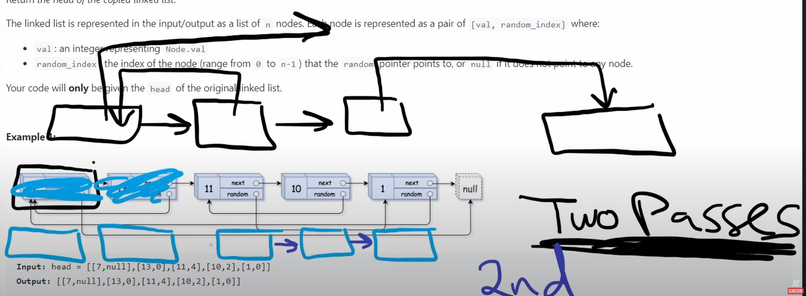


```python
# 通过先创建节点，再连线（创建hashmap建立两个链表的联系）
class Solution:  
    def copyRandomList(self, head: 'Optional[Node]') -> 'Optional[Node]':  
        oldToCopy = { None : None }  
  
        # one pass  
        cur = head  
        while cur:  
            copy = Node(cur.val)  
            oldToCopy[cur] = copy  
            cur = cur.next  
  
        # two pass  
        cur = head  
        while cur:  
            copy = oldToCopy[cur]  
            copy.next = oldToCopy[cur.next]  
            copy.random = oldToCopy[cur.random]  
            cur = cur.next  
  
        return oldToCopy[head]
```
[Add Two Numbers  将两个数字相加](https://leetcode.com/problems/add-two-numbers/)


```python
# 考虑 7 + 8 这样的边界case
class Solution:  
    def addTwoNumbers(self, l1: Optional[ListNode], l2: Optional[ListNode]) -> Optional[ListNode]:  
        dummy = ListNode()  
        cur = dummy  
        carry = 0  
        while l1 or l2 or carry:  
            v1 = l1.val if l1 else 0  
            v2 = l2.val if l2 else 0  
            # new digit  
            val = v1 + v2 + carry  
            carry = val // 10  
            val = val % 10  
            cur.next = ListNode(val) # create new node  
                        # update ptrs  
            cur = cur.next  
            l1 = l1.next if l1 else None  
            l2 = l2.next if l2 else None  
            return dummy.next
```

[Linked List Cycle  链表循环](https://leetcode.com/problems/linked-list-cycle/)


```python
# 或者用快慢指针 
class Solution:  
    def hasCycle(self, head: Optional[ListNode]) -> bool:  
        cur = head  
  
        visited = {}  
        while cur:  
            if cur in visited: return True  
            visited[cur] = True  
            cur = cur.next  
  
        return False
```

[Find The Duplicate Number   查找重复编号](https://leetcode.com/problems/find-the-duplicate-number/)


```python
class Solution:  
    def findDuplicate(self, nums: List[int]) -> int:  
        # 数组的值是[1,n] 0不在数组里面，可以把数组的值当做指针  
        # 本质上就是一个环，如果存在重复元素  
        # 如何找到最开始重复的元素：通过弗洛伊德算法 p(慢指针走到环开始节点需要的距离） = x（相交位置走到环开始需要的距离）  
        slow, fast = 0, 0  
        # 找到相交位置  
        while True:  
            slow = nums[slow]  
            fast = nums[nums[fast]]  
            if slow == fast:  
                break  
        # 弗洛伊德算法  
        slow2 = 0  
        while True:  
            slow = nums[slow] # 相交位置往前走  
            slow2 = nums[slow2] # 起始位置往前走  
            if slow == slow2:  
                return slow
```
[LRU Cache  LRU 缓存](https://leetcode.com/problems/lru-cache/)

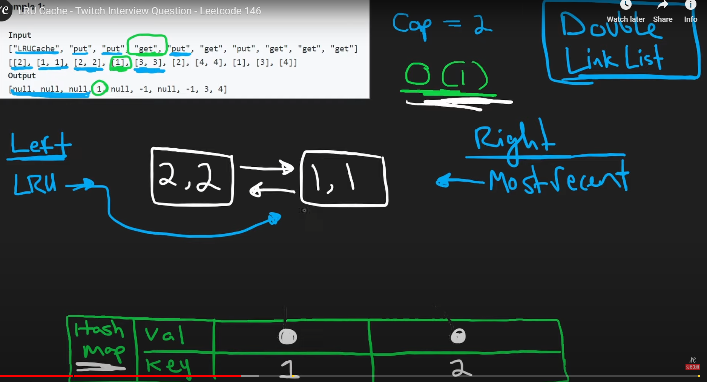

```python
class Node:  
    def __init__(self, key, val):  
        self.key, self.val = key, val  
        self.next = self.prev = None  # 是双向链表  
  
  
class LRUCache:  
  
    def __init__(self, capacity: int):  
        self.cap = capacity  
        self.cache = {}  # 快速找到节点的hashmap, 同时可以判断队列的长度  
        # left:LRU right:MRU  
        self.left, self.right = Node(0, 0), Node(0, 0)  # 指向左边第一个节点， 指向右边第一个节点，方便快速插入和删除，并且是双向链表  
        self.left.next = self.right  # 注意这里要更新前后指针  
        self.right.prev = self.left  
  
    # 从队列中删除一个元素  
    def remove(self, node):  
        prev, nxt = node.prev, node.next  # 这里先把前后节点弄出来  
        prev.next = nxt  
        nxt.prev = prev  
  
    # 插入队列尾部  
    def insert(self, node):  
        prev, nxt = self.right.prev, self.right  
        prev.next = nxt.prev = node  
        node.prev, node.next = prev, nxt  
  
    def get(self, key: int) -> int:  
        if key in self.cache:  
            # 将该元素从原先位置删除  
            self.remove(self.cache[key])  
            # 将该元素插入到最后  
            self.insert(self.cache[key])  
            return self.cache[key].val  # 注意这里是返回值  
        return -1  
  
    def put(self, key: int, value: int) -> None:  
        if key in self.cache:  # 注意这里是判断key是否存在，而不是self.cache[key]值是否存在  
            # 将该元素删除  
            self.remove(self.cache[key])  
        # 更新值，注意这里直接创建了新节点  
        self.cache[key] = Node(key, value)  
        # 将新的值插入到最后  
        self.insert(self.cache[key])  
  
        # 判断队列是否已满  
        if len(self.cache) > self.cap:  
            # 将左边最后一个元素删除  
            lru = self.left.next  
            self.remove(lru)  
            # 从缓存删除  
            del self.cache[lru.key]
```


### Tree

[Invert Binary Tree  反转二叉树](https://leetcode.com/problems/invert-binary-tree/)


```python
class Solution:  
    def invertTree(self, root: Optional[TreeNode]) -> Optional[TreeNode]:  
        if not root:  
            return root  
        temp = root.left  
        root.left = root.right  
        root.right = temp  
        self.invertTree(root.left)  
        self.invertTree(root.right)  
        return root
```
 [Maximum Depth of Binary Tree  二叉树的最大深度](https://leetcode.com/problems/maximum-depth-of-binary-tree/)


```python
# DFS
class Solution:  
    def maxDepth(self, root: Optional[TreeNode]) -> int:  
        if not root:  
            return 0  
        return 1 + max(self.maxDepth(root.left), self.maxDepth(root.right))

# 层序遍历，没有递归调用
class Solution:  
    def maxDepth(self, root: Optional[TreeNode]) -> int:  
        if not root:  
            return 0  
        q = deque([root])  # 双端队列
        level = 0  
        # 队列非空  
        while q:  
            # 遍历一层 
            for i in range(len(q)):  
                node = q.popleft()  
                if node.left:  
                    q.append(node.left)  
                if node.right:  
                    q.append(node.right)  
  
            level += 1  
  
        return level


# 迭代法，先序遍历
class Solution:  
    def maxDepth(self, root: Optional[TreeNode]) -> int:  
        if not root:  
            return 0  
        stack = [[root, 1]]  #
        res = 1  
        while stack:  # 最外层肯定是判断队列是否为空
            node, depth = stack.pop()  
            if node:  
                res = max(res, depth) 
                stack.append([node.left, depth + 1])  # 深度是上一个节点+1 
                stack.append([node.right, depth + 1])  
        return res
```
[Diameter of Binary Tree  二叉树直径](https://leetcode.com/problems/diameter-of-binary-tree/)


```python
# 本质是和高度相关， 将高度和直径关联上, 从下到上开始遍历
# 暴力解法是从上到下时间复杂度是O(n) * n
class Solution:  
    def diameterOfBinaryTree(self, root: Optional[TreeNode]) -> int:  
        if not root:  
            return -1  
  
        res = [0]  
  
        # 计算子树的高度  
        def dfs(root):  
            # nonlocal res 如果是用值的话 需要声明为nonlocal  
            if not root:  
                return -1  # 因为单个节点是0  
  
            left = dfs(root.left)  
            right = dfs(root.right)  
            res[0] = max(res[0], left + right + 2)  # left + right + 2是当前节点的直径或者说是最大边  
  
            return 1 + max(left, right)  
  
        dfs(root)  
        return res[0]
```
[Balanced Binary Tree  平衡二叉树](https://leetcode.com/problems/balanced-binary-tree/)

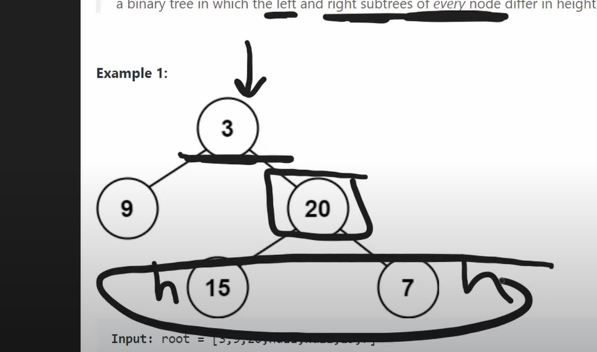

```python
class Solution:  
    def isBalanced(self, root: Optional[TreeNode]) -> bool:  
        if not root:  
            return True  
  
        def dfs(root):  
            if not root:  
                return [True, -1]  
            left = dfs(root.left)  
            right = dfs(root.right)  
            balanced = left[0] and right[0] and abs(left[1] - right[1]) <= 1  # 注意这里同时要判断左右子树平衡，这样顶部的节点的平衡才代表了整棵树是否平衡  
            return [balanced, 1 + max(left[1], right[1])]  
  
        return dfs(root)[0]
```
[Same Tree  同一棵树](https://leetcode.com/problems/same-tree/)


```python
class Solution:  
    def isSameTree(self, p: Optional[TreeNode], q: Optional[TreeNode]) -> bool:  
        # 比较单个节点的值是否相等，然后再比较叶子树（叶子树判断是否相等又变成相同的子问题了，可以递归调用判断）  
  
        # 比较单个节点  
        if not p and not q:  
            return True  
        if not p or not q or p.val != q.val:  
            return False  
  
        # 节点值相等，再判断叶子树（作为整体判断）  
        return self.isSameTree(p.left, q.left) and self.isSameTree(p.right, q.right)
```
[Subtree of Another Tree  另一棵树的子树](https://leetcode.com/problems/subtree-of-another-tree/)

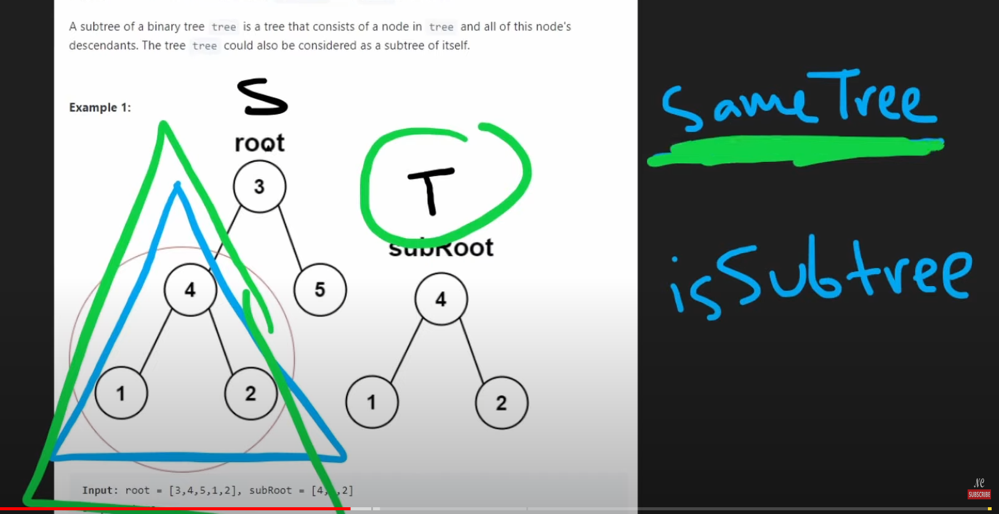

```python
class Solution:  
    def isSubtree(self, root: Optional[TreeNode], subRoot: Optional[TreeNode]) -> bool:  
        if not subRoot: return True  
        if not root: return False  
  
        def isSameTree(p, q):  
            if not p and not q:  
                return True  
            if not p or not q or p.val != q.val:  
                return False  
  
                # 节点值相等，再判断叶子树（作为整体判断）    
return isSameTree(p.left, q.left) and isSameTree(p.right, q.right)  
  
        # 判断当前节点  
        if isSameTree(root, subRoot):  
            return True  
  
        # 递归判断左右子树是否是子树   
# 注意这里不是判断左右子树是否是sameTree，因为左右子树这个时候是同类子问题（递归地考虑问题）  
        return (self.isSubtree(root.left, subRoot) or self.isSubtree(root.right, subRoot))

```
[Lowest Common Ancestor of a Binary Search Tree  二叉搜索树的最低共同祖先](https://leetcode.com/problems/lowest-common-ancestor-of-a-binary-search-tree/)


```python
# 注意：这里说了是二叉搜索树， 所以不用考虑每个节点的路径问题  
# 直接一个指针往下判断就了事。 不一定都要遍历树
# 从问题出发，而不是从固有的思维出发
class Solution:  
    def lowestCommonAncestor(self, root: 'TreeNode', p: 'TreeNode', q: 'TreeNode') -> 'TreeNode':  
        cur = root  
        while cur:  
            # [7,9]  
            if p.val > cur.val and q.val > cur.val:  
                cur = cur.right  
            # [0, 4]  
            elif p.val < cur.val and q.val < cur.val:  
                cur = cur.left   
            # [6, 7]     
else:  
                return cur
```
[Binary Tree Level Order Traversal  二叉树级别顺序遍历](https://leetcode.com/problems/binary-tree-level-order-traversal/)


```python
class Solution:  
    def levelOrder(self, root: Optional[TreeNode]) -> List[List[int]]:  
        if not root:  
            return []  
        if not root.left and not root.right:  
            return [[root.val]]  
  
        dq = deque([root])  
  
        res = []  
        while dq:  
            levelArr = []  
            for i in range(len(dq)):  
                node = dq.popleft()  
                levelArr.append(node.val)  
                if node.left:  
                    dq.append(node.left)  
                if node.right:  
                    dq.append(node.right)  
            res.append(levelArr)  
  
        return res
```
[Binary Tree Right Side View  二叉树右侧视图](https://leetcode.com/problems/binary-tree-right-side-view/)

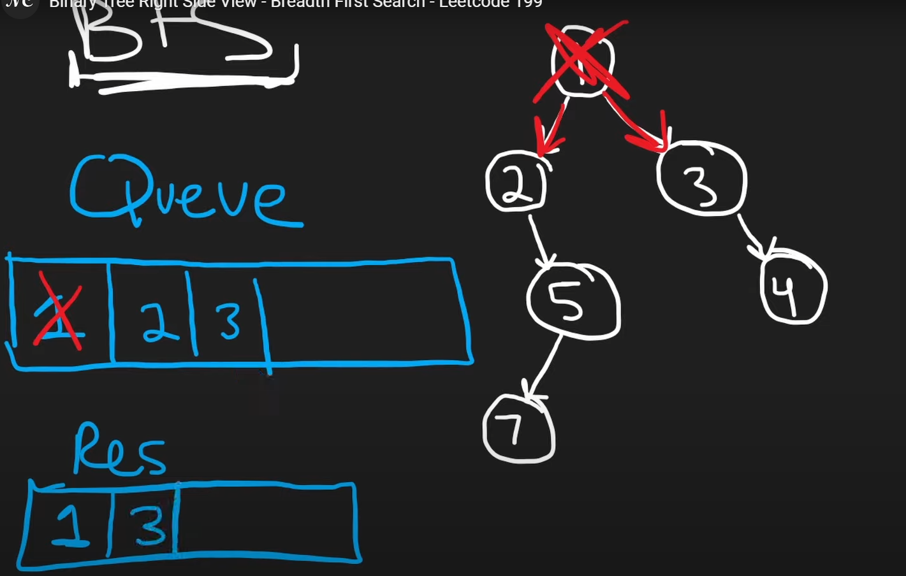

```python
class Solution:  
    def rightSideView(self, root: Optional[TreeNode]) -> List[int]:  
        if not root:  
            return None  
  
        dq = deque([root]) # ?? 
        res = []  
        while dq:  
            # level  
            rightSide = None  
            for i in range(len(dq)):  
                node = dq.popleft()  ## ?
                rightSide = node  # 用一个变量保存最后一个值，不用判断是否是最后一个元素因为for循环自动会执行到最后
                if node.left:  
                    dq.append(node.left)  
                if node.right:  
                    dq.append(node.right)  
            res.append(rightSide.val)  
        return res
```
[Count Good Nodes In Binary Tree  计算二叉树中的良好节点](https://leetcode.com/problems/count-good-nodes-in-binary-tree/)

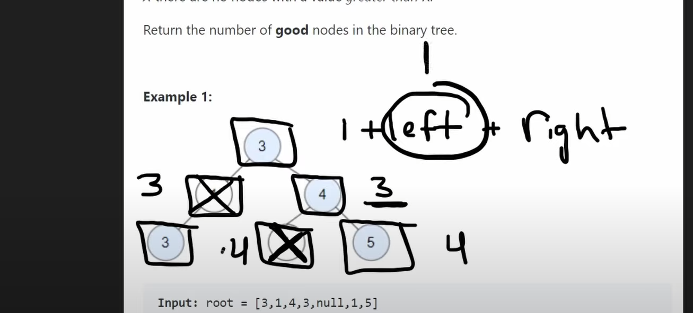

```python
class Solution:  
    def goodNodes(self, root: TreeNode) -> int:  
        # 一看就是要深度遍历，但是有一个点是先序遍历获得当前最大值的节点。如果后续的节点比它小，肯定不是good节点  
  
        def dfs(root, maxVal):  
            if not root:  
                return 0 # 空节点  
            res = 1 if root.val >= maxVal else 0   # 计算good nodes的个数  
            maxv = max(root.val, maxVal)  
            res += dfs(root.left, maxv) # 递归计算子树的good nodes的节点数  
            res += dfs(root.right, maxv)  
            return res  
  
        return dfs(root, root.val) # 根节点始终是good nodes
```


```python
class Solution:  
    def isValidBST(self, root: Optional[TreeNode]) -> bool:  
        # 注意：仔细看边界case， 你会发现，不能单纯对比左右子树和父节点的关系。  
        # BST的定义是 右子树的所有节点都必须大于节点  
        # 所有右子树需要把节点当做 左区间  
  
        def dfs(root, left, right):  
            if not root:  
                return True  
            if not (root.val < right and root.val > left):  
                return False  
            return dfs(root.left, left, root.val) and dfs(root.right, root.val, right) #这里left是当前节点的左区间  
        return dfs(root, float('-inf'), float('inf'))
```
[Kth Smallest Element In a Bst  Bst 中第 k 个最小元素](https://leetcode.com/problems/kth-smallest-element-in-a-bst/)


```python
class Solution:  
    def kthSmallest(self, root: Optional[TreeNode], k: int) -> int:  
        # 这里是BST，所以一定会想到中序遍历输出是刚好排序好的  
        # 因为有堆栈，这里可以用迭代法  
        stack = []  
        cur = root  
        num = 0  
        while cur or stack:  # 这里是or判断只要有一个存在  
            while cur:  
                stack.append(cur)  
                cur = cur.left  
  
            # 处理节点  
            cur = stack.pop()  # 这里pop出来是按照从小到大的  
            num += 1  
            if num == k:  
                return cur.val  
  
            cur = cur.right
```
[Construct Binary Tree From Preorder And Inorder Traversal  从预序和无序遍历构造二叉树](https://leetcode.com/problems/construct-binary-tree-from-preorder-and-inorder-traversal/)


```python
class Solution:  
    def buildTree(self, preorder: List[int], inorder: List[int]) -> Optional[TreeNode]:  
        # 先序遍历的节点一定是根节点。 然后通过中序遍历的划分左右子树  
  
        # 注意这里要判断空的情况  
        if not preorder or not inorder:  
            return None  
  
        # 创建根节点  
        root = TreeNode(preorder[0])  
        mid = inorder.index(preorder[0])  
        # 递归的思路创建左右子树  
        root.left = self.buildTree(preorder[1:mid + 1], inorder[:mid]) # 注意这里mid+1不包含。 这里是将中序和先序的节点做了划分  
        root.right = self.buildTree(preorder[mid+1:], inorder[mid+1:])  
        return root
```

### Trie
[Implement Trie Prefix Tree  实现 Trie 前缀树](https://leetcode.com/problems/implement-trie-prefix-tree/)

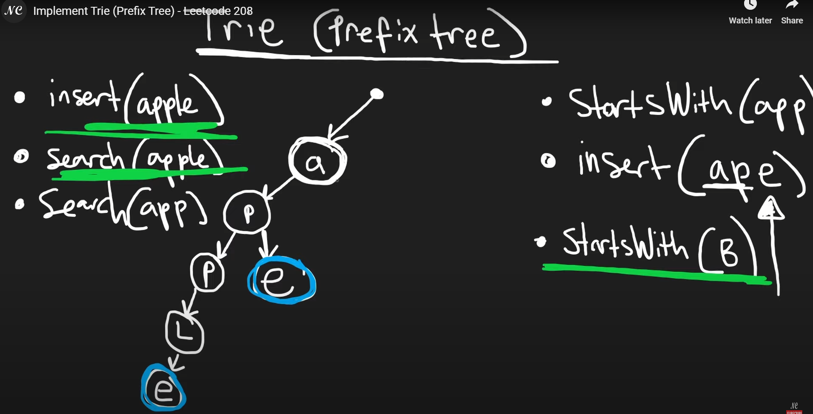

```python
# 前缀树判断字符串前缀的特别高效，因为这个每一层的字符是固定的 比如26个字符 时间复杂度就是字符集的大小

class Trie:  
  
    def __init__(self):  
        self.root = TrieNode()  
  
    def insert(self, word: str) -> None:  
        cur = self.root  
        for c in word:  # 遍历字符串  
            if c not in cur.children:  
                cur.children[c] = TrieNode()  
            cur = cur.children[c]  # 移动到下一个指针  
        cur.isEndChar = True  
  
    def search(self, word: str) -> bool:  
        cur = self.root  
        for c in word:  
            if c not in cur.children:  
                return False  
            cur = cur.children[c]  
        return cur.isEndChar  # 最后一个字符串  
  
    def startsWith(self, prefix: str) -> bool:  
        cur = self.root  
        for c in prefix:  
            if c not in cur.children:  
                return False  
            cur = cur.children[c]  
        return True
```
[Design Add And Search Words Data Structure  设计添加和搜索单词数据结构](https://leetcode.com/problems/design-add-and-search-words-data-structure/)


```python
# 卡点是：如何递归地思考解决问题的方式   递归本质就是判定是否是相同子问题，如果是，则调用它即可
class Trie:  
  
    def __init__(self):  
        self.root = TrieNode()  
  
    def insert(self, word: str) -> None:  
        cur = self.root  
        for c in word:  # 遍历字符串  
            if c not in cur.children:  
                cur.children[c] = TrieNode()  
            cur = cur.children[c]  # 移动到下一个指针  
        cur.isEndChar = True  
  
    def search(self, word: str) -> bool:  
        def isFind(offset, node):  
            cur = node  
            for i in range(offset, len(word)):  
                c = word[i]  
                if c != '.':  
                    if c not in cur.children:  
                        return False  
                    cur = cur.children[c]  
                else:  
                    # 需要判断所有子节点 
                    for child in cur.children.values():  
                        if isFind(i + 1, child):  
                            return True  
                    # 如果没找到匹配的        
                    return False            
	         return cur.isEndChar  
  
        return isFind(0, self.root)  # 最后一个字符串  
  
  
class WordDictionary:  
  
    def __init__(self):  
        self.trie = Trie()  
  
    def addWord(self, word: str) -> None:  
        self.trie.insert(word)  
  
    def search(self, word: str) -> bool:  
        return self.trie.search(word)
```


### backtracking
 [Subsets  子集](https://leetcode.com/problems/subsets/)
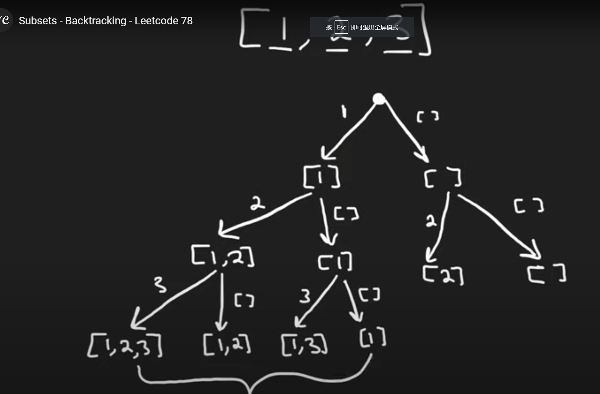


```python
class Solution:  
    def subsets(self, nums: List[int]) -> List[List[int]]:  
        # 这里的卡点是： 对回溯法不是很理解  
        # 回溯其实就是递归树或者叫决策树，每个节点做决策。 如果用暴力求解时间复杂度会很高  
        # 2^n个排列组合，然后我们的数组长度是n， 我们需要遍历数组尝试每种情况，时间复杂度是n * 2^n  
  
        res = []  
        subsets = []  
        def dfs(i): # 这里的i表示数组的索引  
            if i >= len(nums): # 表示每个元素都决策完成  
                res.append(subsets.copy())  # 注意这里必须要用复制，因为subsets每次执行dfs时候都会被修改  
                return  
  
            # 决策加入 nums[i]            subsets.append(nums[i])  
            # 然后递归决策下一个元素  
            dfs(i + 1)  
  
            # 或者决策不加入  
            subsets.pop()  
            dfs(i + 1)  
        dfs(0)  
        return res
```
[Combination Sum  组合总和](https://leetcode.com/problems/combination-sum/)

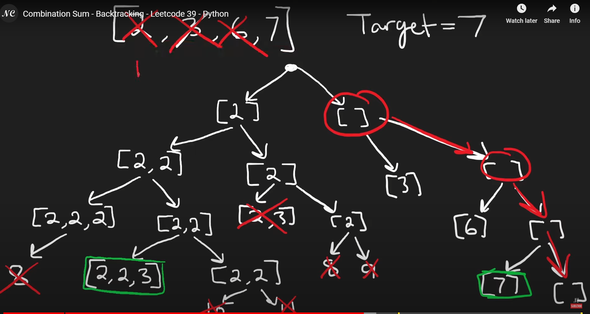

```python
class Solution:  
    def combinationSum(self, candidates: List[int], target: int) -> List[List[int]]:  
        # 还是决策树  
        res = []  
  
        def dfs(cur, i, total):  # 这里我们需要当前节点的和是多少， nums的指针i, 当前结果cur   
# 处理基本case  
            if total == target:  
                res.append(cur.copy())  # 注意这里要复制cur，因为每次都会修改这个变量  
                return  # 结束递归  
  
            if i >= len(candidates) or total > target:  
                return  # 结束递归  
  
            # 包含当前节点  
            cur.append(candidates[i])  
            #  递归决策  
            dfs(cur, i, total + candidates[i])  ## 注意这里i保留不变，因为还可以用 total要变化  
  
            # 不包含当前节点  
            cur.pop()  
            dfs(cur, i + 1, total)  # 这里的i要+1 ，因为不包含  total不变化  
  
        dfs([], 0, 0)  
        return res
```


```python
class Solution:  
    def permute(self, nums: List[int]) -> List[List[int]]:  
        # 从顶到底画出递归树， 然后从底部上来，重新建立排列组合  
  
        result = []  
  
        # 处理只有一个元素。   
if len(nums) == 0:  
            return [nums.copy()]  
  
        for i in range(len(nums)):  
            num = nums.pop(0)  # 把第一个元素删掉  
  
            perms = self.permute(nums)  # 然后递归球剩下的元素的排列组合  
  
            for i in perms:  
                perm = i.append(num)  # 这里的i是数组 针对每个组合，把删掉的元素拼接回来  
  
            result.extend(perms)  # 获得组合  
  
            nums.append(num)  # 将原先删掉的元素拼接回来  
  
        return result
```
[Subsets II  子集 II](https://leetcode.com/problems/subsets-ii/)

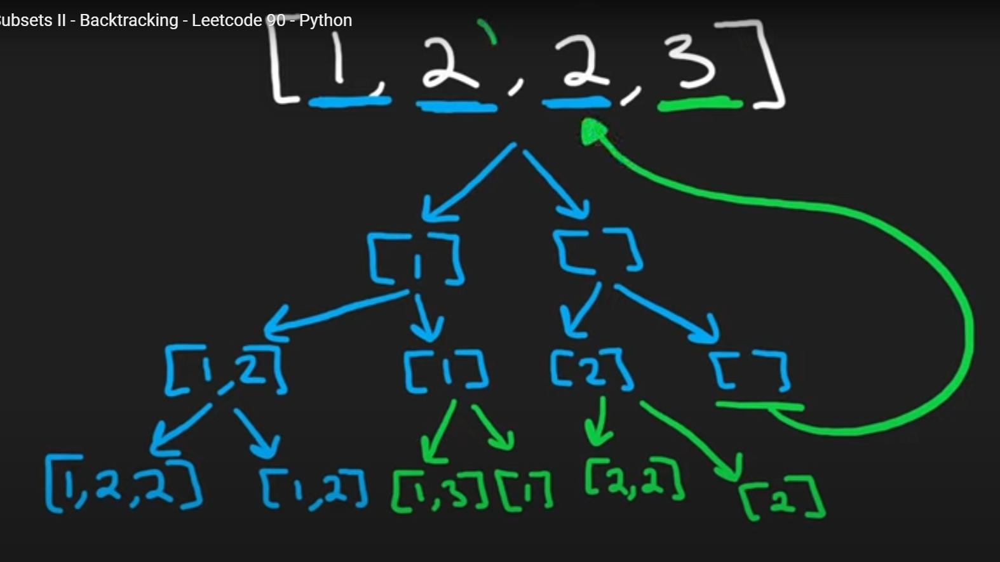

```python
class Solution:  
    def subsetsWithDup(self, nums: List[int]) -> List[List[int]]:  
        # 关键是跳过重复的元素，避免重复组合  
  
        res = []  
        nums.sort()  # 保证重复的元素在一起  
  
        def backtracking(i, subset):  # subset是每次递归的结果  
            if i == len(nums):  # 指针到最后  
                return res.append(subset[::])  # 复制集合  
  
            # include current   
subset.append(nums[i])  
            backtracking(i + 1, subset)  # 递归左子树
  
            subset.pop()  # 恢复subset的值
  
            # not include current  
            while i + 1 < len(nums) and nums[i] == nums[i + 1]:  # 跳过重复元素  
                i += 1  
            backtracking(i + 1, subset)  # 递归右子树
  
        backtracking(0, []) 
  
        return res
```
[Combination Sum II  组合总和 II](https://leetcode.com/problems/combination-sum-ii/)

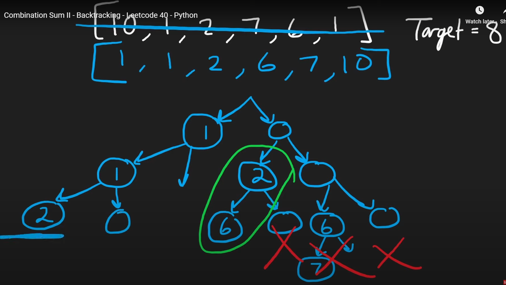

```python
class Solution:  
    def combinationSum2(self, candidates: List[int], target: int) -> List[List[int]]:  
        # 关键点是：这里的区别是存在重复元素，所以不能简单用决策树  
        # 需要  
        candidates.sort()  
  
        res = []  
  
        def backtracking(cur, pos, target):  # cur是当前结果  
            # 基本情况  
            if target == 0:  
                res.append(cur.copy())  
            if target <= 0:  
                return  
  
            prev = -1  
            for i in range(pos, len(candidates)):  # 这里是关键点，需要跳过重复的节点，继续调用backtracking， 如果没有重复的就不需要这个for循环了  
                if prev == candidates[i]:  
                    continue  
                # 包含该元素  
                cur.append(candidates[i])  
                backtracking(cur, i + 1, target - candidates[i])  #  遍历左右子树
  
                cur.pop()  # 递归返回
                prev = candidates[i]  
  
        backtracking([], 0, target)  
        return res
```
[Word Search  单词搜索](https://leetcode.com/problems/word-search/)

```python
class Solution:  
    def exist(self, board: List[List[str]], word: str) -> bool:  
        rows, cols = len(board), len(board[0])  
  
        path = set()  
  
        def dfs(r, c, i):   
if i == len(word):  
                return True  
            if (r < 0 or c < 0 or  
                r >= rows or c >= cols or  
                word[i] != board[r][c] or  
                (r, c) in path):  
                return False  
            path.add((r,c))  
            res = (dfs(r + 1, c, i + 1) or  
            dfs(r - 1, c, i + 1) or  
            dfs(r, c+1, i + 1) or   
dfs(r, c-1, i + 1))   
path.remove((r,c))  
            return res  
  
        for r in range(rows):  
            for c in range(cols):  
                if dfs(r,c,0): return True
```
[Palindrome Partitioning  回文分区](https://leetcode.com/problems/palindrome-partitioning/)

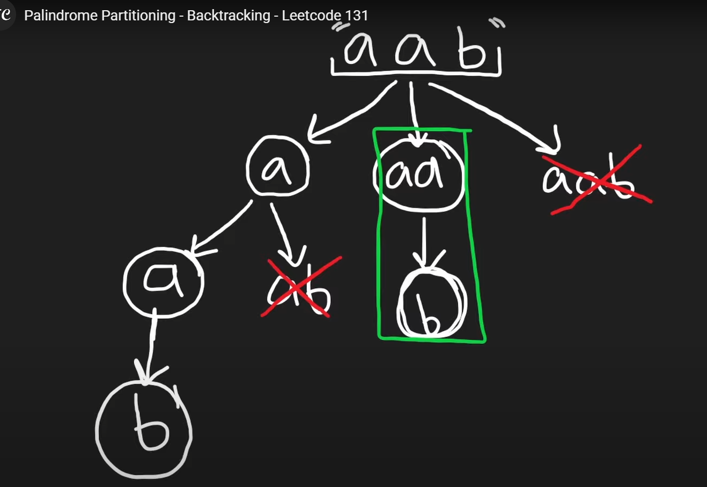

```python
class Solution:  
    def partition(self, s: str) -> List[List[str]]:  
        res = []  
        part = []  
  
        def dfs(i):  
            if i >= len(s):  
                res.append(part.copy())  
                return  
            for j in range(i, len(s)):  
                if self.isPal(s, i, j):  
                    part.append(s[i:j + 1])  
                    dfs(j + 1)  
                    part.pop()  
  
        dfs(0)  
        return res  
  
    def isPal(self, s, l, r):  
        while l < r:  
            if s[l] != s[r]:  
                return False  
            l, r = l + 1, r - 1  
        return True
```
[Letter Combinations of a Phone Number  电话号码的字母组合](https://leetcode.com/problems/letter-combinations-of-a-phone-number/)


```python
class Solution:  
    def letterCombinations(self, digits: str) -> List[str]:  
        res = []  
        digital2Char = {  
            '2': 'abc',  
            '3': 'def',  
            '4': 'ghi',  
            '5': 'jkl',  
            '6': 'mno',  
            '7': 'pqrs',  
            '8': 'tuv',  
            '9': 'wxyz'  
        }  
  
        def dfs(i, curStr):  
            if len(curStr) == len(digits):  
                res.append(curStr)  
                return  
            for c in digital2Char[digits[i]]:  
                dfs(i + 1, curStr + c)  
  
        if digits:  
            dfs(0, '')  
        return res
```


### Heap & Priority Queue

[Last Stone Weight](https://leetcode.com/problems/last-stone-weight/)
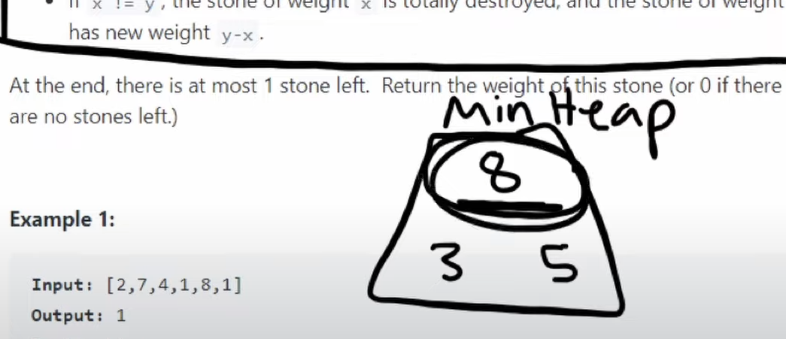


```python
class Solution:
    def lastStoneWeight(self, stones: List[int]) -> int:
        stores = [-s for s in stones]
        heapq.heapify(stores)
        while len(stores) > 1: # 当堆的元素大于2
            first = heapq.heappop(stores)
            second = heapq.heappop(stores)
            if first < second:
                heapq.heappush(stores, first - second) #  注意都是负数
        stores.append(0) # 当stores为空的边界case
        return abs(stores[0]) 

```
 [Kth Largest Element In a Stream](https://leetcode.com/problems/kth-largest-element-in-a-stream/)


```python
class KthLargest:  
  
    def __init__(self, k: int, nums: List[int]):  
        self.minHeap, self.k = nums, k  
        heapq.heapify(self.minHeap) # 时间复杂度是nlogn  
        while len(self.minHeap) > k:  
            heapq.heappop(self.minHeap)  
  
    def add(self, val: int) -> int:  
        heapq.heappush(self.minHeap, val)  
        # 当整个的元素个数比k大的时候，需要从小顶堆删除元素  
        # logn时间复杂度，如果数组 复杂度是n  
        if len(self.minHeap) > self.k:  
            heapq.heappop(self.minHeap)  
        return self.minHeap[0]
```
[K Closest Points to Origin](https://leetcode.com/problems/k-closest-points-to-origin/)
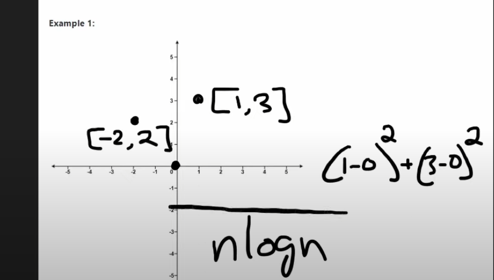


```python
# 时间复杂度时nlogn
class Solution:  
    def lastStoneWeight(self, stones: List[int]) -> int:  
        stores = [-s for s in stones]  
        heapq.heapify(stores)  
        while len(stores) > 1: # 当堆的元素大于2  
            first = heapq.heappop(stores)  
            second = heapq.heappop(stores)  
            if first < second:  
                heapq.heappush(stores, first - second) #  注意都是负数  
        stores.append(0) # 当stores为空的边界case  
        return abs(stores[0])
```
 [Kth Largest Element In An Array](https://leetcode.com/problems/kth-largest-element-in-an-array/)
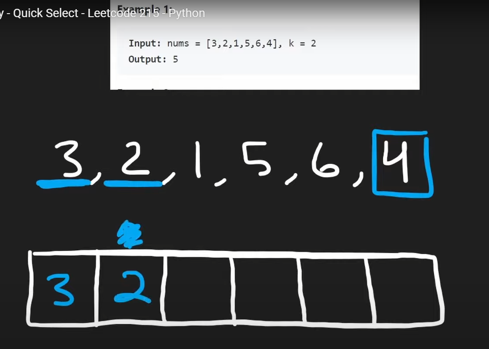

```python
class Solution:
    def kClosest(self, points: List[List[int]], k: int) -> List[List[int]]:
        # 关键点用最小堆

        # 计算距离
        minHeap = []
        for x, y in points:
            minHeap.append([x**2 + y**2, x, y])

        res = []
        heapq.heapify(minHeap)  # 注意这里的minHeap是[10, 1, 2], [8, 1, 2]
        while k > 0:
            dist, x, y = heapq.heappop(minHeap)
            res.append([x, y])
            k -= 1
        return res
```
 [Task Scheduler](https://leetcode.com/problems/task-scheduler/)

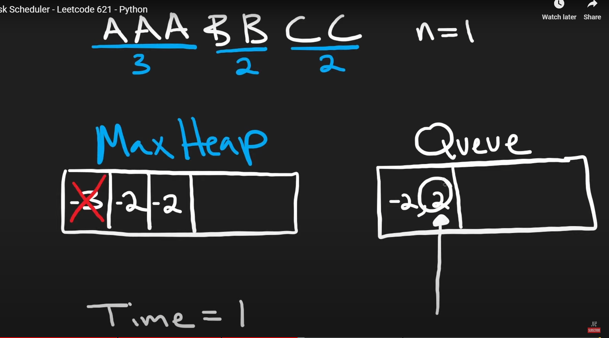

```python
class Solution:
    def leastInterval(self, tasks: List[str], n: int) -> int:
        counter =  Counter(tasks)
        maxHeap = [-cnt for cnt in counter.values()]
        heapq.heapify(maxHeap) # 当前要处理的

        time = 0
        q = deque() # [-cnt, idletime] 暂存还不处理
        while maxHeap or q:
            time += 1
            if maxHeap:
                cnt = heapq.heappop(maxHeap) + 1
                if cnt: # 如果还有
                    q.append([cnt, time + n])
            if q and q[0][1] == time: # 当到了idle时间，重新放到堆处理
                heapq.heappush(maxHeap, q.popleft()[0])
        return time
```
[Design Twitter](https://leetcode.com/problems/design-twitter/)
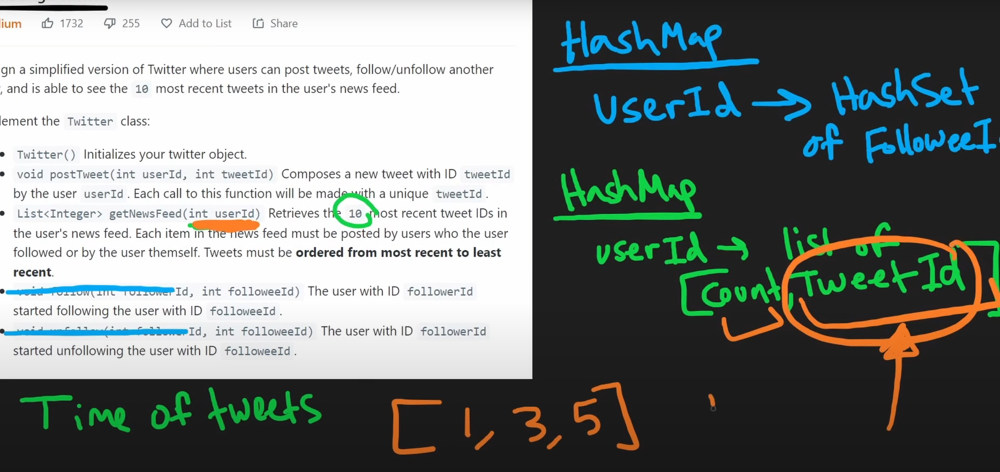


```python
# 堆和hashMap的使用。有些使用技巧，比如堆存了index和count作为时间轴
class Twitter:
    def __init__(self):
        self.followMap = defaultdict(set) # 自动初始化 userId -> [followeeId]
        self.twitterMap = defaultdict(list) # 自动初始化 userId -> [count, twittwerId]
        self.count = 0 # 记录发推的id，作为时间的考量

    def postTweet(self, userId: int, tweetId: int) -> None:
        self.twitterMap[userId].append([self.count, tweetId])
        self.count -= 1

    def getNewsFeed(self, userId: int) -> List[int]:
        minHeap = []
        res = []

        self.followMap[userId].add(userId)
        # 构建堆
        for followee in self.followMap[userId]:
            if followee in self.twitterMap:
                index = len(self.twitterMap[followee]) - 1
                count, twitterId = self.twitterMap[followee][index]
                heapq.heappush(minHeap, [count, twitterId, followee, index - 1]) # 这里index - 1是为了拿到上一个twittwer
        heapq.heapify(minHeap)
        while minHeap and len(res) < 10:
            count, twitterId, followee, index = heapq.heappop(minHeap)
            res.append(twitterId)
            if index >= 0:
                # 取上一条
                count, twitterId = self.twitterMap[followee][index]
                heapq.heappush(minHeap, [count,twitterId,followee,index-1])
        return res

    def follow(self, followerId: int, followeeId: int) -> None:
        self.followMap[followerId].add(followeeId)

    def unfollow(self, followerId: int, followeeId: int) -> None:
        if followeeId in self.followMap[followerId]:
            self.followMap[followerId].remove(followeeId)

```

### interval
 [Insert Interval](https://leetcode.com/problems/insert-interval/)

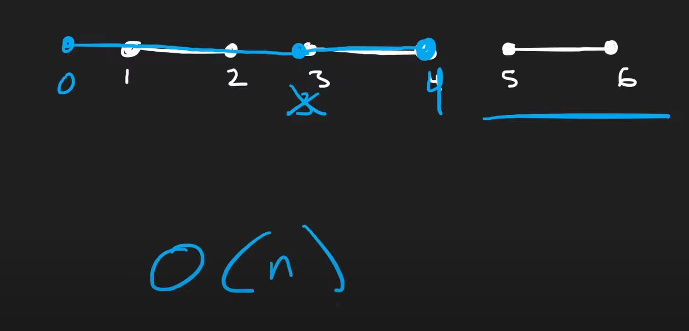

```python
class Solution:
    def insert(self, intervals: List[List[int]], newInterval: List[int]) -> List[List[int]]:
        # 本质上要判断是否重叠， 先想清楚所有情况，归纳以下，不要一个个枚举，代码乱的一批
        res = []
        for i in range(len(intervals)):
            if newInterval[1] < intervals[i][0]: # 在左边
                res.append(newInterval)
                return res + intervals[i:] # 合并所有后面的结果
            elif newInterval[0] > intervals[i][1]:  # 在右边
                res.append(intervals[i])
            else: # 重叠了，进行合并
                newInterval = [min(newInterval[0], intervals[i][0]), max(newInterval[1], intervals[i][1])]
        
        # 如果没有命中上面的在左边的条件，确保newInterval会插入
        res.append(newInterval)
        return res
```
[Merge Intervals](https://leetcode.com/problems/merge-intervals/)

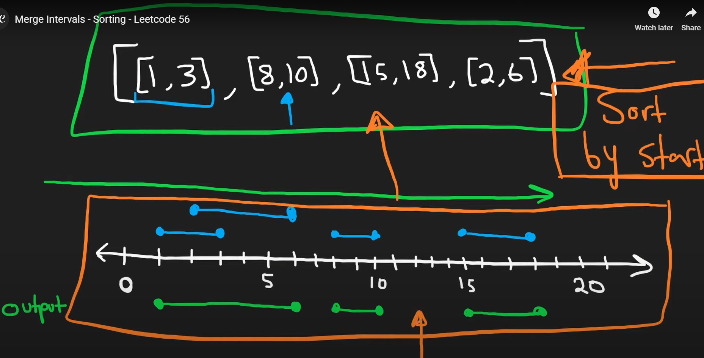

```python
# 没有黑科技，就是正常思维
class Solution:
    def merge(self, intervals: List[List[int]]) -> List[List[int]]:
        intervals.sort(key = lambda i:i[0])
        output = [intervals[0]]
        for start, end in intervals[1:]:
            lastEnd = output[-1][1]
            if start <= lastEnd: # 有重叠需要合并
                output[-1][1] = max(output[-1][1], end)
            else:
                output.append([start, end])
        
        return output
```
 [Non Overlapping Intervals](https://leetcode.com/problems/non-overlapping-intervals/)
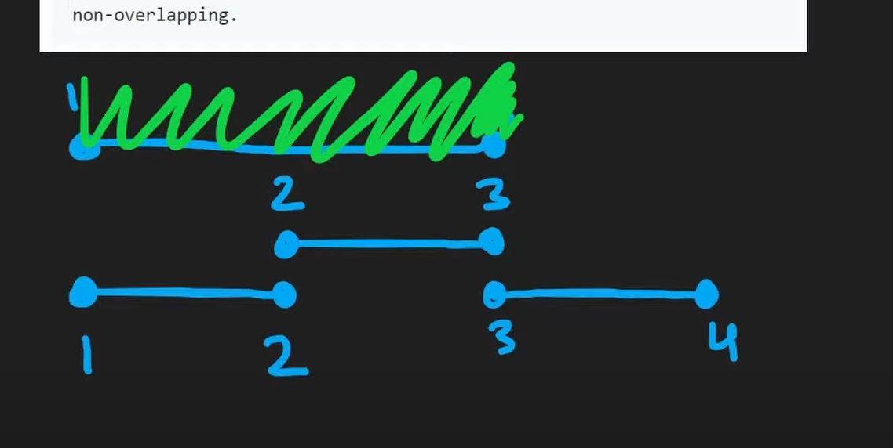


```python
class Solution:
    def eraseOverlapIntervals(self, intervals: List[List[int]]) -> int:
        # 关键点是要对输入排序
        # 然后如果相邻的两个重叠了。 需要保留end更小的那个，因为这样重叠的可能性更小
        intervals.sort()
        res = 0
        prevEnd = intervals[0][1] # 要保留前面合并的end
        for start, end in intervals[1:]:
            if start >= prevEnd: # 没有重叠
                prevEnd = end 
            else:
                res += 1 
                prevEnd = min(end, prevEnd) # 移除一个。这里没有真正移出，只是合并了
        return res

```
### Greedy
[Maximum Subarray](https://leetcode.com/problems/maximum-subarray/) 

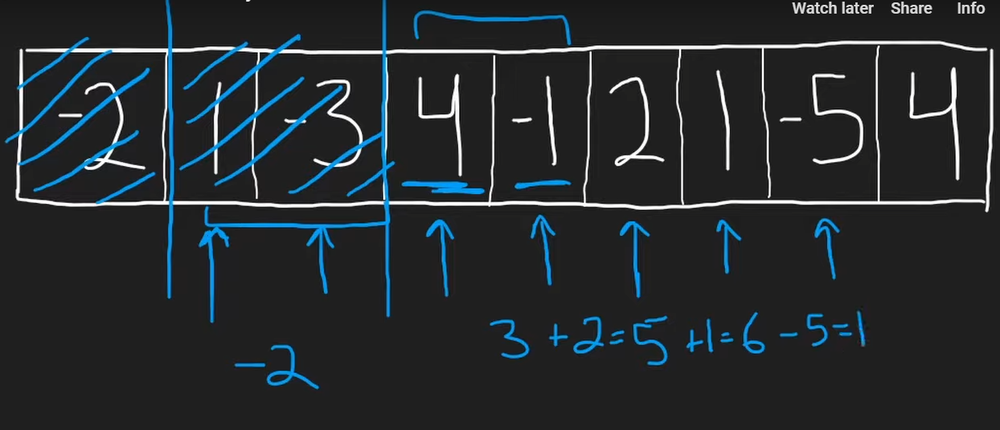

```python
# 这里用了贪心算法啊，就是当你对总的和没有帮助 都归0了或者负数了，就舍弃了。因为你对判断最大的和没有帮助
class Solution:
    def maxSubArray(self, nums: List[int]) -> int:
        maxSum = nums[0] # 记录当前的最大和 
        curSum = 0 # 计算和
        for i in nums:
            if curSum < 0: # 如果对和没有帮助，直接去掉
                curSum = 0
            curSum += i
            maxSum = max(curSum, maxSum)
        return maxSum
```
[Jump Game  跳跃游戏](https://leetcode.com/problems/jump-game/)


```python
class Solution:
    def canJump(self, nums: List[int]) -> bool:
        #  是一个dp问题，可以通过穷举法
        # 这个最差的时间复杂度是n^n次方，因为这是一个决策树，用它或者不用它是2^n。 这里的分支是n，所以是n^n
        # 通过缓存重复计算可以将时间复杂度到n^2 （ 为什么是n^2, 因为缓存基于你上次访问的，是两次for遍历）
        # 贪心算法时间复杂度可以达到n
        
        # 贪心算法核心是从右到左，判断最后一个元素能否到下一个目标
        goal = len(nums) - 1
        for i in range(len(nums)-1, -1, -1): # 从后到左，步长是-1
            if i + nums[i] >= goal: #说明上一个数可以到终点，我们把终点往前移动一位
                goal = i
        return True if goal == 0 else False
```
[Jump Game II  跳跃游戏II](https://leetcode.com/problems/jump-game-ii/)

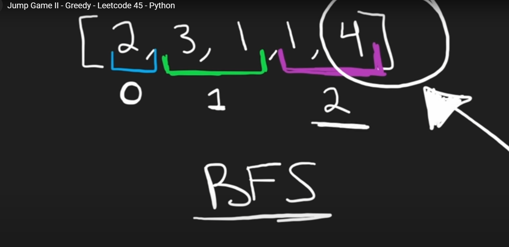

```python
class Solution:
    def jump(self, nums: List[int]) -> int:
        # 关键点是计算当前能跳的最远距离的是多少。然后计算每个区块的个数，就是跳的次数
        res = 0
        l = 0 # 移动窗口
        r = 0
        fartest = 0
        while r < len(nums) - 1: # 没有到达终点
            # BFS遍历，能跳的最远的距离是多少
            for i in range(l, r + 1):
                fartest = max(i+nums[i], fartest)
            l = r + 1 # 更新滑动窗口
            r = fartest 
            # 每次更新滑动窗口，表示跳跃的次数
            res += 1
        return res
```
[Gas Station  加油站](https://leetcode.com/problems/gas-station/)

```python
# 直觉的解法 。有点难理解
class Solution:
    def canCompleteCircuit(self, gas: List[int], cost: List[int]) -> int:
        if sum(gas) < sum(cost):
            return -1
        total = 0
        res = 0
        for i in range(len(gas)):
            total += (gas[i] - cost[i])
            if total < 0:
                total = 0 # 重置 
                res = i + 1 # 下一个
        
        return res
```
 [Hand of Straights  直子之手](https://leetcode.com/problems/hand-of-straights/)
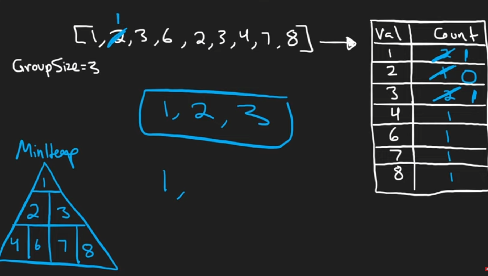


```python
class Solution:
    def isNStraightHand(self, hand: List[int], groupSize: int) -> bool:
        # 关键点是：每次都取最小的值，然后组一组，如果组成功了。 把这个值的个数减掉。 
        # 要统计每个值的数量
        if len(hand) % groupSize:
            return False

        count = {} # 或者用Counter
        for i in hand:
            count[i] = 1 + count.get(i, 0)    

        # 把key都组装成堆
        minHeap = list(count.keys())
        heapq.heapify(minHeap)

        while minHeap:
            first = minHeap[0]
            for i in range(first, first + groupSize):
                if i not in count: # 如果在hashmap中没找到 说明没有组成成功
                    return False 
                count[i] -=  1 # 组成成功数量减去一
                if count[i] == 0:  # 这个数字已经组完成了
                    if i != minHeap[0]: # 说明组成的这个数已经不是最小的数了，出现了漏数的情况
                        return False
                    heapq.heappop(minHeap)
        return True


```
 [Merge Triplets to Form Target Triplet](https://leetcode.com/problems/merge-triplets-to-form-target-triplet/)

```python
class Solution:
    def mergeTriplets(self, triplets: List[List[int]], target: List[int]) -> bool:
        res = set() # 去掉重复的
        for i in triplets:
            if i[0] > target[0] or i[1] > target[1] or i[2] > target[2]:      # 剔除掉大于target的元素
                continue 

            # 满足条件

            for index, v in enumerate(i):
                if v == target[index]: # 说明包含了target的元素
                    res.add(index)
        
        # 因为剔除了大于的，剩下的一定是小于等于的。如果等于的能找到三个 说明一定能找到

        return len(res) >= 3
```
[Partition Labels](https://leetcode.com/problems/partition-labels/)

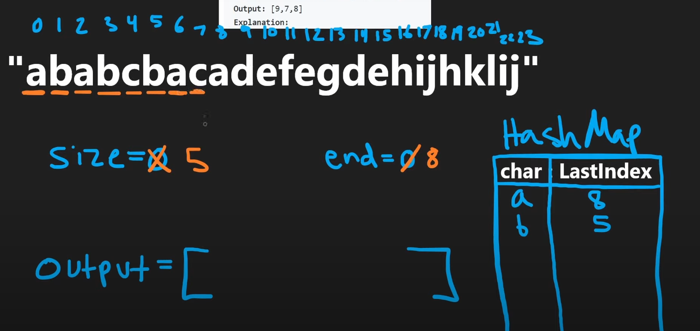

```python
class Solution:
    def partitionLabels(self, s: str) -> List[int]:
        # 不是用滑动窗口，不要思维定势了。这里用hashmap保存每个字母的最后索引
        # 判断前面字符的索引是否小于这个最后索引，如果小于，说明还不能分区
        # end: 记录当前分区的最后索引。 
        hashmap  = {} # char -> last index of s
        for i, v in enumerate(s):
            hashmap[v] = i

        res = []
        size = 0 # 记录分区的长度        
        end = 0 # 记录当前结束的位置
        for i, v in enumerate(s):
            size += 1
            if hashmap[v] > end: # 更新当前分区最长的位置
                end = hashmap[v]
            if i == end: # 说明已经达到最远的距离了
                res.append(size) # 不需要更新end，因为后面都是不同的字符了，会自动更新
                size = 0 # 重新开始分区

        return res
```
 [Valid Parenthesis String](https://leetcode.com/problems/valid-parenthesis-string/)


```python
class Solution:
    def checkValidString(self, s: str) -> bool:
        # 贪心算法：
        # leftMin 当*为空的情况下 （数量最少是
        # leftMax 当*为(的情况下 （数量最多的情况是
        # 每次遇到)或者* 都会更新这两个值。 
        # 只有当leftMin为0时，说明刚好匹配
        # 当leftMax为负数，说明不匹配

        # dp算法 针对*通过决策树判断每种情况
        leftMin, leftMax = 0, 0
        for i in s:
            if i == "*":
                leftMin -= 1
                leftMax += 1
            if i == '(':
                leftMin += 1
                leftMax += 1
            if i == ')':
                leftMin -= 1
                leftMax -= 1
            if leftMin < 0: # 当leftMin小于0 说明不符合要求 重置为0 
                leftMin = 0
            if leftMax < 0:
                return False
        return leftMin == 0
```

### 1-DP
 [Climbing Stairs](https://leetcode.com/problems/climbing-stairs/)

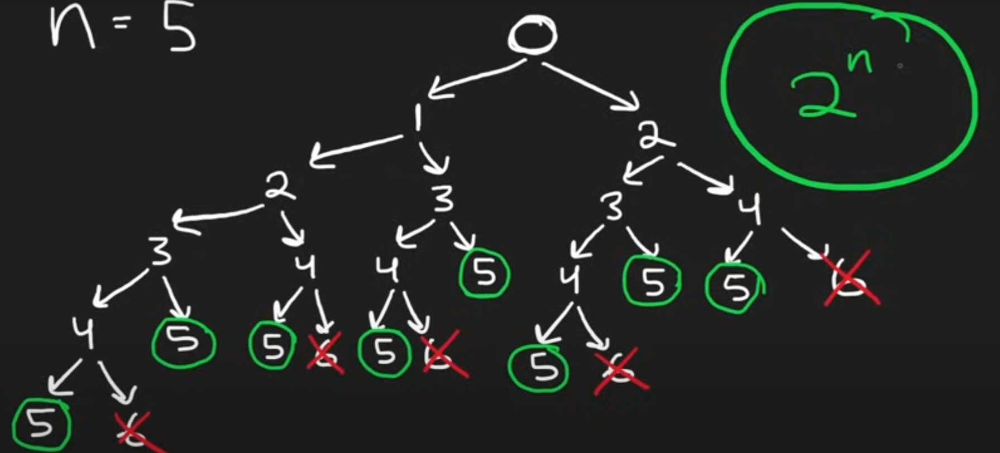
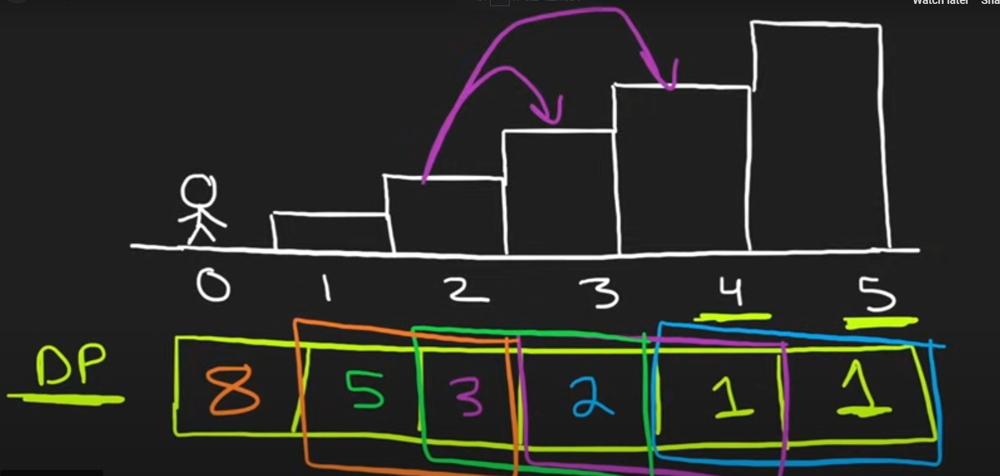

```python
class Solution:
    def climbStairs(self, n: int) -> int:
        # 关键是决策时每次都是重复决策，我们把上一次决策的信息存储起来。避免重复计算
        # 这里就是计算有多少种走法。正常决策树dfs是2^n时间复杂度
        # 但是通过dp计算，我们只需要走一遍。从底部计算已经计算过的值。
        one, two = 1, 1
        for i in range(n-1): # 遍历楼梯数量。画图出来就清楚了
            temp = one
            one = one + two
            two = temp
        return one
```
[Min Cost Climbing Stairs](https://leetcode.com/problems/min-cost-climbing-stairs/)


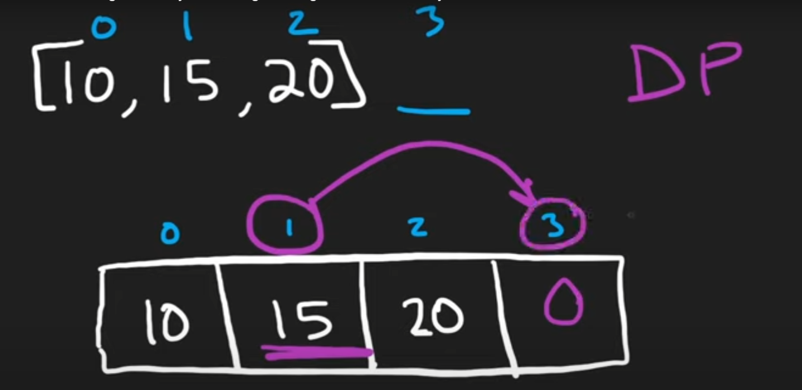

```python
class Solution:
    def minCostClimbingStairs(self, cost: List[int]) -> int:
        # 本质上是需要将决策树转为dp数组
        # 从最简单的case
        # 时间复杂度是O(n) 这里的n其实就是子问题的个数
        cost.append(0)
        for i in range(len(cost) - 3, -1, -1):
            # 计算最小代价
            cost[i] = min(cost[i] + cost[i+1], cost[i] + cost[i+2])
        return min(cost[0], cost[1])
```

