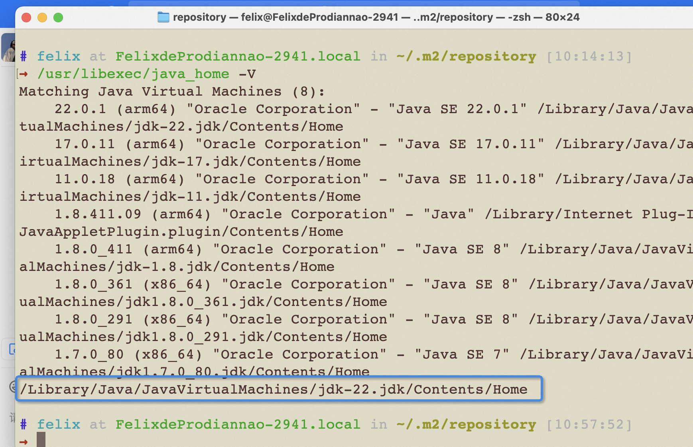

title: "[WIP] Fragmented Knowledge"
date: 2025-03-08
tags:
  - Draft
---

## Allow pages to be embedded via iframe

```shell
Content-Security-Policy: frame-ancestors self https://xxxx
```

By adding this, iframes are allowed to be embedded

---

## Analysis and Solution for Baidu Webmaster File Verification Failure (301 Problem)

When trying to add the website to the Baidu search engine, a problem occurred:

Verification failed, unknown reason: 301

The reason for the problem is:
When filling in the website, Baidu asks to fill in a URL starting with www, for example, www.xx.com. In reality, during DNS configuration, www will 301 redirect to https://xx.com

Therefore, it results in a 301 during verification.

The solution is to remove www from the URL

---

## Code Practices

1. Optimize if-else nesting
2. Centralize validation logic in DTO
3. Handle non-blocking tasks asynchronously
4. Main link failure and system alerts
5. Authenticate early to avoid invalid queries

### Optimize if-else nesting

In cases of complex business logic, excessive `if-else` nesting can make code difficult to read and maintain. Rewriting with `return` statements can make the code more concise and clear.

**Example:**

```typescript
// Before refactoring
function checkStatus(status) {
  if (status === 'success') {
    if (someCondition()) {
      return 'valid';
    } else {
      return 'invalid';
    }
  } else {
    return 'error';
  }
}

// After refactoring
function checkStatus(status) {
  if (status !== 'success') return 'error';
  if (!someCondition()) return 'invalid';
  return 'valid';
}
```

---

## java

### Set java_home

```shell
export JAVA_HOME=`/usr/libexec/java_home -v 1.8.0_361`
```

```shell
# .bash-profile
export JAVA_HOME=/Library/Java/JavaVirtualMachines/jdk1.8.0_291.jdk/Contents/Home

export PATH=$JAVA_HOME/bin:$PATH

export CLASSPATH=.:$JAVA_HOME/lib/dt.jar:$JAVA_HOME/lib/tools.jar
```

### Check version

```shell
/usr/libexec/java_home -V
```

The highlighted one is the default version


### JDK Download

https://www.oracle.com/java/technologies/downloads/#java8


### Maven Download

https://archive.apache.org/dist/maven/maven-3/3.5.4/binaries/

.zshrc: Add `source ~/.bash_profile` to solve commands that exist in bash but not in zsh


### Environment Variable Management Tool

1. Download and install `[jenv](https://github.com/linux-china/jenv)` [- jenv: the Java enVironment Manager](https://github.com/linux-china/jenv) ，

2. `JDK` installation, enter `jenv install java 1.8.0_91` in the terminal, and then set the environment `jenv use java 1.8.0_91` (it is recommended to use the latest version of `jdk1.8` to be consistent with the online environment)
3. `maven` installation, enter `jenv install maven 3.5.0` in the terminal, and then set the environment `jenv use maven 3.5.0`. After installation, download `settings.xml` to the specified location, for example `~/.m2`

Java debugging: https://blog.csdn.net/qq_27093465/article/details/64124330

### Java 8's Stream API

```java
gopModuleCmps.stream().parallel().forEach(...)
```

### Code Reading
`command+option+b` to quickly navigate to the implementation

### mybatis database writing style

mapper is an interface, implementation is in the xml file

### How to define a generic class

```java
public class Test<T> {
	private T model;
}
```

### Optional

Optional is a class introduced in Java 8, belonging to the `java.util` package. The main purpose of the Optional class is to reduce `NullPointerException`, which is the most common runtime exception in Java programs.

Optional is a container class that can hold a value of type T, or nothing at all (i.e., `Optional.empty()`). Optional provides various methods, such as `isPresent()`, `get()`, `orElse()`, etc., to facilitate access and manipulation of the internal value.

For example, you can use Optional to avoid null pointer exceptions as follows:
```java
Optional<String> optional = Optional.ofNullable(getStringMayReturnNull());

if (optional.isPresent()) {

    String value = optional.get();

    // do something with value

} else {

    // do something when value is null

}
```

In this example, if the `getStringMayReturnNull()` method returns null, `Optional.ofNullable()` will return an empty Optional object instead of null. Then, you can use the `isPresent()` method to check if the Optional contains a value, rather than directly checking if the value is null.

### Online Debugging

`Arthas` Java online debugging IDEA plugin

---

After using whistle proxy, requests may be proxied. This can lead to "pushing incorrect configuration" and exceptions in system resource pushes.

---

Use the command `w2 use .xxx/.whistle.js --force` to modify the whistle configuration. This can be combined with the front-end project build process to set up some proxies.

---

Recently I've been thinking, people are like robots, reading a lot of data every day, and then through the brain's computing center + algorithms, deciding which data is important.
Emergent intelligence requires a large amount of data, so extensive reading is necessary. Training involves not only input but also output, constantly training your output ability,
which is training your brain model. It can be chaotic and unclear at the beginning, but with enough corpus + output, there will eventually be a qualitative change.

This qualitative change is the so-called intuition.

Just as Chen-Ning Yang said, you need to build new intuition based on previous data. This process is training, it is parameter tuning.

The most important thing for forming intuition is practice. Practice materializes many unclear things. Many filters and funnels for making software products are passed through practice.

---

How to decouple business code, providing two business scenarios

Business Scenario: In file A, you need to listen for and handle messages. But the message handling logic is business logic, the code is messy, and you don't want to handle it in file A. How to isolate the business code?

Assume `__global_proxy__` is used to collect information

Solution 1:

A little trick is to modify the `push` method of the `__global_proxy__` object

```js
  // Define this object in file A
  if (!window.__global_proxy__) {
    window.__global_proxy__ = [];
  }
  // __global_proxy__.push is an array function
```


```js
  // In the business code, modify push to become a new method
  window.__global_proxy__ = {
    push: (event) = > {
      processQueue()
    }
  }
```

Solution 2:

```js
  // Define an object directly in file A
  (window as any).__global_proxy__ = {
    queue: [],
    handler: null,
    push: function(event: MessageEvent) {
      this.handler ? this.handler(event) : this.queue.push(event);
    },
    setHandler: function(handler: (event: MessageEvent) => void) {
      this.handler = handler;
      // Process messages in the queue
      processQueue()
    }
  };
```

Business Scenario: The underlying core code has a method call, let's say `callA()`. You want to perform business logic processing before calling `callA()`, and then call `callA()` based on the processing result. The business logic processing is asynchronous.

Solution:
Define a subscriber:

```js
import mitt from 'mitt';

type Events = {
  hydration: any;
};

export const emitter = mitt<Events>();

// Optional: add some helper methods
let lastData: any = null;

export const subscribeEvents = {
  emit: (eventName, data: any) => {
    lastData = data;
    emitter.emit(eventName, data);
  },
  subscribe: (eventName, callback: (data: any) => void) => {
    if (lastData !== null) {
      callback(lastData);
    }
    emitter.on(eventName, callback);
  },
  unsubscribe: (eventName, callback: (data: any) => void) => {
    emitter.off(eventName, callback);
  },
};

```

Define a Hook plugin:

```js
import { events } from './subscribe-events';

class HookPlugin {
  protected context;
  private cb: (() => void) | null = null;

  constructor({ context }: { context }) {
    this.context = context;
  }

  // Lifecycle method: this function will be called before callA.
  // Generally, frameworks reserve many lifecycle hook functions and provide a plugin mechanism. The plugin mechanism will have a context that can be modified.
  containerWillRender = (options: Record<string, unknown>): void  =>   {
    // Declare a hookFn
    this.context.hookFn = (cb: () => void): void => {
      events.subscribe('test',(data) => {
        // Do business logic
        this.cb()
      });
    };
  }
}

registerPlugin(HookPlugin);

```

```js
// Wrap callA()
context.hookFn(() => {
  callA()
})
```


---

Mock Design

For time travel, if the parameter includes `debugTime`, use the local time. If not, get the system time from the server-side interface.


---

Technical Container
Frontend rendering engine: Circulate all data (or context) through a bus mechanism, with core components built-in, and extend through a plugin mechanism.
