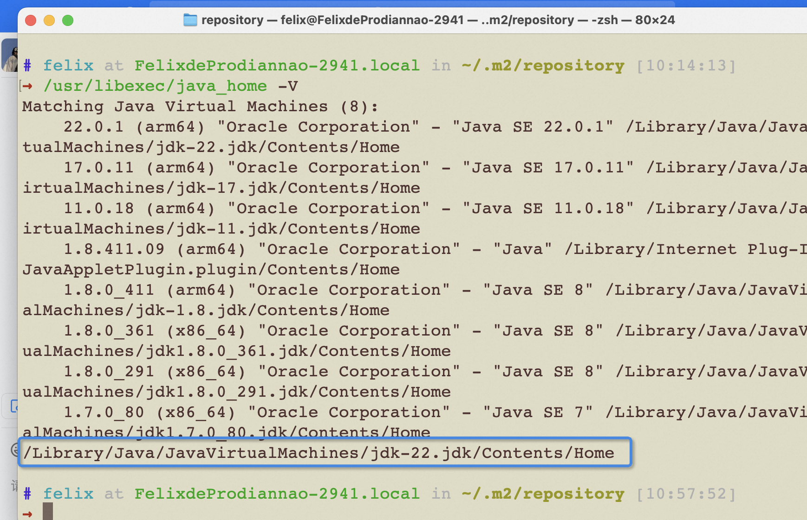

## 页面允许以iframe方式嵌入

```shell
Content-Security-Policy: frame-ancestors self https://xxxx
```

通过增加这个，允许 iframe 被嵌入

---

## 百度站长文件验证失败 301问题分析及解决方法

尝试把网站加到百度搜索引擎，出现问题：

出现了验证失败，失败未知原因：301

问题原因是：
填写网站的时候，百度会让让我填www开头的网址：比如www.xx.com 实际上DNS配置的时候，www会301到https://xx.com 

所以验证的时候会301。

解决办法就是去掉网址的www

---

## 代码实践

1. 优化 if-else 嵌套
2. 校验逻辑集中到 DTO
3. 异步处理非阻塞性任务
4. 主链路失败与系统告警
5. 鉴权提前避免无效查询

### 优化 if-else 嵌套

在业务逻辑复杂的情况下，过多的 `if-else` 嵌套会让代码难以阅读和维护。通过改写为 `return` 语句，可以让代码更加简洁清晰。

**示例：**

```typescript
// 改写前
function checkStatus(status) {
  if (status === 'success') {
    if (someCondition()) {
      return 'valid';
    } else {
      return 'invalid';
    }
  } else {
    return 'error';
  }
}

// 改写后
function checkStatus(status) {
  if (status !== 'success') return 'error';
  if (!someCondition()) return 'invalid';
  return 'valid';
}

---

## java

### 设置 java_home

```shell
export JAVA_HOME=`/usr/libexec/java_home -v 1.8.0_361`
``` 

```shell
# .bash-profile
export JAVA_HOME=/Library/Java/JavaVirtualMachines/jdk1.8.0_291.jdk/Contents/Home

export PATH=$JAVA_HOME/bin:$PATH

export CLASSPATH=.:$JAVA_HOME/lib/dt.jar:$JAVA_HOME/lib/tools.jar
```

### 查看版本

```shell
/usr/libexec/java_home -V
```
 
高亮的是默认版本


### jdk 下载

https://www.oracle.com/java/technologies/downloads/#java8


### maven 下载

https://archive.apache.org/dist/maven/maven-3/3.5.4/binaries/

.zshrc: 添加source ~/.bash_profile 解决bash中有但是zsh没有的命令


### 环境变量管理工具

1. 下载安装`[jenv](https://github.com/linux-china/jenv)` [- jenv: the Java enVironment Manager](https://github.com/linux-china/jenv) ，

2. `JDK`安装，在终端输入`jenv install java 1.8.0_91`，然后再设置环境`jenv use java 1.8.0_91`（推荐使用最新版本`jdk1.8`，和线上环境保持一致）
3. `maven` 安装，在终端输入`jenv install maven 3.5.0`，然后再设置环境`jenv use maven 3.5.0`。安装完后把`settings.xml`下载到指定位置，例如`~/.m2`

java调试： https://blog.csdn.net/qq_27093465/article/details/64124330

### Java 8 的 Stream API

```java
gopModuleCmps.stream().parallel().forEach(...)
```

### 代码阅读
command+option+b快速定位到实现

### mybatis 数据库写法

mapper是interface, 实现在xml文件

### 如何定义一个泛型类

```java
public class Test<T> {
	private T model;
}
```

### Optional

optional是Java 8引入的一个类，它属于java.util包。Optional类的主要目的是减少NullPointerException，这是Java程序中最常见的运行时异常。  
  
Optional是一个容器类，它可以保存类型T的值，或者什么都不保存（即Optional.empty()）。Optional提供了多种方法，如isPresent()，get()，orElse()等，以方便对内部值的访问和操作。  
  
例如，你可以使用Optional来避免空指针异常，如下所示：  
```java
Optional<String> optional = Optional.ofNullable(getStringMayReturnNull());

if (optional.isPresent()) {

    String value = optional.get();

    // do something with value

} else {

    // do something when value is null

}
```

  
在这个例子中，如果getStringMayReturnNull()方法返回null，Optional.ofNullable()会返回一个空的Optional对象，而不是null。然后，你可以使用isPresent()方法来检查Optional是否包含值，而不是直接检查值是否为null。

### 线上调试

`Arthas` java线上调试idea插件 

---

whistle代理后，请求可能会被代理。导致`推送错误的配置`，系统资源推送错误异常。

---

`w2 use .xxx/.whistle.js --force`  命令的方式修改whistle配置。结合前端工程构建时做一些代理。

---

最近在想，人就像机器人，每天阅读很多数据，然后通过大脑计算中心 + 算法，决定哪些数据是重要的。
智能涌现需要大量的数据，所以必须要大量阅读。训练除了输入还有输出，不断地训练你的输出能力，
就是在训练你的大脑模型，一开始可以是很混乱，不清晰，但是足够多的语料+输出，最终会有质的变化。

这个质的变化就是所谓的直觉。 

就像杨振宁说的，你需要基于之前的数据建立新的直觉，这个过程就是训练，就是参数调优。

直觉形成最重要的就是实践，实践把很多不清楚的东西都具像化了。做软件产品的很多筛子和漏斗通过实践

---

业务代码如何解耦， 提供两个业务场景

业务场景：如何在文件A里面需要监听message 和 处理message。 但是处理message的逻辑是业务逻辑，代码比较脏，不希望在文件A里面处理。
如何隔离业务代码呢。。

假设是用`__global_proxy__` 收集信息

方案1: 

一个小技巧是修改`__global_proxy__` 这个对象的`push` 

```js
  // A文件中定义这个对象
  if (!window.__global_proxy__) {
    window.__global_proxy__ = [];
  }
  // __global_proxy__.push 是一个数组函数
```


```js
  // 业务代码中修改push 变成一个新方法
  window.__global_proxy__ = {
    push: (event) = > {
      processQueue()
    }
  }
```

方案2:

```js
  // A文件 中直接定义一个对象
  (window as any).__global_proxy__ = {
    queue: [],
    handler: null,
    push: function(event: MessageEvent) {
      this.handler ? this.handler(event) : this.queue.push(event);
    },
    setHandler: function(handler: (event: MessageEvent) => void) {
      this.handler = handler;
      // 处理队列中的消息
      processQueue()
    }
  };
```

业务场景：底层核心代码有一个方法调用，假设是callA()，希望在调用callA()之前，进行业务逻辑处理，
根据处理结果再调用callA()。业务逻辑处理是异步的。

方案：
定义一个订阅器：

```js
import mitt from 'mitt';

type Events = {
  hydration: any;
};

export const emitter = mitt<Events>();

// 可选：添加一些辅助方法
let lastData: any = null;

export const subscribeEvents = {
  emit: (eventName, data: any) => {
    lastData = data;
    emitter.emit(eventName, data);
  },
  subscribe: (eventName, callback: (data: any) => void) => {
    if (lastData !== null) {
      callback(lastData);
    }
    emitter.on(eventName, callback);
  },
  unsubscribe: (eventName, callback: (data: any) => void) => {
    emitter.off(eventName, callback);
  },
};

```

定义一个Hook插件：

```js
import { events } from './subscribe-events';

class HookPlugin {
  protected context;
  private cb: (() => void) | null = null;

  constructor({ context }: { context }) {
    this.context = context;
  }

  // 生命周期函数：callA调用前会调用这个函数。 
  // 一般框架里面会保留很多生命周期函数的勾子函数，并且提供插件机制，插件机制里面会有context上下文，可以被修改。
  containerWillRender = (options: Record<string, unknown>): void  =>   {
    // 声明一个hookFn
    this.context.hookFn = (cb: () => void): void => {
      events.subscribe('test',(data) => {
        // 做业务逻辑
        this.cb()
      });
    };
  }
}

registerPlugin(HookPlugin);

```

```js
// 包裹callA()
context.hookFn(() => {
  callA()
})
```


---

mock设计

如果进行时间穿越，如果参数带debugTime走的本地，如果是不带走服务端接口拿系统时间。


---

技术容器
前端渲染引擎：通过总线机制流通所有的数据（或者说是上下文），核心的零部件内置，然后通过插件机制扩展。
构建器
