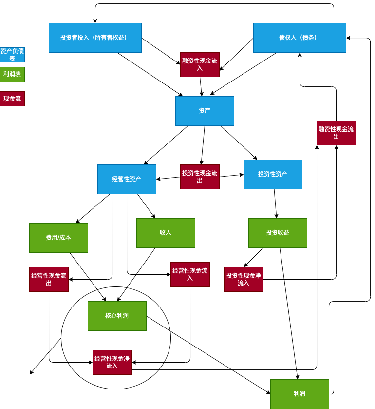

## **1. Simple Overview**
The three most important financial statements are: **Balance Sheet**, **Income Statement**, and **Cash Flow Statement**.
- **Balance Sheet**:
  - Investors' equity + Creditors' rights constitute assets.
  - Reinvestment of assets forms **Operating Assets** and **Investment Assets**.
  
- **Income Statement**:
  - Operating assets generate expenses/costs and revenues, forming core profit.
  - Investment assets generate investment income.
- **Cash Flow Statement**:
  - Inputs from investors' equity and creditors are **Financing Cash Inflows**.
  - Asset investment is an **Investing Cash Outflow**.
  - Operating assets generate **Operating Outflows** and **Operating Inflows**, forming **Net Operating Inflow**.
  - Investment income generates **Investing Cash Inflows** and **Financing Cash Outflows**.
---
## **2. The Work of Accounting**
The work of accounting is not just bookkeeping, but includes the following processes:
1. **Bookkeeping**: Recording all information (such as cash, fixed assets, share capital, intangible assets, inventory, short-term loans, accounts payable, operating revenue, accounts receivable, cost of goods sold, administrative expenses, selling expenses, financial expenses, etc.).
   - **Debit**: Can be understood as cost.
   - **Credit**: Can be understood as revenue.
   - The core of bookkeeping is to record "debit" and "credit" information.
2. **Posting**:
   - Calculating depreciation (e.g., annual depreciation of fixed assets).
   - Amortizing intangible assets (e.g., patent rights, trademark rights, etc.).
3. **Adjusting Entries**:
   - Classifying operating revenue, cost of goods sold, and administrative expenses into the income statement.
   - The credit of operating revenue = the credit of profit; the debit of cost of goods sold and administrative expenses = the debit of profit.
4. **Closing Entries**:
   - Transferring profit to the statement of retained earnings.
5. **Reporting**:
   - Finally generating the **Balance Sheet**:
     - **Debit Side**: Cash, Accounts Receivable, Inventory, Original Value of Fixed Assets, Accumulated Depreciation, Net Value of Fixed Assets, Intangible Assets, Total Assets.
     - **Credit Side**: Short-term Loans, Accounts Payable, Total Liabilities, Share Capital, Capital Surplus, Retained Earnings, Owner's Equity, Liabilities and Owner's Equity.
     - If debits and credits are equal, the accounts are balanced.
- **Capital Surplus**:
  - Example: Pre-investment share capital is 4 million. Someone invests 4 million for a 20% stake, which ultimately corresponds to 1 million in share capital. The extra 3 million is the capital surplus.
- **Subsidiary Handling**:
  - If not a controlling stake, the financial statements are not consolidated.
  - Subsidiaries may hide profits through advertising business, etc.
- **Intangible Assets**:
  - Includes patent rights, non-patented technology, trademark rights, copyrights (IP), land use rights, franchise rights (franchise stores).
  - A brand cannot be sold independently and is not an intangible asset.
---
## **3. Operating Asset Analysis**
### **3.1 Important Formulas**
1. **Inventory Turnover Ratio**:
   - Formula: Inventory Turnover Ratio = Cost of Goods Sold / Average Inventory (monthly).
   - Average Inventory = (Beginning Inventory + Ending Inventory) / 2.
   - Example: If the inventory turnover ratio is 7.29, it's equivalent to turning over once every 12 / 7.29 ≈ 1.5 months.
   - Inventory needs to consider provision for inventory depreciation.
2. **Gross Profit Margin**:
   - Formula: Gross Profit Margin = Gross Profit / Operating Revenue.
   - Gross Profit = Operating Revenue - Cost of Goods Sold = (Selling Price - Unit Cost) × Sales Volume.
   - Gross Profit Margin can also be expressed as: 1 - Unit Cost / Selling Price.
### **3.2 Significance of Gross Profit Margin**
- Reflects the company's growth, management performance, core competitiveness, and potential issues.
- Ways to increase gross profit margin:
  - **Low-Cost Strategy** (high volume).
  - **Differentiation Strategy** (low asset turnover, high R&D investment).
### **3.3 Product Competitiveness**
- Reflected in **Gross Profit Margin** and **ability to manage upstream and downstream payments and collections**.
  - Upstream: Suppliers (focus on cash, accounts receivable, notes receivable, etc.).
  - Downstream: Customers (focus on prepayments, accounts receivable, etc.).
- If the gross profit margin decreases and the inventory turnover ratio also decreases, it indicates that the product is not selling well.
### **3.4 Accounts Receivable Analysis**
- Points of concern:
  - Internal personnel involved.
  - Debtor.
  - Aging of accounts.
  - Provision for bad debts (may hide profits).
- Collection management ability:
  - Compare the changes in sales revenue, notes receivable, accounts receivable, and advances from customers between the end and beginning of the period.
### **3.5 Payment Management Ability**
- If the sum of ending inventory, notes receivable, and accounts receivable is much larger than inventory, and the increase in construction in progress and fixed assets is not significant, it indicates a strong ability to manage payments to suppliers.
### **3.6 Production Capacity Efficiency**
- Formula: Production Capacity Efficiency = Current Period Output (Operating Revenue) / (Fixed Assets + Intangible Assets).
- Relationship between fixed assets and inventory:
  - Red Ocean Market: More fixed assets, large scale of core business.
  - Blue Ocean Market: Less inventory, high gross profit.
### **3.7 Financial Risk Indicators**
- The "three highs" that reflect **poor management level**:
  - High financial expenses.
  - High level of a certain asset.
  - High short-term loans.
- **Important indicator for evaluating profit**:
  - Net Operating Inflow / Core Profit = 1.2 to 1.5 is optimal.
---
## **4. Problems with Feasibility Reports**
- Economic development has inertia, no cycles.
- Policies are continuously favorable.
- Competition and substitute products are not fully considered.
- Resource constraints are not fully considered.
---
## **5. Several Ways to Make Money**
1. **Earning from price differences in trading**:
   - Product, physical arbitrage.
2. **Earning from advertising**:
   - e.g., a subsidiary hiding profits through its advertising business.
3. **Earning from financial arbitrage**:
   - Information asymmetry, financial arbitrage.
---
## **6. How to Look at a Company**
### **6.1 Competitiveness**
- Gross profit margin, profit margin, upstream and downstream relationships.
### **6.2 Expansion Strategy**
- Analyze **Investment Assets** and **Operating Assets** on the balance sheet.
- The proportion of operating profit and investment income, whether the company is focused on its main business.
### **6.3 Business Model**
- Gross profit margin, asset turnover ratio.
### **6.4 Risk Analysis**
- Operating risk and financial risk:
  - Cash flow statement.
  - Whether operating cash flow is positive.
---
## **7. Supplementary Information**
### **7.1 Financial Fraud in Agriculture**
- The agriculture industry is prone to financial fraud because it is heavily influenced by natural factors and difficult to account for.
### **7.2 Intangible Asset Amortization**
- Intangible assets are amortized annually, so the ROA (Return on Assets) should be relatively high (about 15%).
### **7.3 Fair Value**
- The market value of held stocks and other realizable assets.
### **7.4 Financial Expenses**
- Be cautious when the proportion of financial expenses significantly exceeds 30%.
### **7.5 Factoring Funds of Large Companies**
- Large companies may set up factoring funds (company capital injection + bank financing). Suppliers can get financing from the factoring company but must pay interest, thereby increasing the gross profit margin.
### **7.6 Advances from Customers**
- Advances from customers are one indicator of a company's strong market position.
### **7.7 Cash Flow**
- A positive operating cash flow indicates that the company is able to earn money.
---
