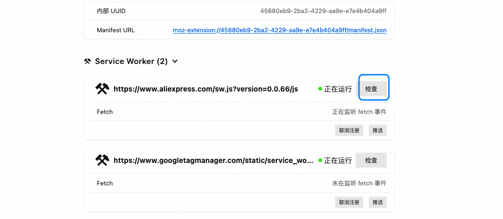
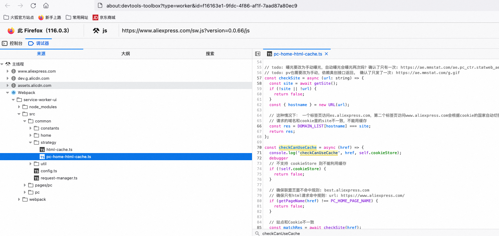

## 目录

1. [问题背景](#问题背景)
2. [抓包工具的作用](#抓包工具的作用)
3. [调试步骤](#调试步骤)
   - [3.1 打开 Service Worker 调试页面](#31-打开-service-worker-调试页面)
   - [3.2 检查并设置断点](#32-检查并设置断点)
4. [注意事项](#注意事项)
5. [总结](#总结)

---

## 问题背景

在使用 Firefox 浏览器调试 Service Worker（`sw.js`）时，可能会遇到以下情况：

- **问题描述**：Firefox 不会直接显示 `sw.js` 的请求，即使该文件确实被加载。
- **解决方案**：通过抓包工具可以捕获到 `sw.js` 的请求。此外，Firefox 提供了内置的调试工具，可以方便地对 Service Worker 进行调试。

---

## 抓包工具的作用

在调试过程中，抓包工具（如 Fiddler、Charles 或浏览器自带的开发者工具）可以帮助我们：

- 确认 `sw.js` 是否被正确加载。
- 查看请求的详细信息（如 URL、响应头、状态码等）。
- 分析可能的网络问题或缓存问题。

尽管抓包工具非常有用，但为了更高效地调试 Service Worker，建议结合 Firefox 的内置调试功能。

---

## 调试步骤

### 3.1 打开 Service Worker 调试页面

1. 在 Firefox 地址栏中输入以下地址，打开 Service Worker 调试页面：
   ```
   about:debugging#/runtime/this-firefox
   ```
   - 该页面列出了当前浏览器中所有已注册的 Service Worker。

2. 找到目标 Service Worker，点击右侧的 **检查** 按钮：
   

   - 点击后会打开一个独立的调试窗口，用于调试该 Service Worker。

---

### 3.2 检查并设置断点

1. 在调试窗口中，切换到 **调试器** 面板：
   

2. 在代码中找到需要调试的位置，点击行号设置断点。

3. 刷新页面或触发相关操作，观察断点是否被命中。

4. 使用调试工具提供的功能（如单步执行、查看变量值等）进行深入分析。

---

## 注意事项

1. **确保 Service Worker 已注册**：
   - 如果在 `about:debugging` 页面中未找到目标 Service Worker，请确认其是否已正确注册。

2. **清除缓存**：
   - Service Worker 的行为可能受到缓存的影响。在调试前，建议清除浏览器缓存或使用无痕模式。

3. **跨域问题**：
   - 如果 `sw.js` 文件托管在不同的域名下，请确保 CORS 配置正确。

4. **兼容性测试**：
   - 不同浏览器对 Service Worker 的实现可能存在差异。建议在多个浏览器中进行测试，以确保兼容性。

---

## 总结

通过上述步骤，您可以轻松地在 Firefox 中调试 Service Worker (`sw.js`)。以下是关键点回顾：

- 使用抓包工具确认 `sw.js` 的请求。
- 借助 `about:debugging#/runtime/this-firefox` 页面定位并检查目标 Service Worker。
- 在调试器中设置断点，逐步分析代码逻辑。
- 注意缓存、跨域等问题，确保调试环境的稳定性。