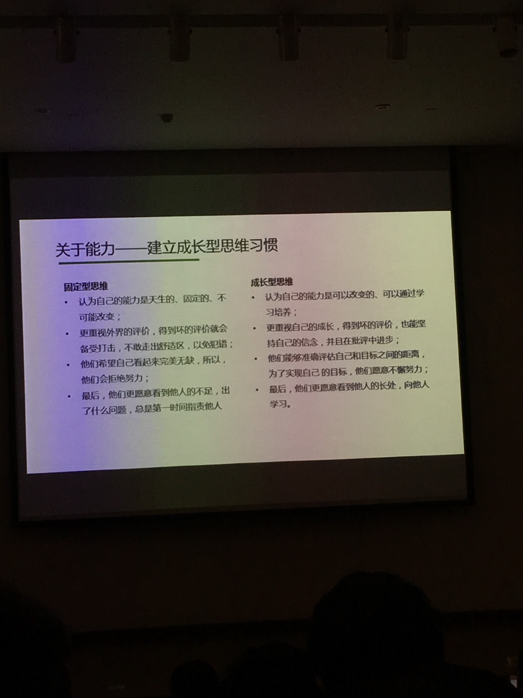

> I have taught myself multiple programming languages, business knowledge, and writing skills. On my bookshelf are hundreds of books I've read in the last two years. I also found time to learn animation design, music composition, and other skills.
> In short, learning has always been easy for me.
> When you read this, you might say, "This person is a genius." "Genius" might be appropriate, but many people are more talented than I am. I just have some good genes, ambitious parents, and a little bit of talent.
> He is ambitious (reflected in his years of maintaining his condition and refining his skills), very smart (reflected in his intelligence on the court and his handling of off-court affairs), and has a strong desire for control.
In the learning process for adults, the biggest obstacle is often not ability, but **self-esteem**. The fear of failure and concern about being judged by others can easily become stumbling blocks to learning.
Recommended reading: **《Group Mindset》** and **《Mindset: The New Psychology of Success》**

---
## Focus
1.  **《The One Thing》**
    -   Emphasizes focusing on key tasks to help readers improve efficiency and concentration.
---
## **1. Two Forms of Reading**
-   **Wordless Books**
    -   **Definition**: Everything, everyone, and every event can be a book.
    -   **Characteristics**: Learning and growing by observing life, experiencing the world, and communicating with others.
-   **Books with Words**
    -   **Definition**: Classic books that carry the crystallization of human wisdom.
    -   **Characteristics**: Absorbing the knowledge and experience of predecessors by reading text.
## **2. Core Points of Reading**
The key to reading lies in the following three points:
### **2.1 Resilience**
-   **Meaning**: Persisting in learning without giving up due to difficulties or setbacks.
-   **Importance**: Only with perseverance can one continuously progress in the ocean of knowledge.
### **2.2 Comprehension**
-   **Meaning**: Understanding and grasping the principles in books or in life.
-   **Function**: Only when you understand will you remember, locking the knowledge firmly in your mind and transforming it into your own wisdom.
### **2.3 Memory**
-   **Meaning**: The ability to remember what you have learned.
-   **Improvement Methods**: Consolidate memory through repeated practice, thinking, and review.
---
## Maintain Curiosity
Curiosity is a vital driving force that pushes us to explore the world and learn new knowledge. Whether through games or novels, we can stimulate our imagination, broaden our horizons, and gain inspiration through entertainment.
## 1. Games: An Interactive Journey of Exploration
Games are a highly interactive medium that allows us to enter new worlds, challenge ourselves, and solve problems through immersive experiences. Here are a few ways games help maintain curiosity:
### 1.1 Open-World Adventures
-   **Representative Works**: *The Legend of Zelda: Breath of the Wild*, *The Witcher 3*, *Genshin Impact*
-   **Characteristics**: Open-world games allow players to explore freely, discovering hidden secrets and quests.
-   **Benefits**: Stimulates the desire to explore, and cultivates observation and problem-solving skills.
### 1.2 Puzzles and Strategy
-   **Representative Works**: *Monument Valley*, *The Room* series, *Civilization VI*
-   **Characteristics**: Puzzle games require players to use their brains to find clues and complete challenges; strategy games emphasize planning and decision-making.
-   **Benefits**: Exercises logical thinking and creativity, while satisfying curiosity about the unknown.
### 1.3 Multiplayer Collaboration and Competition
-   **Representative Works**: *League of Legends*, *Among Us*, *Minecraft*
-   **Characteristics**: Multiplayer games encourage teamwork or competitive play, bringing the fun of social interaction.
-   **Benefits**: Enhances communication skills and allows for experiencing diverse gameplay and strategies.
## 2. Novels: Infinite Possibilities in Words
Novels construct rich and colorful worlds through text, leading readers into different times and spaces to experience different lives. Reading novels not only satisfies curiosity but also enhances language expression and empathy.
### 2.1 Fantasy and Science Fiction
-   **Representative Works**:
    -   Fantasy: *The Lord of the Rings* (J.R.R. Tolkien), *A Song of Ice and Fire* (George R.R. Martin)
    -   Science Fiction: *The Three-Body Problem* (Liu Cixin), *Foundation* (Isaac Asimov)
-   **Characteristics**: Fantasy novels depict worlds of magic and mythology, while science fiction novels explore future technology and cosmic mysteries.
-   **Benefits**: Stimulates imagination and encourages thinking about the relationship between humanity, nature, and technology.
### 2.2 Mystery and Suspense
-   **Representative Works**:
    -   Mystery: *The Adventures of Sherlock Holmes* (Arthur Conan Doyle), *Journey Under the Midnight Sun* (Keigo Higashino)
    -   Suspense: *Gone Girl* (Gillian Flynn), *And Then There Were None* (Agatha Christie)
-   **Characteristics**: Attracts readers to uncover the truth step by step through complex plots and foreshadowing.
-   **Benefits**: Cultivates logical reasoning skills and provides the enjoyment of solving puzzles.
### 2.3 Realism and Coming-of-Age Stories
-   **Representative Works**:
    -   Realism: *Ordinary World* (Lu Yao), *One Hundred Years of Solitude* (Gabriel García Márquez)
    -   Coming-of-Age: *The Kite Runner* (Khaled Hosseini), *The Little Prince* (Antoine de Saint-Exupéry)
-   **Characteristics**: Focuses on human nature, social issues, or personal growth, resonating with readers.
-   **Benefits**: Enhances empathy and encourages reflection on the meaning and value of life.
## 3. How to Better Use Games and Novels to Maintain Curiosity?
### 3.1 Set Goals
-   Set challenge goals in games, such as completing all side quests or unlocking hidden achievements.
-   Try to predict plot developments or analyze the author's writing techniques while reading novels.
### 3.2 Cross-Disciplinary Learning
-   Apply knowledge from games or novels to real life. For example, learn scientific principles from science fiction novels or real historical events from historical-themed games.
### 3.3 Share and Communicate
-   Discuss game strategies or novel plots with friends, exchange viewpoints, and broaden your thinking.
-   Participate in related community activities, such as book clubs or game forums, to meet like-minded people.
---
## **Invest in Yourself: Vision and Insight**
-   **Investment in Vision**
    -   Vision determines how far into the future you can see.
    -   Learn to identify trends, seize opportunities, and cultivate insight into the essence of things.
-   **Expand Your Insight**
    -   Insight is a valuable asset accumulated through continuous learning and practice.
    -   Read more, travel more, and communicate with outstanding people to broaden your horizons.
-   **Key Point**
    > Investing in yourself is the most worthwhile investment; vision and insight are your most powerful competitive advantages.
---
Learning is a long-term process that requires strategy and methods. Here are some thoughts and suggestions on how to learn efficiently.
## **1. Cognition First**
Ensure you have high-quality sources of information, which is the foundation of efficient learning. Actively collecting quality resources can help you master the latest and most valuable knowledge.
### **High-Quality Information Sources**
-   **Quality Books**: Choose classic books or authoritative works in the field.
-   **Quality Training**: Participate in high-quality courses or lectures to acquire systematic knowledge.
-   **Great Platforms + Great People + Open Mindset**:
    -   Join excellent platforms to connect with top talent in the industry.
    -   Maintain an open mindset to actively absorb new knowledge and perspectives.
## **2. Learning Time Allocation**
Work time is not equivalent to learning time; true learning requires proactive effort. The **Sponge Learning Method** is recommended: set aside at least **1 hour** each day for deep learning, focusing on more complex content.
> **Key Point**: The quality of learning time is more important than the quantity; concentration is the core.
## **3. Learning Methodology**
Mastering the right learning methodology can yield twice the result with half the effort, but it all comes down to the **10,000-Hour Rule** (an average of 3 hours per day for 10 consecutive years). Here are some practical learning methods:
### **Decomposition and Enhancement**
1.  **Decompose Levels -> Decompose Skills -> Decompose Actions**
    Break down complex learning goals into small, executable steps.
2.  **Chain-like Enhancement of Depth**
    -   **Why**: Deepen understanding of the essence of a problem by repeatedly asking "why."
    -   **Domain Layer Diagram/Detail Layer Diagram**: Organize knowledge into layers to form a clear structure.
3.  **Comparative Enhancement of Breadth**
    -   **Which**: Broaden your perspective by comparing different solutions or methods.
    -   **Mind Maps**: Use graphical methods to organize the knowledge system.
4.  **Cyclical Enhancement of Scope**
    Broaden your knowledge base and enhance comprehensive abilities through multi-angle, cross-disciplinary learning.
## **4. Memory and Understanding**
The core of learning lies in organizing, summarizing, and reinforcing information to form a clear structure in the mind, like a library that can be indexed at any time.
### **Understanding Tools**
-   **Pyramid Principle and Mind Maps**: Used to organize thoughts and build logical frameworks.
-   **Timeline Model**: To understand the development patterns of things.
-   **Architecture Diagram**: To understand the overall design of a system.
-   **Flowchart**: To understand business logic.
-   **Class Diagram**: To understand code structure.
### **Strengthening Memory**
-   **Flashcard Tools**: Such as [Anki](https://apps.ankiweb.net/), use spaced repetition to reinforce memory.
-   **Review (复盘)**: Enhance understanding through scenario-based learning.
    -   **Logical Deduction**: Analyze the logic behind cases and think about "why."
    -   **Identify and Fill Gaps**: Discover and fill in gaps in understanding or knowledge.
    -   **Problem-Solving Ability**: Apply knowledge to specific scenarios to deepen understanding.
> **Knowledge Efficiency vs. Engineering Efficiency**
> Knowledge does not directly translate into problem-solving ability; it requires repeated review and practice to deepen understanding. Knowledge becomes concrete and easier to absorb when placed in a specific context.
> **No Result is Also a Result**
> Even if some attempts do not achieve the expected results, you can still learn lessons from them.
## **5. Effectiveness Verification**
The effectiveness of learning needs to be verified through practice. According to the **70-20-10 Rule**, most of a person's experience and abilities come from practice, so it is important to focus on the proportion of practice.
### **Methods of Practice**
-   **Article Sharing**: Output knowledge through writing to test your own understanding.
-   **Meeting Sharing**: Share what you have learned in a team or public setting.
-   **Project Practice**: Apply learned knowledge to actual projects.
-   **Group Discussion**: Deepen understanding through communication with others.
### Learning and Understanding
You understand every word, but you just don't get it, which means you don't understand the principle.
### Willingness to Grow
Make the people around you better.
### Growth Process
-   Deeper levels (talking about value > talking about concepts > talking about implementation).
-   Broader scope.
-   Deeper thinking (books). The right method of work yields twice the result with half the effort.
### Results of Growth
-   Do the project well (in-depth).
-   Do the summary well (depth and breadth).
-   Exert greater influence (increase the scope of influence).
## **Recommended Reading**
-   **《Make It Stick: The Science of Successful Learning》**
    Discusses how to improve learning efficiency through scientific methods, worth reading in depth.
---
## Holistic Learning
### **1.1 Knowledge Connection and Memory**
-   **Foundation of Holistic Learning**: To achieve memory and application of knowledge by connecting pieces of knowledge.
-   **Core Goal**: To build a good knowledge structure, like drawing an excellent map or designing a well-planned city.
### **1.2 The Importance of Structure**
-   **The Essence of Understanding**: Understanding is the result of a highly developed and complete knowledge structure.
-   **Habit of Smart People**: Every time they learn a new concept, they automatically connect it with other knowledge.
-   **Key to Efficiency Improvement**: Consciously build connections between knowledge, rather than learning passively.
## **2. Techniques and Methods of Holistic Learning**
### **2.1 Models**
-   **Definition of a Model**: A model is a compressed form that condenses multiple key ideas into one place.
    -   It can be a diagram, a metaphor, or an internalized expression.
    -   A model is the core framework of knowledge and the basis for further expansion.
-   **Life Experience as a Source of Models**:
    -   Life experience is the most familiar structure and a major source of models.
    -   Knowledge structures from other disciplines can also be sources of models, as long as they are similar to what is being learned.
#### **Example: Variable Model**
-   In programming, variables can be of different types (like numbers, letters, or words).
-   I imagine them as jars with different openings, which can only hold specific types of data. This metaphor makes a complex concept easy to understand.
### **2.2 Highways**
-   **Cross-Disciplinary Creativity**: Create new knowledge structures by building connections between disciplines that seem unrelated to the average person.
-   **Example: Machiavelli's Views**
    -   Combine Machiavelli's views on governing a state with personal friendships, social status, and management experience to form a unique perspective of understanding.
    -   This "highway" not only deepens the understanding of knowledge but also gives it more practical value.
### **2.3 Perceptual, Relational, and Foundational Mathematical Structures**
-   **Perceptual Structure**: Concrete information based on sensory experience (what is seen, heard, touched).
-   **Relational Structure**: Describes the relationships between things (e.g., cause and effect, comparison, analogy).
-   **Foundational Mathematical Structure**: The logical framework of abstract information (e.g., formulas, theorems, derivations).
## **3. The Sequence of Holistic Learning**
### **3.1 Acquisition Phase**
-   **Simplify**: Focus only on examples that are very helpful for forming a model, ignoring unnecessary details.
-   **Capacity**: Acquire as much information as possible, read more to deepen understanding.
-   **Speed**: Acquire information efficiently (e.g., reading a book in 30 minutes is more efficient than in 1 hour).
#### **Note**
-   If you can't understand a passage, try breaking it down into smaller questions, narrow the scope, and find what you truly don't understand.
### **3.2 Understanding Phase**
-   **Initial Understanding**: Grasp the basic meaning of the information, avoiding rote learning.
-   **In-depth Understanding**: Understand the context of the information, its relationship with other knowledge, and how to apply it to practical problems.
-   **Three Levels**:
    1.  **Understanding Phase**: Initially grasp the meaning of the information.
    2.  **Expansion Phase**: Connect the information with other knowledge.
    3.  **Application Phase**: Use the knowledge to solve real-world problems.
### **3.3 Expansion Phase**
-   **Depth Expansion**: Explore the source of the knowledge, the experimental process, and the logic behind it.
    -   Example: How was a certain formula derived? What is its relationship with other formulas?
-   **Horizontal Expansion**: Look for similar knowledge points and compare their similarities and differences.
    -   Example: What other discoveries are there in the same field? What other related research was conducted during the same period?
-   **Vertical Expansion**: Connect knowledge with patterns from different fields through metaphors and internalization.
    -   Example: Can the wave theory in physics explain group behavior in psychology?
### **3.4 Application Phase**
-   **Practice Makes Perfect**: Apply the learned knowledge to practical problems.
    -   Example: When learning accounting, directly apply the knowledge to manage your own company.
    -   Example: When learning programming, try to write your own programs, or even complete a small project.
## **4. Information Types and Learning Strategies**
### **4.1 Arbitrary Information**
-   **Characteristics**: No patterns, difficult to process, requires rote memorization.
-   **Methods**: Mnemonic techniques, peg system, compression.
### **4.2 Opinion Information**
-   **Characteristics**: Controversial information, often requires diagrams to aid understanding.
-   **Method**: Organize viewpoints with diagrams to analyze their logical relationships.
### **4.3 Process Information**
-   **Characteristics**: Information that teaches how to do something (e.g., swimming, programming).
-   **Method**: Rely on correct models and gradually form a structure through practice.
### **4.4 Concrete Information**
-   **Characteristics**: Information that can be directly observed (e.g., features of plants and animals in biology).
-   **Method**: Deepen memory through sensory experience.
### **4.5 Abstract Information**
-   **Characteristics**: Highly logical but difficult to understand intuitively (e.g., mathematics, physics).
-   **Method**: Use metaphors and internalization to simplify complex knowledge; continuously improve through model error correction.
## **5. Learning Principles and Suggestions**
### **5.1 "Learn It Once" Principle**
-   **Focused Learning**: Concentrate fully on the lecture instead of being busy taking notes.
-   **Efficient Homework**: Completing tasks in one go is more time-saving than doing them in several sessions.
### **5.2 Combining Practice and Interest**
-   **Interest-Driven**: Connect what you are learning with your own interests.
    -   Example: When studying computer science, think about the mysterious symbols of the universe; when studying medicine, imagine real patients; when studying history, feel the vivid stories of historical figures.
-   **Active Application**: Try to use knowledge to solve practical problems during the learning process.
    -   Example: When learning programming, try to write your own programs; when learning accounting, use the knowledge to manage a company.
## **1. The Importance of Creating Connections**
-   **Core Idea**
    -   **The more connections you create, the stronger the memory and the deeper the understanding.**
    -   This is in stark contrast to rote memorization.
## **2. Deep Understanding vs. Rote Memorization**
### **2.1 Bohr's Example**
-   **Bohr's Learning Style**
    -   He didn't just memorize the symbols in a formula; he deeply understood the true meaning of each symbol.
    -   He understood why a particular symbol appeared in a specific place in the formula.
-   **Mastery and Breakthrough of Rules**
    -   Because of his deep understanding of the rules, Bohr could not only use them proficiently but also break them when necessary.
## **3. The Limitations of Rote Memorization**
-   **Characteristics of Rote Memorization**
    -   Just memorizing symbols and formulas without understanding the underlying logic.
    -   The memory is short-lived, easily forgotten, and difficult to apply flexibly.
-   **Advantages of Deep Understanding**
    -   By building connections between pieces of knowledge, you not only remember it better but can also apply it flexibly.
    -   After understanding the essence of the rules, you can creatively solve problems.
---
## Free Online Course Platforms
Here are some high-quality free online education platforms:
-   **MIT OpenCourseWare** - Free online courses from MIT
-   **EHow.com** - Various articles on "how to do" things
-   **FreeEd.net** - "Free Online Education"
-   **Portal to Free Online Courses** - A portal to online courses from several prestigious universities
-   Google, Duxiu, CNKI
## High-Efficiency Learning Websites
### Personal Development and Learning Methods
-   [ScottHYoung.com](http://ScottHYoung.com) - Specializes in discussing high efficiency, learning methods, and habit formation
-   [ZenHabits.net](http://ZenHabits.net) - Simplicity is high efficiency
-   [Lifehack.org](http://Lifehack.org) - One of the largest high-efficiency websites
-   [PickTheBrain.com](http://PickTheBrain.com) - High efficiency and motivation
-   [StudyHacks](http://StudyHacks) - A high-efficiency guide for students
-   [StevePavlina.com](http://StevePavlina.com) - Personal development website
### Recommended Books
Essential reading for improving efficiency:
1.  **Getting Things Done** - David Allen's classic work
2.  **The Power of Full Engagement** - About energy management
3.  **Zen To Done** - Tells you how to do things, emphasizing the gradual formation of good habits
4.  **How to Be a Straight-A Student** & **How to Win at College**
    -   Two classic works
    -   Help improve efficiency
    -   Must-reads for tackling learning challenges
---
On the path to growth and success, fear is a common emotion. However, true progress often happens the moment we **step out of our comfort zone**. Here is an in-depth exploration of this viewpoint.
## 1. **The Nature of Fear: Obstacle or Motivation?**
### 1.1 The Source of Fear
-   **Uncertainty of the Unknown**: We fear failure, rejection, and facing unknown outcomes.
-   **Self-Doubt**: Inner insecurity makes us question our abilities and worry that we are not competent.
### 1.2 The Role of Fear
-   **Protective Mechanism**: From a biological perspective, fear is a self-protection mechanism that helps us avoid risks.
-   **A Signal for Growth**: However, in many cases, fear also means you are approaching an important growth opportunity.
## 2. **Why Must You Force Yourself?**
### 2.1 Breaking Out of the Comfort Zone
-   **The Risk of Stagnation**: If you always stay in your comfort zone, your abilities and horizons will be difficult to expand.
-   **The Price of Growth**: Only by challenging yourself can you gain new skills, experience, and confidence.
### 2.2 Action Over Hesitation
-   **Overcoming Psychological Barriers**: Many times, things are not as scary as we imagine, and the act of doing can itself alleviate fear.
-   **Accumulating Successful Experiences**: Every experience of overcoming fear will make you more confident and prepare you for future challenges.
## 3. **How to Force Yourself to Do Things You're Afraid Of?**
### 3.1 Set Clear Goals
-   **Break Down Tasks**: Break down the big goal that scares you into several small, manageable steps.
-   **Clarify the Meaning**: Think about the long-term value of this matter to you and find your inner motivation.
### 3.2 Build a Support System
-   **Seek Encouragement**: Share your plans with friends, family, or mentors to get their support and advice.
-   **Join a Community**: Participate in related group activities and face challenges with like-minded people.
### 3.3 Accept Imperfection
-   **Allow for Failure**: Don't let the fear of failure stop you; failure itself is part of learning.
-   **Focus on the Process**: Instead of dwelling on the outcome, focus on the effort and enjoy the pleasure of growth.
---
## Efficient Learning
https://dev.to/scroung720/learning-how-to-learn-diffused-mode-focused-mode-1-433b
---
Tsinghua University Press has published a complete set of photocopied versions of well-known foreign computer science textbooks.
## **Book Recommendations**
-   《Computer Systems: A Programmer's Perspective》
    -   A classic computer science book that provides an in-depth explanation of how computer systems work.
-   《Code: The Hidden Language of Computer Hardware and Software》
    -   An easy-to-understand book that helps in understanding the underlying principles of computers.
### **1. Good Books Wiki**
-   [Good Books Wiki](https://csdiy.wiki/%E5%A5%BD%E4%B9%A6%E6%8E%A8%E8%8D%90/)
    -   Collects many high-quality book recommendations, covering programming, algorithms, computer science, and other fields.
### **2. OSS Insight**
-   [OSS Insight](https://ossinsight.io/)
    -   An open-source project data analysis platform that helps to understand the dynamics and trends of the open-source community.
### **3. LWN.net Memory Article Series**
-   [What every programmer should know about memory, Part 1](https://lwn.net/Articles/250967/)
    -   A classic series of articles that deeply explores memory management, suitable for developers interested in underlying principles.
## **Video Courses**
### **1. Stanford University Open Course: How to Start a Startup**
-   **Course Introduction**: Provided by YC's startup course, consisting of 20 lectures covering the core knowledge and practical experience of entrepreneurship.
-   [Bilibili Video Link](https://www.bilibili.com/video/BV1Af4y1P7tH/?vd_source=0b52cc68be921568350bafb185a8ddff)
## **Other Resources**
### **1. The Art of Unix Programming**
-   [The Art of Unix Programming](http://www.catb.org/~esr/writings/taoup/html/)
    -   A classic work by Eric S. Raymond that deeply explores the philosophy and practice of Unix programming.
---
## **1. System Architect**
-   **Introduction**:
    -   A System Architect is a professional role responsible for designing and planning the overall structure of a software system.
    -   Requires mastery of system design principles, architectural patterns, performance optimization, and knowledge of distributed systems.
-   **Core Skills**:
    -   System Design and Modeling
    -   Distributed Architecture Design
    -   Database Design and Optimization
    -   Security and Scalability Assurance
-   **Learning Resources**:
    -   Recommended reading of classic books like 《Clean Architecture》, 《Designing Data-Intensive Applications》.
    -   Refer to actual case studies to enhance the ability to solve complex problems.
## **2. CCF CSP (China Computer Federation Certified Software Professional)**
-   **Introduction**:
    -   CCF CSP is a software capability certification exam launched by the China Computer Federation (CCF).
    -   Mainly assesses programming ability, algorithm design, and implementation skills.
-   **Characteristics**:
    -   Focuses on practical programming skills, with problems leaning towards engineering practice.
    -   Scores are recognized by many companies and universities for job applications or further studies.
-   **Preparation Advice**:
    -   Familiarize yourself with common algorithms and data structures (e.g., dynamic programming, graph theory, sorting).
    -   Recommended practice platforms: LeetCode, Nowcoder, CCF official problem set.
## **3. PAT (Programming Ability Test)**
-   **Introduction**:
    -   PAT is a programming ability test launched by Zhejiang University, divided into Advanced Level and Basic Level.
    -   Mainly assesses algorithm design and implementation skills.
-   **Characteristics**:
    -   The difficulty of the problems is moderate, suitable for beginners and intermediate developers.
    -   Scores can be used for applying to graduate programs at domestic and international universities or for job applications.
-   **Preparation Advice**:
    -   Practice with past exam questions to get familiar with the exam format.
    -   Recommended practice platforms: PAT official problem set, Nowcoder.
---
## Intimate Relationships
-   《Hold Me Tight》
    -   Deeply explores the psychology and emotions in romantic relationships, helping to understand a partner's inner world.
-   《What Kind of Love is Worth Being Brave for Once》
    -   Guides readers to think about the value of love and learn to make wise choices in relationships.
-   《Will It Get Better When I Grow Up?》
    -   Reflects on the relationship between growth and maturity, exploring how to truly grow into a better self.
## Cognition & Growth
-   《The Courage to Be Disliked》
    -   A classic work based on Adlerian psychology, helping readers to break free from the shackles of others' judgments and live their true selves.
-   《The Road Less Traveled》
    -   Explores life's growth and mental maturity, revealing the path to happiness.
-   《Wang Yangming's Philosophy of Mind》
    -   Provides an in-depth interpretation of Wang Yangming's philosophy of mind, inspiring readers to find strength and wisdom from within.
## The Father of Logic
Gottlob Frege is widely regarded as one of the founders of modern logic. His contributions to logic, the foundations of mathematics, and philosophy continue to have a profound impact today.
