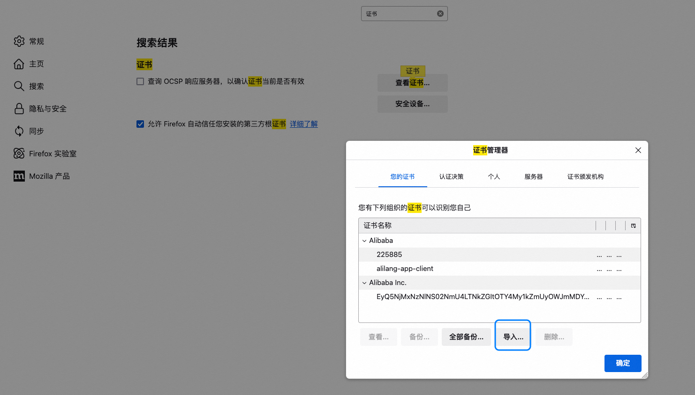

In front-end development, when we need to send form data, we often use the `FormData` object to construct request parameters. However, `FormData` is different from a regular JavaScript object. It is a key-value pair structure, and its content cannot be directly extracted using ES6 destructuring syntax. This adds a certain level of complexity for developers when handling `FormData`.
---
## Characteristics of FormData
- **Key-Value Pair Structure**: `FormData` internally stores key-value pairs, similar to URL query parameters.
- **Not Directly Destructible**: `FormData` does not support direct use of ES6 destructuring syntax (e.g., `{ key } = formData`).
- **Dynamic Addition and Deletion**: Data can be dynamically manipulated using the `append` and `delete` methods.
- **Suitable for File Uploads**: `FormData` supports binary data (like files), making it very suitable for file upload scenarios.
---
## Methods for Handling FormData
### Iterating Through FormData
If you need to get all key-value pairs from a `FormData` object, you can use the iterator methods it provides (such as `entries`, `keys`, `values`) to loop through them.
#### Example Code
```javascript
const formData = new FormData();
formData.append('name', 'Alice');
formData.append('age', '25');
for (let [key, value] of formData.entries()) {
  console.log(`${key}: ${value}`);
}
```
### Converting to a Plain Object
In some scenarios, you might need to convert `FormData` into a plain object for further processing. This can be achieved by iterating through the `FormData` and manually constructing an object.
#### Example Code
```javascript
const formData = new FormData();
formData.append('name', 'Alice');
formData.append('age', '25');
const formDataToObject = (formData) => {
  const obj = {};
  for (let [key, value] of formData.entries()) {
    obj[key] = value;
  }
  return obj;
};
console.log(formDataToObject(formData));
// Output: { name: 'Alice', age: '25' }
```
---
## Code Example
Here is a complete example demonstrating how to handle request parameters of type `FormData`:
```javascript
// Construct FormData
const formData = new FormData();
formData.append('username', 'JohnDoe');
formData.append('email', 'john.doe@example.com');
formData.append('avatar', fileInput.files[0]); // Assuming there is a file input
// Iterate through FormData
console.log('Iterating through FormData:');
for (let [key, value] of formData.entries()) {
  console.log(`${key}:`, value);
}
// Convert to a plain object
const formDataToObject = (formData) => {
  const obj = {};
  for (let [key, value] of formData.entries()) {
    obj[key] = value;
  }
  return obj;
};
console.log('Converted to plain object:', formDataToObject(formData));
// Send the request
fetch('/api/submit', {
  method: 'POST',
  body: formData,
})
  .then((response) => response.json())
  .then((data) => console.log('Server response:', data))
  .catch((error) => console.error('Request failed:', error));
```
---
## Can Request Parameters Be an Array?
### **1. Answer**
Yes, request parameters can be an array.
I used to mistakenly believe that JSON request parameters could only be objects or passed in the `key=value` format.
### **2. Example Code**
Here is an example of sending JSON data via AJAX:
```ts
$.ajax({
  type: "POST",
  url: "index.php",
  dataType: "json",
  data: JSON.stringify({ paramName: info }),
  success: function (msg) {
    $(".answer").html(msg);
  },
});
```
### **3. References**
- [Pass array to AJAX request in AJAX - Stack Overflow](https://stackoverflow.com/questions/8890524/pass-array-to-ajax-request-in-ajax)
### **4.1 Forms of Request Parameters**
- **JSON Object**: A JavaScript object can be serialized into a JSON string using `JSON.stringify`.
- **Array**: An array can also be passed as a request parameter, for example:
  ```ts
  $.ajax({
    type: "POST",
    url: "index.php",
    dataType: "json",
    data: JSON.stringify([1, 2, 3, 4]),
    success: function (msg) {
      console.log(msg);
    },
  });
  ```
---
## HTTPS
https://www.wosign.com/News/news_2018082801.htm
---
## LightProxy
Besides Chrome, some scenarios require a global proxy. I used to use Charles a lot, but recently I've been using `LightProxy` more. However, I found that when using the proxy with Firefox, it shows a certificate error, displaying a message like: **Your connection is not secure**
Solution:
1. Install the certificate. In addition to installing it on the local machine, you also need to import the certificate into the browser.

2. Disable HSTS
In the Firefox address bar, type `about:config`, search for `network.stricttransportsecurity.preloadlist`, and set it to `false`.
**LightProxy** is a lightweight proxy tool based on Node.js, mainly used for debugging and intercepting HTTP/HTTPS requests. It decrypts HTTPS traffic through a Man-in-the-Middle (MITM) attack, allowing users to view and modify the encrypted request content.
---
## HTTP/2 Protocol
### HTTP Pipelining
- **Definition**: Sending multiple HTTP requests sequentially over a single TCP connection without waiting for the server's response to the previous request.
- **Characteristics**:
  - The client still needs to receive responses in the same order the requests were sent.
  - It suffers from the Head-of-Line Blocking problem.
### Head-of-Line Blocking
- **Definition**: Due to the limitations of HTTP Pipelining, subsequent requests must wait for the response of the preceding request to be returned before they can be processed, which increases latency.
### RTT (Round-Trip Time)
- **Definition**: The time elapsed from when a sender sends data until it receives an acknowledgment from the receiver.
- **Components**:
  1. **Link Propagation Time**: The time it takes for data to travel across the link.
  2. **End-System Processing Time**: The time taken by the sender and receiver to process the data.
  3. **Queuing and Processing Time in Router Buffers**: Affected by the level of network congestion.
- **Impact**: Changes in RTT reflect changes in network congestion.
- **Example**: If the RTT is 1 millisecond, only 1000 RPC round-trip responses can be completed in 1 second.
### TLS (Transport Layer Security)
- **Definition**: A transport layer security protocol used to encrypt communications, ensuring data confidentiality and integrity.
### Binary Protocol Features of HTTP/2
- **Multiplexed Streams**: Supports transmitting multiple requests and responses simultaneously over a single TCP connection, greatly improving the experience on high-latency networks.
## What Problems Does It Solve?
1. **Preserves HTTP Protocol Semantics**:
   - It does not modify the original semantics of the HTTP protocol (such as request header fields).
2. **Improves the Data Link Layer**:
   - Reduces the number of network round-trips.
   - Completely avoids the Head-of-Line Blocking problem by using multiplexing and quickly discarding unwanted streams.
   - Supports a large number of parallel streams, so even if a website's data is distributed across different locations, it won't become a bottleneck.
   - Makes rational use of stream prioritization, allowing the client to receive more important data first.
## SPDY Protocol
- **Definition**: A protocol developed by Google aimed at solving the performance issues of HTTP/1.1.
- **Goal**: To improve page loading speed.
- **Impact**: Due to its significant effectiveness, the HTTP Working Group (HTTP-WG) incorporated it into the HTTP/2 standard.
## Which Optimization Techniques Are No Longer Needed?
1. **Domain Sharding**:
   - In HTTP/1.1, multiple domains were used to overcome the browser's connection limit per domain.
   - In HTTP/2, multiplexing has solved this problem, making domain sharding unnecessary.
2. **Inlining Images**:
   - Embedding small images directly into HTML or CSS to reduce the number of requests.
   - The multiplexing capability of HTTP/2 makes this optimization redundant.
3. **CSS Sprites**:
   - Combining multiple small icons into a single large image to reduce the number of requests.
   - The efficient request handling of HTTP/2 makes the advantages of CSS sprites less significant.
## References
- [HTTP/2 - High Performance Browser Networking](https://hpbn.co/http2/)
- [http2-explained](https://bagder.gitbooks.io/http2-explained/content/zh/part4.html)
- [What are the major improvements of HTTP/2.0 compared to 1.0?](https://www.zhihu.com/question/34074946/answer/108588042)
- [HTTP/2 Resource Collection](https://imququ.com/post/http2-resource.html)
- [What is HTTP/2 – The Ultimate Guide](https://kinsta.com/learn/what-is-http2/#how_you_can_start_using_http2)
- [Introduction to HTTP/2](https://developers.google.com/web/fundamentals/performance/http2/)
- [Juejin Article: HTTP/2 in Practice](https://juejin.im/entry/583e9e52ac502e006c30d28c)
## Problem Log
### Baidu Authentication
Search results redirect directly to the HTTPS site, which requires Baidu authentication.
Baidu's authentication crawler will only crawl pages that do not require a login.
### Problem Log
1. The backend redirects from HTTPS to HTTP.
2. When a page is requested over HTTPS, if it contains image requests over HTTP, it cannot be accessed correctly in IE8 and below.
3. Frontend `localStorage` cannot be used across HTTP and HTTPS. The search history in the site-wide header cannot be synchronized between HTTP and HTTPS.
4.
### Images
HTTP accessing HTTPS is fine.
HTTPS accessing HTTP will cause the browser to show a security warning. In IE8, all images will fail to load.
Will HTTP images inside an iframe be affected?
### JS
HTTPS accessing HTTP will be blocked.
---
## Problem Description
When visiting a website, some images fail to load, and the console shows certificate-related errors. For example:
- `NET::ERR_CERT_DATE_INVALID` (Certificate has expired)
- `NET::ERR_CERT_AUTHORITY_INVALID` (Certificate is not trusted)
This is usually caused by an expired or misconfigured SSL/TLS certificate.
---
## Cause Analysis
1. **Certificate Expired**
   SSL/TLS certificates have a fixed validity period (usually 1 year or less). If not renewed in time, the certificate will become invalid.
2. **Certificate Configuration Error**
   The server may not have the certificate installed or configured correctly, for example, the certificate chain is incomplete.
3. **Untrusted by Browser**
   Using a self-signed certificate or a certificate issued by an untrusted Certificate Authority (CA).
4. **Time Synchronization Issues**
   If the server or client's time is set incorrectly, it may cause the certificate to be mistakenly identified as invalid.
---
## Solutions
### Check the SSL/TLS Certificate
1. **Online Tool Check**
   Use an online tool (like [SSL Labs](https://www.ssllabs.com/ssltest/)) to check the certificate's validity, expiration date, and configuration.
2. **Browser Developer Tools**
   Open the browser's developer tools (F12) and check the error messages in the network requests to confirm if they are certificate-related.
### Update or Renew the Certificate
1. **Renew the Certificate**
   If the certificate has expired, contact the Certificate Authority (CA) to renew it. Common CAs include:
   - Let's Encrypt (free)
   - DigiCert
   - GlobalSign
2. **Reinstall the Certificate**
   Ensure the certificate chain is complete and correctly installed on the server. Here are some installation guides for common servers:
   - **Nginx**
     ```nginx
     server {
         listen 443 ssl;
         ssl_certificate /path/to/fullchain.pem;
         ssl_certificate_key /path/to/privkey.pem;
     }
     ```
   - **Apache**
     ```apache
     <VirtualHost *:443>
         SSLEngine on
         SSLCertificateFile /path/to/cert.pem
         SSLCertificateKeyFile /path/to/key.pem
         SSLCertificateChainFile /path/to/chain.pem
     </VirtualHost>
     ```
### Temporary Solution: Use HTTP
If the certificate issue cannot be fixed immediately, you can temporarily switch the image resources to the HTTP protocol (unencrypted). However, please note that this method reduces security and is only suitable for emergencies.
Example:
```html

```
### Ensure the Browser Trusts the Certificate
1. **Use a Trusted CA**
   Ensure the certificate is issued by a trusted CA. Avoid using self-signed certificates.
2. **Manually Add Trust (Internal Environments Only)**
   In a development or testing environment, you can add the self-signed certificate to the browser's trust list.
---
## Preventive Measures
1. **Set Up Automatic Renewal**
   Use tools that support automatic renewal, such as Certbot with Let's Encrypt, to avoid certificate expiration issues.
2. **Monitor Certificate Validity**
   Regularly check the certificate's expiration date and set up reminders to prevent forgetting to renew.
3. **Regular Testing**
   Periodically use SSL detection tools to check if the certificate configuration is correct.
4. **Use a CDN Service**
   Host static resources on a CDN (like Alibaba Cloud OSS, Cloudflare) and leverage the HTTPS support they provide.
---
## HTTP Standard Document
https://datatracker.ietf.org/doc/html/rfc7231#page-70
---
When implementing a download feature, requests are often sent via an `XHR` object. However, this method can inevitably encounter **cross-origin issues**.
## **2. Solution**
### **2.1 Change to an HTTP GET Request**
- Change the download request from `XHR` to a regular HTTP GET request.
- The front-end triggers the download using the `window.open` method:
  ```javascript
  window.open(`downloadLink`);
  ```
### **2.2 Advantages**
- Avoids the cross-origin restrictions of `XHR` requests.
- Simplifies the front-end code logic by directly using the browser's native behavior to complete the download.
### **2.3 Points to Note**
- Ensure the backend API supports direct resource access via a URL.
- If parameters need to be passed, they can be appended to the `downloadLink` as a URL query string.
- Example:
  ```javascript
  const downloadLink = `https://example.com/download?fileId=123`;
  window.open(downloadLink);
  ```
---
## Crawlers
### Good Crawlers
Good crawlers generally refer to search engine crawlers, such as those from Google, Baidu, etc. Their main purpose is to crawl web page content and build an index to provide users with more accurate search results. These crawlers access websites in a friendly and compliant manner, helping to increase the site's visibility and traffic.
### Bad Crawlers
Bad crawlers, on the other hand, are those that burden or damage the server. They might consume a large amount of bandwidth through high-frequency requests, leading to a decline in server performance or even a crash. Additionally, some malicious crawlers may attempt to scrape sensitive data or perform other illegal operations.
## The Role and Limitations of robots.txt
`robots.txt` is a text file that allows website administrators to define which pages can be accessed by crawlers and which should be blocked. For example:
```txt
User-agent: *
Disallow: /admin/
Disallow: /private/
```
The configuration above means that all crawlers (`*`) are not allowed to access content under the `/admin/` and `/private/` paths.
**Limitations:**
- `robots.txt` is just a protocol and is not legally binding. Compliance is entirely up to the crawler's developer.
- Malicious crawlers often ignore the `robots.txt` file and continue to scrape restricted content.
## Common Crawling Techniques
### Crawling HTML with GET Requests
This is the most basic crawling method. It involves sending an HTTP GET request to get the HTML content of a target webpage, and then using a parsing tool (like BeautifulSoup, lxml, etc.) to extract the required data.
**Advantages:**
- Simple to implement, suitable for beginners.
- Very effective for static web pages.
**Disadvantages:**
- Difficult to handle dynamically loaded content (such as pages rendered by JavaScript).
### Headless Browser Crawling
For dynamic web pages, a headless browser (like Puppeteer, Selenium, etc.) can be used to simulate user actions. A headless browser can run in the background and load the complete page content, including parts dynamically generated by JavaScript.
**Advantages:**
- Can handle complex dynamic web pages.
- Supports simulating user interactions (like clicking buttons, filling out forms, etc.).
**Disadvantages:**
- Higher performance overhead and slower running speed.
- Easily detected by the target website.
## Methods to Avoid Being Traced
To protect your privacy and avoid being tracked or banned by the target website, you can take the following measures:
1. **Use a Proxy or VPN**
   Hide your real IP address using a proxy server or VPN to reduce the risk of being traced.
2. **Set Request Headers**
   Add common browser User-Agent and other header information to the crawler's requests to mimic the behavior of a regular user.
3. **Control Request Frequency**
   Set a reasonable interval between requests to avoid triggering the target website's protection mechanisms due to high-frequency access.
4. **Distributed Crawling**
   Use multiple devices or IP addresses to distribute the crawling task, reducing the access pressure from a single IP.
