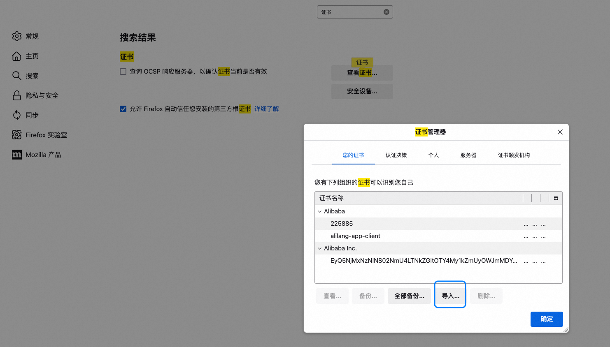

在前端开发中，当我们需要发送表单数据时，通常会使用 `FormData` 对象来构造请求参数。然而，`FormData` 与普通的 JavaScript 对象不同，它是一种键值对结构，无法直接通过 ES6 解构语法提取其内容。这给开发者在处理 `FormData` 数据时带来了一定的复杂性。

---

## FormData 的特点

- **键值对结构**：`FormData` 内部存储的是键值对，类似于 URL 查询参数。
- **不可直接解构**：`FormData` 不支持直接使用 ES6 解构语法（如 `{ key } = formData`）。
- **动态添加和删除**：可以通过 `append` 和 `delete` 方法动态操作数据。
- **适用于文件上传**：`FormData` 支持二进制数据（如文件），非常适合用于文件上传场景。

---

## 处理 FormData 的方法

### 遍历 FormData

如果需要获取 `FormData` 中的所有键值对，可以使用 `FormData` 提供的迭代器方法（如 `entries`、`keys`、`values`）进行遍历。

#### 示例代码
```javascript
const formData = new FormData();
formData.append('name', 'Alice');
formData.append('age', '25');

for (let [key, value] of formData.entries()) {
  console.log(`${key}: ${value}`);
}
```

### 转换为普通对象

在某些场景下，可能需要将 `FormData` 转换为普通对象以便进一步处理。可以通过遍历 `FormData` 并手动构造一个对象来实现。

#### 示例代码
```javascript
const formData = new FormData();
formData.append('name', 'Alice');
formData.append('age', '25');

const formDataToObject = (formData) => {
  const obj = {};
  for (let [key, value] of formData.entries()) {
    obj[key] = value;
  }
  return obj;
};

console.log(formDataToObject(formData));
// 输出: { name: 'Alice', age: '25' }
```

---

## 代码示例

以下是一个完整的示例，展示如何处理 `FormData` 类型的请求入参：

```javascript
// 构造 FormData
const formData = new FormData();
formData.append('username', 'JohnDoe');
formData.append('email', 'john.doe@example.com');
formData.append('avatar', fileInput.files[0]); // 假设有一个文件输入

// 遍历 FormData
console.log('遍历 FormData:');
for (let [key, value] of formData.entries()) {
  console.log(`${key}:`, value);
}

// 转换为普通对象
const formDataToObject = (formData) => {
  const obj = {};
  for (let [key, value] of formData.entries()) {
    obj[key] = value;
  }
  return obj;
};

console.log('转换为普通对象:', formDataToObject(formData));

// 发送请求
fetch('/api/submit', {
  method: 'POST',
  body: formData,
})
  .then((response) => response.json())
  .then((data) => console.log('服务器响应:', data))
  .catch((error) => console.error('请求失败:', error));
```

---
## 请求参数可以是数组吗？

### **1. 答案**

请求参数可以是数组。  
以前我误以为 JSON 的请求参数只能是对象，或者以 `key=value` 的形式传递。

### **2. 示例代码**

以下是一个通过 AJAX 发送 JSON 数据的示例：

```ts
$.ajax({
  type: "POST",
  url: "index.php",
  dataType: "json",
  data: JSON.stringify({ paramName: info }),
  success: function (msg) {
    $(".answer").html(msg);
  },
});
```

### **3. 参考资料**

- [Pass array to AJAX request in AJAX - Stack Overflow](https://stackoverflow.com/questions/8890524/pass-array-to-ajax-request-in-ajax)

### **4.1 请求参数的形式**

- **JSON 对象**：可以通过 `JSON.stringify` 将 JavaScript 对象序列化为 JSON 字符串。
- **数组**：同样可以作为请求参数传递，例如：
  ```ts
  $.ajax({
    type: "POST",
    url: "index.php",
    dataType: "json",
    data: JSON.stringify([1, 2, 3, 4]),
    success: function (msg) {
      console.log(msg);
    },
  });
  ```

---

## HTTPS

https://www.wosign.com/News/news_2018082801.htm


---

## LightProxy

除了chrome，一般有些场景需要全局代理，之前用charles比较多，最近用`LightProxy`较多。 但是发现firefox代理的时候提示证书问题，表现就是访问浏览器时提示:  **网页不安全**

解决办法： 

1、是安装证书，除了本机安装外，还需要在浏览器导入证书 



2、禁用HSTS 
在 Firefox 地址栏输入 about:config，搜索 network.stricttransportsecurity.preloadlist，将其设置为 false。


**LightProxy** 是一个基于 Node.js 的轻量级代理工具，主要用于调试和拦截 HTTP/HTTPS 请求。它通过中间人攻击（Man-in-the-Middle, MITM）的方式来解密 HTTPS 流量，从而允许用户查看和修改加密的请求内容。

---

## HTTP2协议

### HTTP Pipelining

- **定义**：将多个 HTTP 请求放到一个 TCP 连接中依次发送，而无需等待服务器对前一个请求的响应。
- **特点**：
  - 客户端仍需按照发送请求的顺序接收响应。
  - 存在线头阻塞（Head of Line Blocking）的问题。

### 线头阻塞（Head of Line Blocking）

- **定义**：由于 HTTP Pipelining 的限制，后续请求必须等待前面请求的响应返回后才能被处理，导致延迟增加。

### RTT (Round-Trip Time)

- **定义**：从发送方发送数据开始，到收到来自接收方的确认信息所经历的时间。
- **组成部分**：
  1. **链路传播时间**：数据在链路上传播所需的时间。
  2. **末端系统处理时间**：发送方和接收方处理数据的时间。
  3. **路由器缓存中的排队和处理时间**：受网络拥塞程度影响。
- **影响**：RTT 的变化反映了网络拥塞程度的变化。
- **示例**：若 RTT 为 1 毫秒，则 1 秒内只能完成 1000 次 RPC 往返响应。

### TLS (Transport Layer Security)

- **定义**：传输层安全协议，用于加密通信，确保数据的机密性和完整性。

### HTTP/2 的二进制协议特性

- **多路复用的流**：支持在一个 TCP 连接上同时传输多个请求和响应，极大改善高延迟网络下的体验。

## 解决了什么问题

1. **保持 HTTP 协议语义不变**：
   - 不会修改 HTTP 协议原有的语义（如请求头字段等）。

2. **改进数据链路层**：
   - 减少了网络往返传输的数量。
   - 使用多路复用和快速丢弃不需要的流，完全避免了线头阻塞（Head of Line Blocking）问题。
   - 支持大量并行流，即使网站的数据分布在不同位置也不会成为瓶颈。
   - 合理利用流的优先级，让客户端优先接收更重要的数据。

## SPDY 协议

- **定义**：由 Google 开发的协议，旨在解决 HTTP/1.1 的性能问题。
- **目标**：提高页面加载速度。
- **影响**：由于效果显著，HTTP 工作组（HTTP-WG）将其纳入 HTTP/2 标准。

## 哪些优化手段不再需要

1. **域名分片**：
   - 在 HTTP/1.1 中，通过使用多个域名来突破浏览器对单个域名的连接数限制。
   - 在 HTTP/2 中，多路复用已经解决了这个问题，域名分片不再必要。

2. **内联图片**：
   - 将小图片直接嵌入 HTML 或 CSS 中以减少请求数量。
   - HTTP/2 的多路复用能力使得这种优化手段变得多余。

3. **雪碧图**：
   - 将多个小图标合并成一张大图以减少请求数量。
   - HTTP/2 的高效请求处理能力使得雪碧图的优势不再明显。

## 参考资料

- [HTTP/2 - High Performance Browser Networking](https://hpbn.co/http2/)
- [http2-explained](https://bagder.gitbooks.io/http2-explained/content/zh/part4.html)
- [HTTP/2.0 相比 1.0 有哪些重大改进](https://www.zhihu.com/question/34074946/answer/108588042)
- [HTTP/2 资料汇总](https://imququ.com/post/http2-resource.html)
- [What is HTTP/2 – The Ultimate Guide](https://kinsta.com/learn/what-is-http2/#how_you_can_start_using_http2)
- [HTTP/2 简介](https://developers.google.com/web/fundamentals/performance/http2/)
- [掘金文章：HTTP/2 实践](https://juejin.im/entry/583e9e52ac502e006c30d28c)

## 问题记录

### 百度认证

搜索结果直接跳转到https站点，需要通过百度认证。
百度认证的时候只会爬不需要登录的页面

### 问题记录

1. 后端做redirect的时候https 转为http。
2. 当页面请求为https时，如果其中的图片请求为http时，在ie8版本以下无法正常访问。
3. 前端localstorage 不能跨http和https使用。全站顶部搜索历史记录http和https下不能同步。
4.

### 图片

http访问htttps 可以的
https访问http 浏览器会提示不安全。 IE8下面，图片都会挂掉
iframe里面的http图片会有影响吗

### js

https访问http 会block

---


## 问题描述

在访问网站时，发现某些图片无法加载，控制台报错提示与证书相关的问题。例如：
- `NET::ERR_CERT_DATE_INVALID`（证书已过期）
- `NET::ERR_CERT_AUTHORITY_INVALID`（证书不受信任）

这通常是由于SSL/TLS证书失效或配置错误导致的。

---

## 原因分析

1. **证书过期**  
   SSL/TLS证书有固定的有效期（通常为1年或更短），如果未及时续期，会导致证书失效。

2. **证书配置错误**  
   服务器可能未正确安装或配置证书，例如证书链不完整。

3. **浏览器不信任**  
   使用了自签名证书或不受信任的CA（证书颁发机构）签发的证书。

4. **时间同步问题**  
   如果服务器或客户端的时间设置不正确，可能导致证书被误判为无效。

---

## 解决方案

### 检查SSL/TLS证书

1. **在线工具检测**  
   使用在线工具（如[SSL Labs](https://www.ssllabs.com/ssltest/)）检查证书的有效性、过期时间及配置是否正确。

2. **浏览器开发者工具**  
   打开浏览器的开发者工具（F12），查看网络请求中的错误信息，确认是否与证书相关。

### 更新或续期证书

1. **续期证书**  
   如果证书已过期，联系证书颁发机构（CA）进行续期。常见CA包括：
   - Let's Encrypt（免费）
   - DigiCert
   - GlobalSign

2. **重新安装证书**  
   确保证书链完整，并正确安装到服务器上。以下是一些常见服务器的证书安装指南：
   - **Nginx**  
     ```nginx
     server {
         listen 443 ssl;
         ssl_certificate /path/to/fullchain.pem;
         ssl_certificate_key /path/to/privkey.pem;
     }
     ```
   - **Apache**  
     ```apache
     <VirtualHost *:443>
         SSLEngine on
         SSLCertificateFile /path/to/cert.pem
         SSLCertificateKeyFile /path/to/key.pem
         SSLCertificateChainFile /path/to/chain.pem
     </VirtualHost>
     ```

### 临时解决方案：使用HTTP

如果无法立即修复证书问题，可以暂时将图片资源切换为HTTP协议（非加密）。但请注意，这种方式会降低安全性，仅适用于紧急情况。

示例：
```html

```

### 确保浏览器信任证书

1. **使用受信任的CA**  
   确保证书由受信任的CA签发。避免使用自签名证书。

2. **手动添加信任（仅限内部环境）**  
   在开发或测试环境中，可以将自签名证书添加到浏览器的信任列表中。

---

## 预防措施

1. **设置自动续期**  
   使用Let's Encrypt等支持自动续期的工具（如Certbot），避免证书过期问题。

2. **监控证书有效期**  
   定期检查证书的有效期，设置提醒以防止忘记续期。

3. **定期测试**  
   定期使用SSL检测工具检查证书配置是否正确。

4. **使用CDN服务**  
   将静态资源托管到CDN（如阿里云OSS、Cloudflare），利用CDN提供的HTTPS支持。

---
