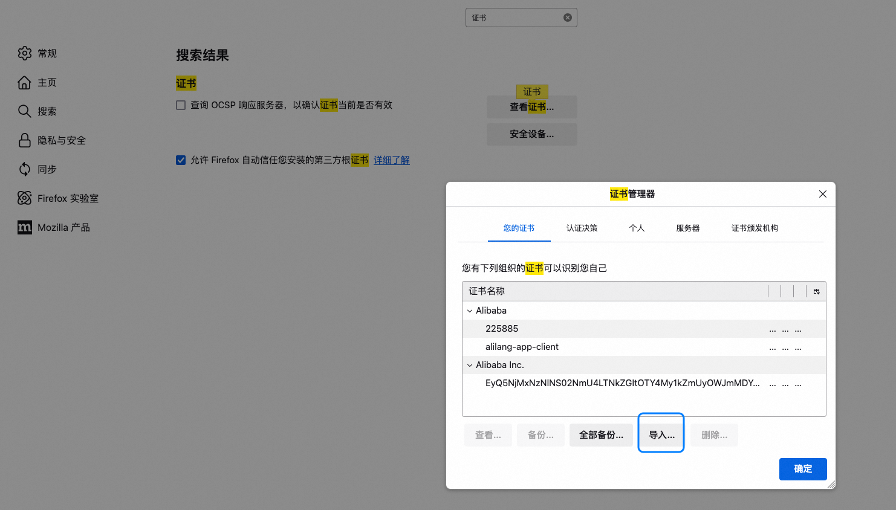

除了chrome，一般有些场景需要全局代理，之前用charles比较多，最近用`LightProxy`较多。 但是发现firefox代理的时候提示证书问题，表现就是访问浏览器时提示:  **网页不安全**

解决办法： 

1、是安装证书，除了本机安装外，还需要在浏览器导入证书 

2、禁用HSTS 
在 Firefox 地址栏输入 about:config，搜索 network.stricttransportsecurity.preloadlist，将其设置为 false。

---

LightProxy 是一个基于 Node.js 的轻量级代理工具，主要用于调试和拦截 HTTP/HTTPS 请求。它通过中间人攻击（Man-in-the-Middle, MITM）的方式来解密 HTTPS 流量，从而允许用户查看和修改加密的请求内容。然而，这种机制会导致证书问题，以下是详细的原因分析：

---

### 1. **HTTPS 工作原理与 MITM**
HTTPS 协议通过 SSL/TLS 加密来确保客户端与服务器之间的通信安全。在正常情况下，客户端会验证服务器提供的证书是否由受信任的证书颁发机构（CA）签发。如果证书无效或不受信任，浏览器或其他客户端会拒绝连接。

当 LightProxy 拦截 HTTPS 请求时，它会扮演中间人的角色：
- 它会生成一个伪造的证书，并用这个证书与客户端通信。
- 同时，它会用自己的方式与目标服务器建立真实的 HTTPS 连接。

为了使客户端信任伪造的证书，LightProxy 需要将自己的根证书安装到系统的受信任证书存储中。如果没有正确安装或配置根证书，客户端会认为证书不可信，从而导致证书错误。

---

### 2. **证书问题的具体原因**
以下是可能导致 LightProxy 出现证书问题的常见原因：

#### （1）**未安装 LightProxy 的根证书**
   - LightProxy 使用自签名的根证书来生成伪造的证书。如果用户没有将该根证书安装到操作系统或浏览器的信任列表中，客户端会拒绝接受伪造的证书。
   - 解决方法：按照 LightProxy 的文档说明，手动安装其根证书。

#### （2）**证书未被所有应用信任**
   - 在某些操作系统或应用程序中，即使根证书已安装到系统级别，某些应用（如 Chrome、Firefox 或某些移动应用）可能使用自己的证书存储，而不依赖系统级别的证书。
   - 解决方法：为这些应用单独配置信任 LightProxy 的根证书。

#### （3）**证书过期**
   - LightProxy 的根证书可能有有效期限制。如果证书过期，客户端会认为它是无效的。
   - 解决方法：重新生成或更新 LightProxy 的根证书。

#### （4）**域名不匹配**
   - LightProxy 动态生成的伪造证书需要与目标域名匹配。如果生成的证书域名与实际请求的域名不一致，客户端会报错。
   - 解决方法：确保 LightProxy 正确解析目标域名并生成匹配的证书。

#### （5）**HSTS 策略**
   - HSTS（HTTP Strict Transport Security）是一种安全策略，强制客户端只使用 HTTPS 连接，并且要求严格验证证书。如果目标网站启用了 HSTS，而 LightProxy 的证书不被信任，浏览器会直接拒绝连接。
   - 解决方法：在浏览器中禁用 HSTS（仅限测试环境，生产环境中不建议这样做）。

#### （6）**证书链不完整**
   - 如果 LightProxy 生成的伪造证书缺少完整的证书链（例如缺少中间证书），客户端可能会认为证书无效。
   - 解决方法：检查 LightProxy 的配置，确保生成的证书包含完整的证书链。

---

### 3. **如何解决证书问题**
根据上述原因，可以采取以下步骤解决问题：

#### （1）**安装 LightProxy 的根证书**
   - 下载 LightProxy 提供的根证书文件（通常是 `.crt` 格式）。
   - 将根证书安装到操作系统的受信任证书存储中。具体步骤因操作系统而异：
     - **Windows**: 双击证书文件，选择“安装证书”，将其添加到“受信任的根证书颁发机构”。
     - **macOS**: 打开“钥匙串访问”，导入证书并设置为“始终信任”。
     - **Linux**: 将证书复制到 `/usr/local/share/ca-certificates/`，然后运行 `update-ca-certificates`。
   - 对于浏览器（如 Chrome 和 Firefox），可能需要单独导入证书。

#### （2）**更新或重新生成根证书**
   - 如果根证书过期或损坏，可以在 LightProxy 的设置中重新生成一个新的根证书，并重新安装。

#### （3）**检查目标域名和证书匹配**
   - 确保 LightProxy 能正确解析目标域名，并生成与之匹配的伪造证书。

#### （4）**处理 HSTS 问题**
   - 如果目标网站启用了 HSTS，可以尝试在浏览器中清除 HSTS 设置，或者临时禁用 HSTS（仅限开发和测试环境）。

#### （5）**调试证书链**
   - 使用工具（如 OpenSSL 或浏览器开发者工具）检查证书链是否完整。如果发现问题，调整 LightProxy 的配置以确保生成完整的证书链。

---

当 Chrome 显示证书是安全的，而 Firefox 显示不安全时，这种现象通常与浏览器的证书管理机制和信任链配置有关。以下是可能的原因及解决方法：

### 1. **原因分析**

#### （1）**浏览器独立的证书存储**
   - Chrome 和 Firefox 使用不同的方式管理证书：
     - **Chrome**: 依赖操作系统的证书存储（例如 Windows 的证书管理器、macOS 的钥匙串等）。如果 LightProxy 的根证书已正确安装到系统级别，Chrome 会信任它。
     - **Firefox**: 使用自己的独立证书存储，不依赖系统级别的证书。即使根证书已安装到系统中，Firefox 仍需要单独导入和信任该证书。

#### （2）**证书未正确导入 Firefox**
   - 如果您只将 LightProxy 的根证书安装到系统级别，而没有将其导入到 Firefox 的证书存储中，Firefox 会认为证书不可信。

#### （3）**证书链问题**
   - 如果 LightProxy 生成的伪造证书缺少完整的证书链，Firefox 可能会拒绝信任它，而 Chrome 可能对证书链的要求相对宽松。

#### （4）**HSTS 策略**
   - 如果目标网站启用了 HSTS（HTTP Strict Transport Security），Firefox 对证书的信任要求更严格。如果证书无效或不受信任，Firefox 会直接显示“不安全”。

#### （5）**浏览器缓存**
   - 浏览器可能会缓存之前的证书验证结果。如果之前访问过该网站且证书被标记为不安全，Firefox 可能会继续显示错误。

---

### 2. **解决方法**

#### （1）**在 Firefox 中导入 LightProxy 的根证书**
   - 打开 Firefox，进入 `设置` > `隐私与安全` > `证书` > `查看证书`。
   - 在弹出的窗口中，切换到 `证书颁发机构` 标签页，点击 `导入`。
   - 选择 LightProxy 提供的根证书文件（通常是 `.crt` 或 `.pem` 格式），并勾选“信任此 CA 以标识网站”。
   - 完成后，重启 Firefox 并重新访问目标网站。

#### （2）**检查证书链完整性**
   - 使用在线工具（如 [SSL Labs](https://www.ssllabs.com/ssltest/)）或命令行工具（如 OpenSSL）检查 LightProxy 生成的伪造证书是否包含完整的证书链。
   - 如果证书链不完整，请调整 LightProxy 的配置，确保生成的证书包含所有必要的中间证书。

#### （3）**清除 Firefox 的 HSTS 缓存**
   - 如果目标网站启用了 HSTS，Firefox 可能会缓存之前的证书验证结果。可以尝试清除 HSTS 缓存：
     - 在 Firefox 地址栏输入 `about:config`，搜索 `network.stricttransportsecurity.preloadlist`，将其设置为 `false`。
     - 清除浏览器缓存并重启 Firefox。

#### （4）**清除浏览器缓存**
   - 清除 Firefox 的缓存和历史记录，以确保浏览器不会使用旧的证书验证结果：
     - 进入 `设置` > `隐私与安全` > `Cookies 和站点数据` > `清除数据`。
     - 勾选“缓存”并点击“清除”。

#### （5）**检查时间同步**
   - 确保系统时间和日期正确。如果系统时间与证书的有效期不匹配，Firefox 可能会认为证书无效。

#### （6）**更新 Firefox**
   - 确保您使用的是最新版本的 Firefox。旧版本可能存在证书验证相关的 Bug。
