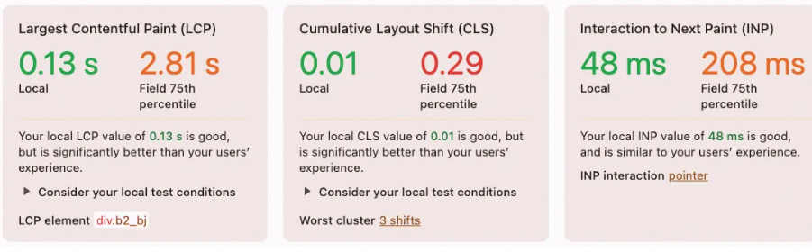
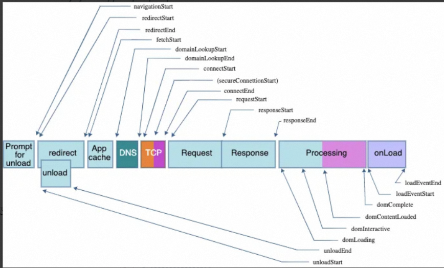
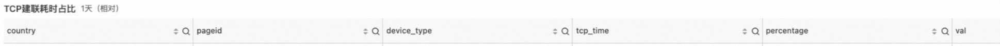
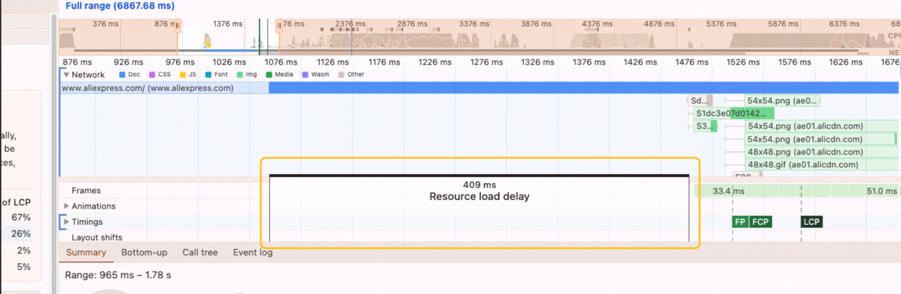
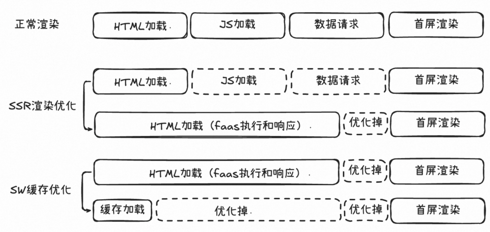
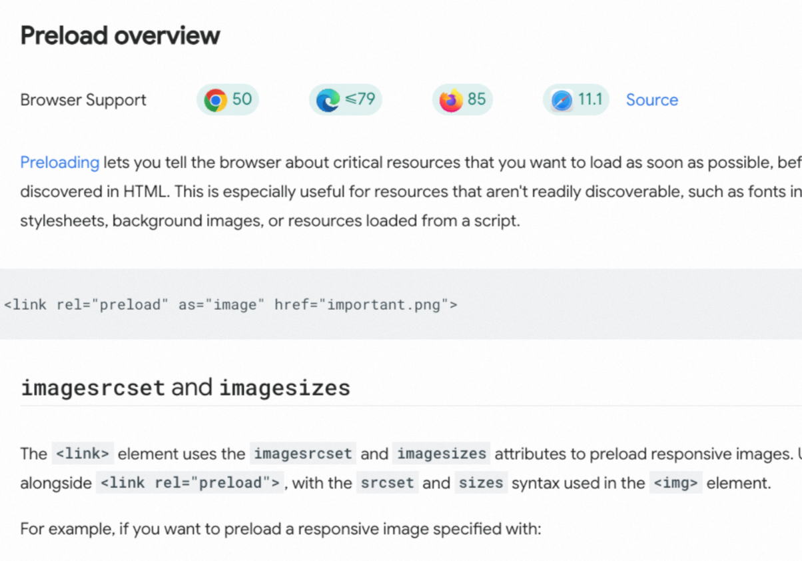
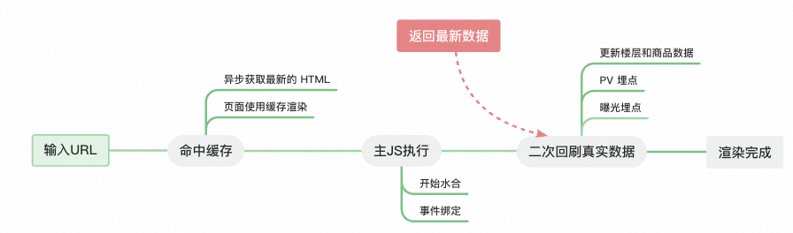
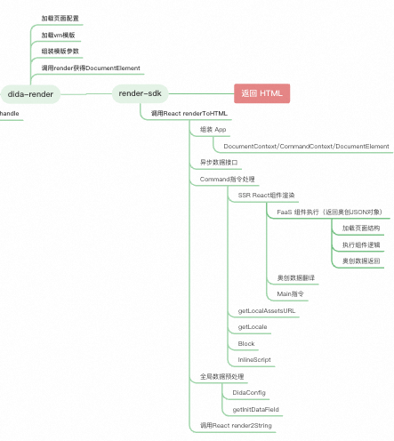

## **Why & 目标**
为什么要做性能优化？简单说是为了提升用户体验、减少用户流失、提高业务效益。特别是在国际化场景下用户环境差异大，包括网络环境，设备环境都不一样，所以做性能优化的ROI非常高。

具体关注什么指标？B端体系大都关注可交互，C端偏展示。谷歌浏览器 Performance 推荐的三个指标：LCP（Largest Contentful Paint）、CLS（Cumulative Layout Shift）、INP（Interaction to Next Paint）。


Peformance 三个指标

具体实操中，我们关注TTI 和 LCP， 当前水位是 TTI 1.3s， LCP 2.4s，目标是 TTI 1s 和 LCP 1.5s。


TTI 目前口径是核心标签 domNodeReady 后，减去fetchStart的耗时。也就是说排除了redirect重定向导致的fetchStart耗时，正常情况fetchStart 10ms 以内，如果发生了重定向会100ms+（排除重定向可能不太合理，因为实际用户访问首页有部分是通过三方跳转过来，也是正常流量）。


这里还有一个情况， 浏览器前进/后退缓存（Backward/Forward Cache，BF Cache），因为浏览器在前进后退过程中，会应用更强的缓存策略，表现为html/js/css等文件都是从本地/内存缓存直接读取。但是js仍然会执行也就是还是会上报 TTI， 但是 TTI 的值会明显小很多。

```javascript
if (domNodeReady()) {
  performance.mark('self-tti');
  performance.measure('tti', 'fetchStart', 'self-tti');
  var measures = performance.getEntriesByName('tti')[0];
}
```

LCP 是基于 chrome的web-vitals 包提供的数据上报。如果因为React 水合或者其他原因导致html结构发生变化，可能会二次上报 LCP。

```javascript
import { onLCP, onINP, onCLS, CLSMetric } from "web-vitals/attribution";

onLCP(val => {
  const customLog = ({
    type,
    c1,
    c2,
    c3,
    ...rest
  }: {
    type: string;
    c1: string | number;
    c2?: string;
    c3?: string;
    rest?: any;
  }) => {
    customSendEvent(type, { et: "OTHER", xpath: "", c1, c2, c3, ...rest });
  };
  customLog({
    type: 'LCP',
    c1: val
  })
})
```

## **How**
### **数据准备**
如何进行性能优化？ 为了进行分析、以及充足的数据验证，前置工作是进行必要埋点，然后进行报表搭建。我们的核心策略就是优化各个阶段的耗时，也就是统计端到端的数据，然后进行针对性分析和优化。

前端部分，浏览器端 Performance Timing API 提供了以毫秒 (ms) 为单位的只读时间，描述了页面加载过程中每个点的到达时间：



通过浏览器端的 perfomrance.getEntriesByType('navigation')[0] 可以获得每个节点的时间：
然后通过前端的 加载性能插件 统计各个阶段的耗时（为了和后端建立关系，需要上报trace_id）


以及进一步的下钻细分


国际化场景，前端数据报表的制作有2个注意点：

1 是需要排除中国 

2 排除大量的非正常爬虫流量


第二点是基于我们的数据分析发现318大促期间，美国站外流量占比80%以上，低版本浏览器版本比如chrome 107占比50%以上，并且访问时间分布均匀，没有登陆行为。所以需要排除这类异常User Agent的流量， 这样统计出来的样本数据具有可信度。并且这部分流量样本量大，LCP 5000 ms以上占比41%以上， 导致 LCP 数值异常的高。

服务端方面：服务端日志和前端日志需要通过trace_id进行串连，而不是孤立地看。 首先我们要看一下首页的架构现状。首页目前是FaaS的架构，采用SSR渲染。上游是aserver, ae-fn-gateway，dida 网关。AE首页请求加载经历的了下面几个阶段。

前面虚线框是浏览器或网络，然后请求打到 aserver AE的统一接入网关进行站点转发。所以服务端部分我们关注aserver rt，以及dida rt。


trace_id 串联前后端日志目前也有一些问题：

1、清洗的sql 过滤了重复trace_id，而在mobile 端 浏览器的前进后退操作会导致重复上报trace_id，这部分清洗会导致丢失样本量。

2、清洗的sql 过滤了 端到端耗时（responseEnd - fetchStart，不包括DNS建联，TCP耗时） < aserver rt，这个条件过滤也会导致过滤一部分样本量，比如service worker缓存情况下。

问题1的解法需要前端上报去掉前进后退的trace_id，这样trace_id去重时会保留正常的trace_id。

### **分阶段方向**
数据准备完成后，就可以进行对不同阶段的方向进行分析，以及采取不同的策略。

#### **重定向**
这一部分核心是治理不必要的302跳转。通过数据分析，站外这部分占比超50%，url参数axx_fcid=识别短链流量； 站内流量也有一部分302跳转。具体占比？

包括代码的链接以及投放的链接、以及服务端的重定向是否可以直接定位目标地址。

短链换长链根据用户国家和语言构建目标URL，而不是投放英语然后多次重定向。

unload事件耗时治理，减少redirect前置耗时

#### **浏览器缓存**
通过浏览器的 Performance 本地LCP分析，发现 html下载首字节时间耗时长。



因为首页走的SSR渲染，首屏渲染应该天然比正常CSR架构渲染更快。但是还不够。我们基于ServiceWorker做了浏览器端的HTML缓存，进一步优化了首屏渲染耗时。这个是目前 ROI 最高的策略。



Service Worker 缓存只是二段缓存， 有效降低用户二次访问耗时。从蚂蚁五福性能优化里面得到启发，SSR 的 HTML结构包含静态部分和动态部分，静态部分可以走Edge边缘节点一段缓存，进一步降低首次用户访问渲染耗时。这个方案还需要调研。


mobile 端，前进后退是否命中 bfcache 缓存。理论上 LCP 的值和 TTI 的值会比 PC 端更好。PC 端目前只有搜索返回首页，其他都是新开页面。


#### **网络部分**
升级H3协议，优化端侧部分网络准备阶段时间。

预加载： 核心图片资源 preload 预加载，目前预加载逻辑在 Faas 层处理，是静态配置的。不太合理，最好能做到动态化。

DNS： CDN专线动态加速，通过将域名cname到CDN供应商的边缘节点，来优化回源线路。 这一部分可以通过 CDN via 请求头进一步分析，一/二/三级 节点缓存命中情况，和线路选择情况。CDN有边缘节点、 区域中心节点（父节点）。 目前首页有部分域名启用了动态加速。

TCP预建联： preconnect/dns-prefetch 配置，以及是否有动态加速也正相关。aserver 层控制是否TCP关闭，超过40s不发送报文就会断联。

网络传输耗时： 公网 -> CDN -> Aserver， 这部分需要对比不同国家页面请求 TTFB 耗时区别。

#### **接入网关**
第一是：反向代理链路优化： 目前在 ae-fn-gateway 前面还有一层 java: ae-buyer-homepage-f 可以下线掉。

第二是：aserver -> mtop,  德国账号但是人在美国，aserver机房就是美国，但是会区域化路由到德国的mtop服务，会出现跨单元调用（游客不会出现跨机房调用，直接根据当前用户的地理位置路由），一旦出现跨单元耗时会增加2-3倍。一般跨单元调用是因为DNS解析规则和区域化路由没对齐，每个子域名都有自己的规则和线路。目前这部分占比15%（包括页面和接口），治理后还有4%。

#### **Dida 网关**
目前数据分析出来的结论是：均值70 - 80ms，75分位90、90分位100、95分位110-120。这部分耗时不是很合理，需要重点看长尾情况。

#### **FaaS 函数**
第一是：日志清理。现状是日志全量采集。日志虽然是异步的，但是会影响 Serveless 机器性能，目前会场频道那边测试出来降低日志采样率，可以提高faas函数的rt 40ms。

后端日志因为配置了接口调用量等监控，所以先保留。只对 研发日志做采样率调整。

第二是：渲染优化（含动态数据接口）。均值290ms，75分位350、90分位410、95分位460。这部分是否还有空间，需要专注长尾情况分析。

目前页面模版和SSR渲染，对文件资源，对diamond的读取、对数据都有内存级的缓存。模版加载的JS资源都是放到body结构的后面，CSS内联，确保首屏渲染链路不会被阻塞。

另外，首页目前是一个接口返回所有动态数据，如果要改造这一部分实现流式渲染，需要服务端配合一起改造。

#### **HTML体积**
第一是： SSR 渲染时把所有的CSS样式都内联到 head 标签里面。这样做的前提是 CSS 是渲染阻塞的，前置 CSS 的下载可以加速渲染。现状是 CSS 包体积过大，达到 300kb。


有几个原因，1 是首页的组件都是一次性打包，即便是有一些组件已经不再使用  2 首页代码和联盟首页是复用同一套代码 3 是 html 包含了页面所有动态数据。


所以，

1. 可以缩减打包组件，再通过优化CSS 构建后类名，进一步降低体积
2. 目前没有拆分仓库，因为联盟首页定制组件较少。
3. 对动态数据进行缩减，核心通过平台能力做字段映射 以及 通过 FaaS 胶水层做数据裁剪。 


1，2 是否可以根据动态下发自动combo的方式服务端打包，这个方式也是值得调研的。


第二是： tree shaking是否可行，进一步降低包大小。因为首页的组件已经做了裁剪了，效果不明显。

#### 渲染优化
#### 图片优化
图片目前没有预加载，通过预加载方式可以提高 LCP。目前是在 FaaS 层头部做预加载，都是静态的不是很合理，理论上应该有一个首屏预加载策略。 

+ [CSS background image](https://web.dev/articles/optimize-css-background-images-with-media-queries), but that image is preloaded using `<link rel="preload">` in the HTML markup (or using a `Link` header).



### **实际落地的策略**
| **方向** | **策略** | **是否落地** | **实际效果** |
| :--- | :--- | :--- | :--- |
| 重定向 | 治理无效重定向 | 是 | |
| 浏览器缓存 | Service Worker | 是 | 目前缓存命中率 23%<br/>TTI 1200 -> 870 <font style="color:#DF2A3F;">目标800</font><br/>LCP 2000 -> 1730  |
| | 边缘节点缓存 | 否 | |
| 网络部分 | 升级H3协议 | 否 | |
| | CDN动态加速 | 否 | 韩国动态加速回源优先选择父节点，提升200ms <br/>部分域名开启了动态加速 |
| 接入网关 | 反向代理链路优化 | 是 | |
| | 跨单元调用治理 | 是 | |
| Dida网关 | - | | |
| FaaS函数 | 采样率优化 | 是 | |
| | 渲染优化 | 否 | |
| | 流式渲染 | 否 | 预期收益： 首字节 500ms 左右<br/>(数据来源，对比Temu ) |
| HTML体积 | 打包组件治理 | 是 | 900kb -> 500kb |
| | CSS 类名缩减 | 是 | 300->200kb，减少100kb |
| | 动态数据裁剪 | 是 | 减少100kb |
| 前端渲染优化 | 水合问题 | 是 | 100ms LCP提升 |
| 图片优化<br/><br/><br/><br/> | cdn 图片宽高阶梯收敛，质量参数，缺少宽高限制 | 是 |  |
| | 离屏图片优化 | 否 |  |
| | cdn 线路回源分析，L1建连国家分析 | 否 |  |
| | avif 浓度提升 | 是 |  |
| | 预加载 | 是 |  |


端到端耗时：

| **端到端** | **口径** | **均值** | |
| --- | --- | --- | --- |
| | | **基准** | **目标** |
| 含跳转 | reponseEnd - navigationStart  | 1941ms |  |
| 不含跳转 | reponseEnd - fetchStart  | 1129ms |  |


## **Service Worker 策略**
这里重点介绍下sw方案，如何在SSR渲染和FaaS架构下落地，以及遇到的问题。

### 数据分析
在开始开发之前，查看 Serivice Worker 的开启占比 87% 左右。


预期缓存命中率40%左右，因为当天重复访问首页老用户（重复pv的uv/总uv)的占比大概就是40%左右。 然后我们需要建立漏斗分析缓存命中率： pv -> service worker安装用户 -> 命中sw 缓存用户 。 


未命中缓存有几种情况，也需要分别统计出来

1. 不符合前置条件
    1. 不支持cookieStore ：依赖这个特性去读取cookie
    2. 站点和域名不匹配： 一个标签页访问es.a.com，第二个标签页访问www.a.com会根据cookie的国家自动切到es.a.com（这种情况实际就是站点和域名不匹配），如果是直接指定ko.a.com不会302。
    3. 是联盟用户：如果是联盟用户，需要重定向到best.a.com
2. 302 跳转
    1. 正常切换语言

### 详细设计
#### SW 注册
Service Worker的注册必须保持域名和路径一致并且只能是根路径，也就是[https://www.a.com](https://www.a.com) 的页面必须注册成 [https://www.a.com/sw.js](https://www.a.com/sw.js) , 而不能注册成 [https://www.a.com/xx/sw.js](https://www.a.com/xx/sw.js)。所以我们的不同域名注册的是不同的， 会重新走Service Worker的生命周期：下载、解析和执行 -> 安装 -> 激活 -> clients.claim()


下载、解析和执行： 是通过`.register`方法调用触发的

安装：当开始执行worker代码（sw.js）时会触发且只触发一次。

激活：激活前如果已有worker，会进入waiting状态，触发手动触发skipWaiting方法；当激活后并不会立即控制页面，需要二次刷新时才会触发页面的控制，你可以手动通过clients.claim()立即触发对页面的控制。


基于此，sw.js 服务目前是注册在 服务端。可以通过nginx代理一个文件或者controller：

```javascript
@GetMapping(value = "/apps/sw.js")
public void swjs(HttpServletRequest request, HttpServletResponse response) {

    try {
        response.addHeader("service-worker-allowed", "/");
        response.setContentType("application/javascript");
        response.setCharacterEncoding("utf-8");
        PrintWriter writer = response.getWriter();
        writer.write(pwaConfig.getSwJsConfig());
        writer.flush();
    } catch (IOException e) {
        log.error("request swjs error: ", e);
    }
}
```

#### 缓存策略 & Key 设计
首先因为Service Worker是跟随域名的，需要隔离不同的业务域（比如详情、购物车、联盟等）。

所以整体命中缓存前置条件。

缓存的策略是： StaleWhileRevalidate 策略。也就是第一次访问命中缓存，后台会去拉最新的 HTML并更新缓存

缓存 key 设计：由 域名 + 路径 + 是否登陆 组成，为什么需要是否登陆？因为游客和已经登陆用户的动态数据会有比较大的差异点。第二个是切账号，如果是不同国家域名会发生变化。

缓存时间： 4小时。根据命中sw缓存的情况分析，用户回访基本在4小时内。


#### 命中缓存渲染阶段


+ 二次回刷会更新所有的楼层和商品数据，用户感觉就是数据的更新，体感还是不错的。
+ 曝光埋点需要在真实数据回来之后再发起
+ 命中缓存会不会对实验有影响？一般全局实验依赖最新接口数据。
+ 做好兼容：新数据 + 老UI； 老数据 + 新UI

### 风险控制
1. 监控
    1. Sevice Worker 前端报错监控、二次回刷超时监控
    2. 楼层渲染量监控
    3. 前端接口异常监控
    4. 后端接口监控
2. 回滚方案：
    1. 方案1: 通过开关，因为 HTML 虽然被缓存了但是会拉取最新的HTML，可以通过区块系统下发开关，当出现问题时，取消注册service worker js版本， 并强制刷新页面。
    2. 方案2: 重新发布一个新 service worker js版本覆盖旧版本，通过skipWaiting强制安装。不需要claim() 立即接管，因为我们只缓存了 HTML。
3. 降级方案

### 灰度方案
分国家，按流量大小分批进行灰度。

### 实际效果
优化过后，可以看到线上数据会有比较明显的变化：

TTI 指标数据变化：

| **是否命中缓存** | **平均值** | **75分位** | **90分位** |
| :--- | :--- | :--- | :--- |
| false | 1412.77 |1764.0| 2771.0 |
| true | 154.68 | 155.0| 282.0 |


RT 指标数据变化: 

| **是否命中缓存** | **均值** | **75分位** | **90分位** |
| :--- | :--- | :--- | :--- |
| false| 1297.96 | 3500.0 | 8784.0 |
| true | 31.05 | 189.0 | 469.0 |


LCP 也发生了明显变化，但是LCP影响因素颇多。比如 美国 因为爬虫导致 LCP 数据异常之高 （5000ms以上占比高、样本量大） 拉低整体水准。还有就是外投流量重定向、大图片加载的耗时多、 POP异步弹窗， 甚至异常水合导致结构变化也会导致LCP变大。

## 瘦包策略
### 字段裁剪
通过json path映射做后端字段裁剪

```javascript
{
  "data": "data",
  "data": {
      "countDown": "countDown",
      "products": "products[0:5]",
      "products": {
         "id":"id",
         "productImage": "productImage",
         "productTitle": "productTitle",
         "reviewStar": "reviewStar",
         "tradeCount":"tradeCount",
         "discount": "discount",
         "localizedMinPriceSavingPriceString": "localizedMinPriceSavingPriceString",
         "localizedMinPriceString": "localizedMinPriceString",
         "localizedOriMinPriceString": "localizedOriMinPriceString",
         "currentStock": "currentStock",
         "trace": "trace"
      }
  }
}
```

### CSS 类名缩减
```javascript
const path = require('path');
const incstr = require('incstr');
const createUniqueIdGenerator = () => {
  const index = {};
  const generateNextId = incstr.idGenerator({
    // Removed "d" letter to avoid accidental "ad" construct.
    // @see https://medium.com/@mbrevda/just-make-sure-ad-isnt-being-used-as-a-class-name-prefix-or-you-might-suffer-the-wrath-of-the-558d65502793
    alphabet: 'abcefghijklmnopqrstuvwxyz0123456789',
  });

  return (name) => {
    if (index[name]) {
      return index[name];
    }

    let nextId;

    do {
      // Class name cannot start with a number.
      nextId = generateNextId();
    } while (/^[0-9]/.test(nextId));

    index[name] = nextId

    return index[name];
  };
};
const uniqueIdGenerator = createUniqueIdGenerator();

module.exports = ({ context, onGetWebpackConfig }, { optCssClass  }) => {
  const optClassName = (config) => {
    if (optCssClass !== true) {
      return
    }
    ['scss-module','css-module'].forEach((rule) => {
      if (config.module.rules.get(rule)) {
        config.module
          .rule(rule)
          .use('css-loader')
          .tap((options) => {
            delete options.modules.localIdentName;
            return {
              ...options,
              modules: {
                ...options.modules,
                getLocalIdent: (context, localIdentName, localName) => {
                  // const componentName = context.resourcePath.split('/').slice(-2, -1)
                  const componentName = path
                    .relative(__dirname, context.resourcePath)
                    .split(path.sep)
                    .slice(0, -1)
                    .join('_');
                  return uniqueIdGenerator(componentName) + '_' + uniqueIdGenerator(localName);
                },
              },
            };
          });
      }
    });
  };
  onGetWebpackConfig((config) => {
    optClassName(config);
  });
  onGetWebpackConfig('ssr', (config) => {
    optClassName(config);
  });
};

```


## 渲染优化策略
目前FaaS层基本都是三级缓存（本地、内存、远端） ， 以及异步流程后台执行，不影响前台渲染，Copy-on-write 模式

什么是Copy-on-write模式： 简单说就是在多个用户或进程之间共享资源时，只有在某个用户或进程尝试修改该资源时才进行复制操作。

```javascript
import * as LRU from 'lru-cache';

class SimpleLocaleClient {
  private readonly requestServiceCache: LRU.Cache<string, Promise<any>>;

  constructor() {
    this.requestServiceCache = new LRU({ maxAge: 1000 * 60 * 2 }); // 设置缓存的最大存活时间
  }

  private async readLangData(app: string, field?: string, tags?: string[]): Promise<any> {
    // 模拟异步获取语言数据的过程
    return new Promise(resolve => setTimeout(() => resolve({ [app]: `Language Data for ${app}` }), 1000));
  }

  public readWithCache(app: string, field?: string, tags?: string[]): Promise<any> {
    const hashKey = `${app}-${field}-${tags}`;

    // 尝试从缓存中读取
    const cachedPromise = this.requestServiceCache.get(hashKey);
    if (cachedPromise) {
      return cachedPromise;
    }

    // 创建一个新的异步请求并将其放入缓存
    const promise = this.readLangData(app, field, tags);
    this.requestServiceCache.set(hashKey, promise);

    return promise;
  }
}

// 示例使用
const client = new SimpleLocaleClient();

client.readWithCache('en-US').then(data => console.log(data)); // 输出：{ "en-US": "Language Data for en-US" }
```


```javascript
{
    "site": {},
    "pages": [
        {
            "pathName": "index.html",
            // VM模版
            "template": "xx/a.html",
            "renderType": "react",
            "data": { // 奥创数据翻译的部分
                "title": "",
                "spmB": "",
                "basePath": "",
                "project": "",
                "assetsVersion": "0.0.84", // dida发布的资源版本
                "ossVersion": "21da3f70a1cca966f3ac3c63ff6ff451"
            }
        }
    ]
}
```
