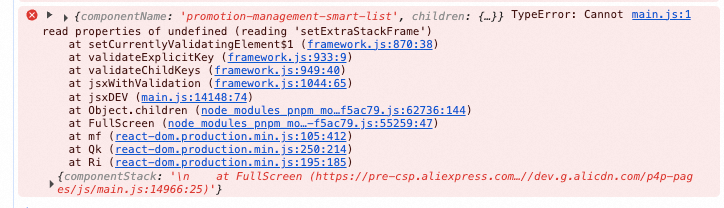

这种情况一般是有缓存使用了生产版本的React，而生产版本的React没有这些开发的API。

其他情况，比如“循环渲染 dom 没加 key”，“使用废弃的 API”，在碰到这类问题时 React 会尝试在控制台打 warning，但是预发的生产版本的 React 缺少了 warning 相关的 API，所以会直接报上述这个错。代理 React 的其中一个原因也是为了这些 warning 能够正确打出来。

git merge --no-ff 812c2dffa478aac54d39d9e41837b73c6b87a6ce gsts t