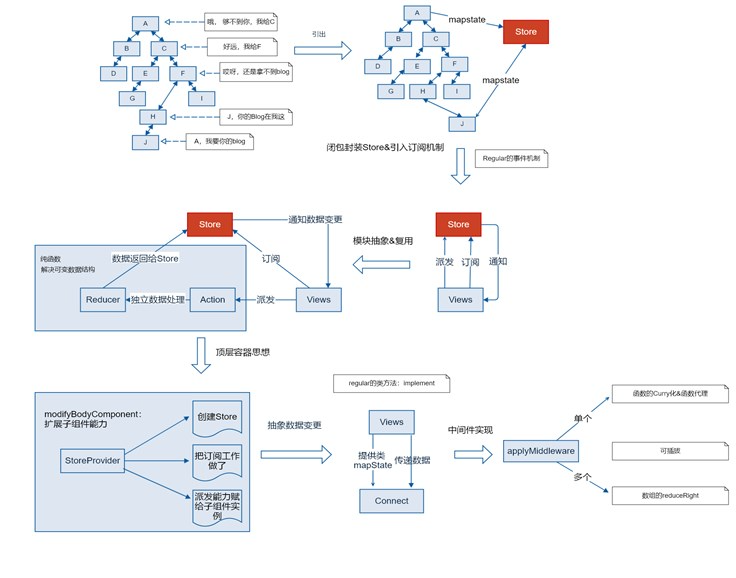

In React or other frameworks, the hierarchical structure of components can make data passing complex, even leading to "data passing black holes." Redux addresses this issue by introducing a global state management mechanism. Below are the core implementation principles of Redux and the step-by-step process of its incremental improvements.

## 1. Data Passing Issues

### Problem Description

The tree structure of components determines the flow of data, making it difficult to pass data between deep-level components and easily leading to the formation of a "data transfer black hole."

### Solution

Manage shared data centrally through a mediator (Store), allowing all components to retrieve or modify data via the Store.

## 2. Initial Implementation: A Simple Store

### Mediator Implementation

(function createStore() {

    var store;
return function() {
        if (!store) {
store = new Regular();
---
        return store;
};
())
### Component A Modifies Data
define(['./store.js'], function(createStore) {
```javascript

var A = Regular.extend({

        name: "Component A",
        data: {
title: 'Title'
},
        }
        getData: function() {
            this.data.title = createStore().data.title;
        setData: function() {
```
store.data.title = 'New Title';
            // Notify all other components
store.$emit('change', {
```javascript
                title: 'New Title'
});
});
    return A;
});
### Other Components Listen to Data
define(['./store.js'], function(store) {
    var B = Regular.extend({

},

name: "Component B",
init: function() {
            createStore().$on('change', function(newTitle) {
                this.data.title = newTitle;
            });
});
        }
    return B;
});
## 3. Improvement 1: Separate Data from Store
```
To prevent direct access and modification of `store.data`, we separate the data from the Store and retrieve it through interfaces.
(function createStore() {

    var store;

```javascript

return function() {

if (!store) {
            var store = new Regular();
            var state = {};
store.getState = function() { return state; };
store.subscribe = function(listener) { store.$on('change', listener); };
            store.dispatch = function(action) {
        }
                if (action.type == 'changeTitle') {
state.title = action.data.title;
}
```
                store.$emit('change', state);
---
            };
        return store;
};
})();
## 4. Improvement 2: Introducing Reducer
```javascript
Extract the data processing logic from the Store and use a Reducer to manage state updates.

(function createStore(reducer, initState) {

    var store;

    return function() {

if (!store) {
var store = new Regular();
            var state = initState;
            store.getState = function() { return state; };
store.subscribe = function(listener) { store.$on('change', listener); };
store.dispatch = function(action) {
                state = reducer(state, action);
                store.$emit('change', state);
        return store;
};
}
())
Example of Reducer:
function reducer1(state, action) {
```
switch (action.type) {
---
case 'CHANGE_TITLE':

return Object.assign({}, state, { title: action.data.title });

Default:
return state;
## 5. Improvement 3: Top-level Container and Component Extension
```javascript
To make it more convenient for components to use the Store, we created a top-level container `StoreProvider` and extended the capabilities of components.
const App = Regular.extend({
name: 'App',
    template: `
<StoreProvider store={store}>
            <A />

<B />

        </StoreProvider>

`,

    config(data) {
data.store = createStore(reducers, { title: "Title" });
};
        }
});
var StoreProvider = Regular.extend({
    template: '{#include this.$body}'
```
config: function(data) {
    this.store = data.store;
    modifyBodyComponent: function(component) {
```javascript
        component.dispatch = this.store.dispatch.bind(this.store);

this.store.subscribe(function() {
            var state = this.store.getState();
            component.mapState(state);
        }.bind(this));
});
    }
}
```
## 6. Improvement 4: Connect Function
---
To avoid each component needing to manually implement the `mapState` method, we extracted a `connect` function.
function connect(config, Component) {
Component.implement({
        mapState: function(state) {

            const mappedData = config.mapState.call(this, state);

```javascript

            mappedData && Object.assign(this.data, mappedData);

})

});
connect({
mapState: function(state) {
            title: state.title
};
}, B);
## 7. Middleware Implementation
Middleware is used to insert additional logic in the `dispatch` method, such as logging.
### Initial Implementation

    }
function applyMiddleware(middleware) {
    let store = createStore(reducer1, initState);
    let dispatch = function(action) {
middleware(store.dispatch, action);
return Object.assign({}, store, { dispatch: dispatch });
### Improvement 1: Support for Multiple Middleware
    },

function applyMiddlewares(...middlewares) {

let store = createStore(reducer1, initState);

let dispatch = middlewares.reduceRight((dispatch, middleware) => {

        return middleware(dispatch);

    }, store.dispatch);
return Object.assign({}, store, { dispatch: dispatch });
}
### Middleware Example
```
function logger(next) {
---
    return function(action) {
console.log("before dispatch");

        next(action);

console.log("after dispatch");
    };
```javascript

## 8. Action Creator
Action Creator is an abstraction of the `dispatch` parameter, facilitating reuse.
const CHANGE_TITLE = 'CHANGE_TITLE';
function changeTitle(newTitle) {
type: CHANGE_TITLE,
}
data: { title: newTitle }

}

    };
this.$dispatch(changeTitle('New Title'));
## Summary
        return {
Through the above steps, we have implemented the core functionality of Redux, including:
1. **Store**: Centralized management of application state.
}
2. **Reducer**: A pure function responsible for state updates.
```

3. **Connect**: Simplify the connection between components and the Store.

---

4. **Middleware**: Enhance `dispatch` functionality.

5. **Action Creator**: Abstract Actions, improving code reusability.


```javascript
};
}
```
```javascript
```

}
```

```javascript

}

```

---
```javascript
return {
}
```

---
