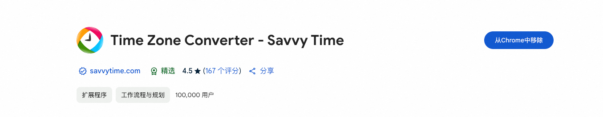

## **1. Basic Time Difference**
- **Standard Time (Winter Time)**:
  - US West Coast Time (PST, UTC-8) and Beijing Time (CST, UTC+8) have a difference of **16 hours**.
  - US West Coast Time is **16 hours behind** Beijing Time.
- **Daylight Saving Time (April - October)**:
  - US West Coast Time is adjusted to UTC-7, and the time difference with Beijing Time is **15 hours**.
  - US West Coast Time is **15 hours behind** Beijing Time.
---
## **2. Example Calculation**
### **Winter Time**
- If it is **2:50 PM** on the US West Coast, the time in Beijing is **6:50 AM the next day**.
### **Daylight Saving Time**
- If it is **2:50 PM** on the US West Coast, the time in Beijing is **5:50 AM the next day**.
---
## **3. Time Zone Explanation**
- **Beijing Time**:
  - Beijing Time is in the UTC+8 time zone, which is **8 hours ahead** of Greenwich Mean Time.
- **US West Coast Time**:
  - US West Coast Time (e.g., Seattle) is typically in the UTC-8 time zone, which is **8 hours behind** Greenwich Mean Time.
  - During Daylight Saving Time, it is adjusted to UTC-7.
---
## Chrome Extension

