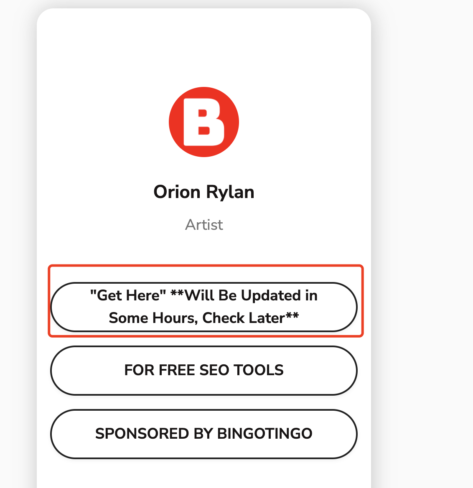

## Canva Free Membership

Canva is a very powerful tool, it can efficiently create video thumbnails and may also increase click-through rates. In this video, I'll introduce 3 ways to get Canva Pro membership for free, 2 ways to get others for free, and one way to create your own, or even get others to create for you. I strongly recommend everyone to try it out!

https://bingotingo.com/best-social-media-platforms/

If this appears, please wait.

Possible links:
https://mfatools.net/

> Source: https://www.youtube.com/watch?v=J0dyAnGWoYQ&t=621s

## Blog Management

### **DNSPod Domain Name Resolution Management**

- [DNSPod Domain Name Resolution List](https://console.dnspod.cn/dns/list)

### **Tencent Cloud CDN Management**

- [Tencent Cloud CDN Console](https://console.cloud.tencent.com/cdn)

### **Tencent Cloud SSL Certificate Deployment**

- [SSL Certificate Deployment Page](https://console.cloud.tencent.com/ssl/dsc/deploy?id=2wNhkHpV&uin=100009416799&ownerUin=100009416799)

---

## **Google Search Console**

- [Google Search Console - maoxunxing.com](https://search.google.com/search-console?resource_id=sc-domain%3Amaoxunxing.com)

## SMS Platform

https://sms-activate.org/cn

## Tunnel

Lightning 

Tree holeshu-dong

rabbitpro
quickq
wisevpn
## Apple ID for US region
This article is based on the key steps from [Zhihu article](https://zhuanlan.zhihu.com/p/367821925), organizing a detailed process on how to set up a US Apple ID on an iPhone and complete payment methods.

### 1. Change Device Language and Region

1. Open **iPhone Settings**.

2. Go to **General > Language & Region**.
---
- Change the device language and region to **English (US)** (United States).
3. Switch the account for media and purchase items:
   - Click **Apple Menu > System Settings**.
   - Find and click **[Your Name]** at the top of the sidebar (if you don't see your name, tap "Sign in with your Apple ID").
- Log in with your newly registered **US Apple ID**.
---

### 2. Change Apple ID Language and Region
1. Open the [Apple ID management page](https://appleid.apple.com/account/manage/section/information).
2. Log in with your newly registered **US Apple ID**.
3. In **Personal Information**:
   - Change **Language** and **Region** to **English (United States)** (United States).

### 3. Configure Payment Method
1. Open **App Store**, and log in with your newly registered **U.S. Apple ID**.
2. Download any paid software (such as in-app purchases for free trials).
3. When the system prompts to select a payment method:
   - The page will display **Credit Card** or **PayPal**, ignore these options.
   - Directly fill in other necessary information (such as billing address, etc.), refer to the following tutorial for details:
- **Billing Address**: You can use a virtual address generator (such as [FakerAddress](https://www.fakeraddress.com/)) to generate a U.S. address.
     - **Phone Number**: Ensure you enter the same number as used during Apple ID registration.

## References
- Original Link: [Zhihu Article](https://zhuanlan.zhihu.com/p/367821925)
- Apple ID management page: [Apple ID Management](https://appleid.apple.com/account/manage/section/information)