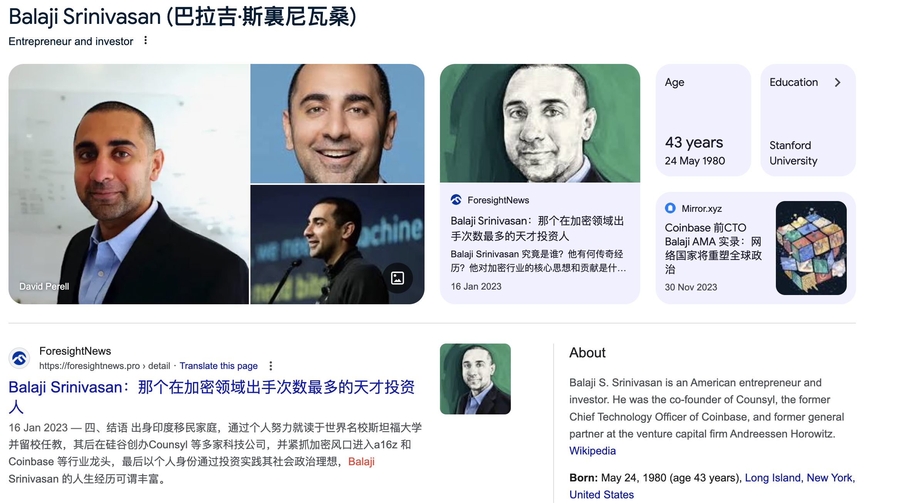

最近读了一本书，《The Anthology of Balaji》 翻译过来是：Balaji文集。

{{}}

Balaji是谁呢？Google一下给出这样的结果：巴拉吉-斯里尼瓦桑（Balaji S. Srinivasan）是美国企业家和投资家。他是 Counsyl 的联合创始人、Coinbase 的前首席技术官和风险投资公司 Andreessen Horowitz 的前普通合伙人。

{{}}

看完这这书后，发现他是一名狂热的技术信仰者。这本书能让我们看到这些优秀的杰出企业家、投资人的大脑是如何运作的，企业创建、投资、个人认知、管理等等很多东西都有讨论，看完后我是收获满满，然后又推荐了很多历史、技术等一堆书，反正我等不及下载阅读了。

## 部分价值片段摘录

- 精通软件将不断获得复利回报
- 人生三件事： 你的真理、健康和财富
- 创作者也有价值： 您的文章或影片激励他人创办了一家伟大的公司，解决了一个社会问题（例如，利用核聚变能源解决气候变化问题），作为媒体创作者，您将获得现金或股权分成。
- 没明白底层逻辑是什么，所以没有行动
- 如果作为作者，你能为读者带来价值，那么你就能赚到价值的一小部分。
- Twitter 是去中心化媒体的第一版，而 Substack 则是第二版。
- 也许我们会看到 "全栈作家 "从写文章变成自己制作电影，就像全栈工程师，从写程序到做产品
- 个人时代充分发挥创意： 伟大的记者可能会成为百万富翁，甚至亿万富翁。不要选择电影，自己在电脑上制作，就像诺奇制作《威廉与魔兽》一样，然后直接出售。
- 优秀的作家和艺术家应该得到奖励。我们只需要改变激励机制。
- 财富是可以创造的：很多人不明白财富是可以创造的。我给他们举的第一个反例是：史蒂夫-乔布斯从谁那里偷走了所有的 iPhone？如果财富是一场零和游戏，一个人的收益就是别人的损失，那么这些手机又是从哪里来的呢？这个简单的例子说明财富是可以创造的。
- 你可以在电脑上编写一个软件，然后建立一个网站，人们会为你的软件付钱。你究竟在那里做什么？在没有自然资源的情况下，仅仅通过敲击键盘，你就创造出了令人愉悦的电子产物。
- 金钱看似是局部的零和（交易发生后，A 有-1 美元，B 有+1 美元），但实际上金钱是全局的正和。在自愿交换中，甲乙双方都获得了财富，因为他们都从交易中获得了非货币利益。
- 通常，原材料的价值远不及组装过程的价值：将原材料组装在一起所需的技术诀窍、机器和精力。
- 你需要的钱越少，你的依赖性就越小。
- 时间能换来时间，而时间是最终有价值的东西：我花钱是为了能更努力地工作。这听起来很滑稽，但却是事实。因此，你每工作一年，就会积累一到两年的休息时间（金钱换时间）。这些休息时间可以用来开公司。这就像天使投资自己。这是你实现财务独立的另一种方式。
- 经济独立也是个人和意识形态的独立。如果你经济独立，人群就不能在经济上取消你
- 如果你厚颜无耻，你的水平就会提高
- 以下是我对领导人类型的排序：社会主义者 < 民族主义者 < 资本主义者 < 技术主义者。
- 如何获得地位： 要想获得地位，最难的办法就是有所建树，有所成就，有所增值。获得地位的困难途径是建立一些东西，实现一些东西，增加价值。获得地位的简单方法是指责别人是坏人。这是获得地位的捷径，也是获得相对地位的捷径。你对现有制度的批评可能是正确的。但你需要的是产品，而不仅仅是批评。
- 产品只要有效就有人购买： 不要争论监管问题。打造 Uber。不要争论货币政策。打造比特币。不要争论任何东西，只需建立一个替代品。不要用语言争论。建立在许多人无法理解的真理基础上的产品。如果有效，他们就会买。他们的不理解就是你的护城河。
- 初创企业的意义就在于打造你买不到的东西。
- 在实践中而非理论上可行
- 只有当你真正制造出产品后，你才能研究一些概念。
- 亿万富翁之所以存在，是因为他们会编程。亿万富翁之所以存在，是因为他们会编写应用程序。比尔-盖茨编写了微软的第一个 BASIC 解释器。拉里-佩奇（Larry Page）和谢尔盖-布林（Sergey Brin）创建了第一版谷歌。马克-扎克伯格创建了第一版 Facebook。杰克-多西（Jack Dorsey）创建了 Twitter 的第一版。德鲁-休斯顿（Drew Houston）创建了 Dropbox 的第一版。加勒特-坎普创建了 Uber 的第一版。鲍比-墨菲创建了 Snapchat 的第一版。
- 创业就是竞技：在尝试创建一些东西时，许多原本可能是尖刻的批评家、高高在上的学者或颐指气使的官僚的人突然了解到，要成为竞技场上的一员，创建、管理员工和实现盈利是多么困难。
- 3D打印怎么将数字化和实体化结合在一起：考虑一下开源、3D 打印、应用商店和众筹。只要做出人们想要的东西，不愁没有市场。
- 只要做出人们想要的东西 不愁卖。
- 要想影响世界，要不开始创造要么投入资金： 要想影响科技的发展方向，就拿起键盘或投入资金。你可以创造一些东西。那些不会建造的人只会说教。全世界数十亿人越来越多地使用键盘。他们对布道与建设的相对效用不抱幻想。
- 创始人都是有信誉的人，因为他们可以为来长期收益而付出巨大的短期代价： 创始人通常是唯一有信誉的人，他可以为了更大的长期收益而付出巨大的短期代价。

## perplexity.ai 总结

技术的价值：
本书强调了技术进步在历史上的巨大价值和重要性。技术是推动我们不断改善生活、降低价格、塑造政治和经济体系的动力。随着技术的进步，我们可以事半功倍，从而腾出时间和资源。作者认为，由于计算机等强大技术的快速发展，我们应该处于 "生产力的黄金时代"。然而，人们往往低估了我们每天使用的简单界面和工具背后令人难以置信的复杂性。

技术的影响​：
技术对世界产生了深远的影响。它将集中式系统和机构转变为分散式分布网络。区块链技术和加密货币的兴起就是这种转变的例证，它们代表了数字价值和调整的新领域。展望未来，本书讨论了自动化将如何带来富足，以及生命延续和超人类主义等新兴技术将如何从根本上改善人类状况。

真理的类型：
本书探讨了不同形式的真理--科学真理、技术真理、政治真理、经济真理和密码真理。该书认为，现代媒体往往与对真相的追求背道而驰，其驱动力更多的是叙事和议程，而非事实。作者建议通过去中心化的媒体模式、公民新闻以及将事实与叙述分开，来建立一个 "更好的真相机器"。

建设更美好的未来：
本书的一个核心主题是，必须采取富足的心态，并采取行动创造自己希望看到的未来。作者鼓励读者专注于建设，而不是争论。他为创建和发展成功的公司和项目提供了一个详细的框架，涵盖研究、构思、验证、工程、启动、招聘、管理等方面。书中鼓励读者培养广泛适用的技能，学会多角度思考问题，并努力建设自己向往的世界。

巴拉吉的愿景：
本书的基础是巴拉吉-斯里尼瓦桑将技术视为重塑世界的前沿。巴拉基认为，互联网和新兴技术正在创造一个全球性的 "技术阶级"--他们的定义不是财富或遗产，而是他们创造价值和建立新机构的能力。巴拉基相信，这些新机构将不仅仅是公司和货币，最终将包括新的城市甚至新的国家。巴拉吉认为，这些新机构将不仅仅是公司和货币，最终还将包括新的城市，甚至新的国家。他认为，技术有可能创造出 "网络国家"--能够与传统民族国家竞争的数字原生社区技术的价值