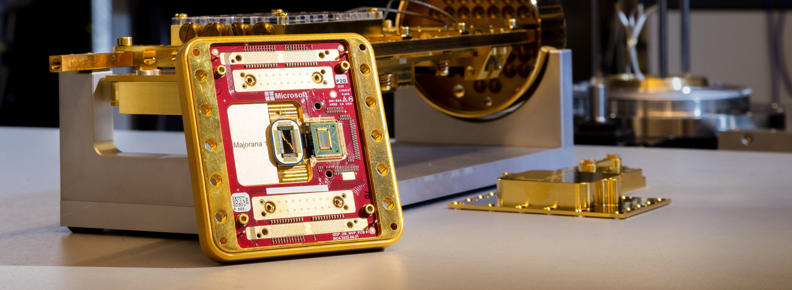

微软接连放大招：Xbox推出Muse模型革新游戏创作，Azure AI Foundry Labs加速研究落地，Majorana 1量子芯片更让百万量子比特计算成为可能。另外一个值得关注的是：Arc Institute和NVIDIA的Evo 2生物模型则开启基因组设计新纪元。

Developer领域，Hugging Face普及超大规模LLM训练，Anthropic分享代理开发经验，Claude 4性能备受期待。

---

+ **Xbox推出Muse模型，用AI革新游戏创作与体验。**  
Xbox Wire主编Joe Skrebels宣布，微软研究团队与Ninja Theory合作开发了首个生成式AI模型Muse，可理解3D游戏世界并生成一致的玩法。Xbox计划利用Muse优化经典游戏、支持跨设备运行，并探索玩家参与创作的新方式，同时坚持负责任的AI原则，赋能开发者并提升玩家体验。[消息来源](https://news.xbox.com/en-us/2025/02/19/muse-ai-xbox-empowering-creators-and-players/)

+ **微软发布全球首个拓扑量子芯片Majorana 1，开启量子计算新纪元。**  
微软技术研究员Chetan Nayak带领团队研发出基于拓扑导体的量子芯片，首次实现对马约拉纳粒子的观测与控制，为百万量子比特计算铺平道路。其稳定性和数字化控制突破传统限制，未来可解决工业级难题，如分解微塑料或设计自修复材料。[消息来源](https://news.microsoft.com/source/features/ai/microsofts-majorana-1-chip-carves-new-path-for-quantum-computing/)

+ **微软推出Azure AI Foundry Labs，加速AI研究到应用的转化。**  
微软高管Asha Sharma和研究员Ashley Llorens宣布，Azure AI Foundry Labs将汇聚前沿模型与框架，如世界首例WHAM模型Muse等，助力开发者快速实验、反馈并推动技术落地，缩短从研究到产品的时间差。 [消息来源](https://azure.microsoft.com/en-us/blog/introducing-azure-ai-foundry-labs-a-hub-for-the-latest-ai-research-and-experiments-at-microsoft/)

+ **Hugging Face发布《Ultra-Scale Playbook》，本指南将大规模普及有关 LLM 培训的知识**。无论您是从 1 个 GPU 开始，还是协调数千个 GPU，本指南都将一步步引导您完成整个旅程。该手册详细介绍了如何使用5D并行、ZeRO优化器、快速内核、计算/通信重叠等技术训练DeepSeek-V3模型。它还提供了理论基础、交互式图表、4000多次扩展实验和音频资料。 [消息来源](https://x.com/lvwerra/status/1892272996607283230) [指南地址](https://huggingface.co/spaces/nanotron/ultrascale-playbook)

+ **台湾七大AI服务器制造商计划在美投资数十亿美元**。为应对特朗普政府的关税政策，包括富士康、广达、英业达、和硕、纬创、仁宝和威盛在内的七家台湾顶级AI服务器制造商计划在5月10日前宣布对美投资计划。这些公司近期访问了德克萨斯州，评估在当地投资的可能性。预计土地购置和建厂成本可能高达20亿美元，而单个服务器组装厂的投资可能在30亿至50亿美元之间。[消息来源](https://www.worldjournal.com/wj/story/121208/8557132?zh-cn)

+ **Anthropic团队分享了构建大型语言模型（LLM）代理的经验**，指出成功的实现并非依赖复杂框架，而是简单的、可组合的模式。文章介绍了从简单增强型LLM到复杂自主代理的多种模式，并强调在需要时才增加复杂性。[文章地址](https://www.anthropic.com/research/building-effective-agents)

+ **Claude 4即将发布，性能有望大幅超越现有模型**。根据内部消息，Claude 4将融合通用模型和推理模型，可根据任务复杂度动态调整算力和功能。此外，用户还能通过游标刻度尺控制每个问题的推理成本，实现更精准的成本管理。[消息来源](https://x.com/IntuitMachine/status/1890891155232989214)

+ **Arc Institute和NVIDIA推出Evo 2，有史以来最大的（通过训练计算）生物 ML 模型，也是任何类别中有史以来最大的开源 ML 模型之一**。这是一个能够设计整个基因组的AI模型，Evo 2基于400亿参数，训练了来自12.8万种生物的9.3万亿核苷酸数据，能够快速预测致病突变，并生成酵母染色体或小型细菌基因组级别的新DNA序列。[消息来源](https://x.com/NikoMcCarty/status/1892244590532649382) [在线尝试](https://arcinstitute.org/tools/evo/evo-designer)

+ **Unusual Whales发布2024年国会股票交易报告，分析了国会议员的股票投资表现**。报告显示，国会议员在2024年平均跑赢了标普500指数，民主党议员的投资组合增长了31%，而共和党议员增长了26%。报告指出，议员们主要投资于大型科技公司，这推动了其投资收益。 [消息来源](https://x.com/unusual_whales/status/1876668287398068464) [报告地址](https://unusualwhales.com/congress-trading-report-2024#google_vignette)

+ **SpaceX成功发射猎鹰9号火箭，将23颗星链卫星送入轨道**。此次发射于2月19日从佛罗里达州卡纳维拉尔角太空军基地进行，标志着SpaceX首次完成跨国火箭回收。火箭一级在发射后8分钟成功降落在巴哈马海岸外的回收船上，这是SpaceX与巴哈马签署协议后的首次尝试，旨在提升发射灵活性和火箭性能。此次发射是猎鹰9号2025年的第21次任务，该火箭的重复使用次数达到了16次。[消息来源](https://x.com/SpaceX/status/1891986937839484977)

+ **清华大学、上海期智研究院和加州大学洛杉矶分校的研究团队提出Tensor Product Attention（TPA）**，这是一种新型注意力机制，通过张量分解大幅缩减KV缓存规模，提升内存效率。TPA兼容RoPE，支持长序列处理，优于MHA、GQA和MLA。基于TPA的T6模型在语言建模任务中表现卓越，显著降低KV缓存需求。[消息来源](https://x.com/QuanquanGu/status/1880017915531128872)

...

全球股票市场格局生变，美国股市“例外论”受挑战：2025年，华尔街曾普遍预期美国股市将继续“一枝独秀”，但如今这一观点正迅速动摇。根据美国银行2月基金经理调查，34%的基金经理认为全球股票将超越美国股市，而美国股票的支持率从1月的27%降至18%。德意志银行数据显示，欧洲股市资金流入量上周达到两年高位，欧洲STXE 600指数今年已上涨超10%，远超标普500指数的4%涨幅。美国银行策略师Michael Hartnett认为，这表明投资者对美国股市的信心已达到峰值。

在 2 月份的美国银行基金经理调查中，34% 的基金经理表示，全球股票今年将引领资产类别，其次是 22% 的股票上市黄金。与此同时，美国股市跌至第三位，18% 的受访者表示该资产类别今年将再次领跑。1 月份，27% 的受访者选择美国股市领涨。

一些投资者指出，美国股票的市盈率（P/E）普遍高于欧洲、巴西、中国等市场，例如巴西石油公司PBR市盈率仅6.1，而雪佛龙为16。此外，交易外国股票的高成本和税收限制了散户参与，但低费用的ETF可部分解决这一问题。部分投资者认为，国际市场增长和稳定性更强，且政治风险较低，建议关注中国、印度等新兴市场。  

[消息来源](https://www.reddit.com/r/stocks/comments/1it83i4/investors_arent_just_buying_us_stocks_anymore/)

