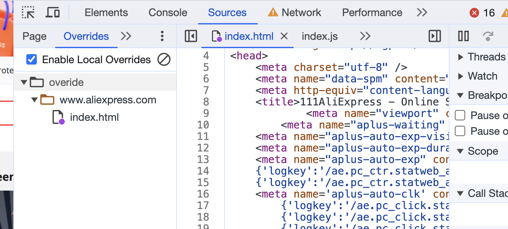
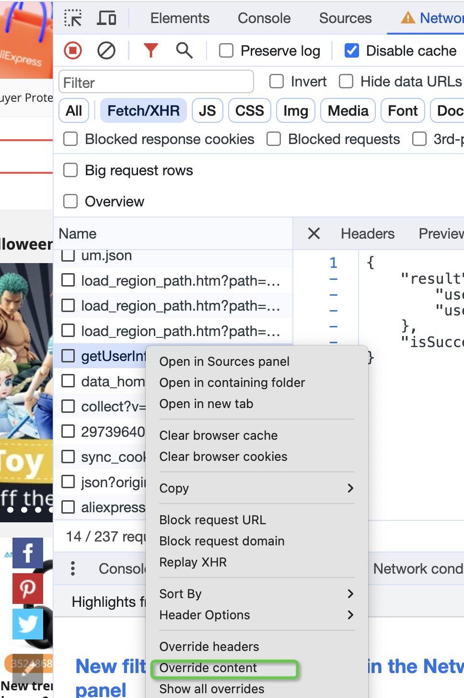

## 目录
1. [概述](#概述)
2. [覆盖内容（Override Content）](#覆盖内容override-content)
   - [覆盖HTML、JS、CSS等内容](#覆盖htmljscss等内容)
   - [覆盖XHR请求](#覆盖xhr请求)
3. [禁用Chrome插件的请求](#禁用chrome插件的请求)
4. [控制台打印引用对象的问题](#控制台打印引用对象的问题)
5. [总结](#总结)

---

## 概述

在最新的Chrome DevTools更新中，新增了一些强大的功能，极大地提升了开发者调试和优化Web应用的能力。本文将详细介绍以下新特性：
- **覆盖内容（Override Content）**：无需代理即可重写网络请求的返回内容。
- **禁用Chrome插件的请求**：避免插件干扰开发环境。
- **控制台打印引用对象的行为**：探讨控制台打印引用对象时的注意事项。

更多详情可参考官方文档：[New in DevTools 117](https://developer.chrome.com/blog/new-in-devtools-117/?utm_source=devtools#network)

---

## 覆盖内容（Override Content）

### 覆盖HTML、JS、CSS等内容

以前，如果需要修改网络请求的返回内容（如HTML、JS、CSS等），通常需要借助代理工具（如Charles或Fiddler）。现在，Chrome DevTools内置了这一功能，可以直接在浏览器中实现内容覆盖。

**主要特点：**
- 支持对HTML、JS、CSS等文件的内容进行实时修改。
- 修改后的内容会立即生效，无需刷新页面。
- 非常适合调试和快速验证代码更改。

**操作步骤：**
1. 打开Chrome DevTools（快捷键：`F12` 或 `Ctrl+Shift+I`）。
2. 切换到 **Network** 面板。
3. 右键点击目标请求，选择 **Override content**。
4. 在弹出的编辑器中修改内容并保存。

  
（注：请替换为实际图片链接）

---

### 覆盖XHR请求

除了静态资源，还可以覆盖XHR（XMLHttpRequest）请求的返回数据。这对于模拟API响应或测试特定场景非常有用。

**主要特点：**
- 支持修改XHR请求的返回数据（如JSON格式的API响应）。
- 可以模拟不同的响应状态码（如200、404、500等）。
- 方便测试前端对不同API响应的处理逻辑。

**操作步骤：**
1. 打开Chrome DevTools。
2. 切换到 **Network** 面板。
3. 找到目标XHR请求，右键选择 **Override content**。
4. 修改返回数据并保存。




---

## 禁用Chrome插件的请求

Chrome插件有时会在后台发起额外的网络请求，这可能会干扰开发环境或导致不必要的性能开销。现在，Chrome DevTools提供了一种简单的方法来禁用这些请求。


**操作步骤：**
1. 打开Chrome DevTools。
2. 切换到 **Network** 面板。
3. 点击面板顶部的 **"Block requests from extensions"** 按钮（图标类似于一个插件）。
4. 此时，所有来自Chrome插件的请求都会被屏蔽。


---

## 控制台打印引用对象的问题

在Chrome控制台中，如果打印的是一个引用对象（如数组或对象），控制台显示的是该对象的最终状态，而不是打印时的状态。这可能会导致调试时的困惑。

**问题描述：**
- 当你执行 `console.log(obj)` 时，控制台不会立即记录对象的当前值，而是记录对象的引用。
- 如果对象的值在后续代码中发生了变化，控制台显示的将是最终的值，而非打印时的值。

**解决方案：**
- 使用 `JSON.stringify` 将对象序列化为字符串后再打印：
  ```javascript
  console.log(JSON.stringify(obj));
  ```
- 或者使用 `console.dir` 来查看对象的详细信息：
  ```javascript
  console.dir(obj);
  ```

---

## 总结

Chrome DevTools 的新功能为开发者提供了更强大的调试能力：
1. **覆盖内容** 功能使得修改网络请求的返回内容变得更加便捷，无需依赖第三方代理工具。
2. **禁用Chrome插件的请求** 可以有效避免插件对开发环境的干扰。
3. **控制台打印引用对象的行为** 是一个需要注意的细节，合理使用 `JSON.stringify` 或 `console.dir` 可以避免调试中的困惑。