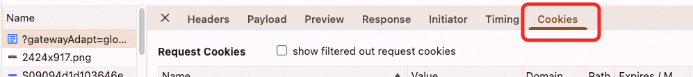

## Table of Contents
- [Table of Contents](#table-of-contents)
- [CookieStore API](#cookiestore-api)
- [Safari Third-Party Cookie Issues](#safari-third-party-cookie-issues)
- [Cookie Types](#cookie-types)
- [What Are Third-Party Cookies](#what-are-third-party-cookies)
  - [Google's CHIPS Scheme](#googles-chips-scheme)
- [Browser Default Behavior and Permissions](#browser-default-behavior-and-permissions)
- [The SameSite Attribute of Cookies](#the-samesite-attribute-of-cookies)
- [Cross-Site Requests and CSRF Protection](#cross-site-requests-and-csrf-protection)
- [Cookie Management with Multiple Domains](#cookie-management-with-multiple-domains)
- [Cookie Setting Rules](#cookie-setting-rules)
- [Cookie Scenarios with Site B Embedded in Site A](#cookie-scenarios-with-site-b-embedded-in-site-a)
- [Cookie Path and Expiration Time](#cookie-path-and-expiration-time)
- [Viewing Cookies](#viewing-cookies)
---
## CookieStore API
- **Description**: Chrome provides the new `cookieStore` API for more convenient management and manipulation of Cookies.
- **Features**:
  - Provides an asynchronous interface to avoid blocking the main thread.
  - Supports CRUD (Create, Read, Update, Delete) operations on specific Cookies.
---
## Safari Third-Party Cookie Issues
- **Problem Description**: Safari's support for third-party Cookies exhibits some strange behavior that requires further investigation.
- **Possible Reasons**:
  - Safari's privacy protection policies (like ITP) restrict the use of third-party Cookies.
  - In some scenarios, Safari might directly discard or block third-party Cookies.
---
## Cookie Types
1. **Session Cookies**:
   - Does not set `Expires` or `Max-Age`.
   - Deleted after the browser is closed, but closing a tab has no effect.
2. **Persistent Cookies**:
   - Sets `Expires` or `Max-Age`.
   - The Cookie remains valid even after the browser is closed.
3. **HttpOnly Cookies**:
   - Cannot be accessed or modified via JavaScript.
   - Set by the server, mainly used to prevent CSRF attacks.
---
## What Are Third-Party Cookies
- **Definition**: When site A accesses domain B, the Cookie set by domain B in its response is called a third-party Cookie.
- **Uses**:
  - User behavior tracking (e.g., advertising scripts).
  - Implementing cross-domain single sign-on functionality.
- **Restrictions**:
  - The EU's GDPR regulation is restricting the use of third-party Cookies.
### Google's CHIPS Scheme
A request can only set a cookie for its own domain (a browser cannot write cookies for other third-party domains via document.cookie). Now, setting a value for a third-party cookie requires user permission. This allows site A to set a cookie on site B through a request to site B. Specifically, an ID is set that establishes a relationship between site A's information and site B. This enables site B to know what information the user has accessed on site A when the user visits site B with this ID. This way, when site A places ads on site B, they will be more targeted because site B knows what content the user is interested in. This self-contained information loop is achieved through third-party script injection, which is how advertising mechanisms like Google's and Facebook's work.
In simple terms: If site A embeds a third-party script, this script can access all information on the current site, including cookies (non-HttpOnly), and then write the same cookies to its own domain. This way, when visiting the third-party site, the cookie is automatically sent to the server, which means it can obtain information about the visit to site A, including device, browsing history, etc.
- **Description**: Google's proposed CHIPS (Cookies Having Independent Partitioned State) scheme, aimed at solving the privacy issues of third-party Cookies.
- **Implementation**:
  - Uses the `Partitioned` attribute to partition Cookies.
  - A Cookie set by an embedded site on site A can only be used on site A.
- **Example**:
  ```http
  Set-Cookie: __Host-name=value; Secure; Path=/; SameSite=None; Partitioned;
  ```
---
## Browser Default Behavior and Permissions
- **Default Behavior**: Browsers typically disable permission to modify Cookies via JavaScript.
- **Solution**: Browser permissions need to be manually modified to allow Cookie modification.
---
## The SameSite Attribute of Cookies
- **Purpose**: Controls whether Cookies are sent with cross-site requests, preventing CSRF attacks.
- **Values**:
  - `Strict`: Cookies are only sent with same-site requests.
  - `Lax`: Allows Cookies to be sent with some cross-site requests (e.g., navigating to the target site).
  - `None`: Allows Cookies to be sent with cross-site requests, but must be used with the `Secure` attribute.
- **Example**:
  ```http
  Set-Cookie: key=value; SameSite=Strict;
  Set-Cookie: key=value; SameSite=Lax;
  Set-Cookie: key=value; SameSite=None; Secure;
  ```
---
## Cross-Site Requests and CSRF Protection
- **Characteristics**:
  - Cross-site requests generally do not carry custom request headers.
  - Restricting state updates via GET requests can reduce the risk of CSRF attacks.
- **Recommendations**:
  - Avoid using GET requests to update state.
  - Use POST requests to handle sensitive operations.
---
## Cookie Management with Multiple Domains
- **Problem Description**:
  - If there are Cookies with the same name under two different domains, for example:
    ```
    _lang=zh_CN; Domain=.a.com
    _lang=en_US; Domain=b.a.com
    ```
  - The result of `document.cookie` might be `_lang=zh_CN; _lang=en_US`, with the order depending on the order in which the Cookies were set.
- **Solution**:
  - Clearly distinguish the scope of Cookies on the server side.
  - The client-side parsing logic needs to be handled carefully during reads.
---
## Cookie Setting Rules
- **Example**:
  ```javascript
  document.cookie = "e_id=pt1; Domain=.a.com; Expires=Tue, 13-Mar-2091 12:03:24 GMT; Path=/; Secure; SameSite=None";
  ```
- **Notes**:
  - `Domain` must be consistent with the current page's domain to be set successfully.
  - `SameSite=None` allows Cookies to be sent and received with cross-site requests, but the CSRF risk must be assessed.
  - `Secure` requires the request to be HTTPS.
---
## Cookie Scenarios with Site B Embedded in Site A
- **Scenario Description**:
  - Site A embeds site B and passes language information via URL parameters.
  - Site B switches its Cookie based on the passed language parameter and refreshes the iframe.
- **Problem**:
  - If the language Cookie is not passed correctly, site B will set a new Cookie in the response header.
- **Solution**:
  - Ensure the language Cookie is passed correctly in the request to avoid redundant setting by the server.
---
## Cookie Path and Expiration Time
- **Path Attribute**:
  - Returned in order from most specific to least specific.
  - Example:
    ```http
    Set-Cookie: name=value; Path=/user;
    Set-Cookie: name=value; Path=/;
    ```
- **Expiration Time**:
  - Determined based on the client's time.
  - If the client's time is tampered with, it may cause abnormal Cookie expiration.
---
## Viewing Cookies

