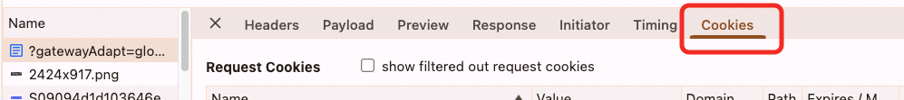

## 目录
1. [CookieStore API](#cookiestore-api)
2. [Safari 第三方 Cookie 问题](#safari-第三方-cookie-问题)
3. [Cookie 类型](#cookie-类型)
4. [什么是第三方 Cookie](#什么是第三方-cookie)
   - [Google CHIPS 方案](#google-chips-方案)
5. [浏览器默认行为与权限](#浏览器默认行为与权限)
6. [Cookie 的 SameSite 属性](#cookie-的-samesite-属性)
7. [跨站请求与 CSRF 防护](#跨站请求与-csrf-防护)
8. [多域名下的 Cookie 管理](#多域名下的-cookie-管理)
9. [Cookie 设置规则](#cookie-设置规则)
10. [A 站点内嵌 B 站点的 Cookie 场景](#a-站点内嵌-b-站点的-cookie-场景)
11. [Cookie 的 Path 与过期时间](#cookie-的-path-与过期时间)
12. [Cookie 查看](#cookie-查看)

---

## CookieStore API

- **描述**：Chrome 提供了新的 `cookieStore` API，用于更方便地管理和操作 Cookie。
- **特点**：
  - 提供异步接口，避免阻塞主线程。
  - 支持对特定 Cookie 的增删改查。

---

## Safari 第三方 Cookie 问题

- **问题描述**：Safari 对第三方 Cookie 的支持存在一些奇怪的行为，需要进一步调研。
- **可能原因**：
  - Safari 的隐私保护策略（如 ITP）限制了第三方 Cookie 的使用。
  - 某些场景下，Safari 可能会直接丢弃或阻止第三方 Cookie。

---

## Cookie 类型

1. **会话 Cookie**：
   - 不设置 `Expires` 或 `Max-Age`。
   - 关闭浏览器后会被删除，但关闭 Tab 不会影响。

2. **持久 Cookie**：
   - 设置了 `Expires` 或 `Max-Age`。
   - 即使关闭浏览器，Cookie 仍然有效。

3. **HttpOnly Cookie**：
   - 无法通过 JavaScript 访问或修改。
   - 由服务端设置，主要用于防止 CSRF 攻击。

---

## 什么是第三方 Cookie

- **定义**：当 A 网站访问 B 域名时，B 域名在响应中设置的 Cookie 被称为第三方 Cookie。
- **用途**：
  - 用户行为跟踪（如广告脚本）。
  - 实现跨域免登录功能。
- **限制**：
  - 欧盟 GDPR 条例正在限制第三方 Cookie 的使用。

### Google CHIPS 方案

- **描述**：Google 提出的 CHIPS（Cookies Having Independent Partitioned State）方案，用于解决第三方 Cookie 的隐私问题。
- **实现方式**：
  - 使用 `Partitioned` 属性将 Cookie 分区。
  - 内嵌网站在 A 网站设置的 Cookie 只能在 A 网站中使用。
- **示例**：
  ```http
  Set-Cookie: __Host-name=value; Secure; Path=/; SameSite=None; Partitioned;
  ```

---

## 浏览器默认行为与权限

- **默认行为**：浏览器通常禁用通过 JavaScript 修改 Cookie 的权限。
- **解决方案**：需要手动修改浏览器权限以允许修改 Cookie。

---

## Cookie 的 SameSite 属性

- **作用**：控制跨站请求是否携带 Cookie，防止 CSRF 攻击。
- **取值**：
  - `Strict`：仅同站请求携带 Cookie。
  - `Lax`：允许部分跨站请求（如导航到目标站点）携带 Cookie。
  - `None`：允许跨站请求携带 Cookie，但必须与 `Secure` 属性一起使用。
- **示例**：
  ```http
  Set-Cookie: key=value; SameSite=Strict;
  Set-Cookie: key=value; SameSite=Lax;
  Set-Cookie: key=value; SameSite=None; Secure;
  ```

---

## 跨站请求与 CSRF 防护

- **特点**：
  - 跨站请求一般不会带上自定义请求头。
  - 通过限制 GET 请求更新状态，可以降低 CSRF 攻击的风险。
- **建议**：
  - 避免使用 GET 请求更新状态。
  - 使用 POST 请求处理敏感操作。

---

## 多域名下的 Cookie 管理

- **问题描述**：
  - 如果两个域名下有相同名称的 Cookie，例如：
    ```
    _lang=zh_CN; Domain=.a.com
    _lang=en_US; Domain=b.a.com
    ```
  - `document.cookie` 返回的结果可能是 `_lang=zh_CN; _lang=en_US`，顺序取决于 Cookie 的设置顺序。
- **解决方案**：
  - 通过服务端明确区分 Cookie 的作用域。
  - 客户端读取时需注意解析逻辑。

---

## Cookie 设置规则

- **示例**：
  ```javascript
  document.cookie = "e_id=pt1; Domain=.aliexpress.com; Expires=Tue, 13-Mar-2091 12:03:24 GMT; Path=/; Secure; SameSite=None";
  ```
- **注意事项**：
  - `Domain` 必须与当前页面的域名一致才能设置成功。
  - `SameSite=None` 允许跨站点请求发送和接收 Cookie，但需评估 CSRF 风险。
  - `Secure` 要求必须是 HTTPS 请求。

---

## A 站点内嵌 B 站点的 Cookie 场景

- **场景描述**：
  - A 站点内嵌 B 站点，并通过 URL 参数传递语言信息。
  - B 站点根据传递的语言参数切换 Cookie 并刷新 iframe。
- **问题**：
  - 如果语言 Cookie 未正确传递，B 站点会在响应头中设置新的 Cookie。
- **解决方案**：
  - 确保语言 Cookie 在请求中正确传递，避免服务端重复设置。

---

## Cookie 的 Path 与过期时间

- **Path 属性**：
  - 按照具体到不具体的顺序返回。
  - 示例：
    ```http
    Set-Cookie: name=value; Path=/user;
    Set-Cookie: name=value; Path=/;
    ```
- **过期时间**：
  - 根据客户端的时间判断。
  - 如果客户端时间被篡改，可能导致 Cookie 过期时间异常。

---

## Cookie 查看

