## Core Intuition
1. The iterative method will definitely use a while loop. Binary tree traversal needs the help of a stack, while binary search only needs pointers. Generally, recursion is more intuitive, but the iterative method for binary search is more intuitive.
2. The pre-order, in-order, and post-order traversals of a tree are all recursive, so you don't need to worry about them. Instead, you need to distinguish between level-order traversal and breadth-first traversal; level-order traversal is not recursive.
2.
## Programming Tools
Jupyter is a vscode plugin that facilitates one-time compilation and writing.
### Array & hash
 [Top K Frequent Elements](https://leetcode.com/problems/top-k-frequent-elements/)

``` python
class Solution:  
    def topKFrequent(self, nums: List[int], k: int) -> List[int]:  
        dict = {}  
        for num in nums:  
            if num not in dict:  
                dict[num] = 1  
            dict[num] = dict[num] + 1  
        sorted_items = sorted(dict.items(), key=lambda item: item[1], reverse=True)  
        #keys = [item[0] for item in sorted_items[:k]]  
        return sorted_items
```
[Product of Array Except Self](https://leetcode.com/problems/product-of-array-except-self/)
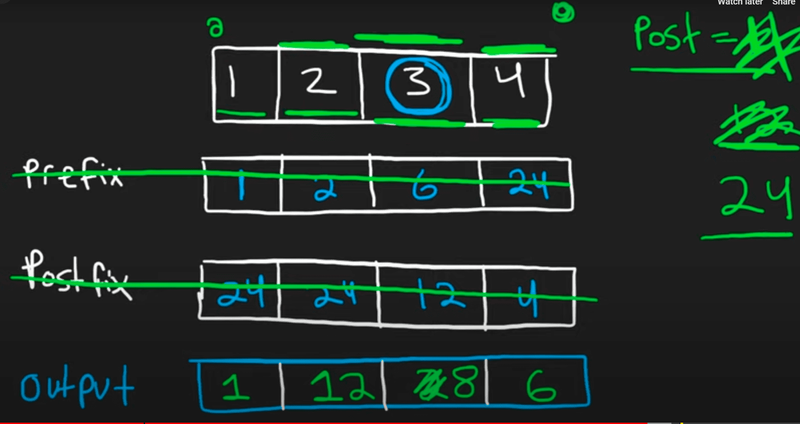
```python
# This problem is more algorithmic, but the specific implementation will test your array traversal skills.
from typing import List
def productArrayOfSelf(list: List[int]) -> List[int]:
    # 1,2,3,4 
    # prefix: 1 1 2 6
    # suffix: 24  12  4  1
    n = len(list)
    prefix_result = [1] * n
    suffix_result = [1] * n
    for i in range(n-1):
        prefix_result[i+1] = list[i] * prefix_result[i]
    for i in reversed(range(1,len(list))):
        suffix_result[i-1] = list[i] * suffix_result[i]
    result = [1] * n
    for i in range(n):
        result[i] = prefix_result[i] * suffix_result[i]
    return result
productArrayOfSelf([1,2,3,4])
```
```python
from typing import List  
  
class Solution:  
    def productExceptSelf(self, nums: List[int]) -> List[int]:  
        n = len(nums)  
        prefix_prduct = 1  
        postfix_product = 1  
        result = [0] * n  
        for i in range(n):  
            result[i] = prefix_prduct  
            prefix_prduct *= nums[i]  
  
        for i in range(n-1, -1, -1):  
            result[i] *= postfix_product  
            postfix_product *= nums[i]  
  
  
        return result  
  
print(Solution().productExceptSelf([1,2,3,4]))  # Output: [24, 12, 8, 6]
```
Let's take the input list `[1,2,3,4]` as an example to explain the third step in detail.  
  
After the second step, the values of `result` and `postfix_product` are as follows:  
  
- `result` = `[1, 1, 2, 6]` (stores the product of all elements to the left of each element)  
- `postfix_product` = `1`  
  
Then, we traverse the input list `nums` from back to front:  
  
1. When `i` = `3` (corresponding to element `4`), we multiply the value of `postfix_product` (which is `1` at this time) by `result[3]`, getting `result` = `[1, 1, 2, 6]`. Then, we multiply `nums[3]` (which is `4`) by `postfix_product`, getting `postfix_product` = `4`.  
  
2. When `i` = `2` (corresponding to element `3`), we multiply the value of `postfix_product` (which is `4` at this time) by `result[2]`, getting `result` = `[1, 1, 8, 6]`. Then, we multiply `nums[2]` (which is `3`) by `postfix_product`, getting `postfix_product` = `12`.  
  
3. When `i` = `1` (corresponding to element `2`), we multiply the value of `postfix_product` (which is `12` at this time) by `result[1]`, getting `result` = `[1, 12, 8, 6]`. Then, we multiply `nums[1]` (which is `2`) by `postfix_product`, getting `postfix_product` = `24`.  
  
4. When `i` = `0` (corresponding to element `1`), we multiply the value of `postfix_product` (which is `24` at this time) by `result[0]`, getting `result` = `[24, 12, 8, 6]`.  
  
So, the final returned result list `result` is `[24, 12, 8, 6]`, where each element is the product of all elements in the original list except itself.
 [Valid Sudoku](https://leetcode.com/problems/valid-sudoku/)

``` python
class Solution:  
    def isValidSudoku(self, board: List[List[str]]) -> bool:  
        rows = [{} for _ in range(9)]  
        columns = [{} for _ in range(9)]  
        boxes = [{} for _ in range(9)]  
  
        for i in range(9):  
            for j in range(9):  
                num = board[i][j]  
                if num != '.':  
                    num = int(num) 
                    box_index = (i // 3 ) * 3 + j // 3  
                    rows[i][num] = rows[i].get(num, 0) + 1  
                    columns[j][num] = columns[j].get(num, 0) + 1  
                    boxes[box_index][num] = boxes[box_index].get(num, 0) + 1  
  
                    if rows[i][num] > 1 or columns[j][num] > 1 or boxes[box_index][num] > 1:  
                        return False       
        return True
```
```js
//Template 1: 3x3 grid
//notInBox(row - (row % 3), col - (col % 3), board)
function notInBox(startRow, startCol, board) {
  let st = new Set();
  for (let i = 0; i < 3; i++) {
    for (let j = 0; j < 3; j++) {
      let cur = board[startRow + i][startCol + j];
      if (st.has(cur)) {
        return false;
      }
      if (cur !== ".") {
        st.add(cur);
      }
    }
  }
  return true;
}
```
Determine if there are duplicate values by checking rows, columns, and boxes. `rows` is defined as an array, where each element is a hash. `row[0][5]=0` calculates the count of 5 in the current row. Pay special attention to the box index: ``
`(i // 3) * 3 + j // 3` For any element, if its row index is i and column index is j, then the index of the 3x3 sub-sudoku it belongs to can be calculated by `(i // 3) * 3 + j // 3`. For example, if an element's row index is 4 and column index is 7, then the index of the 3x3 sub-sudoku it belongs to is `(4 // 3) * 3 + 7 // 3 = 1 * 3 + 2 = 5`, which means it is in the 5th sub-sudoku in the diagram above.
[Longest Consecutive Sequence](https://leetcode.com/problems/longest-consecutive-sequence/)

``` python
class Solution:  
    def longestConsecutive(self, nums: List[int]) -> int:  
        nums_set = set(nums)  
        longest = 1  
        for i in nums_set:  
            if i - 1 not in nums_set:  
                current_len = 1  
                current_num = i + 1  
                while current_num in nums_set:  
                    current_num += 1  
                    current_len = current_len + 1  
                longest = max(longest, current_len)  
        return longest  
  
Solution().longestConsecutive([100, 100,4,200,1,3,2])
```
[3Sum](https://leetcode.com/problems/3sum/)
``` python
class Solution:  
    def threeSum(self, nums: List[int]) -> List[List[int]]:  
        res = set()  
        n, p, z = [], [], []  
        for i in nums:  
             if i > 0:  
                 p.append(i)  
             elif i < 0:  
                 n.append(i)  
             else:  
                 z.append(i)  
        N, P = set(n), set(p)  
        if z:  
            for i in P:  
                if -1*i in N:  
                    res.add((-1*i, 0, i))  
  
        if len(z) >= 3:  
            res.add((0,0,0))  
  
        for i in range(len(n)):  
            for j in range(i+1, len(n)):  
                target = -1*(n[i]+n[j])  
                if target in P:  
                    res.add(tuple(sorted([n[i], n[j], target])))  
  
        for i in range(len(p)):  
            for j in range(i+1, len(p)):  
                target = -1*(p[i]+p[j])  
                if target in N:  
                    res.add(tuple(sorted([p[i],p[j], target])))  
  
        return res
```
In a one-dimensional array, find the contiguous subarray with the largest sum and return its sum.
Input:
```text
arr = [-2, -3, 4, -1, -2, 1, 5, -3]
```
Output:
```text
7
```
Explanation:
The contiguous subarray with the largest sum is `[4, -1, -2, 1, 5]`, and its sum is `4 + (-1) + (-2) + 1 + 5 = 7`.
Kadane's algorithm is an efficient dynamic programming algorithm used to solve the maximum subarray sum problem. Its core idea is to dynamically maintain the maximum sum of the current subarray and the global maximum sum by traversing the array.
#### Implementation Code
```ts
function maxSubArraySum(arr: number[]): number {
  // Initialize variables
  const maxint = Math.pow(2, 53); // Maximum safe integer in JavaScript
  let maxSoFar = -maxint - 1;     // Global maximum sum, initialized to the minimum value
  let maxEndingHere = 0;          // Maximum sum of the current subarray
  // Traverse the array
  for (let index = 0; index < arr.length; index++) {
    maxEndingHere = maxEndingHere + arr[index]; // Update the current subarray sum
    // If the current subarray sum is greater than the global maximum sum, update the global maximum sum
    if (maxSoFar < maxEndingHere) {
      maxSoFar = maxEndingHere;
    }
    // If the current subarray sum is less than 0, restart calculating the subarray
    if (maxEndingHere < 0) {
      maxEndingHere = 0;
    }
  }
  return maxSoFar; // Return the global maximum sum
}
// Test case
const arr = [-2, -3, 4, -1, -2, 1, 5, -3];
console.log(maxSubArraySum(arr)); // Output: 7
```
1. **Initialization**:
   - `maxSoFar`: Records the global maximum sum, initialized to the minimum value (`-Infinity` or `-Math.pow(2, 53) - 1`).
   - `maxEndingHere`: Records the maximum sum of the current subarray, initialized to `0`.
2. **Traverse the array**:
   - Each time, add the current element to `maxEndingHere` to extend the current subarray.
   - If `maxEndingHere` is greater than `maxSoFar`, update `maxSoFar`.
   - If `maxEndingHere` is less than `0`, it means the current subarray does not contribute to subsequent results, so reset it to `0`.
3. **Return the result**:
   - After the traversal is complete, `maxSoFar` is the maximum subarray sum.
- **Time Complexity**: `O(n)`  
  - Only needs to traverse the array once, which is highly efficient.
- **Space Complexity**: `O(1)`  
  - Only uses a constant amount of extra space.
We have **1TB of order data** that needs to be sorted by amount. However, the machine's memory is only **2GB**, so we cannot load all the data into memory at once. How can we solve this problem?
This is a typical **massive data processing problem**, which can be solved using the **divide and conquer** approach. The core idea of divide and conquer is to break down a large problem into multiple smaller problems, solve these smaller problems separately, and then merge the results to get the final answer.
Merge sort is a classic application of the divide and conquer approach. It achieves sorting through the following steps:
1. **Divide**: Continuously split the array until each subarray has only one element (which is already sorted).
2. **Merge**: Merge two sorted arrays into a larger sorted array, ultimately obtaining the completely sorted result.
The following is a diagram of the merge sort process:

Suppose we need to merge two sorted arrays `A` and `B`:
1. Allocate a new array with a size of `A + B`.
2. Use two pointers to point to the starting positions of `A` and `B` respectively.
3. Compare the values pointed to by the two pointers, write the smaller value into the new array, and move the corresponding pointer.
4. When one of the array's pointers reaches the end, copy the remaining part of the other array directly into the new array.
5. Finally, copy the contents of the new array back to the original array.
The following is the code implementation of merge sort:
```js
const mergeSort = (data, p, r) => {
    // If only one element is left, end the recursion
    if (p >= r) return;
    // Split point
    let q = Math.floor((p + r) / 2);
    // Divide
    mergeSort(data, p, q);
    mergeSort(data, q + 1, r);
    // Merge
    merge(data, p, q, r);
};
const merge = (data, p, q, r) => {
    const temp = new Array(r - p + 1);
    let i = p;
    let j = q + 1;
    let k = 0;
    // Compare the elements of the two arrays and write them to the temporary array in ascending order
    while (i <= q && j <= r) {
        if (data[i] <= data[j]) {
            temp[k++] = data[i++];
        } else {
            temp[k++] = data[j++];
        }
    }
    // Write the remaining elements to the temporary array
    let start = i;
    let end = r;
    if (j > r) {
        end = q;
    } else {
        start = j;
    }
    while (start <= end) {
        temp[k++] = data[start++];
    }
    // Copy the contents of the temporary array back to the original array
    for (let i = 0; i < r - p + 1; i++) {
        data[p + i] = temp[i];
    }
    return data;
};
export const ms_test_function = () => {
    const data = [11, 8, 3, 9, 7, 1, 2, 3];
    mergeSort(data, 0, data.length - 1);
    return true;
};
```
Back to the main topic, facing **1TB of order data** and a **2GB memory limit**, we can solve the problem using the following steps:
Due to limited memory, we need to read the large file line by line and split it into multiple smaller files based on the order amount. For example, assuming the maximum order amount is 10,000, we can split it by amount range:
- 0-99 yuan → file `partition_0.txt`
- 100-199 yuan → file `partition_1.txt`
- 200-299 yuan → file `partition_2.txt`
- ...
The advantage of doing this is that it facilitates quick sorting during subsequent merging, as we can sort based on the file name order.
The following is the code implementation for splitting the file:
```js
// Step 1: Divide the file into smaller partitions based on order amounts
function partitionFile(inputFilePath, outputDirPath, callback) {
    const partitions = {};
    // Read the input file sequentially
    const readStream = fs.createReadStream(inputFilePath, { encoding: 'utf8' });
    readStream.on('data', (chunk) => {
        const orders = chunk.split('\n');
        orders.forEach((order) => {
            // Extract the order amount from the order entry
            const amount = parseFloat(order.split(',')[1]);
            // Determine the partition for the order based on its amount
            const partition = Math.floor(amount / 100);
            // Create a writable stream for the partition file if it doesn't exist
            if (!partitions.hasOwnProperty(partition)) {
                const partitionFilePath = `${outputDirPath}/partition_${partition}.txt`;
                partitions[partition] = fs.createWriteStream(partitionFilePath, { flags: 'a' });
            }
            // Write the order to the appropriate partition file
            partitions[partition].write(`${order}\n`);
        });
    });
    readStream.on('end', () => {
        // Close all partition files
        for (const partition in partitions) {
            partitions[partition].end();
        }
        callback();
    });
}
```
The data volume of each small file is small and can be loaded directly into memory for sorting. We can use an efficient sorting algorithm (such as merge sort or quick sort) and write the sorted results back to the file.
The following is the code implementation for sorting small files:
```js
// Step 2: Sort each partition individually
function sortPartitions(inputDirPath, outputDirPath, callback) {
    fs.readdir(inputDirPath, (err, files) => {
        if (err) {
            throw err;
        }
        files.forEach((file) => {
            const filePath = `${inputDirPath}/${file}`;
            const sortedFilePath = `${outputDirPath}/sorted_${file}`;
            // Read the orders from the partition file
            const orders = fs.readFileSync(filePath, { encoding: 'utf8' }).split('\n');
            // Sort the orders using an efficient algorithm (e.g., merge sort)
            const sortedOrders = orders.sort((a, b) => {
                const amountA = parseFloat(a.split(',')[1]);
                const amountB = parseFloat(b.split(',')[1]);
                return amountA - amountB;
            });
            // Write the sorted orders to the sorted partition file
            fs.writeFileSync(sortedFilePath, sortedOrders.join('\n'), { encoding: 'utf8' });
        });
        callback();
    });
}
```
Merge all the sorted small files in the order of their file names. This step is similar to the merge process of merge sort, where we take the smallest element from each small file at a time to gradually generate the final sorted result.
The following is the code implementation for merging small files:
```js
// Step 3: Merge the sorted partitions
function mergePartitions(inputDirPath, outputFilePath) {
    // Step 1: Perform merge sort on an array of numbers
    function mergeSort(arr) {
        if (arr.length <= 1) {
            return arr;
        }
        const mid = Math.floor(arr.length / 2);
        const left = arr.slice(0, mid);
        const right = arr.slice(mid);
        return merge(mergeSort(left), mergeSort(right));
    }
    // Step 2: Merge two sorted arrays
    function merge(left, right) {
        let merged = [];
        let i = 0;
        let j = 0;
        while (i < left.length && j < right.length) {
            // Read the number after the file title
            if (parseFloat(left[i].split(',')[1]) <= parseFloat(right[j].split(',')[1])) {
                merged.push(left[i]);
                i++;
            } else {
                merged.push(right[j]);
                j++;
            }
        }
        while (i < left.length) {
            merged.push(left[i]);
            i++;
        }
        while (j < right.length) {
            merged.push(right[j]);
            j++;
        }
        return merged;
    }
    const filePointers = [];
    let mergedOutput = '';
    fs.readdir(inputDirPath, (err, files) => {
        if (err) {
            throw err;
        }
        // Open all sorted partition files and initialize file pointers
        files.forEach((file) => {
            const filePath = path.join(inputDirPath, file);
            const fileData = fs.readFileSync(filePath, 'utf8').trim();
            const partitionData = fileData.split('\n');
            filePointers.push(partitionData);
        });
        // Merge the sorted partitions
        const sortedOutput = mergeSort(filePointers.flat());
        // Format the sorted output
        mergedOutput = sortedOutput.join('\n') + '\n';
        // Write the merged output to the final sorted file
        fs.writeFileSync(outputFilePath, mergedOutput, { encoding: 'utf8' });
    });
}
```
The following is the running result of the entire process:
1. **Input file**: Original 1TB order data.
2. **Intermediate files**:
   - `temp/input`: The result after splitting into small files, with each small file storing the corresponding order data.
   - `temp/output`: The result after sorting within the small files.
3. **Output file**: `sorted_file.txt` is the final merged result, which has been sorted by order amount.
The running result is shown in the figure below:

Suppose we have a shopping cart with `n` items (prices are known). We need to select some items from these `n` items so that their total price just meets the price requirement for a discount. For example, the discount requirement is **10 yuan**.
Simplified example:
- The array of item prices is `[2, 2, 4, 6, 3]`
- The discount requirement is **10 yuan**
The goal is to select some items from these items so that their total price is as close as possible to the discount requirement (i.e., **10 yuan**), but not exceeding **3 times the discount amount** (i.e., **30 yuan**).
This problem can be analogized to the classic **knapsack problem**, which is to select items to maximize the total value under a given maximum weight limit. Here, the "maximum weight" corresponds to the upper limit of the discount amount (e.g., **30 yuan**), and the "value of the items" corresponds to the price of the items.
The most direct solution is to list all possible combinations of items and then find the combination that meets the conditions. However, the time complexity of this method is exponential (O(2^n)), and the calculation efficiency will be very low when the number of items is large.
We can borrow the dynamic programming idea of the knapsack problem to avoid the exponential growth of states. Specifically:
1. Use a two-dimensional state table `states` to record the state of each step.
2. Each state `states[i][j]` indicates whether the first `i` items can form a combination with a total price of `j`.
3. The final result is derived step by step through the state transition equation.
State definition:
- `states[i][j]`: Indicates whether the first `i` items can form a combination with a total price of `j`.
- Initial state: `states[0][0] = true` (when no items are selected, a total price of 0 is feasible).
- If the price of the `i`-th item `items[i]` is less than or equal to the current total price `j`, the state can be updated by selecting or not selecting this item.
State transition equation:
1. **Do not select the `i`-th item**:
   - If `states[i-1][j] = true`, then `states[i][j] = true`.
2. **Select the `i`-th item**:
   - If `states[i-1][j-items[i]] = true`, then `states[i][j] = true`.
Boundary conditions:
- The total price cannot exceed **3 times the discount amount** (i.e., `3 * w`).
- If no combination that meets the conditions can be found, return an empty result.
The following is a JavaScript implementation based on the above ideas:
```js
/**
 * Double 11 shopping problem
 * @param {number[]} items Array of item prices
 * @param {number} n Number of items
 * @param {number} w Target amount for the discount
 */
function double11advance(items, n, w) {
    // Initialize the state table
    let states = new Array(n);
    for (let i = 0; i < n; i++) {
        states[i] = new Array(3 * w + 1).fill(false);
    }
    // Initial state
    states[0][0] = true; // Do not select the first item
    if (items[0] <= 3 * w) {
        states[0][items[0]] = true; // Select the first item
    }
    // Dynamic programming to fill the table
    for (let i = 1; i < n; i++) {
        // Do not select the i-th item
        for (let j = 0; j <= 3 * w; j++) {
            if (states[i - 1][j] === true) {
                states[i][j] = states[i - 1][j];
            }
        }
        // Select the i-th item
        for (let j = 0; j <= 3 * w - items[i]; j++) {
            if (states[i - 1][j] === true) {
                states[i][j + items[i]] = true;
            }
        }
    }
    // Find the total price closest to the discount amount
    let j;
    for (j = w; j < 3 * w + 1; j++) {
        if (states[n - 1][j] === true) {
            break;
        }
    }
    // If no combination that meets the conditions can be found
    if (j === 3 * w + 1) {
        console.log("Unable to find a combination of items that meets the conditions");
        return;
    }
    // Backtrack to find out which specific items were selected
    for (let i = n - 1; i >= 1; i--) {
        if (j - items[i] >= 0 && states[i - 1][j - items[i]] === true) {
            console.log(items[i]); // Print the selected item
            j -= items[i];
        }
    }
    // Check if the 0-th item was selected
    if (j !== 0) {
        console.log(items[0]);
    }
}
```
Input
```js
const items = [2, 2, 4, 6, 3];
const n = items.length;
const w = 10;
double11advance(items, n, w);
```
Output
```
6
4
```
Explanation: Select the items with prices `6` and `4`, the total price is `10`, which just meets the discount requirement.
1. **Time Complexity**:
   - The process of filling the table requires traversing each item and each possible total price, so the time complexity is O(n * 3w), where `n` is the number of items and `w` is the discount amount.
2. **Space Complexity**:
   - A two-dimensional array `states` is used, so the space complexity is O(n * 3w).
In fields such as natural language processing and text matching, we often need to quantify the similarity between two strings. A commonly used metric is the **Edit Distance**, which represents the minimum number of edit operations required to convert one string into another. Edit operations include:
- **Insertion**: Inserting a character into a string.
- **Deletion**: Deleting a character from a string.
- **Substitution**: Replacing a character in a string with another character.
The smaller the edit distance, the more similar the two strings are.
Given two strings `mitcmu` and `mtacnu`, what is their edit distance?
An intuitive solution is to use a backtracking algorithm to enumerate all possible sequences of operations and find the minimum edit distance. The specific steps are as follows:
1. If `a[i] == b[j]`, no operation is needed, recursively examine `a[i+1]` and `b[j+1]`.
2. If `a[i] != b[j]`, one of the following operations can be performed:
   - **Deletion**: Delete `a[i]` or `b[j]`, then recursively examine the remaining parts.
   - **Insertion**: Insert a character identical to `b[j]` before `a[i]`, or insert a character identical to `a[i]` before `b[j]`.
   - **Substitution**: Replace `a[i]` with `b[j]` or replace `b[j]` with `a[i]`.
The time complexity of this method is high because it will repeatedly calculate the same subproblems.
To avoid repeated calculations, we can use dynamic programming to optimize the backtracking algorithm. Define the state `minDist[i][j]` as the minimum edit distance required to convert the string `a[0...i-1]` to the string `b[0...j-1]`.
State Transition Equation
1. If `a[i-1] == b[j-1]`, no operation is needed:
   \[
   minDist[i][j] = minDist[i-1][j-1]
   \]
2. If `a[i-1] != b[j-1]`, one of the following three operations can be chosen:
   - **Insertion**: `minDist[i][j] = minDist[i][j-1] + 1`
   - **Deletion**: `minDist[i][j] = minDist[i-1][j] + 1`
   - **Substitution**: `minDist[i][j] = minDist[i-1][j-1] + 1`
Combining the above two cases, the state transition equation is:
\[
minDist[i][j] =
\begin{cases} 
minDist[i-1][j-1], & \text{if } a[i-1] == b[j-1] \\
\min(minDist[i-1][j]+1, minDist[i][j-1]+1, minDist[i-1][j-1]+1), & \text{if } a[i-1] \neq b[j-1]
\end{cases}
\]
Initial Conditions:
1. When converting an empty string to a target string, the edit distance is equal to the length of the target string:
   \[
   minDist[i][0] = i \quad (i = 0, 1, ..., n)
   \]
   \[
   minDist[0][j] = j \quad (j = 0, 1, ..., m)
   \]
The following is a JavaScript implementation based on dynamic programming:
```js
/**
 * Calculate the edit distance between two strings
 * @param {string} a String A
 * @param {number} n Length of string A
 * @param {string} b String B
 * @param {number} m Length of string B
 * @returns {number} Minimum edit distance
 */
function lwstDP(a, n, b, m) {
    // Initialize the 2D array minDist
    const minDist = new Array(n + 1);
    for (let i = 0; i < n + 1; i++) {
        minDist[i] = new Array(m + 1);
        minDist[i][0] = i; // Edit distance to convert an empty string to a[0...i-1]
    }
    for (let j = 0; j < m + 1; j++) {
        minDist[0][j] = j; // Edit distance to convert an empty string to b[0...j-1]
    }
    // Dynamic programming to fill the table
    for (let i = 1; i < n + 1; i++) {
        for (let j = 1; j < m + 1; j++) {
            if (a[i - 1] === b[j - 1]) {
                // Characters are equal, no operation needed
                minDist[i][j] = minOfThree(
                    minDist[i - 1][j] + 1, // Deletion
                    minDist[i][j - 1] + 1, // Insertion
                    minDist[i - 1][j - 1]  // No operation
                );
            } else {
                // Characters are not equal, take the minimum operation
                minDist[i][j] = minOfThree(
                    minDist[i - 1][j] + 1, // Deletion
                    minDist[i][j - 1] + 1, // Insertion
                    minDist[i - 1][j - 1] + 1 // Substitution
                );
            }
        }
    }
    return minDist[n][m]; // Return the final result
}
/**
 * Helper function: returns the minimum of three numbers
 * @param {number} n1 The first number
 * @param {number} n2 The second number
 * @param {number} n3 The third number
 * @returns {number} The minimum value
 */
function minOfThree(n1, n2, n3) {
    return Math.min(n1, Math.min(n2, n3));
}
```
Input
```js
const a = "mitcmu";
const b = "mtacnu";
const n = a.length;
const m = b.length;
console.log(lwstDP(a, n, b, m)); // Output: 3
```
Output
```
3
```
The minimum edit distance to convert `mitcmu` to `mtacnu` is 3, which can be achieved by the following operations:
1. Replace `i` with `t`.
2. Replace `c` with `a`.
3. Replace `m` with `n`.
1. **Time Complexity**:
   - The size of the dynamic programming table is `(n+1) x (m+1)`, and the computation time for each state is O(1).
   - The total time complexity is O(n * m), where `n` and `m` are the lengths of the two strings, respectively.
2. **Space Complexity**:
   - A two-dimensional array `minDist` is used, so the space complexity is O(n * m).
Given an integer array, where each element represents the maximum number of steps that can be taken forward from that position. Write a function to return the minimum number of jumps required to reach the end of the array. If an element is `0`, you cannot pass through that element. If the end cannot be reached, return `-1`.
Input:
```text
arr[] = {1, 3, 5, 8, 9, 2, 6, 7, 6, 8, 9}
```
Output:
```text
3
```
Explanation:  
- 1st jump: From index `0` to index `1` (because `arr[0] = 1`).
- 2nd jump: From index `1` to index `4` (because `arr[1] = 3`, you can choose to jump to index `2`, `3`, or `4`).
- 3rd jump: From index `4` to index `10` (because `arr[4] = 9`, jump directly to the end).
Input:
```text
arr[] = {1, 1, 1, 1, 1, 1, 1, 1, 1, 1, 1}
```
Output:
```text
10
```
Explanation: You can only jump one step at a time, so it takes 10 jumps to reach the end.
Greedy Algorithm (Optimized Brute Force)
```ts
function miniJumpsToEnd(arr) {
  const n = arr.length;
  // If the array length is 1 or less, no jumps are needed
  if (n <= 1) return 0;
  // If the starting point is 0 and the array length is greater than 1, it's impossible to jump
  if (arr[0] == 0) return -1;
  let maxReach = arr[0]; // The farthest index that can be reached currently
  let step = arr[0];     // The number of steps remaining currently
  let jumps = 1;         // Total number of jumps
  for (let i = 1; i < n; i++) {
    // If the current index has reached or exceeded the end
    if (i == n - 1) {
      return jumps;
    }
    // Update the farthest index that can be reached
    maxReach = Math.max(maxReach, i + arr[i]);
    // Consume one step
    step--;
    // If the current remaining steps are 0, a jump is needed
    if (step == 0) {
      jumps++;
      // If the current index has exceeded the maximum reachable range, it's impossible to reach the end
      if (i >= maxReach) {
        return -1;
      }
      // Update the remaining steps to the new maximum reachable range minus the current index
      step = maxReach - i;
    }
  }
  return -1; // If the loop finishes without returning a result, it's impossible to reach the end
}
```
1. **Core Idea**  
   Use a greedy algorithm to dynamically maintain three variables:
   - `maxReach`: Records the farthest index that can be reached currently.
   - `step`: Records the number of steps remaining currently.
   - `jumps`: Records the total number of jumps.
2. **Process**
   - When traversing the array, update `maxReach` to the maximum of the current index plus the current element's value.
   - Each time, consume one step (`step--`). When `step` becomes `0`, it means a jump is needed, and the remaining steps are updated.
   - If the current index exceeds `maxReach`, it means it's impossible to proceed further, so return `-1`.
3. **Boundary Conditions**
   - If the array length is `1`, return `0` directly.
   - If the starting point is `0` and the array length is greater than `1`, return `-1` directly.
- **Time Complexity**:  
  Only need to traverse the array once, so the time complexity is **O(n)**.
- **Space Complexity**:  
  Only uses a constant amount of extra space, so the space complexity is **O(1)**.
Input:
```text
arr[] = {1, 3, 5, 8, 9, 2, 6, 7, 6, 8, 9}
```
Execution Process:
- Initial state: `maxReach = 1`, `step = 1`, `jumps = 1`
- Traverse to index `1`: Update `maxReach = 4`, consume `step`, make the 2nd jump.
- Traverse to index `4`: Update `maxReach = 13`, consume `step`, make the 3rd jump.
- Reach the end, return `3`.
Output:
```text
3
```
Input:
```text
arr[] = {1, 1, 1, 1, 1, 1, 1, 1, 1, 1, 1}
```
Execution Process:
- Can only jump one step at a time, a total of 10 jumps are needed.
Output:
```text
10
```
### Two Pointer
[Valid Palindrome](https://leetcode.com/problems/valid-palindrome/)
![[Pasted image 20240225105519.png]]
``` python
class Solution:  
    def isPalindrome(self, s: str) -> bool:  
        start = 0  
        end = len(s) - 1  
        while start < end:  
            if not s[start].isalnum():  
                start += 1  
                continue  
            if not s[end].isalnum():  
                end -= 1  
                continue  
            if s[start].lower() != s[end].lower():  
                return False  
            start += 1  
            end -= 1  
        return True
```
[Two Sum II Input Array Is Sorted  ](https://leetcode.com/problems/two-sum-ii-input-array-is-sorted/)
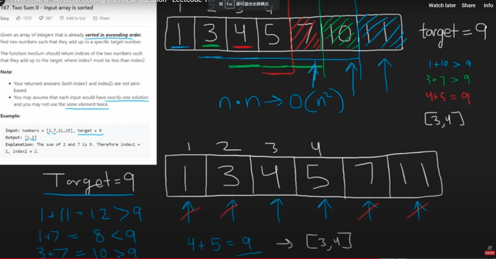
``` python
class Solution:  
    def twoSum(self, numbers: List[int], target: int) -> List[int]:  
        start = 0  
        end = len(numbers) - 1  
        while start < end:  
            sum = numbers[start] + numbers[end]  
            if sum == target:  
                return [start, end]  
            elif sum < target:  
                start += 1  
            else:  
                end -= 1  
        return []
```
[Container With Most Water](https://leetcode.com/problems/container-with-most-water/) (Hard）

``` python
# min(LMin, RMax) - h(i) 
class Solution:  
    def maxArea(self, height: List[int]) -> int:  
        n = len(height)  
        l, r = 0, n - 1  
        ans = 0  
        while l <= r:  
            ans = max(ans, (r-l)*min(height[l], height[r]))  
            if height[l] < height[r]: l += 1  
            else:  r -= 1  
        return ans
```
**hint**: If you move the taller pointer, the width decreases, but the height remains the same, so the water level will not increase.
[Trapping Rain Water](https://leetcode.com/problems/trapping-rain-water/)
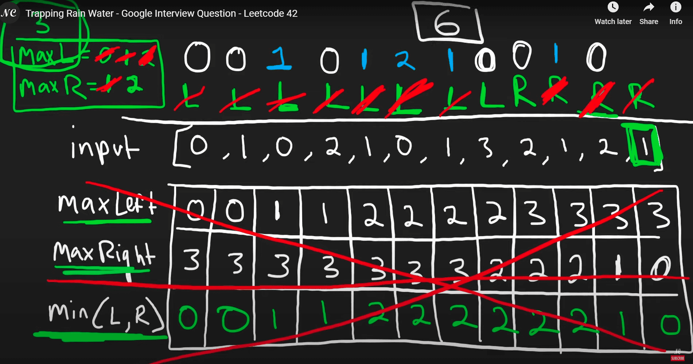
``` python
# min(LMin, RMax) - h(i) 
class Solution:  
    def maxArea(self, height: List[int]) -> int:  
        if not height:  
            return 0  
        l, r = 0, len(height) - 1  
        lMax, rMax = height[0], height[-1]  
        res = 0  
  
        while l < r:  
            if lMax < rMax:  
                l += 1  
                lMax = max(lMax, height[l])  
                res += lMax - height[l]  
            else:  
                r -= 1  
                rMax = max(rMax, height[r])  
                res += rMax - height[r]  
  
        return res
```
Given a string, find the longest palindromic substring in it.
Input:
```text
"forgeeksskeegfor"
```
Output:
```text
"geeksskeeg"
```
Input:
```text
"Geeks"
```
Output:
```text
"ee"
```
To find the longest palindromic substring in a string, you can use the **center expansion method**. The specific steps are as follows:
1. Traverse each character of the string and treat it as the center of a palindrome.
2. Expand to the left and right sides to check if the palindrome condition is met (i.e., the left and right characters are equal).
3. Skip duplicate characters to handle even-length palindromes.
4. Record the starting position and length of the current longest palindromic substring, and return the result after the traversal is complete.
The following is a code implementation based on TypeScript:
```ts
function longestPalindrome(str: string): string {
  const n = str.length;
  if (n === 0) return "";
  let maxLength = 1; // Length of the longest palindromic substring
  let start = 0;     // Starting position of the longest palindromic substring
  for (let index = 0; index < n; index++) {
    let low = index - 1;
    let high = index + 1;
    // Skip duplicate characters on the right
    while (high < n && str[high] === str[index]) {
      high++;
    }
    // Skip duplicate characters on the left
    while (low >= 0 && str[low] === str[index]) {
      low--;
    }
    // The middle part is a palindrome, continue to expand outwards
    while (low >= 0 && high < n && str[low] === str[high]) {
      low--;
      high++;
    }
    // Calculate the length of the current palindromic substring
    const length = high - low - 1;
    if (maxLength < length) {
      maxLength = length;
      start = low + 1;
    }
  }
  // Return the longest palindromic substring
  return str.substring(start, start + maxLength);
}
```
- **O(n²)**:  
  - The outer loop traverses the entire string, with a time complexity of O(n).
  - The inner loop expands from the center of each character to both sides, which in the worst case will expand to the beginning and end, with a time complexity of O(n).
  - Therefore, the total time complexity is O(n²).
- **O(1)**:  
  - Only uses a constant level of extra space (such as `low`, `high`, `maxLength` variables), so the space complexity is O(1).
### Stack
[Valid Parentheses](https://leetcode.com/problems/valid-parentheses/)

```python
class Solution:  
    def isValid(self, s: str) -> bool:  
        stack = list()  
        dict = { "(": ")", "{": "}", "[": "]" }  
        for char in s:  
            if len(stack) > 0 and stack[-1] not in dict:  
                return False  
            if len(stack) == 0 or dict[stack[-1]] != char:  
                stack.append(char)  
                continue  
            stack.pop()  
        return len(stack) == 0
```
[Min Stack](https://leetcode.com/problems/min-stack/)
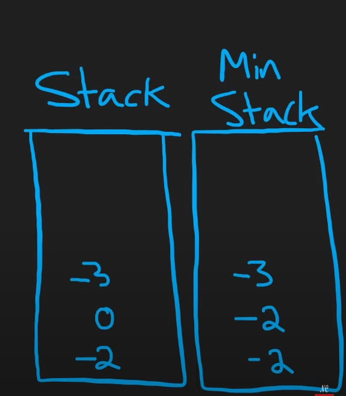
``` python
class MinStack:  
    def __init__(self):  
        self.list = []  
        self.min = []  
    def push(self, val: int) -> None:  
        self.list.append(val)  
        self.min.append(val if not self.min else min(val, self.min[-1]))  
    def pop(self) -> None:  
        self.list.pop()  
        self.min.pop()  
    def top(self) -> int:  
        return self.list[-1]  
    def getMin(self) -> int:  
        return self.min[-1]
```
[Evaluate Reverse Polish Notation](https://leetcode.com/problems/evaluate-reverse-polish-notation/)

``` python
class Solution:  
    def evalRPN(self, tokens: List[str]) -> int:  
        stack = []  
        ops = ['+', '-', '*', '/']  
        for token in tokens:  
            if token in ops:  
                a = stack.pop()  
                b = stack.pop()  
                if token == '+':  
                    result = int(b) + int(a)  
                elif token == '*':  
                    result = int(b) * int(a)  
                elif token == '/':  
                    result = int(b) / int(a)  
                else:  
                    result = int(b) - int(a)  
                stack.append(int(result))  
                continue  
            stack.append(int(token))  
        return stack[-1]
```
[Daily Temperatures](https://leetcode.com/problems/daily-temperatures/)

``` python
# Monotonically decreasing stack to store information
class Solution:  
    def dailyTemperatures(self, temperatures: List[int]) -> List[int]:  
        stack = [] # pair: temp, index  
        res = [0] * len(temperatures)  
        for i, v in enumerate(temperatures):  
            while stack and v > stack[-1][0]:  
                stackT, stackIndex = stack.pop()  
                res[stackIndex] = (i - stackIndex)  
            stack.append([v, i])  
        return res
```
Given an array and an integer **K**, find the maximum value of each contiguous subarray of length **K**.
Input:
```text
arr[] = {1, 2, 3, 1, 4, 5, 2, 3, 6}, K = 3
```
Output:
```text
3 3 4 5 5 5 6
```
Explanation:
- The maximum value of subarray `[1, 2, 3]` is `3`
- The maximum value of subarray `[2, 3, 1]` is `3`
- The maximum value of subarray `[3, 1, 4]` is `4`
- The maximum value of subarray `[1, 4, 5]` is `5`
- The maximum value of subarray `[4, 5, 2]` is `5`
- The maximum value of subarray `[5, 2, 3]` is `5`
- The maximum value of subarray `[2, 3, 6]` is `6`
Method 1: Brute Force
#### Implementation Code
```js
function getMaxK(arr, k) {
  if (!arr) return;
  if (arr.length <= k) {
    return Math.max(...arr);
  }
  for (let index = 0; index <= arr.length - k; index++) {
    let result = Math.max(arr[index], arr[index + 1], arr[index + 2]);
    console.log(result + " ");
  }
}
```
- **Time Complexity**:  
  The outer loop iterates `(n-k)` times, and the inner calculation of the maximum value requires `k` operations, so the total time complexity is **O(n*k)**.
- **Space Complexity**:  
  No extra space is needed, so the space complexity is **O(1)**.
Method 2: AVL Tree
An AVL tree is a height-balanced binary search tree (BST) where the height difference between the left and right subtrees is no more than 1. It supports insertion, deletion, and search operations with a time complexity of **O(log k)**, making it very suitable for dynamically maintaining the maximum value.
Implementation Code
```ts
function getMaxK(arr, k) {
  const res = [];
  const queue = [];
  let index = 0;
  // Initialize the first k elements
  for (; index < k; index++) {
    queue.push(arr[index]);
  }
  queue.sort((a, b) => b - a); // Sort to simulate an AVL tree
  res.push(queue[0]);
  // Sliding window to process the remaining elements
  for (; index < arr.length; index++) {
    const element = arr[index];
    queue.push(element);
    queue.sort((a, b) => b - a); // Re-sort after insertion
    res.push(queue[0]);
    queue.splice(arr[index - k + 1], 1); // Remove the element that slides out of the window
  }
  return res;
}
```
- **Time Complexity**:  
  Traversing the array requires `n` operations, and each insertion or deletion of an element takes `log k` time, so the total time complexity is **O(n*log k)**.
- **Space Complexity**:  
  Maintains a queue of size `k`, so the space complexity is **O(k)**.
Key Templates for Building an AVL Tree
1. **Node Balancing Template**
   ```ts
   const balance = this.getBalance(node);
   // Left-Left case
   if (balance > 1 && data < node.left.data) {
     return this.rightRotate(node);
   }
   // Right-Right case
   if (balance < -1 && data > node.right.data) {
     return this.leftRotate(node);
   }
   // Left-Right case
   if (balance > 1 && data > node.left.data) {
     node.left = this.leftRotate(node.left);
     return this.rightRotate(node);
   }
   // Right-Left case
   if (balance < -1 && data < node.right.data) {
     node.right = this.rightRotate(node.right);
     return this.leftRotate(node);
   }
   ```
2. **Left Rotation Template**
   ```ts
   function leftRotate(x) {
     let y = x.right;
     let T2 = y.left;
     y.left = x;
     x.right = T2;
     x.height = Math.max(height(x.left), height(x.right)) + 1;
     y.height = Math.max(height(y.left), height(y.right)) + 1;
     return y;
   }
   ```
3. **Right Rotation Template**
   ```ts
   function rightRotate(y) {
     let x = y.left;
     let T2 = x.right;
     x.right = y;
     y.left = T2;
     y.height = Math.max(height(y.left), height(y.right)) + 1;
     x.height = Math.max(height(x.left), height(x.right)) + 1;
     return x;
   }
   ```
Method 3: Two Stacks Method
Implementation Code
```ts
const s1 = []; // Sliding window
const s2 = []; // Temporary window
const n = arr.length;
// Initialization
for (let index = 0; index < k - 1; index++) {
  insert(s2, arr[index]);
}
for (let i = 0; i <= n - k; i++) {
  // Update window
  if (i - 1 >= 0) update(s1, s2);
  // Insert new element
  insert(s2, arr[i + k - 1]);
  // Record maximum value
  res.push(Math.max(s1[s1.length - 1].max, s2[s2.length - 1].max));
}
```
Analysis
- **Time Complexity**:  
  Each element is inserted and deleted at most once, so the total time complexity is **O(n)**.
- **Space Complexity**:  
  Uses two stacks to store at most `k` elements, so the space complexity is **O(k)**.
Method 4: Max-Heap
Use a max-heap to dynamically maintain the maximum value in the current window. The characteristic of a max-heap is that it can quickly retrieve the maximum value and supports efficient insertion and deletion operations.
1. Analysis
- **Time Complexity**:  
  The time complexity of each insertion and deletion operation is **O(log k)**, so the total time complexity is **O(n*log k)**.
- **Space Complexity**:  
  The heap stores at most `k` elements, so the space complexity is **O(k)**.
## Summary
| Method       | Time Complexity   | Space Complexity | Applicable Scenarios                     |
|------------|--------------|------------|------------------------------|
| Brute Force   | O(n*k)       | O(1)       | Small data scale                 |
| AVL Tree     | O(n*log k)   | O(k)       | Dynamically maintaining max value, large data scale   |
| Two Stacks Method     | O(n)         | O(k)       | Efficient and easy to implement               |
| Max-Heap     | O(n*log k)   | O(k)       | Dynamically maintaining max value, suitable for large-scale data |
Choose the appropriate algorithm based on actual needs. If performance requirements are high and the data scale is large, it is recommended to use the **Two Stacks Method** or **Max-Heap**.
### Binary Search
[Binary Search](https://leetcode.com/problems/binary-search/)
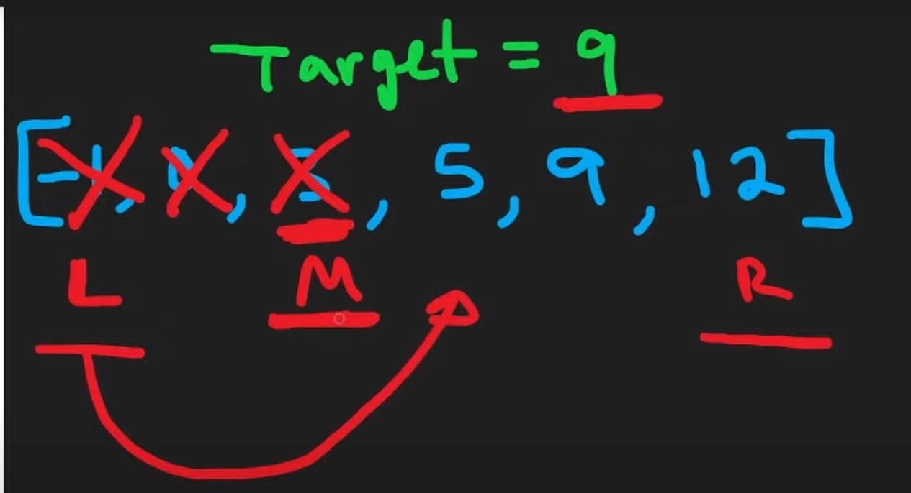
```text
Thinking Misconceptions
1. Binary search is not just about finding a specified element. It can essentially **reduce the range** as long as you find the condition. Here, we are comparing the minimum and maximum elements of the current row, not the first elements of two rows.
2. Both iterative and recursive methods can implement binary search.
```
```python
class Solution:  
    def search(self, nums: List[int], target: int) -> int:  
        def bs(low, high):  
            if low > high:  
                return -1  
            mid = low + (high - low) // 2  
            if nums[mid] < target:  
                return bs(mid + 1, high)  
            elif nums[mid] > target:  
                return bs(low, mid - 1)  
            else:  
                return mid  
        return bs(0, len(nums) - 1)
```
[Search a 2D Matrix](https://leetcode.com/problems/search-a-2d-matrix/)

```python
# Operate directly with pointers, no need for an extra array to store
class Solution:  
    def searchMatrix(self, matrix: List[List[int]], target: int) -> bool:  
        rows, cols = len(matrix), len(matrix[0])  
        top, bot = 0, rows - 1  
        targetRow = -1
        while top <= bot:  # = means get the last value
            mid = bot + (top - bot) // 2  
            if target > matrix[mid][-1]:  
                top = mid + 1  
            elif target < matrix[mid][0]:  
                bot = mid - 1  
            else:  
                targetRow = mid
                break  # Found the current row  
  
        l, r = 0, cols - 1  
        while l <= r:  
            m = l + (r - l) // 2  
            if target > matrix[row][m]:  
                l = m + 1  
            elif target < matrix[row][m]:  
                r = m - 1  
            else:  
                return True
```
[Koko Eating Bananas](https://leetcode.com/problems/koko-eating-bananas/)
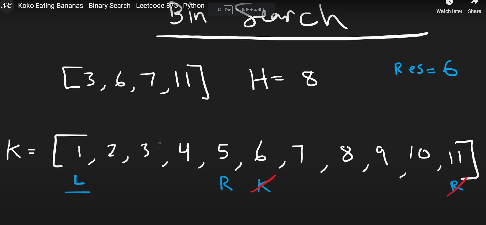
```python
class Solution:  
    def minEatingSpeed(self, piles: List[int], h: int) -> int:  
        l, r = 1, max(piles)  
        res = r  
        while l <= r:  
            k = l + (r - l) // 2  
            hours = 0  
            for p in piles:  
                hours += math.ceil(p / k)  
            if hours <= h:      
res = min(res, k)  
                r = k - 1  
            else:  
                l = k + 1  
        return res
```
[Find Minimum In Rotated Sorted Array](https://leetcode.com/problems/find-minimum-in-rotated-sorted-array/)
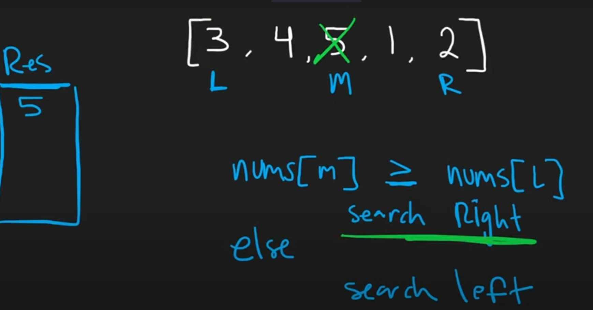
```python
class Solution:  
    def findMin(self, nums: List[int]) -> int:  
        res = nums[0]  
        l, r = 0, len(nums) - 1  
  
        while l <= r:  
            if nums[l] < nums[r]:  
                res = min(res, nums[l])  
                break  
  
            m = l + (r - l) // 2  
            res = min(res, nums[m])  
            if nums[m] >= nums[l]:  
                l = m + 1  
            else:  
                r = m - 1  
  
        return res
```
[Search In Rotated Sorted Array](https://leetcode.com/problems/search-in-rotated-sorted-array/)
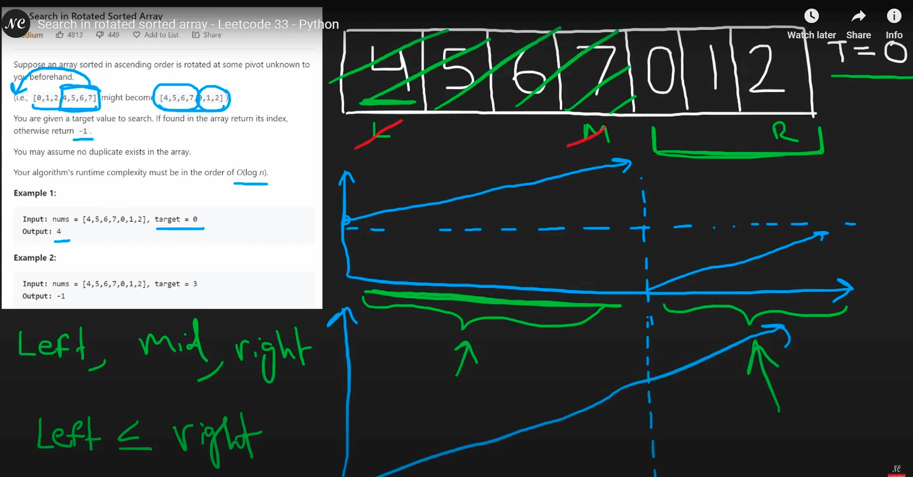
```python
# 2 3 4 0 1 left sorted
# 3 4 0 1 2 right sorted
class Solution:  
    def search(self, nums: List[int], target: int) -> int:  
        l, r = 0, len(nums) - 1  
  
        while l <= r:  
            mid = l + (r - l) // 2  
            if nums[mid] == target:  
                return mid  
  
            # left sorted portion  
            if nums[l] <= nums[mid]:  
                if target > nums[mid] or target < nums[l]:  
                    l = mid + 1  
                else:  
                    r = mid - 1  
            # right sorted portion  
            else:  
                if target < nums[mid] or target > nums[r]:  
                    r = mid - 1  
                else:  
                    l = mid + 1  
        return -1
```
[Time Based Key Value Store](https://leetcode.com/problems/time-based-key-value-store/)
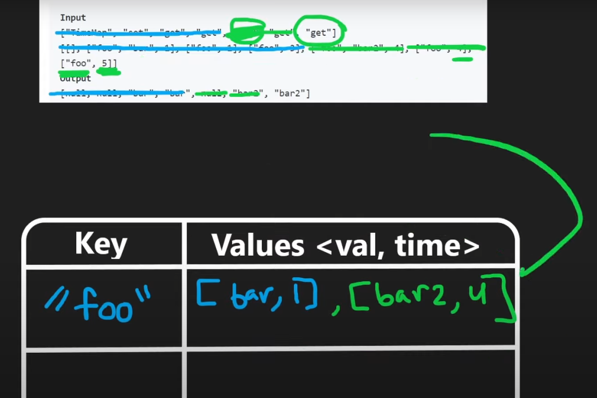
```python
class TimeMap:  
    def __init__(self):  
        self.dict = {} # key: list of [value, timestamp]  
    def set(self, key: str, value: str, timestamp: int) -> None:  
        # already sorted  
        if key not in self.dict:  
            self.dict[key] = []  
        self.dict[key].append([value, timestamp])  
    def get(self, key: str, timestamp: int) -> str:  
        values = self.dict.get(key, [])  
        # find in binary search  
        l, r = 0, len(values) - 1  
        while l <= r: # equal to get last value  
            mid = l + (r - l) // 2  
            if values[mid][1] <= timestamp:  
                # Find the last element less than or equal to the given value  
                if (mid == len(values) - 1) or values[mid + 1][1] > timestamp:  
                    return values[mid][0]  
                else:  
                    l = mid + 1  
            else:  
                r = mid - 1  
        return ''
```
### Sliding Window
[Best Time to Buy And Sell Stock](https://leetcode.com/problems/best-time-to-buy-and-sell-stock/)

```python
class Solution:  
    def maxProfit(self, prices: List[int]) -> int:  
        l, r = 0, 1  
        maxP = 0  
        while r < len(prices):  
            if prices[l] < prices[r]:  
                profit = prices[r] - prices[l]  
                maxP = max(maxP, profit)  
            else:  
                l = r  
            r += 1  
        return maxP
```
Longest non-repeating substring. For example, abcabcddd outputs abc
```python
class Solution:  
    def lengthOfLongestSubstring(self, s: str) -> int:  
        charSet = set()  
        l = 0  
        res = 0  
        for r in range(len(s)):  
            # If 'a' already exists, remove from the left because we want to find a non-repeating substring
            while s[r] in charSet:  
                charSet.remove(s[l])  
                l += 1  
            charSet.add(s[r])  
            res = max(res, r - l + 1)  
        return res
```
[Longest Repeating Character Replacement](https://leetcode.com/problems/longest-repeating-character-replacement/)
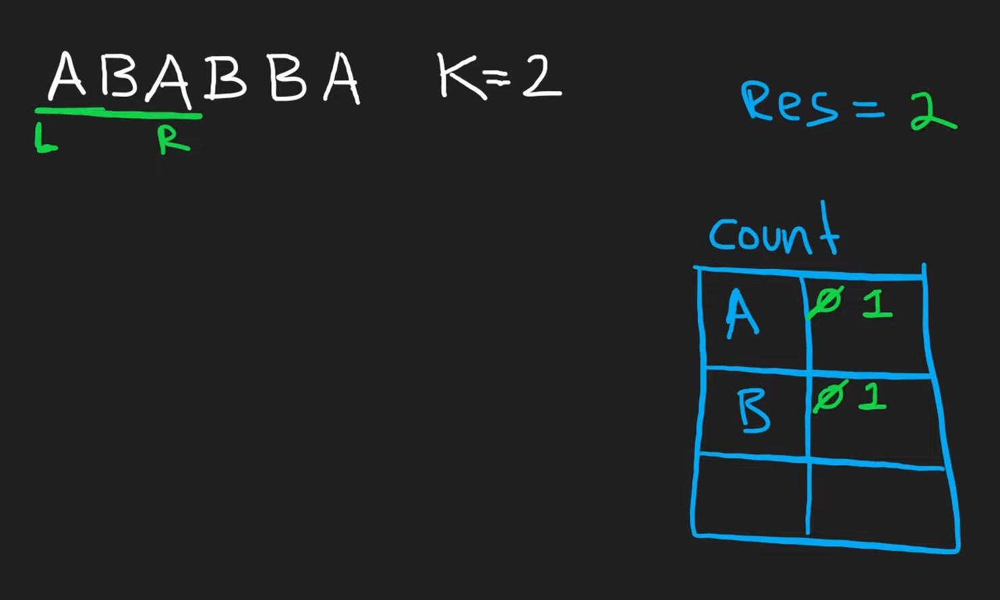
```python
class Solution:  
    def characterReplacement(self, s: str, k: int) -> int:  
        count = {}  
        res = 0  
        l = 0  
        for r in range(len(s)):  
            # add count of right char  
            count[s[r]] = 1 + count.get(s[r], 0)  
            # not effective window  
            while (r - l + 1) - max(count.values()) > k:  
                count[s[l]] -= 1 # add count of left char  
                l += 1 # move the left cursor  
            # effective window            res = max(res, r - l + 1)  
        return res
```
[Permutation In String](https://leetcode.com/problems/permutation-in-string/)

```python
# A character finding game, order doesn't matter.
# Simplest: traverse two arrays, compare one by one, complexity is n*m
# Optimization: Since there are only 26 characters, you can create a hashmap. When the sliding window moves, check if it exists in the hashmap, and then compare with array a to see if they are equal. Complexity is n.
class Solution:  
    def checkInclusion(self, s1: str, s2: str) -> bool:  
        if len(s1) > len(s2): return False  
        # Initialize hashmap  
        s1Count, s2Count = [0] * 26, [0]*26  
        # Count initial occurrences  
        for i in range(len(s1)):  
            s1Count[ord(s1[i]) - ord('a')] += 1 # Count occurrences  
            s2Count[ord(s2[i]) - ord('a')] += 1  
  
        # If a match is found, it should be 26, because the others are initialized to 0  
  
        # Count initial matches  
        matches = 0  
        for i in range(26):  
            matches += (1 if s1Count[i] == s2Count[i] else 0)  
  
        # Move the sliding window one position to the right  
        l = 0  
        for r in range(len(s1), len(s2)): # Parameter 2 is the end index  
            if matches == 26: return True # Found a matching character  
  
            # Add right character to check for match  
            index = ord(s2[r]) - ord('a')  
            s2Count[index] += 1 # Match count plus 1  
            if s1Count[index] == s2Count[index]:  
                matches += 1  
            elif s1Count[index] + 1 == s2Count[index]: # Because s2Count was incremented by 1, s1Count needs to be incremented by 1 for comparison  
                matches -= 1  
  
            # Remove left character, calculate match  
            index = ord(s2[l]) - ord('a')  
            s2Count[index] -= 1 # Match count minus 1  
            if s1Count[index] == s2Count[index]:  
                matches += 1  
            elif s1Count[index] - 1 == s2Count[index]: # Because s2Count was decremented by 1, s1 also needs to be decremented by 1 for comparison  
                matches -= 1  
            l += 1 # Left pointer moves  
        return matches == 26
```
Simple version
```python
# The sliding window pointer is only i,
# The only thing we care about any particular substring in `s2` is having the same number of characters as in the `s1`. So we create a hashmap with the count of every character in the string `s1`. Then we slide a window over the string `s2` and decrease the counter for characters that occurred in the window. As soon as all counters in the hashmap get to zero that means we encountered the permutation.
class Solution:  
    def checkInclusion(self, s1: str, s2: str) -> bool:  
        def checkInclusion(self, s1: str, s2: str) -> bool:  
			# Initially, all non-matches are 1
            cntr, w = Counter(s1), len(s1)  
  
            for i in range(len(s2)):  
	            # 1 means mismatch, 0 means match
                if s2[i] in cntr:  # Right pointer finds a match, decrement by 1
                    cntr[s2[i]] -= 1  
                if i >= w and s2[i - w] in cntr: # Left pointer moves out of the sliding window, mismatch, increment by 1
                    cntr[s2[i - w]] += 1  
				# Finally, if all are 0, it means a match is found
                if all([cntr[i] == 0 for i in cntr]):
                    return True  
  
            return False
```
```python
def test(s1, s2):
    s1_count = [0] * 26
    s2_count = [0] * 26
    len1 = len(s1)
    len2 = len(s2)
    if len1 > len2: 
        return False
    '''
        s1: ab
        s2: aefbaad
        s1_count:
        {
            1: 2, 'a'
            2: 1, 'b'
        }
        s2_count:
        {
            1: 2, 'a'
            8: 1, 'e'
        }
    '''
    for i in range(len1):
        s1_count[ord(s1[i]) - ord('a')] += 1
        s2_count[ord(s2[i]) - ord('a')] += 1
    
    for i in range(len2 - len1):  # Sliding distance 0-4 
        if s1_count == s2_count: # If the counts are the same, it's a substring
            return True
        # Move window length
        s2_count[ord(s2[i]) - ord('a')] -= 1 # Remove the leftmost character, count -1
        s2_count[ord(s2[i + len1] - ord('a'))] += 1 # Add 1 character from the right
    # Finally, check this one ad
    return s1_count == s2_count
```
### LinkedList
[Reverse Linked List](https://leetcode.com/problems/reverse-linked-list/)
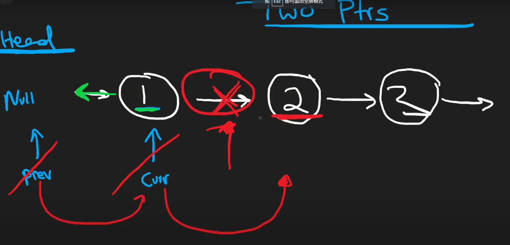
```text
Incorrect approach:
1. Moving two pointers in one operation
2. The writing is incorrect: curr.next = curr
```
```python
# Definition for singly-linked list.  
# class ListNode:  
#     def __init__(self, val=0, next=None):  
#         self.val = val  
#         self.next = next  
# Definition for singly-linked list.  
# class ListNode:  
#     def __init__(self, val=0, next=None):  
#         self.val = val  
#         self.next = next
# Two-pointer method
# None <- a <- b There is a None sentinel pointer in front
class Solution:  
    def reverseList(self, head: Optional[ListNode]) -> Optional[ListNode]:  
        prev, curr = None, head  
        while curr:  # Modify the pointer only once per loop
            next = curr.next  # Save the previous pointer to avoid breaking the pointer
            # Modifying the pointer curr.next = curr is incorrect
            curr.next = prev  
            # Move the pointer forward
            prev = curr  
            curr = next  
        return prev
```
 [Merge Two Sorted Lists](https://leetcode.com/problems/merge-two-sorted-lists/)

```python
# Definition for singly-linked list.  
# class ListNode:  
#     def __init__(self, val=0, next=None):  
#         self.val = val  
#         self.next = next  
class Solution:  
    def mergeTwoLists(self, list1: Optional[ListNode], list2: Optional[ListNode]) -> Optional[ListNode]:  
        dummy = ListNode()  
        tail = dummy  
        while list1 and list2:  
            if list1.val < list2.val:  
                tail.next = list1  
                list1 = list1.next  
            else:  
                tail.next = list2  
                list2 = list2.next  
            tail = tail.next  
        if list1:  
            tail.next = list1  
        else:  
            tail.next = list2  
        return dummy.next
```
[Reorder List](https://leetcode.com/problems/reorder-list/)

```python
# slow, fast pointer and dummy node
class Solution:  
    def reorderList(self, head: Optional[ListNode]) -> None:  
        class Solution:  
            def reorderList(self, head: Optional[ListNode]) -> None:  
                # find middle  
                slow, fast = head, head.next  
                while fast and fast.next:  
                    slow = slow.next  
                    fast = fast.next.next  
  
                # reverse second half  
                second = slow.next  
                prev = slow.next = None  
                while second:  
                    tmp = second.next  
                    second.next = prev  
                    prev = second  
                    second = tmp  
  
                # merge tow half  
                first, second = head, prev  
                while second:  
                    tmp1, tmp2 = first.next, second.next  
                    first.next = second  
                    second.next = tmp1  
                    first, second = tmp1, tmp2
```
[Remove Nth Node From End of List](https://leetcode.com/problems/remove-nth-node-from-end-of-list/)
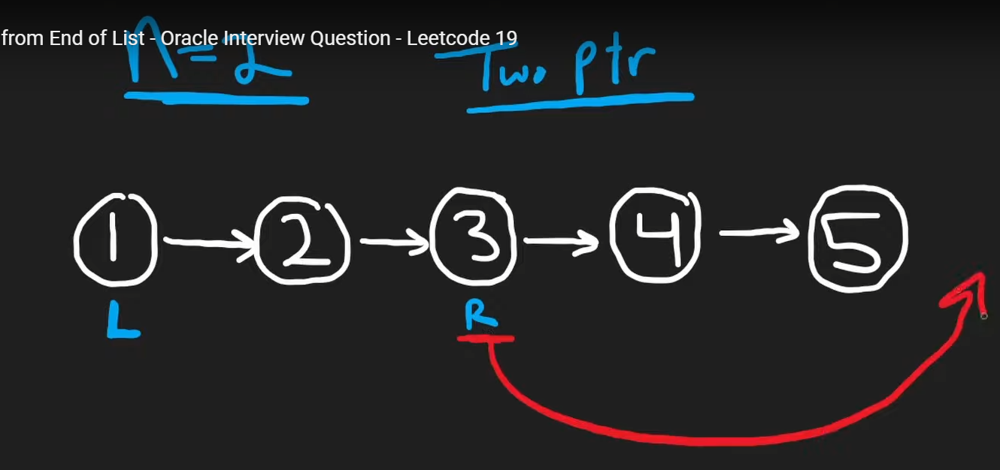
```text
Incorrect example:
1. Fast and slow pointers don't necessarily have to move at the same time. One can stay still while the fast pointer moves to the specified position first.
```
```python
# slow, fast pointer and dummy node  
class Solution:  
    def removeNthFromEnd(self, head: Optional[ListNode], n: int) -> Optional[ListNode]:  
        dummy = ListNode(0, head)  
        left = dummy  
        right = head  
        while n > 0 and right:  
            right = right.next  
            n -= 1  
  
        while right:  
            left = left.next  
            right = right.next  
  
        # delete  
        left.next = left.next.next  
  
        return dummy.next
```
[Copy List With Random Pointer](https://leetcode.com/problems/copy-list-with-random-pointer/)
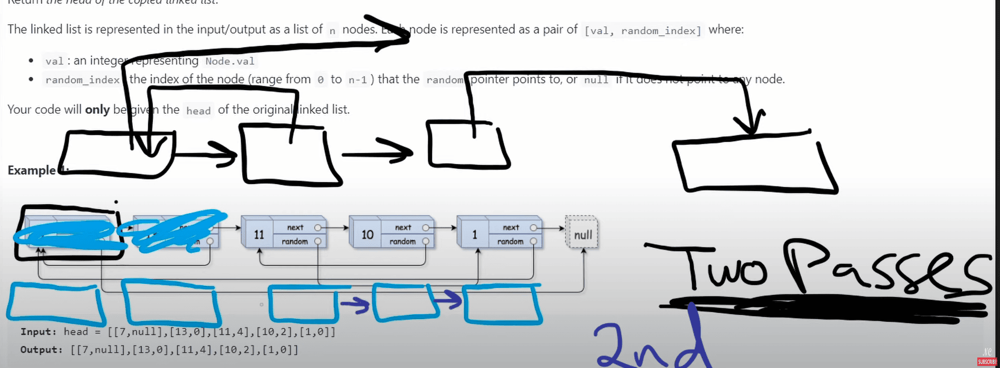
```python
# Create nodes first, then connect them (create a hashmap to establish the connection between the two linked lists)
class Solution:  
    def copyRandomList(self, head: 'Optional[Node]') -> 'Optional[Node]':  
        oldToCopy = { None : None }  
  
        # one pass  
        cur = head  
        while cur:  
            copy = Node(cur.val)  
            oldToCopy[cur] = copy  
            cur = cur.next  
  
        # two pass  
        cur = head  
        while cur:  
            copy = oldToCopy[cur]  
            copy.next = oldToCopy[cur.next]  
            copy.random = oldToCopy[cur.random]  
            cur = cur.next  
  
        return oldToCopy[head]
```
[Add Two Numbers](https://leetcode.com/problems/add-two-numbers/)
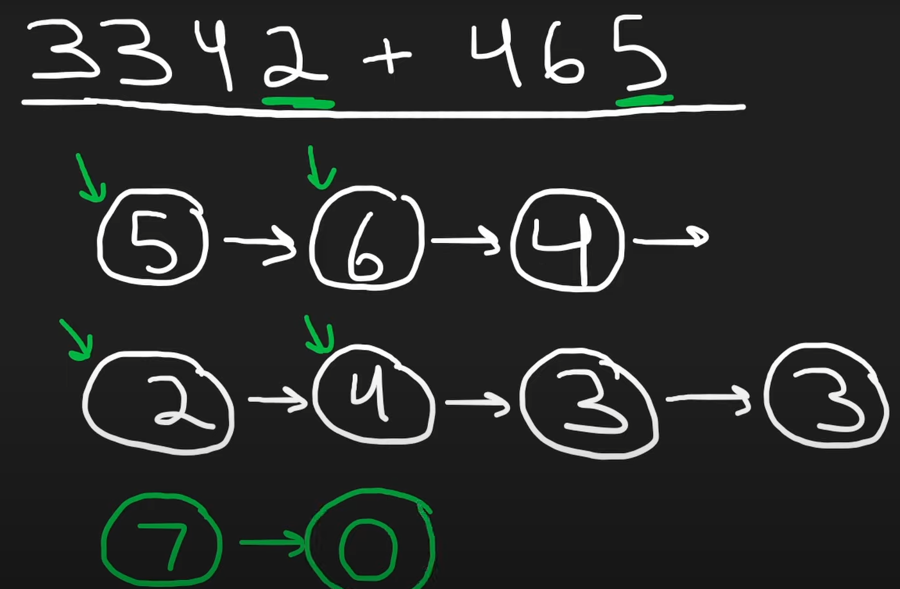
```python
# Consider boundary cases like 7 + 8
class Solution:  
    def addTwoNumbers(self, l1: Optional[ListNode], l2: Optional[ListNode]) -> Optional[ListNode]:  
        dummy = ListNode()  
        cur = dummy  
        carry = 0  
        while l1 or l2 or carry:  
            v1 = l1.val if l1 else 0  
            v2 = l2.val if l2 else 0  
            # new digit  
            val = v1 + v2 + carry  
            carry = val // 10  
            val = val % 10  
            cur.next = ListNode(val) # create new node  
                        # update ptrs  
            cur = cur.next  
            l1 = l1.next if l1 else None  
            l2 = l2.next if l2 else None  
            return dummy.next
```
[Linked List Cycle](https://leetcode.com/problems/linked-list-cycle/)
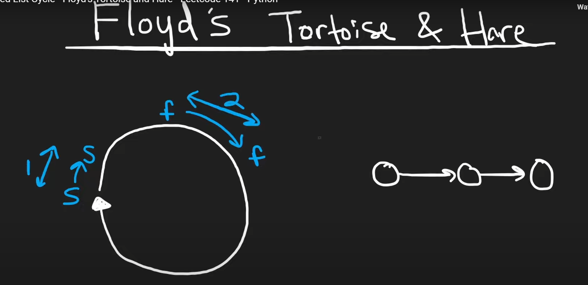
```python
# Or use fast and slow pointers 
class Solution:  
    def hasCycle(self, head: Optional[ListNode]) -> bool:  
        cur = head  
  
        visited = {}  
        while cur:  
            if cur in visited: return True  
            visited[cur] = True  
            cur = cur.next  
  
        return False
```
[Find The Duplicate Number](https://leetcode.com/problems/find-the-duplicate-number/)
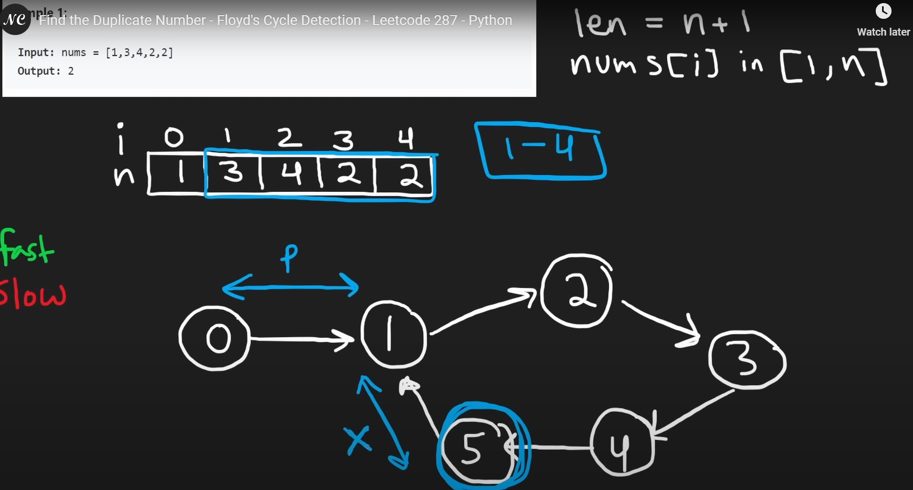
```python
class Solution:  
    def findDuplicate(self, nums: List[int]) -> int:  
        # The values in the array are [1,n], 0 is not in the array, so the array values can be used as pointers.  
        # It's essentially a cycle if there are duplicate elements.  
        # How to find the first duplicate element: using Floyd's algorithm, p (distance for the slow pointer to reach the start of the cycle) = x (distance from the intersection point to the start of the cycle).  
        slow, fast = 0, 0  
        # Find the intersection point  
        while True:  
            slow = nums[slow]  
            fast = nums[nums[fast]]  
            if slow == fast:  
                break  
        # Floyd's algorithm  
        slow2 = 0  
        while True:  
            slow = nums[slow] # Move forward from the intersection point  
            slow2 = nums[slow2] # Move forward from the starting point  
            if slow == slow2:  
                return slow
```
[LRU Cache](https://leetcode.com/problems/lru-cache/)
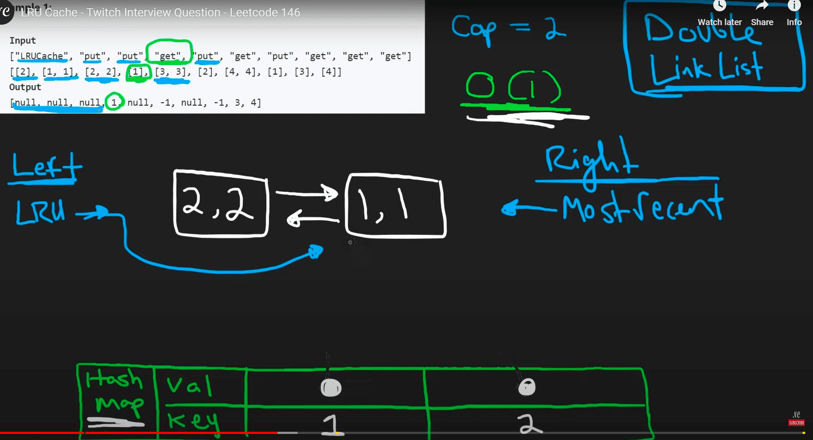
```python
class Node:  
    def __init__(self, key, val):  
        self.key, self.val = key, val  
        self.next = self.prev = None  # It's a doubly linked list  
  
  
class LRUCache:  
  
    def __init__(self, capacity: int):  
        self.cap = capacity  
        self.cache = {}  # A hashmap for quick node lookup, and also to check the queue length  
        # left:LRU right:MRU  
        self.left, self.right = Node(0, 0), Node(0, 0)  # Points to the first node on the left, points to the first node on the right, for fast insertion and deletion, and it's a doubly linked list  
        self.left.next = self.right  # Note that the forward and backward pointers need to be updated here  
        self.right.prev = self.left  
  
    # Remove an element from the queue  
    def remove(self, node):  
        prev, nxt = node.prev, node.next  # Get the previous and next nodes first  
        prev.next = nxt  
        nxt.prev = prev  
  
    # Insert at the end of the queue  
    def insert(self, node):  
        prev, nxt = self.right.prev, self.right  
        prev.next = nxt.prev = node  
        node.prev, node.next = prev, nxt  
  
    def get(self, key: int) -> int:  
        if key in self.cache:  
            # Remove the element from its original position  
            self.remove(self.cache[key])  
            # Insert the element at the end  
            self.insert(self.cache[key])  
            return self.cache[key].val  # Note that the return value is here  
        return -1  
  
    def put(self, key: int, value: int) -> None:  
        if key in self.cache:  # Note that we are checking if the key exists, not if self.cache[key] exists  
            # Remove the element  
            self.remove(self.cache[key])  
        # Update the value, note that a new node is created directly here  
        self.cache[key] = Node(key, value)  
        # Insert the new value at the end  
        self.insert(self.cache[key])  
  
        # Check if the queue is full  
        if len(self.cache) > self.cap:  
            # Remove the last element on the left  
            lru = self.left.next  
            self.remove(lru)  
            # Remove from the cache  
            del self.cache[lru.key]
```
### Tree
[Invert Binary Tree](https://leetcode.com/problems/invert-binary-tree/)
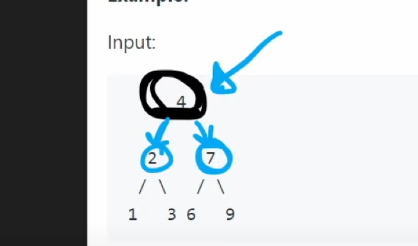
```text
Incorrect example:
1. You need a temp to save the value of the pointer you are about to move. Otherwise, if you point the pointer directly to another place, you will lose the original value.
2. You can swap the left and right subtrees first, you don't have to wait until you reach the leaf nodes to swap.
3. The recursive call must be on the left and right subtrees, you cannot just recurse on the left or right subtree.
def test(root):
    if not root:
        return root
    temp = root.left
    root.left = root.right
    root.right = temp
    this.test(root.left)
    this.test(root.right)
```
```python
class Solution:  
    def invertTree(self, root: Optional[TreeNode]) -> Optional[TreeNode]:  
        if not root:  
            return root  
        temp = root.left  
        root.left = root.right  
        root.right = temp  
        self.invertTree(root.left)  
        self.invertTree(root.right)  
        return root
```
 [Maximum Depth of Binary Tree](https://leetcode.com/problems/maximum-depth-of-binary-tree/)
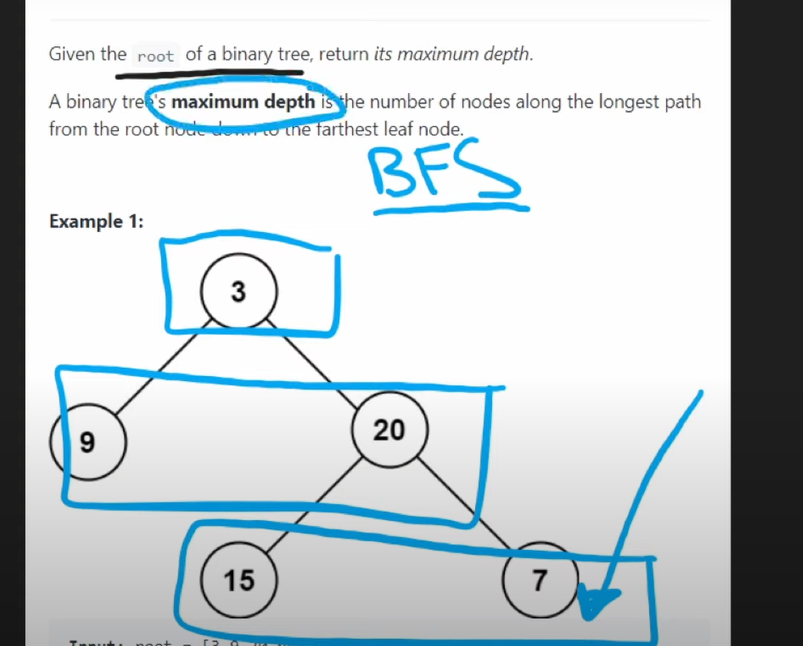
**This is the best example for understanding tree traversal.**
```python
# DFS
class Solution:  
    def maxDepth(self, root: Optional[TreeNode]) -> int:  
        if not root:  
            return 0  
        return 1 + max(self.maxDepth(root.left), self.maxDepth(root.right))
# Level-order traversal, no recursive calls
"""
A deque is used to store the data of each level. Initially, the root node is pushed into the queue. When the root node is popped, its left and right child nodes are pushed in. 
After the above is done, it is exactly level 1, which means **the nodes of the previous level must be processed before processing the nodes of the next level**
q = deque([root])
while q: 
    for i in range(len(q)):
        node = q.popleft()
        if node.left:
            q.append(node.left)
        if node.right:
            q.append(node.right)        
Level-order traversal is also BFS, Breadth-First Search
"""
class Solution:  
    def maxDepth(self, root: Optional[TreeNode]) -> int:  
        if not root:  
            return 0  
        q = deque([root])  # deque
        level = 0  
        # Queue is not empty  
        while q:  
            # Must process the nodes of the previous level before processing the nodes of the next level 
            for i in range(len(q)):  
                node = q.popleft()  
                if node.left:  
                    q.append(node.left)  
                if node.right:  
                    q.append(node.right)  
    
            level += 1  
  
        return level
# Iterative method, pre-order traversal
class Solution:  
    def maxDepth(self, root: Optional[TreeNode]) -> int:  
        if not root:  
            return 0  
        stack = [[root, 1]]  #
        res = 1  
        while stack:  # The outermost layer must be to check if the queue is empty
            node, depth = stack.pop()  
            if node:  
                res = max(res, depth) 
                stack.append([node.left, depth + 1])  # The depth is the previous node + 1 
                stack.append([node.right, depth + 1])  
        return res
```
[Diameter of Binary Tree](https://leetcode.com/problems/diameter-of-binary-tree/)
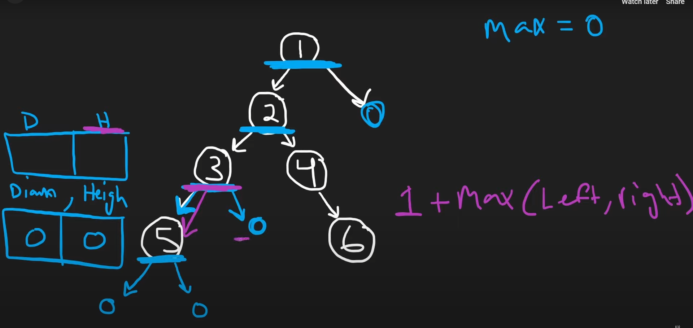
```python
# Essentially related to height, associate height with diameter, traverse from bottom to top
# The brute force solution from top to bottom has a time complexity of O(n) * n
class Solution:  
    def diameterOfBinaryTree(self, root: Optional[TreeNode]) -> int:  
        if not root:  
            return -1  
  
        res = [0]  
  
        # Calculate the height of the subtree  
        def dfs(root):  
            # nonlocal res If using a value, it needs to be declared as nonlocal  
            if not root:  
                return -1  # Because a single node is 0  
  
            left = dfs(root.left)  
            right = dfs(root.right)  
            res[0] = max(res[0], left + right + 2)  # left + right + 2 is the diameter or maximum edge of the current node  
  
            return 1 + max(left, right)  
  
        dfs(root)  
        return res[0]
```
[Balanced Binary Tree](https://leetcode.com/problems/balanced-binary-tree/)

```python
class Solution:  
    def isBalanced(self, root: Optional[TreeNode]) -> bool:  
        if not root:  
            return True  
  
        def dfs(root):  
            if not root:  
                return [True, -1]  
            left = dfs(root.left)  
            right = dfs(root.right)  
            balanced = left[0] and right[0] and abs(left[1] - right[1]) <= 1  # Note that here we also need to check if the left and right subtrees are balanced, so that the balance of the top node represents whether the entire tree is balanced  
            return [balanced, 1 + max(left[1], right[1])]  
  
        return dfs(root)[0]
```
[Same Tree](https://leetcode.com/problems/same-tree/)
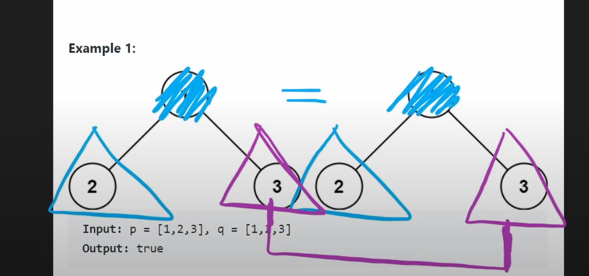
```python
class Solution:  
    def isSameTree(self, p: Optional[TreeNode], q: Optional[TreeNode]) -> bool:  
        # Compare whether the values of a single node are equal, and then compare the leaf trees (judging whether the leaf trees are equal becomes the same subproblem, which can be judged by recursive calls)  
  
        # Compare a single node  
        if not p and not q:  
            return True  
        if not p or not q or p.val != q.val:  
            return False  
  
        # The node values are equal, then judge the leaf trees (judge as a whole)  
        return self.isSameTree(p.left, q.left) and self.isSameTree(p.right, q.right)
```
```python
from collections import deque
def isSameTree(tr1: TreeNode, tr2: TreeNode) -> bool:
    if not tr1 and not tr2:
        return True
    if not tr1 or not tr2:
        return False
    s = deque([(tr1, tr2)])
    while s:
        n1, n2 = s.popleft()
        # Are the current node values the same?
        if n1.val != n2.val:
            return False
        # Check the left subtree: the idea here can be simpler, if one is empty and the other is not, it must return false. If both are empty, there is no need to append.
        if n1.left and not n2.left or not n1.left and n2.left:
            return False
        elif n1.left and n2.left:
            s.append((n1.left, n2.left))
        # Check the right subtree
        if n1.right and not n2.right or not n1.right and n2.right:
            return False
        elif n1.right and n2.right:
            s.append((n1.right, n2.right))
    return True
```
[Subtree of Another Tree](https://leetcode.com/problems/subtree-of-another-tree/)
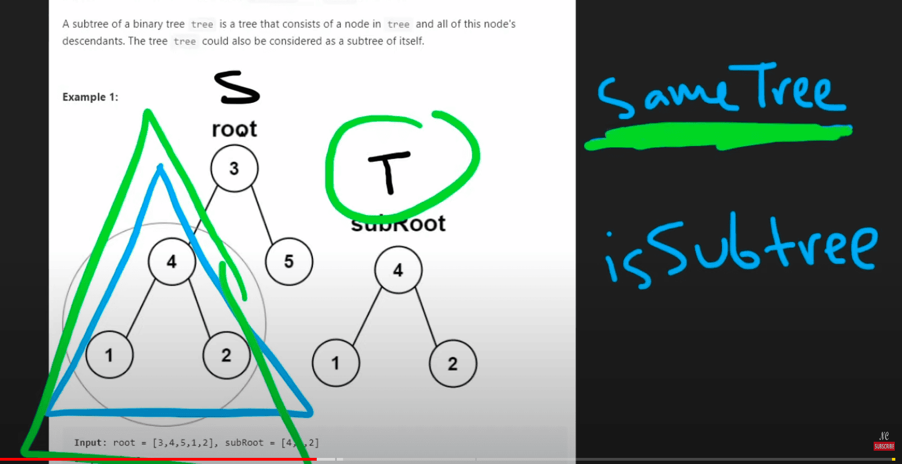
```python
class Solution:  
    def isSubtree(self, root: Optional[TreeNode], subRoot: Optional[TreeNode]) -> bool:  
        if not subRoot: return True  
        if not root: return False  
  
        def isSameTree(p, q):  
            if not p and not q:  
                return True  
            if not p or not q or p.val != q.val:  
                return False  
  
                # Node values are equal, then judge the leaf trees (judge as a whole)    
return isSameTree(p.left, q.left) and isSameTree(p.right, q.right)  
  
        # Judge the current node  
        if isSameTree(root, subRoot):  
            return True  
  
        # Recursively judge whether the left and right subtrees are subtrees   
# Note that here we are not judging whether the left and right subtrees are the sameTree, because the left and right subtrees are the same type of subproblem at this time (consider the problem recursively)  
        return (self.isSubtree(root.left, subRoot) or self.isSubtree(root.right, subRoot))
```
[Lowest Common Ancestor of a Binary Search Tree](https://leetcode.com/problems/lowest-common-ancestor-of-a-binary-search-tree/)
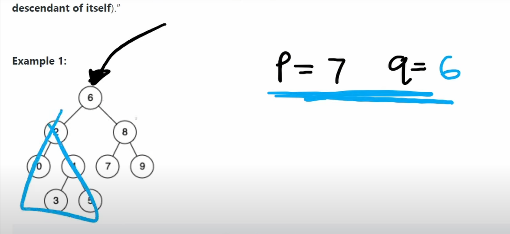
```python
# Note: It is said here that it is a binary search tree, so there is no need to consider the path of each node.  
# Just use a pointer to judge downwards. You don't have to traverse the tree every time.
# Start from the problem, not from the inherent thinking.
class Solution:  
    def lowestCommonAncestor(self, root: 'TreeNode', p: 'TreeNode', q: 'TreeNode') -> 'TreeNode':  
        cur = root  
        while cur:  
            # [7,9]  
            if p.val > cur.val and q.val > cur.val:  
                cur = cur.right  
            # [0, 4]  
            elif p.val < cur.val and q.val < cur.val:  
                cur = cur.left   
            # [6, 7]     
else:  
                return cur
```
[Binary Tree Level Order Traversal](https://leetcode.com/problems/binary-tree-level-order-traversal/)
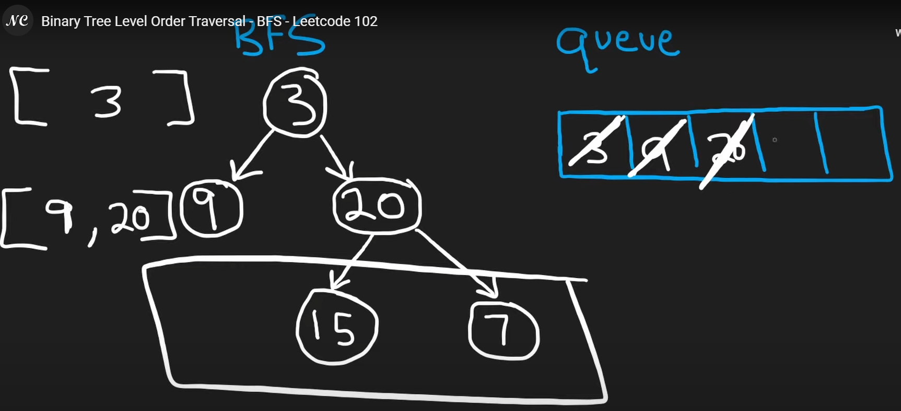
```python
class Solution:  
    def levelOrder(self, root: Optional[TreeNode]) -> List[List[int]]:  
        if not root:  
            return []  
        if not root.left and not root.right:  
            return [[root.val]]  
  
        dq = deque([root])  
  
        res = []  
        while dq:  
            levelArr = []  
            for i in range(len(dq)):  
                node = dq.popleft()  
                levelArr.append(node.val)  
                if node.left:  
                    dq.append(node.left)  
                if node.right:  
                    dq.append(node.right)  
            res.append(levelArr)  
  
        return res
```
[Binary Tree Right Side View](https://leetcode.com/problems/binary-tree-right-side-view/)

```python
class Solution:  
    def rightSideView(self, root: Optional[TreeNode]) -> List[int]:  
        if not root:  
            return None  
  
        dq = deque([root]) # ?? 
        res = []  
        while dq:  
            # level  
            rightSide = None  
            for i in range(len(dq)):  
                node = dq.popleft()  ## ?
                rightSide = node  # Use a variable to save the last value, no need to judge whether it is the last element because the for loop will automatically execute to the end
                if node.left:  
                    dq.append(node.left)  
                if node.right:  
                    dq.append(node.right)  
            res.append(rightSide.val)  
        return res
```
[Count Good Nodes In Binary Tree](https://leetcode.com/problems/count-good-nodes-in-binary-tree/)

```python
class Solution:  
    def goodNodes(self, root: TreeNode) -> int:  
        # At first glance, it requires a deep traversal, but one point is to get the node with the current maximum value through pre-order traversal. If subsequent nodes are smaller than it, they are definitely not good nodes.  
  
        def dfs(root, maxVal):  
            if not root:  
                return 0 # Empty node  
            res = 1 if root.val >= maxVal else 0   # Calculate the number of good nodes  
            maxv = max(root.val, maxVal)  
            res += dfs(root.left, maxv) # Recursively calculate the number of good nodes in the subtree  
            res += dfs(root.right, maxv)  
            return res  
  
        return dfs(root, root.val) # The root node is always a good node
```
```python
class Solution:  
    def isValidBST(self, root: Optional[TreeNode]) -> bool:  
        # Note: Look carefully at the boundary cases, you will find that you cannot simply compare the relationship between the left and right subtrees and the parent node.  
        # The definition of BST is that all nodes in the right subtree must be greater than the node.  
        # All right subtrees need to treat the node as the left interval.  
  
        def dfs(root, left, right):  
            if not root:  
                return True  
            if not (root.val < right and root.val > left):  
                return False  
            return dfs(root.left, left, root.val) and dfs(root.right, root.val, right) # Here left is the left interval of the current node  
        return dfs(root, float('-inf'), float('inf'))
```
[Kth Smallest Element In a Bst](https://leetcode.com/problems/kth-smallest-element-in-a-bst/)
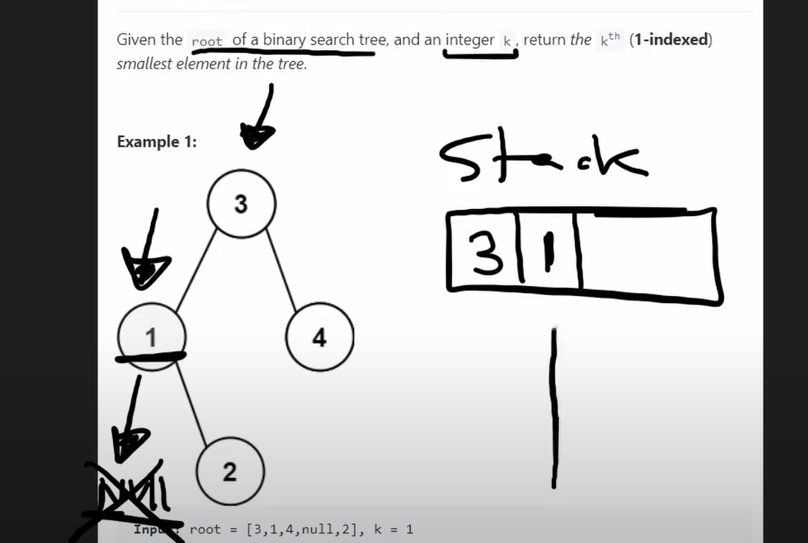
```python
class Solution:  
    def kthSmallest(self, root: Optional[TreeNode], k: int) -> int:  
        # This is a BST, so you will definitely think of in-order traversal, the output is just sorted.  
        # Because there is a stack, you can use the iterative method here.  
        stack = []  
        cur = root  
        num = 0  
        while cur or stack:  # Here is an or judgment, as long as one exists  
            while cur:  
                stack.append(cur)  
                cur = cur.left  
  
            # Process the node  
            cur = stack.pop()  # Here pop out is from small to large  
            num += 1  
            if num == k:  
                return cur.val  
  
            cur = cur.right
```
[Construct Binary Tree From Preorder And Inorder Traversal](https://leetcode.com/problems/construct-binary-tree-from-preorder-and-inorder-traversal/)
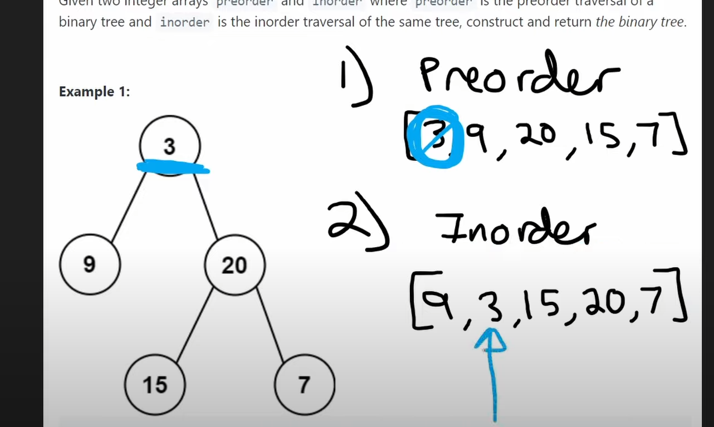
```python
class Solution:  
    def buildTree(self, preorder: List[int], inorder: List[int]) -> Optional[TreeNode]:  
        # The node of the preorder traversal must be the root node. Then divide the left and right subtrees through the inorder traversal.  
  
        # Note that you need to check for the empty case here.  
        if not preorder or not inorder:  
            return None  
  
        # Create the root node  
        root = TreeNode(preorder[0])  
        mid = inorder.index(preorder[0])  
        # Recursively create the left and right subtrees  
        root.left = self.buildTree(preorder[1:mid + 1], inorder[:mid]) # Note that mid+1 is not included here. Here, the nodes of the inorder and preorder are divided.  
        root.right = self.buildTree(preorder[mid+1:], inorder[mid+1:])  
        return root
```
Given an integer `N`, find the total number of unique binary search trees (BSTs) that can be made with values from `1` to `N`.
- **Input**: `n = 3`  
  **Output**: `5`  
  **Explanation**: For `n = 3`, the possible preorder traversal results are:
  1. `1 2 3`
  2. `1 3 2`
  3. `2 1 3`
  4. `3 1 2`
  5. `3 2 1`
- **Input**: `n = 4`  
  **Output**: `14`
A BST (Binary Search Tree) is a special type of binary tree that satisfies the following conditions:
- The value of each node is less than the values of all nodes in its right subtree.
- The value of each node is greater than the values of all nodes in its left subtree.
For example, for the set of nodes `{1, 2, 3}`, the following different BSTs can be constructed:
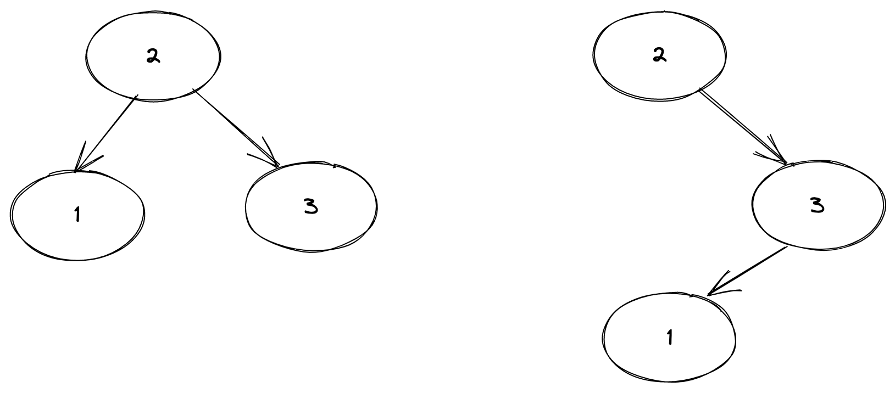
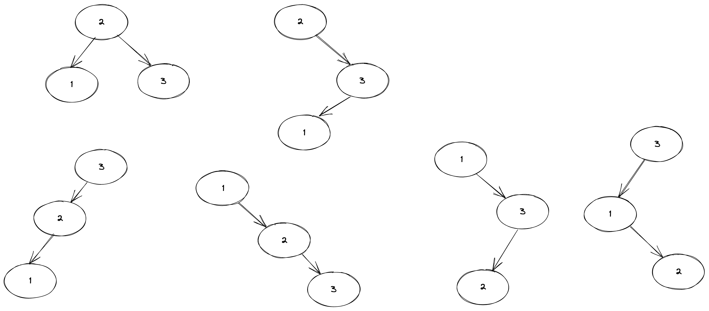
To calculate the number of unique BSTs with `n` nodes, we can solve the problem using recursion and dynamic programming.
1. **Base Cases**:
   - When `n = 1`, there is only one node, so there is obviously only one case: `T(1) = 1`.
   - When `n = 2`, there are two nodes, and there are two cases: `T(2) = 2`.
2. **General Case**:
   - Suppose there are currently `n` nodes, and we choose a node `i` as the root.
     - The left subtree contains all nodes smaller than `i` (i.e., `1` to `i-1`), with a total of `T(i-1)` combinations.
     - The right subtree contains all nodes larger than `i` (i.e., `i+1` to `n`), with a total of `T(n-i)` combinations.
     - Therefore, the total number of BSTs with `i` as the root is: `T(i-1) * T(n-i)`.
   - By traversing all possible root nodes `i` (from `1` to `n`) and summing the results, we can get the total number:
     \[
     T(n) = \sum_{i=1}^{n} T(i-1) \times T(n-i)
     \]
- **When `n = 3`**:
  - Assume `1` is the root node: `T(0) * T(2) = 1 * 2 = 2`.
  - Assume `2` is the root node: `T(1) * T(1) = 1 * 1 = 1`.
  - Assume `3` is the root node: `T(2) * T(0) = 2 * 1 = 2`.
  - The total number is: `2 + 1 + 2 = 5`.
- **When `n = 4`**:
  - Assume `1` is the root node: `T(0) * T(3) = 1 * 5 = 5`.
  - Assume `2` is the root node: `T(1) * T(2) = 1 * 2 = 2`.
  - Assume `3` is the root node: `T(2) * T(1) = 2 * 1 = 2`.
  - Assume `4` is the root node: `T(3) * T(0) = 5 * 1 = 5`.
  - The total number is: `5 + 2 + 2 + 5 = 14`.
Method 1: Brute-force Recursion
Calculate the case for each node as the root using recursion. The following is a JavaScript implementation:
```javascript
// i is the root, n is the total nodes' number
const G = (i, n) => {
  return fn(i - 1) * fn(n - i);
};
// Get the total number of BST trees with n nodes.
const fn = (n) => {
  let _ = 0;
  if (n === 0 || n === 1) return 1;
  for (let i = 1; i <= n; i++) {
    _ += G(i, n);
  }
  return _;
};
console.log(fn(3)); // Output: 5
```
The recursion tree is as follows:
```
f(3)
├── G(1,3) -> f(0) * f(2)
├── G(2,3) -> f(1) * f(1)
└── G(3,3) -> f(2) * f(0)
```
As you can see, `f(1)` and `f(2)` are repeatedly calculated, leading to low efficiency.
Method 2: Recursion with Caching
To avoid repeated calculations, we can use a cache to store intermediate results.
```javascript
// get the total number of BST tress with i as the root node
const G = (i, n) => {
  return fn(i - 1) * fn(n - i);
};
const dp = [];
const fn = (n) => {
  let _ = 0;
  if (n === 0 || n === 1) return 1;
  if (dp[n]) {
    console.log("hit cache");
    return dp[n];
  }
  // loop all nodes
  for (let i = 1; i <= n; i++) {
    // add them all
    _ += G(i, n);
  }
  // cache result
  dp[n] = _;
  return _;
};
console.log(fn(3)); // Output: 5
```
Method 3: Dynamic Programming (Optimal Solution)
Build the DP table in a bottom-up manner to avoid recursion overhead.
```javascript
const getNumberOfBSTs = (n) => {
  const T = [];
  T[0] = 1; // Base case: 0 nodes -> 1 BST (empty tree)
  T[1] = 1; // Base case: 1 node -> 1 BST
  for (let i = 2; i <= n; i++) {
    T[i] = 0; // Initialize current value
    for (let j = 1; j <= i; j++) {
      // Calculate the number of BSTs with j as the root
      T[i] += T[j - 1] * T[i - j];
    }
  }
  return T[n]; // Return the result for n nodes
};
console.log(getNumberOfBSTs(3)); // Output: 5
console.log(getNumberOfBSTs(4)); // Output: 14
```
1. **Brute-force Recursion**:
   - Time Complexity: O(2^n), because each recursion splits into two subproblems.
   - Space Complexity: O(n), the depth of the recursion stack.
2. **Recursion with Caching**:
   - Time Complexity: O(n^2), because each state is calculated only once.
   - Space Complexity: O(n), for storing the cache.
3. **Dynamic Programming**:
   - Time Complexity: O(n^2), double loop.
   - Space Complexity: O(n), for storing the DP table.
### Trie
[Implement Trie Prefix Tree](https://leetcode.com/problems/implement-trie-prefix-tree/)
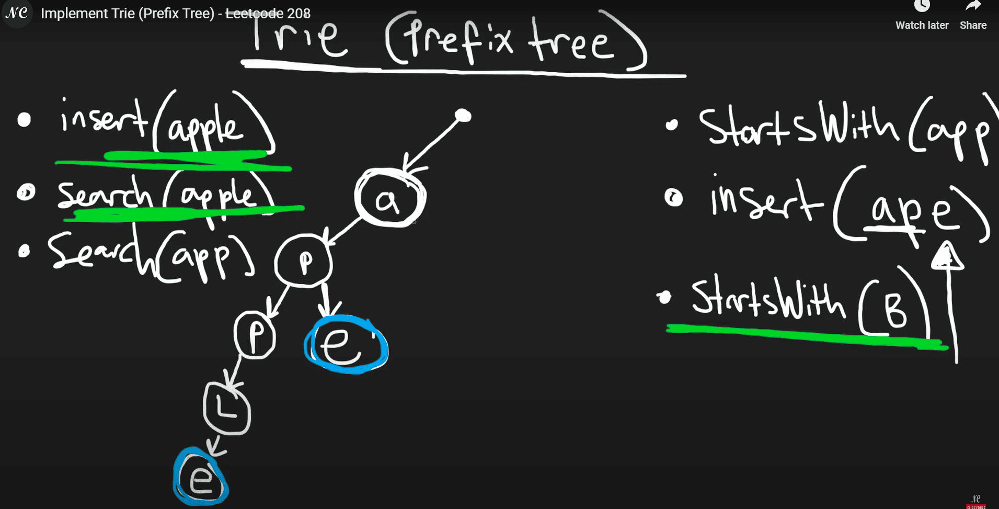
```python
# A prefix tree is particularly efficient for judging string prefixes because the characters at each level are fixed, for example, 26 characters. The time complexity is the size of the character set.
class Trie:  
  
    def __init__(self):  
        self.root = TrieNode()  
  
    def insert(self, word: str) -> None:  
        cur = self.root  
        for c in word:  # Traverse the string  
            if c not in cur.children:  
                cur.children[c] = TrieNode()  
            cur = cur.children[c]  # Move to the next pointer  
        cur.isEndChar = True  
  
    def search(self, word: str) -> bool:  
        cur = self.root  
        for c in word:  
            if c not in cur.children:  
                return False  
            cur = cur.children[c]  
        return cur.isEndChar  # The last character of the string  
  
    def startsWith(self, prefix: str) -> bool:  
        cur = self.root  
        for c in prefix:  
            if c not in cur.children:  
                return False  
            cur = cur.children[c]  
        return True
```
[Design Add And Search Words Data Structure](https://leetcode.com/problems/design-add-and-search-words-data-structure/)

```python
# The sticking point is: how to think recursively to solve the problem. Recursion is essentially determining if it's the same subproblem, and if so, just call it.
class Trie:  
  
    def __init__(self):  
        self.root = TrieNode()  
  
    def insert(self, word: str) -> None:  
        cur = self.root  
        for c in word:  # Traverse the string  
            if c not in cur.children:  
                cur.children[c] = TrieNode()  
            cur = cur.children[c]  # Move to the next pointer  
        cur.isEndChar = True  
  
    def search(self, word: str) -> bool:  
        def isFind(offset, node):  
            cur = node  
            for i in range(offset, len(word)):  
                c = word[i]  
                if c != '.':  
                    if c not in cur.children:  
                        return False  
                    cur = cur.children[c]  
                else:  
                    # Need to check all child nodes 
                    for child in cur.children.values():  
                        if isFind(i + 1, child):  
                            return True  
                    # If no match is found        
                    return False            
	         return cur.isEndChar  
  
        return isFind(0, self.root)  # The last character of the string  
  
  
class WordDictionary:  
  
    def __init__(self):  
        self.trie = Trie()  
  
    def addWord(self, word: str) -> None:  
        self.trie.insert(word)  
  
    def search(self, word: str) -> bool:  
        return self.trie.search(word)
```
### backtracking
[Generate Parentheses](https://leetcode.com/problems/generate-parentheses/)

``` python
# openN < 3, closeN < 3
# openN > closeN can add ')'
# openN == closeN == 3, exit
class Solution:  
    def generateParenthesis(self, n: int) -> List[str]:  
        stack = []  
        res = []  
        # The entire recursive call is the decision tree we drew. The parameters of the recursive call are the two variables we are primarily concerned with, the number of left and right parentheses.
        def backtrack(openN, closeN):  # Backtracking
            if openN == closeN == n:  
                res.append("".join(stack))  # Understand that Python's join first selects a "template" or "glue", and then tells the list "please use it to assemble yourself"
                return  
            # You'll find that backtracking calls the recursive function twice. Each time is a new attempt. And you have to restore the scene.    
            # The restoration of the scene here is the restoration of the stack.
            if openN < n:  
                stack.append('(')  
                backtrack(openN+1, closeN)  
                stack.pop()  # Backtrack to restore the scene, ensuring the state of other recursive branches is correct.
            if openN > closeN:  # The key logic to ensure a valid combination, this actually **prunes** the tree, avoiding recursive calls for invalid combinations.
                stack.append(')')  
                backtrack(openN, closeN+1)  
                stack.pop()  
  
        backtrack(0, 0)  
        return res
```
 [Subsets](https://leetcode.com/problems/subsets/)

```python
class Solution:  
    def subsets(self, nums: List[int]) -> List[List[int]]:  
        # The sticking point here is: not quite understanding backtracking.  
        # Backtracking is actually a recursive tree or decision tree, where each node makes a decision. If you use brute force, the time complexity will be very high.  
        # There are 2^n permutations and combinations, and our array length is n. We need to traverse the array to try every situation, so the time complexity is n * 2^n.  
  
        res = []  
        subsets = []  
        def dfs(i): # Here i represents the index of the array.  
            if i >= len(nums): # This means every element has been decided.  
                res.append(subsets.copy())  # Note that you must use a copy here, because subsets will be modified every time dfs is executed.  
                return  
  
            # Decide to add nums[i]            
            subsets.append(nums[i])  
            # Then recursively decide the next element.  
            dfs(i + 1)  
  
            # Or decide not to add. Restoring the scene is also restoring the stack.
            subsets.pop()  
            dfs(i + 1)  
        dfs(0)  
        return res
```
[Combination Sum](https://leetcode.com/problems/combination-sum/)
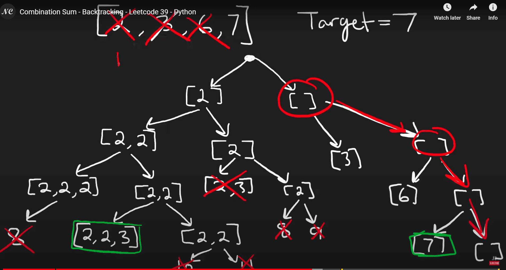
```python
class Solution:  
    def combinationSum(self, candidates: List[int], target: int) -> List[List[int]]:  
        # Still a decision tree  
        res = []  
  
        def dfs(cur, i, total):  # Here we need the sum of the current node, the pointer i of nums, and the current result cur   
# Handle the base case  
            if total == target:  
                res.append(cur.copy())  # Note that you need to copy cur here, because this variable will be modified every time  
                return  # End recursion  
  
            if i >= len(candidates) or total > target:  
                return  # End recursion  
  
            # Include the current node  
            cur.append(candidates[i])  
            #  Recursive decision  
            dfs(cur, i, total + candidates[i])  ## Note that i remains unchanged here, because it can still be used, and total needs to be changed  
  
            # Do not include the current node  
            cur.pop()  
            dfs(cur, i + 1, total)  # Here i needs to be +1, because it is not included, and total does not change  
  
        dfs([], 0, 0)  
        return res
```
```python
class Solution:  
    def permute(self, nums: List[int]) -> List[List[int]]:  
        # Draw the recursion tree from top to bottom, then come up from the bottom to re-establish the permutation.  
  
        result = []  
  
        # Handle only one element.   
if len(nums) == 0:  
            return [nums.copy()]  
  
        for i in range(len(nums)):  
            num = nums.pop(0)  # Remove the first element.  
  
            perms = self.permute(nums)  # Then recursively find the permutations of the remaining elements.  
  
            for i in perms:  
                perm = i.append(num)  # Here i is an array. For each combination, append the removed element back.  
  
            result.extend(perms)  # Get the combination.  
  
            nums.append(num)  # Append the originally removed element back.  
  
        return result
```
[Subsets II](https://leetcode.com/problems/subsets-ii/)
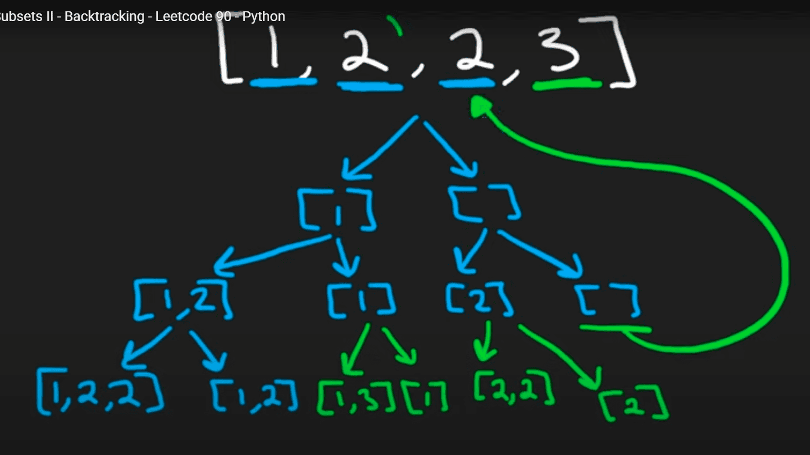
```python
class Solution:  
    def subsetsWithDup(self, nums: List[int]) -> List[List[int]]:  
        # The key is to skip duplicate elements to avoid duplicate combinations.  
  
        res = []  
        nums.sort()  # Ensure duplicate elements are together.  
  
        def backtracking(i, subset):  # subset is the result of each recursion.  
            if i == len(nums):  # Pointer reaches the end.  
                return res.append(subset[::])  # Copy the set.  
  
            # include current   
subset.append(nums[i])  
            backtracking(i + 1, subset)  # Recurse on the left subtree.
  
            subset.pop()  # Restore the value of subset.
  
            # not include current  
            while i + 1 < len(nums) and nums[i] == nums[i + 1]:  # Skip duplicate elements.  
                i += 1  
            backtracking(i + 1, subset)  # Recurse on the right subtree.
  
        backtracking(0, []) 
  
        return res
```
[Combination Sum II](https://leetcode.com/problems/combination-sum-ii/)
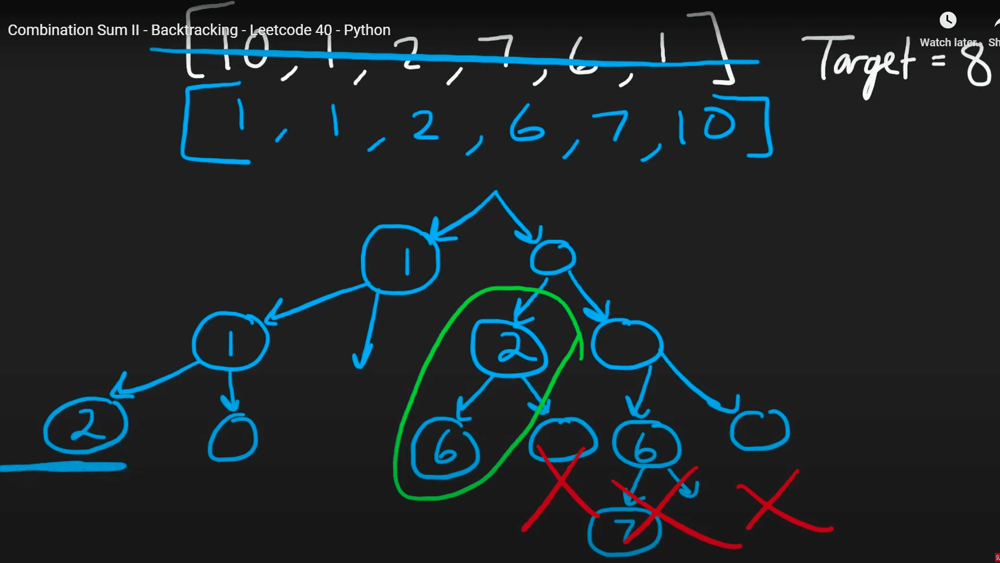
```python
class Solution:  
    def combinationSum2(self, candidates: List[int], target: int) -> List[List[int]]:  
        # The key point is: the difference here is that there are duplicate elements, so you can't simply use a decision tree.  
        # You need to  
        candidates.sort()  
  
        res = []  
  
        def backtracking(cur, pos, target):  # cur is the current result  
            # Base case  
            if target == 0:  
                res.append(cur.copy())  
            if target <= 0:  
                return  
  
            prev = -1  
            for i in range(pos, len(candidates)):  # This is the key point, you need to skip duplicate nodes and continue to call backtracking. If there are no duplicates, you don't need this for loop.  
                if prev == candidates[i]:  
                    continue  
                # Include this element  
                cur.append(candidates[i])  
                backtracking(cur, i + 1, target - candidates[i])  #  Traverse the left and right subtrees
  
                cur.pop()  # Return from recursion
                prev = candidates[i]  
  
        backtracking([], 0, target)  
        return res
```
[Word Search](https://leetcode.com/problems/word-search/)
```python
class Solution:  
    def exist(self, board: List[List[str]], word: str) -> bool:  
        rows, cols = len(board), len(board[0])  
  
        path = set()  
  
        def dfs(r, c, i):   
if i == len(word):  
                return True  
            if (r < 0 or c < 0 or  
                r >= rows or c >= cols or  
                word[i] != board[r][c] or  
                (r, c) in path):  
                return False  
            path.add((r,c))  
            res = (dfs(r + 1, c, i + 1) or  
            dfs(r - 1, c, i + 1) or  
            dfs(r, c+1, i + 1) or   
dfs(r, c-1, i + 1))   
path.remove((r,c))  
            return res  
  
        for r in range(rows):  
            for c in range(cols):  
                if dfs(r,c,0): return True
```
[Palindrome Partitioning](https://leetcode.com/problems/palindrome-partitioning/)

```python
class Solution:  
    def partition(self, s: str) -> List[List[str]]:  
        res = []  
        part = []  
  
        def dfs(i):  
            if i >= len(s):  
                res.append(part.copy())  
                return  
            for j in range(i, len(s)):  
                if self.isPal(s, i, j):  
                    part.append(s[i:j + 1])  
                    dfs(j + 1)  
                    part.pop()  
  
        dfs(0)  
        return res  
  
    def isPal(self, s, l, r):  
        while l < r:  
            if s[l] != s[r]:  
                return False  
            l, r = l + 1, r - 1  
        return True
```
[Letter Combinations of a Phone Number](https://leetcode.com/problems/letter-combinations-of-a-phone-number/)
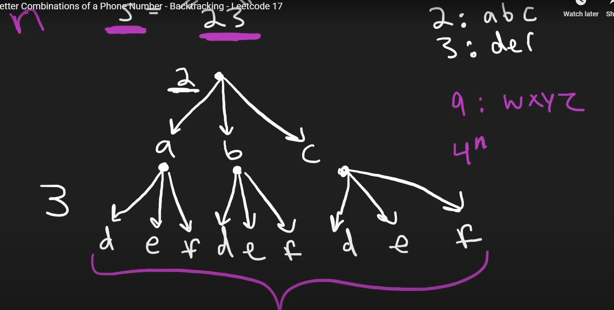
```python
class Solution:  
    def letterCombinations(self, digits: str) -> List[str]:  
        res = []  
        digital2Char = {  
            '2': 'abc',  
            '3': 'def',  
            '4': 'ghi',  
            '5': 'jkl',  
            '6': 'mno',  
            '7': 'pqrs',  
            '8': 'tuv',  
            '9': 'wxyz'  
        }  
  
        def dfs(i, curStr):  
            if len(curStr) == len(digits):  
                res.append(curStr)  
                return  
            for c in digital2Char[digits[i]]:  
                dfs(i + 1, curStr + c)  
  
        if digits:  
            dfs(0, '')  
        return res
```
### Heap & Priority Queue
[Last Stone Weight](https://leetcode.com/problems/last-stone-weight/)

```python
class Solution:
    def lastStoneWeight(self, stones: List[int]) -> int:
        stores = [-s for s in stones]
        heapq.heapify(stores)
        while len(stores) > 1: # When the number of elements in the heap is greater than 2
            first = heapq.heappop(stores)
            second = heapq.heappop(stores)
            if first < second:
                heapq.heappush(stores, first - second) #  Note that they are all negative numbers
        stores.append(0) # Boundary case when stores is empty
        return abs(stores[0]) 
```
 [Kth Largest Element In a Stream](https://leetcode.com/problems/kth-largest-element-in-a-stream/)
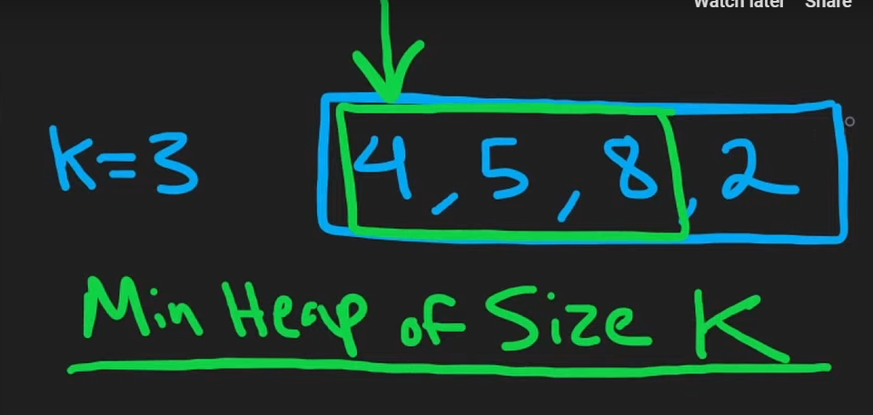
```python
class KthLargest:  
  
    def __init__(self, k: int, nums: List[int]):  
        self.minHeap, self.k = nums, k  
        heapq.heapify(self.minHeap) # Time complexity is nlogn  
        while len(self.minHeap) > k:  
            heapq.heappop(self.minHeap)  
  
    def add(self, val: int) -> int:  
        heapq.heappush(self.minHeap, val)  
        # When the total number of elements is greater than k, you need to remove elements from the min-heap  
        # logn time complexity, if it's an array, the complexity is n  
        if len(self.minHeap) > self.k:  
            heapq.heappop(self.minHeap)  
        return self.minHeap[0]
```
[K Closest Points to Origin](https://leetcode.com/problems/k-closest-points-to-origin/)

```python
# Time complexity is nlogn
class Solution:  
    def lastStoneWeight(self, stones: List[int]) -> int:  
        stores = [-s for s in stones]  
        heapq.heapify(stores)  
        while len(stores) > 1: # When the number of elements in the heap is greater than 2  
            first = heapq.heappop(stores)  
            second = heapq.heappop(stores)  
            if first < second:  
                heapq.heappush(stores, first - second) #  Note that they are all negative numbers  
        stores.append(0) # Boundary case when stores is empty  
        return abs(stores[0])
```
 [Kth Largest Element In An Array](https://leetcode.com/problems/kth-largest-element-in-an-array/)

```python
class Solution:
    def kClosest(self, points: List[List[int]], k: int) -> List[List[int]]:
        # The key point is to use a min-heap
        # Calculate the distance
        minHeap = []
        for x, y in points:
            minHeap.append([x**2 + y**2, x, y])
        res = []
        heapq.heapify(minHeap)  # Note that minHeap here is [10, 1, 2], [8, 1, 2]
        while k > 0:
            dist, x, y = heapq.heappop(minHeap)
            res.append([x, y])
            k -= 1
        return res
```
 [Task Scheduler](https://leetcode.com/problems/task-scheduler/)

```python
class Solution:
    def leastInterval(self, tasks: List[str], n: int) -> int:
        counter =  Counter(tasks)
        maxHeap = [-cnt for cnt in counter.values()]
        heapq.heapify(maxHeap) # Currently to be processed
        time = 0
        q = deque() # [-cnt, idletime] Temporarily store and do not process
        while maxHeap or q:
            time += 1
            if maxHeap:
                cnt = heapq.heappop(maxHeap) + 1
                if cnt: # If there are still some
                    q.append([cnt, time + n])
            if q and q[0][1] == time: # When the idle time is reached, put it back into the heap for processing
                heapq.heappush(maxHeap, q.popleft()[0])
        return time
```
[Design Twitter](https://leetcode.com/problems/design-twitter/)
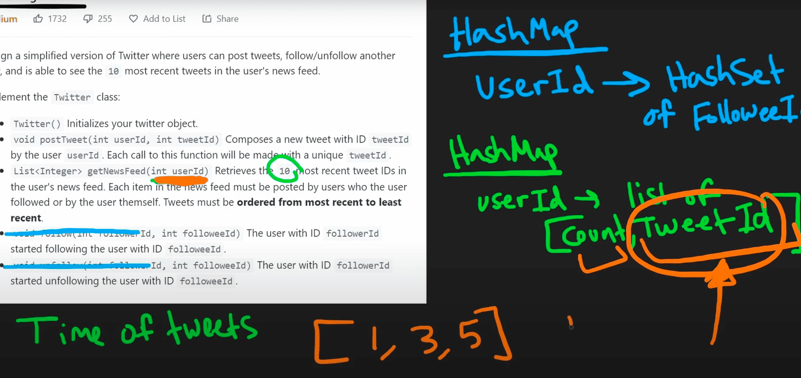
```python
# The use of heaps and hashmaps. There are some usage tips, such as the heap storing index and count as a timeline.
class Twitter:
    def __init__(self):
        self.followMap = defaultdict(set) # Automatically initializes userId -> [followeeId]
        self.twitterMap = defaultdict(list) # Automatically initializes userId -> [count, twittwerId]
        self.count = 0 # Records the id of the tweet, as a consideration of time
    def postTweet(self, userId: int, tweetId: int) -> None:
        self.twitterMap[userId].append([self.count, tweetId])
        self.count -= 1
    def getNewsFeed(self, userId: int) -> List[int]:
        minHeap = []
        res = []
        self.followMap[userId].add(userId)
        # Build the heap
        for followee in self.followMap[userId]:
            if followee in self.twitterMap:
                index = len(self.twitterMap[followee]) - 1
                count, twitterId = self.twitterMap[followee][index]
                heapq.heappush(minHeap, [count, twitterId, followee, index - 1]) # Here index - 1 is to get the previous twittwer
        heapq.heapify(minHeap)
        while minHeap and len(res) < 10:
            count, twitterId, followee, index = heapq.heappop(minHeap)
            res.append(twitterId)
            if index >= 0:
                # Get the previous one
                count, twitterId = self.twitterMap[followee][index]
                heapq.heappush(minHeap, [count,twitterId,followee,index-1])
        return res
    def follow(self, followerId: int, followeeId: int) -> None:
        self.followMap[followerId].add(followeeId)
    def unfollow(self, followerId: int, followeeId: int) -> None:
        if followeeId in self.followMap[followerId]:
            self.followMap[followerId].remove(followeeId)
```
Given an array and an integer `k`, where `k` is less than the length of the array, we need to find the `k`-th smallest element in the array. Assume that all elements in the array are distinct.
Input:
```text
arr[] = {7, 10, 4, 3, 20, 15}
k = 3
```
Output:
```text
7
```
Input:
```text
arr[] = {7, 10, 4, 3, 20, 15}
k = 4
```
Output:
```text
10
```
After sorting the array, directly return the `k`-th smallest element.
#### Implementation Code
```ts
function getKthSmallest(arr: number[], k: number): number {
  const sortedArr = arr.sort((a, b) => a - b); // Sort in ascending order
  return sortedArr[k - 1]; // Return the k-th smallest element
}
```
- The time complexity of sorting is **O(n log n)**, where `n` is the length of the array.
- The space complexity is **O(1)** (if sorted in-place) or **O(n)** (if a new array is created).
You can use a heap to optimize the process of finding the `k`-th smallest element, avoiding sorting the entire array.
1. **Min-Heap**:
   - Build a min-heap, and pop the top element `k-1` times. The final top element is the `k`-th smallest element.
   - The time complexity is **O(n + k log n)**.
2. **Max-Heap**:
   - Build a max-heap of size `k`, and maintain the size of the heap while traversing the array.
   - If the current element is smaller than the top element of the heap, replace the top element and adjust the heap.
   - The final top element of the heap is the `k`-th smallest element.
   - The time complexity is **O(n log k)**.
```ts
function getKthSmallestUsingHeap(arr: number[], k: number): number {
  const maxHeap = new MaxHeap();
  for (let i = 0; i < arr.length; i++) {
    if (maxHeap.size() < k) {
      maxHeap.insert(arr[i]); // Insert into the heap
    } else if (arr[i] < maxHeap.peek()) {
      maxHeap.extractMax(); // Remove the top of the heap
      maxHeap.insert(arr[i]); // Insert the new element
    }
  }
  return maxHeap.peek(); // The top of the heap is the k-th smallest element
}
// Assume MaxHeap is a well-implemented max-heap class
class MaxHeap {
  private heap: number[] = [];
  insert(value: number) {
    this.heap.push(value);
    this.heapifyUp(this.heap.length - 1);
  }
  extractMax(): number {
    const max = this.heap[0];
    this.heap[0] = this.heap[this.heap.length - 1];
    this.heap.pop();
    this.heapifyDown(0);
    return max;
  }
  peek(): number {
    return this.heap[0];
  }
  size(): number {
    return this.heap.length;
  }
  private heapifyUp(index: number) {
    while (index > 0) {
      const parentIndex = Math.floor((index - 1) / 2);
      if (this.heap[parentIndex] >= this.heap[index]) break;
      [this.heap[parentIndex], this.heap[index]] = [this.heap[index], this.heap[parentIndex]];
      index = parentIndex;
    }
  }
  private heapifyDown(index: number) {
    while (true) {
      const leftChildIndex = 2 * index + 1;
      const rightChildIndex = 2 * index + 2;
      let largestIndex = index;
      if (leftChildIndex < this.heap.length && this.heap[leftChildIndex] > this.heap[largestIndex]) {
        largestIndex = leftChildIndex;
      }
      if (rightChildIndex < this.heap.length && this.heap[rightChildIndex] > this.heap[largestIndex]) {
        largestIndex = rightChildIndex;
      }
      if (largestIndex === index) break;
      [this.heap[index], this.heap[largestIndex]] = [this.heap[largestIndex], this.heap[index]];
      index = largestIndex;
    }
  }
}
```
- **Building the heap**: `O(n log k)`.
- **Space complexity**: `O(k)` (the size of the heap is limited to `k`).
### interval
 [Insert Interval](https://leetcode.com/problems/insert-interval/)

```python
class Solution:
    def insert(self, intervals: List[List[int]], newInterval: List[int]) -> List[List[int]]:
        # Essentially, you need to check for overlaps. First, think through all the cases, summarize them, don't enumerate them one by one, the code will be a mess.
        res = []
        for i in range(len(intervals)):
            if newInterval[1] < intervals[i][0]: # On the left
                res.append(newInterval)
                return res + intervals[i:] # Merge all subsequent results
            elif newInterval[0] > intervals[i][1]:  # On the right
                res.append(intervals[i])
            else: # Overlapped, merge them
                newInterval = [min(newInterval[0], intervals[i][0]), max(newInterval[1], intervals[i][1])]
        
        # If the condition on the left above is not met, ensure that newInterval will be inserted
        res.append(newInterval)
        return res
```
[Merge Intervals](https://leetcode.com/problems/merge-intervals/)
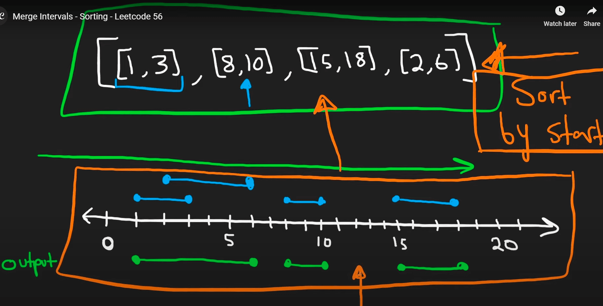
```python
# No black magic, just normal thinking
class Solution:
    def merge(self, intervals: List[List[int]]) -> List[List[int]]:
        intervals.sort(key = lambda i:i[0])
        output = [intervals[0]]
        for start, end in intervals[1:]:
            lastEnd = output[-1][1]
            if start <= lastEnd: # Overlap, need to merge
                output[-1][1] = max(output[-1][1], end)
            else:
                output.append([start, end])
        
        return output
```
 [Non Overlapping Intervals](https://leetcode.com/problems/non-overlapping-intervals/)

```python
class Solution:
    def eraseOverlapIntervals(self, intervals: List[List[int]]) -> int:
        # The key point is to sort the input
        # Then if two adjacent intervals overlap. You need to keep the one with the smaller end, because this makes the possibility of overlap smaller
        intervals.sort()
        res = 0
        prevEnd = intervals[0][1] # Need to keep the end of the previous merge
        for start, end in intervals[1:]:
            if start >= prevEnd: # No overlap
                prevEnd = end 
            else:
                res += 1 
                prevEnd = min(end, prevEnd) # Remove one. It's not really removed here, just merged
        return res
```
### Greedy
[Maximum Subarray](https://leetcode.com/problems/maximum-subarray/) 

```python
# This uses a greedy algorithm. When you are no longer helping the total sum, and it becomes 0 or negative, you discard it. Because you are not helping to find the maximum sum.
class Solution:
    def maxSubArray(self, nums: List[int]) -> int:
        maxSum = nums[0] # Record the current maximum sum 
        curSum = 0 # Calculate the sum
        for i in nums:
            if curSum < 0: # If it's not helping the sum, just get rid of it
                curSum = 0
            curSum += i
            maxSum = max(curSum, maxSum)
        return maxSum
```
[Jump Game](https://leetcode.com/problems/jump-game/)

```python
class Solution:
    def canJump(self, nums: List[int]) -> bool:
        #  This is a dp problem, which can be solved by brute force.
        # The worst-case time complexity is n^n, because this is a decision tree, and using it or not is 2^n. The branch here is n, so it's n^n.
        # By caching repeated calculations, the time complexity can be reduced to n^2 (why n^2? Because the cache is based on your last visit, which is two for loops).
        # The time complexity of the greedy algorithm can reach n.
        
        # The core of the greedy algorithm is to go from right to left, and judge whether the last element can reach the next target.
        goal = len(nums) - 1
        for i in range(len(nums)-1, -1, -1): # From back to front, the step is -1
            if i + nums[i] >= goal: # This means the previous number can reach the end, so we move the end one step forward.
                goal = i
        return True if goal == 0 else False
```
[Jump Game II](https://leetcode.com/problems/jump-game-ii/)

```python
class Solution:
    def jump(self, nums: List[int]) -> int:
        # The key point is to calculate the farthest distance that can be jumped currently. Then calculate the number of blocks, which is the number of jumps.
        res = 0
        l = 0 # Moving window
        r = 0
        fartest = 0
        while r < len(nums) - 1: # Not yet reached the end
            # BFS traversal, what is the farthest distance that can be jumped
            for i in range(l, r + 1):
                fartest = max(i+nums[i], fartest)
            l = r + 1 # Update the sliding window
            r = fartest 
            # Each time the sliding window is updated, it represents the number of jumps
            res += 1
        return res
```
[Gas Station](https://leetcode.com/problems/gas-station/)
```python
# Intuitive solution. A bit hard to understand.
class Solution:
    def canCompleteCircuit(self, gas: List[int], cost: List[int]) -> int:
        if sum(gas) < sum(cost):
            return -1
        total = 0
        res = 0
        for i in range(len(gas)):
            total += (gas[i] - cost[i])
            if total < 0:
                total = 0 # Reset 
                res = i + 1 # Next one
        
        return res
```
 [Hand of Straights](https://leetcode.com/problems/hand-of-straights/)
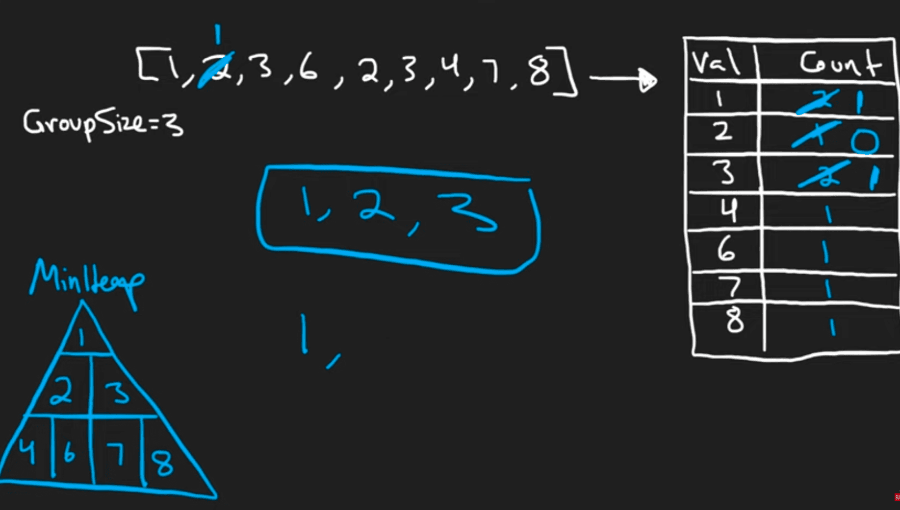
```python
class Solution:
    def isNStraightHand(self, hand: List[int], groupSize: int) -> bool:
        # The key point is: always take the smallest value, then group it. If the group is successful, subtract the count of this value. 
        # Need to count the number of each value.
        if len(hand) % groupSize:
            return False
        count = {} # Or use Counter
        for i in hand:
            count[i] = 1 + count.get(i, 0)    
        # Assemble all keys into a heap
        minHeap = list(count.keys())
        heapq.heapify(minHeap)
        while minHeap:
            first = minHeap[0]
            for i in range(first, first + groupSize):
                if i not in count: # If not found in the hashmap, it means the group was not formed successfully
                    return False 
                count[i] -=  1 # If the group is successful, subtract one from the count
                if count[i] == 0:  # This number has been completely grouped
                    if i != minHeap[0]: # This means the grouped number is no longer the smallest number, and a number has been missed
                        return False
                    heapq.heappop(minHeap)
        return True
```
 [Merge Triplets to Form Target Triplet](https://leetcode.com/problems/merge-triplets-to-form-target-triplet/)
```python
class Solution:
    def mergeTriplets(self, triplets: List[List[int]], target: List[int]) -> bool:
        res = set() # Remove duplicates
        for i in triplets:
            if i[0] > target[0] or i[1] > target[1] or i[2] > target[2]:      # Eliminate elements greater than the target
                continue 
            # Meets the condition
            for index, v in enumerate(i):
                if v == target[index]: # This means it contains the target element
                    res.add(index)
        
        # Because we eliminated the greater ones, the rest must be less than or equal to. If we can find three equal ones, it means we can definitely find them.
        return len(res) >= 3
```
[Partition Labels](https://leetcode.com/problems/partition-labels/)
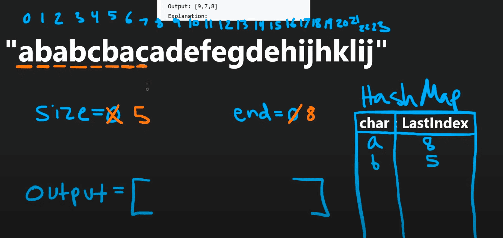
```python
class Solution:
    def partitionLabels(self, s: str) -> List[int]:
        # Don't use a sliding window, don't get stuck in a rut. Here, use a hashmap to save the last index of each letter.
        # Judge whether the index of the previous character is less than this last index. If it is, it means it cannot be partitioned yet.
        # end: records the last index of the current partition. 
        hashmap  = {} # char -> last index of s
        for i, v in enumerate(s):
            hashmap[v] = i
        res = []
        size = 0 # Records the length of the partition        
        end = 0 # Records the current end position
        for i, v in enumerate(s):
            size += 1
            if hashmap[v] > end: # Update the longest position of the current partition
                end = hashmap[v]
            if i == end: # This means the farthest distance has been reached
                res.append(size) # No need to update end, because the following are all different characters, it will be updated automatically
                size = 0 # Start partitioning again
        return res
```
 [Valid Parenthesis String](https://leetcode.com/problems/valid-parenthesis-string/)
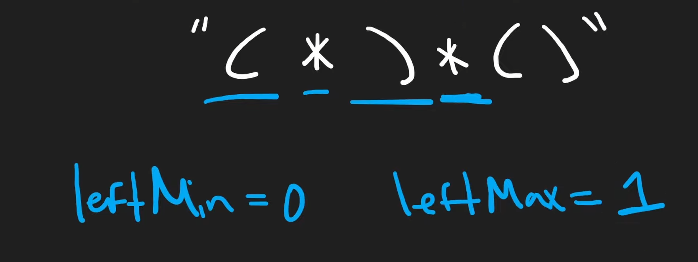
```python
class Solution:
    def checkValidString(self, s: str) -> bool:
        # Greedy algorithm:
        # leftMin when * is empty (the minimum quantity is
        # leftMax when * is ( (the maximum quantity is
        # These two values are updated every time ) or * is encountered. 
        # Only when leftMin is 0, it means it's a perfect match.
        # When leftMax is negative, it means it doesn't match.
        # dp algorithm: for *, use a decision tree to judge each case.
        leftMin, leftMax = 0, 0
        for i in s:
            if i == "*":
                leftMin -= 1
                leftMax += 1
            if i == '(':
                leftMin += 1
                leftMax += 1
            if i == ')':
                leftMin -= 1
                leftMax -= 1
            if leftMin < 0: # When leftMin is less than 0, it means it doesn't meet the requirement, reset to 0. 
                leftMin = 0
            if leftMax < 0:
                return False
        return leftMin == 0
```
### 1-DP
 [Climbing Stairs](https://leetcode.com/problems/climbing-stairs/)
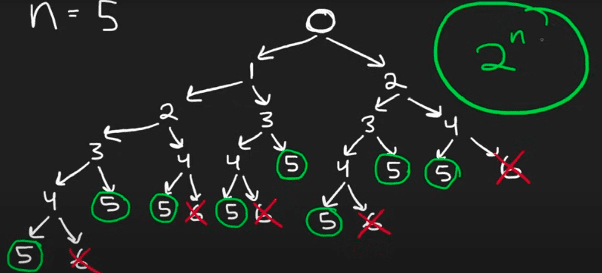
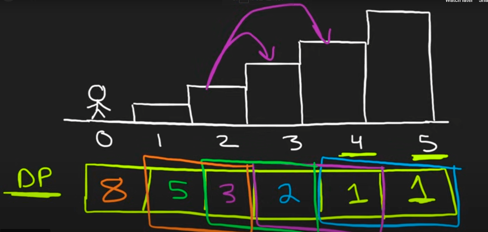
```python
class Solution:
    def climbStairs(self, n: int) -> int:
        # The key is that the decision is a repeated decision every time. We store the information of the previous decision to avoid repeated calculations.
        # Here is to calculate how many ways to walk. The normal decision tree dfs has a time complexity of 2^n.
        # But through dp calculation, we only need to walk once. Calculate the already calculated values from the bottom.
        one, two = 1, 1
        for i in range(n-1): # Traverse the number of stairs. It's clear when you draw a picture.
            temp = one
            one = one + two
            two = temp
        return one
```
[Min Cost Climbing Stairs](https://leetcode.com/problems/min-cost-climbing-stairs/)
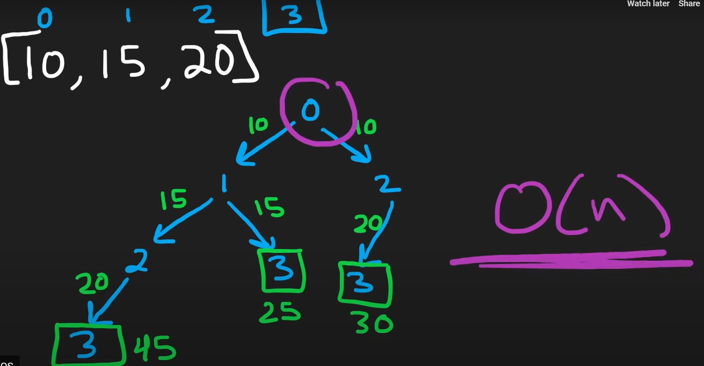

```python
class Solution:
    def minCostClimbingStairs(self, cost: List[int]) -> int:
        # Essentially, you need to convert the decision tree into a dp array.
        # From the simplest case
        # The time complexity is O(n), where n is actually the number of subproblems.
        cost.append(0)
        for i in range(len(cost) - 3, -1, -1):
            # Calculate the minimum cost
            cost[i] = min(cost[i] + cost[i+1], cost[i] + cost[i+2])
        return min(cost[0], cost[1])
```
### Graph
Given an undirected graph, how to check if there is a cycle in the graph?
- **Input**:  
  - `n = 4` (number of vertices)  
  - `e = 4` (number of edges)  
  - Edge set: `{ 0-1, 1-2, 2-3, 0-2 }`
- **Output**: `Yes` (cycle exists)
- **Example**:
  
  *Graph: Cycle exists*
- **Input**:  
  - `n = 4` (number of vertices)  
  - `e = 3` (number of edges)  
  - Edge set: `{ 0-1, 1-2, 2-3 }`
- **Output**: `No` (no cycle exists)
- **Example**:
  
  *Graph: No cycle exists*
We all know that:
> **Algorithm + Data Structure = Program**
Therefore, we need to create a data structure to represent an undirected graph. The following are two common data structures:
1. **Adjacency List**  
   If vertex `1` is connected to vertices `2` and `3`, the adjacency list is represented as:  
   `{ 1: [2, 3] }`
2. **Adjacency Matrix**  
   In JavaScript, you can use a `Map` to implement it.
Solution 1: Disjoint Set Union (DSU)
- **Initialization**: Each vertex is an independent set.
- **Union Operation**: Traverse all edges. If two vertices belong to different sets, merge them.
- **Cycle Detection**: If two vertices already belong to the same set, it means a cycle exists.
Solution 2: Depth-First Search (DFS) or Breadth-First Search (BFS)
- **Visited Flag**: Use a boolean array to record whether each node has been visited.
- **Cycle Detection**: If an adjacent node of the current node has been visited and is not its parent, it means a cycle exists.
The following code implements an undirected graph based on an adjacency list and provides three methods for detecting cycles: Disjoint Set, DFS, and BFS.
```javascript
/*
  Graph using adjacency list. Support operations:
  1. Traverse by DFS/BFS
  2. hasCircleByDfs
  3. hasCircleByBfs
  4. hasCircleByDss (Disjoint Set)
*/
class Graph {
  constructor() {
    this.allVertexes = [];
    this.allEdges = [];
    this.adList = new Map();
  }
  // Add vertex
  addV(v) {
    if (!this.adList.has(v)) {
      this.adList.set(v, []);
    }
    this.allVertexes.push(v);
  }
  // Add edge
  addE(source, dest) {
    if (!this.adList.has(source)) {
      this.addV(source);
    }
    if (!this.adList.has(dest)) {
      this.addV(dest);
    }
    this.adList.get(source).push(dest);
    this.adList.get(dest).push(source);
    this.allEdges.push({ source, dest });
  }
  // Remove vertex
  removeV(v) {
    for (let adV of this.adList.get(v)) {
      this.removeE(v, adV);
    }
    this.adList.delete(v);
  }
  // Remove edge
  removeE(source, dest) {
    this.adList.set(
      source,
      this.adList.get(source).filter((v) => v !== dest)
    );
    this.adList.set(
      dest,
      this.adList.get(dest).filter((v) => v !== source)
    );
  }
  // Print adjacency list
  print() {
    for (let v of this.adList.keys()) {
      let cons = "";
      for (let dest of this.adList.get(v)) {
        cons += dest + " ";
      }
      console.log(v + " -> " + cons);
    }
  }
  // Detect cycle using Disjoint Set
  hasCircleByDss() {
    const dss = new DisjointSet();
    this.allVertexes.forEach((v) => {
      dss.makeSet(v);
    });
    return this.allEdges.some((e) => dss.union(e.source, e.dest));
  }
  // Detect cycle using BFS
  bfs(start) {
    const queue = [start];
    const result = [];
    const visited = {};
    visited[start] = true;
    while (queue.length) {
      const curV = queue.shift();
      result.push(curV);
      this.adList.get(curV).forEach((dest) => {
        if (!visited[dest]) {
          visited[dest] = true;
          queue.push(dest);
        }
      });
    }
    return result;
  }
  hasCircleByBfs() {
    const parent = {};
    const visited = {};
    const queue = [];
    for (let i = 0; i < this.allVertexes.length; i++) {
      const node = this.allVertexes[i];
      if (!visited[node]) {
        visited[node] = true;
        queue.push(node);
        while (queue.length) {
          const curV = queue.shift();
          visited[curV] = true;
          const allAdNodes = this.adList.get(curV);
          for (let j = 0; j < allAdNodes.length; j++) {
            const dest = allAdNodes[j];
            if (!visited[dest]) {
              visited[dest] = true;
              parent[dest] = curV;
              queue.push(dest);
            } else if (dest !== parent[curV]) {
              return true;
            }
          }
        }
      }
    }
    return false;
  }
  // Detect cycle using DFS
  dfsRecursive(start) {
    const result = [];
    const visited = {};
    const adList = this.adList;
    (function dfs(v) {
      if (!v) return null;
      visited[v] = true;
      result.push(v);
      adList.get(v).forEach((dest) => {
        if (!visited[dest]) {
          return dfs(dest);
        }
      });
    })(start);
    return result;
  }
  dfsIterative(start) {
    const result = [];
    const visited = {};
    const stack = [start];
    visited[start] = true;
    while (stack.length) {
      const curV = stack.pop();
      result.push(curV);
      this.adList.get(curV).forEach((dest) => {
        if (!visited[dest]) {
          visited[dest] = true;
          stack.push(dest);
        }
      });
    }
    return result;
  }
  hasCircleUtil(node, visited, parent) {
    visited[node] = true;
    const adList = this.adList.get(node) || [];
    for (let i = 0; i < adList.length; i++) {
      if (adList[i] === parent) continue;
      if (visited[adList[i]]) return true;
      const hasCycle = this.hasCircleUtil(adList[i], visited, node);
      if (hasCycle) return true;
    }
    return false;
  }
  hasCircleByDfs() {
    const visited = {};
    const allV = this.allVertexes;
    for (let i = 0; i < allV.length; i++) {
      if (visited[allV[i]]) continue;
      const flag = this.hasCircleUtil(allV[i], visited, null);
      if (flag) return true;
    }
    return false;
  }
}
// Disjoint Set implementation
class DisjointSet {
  constructor() {
    this.map = new Map();
  }
  makeSet(data) {
    this.map.set(data, -1);
  }
  find(x) {
    const parent = this.map.get(x);
    if (parent < 0) {
      return x;
    } else {
      return this.find(this.map.get(x));
    }
  }
  union(x, y) {
    const xparent = this.find(x);
    const yparent = this.find(y);
    if (xparent !== yparent) {
      this.map.set(xparent, this.map.get(xparent) + this.map.get(yparent));
      this.map.set(yparent, xparent);
    } else {
      return true;
    }
  }
  console_print() {
    console.log(JSON.stringify([...this.map.entries()]));
  }
}
// Test code
const g = new Graph();
const vertices = ["A", "B", "C", "D", "E", "F"];
for (const v of vertices) {
  g.addV(v);
}
g.addE("A", "B");
g.addE("A", "D");
g.addE("B", "C");
g.addE("D", "E");
g.addE("E", "F");
g.addE("A", "E"); // Add a cycle
g.print();
console.log("Has Circle (DSS):", g.hasCircleByDss());
console.log("Has Circle (DFS):", g.hasCircleByDfs());
console.log("Has Circle (BFS):", g.hasCircleByBfs());
```
| Method       | Time Complexity |
|------------|------------|
| BFS/DFS    | O(V + E)   |
| Disjoint Set     | O(n) → O(log n) (after optimization with path compression and union by rank) |
