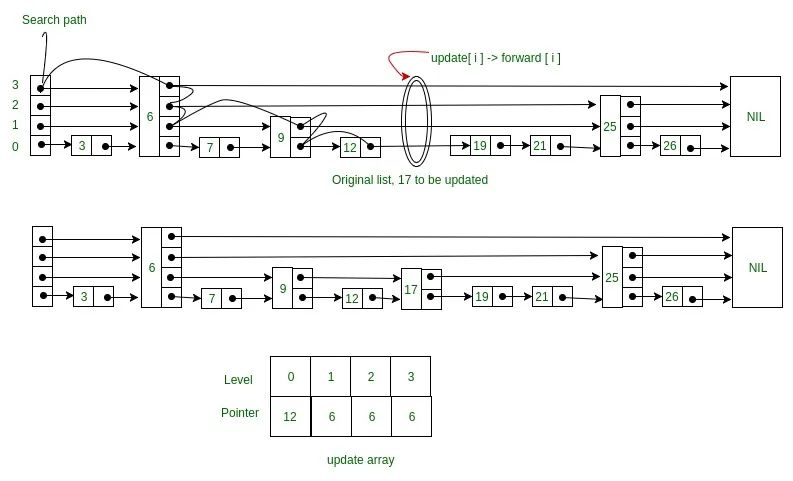

Basic data structures include: arrays, linked lists, stacks, queues, trees, and graphs.
They can be categorized into two types: linear structures (arrays, queues, stacks, linked lists) and non-linear structures (trees, graphs).
The difference between linear and non-linear structures is that linear structures have a one-to-one relationship, where each element has only one preceding and one succeeding node. Non-linear structures have one-to-many or many-to-many relationships, where each element can have multiple preceding and succeeding nodes.
Here, let's briefly discuss what an Abstract Data Type (ADT) is: an ADT defines operations without specifying implementation details. For example, a queue can be implemented using an array or a linked list.
Complex data structures are implemented using basic data structures to perform a series of operations, such as skip lists, red-black trees, Trie trees, etc. Industrial-grade programs use complex data structures more frequently.
### Array
A continuous memory space that stores elements of the same data type.
In dynamic languages like JS, it can also store different data types.
Advantages: Fast access, benefits from CPU caching.
Disadvantages: Slow insertion and deletion, requires allocating a large contiguous block of space, which may lead to some wasted space.
Insertion and deletion are O(n), while access is O(1).
Another characteristic is that indexing starts from 0. Why from 0?
Mainly for convenient addressing. For example, the addressing formula for a 2D array m*n is: `address = base_address + (i * n + j) * type_size`
`base_address` is the name of the 2D array, `n` is the length of the array, and `type_size` is the size of a single element. The address in the formula refers to the memory address; you can ignore this if you don't understand it.
Use Case: CPU Cache
When the CPU reads data from memory, it first loads the data into the CPU cache. The CPU doesn't just read the specific address requested but a block of data, saving it to the cache. The next time data is accessed from memory, the CPU first checks the cache. If found, it doesn't need to fetch from memory again.
Large integers (stored in an array)
This creates a mechanism faster than memory access, which is the purpose of the CPU cache:
It was introduced to bridge the gap between the slow speed of memory access and the high speed of CPU execution.
JS Implementation:
```js
// Declare and initialize a 3x3 2D array
const matrix = [
  [1, 2, 3],
  [4, 5, 6],
  [7, 8, 9]
];
console.log(matrix);
// Output:
// [
//   [1, 2, 3],
//   [4, 5, 6],
//   [7, 8, 9]
// ]
```
C++ Implementation:
```c++
double balance[10] = {1,2,2,2,2,2,2,2,2} // 1D
int a[3][4] = { // 2D
	{0,1,2,3},
    {0,1,2,3},
    {0,1,2,3}
}
```
Points to note:
1. Beware of array out-of-bounds errors, for example, in C.
Can containers completely replace arrays?
Containers have advantages like encapsulated details and dynamic resizing. However, containers can have performance overhead when converting to wrapper classes like Integer (e.g., boxing and unboxing in Java). Multi-dimensional arrays can be more intuitive than containers, for example, `object[][] arr`.
How to solve the slow deletion problem?
To avoid moving data elements d, e, f, g, h three times, we can first record the deleted data. Each deletion operation doesn't actually move data but just marks it as deleted.
When the array has no more space to store data, we trigger a real deletion operation, which greatly reduces data movement caused by deletions. (This is the core of the JVM's mark-sweep garbage collection algorithm).
The virtual machine uses a reachability analysis algorithm to determine if an object is alive. During the marking phase, it traverses all GC ROOTS and marks all reachable objects as live. Only after the marking is complete does the cleanup begin.
Disadvantages: 1. Low efficiency. 2. Creates discontinuous memory space fragments.
Classic LeetCode:
1. [Search in Rotated Sorted Array - Medium](https://leetcode.com/problems/search-in-rotated-sorted-array/)
2. [Friends Of Appropriate Ages - Medium](https://leetcode.com/problems/friends-of-appropriate-ages/)
3. LRU
### Linked List
Characteristics: Convenient for insertion and deletion, inefficient for searching, no wasted memory space. Insertion and deletion operations are O(1).
Access is O(n). Note that insertion and deletion here refer to the operation itself, not including the search.
1. Circular Linked List: Convenient for traversing from the tail to the head, e.g., the Josephus problem.
2. Doubly Linked List: A concept of trading space for time, making queries more efficient. For example, `LinkedHashMap` and `LinkedList` in Java.
3. Doubly Circular Linked List: A combination of a circular linked list and a doubly linked list.
Must be proficient in implementing: linked list reversal, merging sorted linked lists.
Implementation tips:
1. Key concept: Pointers or references. Assigning a variable to a pointer is actually assigning the variable's address to the pointer, allowing the variable to be found through the pointer.
2. Beware of losing pointers and memory leaks.
3. Sentinels simplify implementation complexity (used in insertion sort, merge sort, dynamic programming): Special handling is needed for the first and last nodes. A linked list with a sentinel is called a "headed linked list".
4. Pay attention to 4 boundary conditions: the list is empty; the list contains only one node; the list contains only two nodes; whether the head and tail nodes are handled correctly.
C++ Implementation:
```c++
struct Node {
   int data;
   Node *next;
};
class LinkedList {
   private: Node *head, *tail;
   public: LinkedList() {
       head = NULL;
       tail = NULL;
   }
   void addNode(int n) {
       Node *tmp = new Node;
       tmp->data = n;
       tmp->next= NULL;
       if(head == NULL) {
           head = tmp;
           tail = tmp;
       }
       else {
           tail->next = tmp;
           tail = tail->next;
       }
   }
};
```
Classic LeetCode:
1. LRU Cache Eviction Algorithm
### Stack
A stack is an abstract data structure. If a data collection has the characteristic of First-In, Last-Out (FILO) or Last-In, First-Out (LIFO), a stack is the preferred choice. The time complexity of popping is O(1). If there is enough space, pushing is O(1); if resizing is needed, it's O(n).
Array-based Stack: Implemented with an array.
Linked Stack: Implemented with a linked list.
Why do function calls use a "stack" to save temporary variables?
The stack here is a physical concept that follows the LIFO principle. When a function is called, it enters the callee. A stack frame is allocated to store temporary variables, parameters, and other information, and it's placed on top of the stack. When the function finishes execution, it is popped from the stack, returning to the previous stack frame (i.e., scope).
What is the "heap and stack" concept in JVM memory management?
Stack memory is used to store local variables and method calls. Heap memory is used to store objects in Java. Is the stack here the same as the data structure stack? The memory heap and stack are not the same concept as the data structure heap and stack. Memory is a real physical area, while the data structure heap and stack are abstract data storage structures that you can implement with a linked list or an array.
Extended knowledge:
Memory space is logically divided into: code area, static data area, and dynamic data area. The dynamic data area is divided into the stack area and the heap area. Stack area: stores method parameters, local variables, and return values. Heap area: stores the actual data of objects.
Classic Problems:
1. Browser's forward and backward functionality: a double stack (or a doubly linked list or an array with a cursor).
2. Expression evaluation.
3. [Valid Parentheses](https://leetcode.cn/problems/valid-parentheses/comments/)
```c++
#define SIZE 10
class Stack {
   private: int *arr;
   private: int size = SIZE;
   private: int capacity;
   private: int top;
   public: Stack() {
       size = SIZE;
       arr = new int(size);
       top = -1;
   }
   public:void push(int);
   public: int pop();
};
void Stack::push(int value) {
   if(top == capacity - 1) {
       exit(EXIT_FAILURE);
   }
   arr[++top] = value;
}
int Stack::pop() {
   if(top == -1) {
       exit(EXIT_FAILURE);
   }
   return arr[top--];
}
```
Why use a stack data structure?
Because of its LIFO characteristic, it can delay problem-solving. When a certain condition is met, the problem is solved, and the context information can be easily retrieved. **Here is the [code implementation](https://codesandbox.io/s/valid-parentheses-ewu3p5?file=/src/index.ts)**
4. Function call stack
Classic LeetCode numbers:
20, 155, 232, 844, 224, 682, 496
### Queue
A queue is also an abstract data structure. It can be implemented with an array (array-based queue) or a linked list (linked queue). The difficult part is **determining if the queue is full or empty**.
It has a First-In, First-Out (FIFO) characteristic. **For most scenarios with limited resources, when there are no free resources, a "queue" can be used to manage a line of requests.**
1. Non-circular queue: implemented with an array.
The condition for a full queue is `tail == n`, and the condition for an empty queue is `head == tail`.
2. Circular queue:
The condition for a full queue is `(tail + 1) % n == head`, and the condition for an empty queue is `head == tail`.
Another way to check if the queue is full: I can define a value `size` to record the queue size. When this value equals the array size, the queue is full. When `tail` reaches the end, if `size` is not equal to the array size, `tail` points to the first position of the array. When an element is dequeued, `size--`; when an element is enqueued, `size++`.
How is the full queue expression derived?
In general, we can see that when the queue is full, `tail + 1 = head`. However, there is a special case where `tail = n - 1` and `head = 0`. In this case, `tail + 1 = n`, and `head = 0`. So, using `(tail + 1) % n` results in `n % n == 0`. Also, the maximum value of `tail + 1` is `n`, it won't be greater than `n`. Thus, `tail + 1` modulo `n` will be `tail + 1` itself, which is `head`, except in the maximum case. This is how the expression is derived.
Classic Problems:
1. Thread pools and other limited resource pools.
Blocking Queue: When the queue is empty, an attempt to retrieve data from the head of the queue will be blocked. Because there is no data to retrieve, it waits until there is data in the queue before returning. If the queue is full, the operation to insert data will be blocked until there is a free position in the queue, then the data is inserted, and it returns. This is the producer-consumer model.
Concurrent Queue: A thread-safe queue. You can add locks to the `enqueue()` and `dequeue()` methods, but a coarse-grained lock will result in low concurrency, allowing only one store or retrieve operation at a time. In fact, an array-based circular queue, using CAS atomic operations, can implement a very efficient concurrent queue. This is also why circular queues are more widely used than linked queues. I will discuss the application of concurrent queues in detail when I talk about Disruptor in the practical section.
1. Message queues in distributed applications, like Kafka, are also a queue structure. High-performance queues like Disruptor and Linux ring buffers all use circular concurrent queues. Java's `concurrent` package uses `ArrayBlockingQueue` to implement fair locks, etc. 2. Consider using CAS + array to implement a lock-free queue. Before enqueuing, get the `tail` position. When enqueuing, check if `tail` has changed. If not, allow enqueuing; otherwise, the enqueue operation fails. Dequeuing involves getting the `head` position and performing a CAS operation.
Implementation: An array-based queue can encounter a full queue situation during enqueuing and dequeuing. This requires moving the array elements. It is generally recommended to perform the move during enqueuing to ensure O(1) for dequeuing. Another method is to use a circular queue. Its advantages are: 1. Clockwise and counter-clockwise operations are O(1). 2. Fast head/tail deletion and searching. A sliding window generally stores array indices. The hardest part is determining the conditions for an empty and full queue. The length of a circular queue needs to be set based on a prediction of concurrent data, otherwise, too many requests will be lost.
### Hash Table
Also known as a hash map.
Advantage: Very fast lookups.
Disadvantages compared to a balanced binary search tree:
1. Data is unordered.
2. Performance is unstable; resizing is time-consuming.
3. More complex to construct; AVL trees are more stable.
Classic Problems:
1. LRU Cache Eviction Algorithm
- **Dictionary** is an abstract data type that maintains a collection of elements with `key`s, supporting the following operations:
  - **`insert(item)`**: Inserts an element. If the `key` already exists, the old value is overwritten.
  - **`delete(item)`**: Deletes the element with the specified `key`.
  - **`search(key)`**: Returns the element corresponding to the `key`, or indicates that the `key` does not exist.
**1. Problems with using an array to implement a hash table**
- **Problem 1**: `keys` may not be integers.
  - Array indices are usually required to be integers, so using non-integer `key`s directly causes problems.
- **Problem 2**: The array might take up a lot of space.
  - If `key`s are used directly as array indices, it can lead to wasted space (sparse array).
**2. The role of a hash function**
- **Core idea**: Calculate the hash value of a `key` using a hash function to solve the above problems.
- **Property**: If two `key`s are the same, their hash values must be the same.
  - i.e., `hash(x) = hash(y) <==> x = y`
**3. Hash table implementation schemes**
**3.1 Chaining with a linked list (Separate Chaining)**
- **Worst case**: Time complexity is `θ(n)`.
- **Performance analysis**:
  - With `n` `keys` and `m` slots, the expected length of the linked list is `α = n / m`.
  - **Running time**: `O(1 + α)`.
    - `1` represents the time to compute the hash value.
    - `α` represents the time to search in the linked list.
**4. Common hash functions**
**4.1 Division Hashing**
- **Description**: Divides the `key` by the number of slots `m` and takes the remainder as the hash value.
- **Formula**:
  ```plaintext
  hash(key) = key mod m
  ```
**4.2 Multiplication Hashing**
- **Formula**:
  ```plaintext
  h(k) = [(a * k) mod 2^w] >> (w - r)
  ```
- **Parameter explanation**:
  - `a`: A constant less than `2^w`.
  - `k`: The input `key`.
  - `w`: The word size of the computer (e.g., 32 or 64 bits).
  - `r`: The number of bits in the output hash value.
- **Steps**:
  1. Calculate `(a * k) mod 2^w`.
  2. Right-shift the result by `(w - r)` bits to get the final hash value.
**4.3 Universal Hashing**
- **Characteristics**:
  - In universal hashing, a hash function is randomly selected from a family of hash functions.
  - This method can effectively reduce the probability of collisions, especially against malicious inputs.
### Binary Tree
A binary tree, simply put, is a node with at most two child nodes.
Full Binary Tree
Complete Binary Tree (left-aligned, only the last level can have missing nodes. This classification exists because it can be stored in an array).
Several concepts:
Height (number of edges on the longest path, number of levels - 1), Depth (number of edges on the longest path), Level (from top to bottom 1, 2, ...).
### Binary Search Tree (BST)
A binary search tree's characteristic is: the nodes in the left subtree are smaller than the current node, and the current node is smaller than the nodes in the right subtree.
It exists for fast searching.
Advantages:
0. Best case log(n), worst case N.
1. In-order traversal outputs a sorted sequence (log(n)).
2. A binary search tree supports duplicate data (place duplicates in the right subtree, or expand with an array or linked list).
BFS Template:
```js
// Template 1: Implemented with a stack (Note: original text says stack, but the logic is a queue for BFS)
function bfs() {  
  let level = -1
  // Step 1: Initialize Q  
  let Q = [start]
  // Step 2: Traverse Q  
  while(Q.length !== 0) {  
    level++
    // Step 3: Process logic
    const start = Q.shift()
    for (;;) {
      if(findTheTarget) { return } 
      // Step 4: Update Q  
      Q.push(newItem)  
    }  
  }  
}
  
// Template 2
function bfs() {  
  let level = -1
  // Step 1: Initialize Q  
  let Q = [start]
  // Step 2: Traverse Q  
  while(Q.length !== 0) {  
    level++
    // Step 3: Process logic
    let next = []
    for (let i of Q) {
      if(i.left) next.push(i.left)
      if(i.right) next.push(i.right)
      // Step 4: Update Q  
      Q = next  
    }  
  }  
}
```
DFS Template
```js
// Template 1: Traversal of an array-stored tree
function travalUtl(narr, index, col, map) {  
  if (!narr[index]) return;  
  travalUtl(narr, 2 * index, col - 1, map);  
  // do something  
  travalUtl(narr, 2 * index + 1, col + 1, map);  
}
// Template 2: Only indices, no storage.
function travalUtil(i, j, finishi, finishj, res) {  
  if (i > finishi || j > finishj) return;  
  if (i === finishi && j === finishj) {  
    res.count++;  
    return;  
  }  
  travalUtil(i, j + 1, finishi, finishj, res);  
  travalUtil(i + 1, j, finishi, finishj, res);  
}
void preOrder(Node *node) {
   if(!node) return;
   print node
   preOrder(node->left)
   preOrder(node->right)
}
void inOrder(Node *node) {
  if(!node) return;
  inOrder(node->left)
  print node
  inOrder(node->right)
}
void postOrder(Node *node) {
  if(!node) return
  postOrder(node->left)
  postOrder(node->right)
  print node
}
```
Classic Problem
1. Walls and Gates
You are given an m x n 2D grid initialized with these three possible values:
- -1 - A wall or an obstacle.
- 0 - A gate.
- INF - Infinity means an empty room. We use the value 2^31 - 1 = 2147483647 to represent INF. You can assume that the distance to a gate is less than 2147483647.
Fill each empty room with the distance to its **nearest** gate. If it is impossible to reach a gate, it should be filled with INF.
Solution:
![[Pasted image 20240225172900.png]]
```js
function update(row, column, rooms, step, next) {
  if (
    row < 0 ||
    row >= rooms.length ||
    column < 0 ||
    column >= rooms[row].length ||
    rooms[row][column] !== 2147483647
  )
    return;
  rooms[row][column] = step;
  next.push([row, column]);
}
function bfs(rooms) {
  // Step 1: Initialize
  let Q = [];
  for (let i = 0; i < rooms.length; i++) {
    const element = rooms[i];
    for (let j = 0; j < element.length; j++) {
      if (element[j] === 0) { // Start BFS from all gates
        Q.push([i, j]);
      }
    }
  }
  // Step 2: Traverse
  let step = 1; // Start with distance 1
  while (Q.length !== 0) {
    // Step 3: Process logic
    let size = Q.length;
    for (let k = 0; k < size; k++) {
      let [row, column] = Q.shift();
      update(row, column - 1, rooms, step, Q);
      update(row, column + 1, rooms, step, Q);
      update(row - 1, column, rooms, step, Q);
      update(row + 1, column, rooms, step, Q);
    }
    step++;
  }
  return rooms;
}
export default bfs;
```
Explanation: In this problem, INF represents an empty room, 0 represents a target room (gate), and -1 represents an impassable wall. The task is to find the shortest distance from each empty room to a gate and set the corresponding INF to that distance. Obviously, the INF positions adjacent to a 0 (up, down, left, right) are the closest (see Step 1).
Since they are only one step away, they are set to 1 (see Step 2). After setting them, we just need to find these empty rooms marked with 1, and then set their surrounding INF rooms to 2, because the path from an INF to a 0 room has increased by one room (the empty room marked with 1).
Then we similarly find the rooms marked with 2, then 3, and do the same operation until all rooms are marked with their shortest path. This is the brute-force solution.
Actually, in the first pass, we can store the marked positions. Then we don't need to traverse the entire grid from the beginning; we just need to find the positions around the marked ones and process them accordingly (see Method 2: BFS in the diagram).
If you look closely, this is also a recursive tree. Traversing from top to bottom, we traverse horizontally first, so it's BFS.
Online Test: https://codesandbox.io/s/walls-and-gates-8eg7uk?file=/src/bfs.ts
2. [Vertical Order Traversal of a Binary Tree](https://leetcode.com/problems/vertical-order-traversal-of-a-binary-tree/)
Given a binary tree, return the vertical order traversal of its nodes' values (from **top to bottom**, column by column).
If two nodes are in the same row and column, the order should be from **left to right**.
Solution: Store the binary tree in a 2D array. A characteristic is that the left and right subtrees can be directly read by index. For example, if the current node's index is `i`, the left child's index is `i * 2`, and the right child's index is `2 * i + 1`.
There is a prerequisite here: the array must start from index 1, and index 0 must be empty (because if the index is 0, `0 * 2` is still 0). Understanding the data structure's characteristics, let's return to the problem. We need to sort by column. For example, in the diagram, sorting by column value should be -2, -1, 0, 0, 0, 1, 2.
Then we can output the corresponding values [[4],[2],[1,5,6],[3],[7]]. We can traverse the tree using DFS and maintain a hashtable <value, column_value>. For each node, we calculate its column value. For example, for node 2, its column value is its parent's column value - 1. For node 3, its column value is its parent's column value + 1.
Why DFS? Because our traversal order is not level-order, so by elimination, it's DFS. The main thing to note here is that we are using an array to store the binary search tree, so our traversal template needs to include the index.
```js
function travalUtl(narr, curIndex, col, map) {
  if (!narr[curIndex]) return;
  var letfIndex = 2 * curIndex;
  travalUtl(narr, letfIndex, col - 1, map);
  if (narr[curIndex]) {
    if (map[col]) {
      map[col].push(narr[curIndex]);
      map[col].sort((a, b) => a - b);
      console.log(map[col]);
    } else {
      map[col] = [narr[curIndex]];
    }
  }
  var rightIndex = 2 * curIndex + 1;
  travalUtl(narr, rightIndex, col + 1, map);
}
```
Online Test: https://codesandbox.io/s/relaxed-night-j6xhc1?file=/src/dfs.ts
3. [Validate Binary Search Tree](https://leetcode.com/problems/validate-binary-search-tree/)
Solution: Nothing special. Just traverse the binary tree and check if it meets the definition of a binary search tree.
```js
function travelUtil(arr, index, v) {
  if (!arr[index] || !v.result) return;
  if (arr[2 * index] && arr[index] < arr[2 * index]) {
    v.result = false;
    return;
  }
  if (arr[2 * index + 1] !== null && arr[index] > arr[2 * index + 1]) {
    v.result = false;
    return;
  }
  travelUtil(arr, 2 * index, v);
  travelUtil(arr, 2 * index + 1, v);
}
```
**[Online Test](https://codesandbox.io/s/validate-binary-search-tree-k8qm8t)**
4. [Unique Paths](https://leetcode.com/problems/unique-paths/)**
A robot is located at the top-left corner of a m x n grid. The robot can only move either down or right at any point in time. The robot is trying to reach the bottom-right corner of the grid. How many possible unique paths are there?
![[Pasted image 20240225223408.png]]
The above is a 3 x 7 grid. m and n will be at most 100.
```js
function travalUtil(i, j, finishi, finishj, res) {
  if (i > finishi || j > finishj) return;
  if (i === finishi && j === finishj) {
    res.count++;
    return;
  }
  travalUtil(i, j + 1, finishi, finishj, res);
  travalUtil(i + 1, j, finishi, finishj, res);
}
```
Solution: You can see a 3 * 7 rectangle. Its path access graph is a tree, which means we can traverse all possibilities using depth-first search and find the total number of valid paths. You can also see that there are repeated nodes, like (1, 1). We can store these nodes to reduce computation.
Online Test: https://codesandbox.io/s/unique-paths-1f9w8q?file=/src/index.ts:0-261
### Balanced Binary Search Tree (AVL)
The height difference between the left and right subtrees of any node cannot be greater than 1 (Full binary trees and complete binary trees are all AVL trees).
The construction of an AVL tree involves the rotation of three nodes to maintain balance:
Each comparison checks if the tree is balanced. Rotation only operates on three nodes (balance factor: the height difference between the left and right subtrees).
```c++
// Left Left Case imbalance
if (balance > 1 && key < node->left->key)
	return rightRotate(node);
// Right Right Case imbalance
if (balance < -1 && key > node->right->key)
	return leftRotate(node);
// Left Right Case imbalance
if (balance > 1 && key > node->left->key)
{
	node->left = leftRotate(node->left);
	return rightRotate(node);
}
// Right Left Case imbalance
if (balance < -1 && key < node->right->key)
{
	node->right = rightRotate(node->right);
	return leftRotate(node);
}
```
Advantages:
1. Best and worst-case for search, insertion, and deletion are all log n (geometric series sum).
2. Find the maximum number in log n time (by converting an array to an AVL tree).
### Red-Black Tree
Not a strictly balanced binary search tree, but the cost of maintaining balance is lower. It exists to solve the performance degradation problem of balanced binary search trees.
### Heap
Definition:
1. It is a complete binary tree.
2. The value of each node is greater than or equal to, or less than or equal to, the value of each of its children.
Nodes from n/2+1 to n are leaf nodes.
Insertion: Heapify from bottom to top or top to bottom, comparing and swapping positions.
Deletion: Replace it with the last element, then heapify.
The process of heapifying takes O(n) time, excluding leaf nodes.
Sorting is also a process of heapifying, with a time complexity of O(n log n).
### Skip List
Can quickly insert, delete, and find. Its average time complexity is O(log n), and the worst case is also O(n) (when it degenerates into a normal linked list). Its algorithm diagram is as follows:

When thinking of fast search, deletion, and insertion, red-black trees and hash tables quickly come to mind. So what is the advantage of a skip list? A skip list can **guarantee order, so it has an advantage in range searches**. Red-black trees are more complex to implement.
The linked list in an adjacency list can be replaced by a skip list. Also, database indexes use skip lists to achieve efficient lookups.
A skip list is essentially a linked list. In the diagram above, you can see that each node has a number and a small black dot. The purpose of the small black dot is to store a pointer to the next node.
So the data structure of each node is:
```js
class Node {
  constructor() {
    this.data = -1; // data
    this.forwards = new Array(this.MAX_LEVEL); // small black dots
    this.maxLevel = 0;
  }
}
```
This simple data structure can satisfy the skip list algorithm (see diagram). Isn't it very simple!
When implementing the insert and delete functions, an auxiliary data structure is needed.
The key here is: the `update` array stores the search path. The length of the `update` array is the size of the level.
Why is this auxiliary data structure needed? Because insertion and deletion operations require adjusting pointers. Without this array, you don't know where the current search position is, or which is the next node at the current level, so you can't insert or delete. Therefore, it is necessary.
From this case, we can see that data structures indeed serve algorithms. Because we need to implement small black dots at different levels, we designed the `forwards` array. Then, because we need to save the search position, we designed the `update` array.
II. What is the time complexity of a skip list?
1. Calculate the height of the skip list
If the linked list has n nodes, and every 2 nodes are extracted to form a node for the next level of index, then the number of nodes in the first level index is about n/2, the number of nodes in the second level index is about n/4, and so on. The number of nodes in the k-th level index is n/(2^k).
Assuming the index has h levels, and the highest level index has 2 nodes, then n/(2^h)=2, which gives h=log2n-1. Including the original linked list layer, the total height of the skip list is log2n.
2. Calculate the time complexity of the skip list
Suppose we are searching for some data in the skip list. If we traverse m nodes at each level, then the time complexity of searching for data in the skip list is O(m * logn). So what is m?
As shown in the figure below, suppose the data we are looking for is x. In the k-th level index, after we traverse to node y, we find that x is greater than y and less than the subsequent node z. So we go down from the k-th level to the k-1 level index through the down pointer of y. In the k-1 level index, there are only 3 nodes between y and z (including y and z).
So, we only need to traverse at most 3 nodes in the k-1 level index. By analogy, we only need to traverse at most 3 nodes at each level. So m=3. Therefore, the time complexity of searching for data in a skip list is O(logn).
III. What is the space complexity of a skip list and how to optimize it?
1. Calculate the total number of index nodes
If the linked list has n nodes, and every 2 nodes are extracted to form a node for the next level of index, then the number of nodes at each level of the index is: n/2, n/4, n/8, ..., 8, 4, 2. The sum of this geometric series is n-1, so the space complexity of the skip list is O(n).
2. How to optimize the time complexity
If the linked list has n nodes, and every 3 or 5 nodes are extracted to form a node for the next level of index, then the number of nodes at each level of the index is (taking 3 as an example): n/3, n/9, n/27, ..., 27, 9, 3, 1. The sum of this geometric series is n/2, so the space complexity of the skip list is O(n). Compared with extracting every 2 nodes, the time complexity is much lower.
IV. Efficient dynamic insertion and deletion?
A skip list is essentially a linked list, so for insertion and deletion operations alone, the time complexity is O(1). But in practice, to insert or delete a node, you need to find the specified position first, and this search operation is time-consuming. But in a skip list, the time complexity of this search operation is O(logn), so the time complexity of insertion and deletion operations in a skip list is also O(logn).
V. Dynamic update of skip list index?
When inserting data into a skip list, you can choose to insert this data into some index layers at the same time. So how to choose this index layer? You can use a random function to decide which index levels to insert this node into. For example, if the random function generates the value K, then you can add this node to the 1st to K-th level indexes.
The object system in Redis, for each type of object, is actually implemented based on a selection of multiple underlying data structures depending on the use case. For example, ZSET is based on [ziplist] or [skip list + dictionary] (this is also the same idea as the Sort package mentioned in sorting, which selects an appropriate sorting algorithm based on the data scale).
Redis sorted sets are implemented by a dictionary composed of a double hashmap and a skip list.
If one node is extracted from every three or five nodes as an upper-level index, the corresponding query data time complexity should still be O(logn). Assuming every 5 nodes are extracted, the highest level has 5 nodes, and the skip list height is log5n. Each level needs to search at most 5 nodes, i.e., m = 5 in O(mlogn). Finally, the time complexity is O(logn). The space complexity is also O(n), although some index nodes are saved, it seems not very significant.
The `forward` in each node stores the next hop of the current node at all its index levels. `forward[0]` corresponds to the next hop in the original linked list, `forward[1]` is the next hop position of the last level node, and so on. This means that accessing `head.forward[levelCount-1]` represents the head node of the first level index. `head` is a head node, and its `forward` stores the head nodes of the original linked list and the index layers.
"Rename `update` to `preNodes`, which is the array of `pre` nodes for the new node to be inserted at each level; rename `forwards` to `nextNodes`, which is the array of `next` nodes for the current node at each level."
The idea of summing a geometric series is interesting. The teacher's n-2 is not an estimate but an exact solution. In the series n/2, n/4, ..., 2, there are log2(n/2) terms. Plugging into the geometric series sum formula S = a0(1-q^n)/(1-q), where a0 is the first term and n is the number of terms. Here a0=n/2, number of terms=log2(n/2), q=1/2. S = n/2(1-2/n)/(1-1/2) = n-2.
https://github.com/wangzheng0822/algo/tree/master/c-cpp
Classic scenario: Social network relationships
```js
export class SkipList {
  constructor() {
    this.SKIPLIST_P = 0.5;
    this.MAX_LEVEL = 16;
    this.levelCount = 1;
    this.head = new Node();
  }
  find(value) {
    let p = this.head;
    for (let i = this.levelCount - 1; i >= 0; --i) {
      while (p.forwards[i] !== null && p.forwards[i].data < value) {
        p = p.forwards[i];
      }
    }
    if (p.forwards[0] !== null && p.forwards[0].data === value) {
      return p.forwards[0];
    } else {
      return null;
    }
  }
  insert(value) {
    const level = this.randomLevel();
    const newNode = new Node();
    newNode.data = value;
    newNode.maxLevel = level;
    const update = new Array(level).fill(this.head);
    let p = this.head;
    for (let i = level - 1; i >= 0; --i) {
      while (p.forwards[i] && p.forwards[i].data < value) {
        p = p.forwards[i];
      }
      update[i] = p;
    }
    for (let i = 0; i < level; ++i) {
      newNode.forwards[i] = update[i].forwards[i];
      update[i].forwards[i] = newNode;
    }
    if (this.levelCount < level) this.levelCount = level;
  }
  delete(value) {
    const update = new Array(this.levelCount);
    let p = this.head;
    for (let i = this.levelCount - 1; i >= 0; --i) {
      while (p.forwards[i] !== null && p.forwards[i].data < value) {
        p = p.forwards[i];
      }
      update[i] = p;
    }
    if (p.forwards[0] !== null && p.forwards[0].data === value) {
      for (let i = this.levelCount - 1; i >= 0; --i) {
        if (
          update[i].forwards[i] !== null &&
          update[i].forwards[i].data === value
        ) {
          update[i].forwards[i] = update[i].forwards[i].forwards[i];
        }
      }
    }
    while (
      this.levelCount > 1 &&
      this.head.forwards[this.levelCount] === null
    ) {
      this.levelCount--;
    }
  }
  randomLevel() {
    let level = 1;
    while (Math.random() < this.SKIPLIST_P && level < this.MAX_LEVEL) {
      level += 1;
    }
    return level;
  }
  printAll() {
    let p = this.head;
    while (p.forwards && p.forwards[0] !== null) {
      console.log(p.forwards[0]);
      p = p.forwards[0];
    }
    console.log();
  }
}
class Node {
  constructor() {
    this.data = -1;
    this.forwards = new Array(this.MAX_LEVEL);
    this.maxLevel = 0;
  }
  toString() {
    return `{ data: ${this.data}, levels: ${this.maxLevel} }`;
  }
}
```
```js
class SkipListNode {
  constructor(value, level) {
    this.value = value;
    this.next = new Array(level).fill(null);
  }
}
class SkipList {
  constructor() {
    this.head = new SkipListNode(null, 32);
    this.maxLevel = 0;
  }
  randomLevel() {
    let level = 1;
    while (Math.random() < 0.5 && level < this.head.next.length) {
      level++;
    }
    return level;
  }
  insert(value) {
    const newNodeLevel = this.randomLevel();
    const newNode = new SkipListNode(value, newNodeLevel);
    let currentNode = this.head;
    const update = new Array(newNodeLevel).fill(null);
    for (let i = this.maxLevel - 1; i >= 0; i--) {
      while (currentNode.next[i] && currentNode.next[i].value < value) {
        currentNode = currentNode.next[i];
      }
      if (i < newNodeLevel) {
        update[i] = currentNode;
      }
    }
    for (let i = 0; i < newNodeLevel; i++) {
      newNode.next[i] = update[i].next[i];
      update[i].next[i] = newNode;
    }
    if (newNodeLevel > this.maxLevel) {
      this.maxLevel = newNodeLevel;
    }
  }
  search(value) {
    let currentNode = this.head;
    for (let i = this.maxLevel - 1; i >= 0; i--) {
      while (currentNode.next[i] && currentNode.next[i].value < value) {
        currentNode = currentNode.next[i];
      }
    }
    currentNode = currentNode.next[0];
    if (currentNode && currentNode.value === value) {
      return currentNode;
    }
    return null;
  }
}
function createAdjacencyList(relationships) {
  const adjacencyList = {};
  for (const node in relationships) {
    if (relationships.hasOwnProperty(node)) {
      const skipList = new SkipList();
      const neighbors = relationships[node];
      for (const neighbor of neighbors) {
        skipList.insert(neighbor);
      }
      adjacencyList[node] = skipList;
    }
  }
  return adjacencyList;
}
//
// const relationships = {
//   1: [2],
//   2: [1, 3, 4],
//   3: [2, 5],
//   4: [1, 2, 5],
//   5: [2, 3, 4],
// };
//
// const adjacencyList = createAdjacencyList(relationships);
// console.log(adjacencyList);
```
A Skip List is a data structure based on linked lists that supports fast insertion, deletion, and search operations, with an average time complexity of \(O(\log n)\) and maintaining \(O(\log n)\) performance even in the worst case (when it degenerates into a regular linked list). A skip list achieves efficient search path optimization through a multi-level linked list structure, similar to the idea of binary search.

A skip list is essentially a linked list, but each node, in addition to storing data, contains multiple pointers (the black dots) that point to the next node at different levels. Here is the basic data structure of a skip list node:
```js
class Node {
    constructor() {
        this.data = -1; // Data
        this.forwards = new Array(this.MAX_LEVEL); // Black dots (pointer array)
        this.maxLevel = 0; // Maximum level of the current node
    }
}
```
When implementing insertion and deletion operations, an auxiliary data structure—the `update` array—is needed to store the search path. The length of the `update` array is equal to the number of levels in the skip list, and its purpose is to record the current search position and the next node pointer at each level, thus facilitating the adjustment of pointer relationships.
> **Key Points**:  
> - The `forwards` array is designed to implement multi-level pointer jumps.  
> - The `update` array is designed to save the search path, ensuring the correctness of insertion and deletion operations.
### Advantages and Application Scenarios of Skip Lists
Compared to red-black trees and hash tables, skip lists have the following advantages:
- **Orderliness**: Skip lists guarantee the order of nodes, thus performing better in range search scenarios.
- **Simple Implementation**: Compared to red-black trees, the implementation logic of skip lists is more intuitive.
- **Efficiency**: The time complexity of skip lists is comparable to that of red-black trees, but their performance is more stable in some scenarios.
Application scenarios for skip lists include:
- Database indexing (e.g., the implementation of ZSet in Redis).
- Replacing linked lists in adjacency lists to improve graph query efficiency.
### Graph
**Graph Storage and Traversal vs. Tree Storage and Traversal: What are the differences in data structures?**
The graph here is a directed acyclic graph. There are two ways to traverse a tree: breadth-first and depth-first.
Breadth-first can be understood as traversing level by level, like looking at all the rooms on one floor before going to the next. Depth-first can be understood as navigating a maze, going down one path until the end, then coming back to try another path (this is also called backtracking).
Pre-order, in-order, and post-order traversals of a tree are all types of depth-first search; they differ in the order in which nodes are visited. These two algorithms are also applicable to graphs, with slight differences in the data structure.
Graphs are stored using an adjacency list (array + linked list) or an adjacency matrix (2D array).
```js
class Graph {
    constructor(v) {
        this.v = v;
        this.adj = new Array(v); // Adjacency list (array)
        for (let i = 0; i < v; ++i) {
           this.adj[i] = new LinkedList(); // Linked list or skip list
        }
    }
}
```
```js
class Graph {
    constructor(v) {
        this.v = v;
        this.adj = new Array(v); // Adjacency matrix (2D array)
        for (let i = 0; i < v; ++i) {
            this.adj[i] = [];
        }
    }
}
```
Tree storage is simpler, using variables to store left and right pointers or an array to store them.
During actual traversal, breadth-first traversal requires a queue as an auxiliary data structure. Why is a queue needed? First, we need to store the nodes of each level, and second, we need to maintain the traversal order, which a queue is perfectly suited for. Since a graph may contain cycles, we use a `visited` array to check if a node has been visited, whereas a tree does not need this. If necessary, a `prev` array can be used to save the access path.
```js
const graph = {
	A: ['B', 'C'],
	B: ['D'],
	C: [] // Corrected from 'c'
}
function bfs(graph) {
	const queue = [];
	const visited = new Set();
	const prev = [];
	const startNode = Object.keys(graph)[0];
	queue.push(startNode);
    visited.add(startNode);
	while(queue.length > 0) {
		const current = queue.shift();
		prev.push(current);
		for(const edge of graph[current]) {
			if(!visited.has(edge)) {
                visited.add(edge);
				queue.push(edge);
				// prev.push(edge) // prev should track parent, not just visit order
			}
		}
	}
	return prev;
}
```
Simple data structures can implement complex algorithms. The key is a deep understanding of the data structures, combined with an understanding of the algorithms, to write good code.
Classic problem: Source file compilation dependency relationship:
In-degree: The number of edges pointing to a node.
1. Implemented via topological sort:
```js
// @params { number } v   Number of vertices
// @params { array }  arr Adjacency matrix
//  0 1 2 3 4 
//0   1 0 1 0
//1   1 1
//2 
//3
// Adjacency Matrix
function topo(v, arr) {
    let inDegree = new Array(v).fill(0);
	for(let i = 0; i < v; i++) { // v is 5
		for(let j = 0; j < arr[i].length; j++) {
		    if(arr[i][j] === 1) {
				inDegree[j]++;
			}
		}
	}
	let queue = [];
	for(let i = 0; i < v; i++) {
		if(inDegree[i] === 0) {
			queue.push(i);
		}
	}
	let result = [];
	while(queue.length > 0) {
		const i = queue.shift();
		result.push(i);
		for(let j = 0; j < arr[i].length; j++) {
			if(arr[i][j] === 1) {
				inDegree[j]--;
				if(inDegree[j] === 0) {
					queue.push(j);
				}
			}
		}
	}
	if(result.length !== v) {
		// Cycle exists
	}
}
// Adjacency List
const graph = {
	A: ['B', 'C'],
	B: ['D'],
	C: [] // Corrected from 'c'
};
function topo(graph) {
    const nodes = Object.keys(graph);
    const inDegree = new Map(); // An object is also OK, it's like an inverse adjacency list
    for (const node of nodes) {
        inDegree.set(node, 0);
    }
	for(const node of nodes) {
		const edges = graph[node];
		for(const edge of edges) {
			inDegree.set(edge, (inDegree.get(edge) || 0 ) + 1);
		}
	}
	const queue = [];
	for(const [key, value] of inDegree) {
		if(value === 0) {
			queue.push(key);
		}
	}
	let result = [];
	while(queue.length > 0) {
		const w = queue.shift();
		result.push(w);
		for(const neighbor of graph[w]) {
			inDegree.set(neighbor, inDegree.get(neighbor) - 1);
			if(inDegree.get(neighbor) === 0) {
				queue.push(neighbor);
			}
		}
	}
	if(result.length !== nodes.length) {
		// Cycle exists
	}
    return result;
}
```
2. Traversal via DFS
```js
function topoSortByDFS(v, adj) {
  // First, build an inverse adjacency list. Edge s->t means s depends on t, t comes before s.
  const inverseAdj = new Array(v).fill().map(() => []);
  for (let i = 0; i < v; ++i) {
    for (let j = 0; j < adj[i].length; ++j) {
      const w = adj[i][j]; // i->w
      inverseAdj[w].push(i); // w->i
    }
  }
  const visited = new Array(v).fill(false);
  for (let i = 0; i < v; ++i) {
    if (!visited[i]) {
      dfs(i, inverseAdj, visited);
    }
  }
}
function dfs(vertex, inverseAdj, visited) {
  visited[vertex] = true;
  for (let i = 0; i < inverseAdj[vertex].length; ++i) {
    const w = inverseAdj[vertex][i];
    if (visited[w]) continue;
    dfs(w, inverseAdj, visited);
  }
  // After printing all vertices reachable from vertex, print vertex itself
  console.log("->" + vertex);
}
```
Implementation with a stack:
```js
const visited = new Set();
const stack = [];
for(let node of Object.keys(graph)) {
	if(!visited.has(node)) {
		dfs(node);
	}
}
function dfs(node) {
    visited.add(node);
    const neighbors = graph[node] || [];
    for(const neighbor of neighbors) {
    	if(!visited.has(neighbor)) {
    		dfs(neighbor);
    	}
    }
    stack.unshift(node); // u->v, push u onto the stack first. Ensures the final output is v, u
}
return stack;
```
Classic problem: Three-degree friends
```js
// // Adjacency List
// class Node {
//     constructor(vertex) {
//         this.vertex = vertex;
//         this.next = null;
//     }
// }
// export function addEdge(adj, source, destination) {
//     let newNode = new Node(destination);
//     newNode.next = adj[source];
//     adj[source] = newNode;
// }
class Node {
    constructor(value) {
        this.value = value;
        this.next = null;
    }
}
// class LinkedList {
//     constructor() {
//         this.head = null;
//     }
//
//     add(value) {
//         const newNode = new Node(value);
//         if (!this.head) {
//             this.head = newNode;
//         } else {
//             let current = this.head;
//             while (current.next) {
//                 current = current.next;
//             }
//             current.next = newNode;
//         }
//     }
// }
// class Graph {
//     constructor(v) {
//         this.v = v;
//         this.adj = new Array(v);
//         for (let i = 0; i < v; ++i) {
//             this.adj[i] = new LinkedList();
//         }
//     }
//
//     addEdge(s, t) {
//         this.adj[s].add(t);
//         this.adj[t].add(s);
//     }
// }
class Graph {
    constructor(v) {
        this.v = v;
        this.adj = new Array(v);
        for (let i = 0; i < v; ++i) {
            this.adj[i] = [];
        }
    }
    /**
     *
     * @param s s is a vertex
     * @param t
     */
    addEdge(s, t) {
        this.adj[s].push(t);
        this.adj[t].push(s);
    }
}
// // Adjacency Matrix
// let adj = [
//     [1, 2],    // Adjacency list for vertex 0
//     [0, 2, 3], // Adjacency list for vertex 1
//     [0, 1, 4], // Adjacency list for vertex 2
//     [1],       // Adjacency list for vertex 3
//     [2]        // Adjacency list for vertex 4
// ];
```
```js
// import { addEdge } from "./adj-list";
/**
 * Breadth-First Search
 * @param adj
 * @param s
 * @param t
 * @param v
 */
function bfs(adj, s, t, v) {
  if (s === t) return;
  const visited = new Array(v).fill(false);
  visited[s] = true;
  const queue = [];
  queue.push(s);
  const prev = new Array(v).fill(-1);
  while (queue.length !== 0) {
    const w = queue.shift();
    for (let i = 0; i < adj[w].length; i++) {
      const q = adj[w][i]; // adj[w].get(i) but getting i from a linked list is not convenient, so it can be changed to a skip list
      if (!visited[q]) {
        prev[q] = w;
        if (q === t) {
          print(prev, s, t);
          return;
        }
        visited[q] = true;
        queue.push(q);
      }
    }
  }
}
function print(prev, s, t) {
  if (prev[t] !== -1 && t !== s) {
    print(prev, s, prev[t]);
  }
  console.log(t + " ");
}
// Depth-First Search
let found = false; // global variable or class member
function dfs(adj, s, t, v) {
  found = false;
  const visited = new Array(v).fill(false);
  const prev = new Array(v).fill(-1);
  recurDfs(adj, s, t, visited, prev);
  print(prev, s, t);
}
function recurDfs(adj, w, t, visited, prev) {
  if (found === true) return;
  visited[w] = true;
  if (w === t) {
    found = true;
    return;
  }
  for (let i = 0; i < adj[w].length; ++i) {
    const q = adj[w][i];
    if (!visited[q]) {
      prev[q] = w;
      recurDfs(adj, q, t, visited, prev);
    }
  }
}
export function graph_bfs_function() {
  // Example usage
  let v = 5; // Number of vertices
  const graph = new Graph(v);
  graph.addEdge(0, 1);
  graph.addEdge(0, 2);
  graph.addEdge(1, 2);
  graph.addEdge(1, 3);
  graph.addEdge(2, 4);
  let source = 0; // Source vertex
  let target = 4; // Target vertex
  bfs(graph.adj, source, target, v);
  return true;
}
export function test_dfs_function() {
// Example usage
  let v = 5; // Number of vertices
  const graph = new Graph(v);
  graph.addEdge(0, 1);
  graph.addEdge(0, 2);
  graph.addEdge(1, 2);
  graph.addEdge(1, 3);
  graph.addEdge(2, 4);
  let source = 0; // Source vertex
  let target = 4; // Target vertex
  dfs(graph.adj, source, target, v);
}
```
Graph storage typically uses two methods: adjacency list and adjacency matrix.
An adjacency list uses an array to store each vertex, with each vertex corresponding to a linked list that stores information about its adjacent vertices.
```js
class Graph {
    constructor(v) {
        this.v = v; // Number of vertices
        this.adj = new Array(v); // Adjacency list (array)
        for (let i = 0; i < v; ++i) {
            this.adj[i] = new LinkedList(); // Linked list or skip list
        }
    }
}
```
An adjacency matrix uses a 2D array to store the connection relationships between vertices, suitable for dense graphs.
```js
class Graph {
    constructor(v) {
        this.v = v; // Number of vertices
        this.adj = new Array(v); // Adjacency matrix (2D array)
        for (let i = 0; i < v; ++i) {
            this.adj[i] = [];
        }
    }
}
```
Tree storage is relatively simple; it can be done by storing left and right child pointers in variables or by using an array to store child node information.
```js
class TreeNode {
    constructor(value) {
        this.value = value;
        this.left = null; // Left child
        this.right = null; // Right child
    }
}
```
Tree traversal is divided into Breadth-First Search (BFS) and Depth-First Search (DFS):
- **Breadth-First Search (BFS)**: Traverses level by level, like checking rooms one floor at a time. Implementation requires a queue as an auxiliary data structure.
- **Depth-First Search (DFS)**: Goes down one path to the end, then backtracks to explore another path. Pre-order, in-order, and post-order traversals of a tree are all types of depth-first traversal.
Graph traversal can also use BFS and DFS, but because graphs can have cycles, a `visited` array is needed to mark visited nodes to avoid repeated visits.
- **Breadth-First Search (BFS)**: Similar to trees, requires a queue to store nodes at each level.
- **Depth-First Search (DFS)**: Similar to trees, but requires additional handling for cycles.
The Role of Auxiliary Data Structures
- **Queue**: Used for BFS to maintain traversal order and store nodes at each level.
- **`visited` array**: Used for graph traversal to mark visited nodes and prevent infinite loops caused by cycles.
- **`prev` array** (optional): Used to save the access path for later analysis.
### Trie Tree
Also known as a prefix tree. It is mainly used to solve multi-pattern matching of prefix strings, such as Google keyword search matching.
```js
const createTrieNode = (data) => {
  return {
    data,
    children: Array(26)
      .fill(null),
    isEndingChar: false,
  };
};
const createTrie = () => {
  const root = createTrieNode("/");
  const insert = (words: string) => {
    let p = root;
    Array.from(words).forEach((c: string) => {
      let index: number = c.charCodeAt(0) - "a".charCodeAt(0);
      // Create a new node
      if (p.children[index] === null) {
        p.children[index] = createTrieNode(c);
      }
      // Point to the new node
      p = p.children[index];
    });
    // Mark as the end of a word
    p.isEndingChar = true;
  };
  const find = (pattern: string) => {
    let p = root;
    for (const c of Array.from(pattern)) {
      let index = c.charCodeAt(0) - "a".charCodeAt(0);
      if (p.children[index] === null) {
        return false; // not found
      }
      p = p.children[index]; // found
    }
    if (p.isEndingChar === false) return false; // Cannot match completely
    return true; // Found the word. Complete match
  };
  return {
    insert,
    find,
  };
};
export function trie_TestFunction() {
  const trie = createTrie();
  const { insert, find } = trie;
  insert("apple");
  insert("app");
  insert("application");
  insert("banana");
  insert("bat");
  insert("cat");
  // Check if a certain string is in the trie
  const result = find("app");
  console.log(result);
  return result
}
```
```
