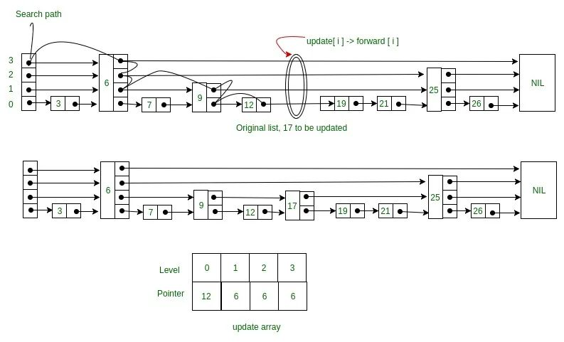

基础的数据结构有： 数据、链表、栈、队列、树、图。

可以归为两类： 线性表（数组、队列、栈、链表）+ 非线性表（树、图）。

线性表和非线性的区别是，线性是一对一的关系，没有元素只有一个前节点和后节点，非线性是一对多或者多对多的关系，每个元素可以有多个前后节点。

这里稍微讲下什么是抽象数据结构（ADT）：抽象数据结构是定义操作，不定义实现细节。比如队列可以用数组实现，也可以用链表实现。

复杂的数据结构是用基础的数据结构实现了一系列操作，比如跳表、红黑树、字典树等等。工业级别的程序使用复杂的数据结构较多。

### 数组

连续的内存空间，存储相同的数据类型。

在动态语言，比如JS中，也可以存储不同的数据类型。

优点：存取快、有CPU缓存优势

缺点：插入删除慢、分配大段连续的空间，可能有一定的空间浪费。

插入删除 O(n) 存取O(1)。

另外有一个特点是下标从0开始，为什么从0开始？

主要是寻址方便。比如二维数组的寻址公式：对于 m _n 的数组，寻址公式为：`address = base_address + ( i_ n + j) * type_size` 

base_address就是二维数组的名称，n是数组的长度，type_size是单个元素的大小。寻址公式的址指的内存地址，不懂的可以忽略。

使用场景：CPU缓存
CPU在从内存读取数据的时候，会先把读取到的数据加载到CPU的缓存中。而CPU每次从内存读取数据并不是只读取那个特定要访问的地址，而是读取一个数据块并保存到CPU缓存中，然后下次访问内存数据的时候就会先从CPU缓存开始查找，如果找到就不需要再从内存中取。

这样就实现了比内存访问速度更快的机制，也就是CPU缓存存在的意义:
为了弥补内存访问速度过慢与CPU执行速度快之间的差异而引入。

JS实现：

```js
// 声明一个 3x3 的二维数组并初始化
const matrix = [
  [1, 2, 3],
  [4, 5, 6],
  [7, 8, 9]
];

console.log(matrix);
// 输出:
// [
//   [1, 2, 3],
//   [4, 5, 6],
//   [7, 8, 9]
// ]
```

C++实现：

```c++
double balance[10] = {1,2,2,2,2,2,2,2,2} // 一维

int a[3][4] = { // 二维
	{0,1,2,3},
    {0,1,2,3},
    {0,1,2,3}
}
```

需要注意点： 
1、警惕数组越界, 比如C语言。

容器能否完全替代数组？ 
容器有细节封装好了、动态扩容等优点。容器在转为Integer类等有性能损耗（比如Java的boxing、unboxing)，多维数组比容器更直观，比如object[][] arr。

如何解决删除慢的问题？ 
为了避免 d，e，f，g，h 这几个数据会被搬移三次，我们可以先记录下已经删除的数据。每次的删除操作并不是真正地搬移数据，只是记录数据已经被删除。
当数组没有更多空间存储数据时，我们再触发执行一次真正的删除操作，这样就大大减少了删除操作导致的数据搬移。（JVM标记清除算法的核心）  

虚拟机采用可达性分析算法来判断是否存活。在标记阶段，会遍历所有GC ROOTS，将所有GC ROOTS可达的对象标记为存活。只有当标记工作完成后，清理才开始。  
不足：1 效率不高   2 产生不连续的内存空间碎片

经典LeetCode:
1. [Search in Rotated Sorted Array - Medium](https://leetcode.com/problems/search-in-rotated-sorted-array/)
2. [Friends Of Appropriate Ages - Medium](https://leetcode.com/problems/friends-of-appropriate-ages/)
3. LRU

### 链表

特点： 增删比较方便，查找低效，内存空间不浪费。插入删除操作O(1)
存取都是O(n)。 注意这里的插入和删除指的是操作，不包括查找。

1、循环链表：从链尾到链头比较方便，比如约瑟夫问题
2、双向链表: 空间换时间的概念，查询会更高效。比如java中的LinkedHashMap、LinkedList 
3、双向循环链表:  是循环链表和双向链表的结合

必须熟练的实现： 链表反转、有序链表合并

实现技巧： 
1、关键概念： 指针或者引用。 将变量赋值给指针，其实是把变量的地址赋值给指针，通过指针能找到这个变量。 
2、警惕指针丢失和内存泄露 
3、哨兵简化实现难度（插入排序、归并排序、动态规划都有使用）： 需要对第一个和最后一个节点特殊处理，带有哨兵的链表称为： 带头链表 
4、留意4种边界条件：链表为空；链表只包含一个节点；链表只包含两个节点；头节点和尾节点是否处理正常

C++实现：

```c++
struct Node {
   int data;
   Node *next;
};

class LinkedList {
   private: Node *head, *tail;
   public: LinkedList() {
       head = NULL;
       tail = NULL;
   }
   void addNode(int n) {
       Node *tmp = new Node;
       tmp->data = n;
       tmp->next= NULL;
       if(head == NULL) {
           head = tmp;
           tail = tmp;
       }
       else {
           tail->next = tmp;
           tail = tail->next;
       }
   }
};
```

经典leetcode: 
1、LRU缓存淘汰算法

### 栈

是一种抽象数据结构，数据集合如果具备先进后出、后进先出的特点，则优先采用栈。出栈的时间复杂度是O(1)， 入栈如果空间足够是O(1) 如果需要扩容是O(n)。

顺序栈： 用数组实现 
链式栈： 用链表实现。

为什么要函数调用要用“栈”来保存临时变量？
这里的栈是物理概念，符合后进先出的特征。调用函数进入被调用函数。会分配一个栈帧存放临时变量、参数以及其他信息，放到栈的顶部。当函数执行完的时候，刚好出栈。到前面一个栈帧（也就是作用域下）

JVM内存管理有“堆栈”概念？
栈内存用来存储局部变量和方法调用。 堆内存用来存储java中的对象。这里的栈是否和数据结构的栈是否一样呢？ 内存的堆栈和数据结构堆栈不是同一个概念。 内存是真实存在的物理区，数据结构的堆栈是抽象的数据存储结构，你可以用链表或者数组来实现。

扩展知识： 
内存空间逻辑上上分为：代码区、静态数据区和动态数据区。 动态数据区分为栈区和堆区。栈区：存储方法的形参、局部变量、返回值。堆区：存储对象的真实的数据。

经典问题： 
1、浏览器的前进后退：双栈（或者双向链表或者数组游标）  
2、表达式求值  
3、[括号匹配](https://leetcode.cn/problems/valid-parentheses/comments/)  

```c++
#define SIZE 10

class Stack {
   private: int *arr;
   private: int size = SIZE;
   private: int capacity;
   private: int top;
   public: Stack() {
       size = SIZE;
       arr = new int(size);
       top = -1;
   }
   public:void push(int);
   public: int pop();
};

void Stack::push(int value) {
   if(top == capacity - 1) {
       exit(EXIT_FAILURE);
   }
   arr[++top] = value;
}

int Stack::pop() {
   if(top == -1) {
       exit(EXIT_FAILURE);
   }
   return arr[top--];
}
```

为什么用栈的数据结构？ 
因为先入后出的特点， 能延迟问题解决。到某个条件下，再解决问题，同时能方便拿到这个上下文信息。  **附上[代码实现](https://codesandbox.io/s/valid-parentheses-ewu3p5?file=/src/index.ts)**  

4、函数调用栈

经典leetcode编号: 
20,155,232,844,224,682,496

### 队列

队列也是一个抽象的数据结构。 可以用数组和链表实现，分别是顺序队列和链式队列。其中的难点是**队满和队空的判定**

先进先出的特征。**对于大部分资源有限的场景，当没有空闲资源时，基本上都可以通过“队列”这种数据结构来实现请求排队。**

1、非循环队列： 数组实现
队满的判断条件是 tail == n，队空的判断条件是 head == tail 

2、循环队列： 
队满的判断条件是(tail+1)%n=head，队空的判断条件是 head == tail

判断队满的另一个思路： 我定义一个记录队列大小的值size，当这个值与数组大小相等时，表示队列已满，当tail达到最底时，size不等于数组大小时，tail就指向数组第一个位置。当出队时，size—，入队时size++


队满表达式是怎么来的？
在一般情况下，我们可以看出来，当队列满时，tail+1=head。但是，有个特殊情况，就是tail=n-1，而head=0时，这时候，tail+1=n，而head=0，所以用(tail+1)%n == n%n == 0。而且，tail+1最大的情况就是 n ，不会大于 n，这样，tail+1 除了最大情况，不然怎么余 n 都是 tail+1 本身，也就是 head。这样，表达式就出现了。

经典问题：
1、线程池等有限资源池

阻塞队列： 就是在队列为空的时候，从队头取数据会被阻塞。因为此时还没有数据可取，直到队列中有了数据才能返回；如果队列已经满了，那么插入数据的操作就会被阻塞，直到队列中有空闲位置后再插入数据，然后再返回。这就是生产者-消费者模型。  

并发队列： 线程安全的队列。直接在 enqueue()、dequeue() 方法上加锁，但是锁粒度大并发度会比较低，同一时刻仅允许一个存或者取操作。实际上，基于数组的循环队列，利用 CAS 原子操作，可以实现非常高效的并发队列。这也是循环队列比链式队列应用更加广泛的原因。在实战篇讲 Disruptor 的时候，我会再详细讲并发队列的应用。  

1.分布式应用中的消息队列，如 kafka 也是一种队列结构，高性能队列 Disruptor、Linux 环形缓存，都用到了循环并发队列；Java concurrent 并发包利用 ArrayBlockingQueue 来实现公平锁等 2.考虑使用CAS+数组实现无锁队列，则在入队前，获取tail位置，入队时比较tail是否发生变化，如果否，则允许入队，反之，本次入队失败。出队则是获取head位置，进行cas。

实现： 顺序队列会出现出队和入队时队列已满的情况。这个时候需要搬迁数组，整体建议通过入队时做搬迁保证出队时O(1)。还有一个办法通过循环队列实现：它的优势：1 顺时针 倒时针O(1) 2 快速的首尾删除、查找 滑动窗口 一般是保存数组的索引。最难的是确定好队空和队满的判定条件。循环队列的长度设定需要对并发数据有一定的预测，否则会丢失太多请求。

### 散列表

"Hash Table"，又称为hash表或者哈希表。

优势： 查很快

劣势：相比平衡二叉查找树 

1 数据无序 
2 性能不稳定 扩容比较耗时 
3 构造起来更复杂，AVL比较稳定


经典问题：
1、LRU缓存淘汰算法

### 二叉树

二叉树，简单说就是一个节点最多有两个子节点。
满二叉树
完全二叉树(靠左， 只有最后一层有缺. 因为可以用数组存，所以才有这个分类) 

几个概念：
高度(最长边数 层数-1）、深度（最长边数）、层数（从上往下1， 2….）


### 二叉搜索/查找树（BST）

binary search tree特点是： 左子树的节点 小于当前节点，当前节点小于右子树节点;

为了快速查找而存在

优势： 
0 最好的logn 最坏N 
1 中序遍历输出有序(logn)
2 二叉查找树支持重复数据（将重复数据放到右子树，或者用数组、链表扩容）

BFS Template：

```js
// 模版1： 栈实现
function bfs() {  
  let level = -1
  // 第一步：初始化Q  
  let Q = [start]
  // 第二步：遍历Q  
  while(Q.length !== 0) {  
    level++
    // 第三步：处理逻辑
    const start = Q.shift()
    for (;;) {
      if(findTheTarget) { return } 
      // 第四步：更新Q  
      Q.push(newItem)  
    }  
  }  
}

  
// 模版2
function bfs() {  
  let level = -1
  // 第一步：初始化Q  
  let Q = [start]
  // 第二步：遍历Q  
  while(Q.length !== 0) {  
    level++
    // 第三步：处理逻辑
    let next = []
    for (let i of Q) {
      if(i.left) next.push(i.left)
      if(i.right) next.push(i.right)
      // 第四步：更新Q  
      Q = next  
    }  
  }  
}

``` 

DFS Template

```js
// 模版1: 数组存储的遍历
function travalUtl(narr, index, col, map) {  
  if (!narr[index]) return;  
  travalUtl(narr, 2 * index, col - 1, map);  
  // do something  
  travalUtl(narr, 2 * index + 1, col + 1, map);  
}


// 模版2: 只有索引，没有存储。
function travalUtil(i, j, finishi, finishj, res) {  
  if (i > finishi || j > finishj) return;  
  if (i === finishi && j === finishj) {  
    res.count++;  
    return;  
  }  
  travalUtil(i, j + 1, finishi, finishj, res);  
  travalUtil(i + 1, j, finishi, finishj, res);  
}

void preOrder(Node *node) {
   if(!node) return;
   print node
   preOrder(node->left)
   preOrder(node->right)
}

void inOrder(Node *node) {
  if(!node) return;
  inOrder(node->left)
  print node
  inOrder(node->right)
}

void postOrder(Node *node) {
  if(!node) return
  postOrder(node->left)
  postOrder(node->right)
  print node
}
```

经典问题
1、墙和门

你被给定一个 m × n 的二维网格，网格中有以下三种可能的初始化值：

- -1 表示墙或是障碍物
- 0 表示一扇门
- INF 无限表示一个空的房间。然后，我们用 231 - 1 = 2147483647 代表 INF。你可以认为通往门的距离总是小于 2147483647 的。

你要给每个空房间位上填上该房间到 **最近** 门的距离，如果无法到达门，则填 INF 即可。

解答：

![[Pasted image 20240225172900.png]]

```js
function update(row, column, rooms, step, next) {
  if (
    row < 0 ||
    row >= rooms.length ||
    column < 0 ||
    column >= rooms[row].length ||
    rooms[row][column] !== 2147483647
  )
    return;
  rooms[row][column] = step;
  next.push([row, column]);
}

function bfs(rooms) {
  // 第一步：初始化
  let Q = [];
  for (let i = 0; i < rooms.length; i++) {
    const element = rooms[i];
    for (let j = 0; j < element.length; j++) {
      Q.push([i, j]);
    }
  }

  // 第二步：遍历
  let step = 0;
  while (Q.length !== 0) {
    // 第三步：处理逻辑
    let next = [];
    for (let [row, column] of Q) {
      update(row, column - 1, rooms, step, next);
      update(row, column + 1, rooms, step, next);
      update(row - 1, column, rooms, step, next);
      update(row + 1, column, rooms, step, next);
    }
    step++;
    // 第四步： 更新Q
    Q = next;
  }
  return rooms;
}

export default bfs;

```

解释： 这个题目INF表示空房间，0表示目标房间，-1表示过不去。从空房间到0的最短距离是多少，则将对应的INF设置为多少。显然靠近0的位置，也就是上下左右的INF（见Step 1)

因为只需要走一步，所以直接设置为1(见Step2)。设置完以后，后续的我们只需要找到1这个空房间，然后再把他周边的INF设置为2，因为从INFO到0房间的路径增加了1个房间（也就是标记为1的空房间），

然后我们依此找2这个房间，3这个房间，做同样的操作，直到所有的房间都被标记好最短路径。这是暴力解法。

实际上我们第一遍遍历，可以先把标记的位置存起来，然后我们不需要从头遍历这个图，只需要找标记的位置的周围位置依此处理（见图示Method 2: bfs）。

仔细看这也是一棵递归树，从上往下遍历，我们是先横向遍历，所以是BFS。

在线测试：https://codesandbox.io/s/walls-and-gates-8eg7uk?file=/src/bfs.ts

2、[垂直遍历](https://leetcode.com/problems/vertical-order-traversal-of-a-binary-tree/)

给定一个二叉树，返回其结点 垂直方向（从**上到下**，逐列）遍历的值。

如果两个结点在同一行和列，那么顺序则为 从**左到右**。

解法： 二维数组存放这个二叉树，有一个特点，就是左右子树能根据索引直接读取。比如当前节点的索引是i， 那么左子树的节点是i  *  2，右子树的节点2*i+1。 

这里有一个前提是，数组必须从1开始，0位数组必须为空（因为0位的索引是0，0  *  2的就为0了）。 弄清楚数据结构的特点，回到题目是要要根据列排序，比如图示，按照列的值排序应该是-2，-1，0，0，0，1，2

然后我们可以输出相应的值[[4],[2],[1,5,6],[3],[7]]。我们可以dfs遍历这个树，维护一个hashtable<值，列值>, 每个节点，去计算它的列值，比如2这个节点，它的列值是它父节点列值-1， 3这个节点，它的列值是它父节点的列值+1。

为什么是dfs？因为我们的遍历顺序不是层序，排除法自然就是dfs。这里主要注意的是我们采用了数组存放binary search tree，所以我们的遍历模版需要带上索引。

```js
function travalUtl(narr, curIndex, col, map) {
  if (!narr[curIndex]) return;

  var letfIndex = 2 * curIndex;
  travalUtl(narr, letfIndex, col - 1, map);

  if (narr[curIndex]) {
    if (map[col]) {
      map[col].push(narr[curIndex]);
      map[col].sort((a, b) => a - b);
      console.log(map[col]);
    } else {
      map[col] = [narr[curIndex]];
    }
  }

  var rightIndex = 2 * curIndex + 1;
  travalUtl(narr, rightIndex, col + 1, map);
}
```

在线测试: https://codesandbox.io/s/relaxed-night-j6xhc1?file=/src/dfs.ts

3、 [检测二叉搜索树](https://leetcode.com/problems/validate-binary-search-tree/)

解法：没有特殊性。 只需要遍历二叉树，并按照二叉树定义条件判断

```js
function travelUtil(arr, index, v) {
  if (!arr[index] || !v.result) return;

  if (arr[2 * index] && arr[index] < arr[2 * index]) {
    v.result = false;
    return;
  }
  if (arr[2 * index + 1] !== null && arr[index] > arr[2 * index + 1]) {
    v.result = false;
    return;
  }

  travelUtil(arr, 2 * index, v);
  travelUtil(arr, 2 * index + 1, v);
}
```
**[在线测试](https://codesandbox.io/s/validate-binary-search-tree-k8qm8t)**

 4、[唯一路径](https://leetcode.com/problems/unique-paths/)**
一个机器人位于 m x n 网格的右上角. 机器人只能向右或者向下. 机器人试图到达右下角. 问有多少种不重复的路径?  
![[Pasted image 20240225223408.png]]
上图是一个 3 x 7 的网格. m 和 n 最大为 100.


```js
function travalUtil(i, j, finishi, finishj, res) {
  if (i > finishi || j > finishj) return;
  if (i === finishi && j === finishj) {
    res.count++;
    return;
  }
  travalUtil(i, j + 1, finishi, finishj, res);
  travalUtil(i + 1, j, finishi, finishj, res);
}
```

解法： 可以看到一个3 * 7的矩行。它的路径访问图是一棵树，也就是说我们可以通过深度遍历的方式遍历所有的可能，然后找到满足条件的路径总数。而且这里可以看到中间有重复的节点。 比如（1，1），我们可以先存储这些节点，减少计算

在线测试： https://codesandbox.io/s/unique-paths-1f9w8q?file=/src/index.ts:0-261

### 平衡二叉搜索/查找树(AVL)

任意节点的左右子树高度差不能大于1（满二叉树 完全二叉树都是avl）

AVL的构建涉及三个节点的旋转，保持平衡：
每次比较都会检查树是否平衡，旋转只会操作三个节点（平衡因子：左右子树的高度差）

```c++
// Left Left Case imbalance
if (balance > 1 && key < node->left->key)
	return rightRotate(node);

// Right Right Case imbalance
if (balance < -1 && key > node->right->key)
	return leftRotate(node);

// Left Right Case imbalance
if (balance > 1 && key > node->left->key)
{
	node->left = leftRotate(node->left);
	return rightRotate(node);
}

// Right Left Case imbalance
if (balance < -1 && key < node->right->key)
{
	node->right = rightRotate(node->right);
	return leftRotate(node);
}
```


优势：
1  查找、插入、删除最好、坏情况都是log n（等比数列求和），
2  log n时间查找到最大数（数组转为AVL）

###  红黑树
不是严格意义上的平衡二叉查找树，但维护平衡的代价更低，是为了解决平衡二叉搜索树性能退化问题存在

### 堆
定义： 
1 是一个完全二叉树
2 每个节点的值都大于等于或者小于等于每个节点的值

n/2+1到n都是叶子结点

插入： 堆化 从上往下或者从下往上一个个对比，交换位置
删除： 最后一个元素和它替换， 然后堆化处理

堆化的过程就是除叶子节点，时间复杂度是O(n)
排序也是堆化的过程，时间复杂度是O(nlogn)

### 跳表

能快速插入、删除、查找，它的平均时间复杂度O(logn)，当然最差也是O(logn)（退化为普通链表）。它的算法图解： 



想到快速查找、删除、插入，很快能想到的是红黑树和哈希表。那么跳表的优势是什么？跳表能**保证有序性，所以范围查找更具备优势**。红黑树实现起来更复杂。

邻接表的链表可以用跳表替换，另外数据库索引也是采用了跳表实现高效查找。

跳表本质上是链表，在上图可以看到每个节点除了数字，还有黑色小圆点，这里的黑色小圆点的作用是保存下一个节点的指针。

所以每个节点的数据结构：

``` js
class Node {
  constructor() {
    this.data = -1; // 数据
    this.forwards = new Array(this.MAX_LEVEL);// 黑色小圆点
    this.maxLevel = 0;
  }
}
```  

这样简单数据结构就可以满足跳表的算法（见图解），非常简单有没有！

具体实现插入、删除函数时，还需要辅助数据结构。

这里关键的是：update数组存储search path，update数据长度是层级的大小。

为什么要这个辅助数据结构，因为插入删除操作需要调整指针，没有这个数组，你不知道当前搜索位置在哪里，当前层级的下一个节点是哪个，也就无从插入和删除了，所以它是必要的。 

从这个案例上，数据结构的确是为了算法服务的。因为我们需要实现不同层级黑色小圆点，所以设计了forwards数组，然后因为要保存搜索位置，所以设计了update数组。

二、跳表的时间复杂度？ 

1.计算跳表的高度 

如果链表有n个节点，每2个节点抽取抽出一个节点作为上一级索引的节点，那第1级索引的节点个数大约是n/2，第2级索引的节点个数大约是n/4，依次类推，第k级索引的节点个数就是n/(2^k)。

假设索引有h级别，最高级的索引有2个节点，则有n/(2^h)=2，得出h=log2n-1，包含原始链表这一层，整个跳表的高度就是log2n。 

2.计算跳表的时间复杂度 

假设我们在跳表中查询某个数据的时候，如果每一层都遍历m个节点，那在跳表中查询一个数据的时间复杂度就是O(m * logn)。那这个m是多少呢？

如下图所示，假设我们要查找的数据是x，在第k级索引中，我们遍历到y节点之后，发现x大于y，小于后面的节点z，所以我们通过y的down指针，从第k级下降到第k-1级索引。在第k-1级索引中，y和z之间只有3个节点（包含y和z）

所以，我们在k-1级索引中最多只需要遍历3个节点，以此类推，每一级索引都最多只需要遍历3个节点。所以m=3。因此在跳表中查询某个数据的时间复杂度就是O(logn)。

三、跳表的空间复杂度及如何优化？

1.计算索引的节点总数 

如果链表有n个节点，每2个节点抽取抽出一个节点作为上一级索引的节点，那每一级索引的节点数分别为：n/2，n/4，n/8，…，8，4，2，等比数列求和n-1，所以跳表的空间复杂度为O(n)。

2.如何优化时间复杂度 

如果链表有n个节点，每3或5个节点抽取抽出一个节点作为上一级索引的节点，那每一级索引的节点数分别为（以3为例）：n/3，n/9，n/27，…，27，9，3，1，等比数列求和n/2，所以跳表的空间复杂度为O(n)，和每2个节点抽取一次相比，时间复杂度要低不少呢。

四、高效的动态插入和删除？ 

跳表本质上就是链表，所以仅插作，插入和删除操时间复杂度就为O(1)，但在实际情况中，要插入或删除某个节点，需要先查找到指定位置，而这个查找操作比较费时，但在跳表中这个查找操作的时间复杂度是O(logn)，所以，跳表的插入和删除操作的是时间复杂度也是O(logn)。

五、跳表索引动态更新？

当往跳表中插入数据的时候，可以选择同时将这个数据插入到部分索引层中，那么如何选择这个索引层呢？可以通过随机函数来决定将这个节点插入到哪几级索引中，比如随机函数生成了值K，那就可以把这个节点添加到第1级到第K级索引中。

Redis的对象系统中的每种对象实际上都是基于使用场景选择多种底层数据结构实现的，比如ZSET就是基于【压缩列表】或者【跳跃表+字典】（这也跟之前排序中提到的Sort包实现的思想一样，基于数据规模选择合适的排序算法

redis有序集合是由一个双hashmap构成的字典和跳跃表实现的

如果每三个或者五个节点提取一个节点作为上级索引，那么对应的查询数据时间复杂度，应该也还是 O(logn)。 假设每 5 个节点提取，那么最高一层有 5 个节点，而跳表高度为 log5n，每层最多需要查找 5 个节点，即 O(mlogn) 中的 m = 5，最终，时间复杂度为 O(logn)。 空间复杂度也还是 O(logn)，虽然省去了一部分索引节点，但是似乎意义不大。

每个节点的forward里存的是当前节点的所有索引层的下一跳，forward[ 0 ]对应的是原链表里的下一跳，forward[ 1 ]是最后一层节点的下一跳位置，以此类推，也就是说访问head的forward[ levelCount-1 ]表示第一层索引的头结点。head是一个头结点，它的forward里存的是原链表以及索引层的头结点。

“update 更名为 preNodes ，即 待插新节点在每一层的pre 结点数组； forwards 更名为 nextNodes，即 当前节点在每一层的next节点数组”

等比数列求和有想法 老师的n-2并不是估算解 是精确解 n/2, n/4, .., 2 这个数列中一共有log2(n/2)项 套进等比数列求和公式 S = a0(1-q^n)/(1-q), 其中a0表示首项，n表示项数 这里的a0=n/2, 项数=log2(n/2), q=1/2 S = n/2(1-2/n)/(1-1/2) = n-2

https://github.com/wangzheng0822/algo/tree/master/c-cpp

经典场景： 社交网络关系

```js
export class SkipList {
  constructor() {
    this.SKIPLIST_P = 0.5;
    this.MAX_LEVEL = 16;
    this.levelCount = 1;
    this.head = new Node();
  }

  find(value) {
    let p = this.head;
    for (let i = this.levelCount - 1; i >= 0; --i) {
      while (p.forwards[i] !== null && p.forwards[i].data < value) {
        p = p.forwards[i];
      }
    }

    if (p.forwards[0] !== null && p.forwards[0].data === value) {
      return p.forwards[0];
    } else {
      return null;
    }
  }

  insert(value) {
    const level = value === 5 ? 2: 1;
    const newNode = new Node();
    newNode.data = value;
    newNode.maxLevel = level;
    const update = new Array(level).fill(this.head);

    let p = this.head;
    for (let i = level - 1; i >= 0; --i) {
      while (p.forwards[i] && p.forwards[i].data < value) {
        p = p.forwards[i];
      }
      update[i] = p;
    }

    for (let i = 0; i < level; ++i) {
      newNode.forwards[i] = update[i].forwards[i];
      update[i].forwards[i] = newNode;
    }

    if (this.levelCount < level) this.levelCount = level;
  }

  delete(value) {
    const update = new Array(this.levelCount);
    let p = this.head;
    for (let i = this.levelCount - 1; i >= 0; --i) {
      while (p.forwards[i] !== null && p.forwards[i].data < value) {
        p = p.forwards[i];
      }
      update[i] = p;
    }

    if (p.forwards[0] !== null && p.forwards[0].data === value) {
      for (let i = this.levelCount - 1; i >= 0; --i) {
        if (
          update[i].forwards[i] !== null &&
          update[i].forwards[i].data === value
        ) {
          update[i].forwards[i] = update[i].forwards[i].forwards[i];
        }
      }
    }

    while (
      this.levelCount > 1 &&
      this.head.forwards[this.levelCount] === null
    ) {
      this.levelCount--;
    }
  }

  randomLevel() {
    let level = 1;

    while (Math.random() < this.SKIPLIST_P && level < this.MAX_LEVEL) {
      level += 1;
    }
    return level;
  }

  printAll() {
    let p = this.head;
    while (p.forwards && p.forwards[0] !== null) {
      console.log(p.forwards[0]);
      p = p.forwards[0];
    }
    console.log();
  }
}

class Node {
  constructor() {
    this.data = -1;
    this.forwards = new Array(this.MAX_LEVEL);
    this.maxLevel = 0;
  }

  toString() {
    return `{ data: ${this.data}, levels: ${this.maxLevel} }`;
  }
}

```

```js
class SkipListNode {
  constructor(value, level) {
    this.value = value;
    this.next = new Array(level).fill(null);
  }
}

class SkipList {
  constructor() {
    this.head = new SkipListNode(null, 32);
    this.maxLevel = 0;
  }

  randomLevel() {
    let level = 1;
    while (Math.random() < 0.5 && level < this.head.next.length) {
      level++;
    }
    return level;
  }

  insert(value) {
    const newNodeLevel = this.randomLevel();
    const newNode = new SkipListNode(value, newNodeLevel);

    let currentNode = this.head;
    const update = new Array(newNodeLevel).fill(null);

    for (let i = this.maxLevel - 1; i >= 0; i--) {
      while (currentNode.next[i] && currentNode.next[i].value < value) {
        currentNode = currentNode.next[i];
      }
      update[i] = currentNode;
    }

    for (let i = 0; i < newNodeLevel; i++) {
      newNode.next[i] = update[i].next[i];
      update[i].next[i] = newNode;
    }

    if (newNodeLevel > this.maxLevel) {
      this.maxLevel = newNodeLevel;
    }
  }

  search(value) {
    let currentNode = this.head;
    for (let i = this.maxLevel - 1; i >= 0; i--) {
      while (currentNode.next[i] && currentNode.next[i].value < value) {
        currentNode = currentNode.next[i];
      }
    }
    currentNode = currentNode.next[0];

    if (currentNode && currentNode.value === value) {
      return currentNode;
    }
    return null;
  }
}

function createAdjacencyList(relationships) {
  const adjacencyList = {};

  for (const node in relationships) {
    if (relationships.hasOwnProperty(node)) {
      const skipList = new SkipList();
      const neighbors = relationships[node];

      for (const neighbor of neighbors) {
        skipList.insert(neighbor);
      }

      adjacencyList[node] = skipList;
    }
  }

  return adjacencyList;
}
//
// const relationships = {
//   1: [2],
//   2: [1, 3, 4],
//   3: [2, 5],
//   4: [1, 2, 5],
//   5: [2, 3, 4],
// };
//
// const adjacencyList = createAdjacencyList(relationships);
// console.log(adjacencyList);

```
### 图

**图的存储和遍历 VS 树的存储和遍历 数据结构有什么区别？**  

这里的图是有向无环图。树的遍历有两种，一种是广度一种是深度。

广度可以理解为按层遍历，就像把一层的房间都看一遍，再到第二层看房间，深度可以理解为走迷宫，是一条路走到黑，走完以后再回来走另一条路（这个也称之为回溯算法）

树的前中后序遍历都属于深度，它们的不同点在于节点访问顺序不同。这两种算法在图也适用。数据结构上稍有不同。

  
图的话存储是用的邻接表（数组+链表）和邻接矩阵（二维数组）数据结构

``` js
class Graph {
    constructor(v) {
        this.v = v;
        this.adj = new Array(v); // 邻接表（数组）
        for (let i = 0; i < v; ++i) {
           this.adj[i] = new LinkedList(); // 链表或者跳表
        }
    }
}
```

``` js

class Graph {
    constructor(v) {
        this.v = v;
        this.adj = new Array(v); // 邻接矩阵（二维数组）
        for (let i = 0; i < v; ++i) {
            this.adj[i] = [];
        }
    }
}
```

树存储的话比较简单，变量存左右指针或者数组存左右指针。

在实际遍历的时候，广度遍历需要借助queue队列，作为辅助数据结构，为什么需要队列？一是我们需要存储每层的节点，二是需要保持遍历顺序，队列刚好满足这个特性。因为图可能存在环，我们借助visited数组判断是否访问过，而树不需要。如果有需要可以通过prev数组保存访问路径。

```js
const graph = {
	A: ['B', 'C'],
	B: ['D'],
	c: []
}

function bfs(graph) {
	const queue = [];
	const visited = new Set();
	const prev = [];

	queue.push(Object.keys(graph)[0])

	while(queue.length > 0) {
		const current = queue.shift();
		visited.push(current)
		prev.push(current)
		for(const edge of current) {
			if(!visited.has(edge)) {
				queue.push(edge)
				prev.push(edge)
			}
		}
	}
	return prev
}
```

简单的数据结构能够实现复杂的算法，关键是对数据结构有深入的理解，加上对算法的理解，就可以写出好的代码。

经典问题：源文件编译依赖关系：
入度： 指向该节点的边的数量

1、通过拓扑排序实现：
```js
// @params { number } v   顶点个数
// @params { array }  arr 邻接矩阵
//  0 1 2 3 4 
//0 1 0 1 0
//1 1 1
//2 
//3

// 邻接矩阵
function topo(v, arr) {
    let inDegree = new Array(v).fill(0)
	for(let i = 0; i<v; i++) { // v 是5
		if(let j = 0; j < arr[i].length; j++) {
		    if(arr[i][j] === 1) {
				inDegree[j]++
			}
		}
	}

	let queue = []
	for(let i = 0; i < v; i++) {
		if(inDegge[i] === 0) {
			queue.push(i)
		}
	}

	let result = [];
	while(queue.length > 0) {
		const i = queue.shift()
		result.push(i)
		for(let j = 0; j < arr[i].length; j++) {
			if(arr[i][j] === 1) {
				inDegree[j]--
				if(inDegree[j] === 0) {
					queue.push(j)
				}
			}
		}
	}

	if(result.length !== v) {
		// 存在环
	}

}

// 临接表
const graph = {
	A: ['B', 'C'],
	B: ['D'],
	c: []
}
·
function topo(graph) {
    const nodes = Object.keys(graph);
    const inDegree = new Map();// 用对象也OK 相当于是逆邻接表

	for(const node of nodes) {
		const edges = graph[node];
		// for(const edge of edges)
		for(let j = 0; j < edges.length; j++) {
			const w = edges[j]
			inDegree.set(w, (inDegree.get(w) || 0 ) + 1)
		}
	}

	const queue = []
	for(const [key, value] of inDegree) {
		if(value===0) {
			queue.push(key)
		}
	}

	let result = []
	while(queue.length > 0) {
		const w = queue.shift()
		result.push(w)
		for(let j = 0; j < graph[w].length; j++) {
			const w = graph[w][j]
			inDegree.set(w, inDegree.get(w) - 1)
			if(inDegree.get(w) === 0) {
				queue.push(w)
			}
		}
	}

	if(result.length !== nodes.length) {
		// 存在环
	}
}

```

2、通过dfs遍历
```js
function topoSortByDFS() {
  // 先构建逆邻接表，边s->t表示，s依赖于t，t先于s
  const inverseAdj = new Array(v).fill().map(() => []);
  for (let i = 0; i < v; ++i) {
    for (let j = 0; j < adj[i].length; ++j) {
      const w = adj[i][j]; // i->w
      inverseAdj[w].push(i); // w->i
    }
  }
  const visited = new Array(v).fill(false);
  for (let i = 0; i < v; ++i) {
    if (!visited[i]) {
      visited[i] = true;
      dfs(i, inverseAdj, visited);
    }
  }
}

function dfs(vertex, inverseAdj, visited) {
  for (let i = 0; i < inverseAdj[vertex].length; ++i) {
    const w = inverseAdj[vertex][i];
    if (visited[w]) continue;
    visited[w] = true;
    dfs(w, inverseAdj, visited);
  }
  // 先把vertex这个顶点可达的所有顶点都打印出来之后，再打印它自己
  console.log("->" + vertex);
}
```
通过栈来实现：
```js
const visited = new Set()
for(let node of graph) {
	if(!visited.has(node)) {
		dfs(node)
	}
}

function dfs(node) {
    visited.add(node)
    const neighbors = graph[node] || []
    for(const neighbor of neighbors) {
    	if(!visited.has(neighbor)) {
    		dfs(neighbor)
    	}
    }
    stack.unshift(node) // u->v 先将u推入栈中。保证最后输出的是v, u
}
return stack;
```

经典问题： 三度好友
```js
// // 邻接表
// class Node {
//     constructor(vertex) {
//         this.vertex = vertex;
//         this.next = null;
//     }
// }
// export function addEdge(adj, source, destination) {
//     let newNode = new Node(destination);
//     newNode.next = adj[source];
//     adj[source] = newNode;
// }

class Node {
    constructor(value) {
        this.value = value;
        this.next = null;
    }
}

// class LinkedList {
//     constructor() {
//         this.head = null;
//     }
//
//     add(value) {
//         const newNode = new Node(value);
//         if (!this.head) {
//             this.head = newNode;
//         } else {
//             let current = this.head;
//             while (current.next) {
//                 current = current.next;
//             }
//             current.next = newNode;
//         }
//     }
// }

// class Graph {
//     constructor(v) {
//         this.v = v;
//         this.adj = new Array(v);
//         for (let i = 0; i < v; ++i) {
//             this.adj[i] = new LinkedList();
//         }
//     }
//
//     addEdge(s, t) {
//         this.adj[s].add(t);
//         this.adj[t].add(s);
//     }
// }

class Graph {
    constructor(v) {
        this.v = v;
        this.adj = new Array(v);
        for (let i = 0; i < v; ++i) {
            this.adj[i] = [];
        }
    }

    /**
     *
     * @param s s是顶点
     * @param t
     */
    addEdge(s, t) {
        this.adj[s].push(t);
        this.adj[t].push(s);
    }
}

// // 邻接矩阵
// let adj = [
//     [1, 2],    // Adjacency list for vertex 0
//     [0, 2, 3], // Adjacency list for vertex 1
//     [0, 1, 4], // Adjacency list for vertex 2
//     [1],       // Adjacency list for vertex 3
//     [2]        // Adjacency list for vertex 4
// ];

```

```js
import { addEdge } from "./adj-list";

/**
 * 广度优先
 * @param s
 * @param t
 */
function bfs(adj, s, t) {
  if (s === t) return;
  const visited = new Array(v).fill(false);
  visited[s] = true;
  const queue = [];
  queue.push(s);
  const prev = new Array(v).fill(-1);
  while (queue.length !== 0) {
    const w = queue.shift();
    for (let i = 0; i < adj[w].length; i++) {
      const q = adj[w][i]; // adj[w].get(i) 但是链表取i不方便，所以可以改为跳表
      if (!visited[q]) {
        prev[q] = w;
        if (q === t) {
          print(prev, s, t);
          return;
        }
        visited[q] = true;
        queue.push(q);
      }
    }
  }
}

function print(prev, s, t) {
  if (prev[t] !== -1 && t !== s) {
    print(prev, s, prev[t]);
  }
  console.log(t + " ");
}

// 深度優先搜索
let found = false; // 全局变量或类成员变量

function dfs(adj, s, t) {
  found = false;
  const visited = new Array(v).fill(false);
  const prev = new Array(v).fill(-1);
  for (let i = 0; i < v; ++i) {
    prev[i] = -1;
  }
  recurDfs(s, t, visited, prev);
  print(prev, s, t);
}

function recurDfs(adj, w, t, visited, prev) {
  if (found === true) return;
  visited[w] = true;
  if (w === t) {
    found = true;
    return;
  }
  for (let i = 0; i < adj[w].length; ++i) {
    const q = adj[w][i];
    if (!visited[q]) {
      prev[q] = w;
      recurDfs(q, t, visited, prev);
    }
  }
}
// Helper function to print the path
function print(prev, s, t) {
  // Implement your own logic to print the path
  // based on the 'prev' array and the given 's' and 't'
}


export function graph_bfs_function() {
  // Example usage
  let v = 5; // Number of vertices

  let adj = new Array(v).fill(null);

// Add edges to the adjacency list using linked list
  addEdge(adj, 0, 1);
  addEdge(adj,0, 2);
  addEdge(adj,1, 2);
  addEdge(adj,1, 3);
  addEdge(adj,2, 4);

  let source = 0; // Source vertex
  let target = 4; // Target vertex

  bfs(adj, source, target, v);
  return true;
}

export function test_bfs_function() {
// Example usage
  let v = 5; // Number of vertices

  let adj = new Array(v).fill(null);

// Add edges to the adjacency list using linked list
  addEdge(adj, 0, 1);
  addEdge(adj,0, 2);
  addEdge(adj,1, 2);
  addEdge(adj,1, 3);
  addEdge(adj,2, 4);

  let source = 0; // Source vertex
  let target = 4; // Target vertex

  dfs(adj, source, target);
}
```

### Trie树

字典树。主要是用来解决前缀字符串多模式匹配用的。比如google关键字搜索匹配

```js
const createTrieNode = (data) => {
  return {
    data,
    children: Array(26)
      .fill(null),
    isEndingChar: false,
  };
};

const createTrie = () => {
  const root = createTrieNode("/");
  const insert = (words: string) => {
    let p = root;
    Array.from(words).forEach((c: string) => {
      let index: number = c.charCodeAt(0) - "a".charCodeAt(0);
      // 创建新节点
      if (p.children[index] === null) {
        p.children[index] = createTrieNode(c);
      }
      // 指向新节点
      p = p.children[index];
    });
    // 标记为单词结束节点
    p.isEndingChar = true;
  };
  const find = (pattern: string) => {
    let p = root;
    Array.from(pattern).forEach((c: string) => {
      let index = c.charCodeAt(0) - "a".charCodeAt(0);
      if (p.children[index] === null) {
        return false; // not found
      }
      p = p.children[index]; // found
    });
    if (p.isEndingChar === false) return false; // 不能完全匹配
    return true; //找到单词。完全匹配
  };

  return {
    insert,
    find,
  };
};

export function trie_TestFunction() {
  const trie = createTrie();
  const { insert, find } = trie;
  insert("apple");
  insert("app");
  insert("application");
  insert("banana");
  insert("bat");
  insert("cat");
  // 某一个串是否在trie树中
  const result = find("app");
  console.log(result);
  return result
}

```

