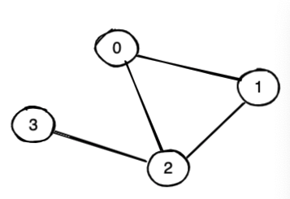
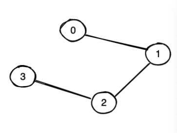

## 问题定义

给定一个无向图，如何检查图中是否有一个环？

### **用例 1**
- **输入**:  
  - `n = 4`（顶点数）  
  - `e = 4`（边数）  
  - 边集合：`{ 0-1, 1-2, 2-3, 0-2 }`
- **输出**: `Yes`（存在环）
- **示例**:
  
  *图：存在环*

---

### **用例 2**
- **输入**:  
  - `n = 4`（顶点数）  
  - `e = 3`（边数）  
  - 边集合：`{ 0-1, 1-2, 2-3 }`
- **输出**: `No`（不存在环）
- **示例**:
  
  *图：不存在环*

---

## 问题分析

我们都知道：
> **算法 + 数据结构 = 程序**

因此，我们需要创建一个数据结构来表示无向图。以下是两种常见的数据结构：

1. **邻接表**  
   如果顶点 `1` 与顶点 `2` 和 `3` 相连，则邻接表表示为：  
   `{ 1: [2, 3] }`

2. **邻接矩阵**  
   在 JavaScript 中，可以使用 `Map` 实现。

---

### 算法：如何检测环

#### 方案 1: 并查集（Disjoint Set Union, DSU）
- **初始化**: 每个顶点都是一个独立的集合。
- **合并操作**: 遍历所有边，如果两个顶点属于不同集合，则合并它们。
- **判断环**: 如果两个顶点已经属于同一个集合，则说明存在环。

#### 方案 2: 深度优先搜索（DFS）或广度优先搜索（BFS）
- **访问标记**: 使用一个布尔数组记录每个节点是否被访问过。
- **判断环**: 如果当前节点的邻接节点已被访问且不是其父节点，则说明存在环。

---

## 编码实现

以下代码实现了基于邻接表的无向图，并提供了三种检测环的方法：并查集、DFS 和 BFS。


*图：一个无向图示例*

```javascript
/*
  Graph using adjacency list. Support operations:
  1. Traverse by DFS/BFS
  2. hasCircleByDfs
  3. hasCircleByBfs
  4. hasCircleByDss (Disjoint Set)
*/
class Graph {
  constructor() {
    this.allVertexes = [];
    this.allEdges = [];
    this.adList = new Map();
  }

  // 添加顶点
  addV(v) {
    if (!this.adList.has(v)) {
      this.adList.set(v, []);
    }
    this.allVertexes.push(v);
  }

  // 添加边
  addE(source, dest) {
    if (!this.adList.has(source)) {
      this.addV(source);
    }
    if (!this.adList.has(dest)) {
      this.addV(dest);
    }
    this.adList.get(source).push(dest);
    this.adList.get(dest).push(source);
    this.allEdges.push({ source, dest });
  }

  // 删除顶点
  removeV(v) {
    for (let adV of this.adList.get(v)) {
      this.removeE(v, adV);
    }
    this.adList.delete(v);
  }

  // 删除边
  removeE(source, dest) {
    this.adList.set(
      source,
      this.adList.get(source).filter((v) => v !== dest)
    );
    this.adList.set(
      dest,
      this.adList.get(dest).filter((v) => v !== source)
    );
  }

  // 打印邻接表
  print() {
    for (let v of this.adList.keys()) {
      let cons = "";
      for (let dest of this.adList.get(v)) {
        cons += dest + " ";
      }
      console.log(v + " -> " + cons);
    }
  }

  // 使用并查集检测环
  hasCircleByDss() {
    const dss = new DisjointSet();
    this.allVertexes.forEach((v) => {
      dss.makeSet(v);
    });
    return this.allEdges.some((e) => dss.union(e.source, e.dest));
  }

  // 使用 BFS 检测环
  bfs(start) {
    const queue = [start];
    const result = [];
    const visited = {};
    visited[start] = true;
    while (queue.length) {
      const curV = queue.shift();
      result.push(curV);
      this.adList.get(curV).forEach((dest) => {
        if (!visited[dest]) {
          visited[dest] = true;
          queue.push(dest);
        }
      });
    }
    return result;
  }

  hasCircleByBfs() {
    const parent = {};
    const visited = {};
    const queue = [];
    for (let i = 0; i < this.allVertexes.length; i++) {
      const node = this.allVertexes[i];
      if (!visited[node]) {
        visited[node] = true;
        queue.push(node);
        while (queue.length) {
          const curV = queue.shift();
          visited[curV] = true;
          const allAdNodes = this.adList.get(curV);
          for (let j = 0; j < allAdNodes.length; j++) {
            const dest = allAdNodes[j];
            if (!visited[dest]) {
              visited[dest] = true;
              parent[dest] = curV;
              queue.push(dest);
            } else if (dest !== parent[curV]) {
              return true;
            }
          }
        }
      }
    }
    return false;
  }

  // 使用 DFS 检测环
  dfsRecursive(start) {
    const result = [];
    const visited = {};
    const adList = this.adList;
    (function dfs(v) {
      if (!v) return null;
      visited[v] = true;
      result.push(v);
      adList.get(v).forEach((dest) => {
        if (!visited[dest]) {
          return dfs(dest);
        }
      });
    })(start);
    return result;
  }

  dfsIterative(start) {
    const result = [];
    const visited = {};
    const stack = [start];
    visited[start] = true;
    while (stack.length) {
      const curV = stack.pop();
      result.push(curV);
      this.adList.get(curV).forEach((dest) => {
        if (!visited[dest]) {
          visited[dest] = true;
          stack.push(dest);
        }
      });
    }
    return result;
  }

  hasCircleUtil(node, visited, parent) {
    visited[node] = true;
    const adList = this.adList.get(node) || [];
    for (let i = 0; i < adList.length; i++) {
      if (adList[i] === parent) continue;
      if (visited[adList[i]]) return true;
      const hasCycle = this.hasCircleUtil(adList[i], visited, node);
      if (hasCycle) return true;
    }
    return false;
  }

  hasCircleByDfs() {
    const visited = {};
    const allV = this.allVertexes;
    for (let i = 0; i < allV.length; i++) {
      if (visited[allV[i]]) continue;
      const flag = this.hasCircleUtil(allV[i], visited, null);
      if (flag) return true;
    }
    return false;
  }
}

// 并查集实现
class DisjointSet {
  constructor() {
    this.map = new Map();
  }

  makeSet(data) {
    this.map.set(data, -1);
  }

  find(x) {
    const parent = this.map.get(x);
    if (parent < 0) {
      return x;
    } else {
      return this.find(this.map.get(x));
    }
  }

  union(x, y) {
    const xparent = this.find(x);
    const yparent = this.find(y);
    if (xparent !== yparent) {
      this.map.set(xparent, this.map.get(xparent) + this.map.get(yparent));
      this.map.set(yparent, xparent);
    } else {
      return true;
    }
  }

  console_print() {
    console.log(JSON.stringify([...this.map.entries()]));
  }
}

// 测试代码
const g = new Graph();
const vertices = ["A", "B", "C", "D", "E", "F"];
for (const v of vertices) {
  g.addV(v);
}
g.addE("A", "B");
g.addE("A", "D");
g.addE("B", "C");
g.addE("D", "E");
g.addE("E", "F");
g.addE("A", "E"); // 添加环
g.print();
console.log("Has Circle (DSS):", g.hasCircleByDss());
console.log("Has Circle (DFS):", g.hasCircleByDfs());
console.log("Has Circle (BFS):", g.hasCircleByBfs());
```

---

## 时间复杂度

| 方法       | 时间复杂度 |
|------------|------------|
| BFS/DFS    | O(V + E)   |
| 并查集     | O(n) → O(log n)（使用路径压缩和按秩合并优化后） |