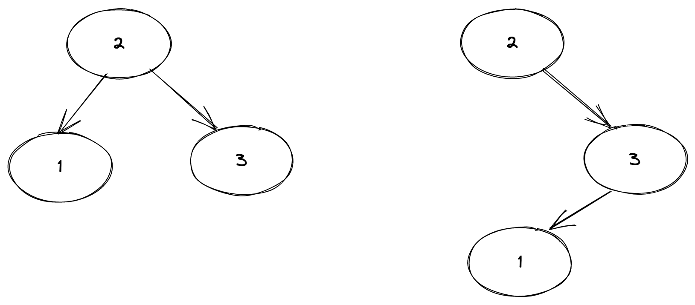
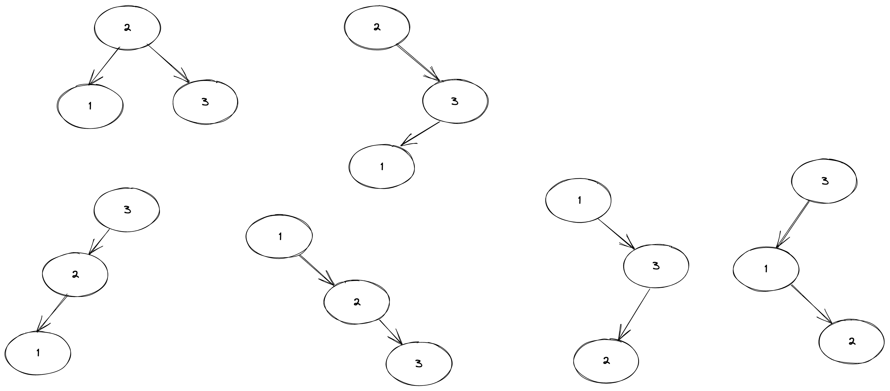

## 问题描述
给定一个整数 `N`，找出可以用 `1` 到 `N` 的值制作的唯一二叉搜索树（BST）的总数。

### 示例：
- **输入**: `n = 3`  
  **输出**: `5`  
  **解释**: 对于 `n = 3`，可能的前序遍历结果为：
  1. `1 2 3`
  2. `1 3 2`
  3. `2 1 3`
  4. `3 1 2`
  5. `3 2 1`

- **输入**: `n = 4`  
  **输出**: `14`

---

## 问题分析

### 什么是 BST？
BST（Binary Search Tree，二叉搜索树）是一种特殊的二叉树，满足以下条件：
- 每个节点的值都小于其右子树中所有节点的值。
- 每个节点的值都大于其左子树中所有节点的值。

例如，对于节点集合 `{1, 2, 3}`，可以构造出以下几种不同的 BST：



---

### 分析与归纳
为了计算具有 `n` 个节点的唯一 BST 的数量，我们可以通过递归和动态规划的方法来解决问题。

#### 归纳法推导规律
1. **基本情况**：
   - 当 `n = 1` 时，只有一个节点，显然只有一种情况：`T(1) = 1`。
   - 当 `n = 2` 时，有两个节点，有两种情况：`T(2) = 2`。

2. **一般情况**：
   - 假设当前有 `n` 个节点，选择某个节点 `i` 作为根节点。
     - 左子树包含比 `i` 小的所有节点（即 `1` 到 `i-1`），共有 `T(i-1)` 种组合。
     - 右子树包含比 `i` 大的所有节点（即 `i+1` 到 `n`），共有 `T(n-i)` 种组合。
     - 因此，以 `i` 为根节点的 BST 总数为：`T(i-1) * T(n-i)`。
   - 遍历所有可能的根节点 `i`（从 `1` 到 `n`），将结果累加即可得到总数量：
     \[
     T(n) = \sum_{i=1}^{n} T(i-1) \times T(n-i)
     \]

#### 示例推导
- **当 `n = 3` 时**：
  - 假设 `1` 是根节点：`T(0) * T(2) = 1 * 2 = 2`。
  - 假设 `2` 是根节点：`T(1) * T(1) = 1 * 1 = 1`。
  - 假设 `3` 是根节点：`T(2) * T(0) = 2 * 1 = 2`。
  - 总数为：`2 + 1 + 2 = 5`。

- **当 `n = 4` 时**：
  - 假设 `1` 是根节点：`T(0) * T(3) = 1 * 5 = 5`。
  - 假设 `2` 是根节点：`T(1) * T(2) = 1 * 2 = 2`。
  - 假设 `3` 是根节点：`T(2) * T(1) = 2 * 1 = 2`。
  - 假设 `4` 是根节点：`T(3) * T(0) = 5 * 1 = 5`。
  - 总数为：`5 + 2 + 2 + 5 = 14`。

---

## 算法实现

### 方法 1：暴力递归
通过递归的方式计算每个节点作为根节点的情况。以下是 JavaScript 实现：

```javascript
// i is the root, n is the total nodes' number
const G = (i, n) => {
  return fn(i - 1) * fn(n - i);
};

// Get the total number of BST trees with n nodes.
const fn = (n) => {
  let _ = 0;
  if (n === 0 || n === 1) return 1;
  for (let i = 1; i <= n; i++) {
    _ += G(i, n);
  }
  return _;
};

console.log(fn(3)); // 输出: 5
```

#### 递归树分析
递归树如下所示：
```
f(3)
├── G(1,3) -> f(0) * f(2)
├── G(2,3) -> f(1) * f(1)
└── G(3,3) -> f(2) * f(0)
```
可以看到，`f(1)` 和 `f(2)` 被重复计算，导致效率低下。

---

### 方法 2：带缓存的递归
为了避免重复计算，我们可以使用缓存存储中间结果。

```javascript
// get the total number of BST tress with i as the root node
const G = (i, n) => {
  return fn(i - 1) * fn(n - i);
};

const dp = [];
const fn = (n) => {
  let _ = 0;
  if (n === 0 || n === 1) return 1;
  if (dp[n]) {
    console.log("hit cache");
    return dp[n];
  }
  // loop all nodes
  for (let i = 1; i <= n; i++) {
    // add them all
    _ += G(i, n);
  }
  // cache result
  dp[n] = _;
  return _;
};

console.log(fn(3)); // 输出: 5
```

---

### 方法 3：动态规划（最优解）
通过自底向上的方式构建 DP 表，避免递归开销。

```javascript
const getNumberOfBSTs = (n) => {
  const T = [];
  T[0] = 1; // Base case: 0 nodes -> 1 BST (empty tree)
  T[1] = 1; // Base case: 1 node -> 1 BST

  for (let i = 2; i <= n; i++) {
    T[i] = 0; // Initialize current value
    for (let j = 1; j <= i; j++) {
      // Calculate the number of BSTs with j as the root
      T[i] += T[j - 1] * T[i - j];
    }
  }

  return T[n]; // Return the result for n nodes
};

console.log(getNumberOfBSTs(3)); // 输出: 5
console.log(getNumberOfBSTs(4)); // 输出: 14
```

---

## 时间复杂度分析

1. **暴力递归**：
   - 时间复杂度：O(2^n)，因为每次递归都会分裂成两个子问题。
   - 空间复杂度：O(n)，递归栈的深度。

2. **带缓存的递归**：
   - 时间复杂度：O(n^2)，因为每个状态只会被计算一次。
   - 空间复杂度：O(n)，用于存储缓存。

3. **动态规划**：
   - 时间复杂度：O(n^2)，双层循环。
   - 空间复杂度：O(n)，用于存储 DP 表。

---

## 总结

通过递归、带缓存的递归以及动态规划三种方法，我们可以高效地解决唯一 BST 的计数问题。动态规划是最优解，时间复杂度为 O(n^2)，空间复杂度为 O(n)。这种方法不仅适用于本问题，还可以扩展到其他类似的组合问题。