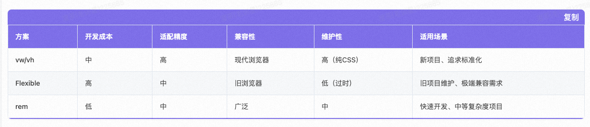

In modern front-end development, cross-terminal development and dynamic capabilities are crucial for improving development efficiency and optimizing user experience. This article will discuss topics such as **data delivery and module publishing**, **module system layering**, **responsive design**, **platform-specific builds**, and **dynamic technologies**, providing detailed analysis and organization.
---
## Table of Contents
1. [Cross-Terminal Development Overview](#跨端开发概述)
2. [Three-Layer Structure of Data Sources](#数据源的三层结构)
3. [Module System Layering](#模块系统分层)
4. [Responsive Design](#响应式设计)
5. [Platform-Specific Builds](#分端构建)
6. [Dynamic Technologies](#动态化技术)
7. [Performance Metrics](#性能指标)
8. [Conclusion](#总结)
---
## Cross-Terminal Development Overview
The core goal of cross-terminal development is to use a single codebase to adapt to multiple platforms, including H5, PC, and mini-programs. The key lies in modular design, optimization of data delivery and publishing processes, and support for dynamic capabilities.
---
## Three-Layer Structure of Data Sources
In cross-terminal development, the design of data sources is typically divided into the following three layers:
### 1. Atomic Model
- **Definition**: Basic fields that describe the lowest-level data units.
- **Characteristics**:
  - Independent of specific business scenarios.
  - Highly reusable, suitable for sharing across terminals.
  - Examples: User ID, product name, price, etc.
### 2. Business Model
- **Definition**: Aggregates fields from the atomic model to form data structures related to business logic.
- **Characteristics**:
  - Designed for specific business scenarios.
  - Provides a higher level of abstraction to facilitate business development.
  - Example: Shopping cart model (including product list, total price, discount information, etc.).
### 3. Model Instance
- **Definition**: Instantiated from a business model to generate specific data objects.
- **Characteristics**:
  - Dynamically generated, suitable for runtime data processing.
  - Supports multi-terminal adaptation; instantiation logic can be adjusted based on the needs of different terminals.
  - Example: A specific user's shopping cart instance.
---
## Module System Layering
The design of the module system is fundamental to cross-terminal development and is usually divided into the following two layers:
### 1. Atomic Components
- **Definition**: Basic components encapsulated based on Rax (a cross-terminal implementation of React).
- **Characteristics**:
  - Provide common capabilities such as tracking, terminal detection, and language support.
  - The technology container encapsulates fundamental cross-terminal capabilities, simplifying the development process.
  - Examples: Button component, Input component.
### 2. Business Modules
- **Definition**: Business logic modules built on top of atomic components.
- **Characteristics**:
  - Designed for specific business scenarios.
  - Include a Schema definition to describe the module's configuration (e.g., data, internationalization, themes).
  - Examples: Product details module, Order confirmation module.
---
## Responsive Design
Responsive design is a crucial part of cross-terminal development, ensuring that pages display well on different devices. Its core includes:
- **Layout Adaptation**: Using techniques like Flexbox and Grid layout to ensure pages adapt to different screen sizes.
- **Media Queries**: Adjusting styles based on device characteristics (such as screen width and resolution).
- **Dynamic Units**: Using `rem` or `vw/vh` units to enhance adaptation flexibility.

---
## Platform-Specific Builds
Platform-specific builds refer to generating specific code packages for different terminals (such as H5 and PC) to meet their respective performance and functional requirements.
### 1. H5/PC Builds
- **H5**: Focuses on being lightweight and performance-optimized, suitable for mobile access.
- **PC**: Emphasizes interactive experience and support for complex features, suitable for desktop use.
### 2. Proxy Tools
- **Shanhaiguan**: A commonly used proxy tool for debugging and optimizing cross-terminal requests.
- **Functions**:
  - Centralized management of API requests.
  - Supports mock data, facilitating development and testing.
---
## Dynamic Technologies
Dynamic technologies are key in cross-terminal development, enhancing application flexibility and update efficiency.
### 1. DSL Dynamic Container
- **Definition**: Describes UI structure and logic using a DSL (Domain-Specific Language).
- **Characteristics**:
  - Supports dynamic delivery and updates, reducing the frequency of releases.
  - Example: DX (Dynamic Container Framework).
### 2. Limitations of H5
- **Problem**: In some scenarios, H5 has a "not-following-the-hand" issue, meaning the interactive experience is not smooth enough.
- **Solutions**:
  - Use a dynamic container (like DX) to replace pure H5 implementations.
  - Optimize animations and gesture interactions to improve user experience.
---
## Performance Metrics
Time to Interactive (TTI) for the first screen, generally `onLoad` is not used.
---
## Rendering Origin Design
