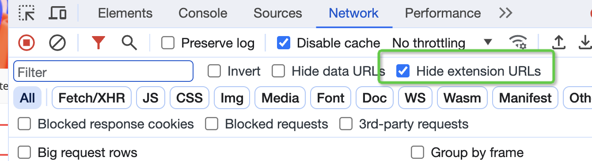

title: "What You Need to Know About JavaScript"
description: "sort vs toSorted vs localeCompare"
date: 2024-09-08
tags:
  - JavaScript
  - Web Development
images:
  - javascript/a.webp
custom_toc:
  - title: "Array Traversal"
  - title: "Bitwise Operators"
  - title: "Exception Handling"
  - title: "Promise"
  - title: "Symbol"
  - title: "Lodash"
  - title: "Destructuring Assignment"
  - title: "Special Properties"
  - title: "Set to Array"
  - title: "Dynamically Inserting JS Scripts"
  - title: "Nested a Tags"
  - title: "Asynchronous Loading of HTML Structure"
  - title: "SCSS Compilation"
  - title: "A11Y"
  - title: "Web Applications"
  - title: "Testing"
  - title: "W3C"
  - title: "Sorting Functions"
  - title: "Chrome"
  - title: "decodeURIComponent"
  - title: "Circular Dependencies"
  - title: "Module System"
  - title: "forEach vs for of"
---
## Array Traversal
### `for...of` to traverse arrays
```javascript
const arr = [1, 2, 3];
for (const item of arr) {
  console.log(item); // Outputs 1, 2, 3
}
```
### `forEach` method
The `forEach` method can take a second argument as `this`:
```javascript
const obj = { multiplier: 2 };
[1, 2, 3].forEach(function (item) {
  console.log(item * this.multiplier);
}, obj); // Outputs 2, 4, 6
```
### Compatibility Handling
`Object.values(undefined)` will throw an error and needs to be handled for compatibility:
```javascript
const safeValues = (obj) => (obj ? Object.values(obj) : []);
console.log(safeValues(undefined)); // Outputs []
```
## Bitwise Operators
### Common Usage
```javascript
// Integer truncation
const a = ~~12.12; // 12
// Left shift
12 << 1; // 24
// Right shift
12 >> 1; // 6
```
### Application Scenarios
1. **Check for odd/even**:
   ```javascript
   const isOdd = (num) => num & 1;
   console.log(isOdd(3)); // true
   console.log(isOdd(4)); // false
   ```
2. **Divide by 2**:
   ```javascript
   const divideByTwo = (num) => num >> 1;
   console.log(divideByTwo(10)); // 5
   ```
3. **Assignment and Validation**:
   - Use `|` for bitwise OR assignment.
   - Use `&` to check specific flags.
---
## Exception Handling
### Encapsulation to reduce indentation
Reduce code nesting by encapsulating `try...catch`:
```javascript
const tryAndCatch = async (fn) => {
  try {
    return [null, await fn()];
  } catch (e) {
    return [e, null];
  }
};
// Usage Example
(async () => {
  const [err, result] = await tryAndCatch(async () => {
    throw new Error("Test error");
  });
  if (err) console.error(err.message); // Outputs "Test error"
})();
```
### Basic Syntax
```javascript
try {
  // Code that might throw an exception
} catch (error) {
  // Catch and handle the exception
}
```
### Main Scenarios
- **Virtual Machine (VM) or dynamically executed JS code**:
  - When you need to execute dynamically generated code, use `try {} catch {}` to catch runtime errors.
  - Example:
    ```javascript
    try {
      eval("someInvalidCode()"); // Dynamically execute code that might fail
    } catch (error) {
      console.error("Exception caught:", error.message);
    }
    ```
### Characteristics
- **Synchronous code**: `try {} catch {}` can only catch exceptions in synchronous code.
- **Limitations**: Cannot catch exceptions in asynchronous code (like `Promise` or `setTimeout`).
## 2. Promise Exception Handling: `.then().catch()`
### Basic Syntax
```javascript
promise
  .then((result) => {
    // Success handling logic
  })
  .catch((error) => {
    // Catch and handle the exception
  });
```
### Main Scenarios
- **Handling exceptions in asynchronous code**:
  - `try {} catch {}` cannot catch exceptions in asynchronous code, whereas `.catch()` is specifically for handling exceptions in a `Promise` chain.
  - Example:
    ```javascript
    new Promise((resolve, reject) => {
      setTimeout(() => {
        reject(new Error("Asynchronous operation failed"));
      }, 1000);
    })
      .then((result) => {
        console.log("Success:", result);
      })
      .catch((error) => {
        console.error("Exception caught:", error.message);
      });
    ```
### Characteristics
- **Asynchronous code support**: Can catch exceptions in a `Promise` chain.
- **Chaining**: Use `.catch()` to handle exceptions uniformly, avoiding repetitive error handling logic.
- **Combination with `async/await`**:
  - In an `async` function, you can use `try {} catch {}` to catch exceptions from an `await` expression.
  - Example:
    ```javascript
    async function fetchData() {
      try {
        const result = await someAsyncFunction();
        console.log("Success:", result);
      } catch (error) {
        console.error("Exception caught:", error.message);
      }
    }
    ```
### Non-blocking error throwing
```js
function throwNonBlockingError(error, msg) {
	setTimeout(() => {
		console.error(msg);
		throw error;
	});
}
```
---
## Promise
### Inversion of Control (IoC)
A typical scenario for Promise implementing IoC is a modal component:
```javascript
// The modal is only responsible for UI display; the operation result is returned to the caller
function showModal() {
  return new Promise((resolve) => {
    const close = (result) => resolve(result);
    document.getElementById("confirmBtn").onclick = () => close(true);
    document.getElementById("cancelBtn").onclick = () => close(false);
  });
}
// The caller handles the result
showModal().then((result) => {
  console.log(result ? "Confirmed" : "Cancelled");
});
```
### `Promise.allSettled`
Handle multiple asynchronous tasks, returning results whether they succeed or fail:
```javascript
Promise.allSettled([
  Promise.resolve(1),
  Promise.reject("Error"),
]).then((results) => {
  console.log(results);
  // [
  //   { status: 'fulfilled', value: 1 },
  //   { status: 'rejected', reason: 'Error' }
  // ]
});
```
---
## Symbol
### Global Registration and Retrieval
`Symbol.for` is used to register or retrieve a global Symbol:
```javascript
const sym1 = Symbol.for("key");
const sym2 = Symbol.for("key");
console.log(sym1 === sym2); // true
```
### Serialization Issue
`Symbol` is lost during serialization. This can be solved by customizing the second argument of `JSON.stringify`:
```javascript
const obj = { key: Symbol.for("value") };
const str = JSON.stringify(obj, (key, value) =>
  typeof value === "symbol" ? value.toString() : value
);
console.log(str); // {"key":"Symbol(value)"}
```
---
## Deep and Shallow Copy
### Shallow Copy Issue
Shallow copy cannot duplicate reference types inside an object:
```javascript
var a = [{ aa: 123 }];
var b = [...a];
b.forEach((i) => {
  i.xx = 123;
});
console.log(a); // a is affected
```
### Deep Copy Solution
Use recursion or a third-party library (like Lodash) to implement a deep copy:
```javascript
const _ = require("lodash");
var a = [{ aa: 123 }];
var b = _.cloneDeep(a);
b[0].xx = 123;
console.log(a); // a is not affected
```
---
## Lodash
### `chunk` method
Chunk an array:
```javascript
const _ = require("lodash");
const arr = [1, 2, 3, 4, 5];
console.log(_.chunk(arr, 2)); // [[1, 2], [3, 4], [5]]
```
In front-end development, dynamically generating HTML or other text content is a common requirement. `lodash.template` provides a simple yet powerful way to achieve this goal. Through template syntax, developers can embed variables, logical expressions, and loop structures within a string to generate dynamic content.
## Basic Usage
The basic usage of `lodash.template` is as follows:
```javascript
const _ = require('lodash');
// Define the template string
const templateString = 'Hello, <%= name %>!';
// Compile the template
const compiled = _.template(templateString);
// Render the template
const result = compiled({ name: 'World' });
console.log(result); // Output: Hello, World!
```
## Template Syntax
`lodash.template` supports various template syntaxes, including interpolation, conditional statements, and loop statements.
### Interpolation
Interpolation is used to insert variables into the template, using `<%= %>` as the delimiter by default.
#### Example
```javascript
const templateString = 'Welcome, <%= user.name %>!';
const compiled = _.template(templateString);
console.log(compiled({ user: { name: 'Alice' } })); // Output: Welcome, Alice!
```
### Conditionals
Conditional statements allow for logical judgments in the template, using `<% if %>` and `<% else %>` by default.
#### Example
```javascript
const templateString = `
<% if (isAdmin) { %>
  <p>Welcome, Admin!</p>
<% } else { %>
  <p>Welcome, Guest!</p>
<% } %>
`;
const compiled = _.template(templateString);
console.log(compiled({ isAdmin: true })); // Output: <p>Welcome, Admin!</p>
```
### Loops
Loop statements allow for iterating over arrays or objects in the template, using `<% _.forEach %>` or `<% for %>` by default.
#### Example
```javascript
const templateString = `
<ul>
  <% users.forEach(function(user) { %>
    <li><%= user.name %></li>
  <% }); %>
</ul>
`;
const compiled = _.template(templateString);
console.log(compiled({ 
  users: [{ name: 'Alice' }, { name: 'Bob' }] 
}));
// Output:
// <ul>
//   <li>Alice</li>
//   <li>Bob</li>
// </ul>
```
### Custom Delimiters
By default, `lodash.template` uses `<% %>` as the logic delimiter and `<%= %>` as the interpolation delimiter. If you need to customize the delimiters, you can configure them via `_.templateSettings`.
#### Example
```javascript
_.templateSettings.interpolate = /{{([\s\S]+?)}}/g;
const templateString = 'Hello, {{ name }}!';
const compiled = _.template(templateString);
console.log(compiled({ name: 'World' })); // Output: Hello, World!
```
## Code Example
The following is a complete example showing how to combine interpolation, conditional statements, and loop statements to generate dynamic content:
```javascript
const _ = require('lodash');
const templateString = `
<h1>Welcome to our platform!</h1>
<% if (isLoggedIn) { %>
  <p>Hello, <%= user.name %>!</p>
<% } else { %>
  <p>Please log in to continue.</p>
<% } %>
<h2>User List:</h2>
<ul>
  <% users.forEach(function(user) { %>
    <li>{{= user.name }}</li>
  <% }); %>
</ul>
`;
// Custom Delimiters
_.templateSettings.interpolate = /{{=([\s\S]+?)}}/g;
const compiled = _.template(templateString);
const result = compiled({
  isLoggedIn: true,
  user: { name: 'Alice' },
  users: [{ name: 'Alice' }, { name: 'Bob' }]
});
console.log(result);
```
---
## Destructuring Assignment
### Default Value Issue
The following code has a problem: when `b` has `a`, but `a` is null, the default value is not assigned:
```javascript
const b = { a: null };
const { a = {} } = b;
console.log(a); // null
```
---
## Spread Syntax
### Difference between Arrays and Objects
```javascript
[...undefined]; // Throws an error
{ ...undefined }; // Works fine
```
---
## Special Properties
### `window.name`
`window.name` is a special property; when assigned a value, it is automatically converted to a string:
```javascript
var name1 = ["3", "32"];
window.name = ["3", "32"];
console.log(window.name); // "3,32"
```
---
## Set to Array
### Spread Syntax
Directly convert a `Set` to an array:
```javascript
var a = new Set();
a.add(2);
var aArr = [...a]; // [2]
```
## TC39
[TC39](https://github.com/tc39)
## Dynamically Inserting JS Scripts
In HTML, you can dynamically insert JavaScript scripts using the `type="importmap"` or `type="module"` attribute of the `<script>` tag. For example:
```html
<script type="importmap">
  {
    "imports": {
      "my-module": "/path/to/my-module.js"
    }
  }
</script>
```
Or use `type="module"` to load modular scripts:
```html
<script type="module" src="/path/to/module.js"></script>
```
These methods allow for dynamic script insertion in the returned HTML string, enabling on-demand loading or dynamic feature extension.
---
## Nested a Tags
### Problem Description
In HTML, an `<a>` tag cannot be nested within another `<a>` tag. If nested, it can cause layout issues (like premature closing), especially in Server-Side Rendering (SSR) scenarios, where content might get truncated.
### Solution 1: Anchor Proxy
Using a React component, you can implement an `AnchorProxy` component to dynamically handle changes to the `href` attribute, avoiding the issue of nested `<a>` tags.
Here is the implementation code:
```jsx
const AnchorProxy = (props) => {  
  const { href: jumpUrl, target = '_blank', paramKeys, ...args } = props;  
  
  const clickFunc = (event) => {  
    const targetEle = event.target;  
    // Must operate via native JS, because some third-party or second-party JS will append parameters to href  
  };  
  return <a href={href} target={target} {...args} onClick={clickFunc} ref={aRef}></a>;  
};
```
**Notes:**
- `paramKeys` are the parameter keys that need to be dynamically added to the `href`.
- `getParams`, `addLandingArgs`, and `removeLandingArgs` are helper functions for getting, adding, and removing parameters, respectively.
### Solution 2: Style Control
Use CSS layout (like `grid` layout) to place the bottom content alongside the main content, thus avoiding the need for nested `<a>` tags.
Example:
```css
.container {
  display: grid;
  grid-template-rows: auto 50px; /* Main content + bottom */
}
```
This approach is suitable for layout adjustments to avoid logical nesting issues.
---
## Asynchronous Loading of HTML Structure
When viewing the source code in a browser, you see the original HTML structure; however, when inspecting elements in the developer tools, you might see some asynchronously loaded content (like `<link>` or `<script>` tags). This is because some resources are dynamically inserted via JavaScript.
For example:
```javascript
document.body.appendChild(document.createElement('script')).src = '/path/to/script.js';
```
This dynamic loading method is often used for performance optimization or on-demand loading.
---
## SCSS Compilation
[Sass.js](https://github.com/medialize/sass.js) is a JavaScript-based Sass compiler that can compile SCSS code to CSS directly in the browser.
Here is a simple usage example:
```javascript
const Sass = (window as any).Sass;  
Sass.compile(scss, (res) => {  
    if (res && res.text) {  
        resolve(res.text);  
    } else if (res && res.status === 3) {  
        resolve('');  
    } else {  
        resolve(-1);  
    }  
});
```
**Notes:**
- `scss` is the SCSS code string to be compiled.
- `resolve` is the callback function of a Promise, used to handle the compilation result.
- If compilation is successful, it returns the compiled CSS code; if it fails, it returns an empty string or an error code.
## The `download` attribute of the `a` tag has a same-origin restriction
---
## A11Y
**Accessibility** (often abbreviated as **A11y** — "a" plus 11 characters plus "y") in Web development means making websites usable by as many people as possible, even if their abilities are limited in some way.
- **Core Concept**: A11y ensures that people with disabilities (including visual, auditory, motor, or cognitive impairments) can use websites without barriers.
- **Goal**: To create inclusive digital experiences where everyone can access information and services equally, regardless of their physical or cognitive abilities.
## Knowledge Graph
The following are key resources for understanding and implementing Web accessibility:
### 1. W3C Web Accessibility Initiative (WAI)
The **Web Accessibility Initiative (WAI)** develops strategies, guidelines, and resources to make the Web accessible to people with disabilities.
- **Official Website**: [W3C WAI Guidelines](https://www.w3.org/WAI/GL/)
### 2. WAI-ARIA (Accessible Rich Internet Applications)
**WAI-ARIA** defines a way to make dynamic Web content and applications more accessible to people with disabilities.
- **Specification**: [WAI-ARIA Specification](https://www.w3.org/TR/wai-aria/)
- **Usage**: Provides roles, states, and properties to enhance the accessibility of interactive and dynamic content.
### 3. HTML Accessibility (HTML-ARIA)
This document describes how to use ARIA roles and attributes in conjunction with HTML to improve accessibility.
- **Resources**: [HTML-ARIA Best Practices](https://w3c.github.io/html-aria/)
## Web Applications
W3C's application development resources cover technical specifications and guidelines for modern Web applications, helping developers build efficient and secure Web apps.
- **Application-related resources**  
  Visit the [Web Applications Working Group](https://w3c.github.io/webappswg/) for the latest technical specifications and development guidelines.
> **Additional Notes**: Web application development involves multiple areas, including front-end frameworks, back-end APIs, security, etc. It is recommended to study the relevant specifications in depth based on actual project needs.
## Testing
W3C provides comprehensive testing resources to help developers verify that their applications comply with Web standards.
- **Testing-related resources**  
  Visit [Web Platform Test Results](https://wpt.fyi/results/?label=experimental&label=master&aligned) to see the latest test results and compatibility reports.
> **Additional Notes**: Testing is an important step in ensuring the quality of Web applications. It is recommended to use automated testing tools during the development process and to regularly check browser compatibility.
## W3C
- **HTML Working Group (W3C)**  
  [https://www.w3.org/groups/wg/htmlwg](https://www.w3.org/groups/wg/htmlwg)  
  The W3C's HTML Working Group is responsible for developing and maintaining the HTML standard.
- **HTML Accessibility API Mappings (HTML-AAM)**  
  [https://w3c.github.io/html-aam/](https://w3c.github.io/html-aam/)  
  Defines how HTML elements map to accessibility APIs, helping developers create more accessible content.
- **HTML ARIA Standard**  
  [https://w3c.github.io/html-aria/](https://w3c.github.io/html-aria/)  
  Provides guidance on how to use ARIA (Accessible Rich Internet Applications) in HTML to ensure Web content is more accessible to users with disabilities.
## **WHATWG Related Resources**
- **WHATWG Official Website**  
  [https://whatwg.org/](https://whatwg.org/)  
  WHATWG is a community-driven standards organization focused on developing the latest specifications for HTML and other Web technologies.
- **HTML Specification (WHATWG)**  
  [https://html.spec.whatwg.org/review-drafts/2020-01/](https://html.spec.whatwg.org/review-drafts/2020-01/)  
  Provides detailed specification documents for HTML, including the latest features and implementation details.
- **DOM Specification (WHATWG)**  
  [https://dom.spec.whatwg.org/](https://dom.spec.whatwg.org/)  
  Defines the DOM (Document Object Model) standard, describing how to programmatically manipulate HTML and XML documents.
---
## D3-format
[D3-Format](https://github.com/d3/d3-format) is a powerful and flexible JavaScript library for formatting numbers. It is provided by the [D3.js](https://d3js.org/) project and supports various number formatting needs, including currency, percentages, scientific notation, thousands separators, etc.
## Main Features
- **Flexible formatting syntax**: Based on Python-like format strings (`printf` style), easy to learn and use.
- **Localization support**: Supports number formats for different regions (e.g., thousands separators, decimal point symbols).
- **High performance**: Designed for large-scale data visualization, suitable for efficient operation in the browser.
- **Wide range of application scenarios**:
  - Axis labels, tooltips, etc., in data visualization.
  - Financial reports, statistical data display.
  - Formatting of scientific calculation results.
## Installation
### Install with npm
If your project uses npm or yarn, you can install it with the following command:
```bash
npm install d3-format
```
Or:
```bash
yarn add d3-format
```
### Import directly via CDN
If you are not using a module bundler, you can import the library directly via CDN:
```html
<script src="https://cdn.jsdelivr.net/npm/d3-format@3"></script>
```
## Basic Usage
### Formatting function
`d3.format` is the core method for creating a formatting function. Here are some common uses:
```javascript
// Import the library
import { format } from "d3-format";
// Create a formatting function
const formatNumber = format(",.2f"); // Thousands separator, two decimal places
// Use the formatting function
console.log(formatNumber(12345.6789)); // Output: "12,345.68"
```
### Common Formatting Examples
| Format String | Description                               | Example Input  | Example Output |
|---------------|-------------------------------------------|----------------|----------------|
| `",.2f"`      | Thousands separator, two decimal places   | `12345.6789`   | `"12,345.68"`  |
| `"$,.2f"`     | Currency format with thousands separator  | `12345.6789`   | `"$12,345.68"` |
| `".1%"`       | Percentage with one decimal place         | `0.12345`      | `"12.3%"`      |
| `"e"`         | Scientific notation                       | `12345.6789`   | `"1.234568e+4"`|
| `"+,"`        | Integer with sign                         | `-12345`       | `"-12,345"`    |
## Advanced Usage
### Custom Localization
You can customize localization formatting rules with `d3.formatLocale`. For example:
```javascript
import { formatLocale } from "d3-format";
// Custom localization rules
const customLocale = formatLocale({
  decimal: ",", // Decimal symbol
  thousands: ".", // Thousands separator
  grouping: [3], // Group every three digits
  currency: ["€", ""], // Currency symbol
});
const formatEuro = customLocale.format("$,.2f");
console.log(formatEuro(12345.6789)); // Output: "€12.345,68"
```
### Dynamic Formatting
You can dynamically select formatting rules based on conditions. For example:
```javascript
import { format } from "d3-format";
const value = 12345.6789;
// Select format based on value size
const formatter = value > 10000 ? format(",.0f") : format(",.2f");
console.log(formatter(value)); // Output: "12,346"
```
## Official Documentation and Resources
- **GitHub Repository**: [https://github.com/d3/d3-format](https://github.com/d3/d3-format)
- **Official API Documentation**: [https://github.com/d3/d3-format#api-reference](https://github.com/d3/d3-format#api-reference)
- **Online Formatting Tool**: [https://observablehq.com/@d3/d3-format](https://observablehq.com/@d3/d3-format)
---
## Chrome Network Log
### Steps:
1. Open the Chrome browser.
2. Enter the following address in the address bar and visit:
   ```
   chrome://net-export/
   ```
3. Click the **"Start Logging to Disk"** button.
4. Choose a location to save the log file and start recording network activity.
5. After finishing, click the **"Stop Recording"** button to generate the log file.
### Notes:
- The log file will be saved in `.json` format, containing detailed network request and response information.
- It is recommended to use this feature when you need to debug network issues.
## 2. Viewing Chrome Network Logs
### Tool:
Use the [NetLog Viewer](https://netlog-viewer.appspot.com/#import) online tool to view the log.
### Steps:
1. Open [NetLog Viewer](https://netlog-viewer.appspot.com/#import).
2. Click the **"Choose File"** button and upload the previously saved `.json` log file.
3. After the log file is loaded, you can view detailed network requests, response times, error messages, etc., through the interface.
---
## What is a Component?
- **Definition**: A component is a smaller, independent part of a larger entity or system. It can perform certain functions, may require some input, or produce some output.
- **Implementation**: In software development, a component is usually represented by a class.
## What is a Web Component?
- **Definition**: Web Components are a set of Web platform APIs that allow you to create custom, reusable, encapsulated HTML tags for use in web pages and web apps.
- **Characteristics**:
  - **Custom**: You can create your own HTML tags.
  - **Reusable**: Can be reused across multiple projects.
  - **Encapsulated**: Internal implementation details are hidden from the outside, avoiding global pollution.
## What are the classifications of components?
### 1. Large Libraries
- **Examples**: Ant Design (Antd), Element UI, etc.
- **Characteristics**: Provide complete UI and functional solutions, suitable for building large, complex projects.
### 2. Single Components
- **High Reusability**:
  - **Characteristics**: Designed as general-purpose components with high reuse value, and will be maintained over time.
  - **Examples**: Buttons, input boxes, and other basic components.
- **Business Components**:
  - **Characteristics**: Designed for specific business scenarios, often used once and then discarded.
  - **Examples**: Specific forms, data display modules, etc.
### 3. Project-Integrated
- **Characteristics**: Coupled with other content, cannot be used independently, usually tightly bound to a specific project.
- **Applicable Scenarios**: Customized components used within a project.
---
## Service SLA (Service-Level Agreement) Standards
A Service-Level Agreement (SLA) is a set of committed metrics defined between a service provider and a customer, including quality, availability, delivery cycle, etc.
### Service SLA Standards for Business Commitment
- **Project (R&D and testing > 30 person-days)**:
  - On-time delivery rate > 90%.
  - Business goal achievement rate > 80%.
- **Daily**:
  - Throughput rate > 85%.
  - Requirement delivery time < 21 days.
- **Tickets**:
  - Dual-high priority tickets resolved on the same day.
  - Single-high priority tickets resolved within 3 days.
  - Overall ticket 3-day resolution rate > 80%.
- **Stability**:
  - No P1, P2 incidents.
  - Incident score convergence of 30%.
---
## Sorting Functions
## **1. `sort` Method**
### Characteristics
- **Mutates the original array**.
- By default, it sorts elements in ascending order based on their string Unicode code points.
- If a custom sorting rule is needed, a compare function can be passed.
### Example Code
```js
var a = [1, 4, 2, 3];
a.sort();
console.log(a); // Output: [1, 2, 3, 4]
```
### Notes
- For an array of numbers, the default `sort` method can lead to unexpected results because it converts numbers to strings and then sorts them lexicographically. For example:
  ```js
  var nums = [10, 2, 30, 5];
  nums.sort();
  console.log(nums); // Output: [10, 2, 30, 5] (incorrect result)
  ```
- Solution: Use a compare function.
  ```js
  nums.sort((a, b) => a - b);
  console.log(nums); // Output: [2, 5, 10, 30]
  ```
## **2. `toSorted` Method**
### Characteristics
- **Does not mutate the original array**; it returns a new sorted array.
- This is a new method introduced in ES2023, suitable for scenarios where the original array needs to be preserved.
### Example Code
```js
var a = [1, 4, 2, 3];
var sortedArray = a.toSorted();
console.log(sortedArray); // Output: [1, 2, 3, 4]
console.log(a); // Output: [1, 4, 2, 3] (original array is unchanged)
```
### Notes
- If you need to support older browsers, be aware that `toSorted` may not be available and you may need to use an alternative method.
## **3. `localeCompare` Method**
### Characteristics
- Primarily used for **string comparison**, supporting locale-sensitive sorting rules.
- Return value:
  - `-1`: indicates the first string is less than the second.
  - `0`: indicates the strings are equal.
  - `1`: indicates the first string is greater than the second.
- Supports adjusting comparison behavior via an options parameter (e.g., `sensitivity`).
### Example Code
```js
const a = 'réservé'; // lowercase with accent
const b = 'RESERVE'; // uppercase without accent
// Default comparison (case and accent sensitive)
console.log(a.localeCompare(b)); 
// Output: -1
// Ignore case and accents (based on base characters only)
console.log(a.localeCompare(b, 'en', { sensitivity: 'base' })); 
// Output: 0
// Compare numeric strings
console.log('1'.localeCompare('1')); // Output: 0
console.log('10'.localeCompare('2')); // Output: 1 (lexicographical order)
```
### Parameter Description
- **`locales`**: Specifies the language environment (e.g., `'en'` for English, `'zh'` for Chinese).
- **`options`**: A configuration object. Common options include:
  - `sensitivity`: Controls the sensitivity of the comparison (`'base'`, `'accent'`, `'case'`, `'variant'`).
  - `numeric`: Whether to enable numeric sorting (`true` means sort by numeric value).
### Example: Correct Sorting of Numeric Strings
By default, `localeCompare` sorts lexicographically, which can lead to incorrect sorting of numeric strings. This can be solved with `numeric: true`:
```js
console.log('10'.localeCompare('2', undefined, { numeric: true })); 
// Output: 1 (sorts by numeric value)
```
## **Summary**
| Method          | Mutates Original Array | Use Case                                             | Notes                                                              |
|---------------|------------------------|------------------------------------------------------|--------------------------------------------------------------------|
| `sort`        | Yes                    | When you need to sort the array in place             | Sorts lexicographically by default; use a compare function for numbers. |
| `toSorted`    | No                     | When you need to preserve the original array and create a new one | New in ES2023, may not be supported in older browsers.             |
| `localeCompare` | No                     | Locale-sensitive string comparison                   | Supports various locales and custom options.                       |
---
## Cache Issues
## Case 1: API returns normally, but page data is displayed incorrectly
### Problem Description
During development, the data returned by the API is correct, but the data displayed on the page does not match expectations. This can lead to users seeing incorrect information, affecting their experience.
### Cause Analysis
After investigation, the problem was found to be caused by **`localStorage` caching**:
- The page prioritizes reading data from `localStorage` on load.
- If the cached data is not updated in time, the data displayed on the page will be inconsistent with the data returned by the API.
### Solution
To solve this problem, the following measures can be taken:
1. **Clear expired cache**:
   - After each successful API request, update the data in `localStorage`.
   - Set an expiration period for the cache, for example, by using a timestamp to check if the cache is expired.
   ```javascript
   const cacheKey = 'userData';
   const cacheData = JSON.parse(localStorage.getItem(cacheKey));
   const now = Date.now();
   if (!cacheData || now - cacheData.timestamp > 5 * 60 * 1000) {
     // Cache is expired or does not exist, re-fetch from the API
     fetchData().then((data) => {
       localStorage.setItem(cacheKey, JSON.stringify({ data, timestamp: now }));
     });
   } else {
     // Use cached data
     renderData(cacheData.data);
   }
   ```
2. **Avoid over-reliance on cache**:
   - For critical data, try to fetch it directly from the API to reduce reliance on `localStorage`.
## Case 2: Some tasks are not created when downloading files via Blob
### Problem Description
When batch downloading files using the Blob method, it was found that some file download tasks were not successfully created. This prevents users from downloading the complete list of files.
### Cause Analysis
After analysis, the root cause is the **browser's caching mechanism**:
- The browser caches requests for the same URL.
- If multiple files have the same download link (e.g., without a unique identifier), the browser will reuse the cache, causing some download tasks to be ignored.
### Solution
To avoid the impact of browser caching, you can solve it in the following ways:
1. **Add a timestamp to each request**:
   - Append a unique timestamp parameter to each file's download link to ensure that each request URL is unique.
   ```javascript
   const downloadFile = (url) => {
     const uniqueUrl = `${url}?timestamp=${Date.now()}`;
     fetch(uniqueUrl)
       .then((response) => response.blob())
       .then((blob) => {
         const link = document.createElement('a');
         link.href = URL.createObjectURL(blob);
         link.download = 'file-name.ext';
         link.click();
       });
   };
   ```
2. **Disable cache**:
   - Set `Cache-Control: no-cache` or `Pragma: no-cache` in the HTTP request headers to force the browser not to cache the response content.
   ```javascript
   fetch(url, {
     headers: {
       'Cache-Control': 'no-cache',
       'Pragma': 'no-cache',
     },
   })
     .then((response) => response.blob())
     .then((blob) => {
       // Process Blob data
     });
   ```
3. **Process download tasks in batches**:
   - If there are many files, you can initiate download requests in batches to avoid exhausting browser resources by sending too many requests at once.
   ```javascript
   const urls = [...]; // File URL list
   const batchSize = 5;
   const downloadBatch = (batch) => {
     batch.forEach((url) => downloadFile(url));
   };
   for (let i = 0; i < urls.length; i += batchSize) {
     const batch = urls.slice(i, i + batchSize);
     downloadBatch(batch);
   }
   ```
  
---
## Chrome
## Overview
In the latest Chrome DevTools update, some powerful new features have been added that greatly enhance developers' ability to debug and optimize Web applications. This article will detail the following new features:
- **Override Content**: Rewrite the response content of network requests without needing a proxy.
- **Disable requests from Chrome extensions**: Prevent extensions from interfering with the development environment.
- **Behavior of console logging reference objects**: Discuss considerations when logging reference objects to the console.
For more details, refer to the official documentation: [New in DevTools 117](https://developer.chrome.com/blog/new-in-devtools-117/?utm_source=devtools#network)
## Override Content
### Overriding HTML, JS, CSS, etc.
Previously, if you needed to modify the response content of a network request (like HTML, JS, CSS, etc.), you usually had to use a proxy tool (like Charles or Fiddler). Now, Chrome DevTools has this feature built-in, allowing you to override content directly in the browser.
**Key Features:**
- Supports real-time modification of the content of files like HTML, JS, CSS, etc.
- Modified content takes effect immediately without needing to refresh the page.
- Ideal for debugging and quickly validating code changes.
**Steps:**
1. Open Chrome DevTools (Shortcut: `F12` or `Ctrl+Shift+I`).
2. Switch to the **Network** panel.
3. Right-click the target request and select **Override content**.
4. Modify the content in the editor that appears and save.
### Overriding XHR Requests
Besides static resources, you can also override the response data of XHR (XMLHttpRequest) requests. This is very useful for simulating API responses or testing specific scenarios.
**Key Features:**
- Supports modifying the response data of XHR requests (e.g., JSON-formatted API responses).
- Can simulate different response status codes (e.g., 200, 404, 500).
- Convenient for testing the front-end's handling logic for different API responses.
**Steps:**
1. Open Chrome DevTools.
2. Switch to the **Network** panel.
3. Find the target XHR request, right-click, and select **Override content**.
4. Modify the response data and save.

## Disabling Requests from Chrome Extensions
Chrome extensions sometimes make extra network requests in the background, which can interfere with the development environment or cause unnecessary performance overhead. Now, Chrome DevTools provides a simple way to disable these requests.
**Steps:**
1. Open Chrome DevTools.
2. Switch to the **Network** panel.
3. Click the **"Block requests from extensions"** button at the top of the panel (icon looks like a puzzle piece).
4. At this point, all requests from Chrome extensions will be blocked.

## The Issue with Console Logging Reference Objects
In the Chrome console, if you log a reference object (like an array or object), the console displays the final state of that object, not its state at the time of logging. This can cause confusion during debugging.
**Problem Description:**
- When you execute `console.log(obj)`, the console doesn't immediately record the object's current value but rather a reference to the object.
- If the object's value changes in subsequent code, the console will display the final value, not the value at the time of logging.
**Solution:**
- Use `JSON.stringify` to serialize the object to a string before logging:
  ```javascript
  console.log(JSON.stringify(obj));
  ```
- Or use `console.dir` to view the object's detailed information:
  ```javascript
  console.dir(obj);
  ```
---
## decodeURIComponent
### Example Code
```js
decodeURIComponent("%C4%97%");
// VM158:1 Uncaught URIError: URI malformed
//     at decodeURIComponent (<anonymous>)
//    at <anonymous>:1:1
```
### Problem Analysis
- **Cause**:
  - `%C4%97%` is an invalid URI-encoded string because the last `%` is not followed by two valid hexadecimal characters.
  - When `decodeURIComponent` encounters such a format error, it throws a `URIError: URI malformed` exception.
- **Impact**:
  - If this exception is not caught, the program may stop executing, leading to unexpected behavior.
## Solution
To prevent the program from crashing due to an exception, you can use a `try...catch` block to catch the `URIError` and handle it.
### Example Code
```ts
try {
  decodeURIComponent('%C4%97%');
} catch (error) {
  if (error instanceof URIError) {
    console.error('Invalid URI component:', error.message);
    // You can provide a default value or execute other logic here
  } else {
    throw error; // If it's another type of error, re-throw it
  }
}
```
## Additional Notes
### 1. Catching Specific Error Types
- Use `instanceof URIError` to ensure you only catch errors related to URI decoding, avoiding masking other potential issues.
### 2. Providing a Default Value
- If you need to return a default value on decoding failure, you can implement it in the `catch` block:
  ```ts
  function safeDecodeURIComponent(uri: string, defaultValue: string = ''): string {
    try {
      return decodeURIComponent(uri);
    } catch (error) {
      if (error instanceof URIError) {
        console.warn(`Failed to decode URI component: ${uri}`);
        return defaultValue;
      }
      throw error; // Re-throw non-URIError errors
    }
  }
  // Example call
  const decoded = safeDecodeURIComponent('%C4%97%', 'default-value');
  console.log(decoded); // Output: default-value
  ```
### 3. Validating Input
- Before calling `decodeURIComponent`, you can validate if the input is a valid URI-encoded string:
  ```ts
  function isValidURIComponent(uri: string): boolean {
    try {
      decodeURIComponent(uri);
      return true;
    } catch {
      return false;
    }
  }
  // Example call
  console.log(isValidURIComponent('%C4%97%')); // Output: false
  console.log(isValidURIComponent('%C4%97'));  // Output: true
  ```
---
## Circular Dependencies
In TypeScript or JavaScript projects, you need to be careful with dependencies between modules. If a **Circular Dependency** exists, it can cause the exported value of some modules to be `undefined`.
## Problem Description
### File `a.ts`
```ts
export const xx = "123";
```
### File `b.ts`
```ts
import { xx } from "a";
console.log(xx); // outputs undefined
```
### Phenomenon
- In `b.ts`, trying to import `xx` from `a.ts` results in `xx` being `undefined` at runtime.
- This situation is usually caused by a **circular dependency**.
## Cause Analysis
### What is a circular dependency?
A circular dependency occurs when two or more modules import each other, creating a closed loop. For example:
- `a.ts` imports content from `b.ts`.
- `b.ts` in turn imports content from `a.ts`.
In this situation, the module loader (like Node.js or a bundler) tries to load modules on demand, but due to the circular dependency, some modules might be accessed before they are fully initialized, resulting in their exported values being `undefined`.
## Example Reproduction
### File `a.ts`
```ts
import { yy } from "./b"; // a.ts imports content from b.ts
export const xx = "123";
console.log("yy in a.ts:", yy);
```
### File `b.ts`
```ts
import { xx } from "./a"; // b.ts imports content from a.ts
export const yy = "456";
console.log("xx in b.ts:", xx); // outputs undefined
```
### Execution Result
1. `xx in b.ts: undefined`
2. `yy in a.ts: 456`
**Reason**:
- When `b.ts` tries to import `xx` from `a.ts`, `a.ts` has not yet finished initializing (because it is waiting for content from `b.ts`).
- Therefore, the value of `xx` is resolved as `undefined` in `b.ts`.
## Solutions
### Method 1: Avoid Circular Dependencies
- **Best Practice**: Refactor the code to avoid circular dependencies between modules.
- Extract common logic into a third module that both `a.ts` and `b.ts` can use.
#### Refactoring Example
Create a new file `common.ts`:
```ts
export const xx = "123";
export const yy = "456";
```
Modify `a.ts`:
```ts
import { yy } from "./common";
console.log("yy in a.ts:", yy);
```
Modify `b.ts`:
```ts
import { xx } from "./common";
console.log("xx in b.ts:", xx);
```
### Method 2: Delay Access to Dependencies
If you cannot completely avoid the circular dependency, you can solve the problem by delaying access to the dependency. For example, access the dependency inside a function call rather than directly at the top level of the module.
#### Example Adjustment
Modify `a.ts`:
```ts
import { getYy } from "./b";
export const xx = "123";
console.log("yy in a.ts:", getYy());
```
Modify `b.ts`:
```ts
import { xx } from "./a";
export function getYy() {
  return "456";
}
console.log("xx in b.ts:", xx);
```
**Effect**:
- `getYy` is a function, and its content from `b.ts` is only accessed when it's called, thus avoiding the initialization order issue.
---
## Module System
- **Error Message**:
  ```
  SyntaxError: Unexpected Token Export
  ```
## **2. Error Cause**
- **Common Causes**:
  - Incompatible module systems.
  - Using `export` syntax, but the runtime environment or build tool does not correctly support ES6 modules.
  - The file extension may not be set correctly (e.g., a `.js` file is parsed as CommonJS instead of an ES Module).
> commonjs generally uses module.exports; es module uses export default
## **3. Solutions**
### **Method 1: Check File Extension**
- Ensure files using ES6 modules have the `.mjs` extension or specify the module type in `package.json`:
  ```json
  {
    "type": "module"
  }
  ```
### **Method 2: Modify Export Syntax**
- If the runtime environment does not support ES6 modules, you can replace `export` with CommonJS's `module.exports`:
  ```javascript
  // ES6 Module
  export const myFunction = () => { console.log('Hello'); };
  // CommonJS Module
  module.exports = { myFunction: () => { console.log('Hello'); } };
  ```
### **Method 3: Configure Babel**
- If you need to support older versions of JavaScript, you can transpile the code with Babel:
  1. Install Babel dependencies:
     ```shell
     npm install --save-dev @babel/core @babel/preset-env babel-loader
     ```
  2. Configure the `.babelrc` file:
     ```json
     {
       "presets": ["@babel/preset-env"]
     }
     ```
### **Method 4: Check Build Tool Configuration**
- If you are using a build tool like Webpack or Rollup, ensure that the module resolution rules are configured correctly. For example, add the following configuration in Webpack:
  ```javascript
  module.exports = {
    mode: 'development',
    resolve: {
      extensions: ['.js', '.mjs']
    },
    module: {
      rules: [
        {
          test: /\.m?js$/,
          exclude: /node_modules/,
          use: {
            loader: 'babel-loader'
          }
        }
      ]
    }
  };
  ```
---
## typescript
## **1. Error: Element implicitly has an "any" type**
### **Problem Description**
In the following code, an error occurs:
> Element implicitly has an 'any' type because expression of type 'symbol' can't be used to index type 'Window & typeof globalThis'.
```ts
const GLOBAL_SYMBOL = Symbol.for('xxx');
if (!window[GLOBAL_SYMBOL]) {
  window[GLOBAL_SYMBOL] = {};
}
```
### **Solution**
Declare a `global.d.ts` file in the root directory and extend the `Window` interface to support an index signature of type `Symbol`:
```ts
declare interface Window {
  [GLOBAL_SYMBOL: symbol]: {};
}
```
---
## **2. Error: Could not find a declaration file for module 'js-cookie'**
### **Problem Description**
When using the `js-cookie` module, the following error occurs:
> Could not find a declaration file for module 'js-cookie'. '/Users/maoxunxing/alibaba/ae-data-util/node_modules/_js-cookie@3.0.1@js-cookie/index.js' implicitly has an 'any' type.
### **Solution**
Declare the module type in the project to resolve the missing type declaration issue:
```ts
declare module "js-cookie" {
  export interface CookieAttributes {}
}
```
### **References**
- [Could not find a declaration file for module 'module-name'](https://stackoverflow.com/questions/41292559/could-not-find-a-declaration-file-for-module-module-name-path-to-module-nam)
- [Could not find a declaration file for module 'module-name'](https://stackoverflow.com/questions/41292559/could-not-find-a-declaration-file-for-module-module-name-path-to-module-nam)
---
## declare const window: any; declare window inside a file
## Global Variable Declaration
Create a local file `declaration.d.ts` or `global.d.ts`
```ts
declare module '*.scss' {
}
interface Window {
}
```
---
## visibilityChange and pagehide events
---
## script tag loading order issue
1. Traditional scripts block parsing (DOM construction) and rendering
```js
<script src="a.js"></script> <!-- blocks until download and execution are complete -->
<script src="b.js"></script> <!-- continues to block -->
```
2. `async` scripts do not block parsing during download (asynchronous download), and execute immediately after download is complete (at which point they will block parsing)
3. `defer`
- Asynchronous download does not block DOM parsing
- Executes in document order before DOMContentLoaded
Special scenario:
```js
<script defer src="a.js"></script> <!-- executes 1st -->
<script defer src="b.js"></script> <!-- executes 2nd -->
```
4. Dynamically injected scripts
Loading and execution of dynamically injected scripts begin after the HTML has finished parsing
`async=true` does not guarantee execution order
`async=false` guarantees execution order; even if c.js finishes loading later, it will wait for previously injected dynamic scripts to execute.
```js
const script = document.createElement('script');
script.async = false; // Force execution in insertion order
script.src = 'c.js';
document.body.appendChild(script); 
```
---
## Cross-page communication (different domains)
Solution 1: iframe + postMessage: Implement cross-domain communication via an intermediary page
Load an intermediary html via iframe, e.g., a.html
```js
const iframe = document.createElement('iframe')
iframe.style.display = 'none'
iframe.src = 'a.html'
iframe.onload = function() {
  window.syncWindow = iframe.contentWindow
}
```
```html
<!-- a.html -->
<script>
const STORAGE_CONFIG = {
  // Storage key configuration
  keys: {
  },
  // Allowed origins for communication
  allowedOrigins: ["a.com", "test.a.com"],
  // Specify storage type (localStorage/sessionStorage)
  storageType: 'localStorage'
};
// Get storage object
const storage = window[STORAGE_CONFIG.storageType];
// Generic storage message handler
const handleStorageMessage = (event) => {
  const { origin, data } = event;
  const { method, type, value } = data || {};
  // Security validation
  if (!STORAGE_CONFIG.allowedOrigins.test(origin)) return;
  try {
    switch (method) {
      case 'get':
        sendStorageData(origin);
        break;
      case 'set':
        storage.setItem(type, value);
        break;
      case 'clear':
        storage.removeItem(STORAGE_CONFIG.keys[type]);
        break;
      default:
        console.warn('Unsupported storage method:', method);
    }
  } catch (error) {
    console.error('Storage operation failed:', error);
  }
};
// Get and send storage data
const sendStorageData = (targetOrigin) => {
  const storageData = Object.entries(STORAGE_CONFIG.keys).reduce((acc, [keyName, storageKey]) => {
    const value = storage.getItem(storageKey);
    acc[keyName] = value ? value.split(',') : [];
    return acc;
  }, {});
  window.parent.postMessage(storageData, targetOrigin);
};
// Listen for events
window.addEventListener('message', handleStorageMessage);
</script>
```
Send message
```js
window.syncWindow.postMessage(data, url)
```
---
## forEach vs for of
The function passed to forEach does not support returning a promise, meaning `async` isn't truly async. However, the function in a `for...of` loop does.
```js
const asyncfn = i => new Promise(resolve => resolve(i)) 
[1,2,3].forEach(async (i) => {
  await asyncfn(i)
})
for(const i of [1,2,3]) {
  await asyncfn(i)
}
```
---
## window.onunload
`location.href` triggers the `onload` event. Scenario: An analytics event triggered in the `unload` event serves as a fallback. However, if it's an asynchronous mechanism like `setTimeout` (the "bus" mechanism), the analytics event won't be sent. Consider using `sendBeacon` for synchronous sending of analytics.
