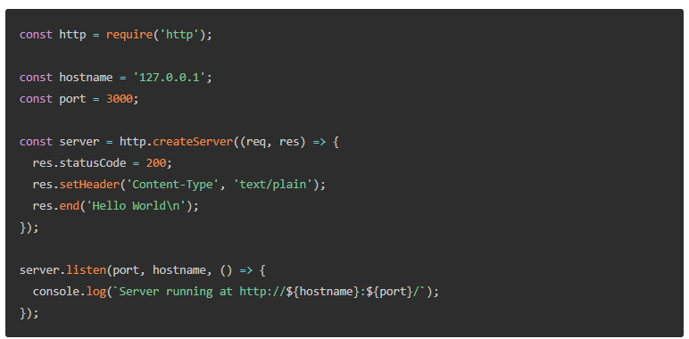
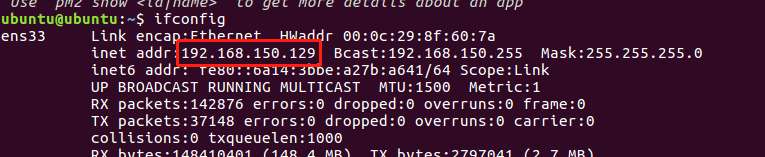
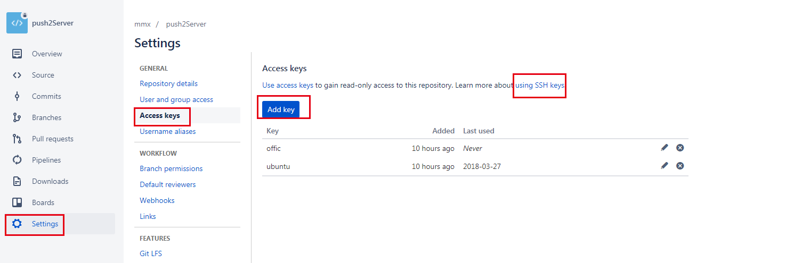
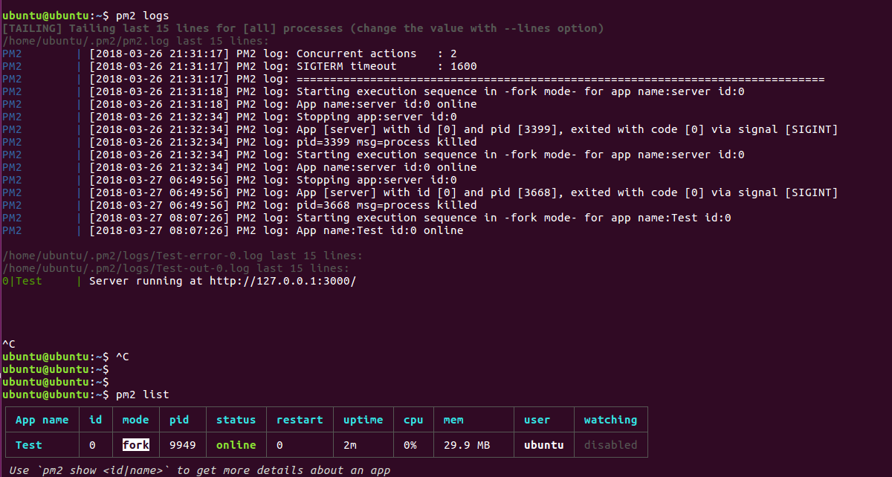



## 前言

主要总结下PM2工具使用的一些坑。

## 准备

试验的环境是本地Vmware虚拟机（装ubuntu 16.04）和本地windows平台(win7)。
1 Vmware虚拟机装上ubuntu（教程网上找）
装好以后，调整下窗口：
{{}}

2 本地win7装上xshell

## 开始

虚拟机上需要配置NodeJs环境，Terminal,打开命令行，依次输入一下命令。
1 升级一下包

```bash
sudo apt-get update 
```

2 安装一些必备工具

```bash
sudo apt-get install git vim openssl openssh-server  build-essential libssh-dev wget curl 
```

openssh-server是我们通过ssh连接用到。
curl是一个Linux下的传输工具
git是安装我们的Node.js源码需要的版本工具

3 安装nvm

```bash
curl -o- https://raw.githubusercontent.com/creationix/nvm/v0.33.8/install.sh | bash
```

4 安装nodejs

```bash
nvm install v8.1.2
nvm use v8.1.2
```

5 关闭防火墙（因为后面我们要ssh连到这台虚拟机，所以防火墙最好是关闭）

```bash
sudo ufw stop
```

6 安装yarn vue-cli pm2

```bash
curl -sS https://dl.yarnpkg.com/debian/pubkey.gpg | sudo apt-key add -
echo "deb https://dl.yarnpkg.com/debian/ stable main" | sudo tee /etc/apt/sources.list.d/yarn.list
sudo apt-get update && sudo apt-get install yarn
npm install vue-cli pm2 -g
```

yarn是一个包管理工具，相当于npm
vue-cli是一个Vue的命令行工具
pm2是Node服务管理工具

## 测试虚拟机上Node是否安装好

虚拟机上创建一个server.js：

```bash
vi server.js
```

拷贝代码进去：
{{}}

然后按下:wq! 保存
最后测试：

```bash
pm2 start server.js
```

如果看到如下状态，说明启动成功。
{{}}

## 本地windows（win7）连接到虚拟机

1 修改sshd_config(保证能通过密码登录)

```bash
vim /etc/ssh/sshd_config
```

找到：

Authentication:

LoginGraceTime 120
PermitRootLogin prohibit-password
StrictModes yes

修改成：

Authentication:

LoginGraceTime 120
PermitRootLogin yes
StrictModes yes

2 虚拟机启动ssh

```bash
sudo service ssh start
```

3 查看ip（记住你的IP）

```bash
ifconfig
```

{{}}

4 打开xshell
输入ssh ubuntu@192.168.150.129
@前面是用户名 @后面是IP。 用户名必须正确，否则会提示服务器拒绝密码。另外虚拟机的网络配置是NAT，不需要改为桥接。
正常情况下能链接成功

## 创建一个私有仓库

我用的是bitbuket，自己先到上面常见一个push2Server的仓库。
{{}}

然后本地clone下来

目录下创建一个server.js，代码和上面的一样。还有一个ecosystem.json(这个是pm2自动部署需要的)，目录结构如下：
{{}}

ecosystem.json这文件的配置很重要。

```json
{
  "apps": [
    {
      "name": "Test",
      "script": "server.js",
      "env": {
        "COMMON_VARIABLE": "true"
      },
      "env_production": {
        "NODE_ENV": "production"
      }
    }
  ],
  "deploy": {
    "production": {
      "user": "ubuntu", //注意点1： user必须是你ubuntu的名字
      "host": "192.168.150.129", //注意点2： ip保证正确
      "port": "22", //端口保证正确
      "ref": "origin/master",
      "repo": "git@bitbucket.org:YellMan/push2server.git", //注意点3 必须用git@..开头 不要 用https开头的
      "path": "/home/ubuntu/www/testproject/production",//注意点4 目录最好是绝对路径
      "ssh_options": "StrictHostKeyChecking=no",
      "env": {
        "NODE_ENV": "production"
      }
    }
  }
}
```

直接看注意点3： 因为虚拟机上要clone仓库代码，所以虚拟机上需要配置一下，git仓库的key.
到bitbuket上面的仓库，添加一个key。

{{}}

key怎么生成看教程：<https://confluence.atlassian.com/bitbucket/set-up-an-ssh-key-728138079.html>

```bash
ssh-keygen 
cat ~/.ssh/id_rsa.pub
pbcopy < ~/.ssh/id_rsa.pub
```

最后一步很重要：到虚拟机上运行：

```bash
ssh -T git@bitbucket.org
```

注意点4：因为pm2要在虚拟机上创建这个路径：/home/ubuntu/www/testproject/production。所以要保证testproject和www路径必须有权限。/home/ubuntu是我的根路径,然后创建www目录，目录下再创建testproject.
虚拟机上给一下权限：

```bash
sudo chmod 777 www
sudo chmod 777 testproject
```

最后，提交代码到远程仓库。

## 发布前配置

本地运行：

```bash
pm2 deploy ecosystem.json production setup
```

如果出现一下错误，重试一下就好了：
{{}}

如果出现一下错误：
{{}}

在服务端配置一下ssh key到的私有仓库（看注意点3）
如果出现以下错误：
{{}}

这是因为pm2是全局安装的，路径不是在默认路径下面。所以需要用ls命令link一下.
在虚拟机运行如下命令：

```bash
whereis pm2
pm2: /opt/nodejs/bin/pm2
sudo ln -s /opt/nodejs/bin/pm2 /usr/bin/pm2
```

如果出现一下错误：
{{}}

同理：

```bash
ubuntu@ubuntu:~$ whereis node
node: /usr/bin/node /home/ubuntu/.nvm/versions/node/v8.1.2/bin/node
sudo ln -s /home/ubuntu/.nvm/versions/node/v8.1.2/bin/node /usr/bin/node
```

## 最后发布项目

```bash
pm2 deploy ecosystem.json production
```

虚拟上看一下是否自动部署成功：

{{}}