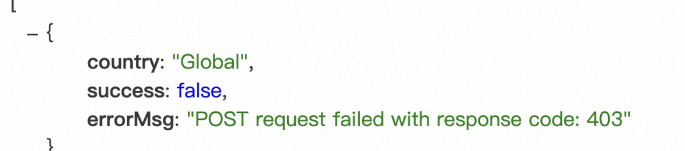
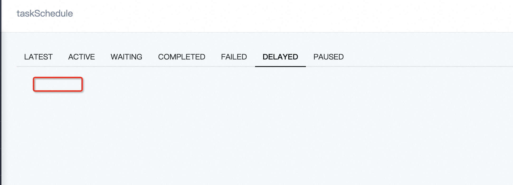

This document organizes content such as technical architecture, stability assurance, code practices, case studies, and backend monitoring solutions, aiming to provide a comprehensive reference for development and operations work.
## Table of Contents
1. [Technical Architecture](#technical-architecture)
   - Middleware
   - Serverless Applications
   - Frameworks
   - Operations
   - Application Management
2. [Stability Assurance](#stability-assurance)
3. [Three Key Steps for Backend Release](#three-key-steps-for-backend-release)
4. [Online Issues Caused by Multi-Data Source Sorting + In-Memory Sorting](#online-issues-caused-by-multi-data-source-sorting-in-memory-sorting)
5. [Case Studies](#case-studies)
6. [Code Practices](#code-practices)
7. [Canary Release](#canary-release)
8. [Backend Monitoring Technical Solution](#backend-monitoring-technical-solution)
9. [Log Management](#log-management)
10. [Handling Login Timeouts](#handling-login-timeouts)
## Technical Architecture
### Middleware
- **HSF**: High-Speed Service Framework, used for distributed service calls.
- **Tair**: Distributed cache system to improve data access speed.
- **Diamond**: Configuration management center, supports dynamic configuration updates.
- **MetaQ**: Message queue middleware for asynchronous message passing.
### Serverless Applications (Compared to Monolithic Applications)
- **Advantages**:
  - More flexible scalability.
  - Pay-as-you-go, reducing resource waste.
  - Reduced operational complexity.
- **Challenges**:
  - Cold start issues.
  - Increased difficulty in debugging and monitoring.
### Frameworks
- **Midway**: A Node.js-based Serverless framework that supports multiple cloud platforms.
- **Vercel**: A frontend deployment platform, suitable for static sites and serverless functions.
### Operations
- **Monitoring**: Real-time monitoring of system status to quickly detect anomalies.
- **Deployment**: Using Docker and Node.js scripts for automated deployment.
### Application Management
- **Unified Gateway**: A single entry point to simplify routing management and access control.
- **DNS Server**: Provides domain name resolution services.
- **Docker**: Containerize applications to improve deployment efficiency.
## Stability Assurance
1. **Unit Testing**: Write comprehensive unit tests covering core logic.
2. **Monitoring**: Real-time monitoring of system status to promptly discover and resolve issues.
3. **Code Fallbacks**: Add defensive code in critical paths to prevent system crashes due to exceptions.
## Three Key Steps for Backend Release
1. **Observe if business data is normal**  
   Ensure that business metrics (e.g., order volume, user activity) do not show abnormal fluctuations after release.
   
2. **Observe if there are sudden increases or decreases in traffic**  
   Pay attention to changes in API call volume to ensure traffic is within a reasonable range.
3. **Observe APIs: Ensure they scale with the canary release**  
   Gradually increase traffic during a canary release to ensure the stability of the new version.
---
## Online Issues Caused by Multi-Data Source Sorting + In-Memory Sorting
1. **Insufficient Memory**: Large data volume leads to out-of-memory errors.
2. **Network Latency**: Long data transmission times affect performance.
3. **Data Consistency Issues**: Inconsistent data synchronization between multiple data sources.
4. **Concurrency Conflict Issues**: Concurrent operations may lead to data races or deadlocks.
---
## Case Studies
1. **Database Query Connections Exhausted**  
   - Problem Description: A long-running query on an API in the pre-production environment caused other APIs to time out with a 504 error.  
   - Solution: Optimize the slow query and increase the connection pool size.
2. **Dirty Data Issues**  
   - Problem Description: Dirty data in the database affects business logic.  
   - Solution: 
     - Proxy the data locally for correction.
     - Handle with code compatibility to ensure storage does not affect the original structure.
3. **Node Service Request 403 Error**  
   - Problem Description: A request to the Node service returns a 403 error because it triggered CSRF validation logic.  
   - Solution: Check the CSRF validation logic, adjust the relevant configuration, or remove unnecessary validation.
## Code Practices
### Database Design
1. Table and field design should have clear meanings to avoid ambiguity.
2. When deleting a method, confirm if it is referenced to avoid logic failures.
3. When querying the database, filter out deleted data to prevent incorrect operations.
### DTO Validation
```typescript
@ValidateNested({ each: true })  
@Type(() => IProperty)
```
### Memory Overflow
```bash
node --max-old-space-size=4096 ./node_modules/.bin/packmon start -p 7009
```
### HSF Call Error
Problem Description: The `hessian writeDate` method expects an input of type `number`, but an ISO format string was passed.
Solution: Convert the ISO string to a timestamp before passing it.
```javascript
const timestamp = new Date("2024-04-28T14:11:06.000Z").getTime();
byteBuffer.put(encoder.write(timestamp).get());
```
### MySQL Queries
1. The `IN (?)` parameter must be an array to prevent SQL injection.
2. JSON type fields need to be serialized before storage.
3. Querying JSON fields:
   ```sql
   builder.andWhere(`JSON_CONTAINS(country.${key}, JSON_ARRAY(${JSON.parse(query[key])}))`);
   builder.orWhere(`JSON_CONTAINS(admin, JSON_OBJECT('workId', '${query.creator}') )`);
   ```
### Design for Unaffected Fields
Use an existing table as a configuration table. When creating a new table, copy a record from the configuration table.
### Downstream Data Persistence and Extension
Extend the table by adding new fields (like a class ID) instead of splitting the table.
### SQL Query Optimization
First, query data concurrently, then filter according to rules.
### Midway Scheduled Tasks
The queue must be cleared when cleaning up tasks.


## Debugging
1. When a real activity cannot be replaced with a new component, hardcode the component entry point for local debugging.
2. Check if the PC page is abnormal; on mobile, you can open it with a PC user agent.
3. When the server calls a service method and doesn't proceed to the next step in your code, you can use step-by-step debugging to find the error location.
4. Use the browser preview to view formatted content:

## Backend Monitoring Technical Solution
### Objective
Automatically classify log information through real-time tracing to reduce manual configuration.
### Implementation Method
1. Use `Schedulx` scheduled tasks to execute Service Methods.
2. Call platform APIs to get data, or pull existing data from ODPS.
3. Use Tair to get incremental data and supplement missing data through ODPS.
### Frontend Tracking
Manually add tracking points on the frontend to SLS logs to build a business funnel monitoring system, achieving full automation.
### Frontend Monitoring
The core is to monitor page render volume/key page elements. Even if JS is blocked and not loaded, a drop in render volume can indicate an online issue.
## Log Management
1. **Error Stack Capture**: Capture the error stack and store it in the database before throwing it to the upper layer.
2. **Error Message Standardization**: Error messages should include `errorCode` and `errorMessage` to facilitate problem location.
3. **Log Service Capability**: Provide API alerting capabilities connected to groups, allowing log viewing without logging into the server.
4. **Log Reporting**: Implement log reporting through logging middleware.
## Handling Login Timeouts
1. **Popup Refresh**: If a login times out, a login window can pop up directly; clicking refresh is sufficient.
2. **Handling Form Scenarios**: If there is an unsubmitted form, it is recommended to open a new page or use an iframe for login to avoid data loss.
## Error Handling Levels
1  LEVEL 1: No handling. Find answers in issues on your own.  
2 LEVEL 2: FAQ.  
3 LEVEL 3: Error Code. Differentiate by type and source. Easy to share and search.  
4 LEVEL 4: Framework Integration. Standardized and engineered error codes. Automatically locate the error type and provide an answer.  
5 LEVEL 5: Doctor. CI/CD static analysis.  
## Learning
antfu's small libraries (under 1000 lines): ni
