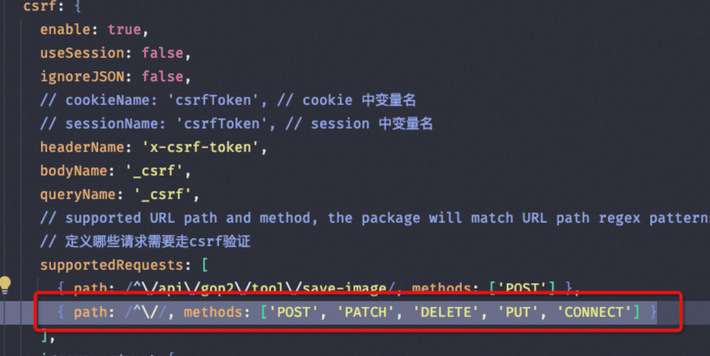

本文档整理了技术架构、稳定性保障、代码实践、问题案例及后端监控技术方案等内容，旨在为开发和运维工作提供全面的参考。

## 目录

1. [技术架构](#技术架构)
   - 中间件
   - Serverless 应用
   - 框架
   - 运维
   - 应用管理
2. [稳定性保障](#稳定性保障)
3. [后端发布三板斧](#后端发布三板斧)
4. [多数据源排序+内存排序导致线上问题](#多数据源排序内存排序导致线上问题)
5. [问题案例](#问题案例)
6. [代码实践](#代码实践)
7. [灰度放量](#灰度放量)
8. [后端监控技术方案](#后端监控技术方案)
9. [日志管理](#日志管理)
10. [登录超时处理](#登录超时处理)

## 技术架构

### 中间件
- **HSF**: 高性能服务框架，用于分布式服务调用。
- **Tair**: 分布式缓存系统，提升数据访问速度。
- **Diamond**: 配置管理中心，支持动态配置更新。
- **MetaQ**: 消息队列中间件，用于异步消息传递。

### Serverless 应用（对比单体应用）
- **优势**:
  - 更灵活的扩展性。
  - 按需计费，降低资源浪费。
  - 减少运维复杂度。
- **挑战**:
  - 冷启动问题。
  - 调试和监控难度增加。

### 框架
- **Midway**: 基于 Node.js 的 Serverless 框架，支持多种云平台。
- **Vercel**: 前端部署平台，适合静态站点和无服务器函数。

### 运维
- **监控**: 实时监控系统状态，快速发现异常。
- **部署**: 使用 Docker 和 Node.js 脚本实现自动化部署。

### 应用管理
- **统一网关**: 统一入口，简化路由管理和权限控制。
- **DNS Server**: 提供域名解析服务。
- **Docker**: 容器化应用，提升部署效率。

## 稳定性保障

1. **单元测试**: 编写全面的单元测试，覆盖核心逻辑。
2. **监控**: 实时监控系统运行状态，及时发现并解决问题。
3. **代码兜底**: 在关键路径添加防御性代码，避免因异常导致系统崩溃。

## 后端发布三板斧

1. **观察业务数据是否正常**  
   确保发布后业务指标（如订单量、用户活跃度）未出现异常波动。
   
2. **观察流量是否突增或者突降**  
   关注接口调用量的变化，确保流量在合理范围内。

3. **观察接口：是否同步跟着灰度放量增加**  
   灰度发布时逐步增加流量，确保新版本功能稳定。

---

## 多数据源排序+内存排序导致线上问题

1. **内存不足**: 数据量过大导致内存溢出。
2. **网络延迟**: 数据传输时间过长影响性能。
3. **数据一致性问题**: 多数据源之间的数据同步不一致。
4. **并发冲突问题**: 并发操作可能导致数据竞争或死锁。

---

## 问题案例

1. **数据库查询连接被占满**  
   - 问题描述: 预发环境某个接口查询耗时较长，导致其他接口出现 504 超时异常。  
   - 解决方案: 优化慢查询，增加连接池大小。

2. **脏数据问题**  
   - 问题描述: 数据库中存在脏数据，影响业务逻辑。  
   - 解决方案: 
     - 将数据代理到本地进行订正。
     - 代码兼容处理，确保存储时不影响原有结构。

3. **Node 服务请求 403 错误**  
   - 问题描述: 请求 Node 服务时返回 403 错误，原因是触发了 CSRF 验证逻辑。  
   - 解决方案: 检查 CSRF 验证逻辑，调整相关配置或移除不必要的验证。

## 代码实践

### 数据库设计
1. 表和字段设计应明确含义，避免二义性。
2. 删除方法时需确认是否被引用，避免逻辑失败。
3. 查询数据库时需筛选已删除的数据，防止误操作。

### DTO 校验
```typescript
@ValidateNested({ each: true })  
@Type(() => IProperty)
```

### 内存溢出
```bash
node --max-old-space-size=4096 ./node_modules/.bin/packmon start -p 7009
```

### HSF 调用报错
问题描述: `hessian writeDate` 方法期望输入类型为 `number`，但实际传入的是 ISO 格式的字符串。
解决方案: 将 ISO 字符串转换为时间戳后再传递。
```javascript
const timestamp = new Date("2024-04-28T14:11:06.000Z").getTime();
byteBuffer.put(encoder.write(timestamp).get());
```

### MySQL 查询
1. `IN (?)` 参数必须是数组，避免 SQL 注入。
2. JSON 类型字段需序列化后存储。
3. 查询 JSON 字段:
   ```sql
   builder.andWhere(`JSON_CONTAINS(country.${key}, JSON_ARRAY(${JSON.parse(query[key])}))`);
   builder.orWhere(`JSON_CONTAINS(admin, JSON_OBJECT('workId', '${query.creator}') )`);
   ```

### 字段不受影响的设计
已有表作为配置表，新建表时复制配置表的一条记录。

### 下游数据固化扩展
通过新增字段（如类 ID）扩展表，而非拆分表。

### SQL 查询优化
先并发查询数据，再按规则过滤。

### Midway 定时任务
清理任务时需清空队列。


## 调试
1. 当真实活动无法替换为新组件，本地调试时先写死组件入口
2. 查看pc页面是否异常，手机端可以ua以pc方式打开
3. 服务端调用service方法时，没有走到下一步自己的代码。 可以通过单步调试会进入报错位置
4. 通过浏览器预览这种方式，查看格式化的内容：


## 后端监控技术方案

### 目标
通过实时链路自动分类日志信息，减少手动配置。

### 实现方式
1. 使用 `Schedulx` 定时任务执行 Service Method。
2. 调用平台接口获取数据，或从 ODPS 拉取存量数据。
3. 使用 Tair 获取增量数据，并通过 ODPS 补齐缺失数据。

### 前端埋点
通过前端手动埋点至 SLS 日志，建立业务漏斗监控体系，实现完全自动化。

### 前端监控
核心监控页面渲染量/页面关键元素，即便js阻塞未加载，通过渲染量的下降也能判断线上问题

## 日志管理

1. **错误堆栈捕获**: 尽量将错误堆栈捕获后入库，再抛出给上层。
2. **错误信息规范**: 错误信息需包含 `errorCode` 和 `errorMessage`，便于定位问题。
3. **日志服务能力**: 提供 API 报警能力，对接到群组，无需登录服务器即可查看日志。
4. **日志上报**: 通过日志中间件实现日志上报。

## 登录超时处理

1. **弹窗刷新**: 如果登录超时，可直接弹出登录窗口，点击刷新即可。
2. **表单场景处理**: 如果有未提交的表单，建议新开页面或使用 iframe 登录，避免数据丢失。

## 错误处理级别
1  LEVEL 1: 不处理。 自行在issues中找答案  
2 LEVEL 2: FAQ。  
3 LEVEL 3: Error Code 。类型和来源进行区分。 便于分享、搜索。  
4 LEVEL 4: 框架集成。 规范化、工程化错误代码。 自动定位错误类型，并且给出答案。  
5 LEVEL 5: Doctor。 CI/CD 静态分析。  

## 学习
antfu的小库（1000行以内）： ni