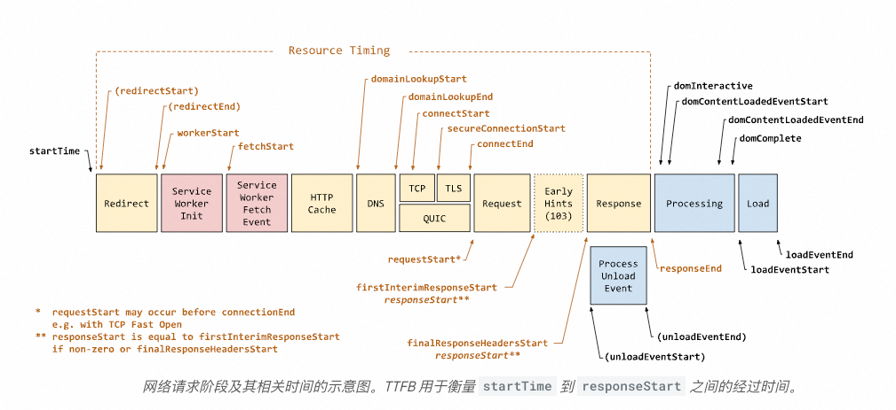

## 目录
1. [关键概念](#关键概念)
   - [90 分位数](#90-分位数)
   - [TTFB 和 FCP](#ttfb-和-fcp)
   - [CLS、LCP 与性能指标](#cls-lcp-与性能指标)
2. [最佳实践](#最佳实践)
   - [首屏样式优化](#首屏样式优化)
   - [HTML 压缩与 14KB 法则](#html-压缩与-14kb-法则)
3. [LCP 优化方案](#lcp-优化方案)
4. [案例分析](#案例分析)
   - [图片加载抖动问题](#图片加载抖动问题)
5. [CSS 和 JS 的阻塞性](#css-和-js-的阻塞性)
6. [CSS 异步化与抽取](#css-异步化与抽取)
7. [报表](#报表)

---

## 关键概念

### 90 分位数

**90 分位数** 是指一组数据中，有 90% 的数据小于或等于该值。在性能优化领域，90 分位数常用于衡量用户体验的核心指标，例如页面加载时间、交互响应时间等。它能够更全面地反映大部分用户的实际体验，而非仅关注平均值。

---

### TTFB 和 FCP

- **TTFB（Time to First Byte）**：从用户发起请求到接收到第一个字节的时间。
- **FCP（First Contentful Paint）**：浏览器首次渲染任何内容（文本、图像等）的时间。
- TTI: time to ineractive 可交互时间 需要排除前进后退的缓存
  - 通过PerformanceNavigationTiming的type: back_forward 可以区别出来

#### 优化目标
- **TTFB 和 FCP 时间差控制在 2000ms 内**。
- 首屏样式应内联，其他非核心 CSS/JS 放到 `<body>` 底部（JS 在 CSS 前），或者使用 `rel="preload"` 加载非阻塞资源：
  ```html
  <link rel="preload" as="style" href="styles.css" onload="this.rel='stylesheet'">
  ```


navigationStart (整体页面导航开始)
     |
     |----------------| redirectStart (可选)
     |----------------| redirectEnd (可选)
     |---------------------| serviceWorkerInit (服务工作者初始化)
     |---------------------------| serviceWorkerFetchEvent (服务工作者处理 fetch 事件)
     |---------------------| fetchStart (检查缓存/请求资源)
     |--------------------------| httpCacheCheck (HTTP 缓存检查)
     |----------------------------| domainLookupStart (DNS 查询开始)
     |----------------------------| domainLookupEnd (DNS 查询结束)
     |----------------------------| connectStart (TCP 建立连接开始)
     |----------------------------| secureConnectionStart (HTTPS 握手开始, 如果有 SSL/TLS)
     |----------------------------| connectEnd (连接完成)
     |-----------------------------| earlyHint (103 状态码)
     |-----------------------------| requestStart (请求发出)
     |----------------------------------| responseStart (接收到第一个字节响应 - TTFB)
     |------------------------------------------| responseEnd (接收到完整响应 - Content Download 完成)
     |---------------------| jsLoadStart (JavaScript 文件加载开始)
     |-----------------------------| jsLoadEnd (JavaScript 文件加载结束)
     |---------------------| cssLoadStart (CSS 文件加载开始)
     |-----------------------------| cssLoadEnd (CSS 文件加载结束)
     |---------------------| imgLoadStart (图片加载开始)
     |-----------------------------| imgLoadEnd (图片加载结束)
     |-----------------------------------------------| domLoading (开始解析 HTML 文档)
     |---------------------------------------------------| domInteractive (文档解析完成)
     |------------------------------------------------------------| domContentLoadedEventStart (DOM 构建完成)
     |------------------------------------------------------------| domContentLoadedEventEnd (文档准备完成)
     |-------------------------------------------------------------------| domComplete (DOM 完成)
     |----------------------------------------------------------------------| renderingPhaseStart (渲染阶段开始)
     |--------------------------------------------------------------------------| loadEventStart (页面加载开始)
     |-------------------------------------------------------------------------| loadEventEnd (页面加载完成)

     -- 每个资源加载时间 (RT) 可通过以下时间点计算：
           [startTime]---------------------[httpCacheCheck]-------------[responseEnd] -> (资源 RT)


#### 注意事项
- 将 5KB 的核心 CSS 样式放到 `<head>` 中，但需注意避免因过大导致 FCP 变慢（如增加 800ms）。

---

### CLS、LCP 与性能指标

- **CLS（Cumulative Layout Shift）**：累计布局偏移，衡量页面布局的稳定性。
- **LCP（Largest Contentful Paint）**：最大内容绘制，衡量页面主要内容的加载速度。

#### 关系
- **CLS 对 Good URL 的作用大于 LCP**，因为稳定的布局直接影响用户体验。

---

## 最佳实践

### 首屏样式优化

- **核心样式内联**：将首屏所需的关键 CSS 内联到 HTML 中，确保快速渲染。
- **非核心样式异步加载**：将其他样式放到 `<body>` 底部，或者通过 `preload` 实现非阻塞加载：
  ```html
  <link rel="preload" as="style" href="non-critical.css" onload="this.rel='stylesheet'">
  ```

---

### HTML 压缩与 14KB 法则

- **14KB 法则**：首屏内容应保持在 14KB 以内（压缩后），以确保第一次往返传输的最大数据量不超过限制。
- **原因**：TCP 协议的初始拥塞窗口通常为 10 个 TCP 数据包，每个数据包约 1.4KB，合计约 14KB。

### 按需加载
通过合理选择 **按需加载** 或 **SSR 输出**，可以有效提升首页的加载速度和用户体验。

- **大体积包**：如果某个包的体积较大（如 `moment`），直接加载会导致首页加载时间显著增加。
- **非核心功能**：对于首页中非核心的功能模块，可以选择按需加载以减少初始加载负担。
- **动态内容**：一些依赖用户交互的内容（如弹窗、图表）适合按需加载。

### ssr

SSR（Server-Side Rendering）是一种服务端渲染技术，用于在服务端生成 HTML 并直接返回给客户端。

- **首屏加载快**：服务端直接返回完整的 HTML，减少客户端的渲染时间。
- **SEO 友好**：搜索引擎可以直接抓取服务端生成的 HTML 内容。
- **小体积资源**：对于体积较小的资源，直接通过 SSR 输出可以避免额外的网络请求。

一般能减少150ms左右

---

## LCP 优化方案

1. **Base64 图片**：将最大的几张图片转为 Base64 编码，避免额外的下载请求。
2. **Preload 图片**：对关键图片使用 `preload` 提前加载：
   ```html
   <link rel="preload" as="image" href="large-image.jpg">
   ```
3. **减少 HTML 体积**：通过压缩 HTML 和减少内联样式来降低页面大小。
4. **React 水合优化**：
   - 确保水合前后元素一致，避免 LCP 元素变化。
   - 避免弹窗（Pop）或其他动态组件导致 LCP 元素被删除。
5. **轮播组件优化**：避免轮播组件频繁删除 DOM 元素，影响 LCP 计算。

msite的LCP为什么比pc更好，因为msite有前进后退功能，直接走的缓存。

---

## 案例分析

### 图片加载抖动问题

#### 问题描述
图片加载完成后出现抖动，原因是字体文件加载导致文字高度变化，进而影响图片布局。

#### 解决方法
- 使用 **Slow 3G** 模拟网络环境，观察字体加载对文字高度的影响。
- 优化字体加载策略，避免字体切换导致的高度变化。

---

## CSS 和 JS 的阻塞性

- **CSS 渲染阻塞**：CSS 文件会阻塞页面的渲染，直到所有样式加载完成。
- **JS 解析阻塞**：非异步 JS 文件会阻塞 HTML 解析，直到脚本执行完毕。

#### 优化建议
- 将非核心 JS 文件标记为 `async` 或 `defer`，避免阻塞 HTML 解析。
- 使用 `preload` 提前加载关键资源。

---

## CSS 异步化与抽取

### CSS 异步化
通过以下方式实现 CSS 的异步加载：
```html
<link rel="preload" as="style" href="styles.css" onload="this.rel='stylesheet'">
```

### CSS 抽取工具
- 使用工具提取关键 CSS：
  - [Critical CSS with Next.js](https://focusreactive.com/critical-css-with-nextjs/)
  - [Web.dev 文章：Extract Critical CSS](https://web.dev/articles/extract-critical-css?hl=zh-cn)

### 参考资料

- [W3C 性能计时入门](https://w3c.github.io/perf-timing-primer/?spm=ata.21736010.0.0.735649fepnL0uD)
- [Web.dev 提取关键 CSS](https://web.dev/articles/extract-critical-css?hl=zh-cn)

##  CSR 和 SSR 架构

csr架构： 采用动静分离，静态部分缓存，动态部分通过csr请求。

csr请求有两种形式一个是二段请求，先请求页面结构框架（也就是html），然后组件里面请求具体的数据。 
这个典型应用是商家工作台。 采用的是这种架构。

详情页面根据商品id走内存缓存，所以接口非常快。但是首页无法做到，因为首页的结构是跟着运营平台变化的。

ssr架构： html走serviceworker缓存，但是页面结构和商品和运营数据会刷新。

## Performance如何获取资源加载时长

performance.getEntriesByType("resource") 返回的是一个 `PerformanceResourceTiming`  对象的数组。 每个对象包含关于单个资源加载的详细信息。 

- name: 资源的 URL。
- startTime: 资源请求的开始时间（相对于 navigationStart）。
- **responseEnd**: 浏览器收到资源响应的结束时间（所有数据下载完成）。 这通常是你需要的结束时间。
- duration: 资源加载的总时长 (等于 responseEnd - startTime)。
- fetchStart: 浏览器开始获取资源的时间（在 DNS 查询之前）。
- domainLookupStart: DNS 查询开始的时间。
- domainLookupEnd: DNS 查询结束的时间。
- connectStart: TCP 连接开始的时间。
- connectEnd: TCP 连接完成的时间。
- requestStart: 浏览器发起请求的时间。
- responseStart: 浏览器接收到第一个字节的时间。
- secureConnectionStart: 如果是 HTTPS 连接，TLS 握手开始的时间。

`let timing = performance.getEntriesByType('navigation')[0]` 现代浏览器推荐使用`PerformanceNavigationTiming` 来获取页面加载性能数据，因为它提供了更精确和详细的时间点信息。 旧浏览器是用`PerformanceTiming` 

## 获取不同指标数据

```js
import { onLCP, onINP, onCLS, CLSMetric } from "web-vitals/attribution";
Math.random() < 10 / 100 // 采样率10%
```

---


## **1. Prefetch**

**用途**：  
`prefetch` 用于在浏览器空闲时间加载资源，对当前页面性能影响较小，适用于提前获取下一页面的资源并存入浏览器缓存。

**特点**：
- 默认情况下，`prefetch` 请求不带 Cookie。
- 可通过 `credentials` 属性让请求带上 Cookie。

**示例代码**：
```html
<link rel="prefetch" href="next-page.js" as="script" credentials="include">
```

**动态设置缓存时间**：
可以通过服务端动态设置资源的缓存时间，以控制资源的有效期。
```js
app.get('/next-page', (req, res) => {
  const header = req.headers['purpose'] || req.headers['sec-purpose'];
  if (header === 'prefetch') {
    res.set('Cache-Control', 'max-age=10'); // 设置缓存时间为 10 秒
  }
  res.send('next page content');
});
```

**扩展**：  
还可以结合 Service Worker 控制资源的加载和缓存策略。

---

## **2. Preload**

**用途**：  
`preload` 用于立即加载关键资源（如字体、CSS、JS、图像等），无需等待 DOM 树解析完成。当某个资源是页面加载的关键部分但无法通过正常加载顺序立即获得时，可以使用 `preload`。

**特点**：
- 资源加载是同步的，确保关键资源优先加载。

**示例代码**：
```html
<link rel="preload" href="styles.css" as="style">
```

---

## **3. Preconnect**

**用途**：  
`preconnect` 提前建立到外部资源服务器的网络连接，包括 DNS 解析、TCP 握手和 TLS 协商。如果仅需要提前解析域名，可以使用 `dns-prefetch`。

**适用场景**：
- 访问第三方资源（如字体库、CDN 资源）时，减少请求外部资源时的延迟。

**示例代码**：
```html
<link rel="preconnect" href="https://example.com">
<link rel="preconnect" href="https://fonts.googleapis.com">
```

**服务端动态设置**：
可以在服务端通过响应头动态设置 `preconnect`。
```js
app.get('/', (req, res) => {
  res.set('Link', [
    '<https://example.com>; rel=preconnect',
    '<https://fonts.googleapis.com>; rel=preconnect'
  ]);
  res.flushHeaders(); // 立即发送
  const rs = fs.createReadStream('content');
  rs.pipe(res);
});
```

---

## **4. 启发：SSR 场景下的资源优化**

在 SSR（服务端渲染）场景下，可以先返回静态部分内容（包含资源加载提示），然后再处理耗时的核心 HTML 生成逻辑。

**问题背景**：  
如果服务器响应较慢，浏览器会等到整个响应完成后才开始加载资源。为解决这一问题，可以结合 `Early Hints 103` 或分块传输（Chunked Transfer Encoding）来优化。

**示例代码**：
```js
http.createServer((req, res) => {
  res.writeHead(200, {
    'Content-Type': 'text/html',
    'Transfer-Encoding': 'chunked'
  });

  // 先返回静态部分
  setTimeout(async () => {
    const firstScreenData = await getFirstData();
    res.write(`<link rel="preload" href="${firstScreenData.src}" as="image">`);
  }, 1000);

  // 再返回复杂计算部分
  // TODO: 处理核心 HTML 生成逻辑
});
```

---

## **5. Early Hints 103**

**用途**：  
`Early Hints 103` 是一种 HTTP 响应状态码，适用于服务器响应时间较长、想要最大程度优化用户感知加载速度的场景。

**特点**：
- 在主响应之前，提前告知浏览器需要预加载的资源。
- 减少关键资源的加载延迟。

**示例代码**：
```js
app.get('/', (req, res) => {
  res.status(103).set({
    Link: [
      '</styles/main.css>; rel=preload; as=style',
      '</images/a.jpg>; rel=preload; as=image'
    ].join(',')
  }).end();

  // 再返回真实的内容
  const rs = fs.createReadStream('content');
  res.set('Content-Type', 'text/html');
  rs.pipe(res);
});
```

---


## ServiceWorker缓存命中率统计【折线图】
> 或者可以直接根据pv - uv / pv 代表二次访问的命中率

```sql
(*)| SELECT
  date_format(__time__, '%m-%d %H:00:00') AS Time,
  COUNT(
    CASE
      WHEN p2 = 'cache_hit' THEN 1
    END
  ) * 100.0 / COUNT(*) as hit_rate,
  COUNT(*) as total_requests,
  COUNT(
    CASE
      WHEN p2 = 'cache_hit' THEN 1
    END
  ) as hit_count,
  COUNT(
    CASE
      WHEN p2 = 'cache_miss' THEN 1
    END
  ) as miss_count
FROM  "ods_aes_records"
WHERE
  p1 = 'pc_home_cache_stats'
group by
  Time
order by
  Time
```

## 性能分位统计

```sql
((content: 'entry_f'))| WITH extracted_data AS (
  SELECT 
    date_format(worker.__time__, '%m-%d %H:00:00') AS Time,
    regexp_extract(worker.content, '\[([^ ]+)', 1) AS trace,
    try_cast(
      regexp_extract(worker.content, 'entry_f (\d+)', 1) AS double
    ) AS duration_value,
    replace(gateway.rt, 'ms', '') AS RT
  FROM "b-worker-log" as worker
  LEFT JOIN "a-log" as gateway
  on regexp_extract(worker.content, '\[([^ ]+)', 1) =  gateway.trace
  where gateway.fn = 'xx'
)
SELECT
  Time,
  round(avg(duration_value), 2) as fAverage,
  round(approx_percentile(duration_value, 0.75), 2) as fP75,
  round(approx_percentile(duration_value, 0.90), 2) as fP90,
  round(approx_percentile(duration_value, 0.95), 2) as fP95,
  round(avg(try_cast(rt  as double)),2) as gAverage, 
  round(approx_percentile(try_cast(rt  as double), 0.75), 2) as gP75,  
  round(approx_percentile(try_cast(rt  as double), 0.90), 2) as gP90, 
  round(approx_percentile(try_cast(rt  as double), 0.95), 2) as gP95
FROM extracted_data
GROUP BY Time
ORDER BY Time 
```

## 长尾比较多的柱状图

```sql
WITH binned_data AS (
  SELECT 
    Floor((try_cast(p5 AS double) - try_cast(p4 AS double)) / 1000 / 60) AS value
  FROM 
    "xxx"
  WHERE 
    try_cast(p5 AS double) IS NOT NULL
    AND try_cast(p4 AS double) IS NOT NULL
    AND (try_cast(p5 AS double) - try_cast(p4 AS double)) >= 0
),
binned_values AS (
  SELECT
    CASE
      WHEN value >= 0 AND value < 240 THEN '0-239'
      WHEN value >= 240 AND value < 480 THEN '240-479'
      WHEN value >= 480 AND value < 720 THEN '480-719'
      WHEN value >= 720 AND value < 960 THEN '720-959'
      WHEN value >= 960 AND value < 1200 THEN '960-1199'
      WHEN value >= 1200 AND value < 1440 THEN '1200-1439'
      WHEN value >= 1440 AND value < 1680 THEN '1440-1679'
      WHEN value >= 1680 AND value < 1920 THEN '1680-1919'
      WHEN value >= 1920 AND value < 2160 THEN '1920-2159'
      WHEN value >= 2160 AND value < 2400 THEN '2160-2399'
      ELSE '2400+'
    END AS bin,
    CASE
      WHEN value >= 0 AND value < 240 THEN 0
      WHEN value >= 240 AND value < 480 THEN 240
      WHEN value >= 480 AND value < 720 THEN 480
      WHEN value >= 720 AND value < 960 THEN 720
      WHEN value >= 960 AND value < 1200 THEN 960
      WHEN value >= 1200 AND value < 1440 THEN 1200
      WHEN value >= 1440 AND value < 1680 THEN 1440
      WHEN value >= 1680 AND value < 1920 THEN 1680
      WHEN value >= 1920 AND value < 2160 THEN 1920
      WHEN value >= 2160 AND value < 2400 THEN 2160
      ELSE 2400
    END AS bin_start
  FROM 
    binned_data
)
SELECT 
  bin,
  COUNT(*) AS num
FROM 
  binned_values
GROUP BY 
  bin, bin_start
ORDER BY 
  bin_start;
```

## 分布比较均匀的柱状图

lcp分布：
```sql
SELECT round(try_cast(c1 AS DOUBLE)/100, 0)*100 AS val,
       count(*) AS num
WHERE try_cast(c1 AS DOUBLE) > 0
  AND try_cast(c1 AS DOUBLE) < 15000
GROUP BY val
ORDER BY val aselect round(try_cast(c1 AS DOUBLE)/100, 0)*100 AS val,
                     count(*) AS num
WHERE try_cast(c1 AS DOUBLE) > 0
  AND try_cast(c1 AS DOUBLE) < 15000
GROUP BY val
ORDER BY val
```

## 饼图
```sql
SELECT
         CASE
                  WHEN try_cast(p5     as DOUBLE) > 0
                  AND      try_cast(p5 AS DOUBLE) <= 500 THEN '[0,500]'
                  WHEN try_cast(p5     AS DOUBLE) > 500
                  AND      try_cast(p5 AS DOUBLE) < 1000 THEN '[500,1000]'
                  WHEN try_cast(p5     AS DOUBLE) > 1000
                  AND      try_cast(p5 AS DOUBLE) < 2000 THEN '[1000,2000]'
                  ELSE '[2000,60000]'
         END      AS val,
         count(*) AS num
WHERE    try_cast(p5 AS DOUBLE) < 60000
AND      try_cast(p5 AS DOUBLE) > 0
GROUP BY val
ORDER BY num
```

## 筛选条件
type: perf/pv/js-error 日志类型: 比如性能/pv/错误
page_id: 页面url
pid：页面标记
dim1/2/3/4 : 一般是区分了业务信息，比如是否缓存
p1/2/10: 具体日志信息

---

W3C 提供了丰富的性能相关资源，帮助开发者优化网站和应用的加载速度、响应时间和用户体验。

- **性能相关资源**  
  访问 [W3C 性能工作组](https://www.w3.org/webperf/) 获取最新的性能标准和最佳实践。

> **补充说明**：性能优化是 Web 开发中的重要环节，建议关注 W3C 的性能标准更新，例如 LCP（最大内容绘制）、CLS（累计布局偏移）等核心指标。

---

## 报表

分析性能优化，需要哪些报表

### 后端日志报表

端到端性能分析： 业务标识、机房、样本量、请求体大小、最上层网关上下行size、最上层网关rt、中间网关上下行size/rt、网络传输耗时

### 前端日志报表

#### 流量构成分析

- 带spm是站内流量，不带不是站内流量。可以从这个看站内站外流量的情况，识别出302前置跳转对性能的影响；
  - 并且通过spm知道当前站内流量的来源是哪个页面
- 饼图看分布区间的占比
- refer看流量来源

---

## 什么是边缘缓存？

边缘缓存是一种将内容缓存在靠近用户的网络边缘节点上的技术。通过将数据存储在离用户更近的地方，边缘缓存能够显著减少延迟并提高页面加载速度。

- **核心原理**：利用 CDN（内容分发网络）中的边缘节点缓存静态或动态内容，缩短用户与内容之间的物理距离。
- **优势**：
  - 减少网络延迟，提升用户体验。
  - 减轻源服务器的负载，提高系统整体性能。


## 它解决了什么问题？

1. **首次访问网页无法利用缓存**  
   在 PWA（渐进式 Web 应用）等场景中，用户首次访问时无法利用客户端缓存或连接复用，导致页面加载速度较慢。

2. **客户端缓存不可用**  
   当用户首次访问某个网站时，客户端缓存尚未建立，因此无法加速页面加载。

3. **动态内容的缓存难题**  
   对于个性化内容较多的场景，直接缓存整个 HTML 并不现实，需要一种既能缓存又能动态生成内容的解决方案。


## 边缘缓存节点在请求链中的位置

边缘缓存节点通常位于用户和源服务器之间的 **CDN（内容分发网络）** 中。它充当一个中间层，负责缓存和提供静态或动态内容，从而减少源服务器的负载并加快响应速度。

- **工作流程**：
  1. 用户发起请求。
  2. 请求首先到达最近的边缘节点。
  3. 如果边缘节点有缓存的内容，则直接返回给用户；否则，向源服务器请求内容并缓存。


## 边缘缓存与 SSR、CSR/CDN 的区别

### SSR（服务端渲染）

- **问题**：
  - 由于服务端渲染需要较长的处理时间，页面的白屏时间会变长。
- **特点**：
  - 所有 HTML 内容由服务器生成，适合 SEO 优化。
  - 首次加载速度较慢，但对搜索引擎友好。


### CSR/CDN（客户端渲染/内容分发网络）

- **问题**：
  - 虽然可以通过 CDN 缓存所有 HTML，但由于每个用户的页面视图可能不同，直接缓存整个 HTML 并不现实。
- **解决方案**：
  - 将静态 HTML 缓存到 CDN，并使用 CSR（客户端渲染）来请求动态数据。
  - 这种方法解决了白屏问题，但有意义的内容显示时间比 SSR 更晚。
- **特点**：
  - 适合个性化内容较多的场景。
  - 首次加载体验不如 SSR，但可以灵活支持动态内容。

---

### ESR（边缘服务器渲染）

- **优势**：
  - **并行处理**：CSR/CDN 是串行处理方式（先请求 HTML，然后下载 JS 和 CSS 等资源），而 ESR 采用并行处理方式：CDN 返回缓存的首字节，同时加载动态内容。
  - **连接复用**：边缘服务器像 Service Worker 一样处理请求，支持连接复用，进一步减少延迟。
  - **性能提升**：相比无 ESR 的方案，页面加载速度可提升约 **200ms**。
- **特点**：
  - 结合了 SSR 和 CSR 的优点。
  - 既减少了白屏时间，又支持动态内容的快速加载。

## 总结

| 技术      | 优势                                      | 劣势                                  | 适用场景                     |
|-----------|-------------------------------------------|---------------------------------------|------------------------------|
| **SSR**   | SEO 友好，适合静态内容                    | 首次加载速度慢，白屏时间长            | 内容以静态为主，需 SEO 优化   |
| **CSR/CDN** | 支持动态内容，灵活性高                    | 白屏时间短，但有意义内容显示较晚       | 个性化内容较多的场景         |
| **ESR**   | 并行处理，减少白屏时间，提升加载速度       | 实现复杂度较高                        | 需要兼顾性能和动态内容的场景 |

边缘缓存（尤其是结合 ESR 的方案）为现代 Web 应用提供了更高效的解决方案，能够在保证性能的同时支持动态内容的快速加载，是未来 Web 性能优化的重要方向。


---

## avif

随着Web性能优化的需求不断增加，图片格式的选择变得尤为重要。AVIF（AV1 Image File Format）是一种高效的图片格式，相较于JPEG和PNG，具有更高的压缩率和更小的文件体积。然而，并非所有浏览器都支持AVIF格式，因此需要在前端进行兼容性检测。

同时，在移动端设备上，用户代理（User-Agent，简称UA）的检测是判断设备类型的重要手段。结合UA检测和AVIF支持检测，可以更好地为用户提供优化的图片加载体验。


## 什么是AVIF图片格式

AVIF是由AOMedia开发的一种基于AV1视频编码的图片格式，具有以下特点：
- **高压缩率**：相比JPEG，AVIF可以在相同质量下减少约50%的文件大小。
- **高质量**：支持透明度（Alpha通道）和HDR（高动态范围）。
- **广泛支持趋势**：主流浏览器（如Chrome、Firefox）逐渐开始支持AVIF。

## User-Agent检测的作用

User-Agent（UA）是HTTP请求头的一部分，用于标识客户端的设备、操作系统和浏览器信息。通过解析UA，可以：
1. 判断用户是否使用移动设备（如iPhone、Android）。
2. 区分不同浏览器（如Chrome、Safari）以提供针对性的优化。
3. 动态调整图片格式或页面布局。

## 如何检测AVIF图片支持

### 通过`<picture>`标签实现兼容性

HTML5的`<picture>`标签允许根据浏览器的支持情况动态加载不同格式的图片。例如：

```html
<picture>
  <source srcset="image.avif" type="image/avif">
  <source srcset="image.webp" type="image/webp">
  
</picture>
```

- 浏览器会按顺序检查`<source>`标签的`type`属性。
- 如果支持`image/avif`，则加载AVIF图片；否则回退到WebP或JPEG。

### 通过JavaScript检测AVIF支持

可以通过JavaScript动态检测浏览器是否支持AVIF格式：

```javascript
function isAvifSupported() {
  return new Promise((resolve) => {
    const avif = new Image();
    avif.src = 'data:image/avif;base64,AAAAIGZ0eXBhdmlmAAAAAGF2aWZtaWYxbWlhZk1BMUIAAADybWV0YQAAAAAAAAAoaGRscgAAAAAAAAAAcGljdAAAAAAAAAAAAAAAAGxpYmF2aWYAAAAADnBpdG0AAAAAAAEAAAAeaWxvYwAAAABEAAABAAEAAAABAAABGgAAAB0AAAAoaWluZgAAAAAAAQAAABppbmZoAAAAAAAACAAAAABubWl0AAAAAQAAAAEbmWRlcgAAAAAAAAYAAAAgbWVhcwAAAAAAAAABAAAAFGF2MDEAAAAAbG9zcwAAAAAAAAACAAAA';
    avif.onload = () => resolve(true);
    avif.onerror = () => resolve(false);
  });
}

isAvifSupported().then((supported) => {
  console.log('AVIF supported:', supported);
});
```

- 上述代码通过加载一个Base64编码的AVIF图片来检测支持情况。
- 如果图片加载成功，则表示浏览器支持AVIF。

## Mobile端User-Agent检测注意事项

### 常见Mobile端UA特征

1. **iOS设备**  
   - 示例：`Mozilla/5.0 (iPhone; CPU iPhone OS 16_0 like Mac OS X) AppleWebKit/605.1.15 (KHTML, like Gecko) Version/16.0 Mobile/15E148 Safari/604.1`
   - 特征：包含`iPhone`或`iPad`。

2. **Android设备**  
   - 示例：`Mozilla/5.0 (Linux; Android 12; SM-G991B) AppleWebKit/537.36 (KHTML, like Gecko) Chrome/104.0.5112.69 Mobile Safari/537.36`
   - 特征：包含`Android`和`Mobile`。

### 注意事项

1. **避免过度依赖UA**  
   UA字符串可能被修改或伪装，因此不应完全依赖它进行判断。

2. **结合特性检测**  
   使用特性检测（如`window.matchMedia`或`navigator.userAgentData`）作为补充手段。

3. **兼容旧版浏览器**  
   部分旧版浏览器可能不支持现代特性检测方法，需提供回退方案。

## 容错处理

### 检测失效的情况

1. **AVIF检测失败**  
   如果AVIF检测失败，应确保有其他格式（如WebP或JPEG）作为回退选项。

2. **UA检测错误**  
   如果UA检测结果不可靠，可以通过屏幕宽度（`window.innerWidth`）或触摸事件（`'ontouchstart' in window`）进一步判断设备类型。

### 示例：综合检测与容错

```javascript
function detectImageFormatAndDevice() {
  // 检测AVIF支持
  isAvifSupported().then((avifSupported) => {
    if (avifSupported) {
      console.log('Using AVIF format');
    } else {
      console.log('Falling back to WebP or JPEG');
    }
  });

  // 检测设备类型
  const userAgent = navigator.userAgent || navigator.vendor || window.opera;
  if (/iPhone|iPad|iPod/.test(userAgent)) {
    console.log('Detected iOS device');
  } else if (/Android/.test(userAgent)) {
    console.log('Detected Android device');
  } else {
    console.log('Detected desktop or unknown device');
  }
}

detectImageFormatAndDevice();
```

---

## h3协议升级

todo

