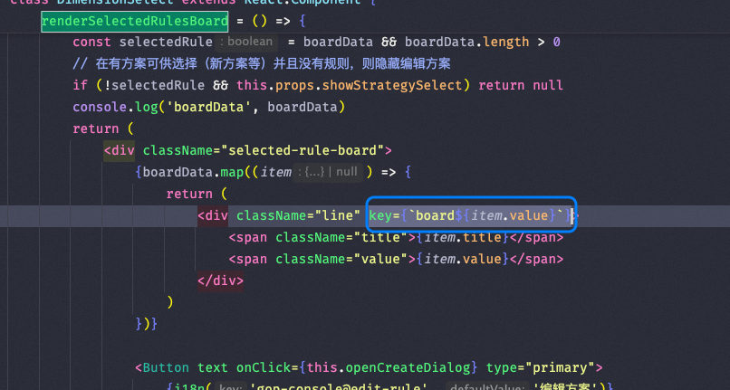

Here is a summary of common issues in React development, including case studies, knowledge summaries, and code examples.
---
## Table of Contents
1. [Form reset on rapid operations with slow network](#form-reset-on-rapid-operations-with-slow-network)
2. [Component does not update after initial render](#component-does-not-update-after-initial-render)
3. [Pure Function Characteristics](#pure-function-characteristics)
4. [Using useRef](#using-useref)
5. [forwardRef Example](#forwardref-example)
6. [Closure Reference Issues and useRef Solution](#closure-reference-issues-and-useref-solution)
7. [React Infinite Render Loop Problem](#react-infinite-render-loop-problem)
8. [Modal Component Cannot Access Global Store](#modal-component-cannot-access-global-store)
9. [Difference Between memo and useMemo](#difference-between-memo-and-usememo)
10. [DnDProvider Singleton Pattern](#dndprovider-singleton-pattern)
11. [React Closure Pitfalls](#react-closure-pitfalls)
12. [Tab Rendering Optimization](#tab-rendering-optimization)
13. [When to use useCallback](#when-to-use-usecallback)
14. [undefined and null in JSX](#undefined-and-null-in-jsx)
15. [Form Losing Focus Issue in Class Components](#form-losing-focus-issue-in-class-components)
16. [Multiple Method Calls Causing Repetitive UI Renders](#multiple-method-calls-causing-repetitive-ui-renders)
17. [React Source Code Learning Resources](#react-source-code-learning-resources)
18. [React Task Scheduling and Queue](#react-task-scheduling-and-queue)
19. [Error Boundary](#error-boundary)
---
## Form reset on rapid operations with slow network
### Case Description
In a slow network environment, when a user performs rapid operations, changes in the global Store (e.g., a global message popup on the right) might trigger the `willReceiveProps` method, causing the form to be reset (losing user-entered content).
### Solution
- Avoid directly resetting the form in `componentWillReceiveProps` or `useEffect`.
- Use controlled components and ensure state synchronization.
- When necessary, save the intermediate state of user input to prevent data loss due to parent component re-renders.
---
## Component does not update after initial render
### Case Description
Some components are passed an empty array or other initial values on the first render, and they fail to update correctly when real data is subsequently passed.
### Solution
- Ensure that changes in the component's `props` trigger a re-render.
- Use a `key` to force the component to re-render:
  ```jsx
  <MyComponent key={someUniqueKey} data={data} />
  ```
---
## Pure Function Characteristics
### Summary of Characteristics
1. **Same input, same output**: The same input will not affect the results of other calls due to call order or parameter changes.
2. **No re-render if reference is unchanged**: When the reference of `props` does not change, React will not re-render the component.
---
## Using useRef
### Notes
- `ref.current` is a plain JavaScript object, isolated from the outside, and does not trigger a component re-render.
- **Do not read or write to a `ref` during rendering**:
  ```js
  // Incorrect example
  function MyComponent() {
    myRef.current = 123;
    return <h1>{myRef.current}</h1>;
  }
  ```
---
## forwardRef Example
```js
const MyInput = forwardRef((props, ref) => {
  return <input {...props} ref={ref} />;
});
const App = () => {
  const inputRef = useRef(null);
  return <MyInput ref={inputRef} />;
};
```
---
## Closure Reference Issues and useRef Solution
### Case Description
Cannot get the latest state value in the modal's `onOk` method.
### Solution
Solve the closure reference issue using `useRef`:
```js
const latestValueRef = useRef();
latestValueRef.current = value;
const handleOk = () => {
  console.log(latestValueRef.current); // Get the latest value
};
```
---
## React Infinite Render Loop Problem
### Case Description
An operation causes the component to re-render repeatedly, eventually leading to the DOM node being removed.
### Solution
- Check if `setState` is called within a conditional statement.
- Avoid directly modifying dependencies within `useEffect`.
---
## Modal Component Cannot Access Global Store
### Case Description
Components rendered via `Dialog.confirm` cannot use `store.useModel('user')`.
### Root Cause Analysis
The modal component is not injected with the `Provider` context.
### Solution
Ensure the modal component is wrapped within a `Provider`:
```jsx
onClick: () => {
  Dialog.confirm({
    content: (
      <Provider>
        <CustomeComponent />
      </Provider>
    ),
  });
};
```
---
## Difference Between memo and useMemo
### Summary of Differences
- **useMemo**: Memoizes a value, recalculating it only when dependencies change.
- **React.memo**: Controls whether a component re-renders, executing only when `props` change.
### Example Code
```js
const CustomInput = React.memo(
  (props) => {
    console.log("rerender", props.name);
    return <Input {...props} />;
  },
  (prevProps, nextProps) => prevProps.value === nextProps.value
);
const CacheInput = (props) => {
  return <CustomInput {...props} />;
};
```
---
## DnDProvider Singleton Pattern
```js
import { DragDropContext } from 'react-dnd';
import HTML5Backend from 'react-dnd-html5-backend';
export const MyDndProvider = DragDropContext(HTML5Backend)(({ children }) => {
  return children;
});
```
---
## React Closure Pitfalls
### Recommendation
Use the functional form of `setState(list => ...)` to access the `list`, rather than accessing it directly via a closure.
---
## Tab Rendering Optimization
### Optimization Strategy
1. Update the component only when switching tabs, not on every input.
2. Use `unmountInactiveTabs` or conditional rendering to avoid multiple renders of expensive components.
---
## When to use useCallback
### Use Cases
- When a callback function is passed to a child component that uses `React.memo`.
- When a callback function is a dependency of `useEffect` or `useMemo`.
---
## undefined and null in JSX
- **undefined**: Causes a JSX error.
- **null**: Renders as empty content without error.
---
## Form Losing Focus Issue in Class Components
### Root Cause Analysis
A new function is created on every render, causing the component to re-render.
### Solution
Define the function as a class member method to avoid creating a new one on each render.
---
## Multiple Method Calls Causing Repetitive UI Renders
### Case Description
Calling the same method multiple times causes multiple identical items to appear in the UI.

### Solution
Check the method call logic to ensure it is only called once.
---
## React Source Code Learning Resources
- [React Official Docs](https://reactjs.org/)
- [Kasong's React Source Code Analysis](https://react.iamkasong.com/preparation/jsx.html)
---
## React Task Scheduling and Queue
React 18 introduced a new task scheduling mechanism that supports concurrent rendering and priority management.
## Error Boundary
```text
`error-boundary` implements component-level error catching.
```
## Offscreen Optimization
https://react.dev/blog/2022/06/15/react-labs-what-we-have-been-working-on-june-2022#offscreen
