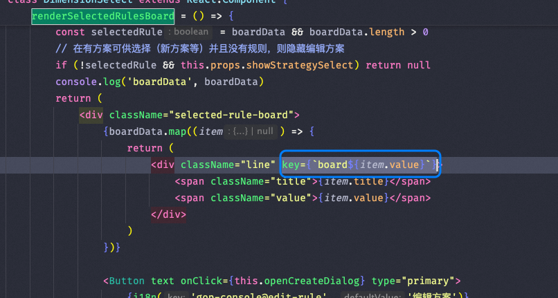

以下是关于 React 开发中常见问题的整理，包括案例分析、知识点总结以及代码示例。

---

## 目录
1. [低网速下快速操作导致表单重置](#低网速下快速操作导致表单重置)
2. [组件首次渲染后无法更新](#组件首次渲染后无法更新)
3. [纯函数特性](#纯函数特性)
4. [useRef 的使用](#useref-的使用)
5. [forwardRef 示例](#forwardref-示例)
6. [闭包引用问题与 useRef 解决方案](#闭包引用问题与-useref-解决方案)
7. [React 渲染死循环问题](#react-渲染死循环问题)
8. [弹窗组件无法获取全局 Store](#弹窗组件无法获取全局-store)
9. [memo 和 useMemo 的区别](#memo-和-usememo-的区别)
10. [DnDProvider 单例模式](#dndprovider-单例模式)
11. [React 闭包陷阱](#react-闭包陷阱)
12. [Tab 渲染优化](#tab-渲染优化)
13. [什么时候用 useCallback](#什么时候用-usecallback)
14. [JSX 中的 undefined 和 null](#jsx-中的-undefined-和-null)
15. [Class 组件中表单失去焦点问题](#class-组件中表单失去焦点问题)
16. [多次调用方法导致 UI 重复渲染](#多次调用方法导致-ui-重复渲染)
17. [React 源码学习资源](#react-源码学习资源)
18. [React 任务调度与队列](#react-任务调度与队列)
19. [错误捕获](#错误捕获)

---

## 低网速下快速操作导致表单重置

### 案例描述
在低网速环境下，用户快速操作时，全局 Store 的变化（如右侧全局消息弹窗）可能会触发 `willReceiveProps` 方法，导致表单被重置（用户填写的内容丢失）。

### 解决方案
- 避免在 `componentWillReceiveProps` 或 `useEffect` 中直接重置表单。
- 使用受控组件并确保状态同步。
- 在必要时保存用户输入的中间状态，避免因父组件重新渲染而导致数据丢失。

---

## 组件首次渲染后无法更新

### 案例描述
某些组件在首次渲染时传入空数组或其他初始值，后续传入真实数据时无法正确更新。

### 解决方案
- 确保组件的 `props` 发生变化时能够触发重新渲染。
- 使用 `key` 强制重新渲染组件：
  ```jsx
  <MyComponent key={someUniqueKey} data={data} />
  ```

---

## 纯函数特性

### 特性总结
1. **输入相同，输出一定相同**：相同的输入不会因为调用顺序或参数变化而影响其他调用的结果。
2. **引用不变时不重新渲染**：当 `props` 的引用未发生变化时，React 不会重新渲染组件。

---

## useRef 的使用

### 注意事项
- `ref.current` 是一个普通 JavaScript 对象，与外部隔离，不会触发组件重新渲染。
- **不要在渲染期间读取或写入 `ref`**：
  ```js
  // 错误示例
  function MyComponent() {
    myRef.current = 123;
    return <h1>{myRef.current}</h1>;
  }
  ```

---

## forwardRef 示例

```js
const MyInput = forwardRef((props, ref) => {
  return <input {...props} ref={ref} />;
});

const App = () => {
  const inputRef = useRef(null);
  return <MyInput ref={inputRef} />;
};
```

---

## 闭包引用问题与 useRef 解决方案

### 案例描述
在弹窗的 `onOk` 方法中无法获取到最新的状态值。

### 解决方案
通过 `useRef` 解决闭包引用问题：
```js
const latestValueRef = useRef();
latestValueRef.current = value;

const handleOk = () => {
  console.log(latestValueRef.current); // 获取最新值
};
```

---

## React 渲染死循环问题

### 案例描述
某个操作导致组件反复渲染，最终 DOM 节点被删除。

### 解决方案
- 检查 `setState` 是否在条件语句中被调用。
- 避免在 `useEffect` 中直接修改依赖项。

---

## 弹窗组件无法获取全局 Store

### 案例描述
通过 `Dialog.confirm` 渲染的组件无法使用 `store.useModel('user')`。

### 根因分析
弹窗组件没有注入 `Provider` 上下文。

### 解决方案
确保弹窗组件包裹在 `Provider` 内：
```jsx
onClick: () => {
  Dialog.confirm({
    content: (
      <Provider>
        <CustomeComponent />
      </Provider>
    ),
  });
};
```

---

## memo 和 useMemo 的区别

### 区别总结
- **useMemo**：记忆化一个值，仅在依赖项变化时重新计算。
- **React.memo**：控制组件是否重新渲染，仅在 `props` 变化时执行。

### 示例代码
```js
const CustomInput = React.memo(
  (props) => {
    console.log("rerender", props.name);
    return <Input {...props} />;
  },
  (prevProps, nextProps) => prevProps.value === nextProps.value
);

const CacheInput = (props) => {
  return <CustomInput {...props} />;
};
```

---

## DnDProvider 单例模式

```js
import { DragDropContext } from 'react-dnd';
import HTML5Backend from 'react-dnd-html5-backend';

export const MyDndProvider = DragDropContext(HTML5Backend)(({ children }) => {
  return children;
});
```

---

## React 闭包陷阱

### 建议
使用 `setState(list => list)` 函数的方式访问 `list`，而不是直接通过闭包方式访问。

---

## Tab 渲染优化

### 优化策略
1. 仅在切换 Tab 时更新组件，而非每次输入都更新。
2. 使用 `unmountInactiveTabs` 或条件判断避免昂贵组件的多次渲染。

---

## 什么时候用 useCallback

### 使用场景
- 当回调函数被传递给子组件且子组件使用了 `React.memo`。
- 当回调函数作为 `useEffect` 或 `useMemo` 的依赖项。

---

## JSX 中的 undefined 和 null

- **undefined**：会导致 JSX 报错。
- **null**：可以正常渲染为空内容。

---

## Class 组件中表单失去焦点问题

### 根因分析
每次渲染时重新生成函数，导致组件重新渲染。

### 解决方案
将函数定义为类成员方法，避免每次渲染时重新生成。

---

## 多次调用方法导致 UI 重复渲染

### 案例描述
多次调用同一方法导致 UI 出现多个相同内容。


### 解决方案
检查方法调用逻辑，确保方法只被调用一次。

---

## React 源码学习资源

- [React 官方文档](https://reactjs.org/)
- [Kasong 的 React 源码解析](https://react.iamkasong.com/preparation/jsx.html)

---

## React 任务调度与队列

React 18 引入了新的任务调度机制，支持并发渲染和优先级管理。

## 错误捕获

```text
error-boundary实现组件级别的错误捕获
```

