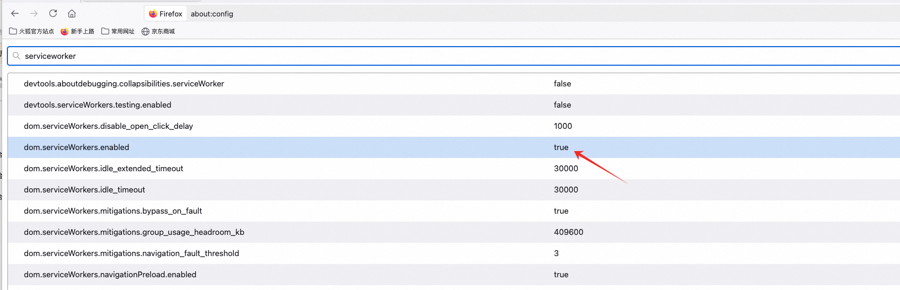

## Table of Contents
- [Table of Contents](#table-of-contents)
- [Cache Types](#cache-types)
  - [PreCache](#precache)
  - [RuntimeCache](#runtimecache)
  - [When does the service worker update sw.js](#when-does-the-service-worker-update-swjs)
  - [A service worker has two parts](#a-service-worker-has-two-parts)
- [Caching Strategies](#caching-strategies)
  - [Cache Only](#cache-only)
  - [Network Only](#network-only)
  - [Cache First](#cache-first)
  - [Network First](#network-first)
  - [Stale While Revalidate](#stale-while-revalidate)
- [Debugging](#debugging)
- [Practical Usage](#practical-usage)
  - [Choosing a Caching Strategy for HTML](#choosing-a-caching-strategy-for-html)
  - [Service Worker Update Mechanism](#service-worker-update-mechanism)
  - [Activation Mechanism](#activation-mechanism)
  - [from service worker](#from-service-worker)
  - [Copying Data from the Cache](#copying-data-from-the-cache)
  - [Excluding 302 from LCP Data](#excluding-302-from-lcp-data)
  - [clients.claim()](#clientsclaim)
- [Edge Cases](#edge-cases)
  - [Verifying if it's the current domain](#verifying-if-its-the-current-domain)
  - [Version Rollback](#version-rollback)
  - [Disabling the Service Worker Switch](#disabling-the-service-worker-switch)
  - [Switching Languages or Accounts](#switching-languages-or-accounts)
  - [Multi-tab Scenarios](#multi-tab-scenarios)
  - [302 Redirect Issues](#302-redirect-issues)
  - [Data Consistency Issues](#data-consistency-issues)
- [Tracking/Analytics Issues](#trackinganalytics-issues)
- [Experimentation Issues](#experimentation-issues)
- [Error Case Analysis](#error-case-analysis)
- [Actual Data Storage Location](#actual-data-storage-location)
- [Data Monitoring](#data-monitoring)
- [More Resources](#more-resources)
- [Funnel Analysis](#funnel-analysis)
- [Debugging Service Worker in Firefox](#debugging-service-worker-in-firefox)
  - [3.1 Open the Service Worker Debugging Page](#31-open-the-service-worker-debugging-page)
  - [3.2 Inspect and Set Breakpoints](#32-inspect-and-set-breakpoints)
  - [Disable service-worker](#disable-service-worker)
- [service worker user agent never changes](#service-worker-user-agent-never-changes)
- [Registering sw.js](#registering-swjs)
---
## Cache Types
### PreCache
Caches are read during the Service Worker's `installing` phase. Developers can determine the time and length of the cached files. Resources are returned to the user when offline.
Example code:
```js
workbox.precaching.precacheAndRoute([
  './a.css'
]);
```
The code above will save the `a.css` file information into IndexedDB.
### RuntimeCache
Operations performed during the `activated` and `fetch` phases after the Service Worker's `install` is complete. Caching strategies can be defined for different resources.
### When does the service worker update sw.js
According to the [official documentation](https://developer.chrome.com/docs/workbox/remove-buggy-service-workers): the browser will compare the content of sw.js, and if there is a difference, it will update sw.js

### A service worker has two parts
1. The page, called the client. 2. The service worker container. These two communicate through a `message` channel.
Code for the container to send a message:
```js
class SwMessage {
  // Service Worker sends a message to the page
  async postMessageFromSW(options: { type: MESSAGE_TYPE; data?: any }, clientId?: string) {
    try {
      const clients = (self as unknown as ServiceWorkerGlobalScope).clients;
      if (!clients) {
        return;
      }
      let channelClient;
      // Update only the current one
      if (clientId) {
        channelClient = await clients.get(clientId);
        if (!channelClient) {
          console.error(`[SW] channelClient is null, clientId: `, clientId);
          sendEventLog({
            p1: '',
            p2: 'channelClient is null',
          });
        }
        channelClient?.postMessage({
          ...options,
        });
        return;
      }
      // Broadcast
      const allClients = await clients.matchAll();
      if (!allClients.length) {
        return;
      }
      allClients.forEach((client) => {
        if (!client) return;
        client.postMessage({
          ...options,
        });
      });
    } catch (error: any) {
      sendEventLog({
        p1: '',
        p2: error.message,
      });
    }
  }
}
```
When sending a message, use `event.resultingClientId` instead of `event.clientId`, because the page might have a navigation refresh, making the client impossible to find.
---
## Caching Strategies
### Cache Only
Directly uses the cached result. Suitable for resources that do not change after deployment, such as third-party JS libraries.
### Network Only
Forces the use of network requests. Suitable for resources that require high real-time availability.
### Cache First
When a request is matched, it first tries to get the result from the cache. If there is no result in the cache, it makes a network request and updates the cache with the result.
**Use Case:** For requests where the result does not change often and real-time requirements are not high, such as images.
### Network First
Prioritizes network requests and writes the result to the cache. If the request fails, it will fall back to the cached result.
**Use Case:** For requests where the returned result is not fixed or has high real-time requirements.
### Stale While Revalidate
When there is a corresponding cached result, it is returned directly, while a network request is initiated in the background to update the cache.
**Advantages:** Improves user experience.
**Disadvantages:** Network requests will consume user bandwidth.
---
## Debugging
1. Clear site Cookies.

2. Proxy the JS resources and `.map` resources called by `importScript` in the `sw.js` request.
3. The first page refresh is the `install` step and will not trigger runtime plugin calls. A second refresh is needed for it to take effect.
---
## Practical Usage
### Choosing a Caching Strategy for HTML
If the `Cache First` strategy is used for HTML, after a new version is released, users will still read the cached HTML, causing the new version not to take effect immediately. Similarly, a rollback will not take effect immediately either.
**Solution:**
Adopt the `Stale While Revalidate` strategy and simultaneously compare the HTML version information. If the versions are inconsistent, force a page refresh.
### Service Worker Update Mechanism
After updating the JS resources called by `importScript`, the changes will not take effect immediately. You need to manually click `skipWaiting` or close and reopen the tab to activate the new Service Worker.
### Activation Mechanism
The first time, the SW is installed. The second time, it will be activated and go through the service-worker, but it won't use the cache (the phenomenon is that the network panel shows 'from service worker', but the cache is not hit). The cache will only be hit on the third time.
**The service's sw.js is registered in the root directory. For example, for xx.baidu.com and yy.baidu.com, the service worker for different domains will go through this installation and activation process.**
### from service worker
When the browser's network panel shows `from service worker`, there are two possibilities: 1. The request was intercepted by the service worker. 2. The response was handled by the service worker.
### Copying Data from the Cache
```js
caches.open('pc-home-html-cache-v1').then(async cache => {
    const responses = await cache.matchAll();
    const allContent = [];
    for (const response of responses) {
        const bodyText = await response.text();
        allContent.push(`URL: ${response.url}\nContent:\n${bodyText}`);
    }
    const combinedContent = allContent.join('\n\n---\n\n');
    // Create a Blob object
    const blob = new Blob([combinedContent], { type: 'text/plain' });
    // Create a download link
    const url = URL.createObjectURL(blob);
    const a = document.createElement('a');
    a.href = url;
    a.download = 'cache-content.txt'; // file name
    a.click();
    // Release the object URL
    URL.revokeObjectURL(url);
});
```
### Excluding 302 from LCP Data
`navigation.redirectCount` cannot count cross-origin redirects. It can only be done through:
```js
let timing = performance.getEntriesByType('navigation')[0]
// fetchStart counts the preceding 302 event. If the request goes to the service worker cache, this fetchStart time will be consumed.
```
By looking at the `duration` of the browser request, you can roughly know the time consumed by a 302 redirect request's `fetchStart`:

The server can count the number of 302 redirects, or it can be done through a headless browser, which has no cross-origin restrictions.
Normally, without a 302, the fetchStart time will be very short, around 20ms.
### clients.claim()
After a service worker is activated, it does not immediately intercept requests. `clients.claim()` is needed for it to start taking over requests. However, if only HTML is cached, immediate takeover is generally not necessary, unless there are other asynchronous resource requests.
---
## Edge Cases
### Verifying if it's the current domain
Only URLs that match the preceding matcher will enter the service worker's Workbox plugin logic. At the same time, when deciding whether to use the cache, it is also necessary to determine if the domain is hit.
It's not just about checking the URL, but also the cookie. Because if the URL matches, but due to the cookie (e.g., a special user), the server will actually perform a 302 redirect, making it unnecessary to use the cache.
### Version Rollback
When a Service Worker version is rolled back, how should the cache clearing be handled?
### Disabling the Service Worker Switch
Solution 1: The HTML delivers a global configuration, and this configuration is used to control whether to activate the service worker.
Solution 2: Control the registration and installation of the service worker through the entry JS at a.com/sw.js. The advantage of this is that it can prevent the installation of a faulty service worker, which could cause the page to fail.
### Switching Languages or Accounts
- **Switching Language:** The domain will change, and the cache will update automatically.
- **Switching Account:** The layout structure may change. It is recommended to cache two keys (IDs): one for logged-in and one for logged-out states.
### Multi-tab Scenarios
State needs to be synchronized between multiple tabs via a broadcast mechanism. **Usually, only the current tab needs to be updated, because the page structure is different for logged-in and logged-out states.**
### 302 Redirect Issues
- One tab visits `es.xx.com`, and another tab visits `www.xx.com`. It might automatically redirect to `es.xx.com` based on the country information in the cookie.
- If `ko.xx.com` is specifically visited, a 302 redirect will not occur.
Generally, the language follows the domain. In the same country, different languages have different domains. If a 302 is hit, the cache needs to be deleted, and the current page must be refreshed.
### Data Consistency Issues
1. **Rollbacks need to take effect immediately:** Configuration switch: Generally, the configuration is delivered with the HTML structure.
2. **Data and JS inconsistency:** When a deployment occurs, ensure the JS is the latest. Old UI + new data; New UI + old data.
   - In CSR (Client-Side Rendering) scenarios, there might be an issue where incremental data is not consumed.
   - In SSR (Server-Side Rendering) scenarios, on the initial load, the JS might be behind the data, causing style corruption.
3. **Canary release:** Users might jump between different versions.
4. **JS version and HTML rendered data are inconsistent:** Leads to style corruption. Solution: Follow the canary release.
---
## Tracking/Analytics Issues
1. Impression errors
2. PV data depends on the API response (e.g., `utabtest`), which can affect experiment results.
---
## Experimentation Issues
1. Layout experiments are obtained through the Aochuang interface.
2. Global experiments are based on the `ca` device ID in the cookie.
---
## Error Case Analysis
**Error Message:**
```js
sw.js?version=0.0.62:6 Uncaught NetworkError: Failed to execute 'importScripts' on 'WorkerGlobalScope': The script at 'xxx/0.0.62/pc.js' failed to load.
    at init (sw.js?version=0.0.62:6:20)
    at sw.js?version=0.0.62:10:1
```
**Cause Analysis:**
The Service Worker failed to initialize because the JS file loaded by `importScripts` had an error.
---
## Actual Data Storage Location

## Data Monitoring
When analyzing the LCP effect, we need to create a funnel: PV (excluding 302s) -> SW interception (must remove 302s) -> cache hit. Observe the data changes, pay attention to the sample size. If the sample size is small (due to low PV), the cache hit rate might be low, which is not critical.
Determine if the cache was hit by adding a global **tracking** flag to the logs.
Add a flag to the cached HTML to make it easier for JS code to determine if the cache was hit, for example, for message listeners or secondary checks for impression tracking. Based on whether the current HTML page is a cached page, if it is cached, the SW process will add a flag to the HTML file.
Observe business metrics:
For example, compare API call volume year-over-year, page view volume year-over-year, and core module render volume year-over-year.
If the trend is not obvious, you can analyze it on a weekly or monthly basis.
---
## More Resources
`https://web.dev/articles/service-worker-lifecycle`
## Funnel Analysis
The upper and lower parts of the funnel must not have overlapping sections, otherwise, it will be impossible to identify the problem. The priority focus should be at the front of the funnel.
---
## Debugging Service Worker in Firefox
- **Problem Description**: Firefox does not directly show the request for `sw.js`, even if the file is actually loaded.
- **Solution**: The request for `sw.js` can be captured using a packet sniffing tool. Additionally, Firefox provides built-in debugging tools that make it convenient to debug the Service Worker.
During debugging, packet sniffing tools (like Fiddler, Charles, or the browser's built-in developer tools) can help us:
- Confirm if `sw.js` was loaded correctly.
- View detailed request information (like URL, response headers, status code, etc.).
- Analyze potential network or caching issues.
Although packet sniffing tools are very useful, for more efficient Service Worker debugging, it is recommended to use them in combination with Firefox's built-in debugging features.
### 3.1 Open the Service Worker Debugging Page
1. Enter the following address in the Firefox address bar to open the Service Worker debugging page:
   ```
   about:debugging#/runtime/this-firefox
   ```
   - This page lists all registered Service Workers in the current browser.
2. Find the target Service Worker and click the **Inspect** button on the right:
   
   - After clicking, a separate debugging window will open for debugging that Service Worker.
### 3.2 Inspect and Set Breakpoints
1. In the debugging window, switch to the **Debugger** panel:
   
2. Find the location in the code you need to debug and click the line number to set a breakpoint.
3. Refresh the page or trigger the relevant action and observe if the breakpoint is hit.
4. Use the features provided by the debugging tools (like step-by-step execution, viewing variable values, etc.) for in-depth analysis.
### Disable service-worker

---
## service worker user agent never changes
The user agent always remains the same as when the browser was first opened. If you switch to mobile responsive debugging, the user agent inside the service worker will not change to the mobile one. This is because the service worker is effective globally, not just for a single browser tab. This makes it impossible to confirm whether the user agent is for the current mobile simulation or the non-simulated state.
[Reference](https://github.com/GoogleChrome/workbox/issues/2314)
---
## Registering sw.js
There are two ways: one is through Nginx configuration, returning the pwaConfig content; the other is through a controller request.
```js
@GetMapping(value = "/apps/pwa/sw.js")
public void swjs(HttpServletRequest request, HttpServletResponse response) {
    try {
        response.addHeader("service-worker-allowed", "/");
        response.setContentType("application/javascript");
        response.setCharacterEncoding("utf-8");
        PrintWriter writer = response.getWriter();
        writer.write(pwaConfig.getSwJsConfig());
        writer.flush();
    } catch (IOException e) {
        log.error("request swjs error: ", e);
    }
}
// pwaConfig.json mainly registers the service worker script via importScripts
importScripts(".../plugin-dada.js");
importScripts(".../pwa/0.0.13/service.js");
var app = new INSInstance({
 plugins: [new XXXPlugin()],
}).init();
```
