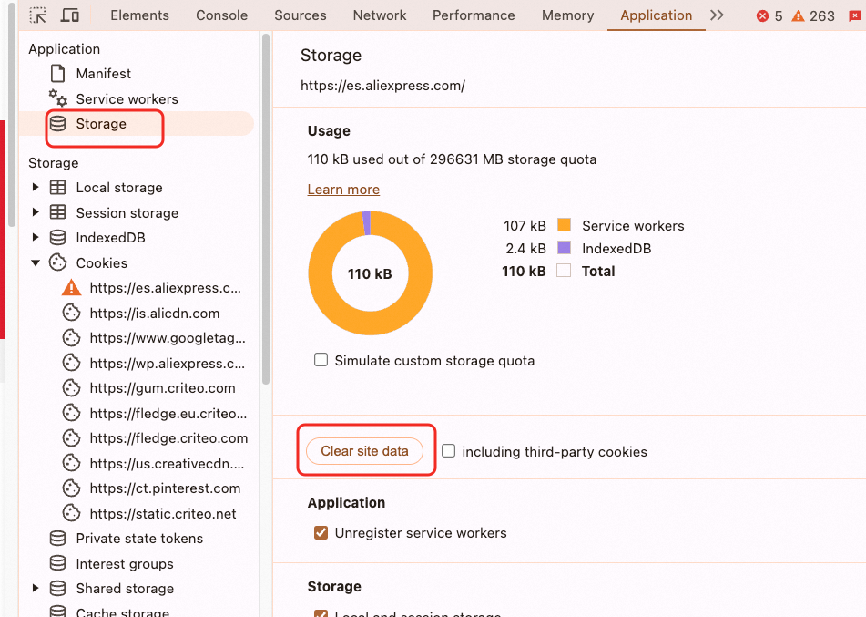

## 目录
1. [缓存的类型](#缓存的类型)
   - [PreCache](#precache)
   - [RuntimeCache](#runtimecache)
2. [缓存策略](#缓存策略)
   - [Cache Only](#cache-only)
   - [Network Only](#network-only)
   - [Cache First](#cache-first)
   - [Network First](#network-first)
   - [Stale While Revalidate](#stale-while-revalidate)
3. [调试方法](#调试)
4. [实际使用中的问题与解决方案](#实际使用)
   - [HTML 缓存策略的选择](#html-缓存策略的选择)
   - [Service Worker 更新机制](#service-worker-更新机制)
5. [边界 Case 分析](#边界-case)
   - [版本回退](#版本回退)
   - [Service Worker 开关关闭](#service-worker-开关关闭)
   - [切换语言或账号](#切换语言或账号)
   - [多标签页场景](#多标签页场景)
   - [302 重定向问题](#302-重定向问题)
   - [数据一致性问题](#数据一致性问题)
6. [埋点问题](#埋点问题)
7. [实验问题](#实验问题)
8. [错误案例分析](#错误案例分析)
9. [真实存储数据的位置](#真实存储数据的位置)

---

## 缓存的类型

### PreCache
在 Service Worker 的 `installing` 阶段读取缓存，开发者可以确定缓存文件的时间和长度。离线情况下返回给用户资源。

示例代码：
```js
workbox.precaching.precacheAndRoute([
  './a.css'
]);
```
上述代码会将 `a.css` 文件信息保存到 IndexedDB 中。

### RuntimeCache
在 Service Worker 的 `install` 完成后，`activated` 和 `fetch` 阶段进行的操作。可以根据不同资源制定缓存策略。

### serviceworker什么时候更新sw.js

根据[官方文档](https://developer.chrome.com/docs/workbox/remove-buggy-service-workers)的说法：浏览器会对比sw.js的内容，如果有差异会更新sw.js


### serviceworker有两个部分
1个是页面，称之为client 2个是serviceworker容器 这两者通过`message`通道通信

容器发送消息代码：
```js
class SwMessage {
  // Service Worker 发送消息到页面
  async postMessageFromSW(options: { type: MESSAGE_TYPE; data?: any }, clientId?: string) {
    try {
      const clients = (self as unknown as ServiceWorkerGlobalScope).clients;
      if (!clients) {
        return;
      }

      let channelClient;
      // 只更新当前
      if (clientId) {
        channelClient = await clients.get(clientId);
        if (!channelClient) {
          console.error(`[SW] channelClient is null, clientId: `, clientId);
          sendEventLog({
            p1: '',
            p2: 'channelClient is null',
          });
        }
        channelClient?.postMessage({
          ...options,
        });
        return;
      }
      // 广播
      const allClients = await clients.matchAll();
      if (!allClients.length) {
        return;
      }
      allClients.forEach((client) => {
        if (!client) return;
        client.postMessage({
          ...options,
        });
      });
    } catch (error: any) {
      sendEventLog({
        p1: '',
        p2: error.message,
      });
    }
  }
}

```

发送消息的时候要用`event.resultingClientId`而不是`event.clientId`，因为页面可能刷新Navigation，导致无法找到client

---

## 缓存策略

### Cache Only
直接使用缓存的结果，适合上线后不会变动的资源，例如第三方 JS 库。

### Network Only
强制使用网络请求，适合实时性要求高的资源。

### Cache First
当匹配到请求时，优先从缓存中取得结果。如果缓存中没有结果，则走网络请求，并将结果更新到缓存中。  
**适用场景：** 结果不常变动且对实时性要求不高的请求，例如图片。

### Network First
优先走网络请求，并将结果写入缓存。如果请求失败，则会使用缓存结果兜底。  
**适用场景：** 返回结果不太固定或对实时性要求较高的请求。

### Stale While Revalidate
当有对应的缓存结果时，直接返回缓存结果，同时在后台发起网络请求更新缓存。  
**优点：** 提高用户体验。  
**缺点：** 网络请求会占用用户带宽。

---

## 调试

1. 清空站点 Cookie。

2. 代理 `sw.js` 请求中的 `importScript` 调用的 JS 资源和 `.map` 资源。
3. 首次刷新页面是 `install` 环节，不会进入运行时插件调用，需要二次刷新才能生效。

---

## 实际使用

### HTML 缓存策略的选择
如果对 HTML 使用 `Cache First` 缓存策略，在发布迭代后，用户仍然会读取缓存的 HTML，导致新版本不会立即生效。同样，回滚也不会立即生效。

**解决方案：**  
采用 `Stale While Revalidate` 策略，同时对比 HTML 的版本信息。如果版本不一致，强制刷新页面。

### Service Worker 更新机制
更新了 `importScript` 调用的 JS 资源后，不会立即生效。需要手动点击 `skipWaiting` 或关闭标签页重新打开以激活新的 Service Worker。

### 激活机制
第一次sw安装，第二次会激活走service-worker但是不走会走缓存（现象是network面板显示from serviceworker，但是没有命中缓存），第三次才会命中缓存。
**service的sw.js是注册在根目录的，比如xx.baidu.com, yy.baidu.com, 不同的域名servicewworker都会走这个安装激活流程**

### from service worker
当浏览器的network显示`from service worker`，有三种可能： 1 请求被serviceworker拦截 2 响应由serviceworker处理

### 复制缓存里的数据
```js
caches.open('pc-home-html-cache-v1').then(async cache => {
    const responses = await cache.matchAll();
    const allContent = [];

    for (const response of responses) {
        const bodyText = await response.text();
        allContent.push(`URL: ${response.url}\nContent:\n${bodyText}`);
    }

    const combinedContent = allContent.join('\n\n---\n\n');

    // 创建一个 Blob 对象
    const blob = new Blob([combinedContent], { type: 'text/plain' });

    // 创建一个下载链接
    const url = URL.createObjectURL(blob);
    const a = document.createElement('a');
    a.href = url;
    a.download = 'cache-content.txt'; // 文件名
    a.click();

    // 释放对象 URL
    URL.revokeObjectURL(url);
});
```

### LCP数据排除302
`navigation.redirectCount`无法统计跨域请求的重定向次数，只能通过：
```js
let timing = performance.getEntriesByType('navigation')[0]
// fetchStart统计前置302的事件。如果走到了serviceworker的缓存，这一次的fetchStart时间会被吃掉
```
看浏览器请求的`duration`可以大致知道一个302中转请求`fetchStart`耗时：


服务端可以统计到302重定向次数或者通过无头浏览器，没有跨域限制。

一般没有302的话，fetchStart的时间会很短 20ms 左右

### clients.claim()
serverworker激活后不会立即拦截请求，需要`clients.claim()`才会开始接管请求，但是如果只缓存html，一般不需要立即接管。除非是有其他异步资源请求。

---

## 边界 Case

### 校验是否是当前场域
前置matcher的url才会进入serviceworker的workbox插件逻辑，同时在判断是否要使用缓存时也要判断场域是否命中。
不仅是判断url，还要判断cookie，因为如果url匹配了，但是因为cookie(是特殊用户）的原因，实际服务端会302跳转的，用缓存没必要。

### 版本回退
当 Service Worker 版本回退时，如何处理缓存清空的问题？

### Service Worker 开关关闭
方案1: html下发全局配置，然后根据这个配置去控制是否激活serviceworker。
方案2: 通过a.com/sw.js 这个入口js去控制serviceworker的注册和安装，这样的好处是可以避免安装错误的serviceworker导致页面白调


### 切换语言或账号
- **切换语言：** 域名会变化，缓存自动更新。
- **切换账号：** 楼层结构可能发生变化，建议缓存两个 Key（ID）， 登陆和非登陆。

### 多标签页场景
多个标签页之间需要通过广播机制同步状态。**一般只需要更新当前标签页，因为登陆态和非登陆态页面结构不一样**

### 302 重定向问题
- 一个标签页访问 `es.xx.com`，另一个标签页访问 `www.xx.com`，可能会根据 Cookie 的国家信息自动跳转到 `es.xx.com`。
- 如果指定访问 `ko.xx.com`，则不会发生 302 重定向。
一般语言是跟着域名走的，同一个国家语言不同域名也不同。如果命中302，需要删除缓存，并且刷新当前页面。

### 数据一致性问题
1. **回滚需要立即生效：** 配置开关：一般配置是跟着html结构下发
2. **数据和 JS 不一致：** 当有发布动作时，确保 JS 是最新的。旧UI+新数据；新UI+旧数据
   - CSR（客户端渲染）场景下，可能存在增量数据未被消费的问题。
   - SSR（服务端渲染）场景下，首次加载时 JS 可能落后于数据，导致样式错乱。
3. **机器灰度：** 用户可能横跳不同的版本。
4. **JS 版本和 HTML 渲染数据不一致：** 导致样式错乱。解决办法：跟随机器灰度。

---

## 埋点问题

1. 曝光错误
2. PV 数据依赖接口的返回（如 `utabtest`），这可能会影响实验效果。

---

## 实验问题

1. 楼层实验通过奥创接口获取。
2. 全局实验基于 Cookie 上的 `ca` 设备 ID。

---

## 错误案例分析

**错误信息：**
```js
sw.js?version=0.0.62:6 Uncaught NetworkError: Failed to execute 'importScripts' on 'WorkerGlobalScope': The script at 'xxx/0.0.62/pc.js' failed to load.
    at init (sw.js?version=0.0.62:6:20)
    at sw.js?version=0.0.62:10:1
```

**原因分析：**  
由于 `importScripts` 加载的 JS 文件报错，导致 Service Worker 初始化失败。

---

## 真实存储数据的位置


## 数据监控

我们在分析LCP效果的时候，需要把pv（不包含302）->sw拦截(要去掉302）->命中缓存的漏斗做出来。 观察数据的变化，注意样本量，如果样本量较少（因为pv访问少）可能缓存命中率会低，这个无关紧要。

通过给日志加一个全局**染色**标，来判断是否命中缓存。

给缓存html加标记，方便js代码执行判断是否命中缓存，比如消息监听、 曝光埋点二次判断。根据当前html页面是否是缓存的页面，是缓存进去的话，sw进程会在html文件加标记位。

观察业务指标：
比如接口调用量同比对比，页面访问量同比对比，核心模块渲染量同比对比

趋势不明显的话，可以按周维度或者月维度。

---

## 更多资料

`https://web.dev/articles/service-worker-lifecycle`

## 漏斗分析

上下的漏斗不能有重复的部分，否则无法看出问题。优先关注的在漏斗前面。


---


## 在使用 Firefox 浏览器调试 Service Worker


- **问题描述**：Firefox 不会直接显示 `sw.js` 的请求，即使该文件确实被加载。
- **解决方案**：通过抓包工具可以捕获到 `sw.js` 的请求。此外，Firefox 提供了内置的调试工具，可以方便地对 Service Worker 进行调试。


在调试过程中，抓包工具（如 Fiddler、Charles 或浏览器自带的开发者工具）可以帮助我们：

- 确认 `sw.js` 是否被正确加载。
- 查看请求的详细信息（如 URL、响应头、状态码等）。
- 分析可能的网络问题或缓存问题。

尽管抓包工具非常有用，但为了更高效地调试 Service Worker，建议结合 Firefox 的内置调试功能。

### 3.1 打开 Service Worker 调试页面

1. 在 Firefox 地址栏中输入以下地址，打开 Service Worker 调试页面：
   ```
   about:debugging#/runtime/this-firefox
   ```
   - 该页面列出了当前浏览器中所有已注册的 Service Worker。

2. 找到目标 Service Worker，点击右侧的 **检查** 按钮：
   

   - 点击后会打开一个独立的调试窗口，用于调试该 Service Worker。

### 3.2 检查并设置断点

1. 在调试窗口中，切换到 **调试器** 面板：
   

2. 在代码中找到需要调试的位置，点击行号设置断点。

3. 刷新页面或触发相关操作，观察断点是否被命中。

4. 使用调试工具提供的功能（如单步执行、查看变量值等）进行深入分析。


### 关闭service-worker

