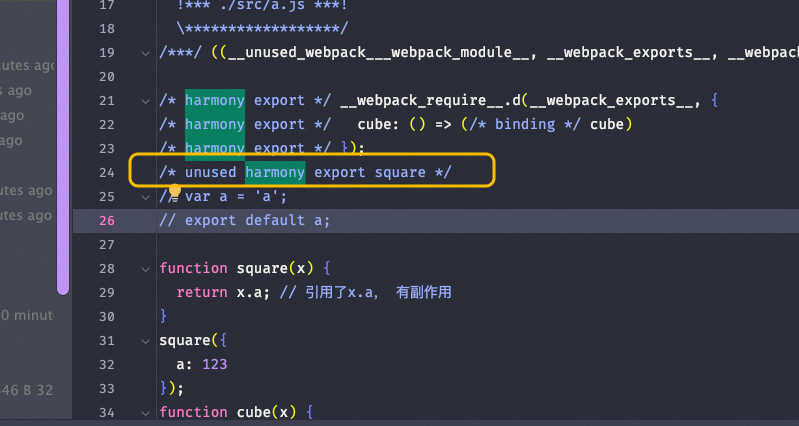

## 目录
1. [usedExports](#usedexports)
2. [ /*#__PURE__*/ 注释](#pure-注释)
3. [TerserWebpackPlugin](#terserwebpackplugin)
4. [UglifyJsWebpackPlugin](#uglifyjswebpackplugin)
5. [mainFields 配置](#mainfields-配置)
6. [Webpack 支持 mjs 文件](#webpack-支持-mjs-文件)
7. [构建类型与模块系统](#构建类型与模块系统)
8. [Tree-shaking 详解](#tree-shaking-详解)
   - [静态结构](#静态结构)
   - [无条件执行](#无条件执行)
   - [无副作用导入](#无副作用导入)
9. [sideEffects 配置](#sideeffects-配置)
10. [output 配置](#output-配置)
11. [常见错误](#常见错误)

---

## usedExports

`usedExports` 是 Webpack 中用于标记未使用代码的配置项。它是 Tree-shaking 的基础，仅针对 ES 模块规范（ESM）。早期由 Rollup 引入。

```javascript
optimization: {
  usedExports: true, // 标记哪些代码没有被使用
},
```


---

## `/*#__PURE__*/` 注释

`/*#__PURE__*/` 是一种显式声明，用于告诉工具某些函数调用没有副作用。在某些场景下，比如变量赋值，可能会导致一些副作用。

### 什么是副作用？
1. 函数参数被修改。
2. 调用有副作用的函数：如发起请求、控制台打印、读写文件等。
3. 数据库修改或网络状态改变。
4. 抛出异常。
5. 修改全局变量、静态变量或类成员变量。

#### 示例代码

```javascript
// maths.js
export function square(x) {
	return x.a; // 引用了 x.a，有副作用
}
/*#__PURE__*/square({ a: 123 });

export function cube(x) {
	return x * x * x;
}

// main.js
import { cube } from './maths.js';
console.log(cube(5));
```

---

## TerserWebpackPlugin

[TerserWebpackPlugin](https://github.com/webpack-contrib/terser-webpack-plugin) 是一个用于压缩和分析无效代码的插件。它会结合 `usedExports` 删除未使用的代码。

---

## UglifyJsWebpackPlugin

[UglifyJsWebpackPlugin](https://github.com/webpack-contrib/uglifyjs-webpack-plugin) 是另一个压缩代码的插件，但其封装了一个立即执行函数，可能引用外部变量，从而导致 Tree-shaking 失效。

#### 开发 JS 库时的建议
- 使用 Rollup 打包，支持 ES6 模块导出和程序流分析（判断哪些代码有副作用）。
- 尽量将组件打包成单独的目录，方便他人引用。
- 或者开发插件实现按需加载。

---

## mainFields 配置

`mainFields` 用于控制解析入口文件的优先级。

```json
{
	resolve: { 
		mainFields: ['browser', 'module', 'main'], // 可以调整字段的优先级 
	},
}
```

#### 插件推荐
- `NormalModuleReplacementPlugin`: 替换资源。

---

## Webpack 支持 mjs 文件

为了让 Webpack 支持 `.mjs` 文件，可以进行以下配置：
1. 确保 Webpack 版本为 4 或更高。
2. 在 `resolve.extensions` 中添加 `.mjs`。
3. 设置 `type: "module"`。

---

## 构建类型与模块系统

Webpack 支持多种模块系统，统称为 UMD（Universal Module Definition）：
- **var/window**: 全局变量方式。
- **AMD/CommonJS/CommonJS2/root**: 不同模块化标准。
  - **CommonJS2** 和 **CommonJS** 的区别在于 `module.exports` 和 `exports`。

---

## Tree-shaking 详解

Tree-shaking 是一种通过静态分析移除未使用代码的优化技术。生产环境默认启用，但在某些情况下需要额外配置才能达到最佳效果。

### 静态结构

ES6 模块的 `import` 和 `export` 语法在代码加载之前就已经确定。所有导入和导出的模块依赖关系在代码解析阶段就可以完全明确下来，这与 CommonJS 模块系统不同，后者可以包含动态依赖（例如，`require` 可以在函数内部调用）。

### 无条件执行

在 ES6 模块中，`import` 和 `export` 语句必须在模块的顶层作用域中。因此，导入的模块在模块初始化时就会被解析，而不是在代码运行过程中。这意味着模块的加载顺序和依赖关系是固定的。

### 无副作用导入

ES6 模块默认不允许根据运行时条件动态导入模块。这种限制排除了许多复杂的情况，使得工具可以更轻松地进行代码分析。

---

## sideEffects 配置

`sideEffects` 是 `package.json` 中的一个字段，用于声明模块是否有副作用。

- 如果配置为 `false`，则表示该模块没有副作用，Webpack 会更激进地移除未使用的代码。
- 如果未配置或配置不当，可能会影响 Tree-shaking 的效果。

#### 示例

```json
{
  "sideEffects": false
}
```

#### 注意事项
- SSR 场景中，动态搭建场无法配置 `sideEffects: false`，因为这样可能导致部分代码丢失。

---

## output 配置

`output` 用于指定输出目录和文件名。

```javascript
output: {
  path: __dirname + '/dist',
  filename: 'bundle.js',
},
```

---

## 常见错误

#### 错误信息
```
ERR! The 'compilation' argument must be an instance of Compilation 348 TypeError: The 'compilation' argument must be an instance of Compilation
```

#### 解决方案
- Webpack 版本不兼容，建议降级到 Webpack 4。

---