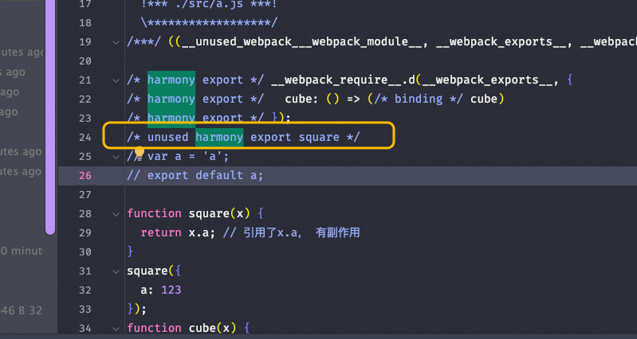

## Webpack-Chain 与 Chunk 分包详解

[Webpack-Chain](https://github.com/neutrinojs/webpack-chain) 是一个链式 API 工具，用于更优雅地操作 Webpack 配置。相比于直接修改 Webpack 配置对象，Webpack-Chain 提供了更直观、可读性更高的方式。

### `config.target('node')`

`config.target('node')` 用于指定最终编译后的产物运行在 Node.js 环境中。这在开发服务端渲染（SSR）或构建工具时非常有用。

#### 示例代码

```javascript
const Config = require('webpack-chain');

const config = new Config();

// 指定目标环境为 Node.js
config.target('node');

// 输出配置
console.log(config.toString());
```

#### 使用场景
- 构建 SSR 应用。
- 开发 CLI 工具或 Node.js 脚本。
- 在服务端环境中使用 Webpack 打包的代码。

## Webpack Chunk 分包机制

Webpack 的分包机制是其核心功能之一，能够有效优化资源加载和性能。

### 什么是 Chunk？

Chunk 是 Webpack 内部的一个概念，表示一组模块的集合。最终，这些 Chunk 会被打包成一个或多个文件（如 `.js` 文件）。通过合理的分包策略，可以减少初始加载时间，提升用户体验。

### Chunk 的生成规则

Webpack 根据以下规则生成 Chunk：
1. **入口文件**：每个入口文件会生成一个初始 Chunk。
2. **动态导入**：通过 `import()` 动态导入的模块会生成一个新的 Chunk。
3. **SplitChunksPlugin**：通过配置 `optimization.splitChunks`，可以将公共依赖提取到单独的 Chunk 中。

#### 示例代码

```javascript
module.exports = {
  entry: {
    main: './src/index.js',
    vendor: './src/vendor.js',
  },
  output: {
    filename: '[name].[contenthash].js',
    path: __dirname + '/dist',
  },
};
```

上述配置会生成两个初始 Chunk：`main` 和 `vendor`。

### SplitChunksPlugin 的作用

`SplitChunksPlugin` 是 Webpack 内置的一个插件，用于优化分包策略。它可以帮助提取公共依赖，避免重复打包。

#### 常见配置

```javascript
module.exports = {
  optimization: {
    splitChunks: {
      chunks: 'all', // 对同步和异步代码都进行分包
      minSize: 20000, // 最小分包大小
      maxSize: 50000, // 最大分包大小
      minChunks: 1, // 最少被引用次数
      cacheGroups: {
        vendors: {
          test: /[\\/]node_modules[\\/]/, // 提取第三方库
          priority: -10,
          name: 'vendors',
        },
        default: {
          minChunks: 2, // 至少被两个模块引用
          priority: -20,
          reuseExistingChunk: true, // 如果已存在相同的 Chunk，则复用
        },
      },
    },
  },
};
```

#### 配置解析
- `chunks: 'all'`：对同步和异步代码都进行分包。
- `minSize` 和 `maxSize`：控制分包的大小范围。
- `cacheGroups`：定义分组规则，例如提取第三方库或公共模块。

### 动态导入与分包

动态导入（`import()`）是 Webpack 实现按需加载的核心机制。每次调用 `import()` 都会生成一个新的 Chunk。

#### 示例代码

```javascript
// index.js
import('./dynamicModule').then(module => {
  module.default();
});
```

上述代码会生成一个名为 `dynamicModule.[contenthash].js` 的新 Chunk。

#### 动态导入的优点
- 按需加载：只有在需要时才会加载对应的模块。
- 减少初始加载时间：主包体积更小，加载更快。

---
## Webpack Externals


## Externals 简介

Webpack 的 `externals` 配置允许将某些模块从打包中排除，并通过外部脚本（如 CDN）加载。这种方式可以显著减少打包体积，同时支持按需加载外部依赖。

> **适用场景**：
> - 使用第三方库时，避免将其打包到最终文件中。
> - 动态加载外部资源以优化首页加载速度。

## Externals 配置示例

### 配置方式

以下是一个典型的 `externals` 配置示例：

```js
module.exports = {
  // ...
  externalsType: 'script', // 声明外部资源的加载方式为 <script>
  externals: {
    lodash: [
      'https://cdn.jsdelivr.net/npm/lodash@4.17.19/lodash.min.js', // 外部脚本 URL
      '_', // 全局变量名
    ],
  },
};
```

#### 参数说明：
- **`externalsType`**：指定外部资源的加载类型，这里使用 `'script'` 表示通过 `<script>` 标签加载。
- **`externals`**：
  - 第一个参数是外部脚本的 URL。
  - 第二个参数是全局变量名（如 `_`），用于在代码中引用该库。

### 副作用

当某个包被声明为 `externals` 后，Webpack 会将其动态加载逻辑重写为异步加载的方式。例如：

```js
import _ from 'lodash';
```

会被重写为：

```js
import('./lodash.js').then(res => {
  const _ = res.default || res;
  // 使用 lodash
});
```

> **补充说明**：
> - 这种方式确保外部依赖只在需要时加载，避免阻塞首页渲染。
> - 需要注意的是，动态加载可能会增加首次使用的延迟，因此需要权衡性能影响。

## 如何判断包是否被 externals

在 UMD 格式的打包文件中，可以通过以下特征判断某个包是否被 `externals`：

1. **检查全局变量**：
   如果在 UMD 文件头部发现类似以下代码：
   ```js
   root['packageName']
   ```
   则表明该包已被 `externals`。

2. **示例分析**：
   假设我们 externals 了 `lodash`，打包后的代码可能包含如下片段：
   ```js
   (function(root, factory) {
     if (typeof define === 'function' && define.amd) {
       define([], factory);
     } else if (typeof exports === 'object') {
       module.exports = factory();
     } else {
       root['_'] = factory(); // 将 lodash 挂载到全局变量 _
     }
   })(this, function() {
     return _; // 引用外部加载的 lodash
   });
   ```

> **补充说明**：
> - 通过全局变量名（如 `_`）可以快速定位外部依赖的加载方式。
> - 在调试时，可以通过浏览器控制台检查全局对象（如 `window._`）是否存在，验证外部依赖是否正确加载。


## 自己的库不要用external

- 有依赖关系，需要维护顺序；
- 注意cdn加速是否还有；
- 全局配置了externals，但是页面忘记引入导致故障，删除同理；
- 针对包大小和构建速度，可以通过包构建工具处理。

---

## Module Federation

模块联邦（Module Federation）是 Webpack 5 中引入的一项强大功能，旨在解决微前端架构中的模块共享和独立部署问题。通过模块联邦，各个模块可以独立开发、独立部署，同时仍然能够协同工作，共同构建一个完整的应用。

## 核心概念

### 独立开发与独立部署

- **独立开发**：每个模块可以作为一个独立的项目进行开发，拥有自己的代码库、依赖和构建流程。
- **独立部署**：模块之间没有强依赖关系，可以单独部署到生产环境，而不会影响其他模块。

### 共同构建

- 尽管模块是独立开发和部署的，但它们可以通过模块联邦机制在运行时动态加载和共享依赖，从而实现协同工作。
- 这种方式使得多个团队可以并行开发不同的模块，而无需频繁地同步代码或依赖。

## 模块联邦的优势

1. **解耦模块**
   - 各个模块之间没有直接的依赖关系，降低了模块间的耦合度。
   - 每个模块可以独立升级和维护，提升了开发效率。

2. **动态加载**
   - 模块可以在运行时按需加载，减少初始加载时间。
   - 适用于大型应用的微前端架构，提升性能和用户体验。

3. **共享依赖**
   - 不同模块之间可以共享公共依赖（如 React、Lodash 等），避免重复加载相同的库。
   - 支持版本控制，确保共享依赖的兼容性。

4. **灵活的团队协作**
   - 不同团队可以专注于各自的模块开发，无需担心与其他团队的代码冲突。
   - 适合多团队协作的大型项目。

## 使用场景

### 微前端架构

- 模块联邦非常适合微前端架构，允许将一个大型应用拆分为多个小型模块。
- 每个模块可以由不同的团队负责，独立开发、测试和部署。

### 动态插件系统

- 可以用于构建动态插件系统，主应用在运行时加载不同的插件模块。
- 插件模块可以独立开发和部署，主应用无需重新构建。

### 多版本支持

- 支持不同模块使用不同版本的依赖库，避免版本冲突问题。

## 示例：模块联邦的基本配置

以下是一个简单的模块联邦配置示例，展示如何实现独立开发和共同构建。

### 主应用（Host）

```javascript
// webpack.config.js
const { ModuleFederationPlugin } = require("webpack").container;

module.exports = {
  plugins: [
    new ModuleFederationPlugin({
      name: "host",
      remotes: {
        remoteApp: "remote@http://localhost:3001/remoteEntry.js",
      },
      shared: ["react", "react-dom"],
    }),
  ],
};
```

### 远程模块（Remote）

```javascript
// webpack.config.js
const { ModuleFederationPlugin } = require("webpack").container;

module.exports = {
  plugins: [
    new ModuleFederationPlugin({
      name: "remote",
      filename: "remoteEntry.js",
      exposes: {
        "./Component": "./src/Component",
      },
      shared: ["react", "react-dom"],
    }),
  ],
};
```

### 运行效果

- 主应用通过 `remotes` 配置动态加载远程模块。
- 远程模块通过 `exposes` 配置暴露其组件或功能。
- 共享依赖（如 React）在主应用和远程模块之间共享，避免重复加载。

---

## Tree Shaking


## usedExports

`usedExports` 是 Webpack 中用于标记未使用代码的配置项。它是 Tree-shaking 的基础，仅针对 ES 模块规范（ESM）。早期由 Rollup 引入。

```javascript
optimization: {
  usedExports: true, // 标记哪些代码没有被使用
},
```


## `/*#__PURE__*/` 注释

`/*#__PURE__*/` 是一种显式声明，用于告诉工具某些函数调用没有副作用。在某些场景下，比如变量赋值，可能会导致一些副作用。

### 什么是副作用？
1. 函数参数被修改。
2. 调用有副作用的函数：如发起请求、控制台打印、读写文件等。
3. 数据库修改或网络状态改变。
4. 抛出异常。
5. 修改全局变量、静态变量或类成员变量。

#### 示例代码

```javascript
// maths.js
export function square(x) {
	return x.a; // 引用了 x.a，有副作用
}
/*#__PURE__*/square({ a: 123 });

export function cube(x) {
	return x * x * x;
}

// main.js
import { cube } from './maths.js';
console.log(cube(5));
```


## TerserWebpackPlugin

[TerserWebpackPlugin](https://github.com/webpack-contrib/terser-webpack-plugin) 是一个用于压缩和分析无效代码的插件。它会结合 `usedExports` 删除未使用的代码。


## UglifyJsWebpackPlugin

[UglifyJsWebpackPlugin](https://github.com/webpack-contrib/uglifyjs-webpack-plugin) 是另一个压缩代码的插件，但其封装了一个立即执行函数，可能引用外部变量，从而导致 Tree-shaking 失效。

#### 开发 JS 库时的建议
- 使用 Rollup 打包，支持 ES6 模块导出和程序流分析（判断哪些代码有副作用）。
- 尽量将组件打包成单独的目录，方便他人引用。
- 或者开发插件实现按需加载。

## mainFields 配置

`mainFields` 用于控制解析入口文件的优先级。

```json
{
	resolve: { 
		mainFields: ['browser', 'module', 'main'], // 可以调整字段的优先级 
	},
}
```

#### 插件推荐
- `NormalModuleReplacementPlugin`: 替换资源。

## Webpack 支持 mjs 文件

为了让 Webpack 支持 `.mjs` 文件，可以进行以下配置：
1. 确保 Webpack 版本为 4 或更高。
2. 在 `resolve.extensions` 中添加 `.mjs`。
3. 设置 `type: "module"`。

## 构建类型与模块系统

Webpack 支持多种模块系统，统称为 UMD（Universal Module Definition）：
- **var/window**: 全局变量方式。
- **AMD/CommonJS/CommonJS2/root**: 不同模块化标准。
  - **CommonJS2** 和 **CommonJS** 的区别在于 `module.exports` 和 `exports`。


## Tree-shaking 详解

Tree-shaking 是一种通过静态分析移除未使用代码的优化技术。生产环境默认启用，但在某些情况下需要额外配置才能达到最佳效果。

### 静态结构

ES6 模块的 `import` 和 `export` 语法在代码加载之前就已经确定。所有导入和导出的模块依赖关系在代码解析阶段就可以完全明确下来，这与 CommonJS 模块系统不同，后者可以包含动态依赖（例如，`require` 可以在函数内部调用）。

### 无条件执行

在 ES6 模块中，`import` 和 `export` 语句必须在模块的顶层作用域中。因此，导入的模块在模块初始化时就会被解析，而不是在代码运行过程中。这意味着模块的加载顺序和依赖关系是固定的。

### 无副作用导入

ES6 模块默认不允许根据运行时条件动态导入模块。这种限制排除了许多复杂的情况，使得工具可以更轻松地进行代码分析。


## sideEffects 配置

`sideEffects` 是 `package.json` 中的一个字段，用于声明模块是否有副作用。

- 如果配置为 `false`，则表示该模块没有副作用，Webpack 会更激进地移除未使用的代码。
- 如果未配置或配置不当，可能会影响 Tree-shaking 的效果。

#### 示例

```json
{
  "sideEffects": false
}
```

#### 注意事项
- SSR 场景中，动态搭建场无法配置 `sideEffects: false`，因为这样可能导致部分代码丢失。


## output 配置

`output` 用于指定输出目录和文件名。

```javascript
output: {
  path: __dirname + '/dist',
  filename: 'bundle.js',
},
```

## 常见错误

#### 错误信息
```
ERR! The 'compilation' argument must be an instance of Compilation 348 TypeError: The 'compilation' argument must be an instance of Compilation
```

#### 解决方案
- Webpack 版本不兼容，建议降级到 Webpack 4。


---

## Rollup


Rollup 是一个模块化打包工具，专注于 ES 模块（ESM）的打包。它能够高效地将多个模块合并为一个或多个文件，并支持多种输出格式（如 ESM、CommonJS、UMD 等）。Rollup 的配置文件通常是一个 JavaScript 文件，用于定义打包行为。

## 配置文件解析

以下是对 Rollup 配置文件中各部分的详细解析。

### 入口文件

```js
input: 'src/index.js',       // 入口文件
```

- **作用**：指定打包的入口文件路径。
- **说明**：
  - `input` 是 Rollup 的核心配置项之一，用于告诉 Rollup 从哪个文件开始分析依赖关系。
  - 示例中的入口文件是 `src/index.js`，这是项目的主文件。

### 输出配置

```js
output: {
  file: 'dist/bundle.js',    // 输出文件
  format: 'esm',             // 输出格式：ES模块
},
```

- **作用**：定义打包后的输出文件及其格式。
- **关键字段**：
  - `file`：指定输出文件的路径和名称。
  - `format`：指定输出文件的模块格式。
    - 常见格式包括：
      - `esm`：ES 模块格式（推荐用于现代浏览器和 Node.js）。
      - `cjs`：CommonJS 格式（适用于 Node.js）。
      - `umd`：通用模块格式（兼容浏览器和 Node.js）。
  - 示例中，输出文件为 `dist/bundle.js`，格式为 `esm`。

### 插件

```js
plugins: [
  resolve(),                 // 使用 node-resolve 插件
],
```

- **作用**：通过插件扩展 Rollup 的功能。
- **常用插件**：
  - `@rollup/plugin-node-resolve`：解析第三方模块（如 `node_modules` 中的依赖）。
  - `@rollup/plugin-commonjs`：将 CommonJS 模块转换为 ES 模块。
  - `@rollup/plugin-babel`：使用 Babel 进行代码转译。
  - `rollup-plugin-terser`：压缩输出文件。
- **说明**：
  - 示例中使用了 `resolve()` 插件，用于解析外部依赖模块。

## 完整配置示例

以下是完整的 Rollup 配置文件代码：

```js
import resolve from '@rollup/plugin-node-resolve';

export default {
  input: 'src/index.js',       // 入口文件
  output: {
    file: 'dist/bundle.js',    // 输出文件
    format: 'esm',             // 输出格式：ES模块
  },
  plugins: [
    resolve(),                 // 使用 node-resolve 插件
  ],
};
```

---

## 错误案例

在使用 `graceful-fs` 模块时，可能会遇到以下错误：

## 错误描述

### 错误 1

```
error in ../dida-chc-app/node_modules/graceful-fs/graceful-fs.js

Module not found: Error: Can't resolve 'fs' in '/Users/maoxunxing/arise/dida-chc-app/node_modules/graceful-fs'
```

### 错误 2

```
error in ../dida-chc-app/node_modules/graceful-fs/legacy-streams.js

Module not found: Error: Can't resolve 'stream' in '/Users/maoxunxing/arise/dida-chc-app/node_modules/graceful-fs'
```

### 错误提示

```
BREAKING CHANGE: webpack < 5 used to include polyfills for node.js core modules by default.
This is no longer the case. Verify if you need this module and configure a polyfill for it.
```

## 问题原因

根据错误提示和常见场景分析，以下是可能的原因：

1. **Node.js 核心模块缺失**：
   - `graceful-fs` 是一个依赖 Node.js 核心模块（如 `fs` 和 `stream`）的库。
   - Webpack 5 不再默认为 Node.js 核心模块提供 polyfill，因此在浏览器环境中使用这些模块时会报错。

2. **Node 包与浏览器包混用**：
   - 某些库（如 `graceful-fs`）是专门为 Node.js 环境设计的，但在前端项目中被错误引入。
   - 这种情况通常发生在依赖树中某些模块未正确区分环境（Node.js 或浏览器）。

3. **Webpack 配置问题**：
   - 如果项目使用 Webpack 构建工具，且未正确配置 polyfill 或者未排除不适用于浏览器的模块，也会导致此类错误。

## 解决方案

### 方法 1：检查依赖并移除不必要的模块

- **步骤**：
  1. 检查项目的 `package.json` 文件，确认是否直接或间接引入了 `graceful-fs`。
  2. 如果该模块仅用于 Node.js 环境，而你的项目是浏览器应用，则需要移除相关依赖。
  3. 使用以下命令查看依赖树，定位引入 `graceful-fs` 的模块：
     ```bash
     npm ls graceful-fs
     ```
  4. 如果发现某些依赖项错误地引入了 `graceful-fs`，可以尝试升级或替换这些依赖。

### 方法 2：为 Webpack 添加 polyfill

- **步骤**：
  1. 安装必要的 polyfill 包：
     ```bash
     npm install --save-dev stream-browserify fs
     ```
  2. 修改 Webpack 配置文件（`webpack.config.js`），添加如下内容：
     ```javascript
     const webpack = require('webpack');

     module.exports = {
       resolve: {
         fallback: {
           fs: false, // 忽略 fs 模块
           stream: require.resolve('stream-browserify'), // 使用 polyfill 替代
         },
       },
       plugins: [
         new webpack.ProvidePlugin({
           process: 'process/browser', // 提供 process 对象
         }),
       ],
     };
     ```

### 方法 3：使用 `browser` 字段排除 Node.js 模块

- **步骤**：
  1. 在项目的 `package.json` 中添加 `browser` 字段，明确排除不适用于浏览器的模块：
     ```json
     {
       "browser": {
         "fs": false,
         "stream": false
       }
     }
     ```
  2. 这样可以告诉打包工具忽略这些模块，避免报错。

### 方法 4：升级依赖版本

- **步骤**：
  1. 检查 `graceful-fs` 的版本是否过旧。如果是，请升级到最新版本：
     ```bash
     npm install graceful-fs@latest
     ```
  2. 同时确保其他依赖项也处于最新版本，以减少兼容性问题。


## 补充说明

### 为什么会出现这种问题？

- **历史背景**：
  - 在 Webpack 4 及更早版本中，默认会为 Node.js 核心模块提供 polyfill，因此即使在浏览器环境中使用这些模块也不会报错。
  - Webpack 5 移除了这一默认行为，目的是减少不必要的体积膨胀，并鼓励开发者显式处理环境差异。

- **最佳实践**：
  - 在开发过程中，应尽量避免在浏览器项目中引入 Node.js 特定的模块。
  - 如果确实需要使用这些模块，可以通过 polyfill 或替代方案解决。


