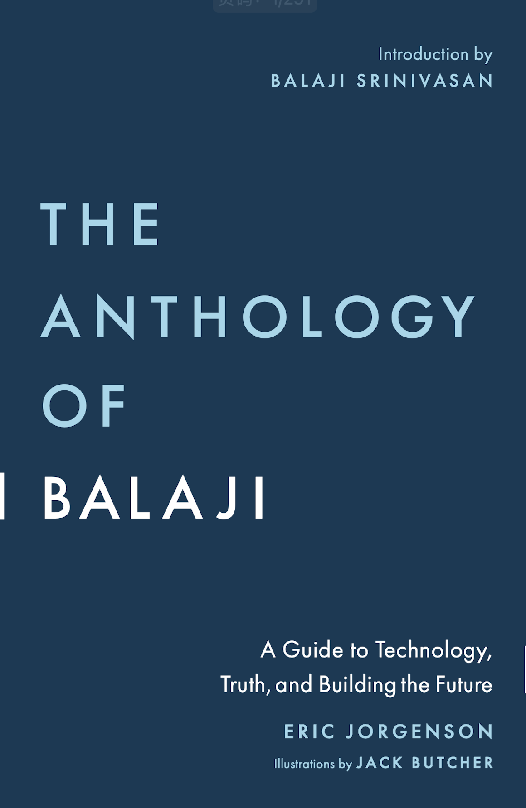

I recently read a book, The Anthology of Balaji 

{{}}

Who is Balaji? A quick Google gives us this result: Balaji S. Srinivasan is an American entrepreneur and investor. He was the co-founder of Counsyl, the former Chief Technology Officer of Coinbase, and former general partner at the venture capital firm Andreessen Horowitz.

{{}}

After reading this this book, I found out that he is an avid believer in technology. This book gives us a glimpse into how the brains of these great and brilliant entrepreneurs and investors work, business creation, investing, personal perception, management, and many other things are discussed, and I was rewarded after reading it, and then a bunch of recommendations for history, technology, and more, so I can't wait to download and read it anyway.

## Some excerpts of value

- Software savvy will continue to reap compounding rewards
- Three things in life: your truth, your health, and your wealth.
- Creators have value too: Your article or film inspires others to start a great company that solves a social problem (e.g., using fusion energy to solve climate change), and as the creator of the media, you get a share of the cash or equity.
- Didn't understand what the underlying logic was, so didn't act on it
- If, as an author, you bring value to your readers, then you earn a fraction of that value.
- Twitter is the first version of decentralised media, and Substack is the second.
- Maybe we'll see "full-stack writers" go from writing articles to making their own films, just like full-stack engineers, who go from writing programs to making products
- Individuals make the most of their creativity in their own time: great journalists may become millionaires, even billionaires. Don't choose a film, make it yourself on your computer, like Notch did with William and the Beast, and then just sell it.
- Great writers and artists should be rewarded. We just need to change the incentives.
- Wealth can be created: many people don't understand that wealth can be created. The first counter-example I give them is: Who did Steve Jobs steal all the iPhones from? If wealth is a zero-sum game, where one person's gain is someone else's loss, where did all those mobile phones come from? This simple example shows that wealth can be created.
- You can write a piece of software on your computer and create a website where people will pay you for your software. What exactly are you doing there? With no natural resources, just by tapping on a keyboard, you are creating a delightful electronic product.
- Money may appear to be a local zero-sum (after the transaction occurs, A has -1 dollar and B has +1 dollar), but in reality money is a global positive sum. In a voluntary exchange, both A and B gain wealth because they both receive non-monetary benefits from the transaction.
- Often, the raw materials are worth much less than the assembly process: the know-how, machinery, and effort required to put the raw materials together.
- The less money you need, the less dependent you are.
- Time can be exchanged for time, and time is what is ultimately valuable: I spend money so I can work harder. It sounds funny, but it's true. So for every year you work, you accumulate one to two years of downtime (money for time). These breaks can be used to start a company. It's like angels investing in themselves. This is another way you can achieve financial independence.
- Financial independence is also personal and ideological independence. If you're financially independent, the crowd can't cancel you out financially
- If you're brazen, you level up
- Here is my ranking of the types of leaders: socialists < nationalists < capitalists < technocrats.
- HOW TO GET STATUS: The hardest way to get status is to build something, to achieve something, to add value. The difficult way to gain status is to build something, achieve something, add value. The easy way to gain status is to accuse others of being bad. That's a shortcut to gaining status, and a shortcut to gaining relative status. You may be right to criticise the existing system. But you need a product, not just criticism.
- If the product works, people will buy it: Don't argue about regulation. Don't argue about monetary policy. Build Bitcoin. Don't argue about anything, just build an alternative. Don't argue with words. Build a product based on a truth that many people can't understand. If it works, they'll buy it. Their lack of understanding is your moat.
- The point of a startup is to build something you can't buy.
- It works in practice, not in theory
- You can only work on some concepts once you've actually built the product.
- Billionaires exist because they can program. Billionaires exist because they can write apps. Bill Gates wrote Microsoft's first BASIC interpreter. Larry Page and Sergey Brin created the first version of Google. Mark Zuckerberg created the first version of Facebook, and Jack Dorsey created the first version of Twitter. Drew Houston created the first version of Dropbox. Garrett Camp created the first version of Uber. Bobby Murphy created the first version of Snapchat.
- Entrepreneurship is Athletics: In trying to create something, many people who might otherwise be snarky critics, high-flying academics, or bossy bureaucrats suddenly learn how difficult it is to be part of an arena, to create, to manage employees, and to turn a profit.
- How 3D printing brings digital and physical together: think open source, 3D printing, app shops and crowdfunding. Just make something people want, no worries about the market.
- Just make something that people want and there's no worry about selling it.
- To impact the world, either start creating or invest in it: To impact the direction of technology, pick up a keyboard or invest in it. You can create something. Those who can't build only preach. Billions of people around the world are increasingly using keyboards. They have no illusions about the relative utility of preaching and building.
- Founders are credible people because they can pay a huge short-term price for coming long-term gains: Founders are usually the only credible people who can pay a huge short-term price for greater long-term gains.

## perplexity.ai summaries

### The Value of Technology

The book emphasizes the immense value and importance of technological progress throughout history. Technology is the driving force that has continuously improved our lives, lowered prices, and shaped political and economic systems. As technology advances, it allows us to accomplish more with less effort, freeing up time and resources. The author argues that we should be in a "golden age of productivity" thanks to the rapid development of powerful technologies like computers. However, people often underappreciate the incredible complexity behind the simple interfaces and tools we use every day.

### The Impact of Technology

Technology has had a profound impact on the world. It has transformed centralized systems and institutions into decentralized, distributed networks. This shift is exemplified by the rise of blockchain technology and cryptocurrencies, which represent a new frontier of digital value and alignment. Looking to the future, the book discusses how automation will deliver abundance, and how emerging technologies like life extension and transhumanism could radically improve the human condition.

### The Types of Truth

The book explores different forms of truth - scientific, technical, political, economic, and cryptographic. It argues that modern media is often misaligned with the pursuit of truth, driven more by narratives and agendas than facts. The author proposes building a "better truth machine" through decentralized media models, citizen journalism, and separating facts from narratives.

### Building a Better Future

A core theme of the book is the importance of adopting an abundance mindset and taking action to create the future you want to see. The author encourages readers to focus on building, rather than arguing. He provides a detailed framework for founding and growing successful companies and projects, covering research, ideation, validation, engineering, launching, hiring, managing, and more.The book also emphasizes the value of learning, productivity, and investing in the future. Readers are encouraged to develop broadly applicable skills, learn to think in multiple ways, and put their efforts towards building the world they want to live in.

### Balaji's Vision

Underlying the book is Balaji Srinivasan's vision of technology as a frontier that is reshaping the world. Just as the American frontier gave rise to a new class of pioneers, Balaji sees the internet and emerging technologies as creating a global "technology class" - people defined not by wealth or legacy, but by their ability to create value and found new institutions.Balaji believes these new institutions will go beyond just companies and currencies, and will eventually include new cities and even new countries. He sees the potential for technology to enable the creation of "network states" - digitally-native communities that can compete with traditional nation-states. 