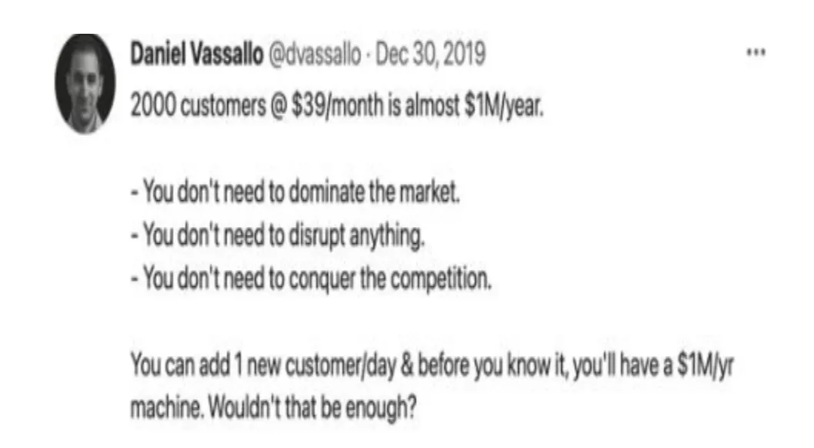

⚡️ Hi， 我是毛毛星，一名前端工程师。欢迎打开新一期的「毛毛星的投资日记 」，为您带来前端编程技术、创业投资实践主题分享。

因为每期内容比较多，合并分享没有重点。因此周刊内容做细微调整。每期单独分享一个核心主题。本期分享主题**创业投资实践**。

我从前端工程师领域给出我的专业技能模型：

消化： 基本知识
+ 工具：git操作
+ html：基本标签
+ css：布局，css优先级，动画
+ js: 原型琏、对象、闭包、ES6等概念
+ DOM：操作DOM对象
+ Nodejs：基本api

提炼：高阶
+ 工具： 
  + 包管理：pnpm, yarn
  + 构建工具： webpack, vite
  + 代码规范： eslint
  + 静态检查：typescript
+ html: 无障碍
+ css: 
  + Sass/Less
  + 响应式布局，高阶动画
  + CSS架构：tailwind、css module
+ js： 
  + 状态管理：redux、zustand、mobx、vuex 最佳实践
  + 框架： vue/react
  + 测试：Jest, Vitest
  + 模块化： umd、cmd
  + 组件化：antd
+ DOM：浏览器调试，http
+ Nodejs: 事件机制，流，网络，高级API
  
分享：资深 / 专家
+ 性能优化
+ 响应式框架设计和开发
+ 全响应式布局设计
+ 状态管理设计
+ 插件系统设计
+ serverless系统架构
+ 微前端架构
+ 安全生产
+ 项目管理能力
+ 任务分解能力
+ 低代码设计
+ 国际化能力设计

综合技能是比较通用。和上面那张图差不多：
1. 执行：60分完成任务；80分要事第一，清单和风险管理；95分横向领导
2. 交流：60分邮件沟通，清晰表达；80分公开分享、演讲，交流回应；95分情感账户，同理心倾听表达、交锋达到目标
3. 组织：60分会议纪要，任务跟进；80分：会议组织、项目复盘改进；95分：专题讨论，向上管理，推动改变

今天要谈论的话题「极简创业」，首先要从这本书开始，我五星推荐这本书：

为什么推荐这本书？是因为这本书冲破了我固有的认知，并且分享了实用的极简创业实践，普通人也能实操获得成功。

作者是Sahil Lavingia，他是一名创业的极简创业的践行者。什么是极简创业？个人理解，就是一个人从0开始创建发展的不以独角兽为目标的小型数字化企业。

首先项目是个人发起、销售到最后发展成一个小型企业。这种企业不以独角兽为目标，也就是不追求规模，一开始就要盈利，风险低，可重置开始。

## 极简化认知

如何开始：

* 通过数字内容（视频、电子书、播客和课程）出售您的知识并教导人们。案例：  Lynda.com  - 时间效用
* 销售实物产品。 案例： Kickstarter销售发光电子背心  - 形式效用
* 固定费用或百分比费用连接人们。案例：克雷格·纽马克 (Craig Newmark) 创建了 Craigslist； People First Jobs 将公司与候选人联系起来，通常会收取固定费用 - 时间效用
* 软件即服务 (SaaS)。 案例： 始于消除中断的小想法（远程工作人员需要不断应对 Zoom 会议的要求和 Slack 的干扰）， Product Hunt上构建了最终成为异步语音消息应用程序的第一个迭代Festival - 时间效用

以上不同的业务类型，归纳起来就是四种类型： **地点效用、形式效用、时间效用和占有效用** 时间和形式效用比较好理解，上面标识出来了。而占有效用表示： 物品所有权转移，给需要的人；地点效用表示： 转移到另一个地方销售获利

---

行动：

1. 想法毫无价值，行动胜于一切。**你所做的或学到的一切都不会被浪费，重要的是开始。**

2. **没有一本书可以包含你开展业务，或者说赚钱所需要了解的所有内容**。首先要掌握正确的思维过程，这本书讲的就是你应该如何开始，以何种方式发展你的业务。

3. 极简创业的业务领域：面向消费者，具有快速的客户反馈和充分的迭代机会。比如Saas、数字与物理电子产品和服务，或者，将人们联系起来以提供信息，收取费用。

---

客户验证：

1. 利用现代化工具，花最少的钱，快速构建原型进行客户验证，不要问引导性问题。

2. 前期确定性越高，意味着更多股权和筹款条约更好

3. 从利基市场（满足特定的专业需求）选择规模适中的市场，因为规模适中，所以大公司竞争不那么激烈。选择的客户范围要足够小，并且愿意花钱解决问题。

4. 创造产品是一个发现过程，而不仅仅是实施，技术是应用科学。

当完成这个有效验证，就是Y Combinator 的创始人 Paul Graham 所说的“效用量子”：至少有一些用户会很高兴听到它，因为他们现在可以做某事他们以前做不到。”

5. 这个验证过后的结果，就是数字产品： 你可以发布有价值的这个文件或链接。数字产品可以是任何东西。从应用程序的独家构建的链接，到秘密的博客文章，再到您花费数小时设计的图标。

案例：Gumroad 让创作者创建、编辑和删除产品，并允许消费者查看它们（“阅读”它们）。 Stripe 使付款变得容易，而 PayPal 使付款的发送变得容易（尽管一开始是手动发送）。Gumroad 当时没有文件上传功能（必须在购买后指定目标 URL，例如 YouTube URL），而且没有自动付款或费用计算。那都是手动的。整个应用程序由 2700 行代码组成，大部分是复制粘贴到单个 Python 文件中，托管在 Google 云上。 但是它有效！它解决了问题。

---

产品化：

1. **数字产品永远不会准备好，关键是有效**。围绕问题建立一个流程（或者清单），让客户做以前不能做的事，客户愿意付费，才是有效。然后将其中的一部分变成了产品，甚至完全自动化。

2. 产品化要是你喜欢的，可货币化，并且具有内在成长价值。

3. 定价是必须的。除非是广告模式，否则必须要收费。并且价格是随着产品或者需求可以变化的，一般是上涨，可以为超级用户定义更高的等级。行为经济学家丹·艾瑞里 (Dan Ariely) 在《可预见的非理性》一书中所写的那样，“人们会追求免费的东西，即使这是他们不想要的东西。”他举了一个例子，一群大学生排着长队等待免费的、非常不健康的布朗尼蛋糕。即使只被要求支付一分钱，孩子们的队伍就会消失。

4. 美观不是关键，即便是有缺陷，客户也愿意付费。 案例： Craigslist

--- 

销售： 

1. **销售是必须的一环，客户就是商业模式。通过客户共同成长，问题发现，到产品和市场契合度提高**

2. 销售不是一开始就是卖给陌生人，是从讨论问题，到解决开始。要分享你的故事，你是谁，你的产品是什么，人们关心人，喜欢教导、激励、取悦他人。这样让陌生人成为你的粉丝。

3. 输出你的价值观，同类人会找到你，并且和你合作

4. 定期在社区教学分享是很好的飞轮。能激发自己的好奇心和灵感；让自己了解更多知识的最佳方式；当公开学习，学生的问题迫使你学得更多。

5. 向客户学习，不要放弃，客户本可以把注意力放在其他地方，但是选择了放在你身上

6. 营销是后话，100个客户前不需要营销。只需要一个优质营销渠道，无效时再进入第二个渠道。注意，不要花你没有的钱。

7. 你需要的客户比你想象中的要少。

8. 前期销售反映市场契合度的就是**回头客**，回头客保证你有时间可以扩展新的业务。

9. 复盘，将每一次失败转换为洞察力

10. **早期的增长，人工“销售”占99%，后期的增长，口碑占99%。** 

11. **你需要的客户比你想象的要少得多。** 案例 - 当 Slack 于 2020 年以 160 亿美元的估值进行 IPO 时，其发行文件显示，其 575 名客户约占其收入的 40%。

不需要占领市场；不需要扰乱秩序；不需要战胜竞争对手。只需要每天赢得一个客户。

12. **关注规模较小、可靠的客户可能比采取围观态度更有意义。** 案例 - Ben Chestnut 和 Dan Kurzius 首先创办了一家名为 Rocket Science Group 的网页设计机构，专注于大企业客户，但同时他们也建立了 Mailchimp，这是一项针对小型企业的电子邮件营销服务。他们经营这两家公司大约七年时间，直到 2007 年关闭了网页设计机构，因为他们发现为小企业工作可以让他们自由地发挥创造力并快速适应客户的需求。

13. 寻找你的社区，谈论你的旅程（比如产品里程碑），突出你的客户，并获得真实的报道。

14. 关注并解决社区的问题，反馈并不断迭代完善，让客户相信你的确能解决他们的问题，第一批客户能帮你走到更远。

15. **客户就是商业计划**。密切关注客户始终为自己提供指导和服务。”不是销售。不是营销。接受客户教育，和让客户被教育。

## 极简化实践

1. 筹款途径列表：

* 朋友、家人亲戚、附近的天使投资
* 个人财富管理公司、天使集团、种子阶段风投
* 滚动基金
* 众筹
* 首次代币发行（ICO）

2. 招聘

当需要完成某事时，开始写工作描述，而不是立即自己动手开始干，要平衡成本，可以考虑外包工作。

可以招聘独立工作并且具备广泛技能、交叉角色的员工 

比如经营过网站等有副业、花了一年时间写书。相关书籍 - 杰夫·海曼《招募摇滚明星》

3. 企业结构

客户足够多时，才创业有限责任公司（自力更生或者自筹资金适用LLC或者S型企业，工具 - ZenBusiness）

4. 原型工具

* Invision原型工具
* Bubble无代码构建器
* Draftbit移动应用程序
* 简单网站： 向潜在客户介绍您计划创建的内容

5. 客户验证

* 《the mum test》罗布·菲茨帕特里克 (Rob Fitzpatrick) 

6. 快速构建

+ 在手动/半自动化基础上极简化流程
+ 设定截止日期2/3天构建解决方案，定价收费

* 更多资料
  * Sean Ellis 的《Hacking Growth》
  * 凯文·凯利 (Kevin Kelly) 的博客文章“1,000 个铁杆粉丝”
  * [《How We Gather》](https://caspertk.wordpress.com/2015/04/18/how-we-gather-a-new-report-on-non-religious-community/) - casper ter kuile 
  * 盖伊·拉兹 (Guy Raz) 的《我是如何构建这个》播客中收听 Calendly 的 Tope Awotona。
  * 在 Twitter 上关注 Anne-Laure Le Cunff (@anthilemoon)。

+ Makerpad.co 如何连接 Gumroad 和 Carrd 以接受网站上的订单，而无需编写任何代码。当准备好自动化手动履行流程时，如何添加 Airtable、Google Forms 和 Mailchimp。
+ Notion: 用它来运营整个公司
+ Zapier: 自动连接您使用的所有软件之间。
+ 相关书籍： Getting Real，这是一本由 Basecamp 编写的关于构建 Web 应用程序的免费“书”，可在线获取 https://basecamp.com/books/getting-real。

7. 常用营销渠道

* 冷电子邮箱
* LinkedIn(B2B)
* 内容营销
* 付费广告
* 社交媒体营销
* 产品主导型增长
* 推荐或者联署合作关系
  
8. 检查市场契合度

* 提高市场契合度的方法：
   * 改变消息传递以吸引更有利可图的买家；    * 关键功能和竞争对手保持同等水平；
   * 调整定价以吸引不那么节俭的客户
   
* 契合度高表现： 
  * Inbound organic interest
  * 源源不断的客户主动推荐
  * 付费用户流失率低
  * 价格不敏感（提高价格，没有人抱怨）
  * 拥有注册并自行使用你产品的回头客，你可以开始专注于向外推销。
  
* 相关书籍  
     * 《初创公司用户手册》Steve Blank 和 Bob Dorf。
  
当契合度高时，想企业家一样思考：将自己从编写代码、创建营销文案、进行销售电话以及处理不满的客户中抽离出来

9. 市场契合度高

* 盈利能力至于增长之上
* 以价值为导向工作 -《每周工作 4 小时》蒂姆·费里斯 (Tim Ferriss)

* 相关书籍
     * 《The E-Myth Revisited》迈克尔·格伯 (Michael Gerber) ： 如何离开“技术员”的舒适位置为您的企业构建“特许经营原型
     
     
10. 公司名字

“广播测试”：如果有人在广播中听到您公司的名称，可以使用 Google 找到它。名字并不重要。如果你成功了，你的名字就会感觉很正确。

11. 建立网站 + facebook页面

+ 如果有人问你在做什么，你可以给他们一个可以查看的 URL（如果不能查看的话！）。一开始，您应该用它来解释您的产品的用途，并为可能对此感兴趣的人提供一封电子邮件，即使您还没有产品。您可以而且应该始终与潜在客户学习并互动。
+ 建立一个网站并创建一个电子邮件地址。网站相当于您的实体店。将其连接到网站建设平台，如 Carrd、Gumroad、Wix 或其他平台。使用该域为您自己创建一个电子邮件地址（例如 sahil@gumroad.com）以及密码管理器。
+ 创建社交媒体帐户。一组用于个人，一组用于企业
+ 让客户轻松付款。获取 Square 或 Stripe 帐户。费用约为 2.9%，每笔交易另加 30 美分。 （等到有一些客户后再成立一家有限责任公司）
+ 发布文章。

12. 定价

+ 基于固定成本： 比如服务器费用/工程师付出的时间，收取20%毛利。零售时再贵一些。案例 - Itunes或者iStockPhoto。
+ 基于价值：案例 - Netflix 有一个多屏功能，不需要花费任何金钱（除了最初发布该功能的工程成本），但他们可以按月收取费用。
+ 分级收费： 基础版、专业版、企业版
+ 相关书籍：《可预测的非理性》，一本关于人类心理学和定价的书

13. 销售：获取100个客户

请朋友喝个咖啡或者吃个饭，明确感谢他们支持你的产品，并且提供反馈，不要求他们评论，或者推荐给其他朋友。

切勿过度销售。**诚实、开放、始终友善**。向他们展示您最近如何改进您的产品。告诉他们最近的失败。**不要向他们推销你的产品，而是向他们介绍你的旅程和学习。**

登门拜访，邮件，电话，通过网络寻找目标客户。**不要通过搜索引擎优化、内容营销等手段** 大部分会人会拒绝，但是有个别人会说OK。你要能接受大部分的拒绝时，把拒绝当作学习的机会。通过好的反馈发现问题。

案例： 比如一封简单的邮件

> 嗨, 约翰，我看到您正在使用 PayPal 在您的网站上销售 PDF，并手动向购买 PDF 的每个人发送电子邮件。我建立了一个名为 Gumroad 的服务，它基本上可以自动化所有这一切。我很乐意向您展示它，或者您可以自己查看：gumroad.com。
  

14. 销售

相关书籍： 戴尔·卡内基 (Dale Carnegie) 所著的《如何赢得朋友并影响他人》

15. 感谢

当达到100个客户时，你可以通过某种方式感谢客户。

## 关于我

上一周因为身体不适，感觉又阳了，加之工作时间安排较多，周末无时间阅读学习。 

本周末又出去团建。加上朋友周末来家里吃饭，时间更小了。不过，好在中间利用零碎时间，看了完半本书籍，然后写下这篇文章。

运动2/3次体操，还有几次俯卧撑，乒乓球，基本达标了。目前体重67kg(170cm）。

